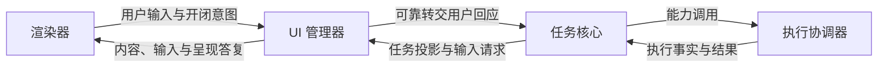
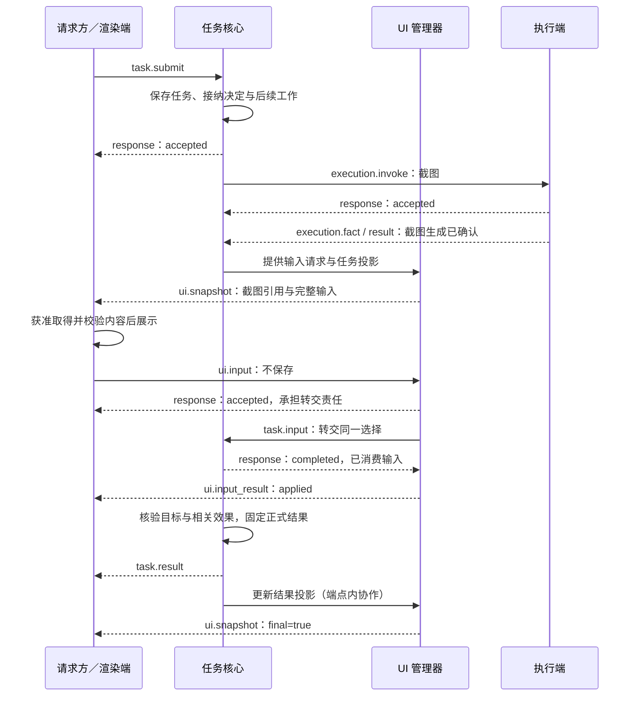
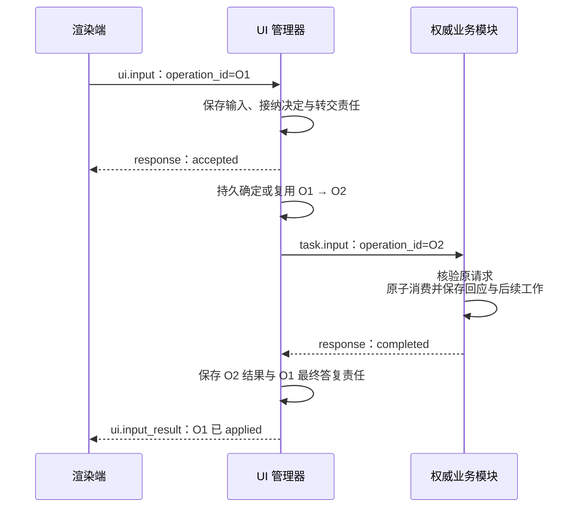
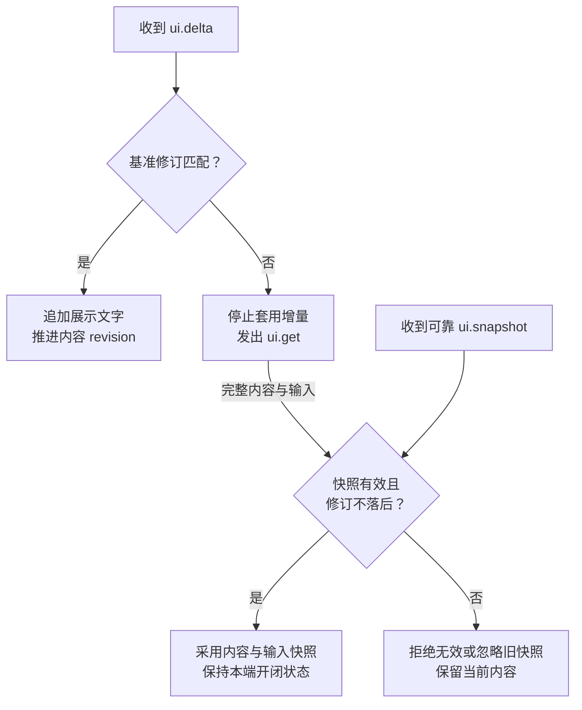
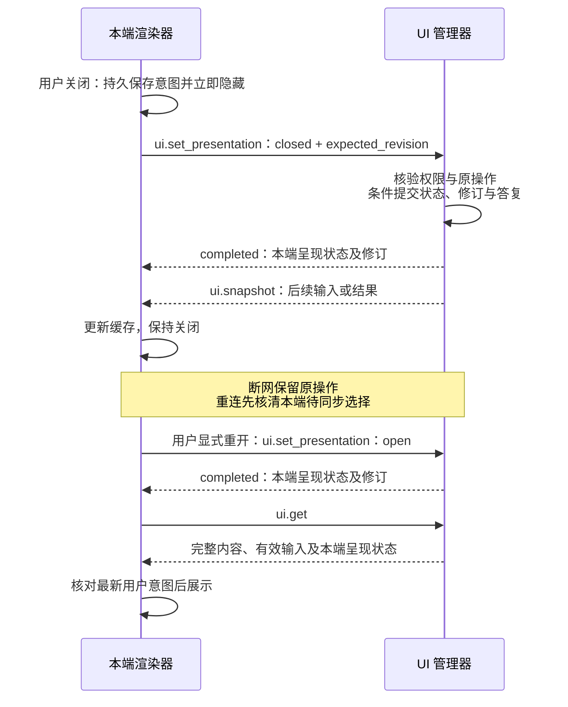

# 任务执行与 UI 交互

[总览](README.md) · [可靠交接](message-contract.md#handoff) · [恢复与控制](recovery-and-control.md) · [消息查阅](#catalog)

本页规定任务、执行与 UI 如何交接事实和用户输入。任务核心裁决任务进展，执行协调器核对操作效果，UI 管理器保存界面及输入转交责任；三者共用可靠交付，各自保存处理决定。界面可以关联任务，也可独立存在。

以下是尚未发布的 v1 契约，运行实现待验证。交互端点须支持 `ui.get@1`、`ui.snapshot@1` 和 `ui.set_presentation@1`；必要能力缺失时拒绝启用交互。跨端协作还依赖当前身份、授权及领域恢复依据，缺少所需接口或证据时，依赖它们的行为保持受限，见[恢复前提](recovery-and-control.md#resume)。

## 1. 分别保存业务事实、界面内容与本端选择

**UI 管理器**是界面状态管理器的简称。**Surface** 是由 `surface_id` 标识的一份可恢复界面内容；它的内容与输入投影可以共享，各渲染端独立决定是否打开。下图按逻辑职责绘制，箭头表示业务交接，不规定部署位置；任务派发的调度与可靠收发在图中省略。

| 独立事实 | 保存与裁决方 | 判定边界 |
| --- | --- | --- |
| 任务状态、修订与正式结果 | 任务核心根据目标及操作事实裁决 | 界面显示成功不构成任务完成依据 |
| 操作记录、执行阶段与效果 | 处理操作的业务模块保存；执行协调器核对执行操作 | 过程结束不代表效果已知或任务目标已达成 |
| Surface 内容修订及输入投影 | UI 管理器保存共享内容，按 `revision` 更新 | 内容刷新不改变本端开闭，也不消费业务输入 |
| 每端呈现状态及修订 | UI 管理器保存已确认状态，渲染端保存本端用户意图 | 一端关闭不关闭其他端，不取消任务或已接纳输入 |
| 输入请求及消费事实 | 发起请求的业务权威以 `input_request_id` 定义内容、期限与消费条件；UI 保存投影和转交记录 | UI 接纳仅确认承担转交责任，输入生效须由业务权威确认 |

首期同一用户的任务及内核操作由一个固定的[任务写权威](../task-kernel/lifecycle.md)裁决，可位于端侧或云端。父子任务共用该权威、分别承担推进责任；执行端可以分布部署。协议中的一个业务操作由 `operation_id` 关联其请求、进展和结果，不与任务或界面标识混用。

以下选择使断线恢复不依赖界面仍然存在，代价是分别维护状态和交接记录：

| 选择 | 原因与主要代价 |
| --- | --- |
| UI 接纳与业务消费分开提交 | UI 可先持久接管转交责任，业务按当前条件裁决；须保存固定的父子操作关联，并向渲染端分别报告接纳与生效 |
| 完整快照恢复交互，临时增量只追加展示文字 | 渲染端不必重放历史事件才能恢复有效表单；快照包含完整内容和输入，传输成本高于只发差量 |
| 共享内容、每端开闭与正式结果分别恢复 | 关窗后任务和已接纳输入仍可继续，结果也可超窗查询；须分别维护内容修订、呈现修订和业务结果保留依据 |

例如，进度刷新把内容修订从 7 推到 8，不改变本端呈现修订 2 或有效输入请求。用户随后关闭，只推进本端呈现修订；已接纳输入继续转交，业务消费后 UI 更新内容，界面仍保持关闭。`seen_revision` 表示用户看到的内容，`expected_revision` 用于条件更新本端呈现状态，两者不能互换。

## 2. 条件场景：先查看截图再回应

首期无中间预览的同宿主链路见[整体设计推演](../design-walkthrough.md)。下面保留[截图示例](examples/task-ui-flow.json)说明另一种条件场景：用户先查看设备截图，再选择不保存为持久任务成果。运行前须落实 [UI-P3](../application-and-interaction/validation.md#proposals)，让核心提供可恢复的中间投影和输入与必需预览的结构化绑定；示例中的跨端执行还须满足[授权与执行领域依据](README.md#scope)。默认 ReadTask／ReadResult 不能提供这份执行中截图，条件不齐时依赖预览的输入保持关闭；UI 不能直接读取执行存储补齐任务事实。

图只描述上述前提齐备后的交接。请求方兼渲染端，任务核心与 UI 管理器同端；临时截图、内容读取及呈现已获准，界面由用户[显式打开](#presentation)。图中省略握手、交付回执和开闭过程；协议消息名省略 `harness.` 前缀。静态消息能承载截图引用和输入字段，不等于中间呈现提供方已经实现。

`task.result` 返回原请求方，UI 管理器据任务状态更新投影。同一逻辑端点内的协议消息可本地交接，仍遵守相同类型和[持久保存规则](message-contract.md#handoff)，无须绕行云端。图中的“不保存”只表示不将截图列为持久任务成果，临时副本按获准生命周期清理。

关联任务的 `execution.invoke` 须携带 `task_id` 与 `owner_epoch`，执行端复核控制权及授权；独立获准操作可不关联任务。调用依照已验证目录中的 `capability`、`capability_version` 和参数声明检查，不能把任意 `arguments` 转为可执行代码。

执行结果分别报告过程阶段 `state`、执行事实 `execution` 和效果 `effect`；`state=finished` 只说明过程结束。任务核心取得目标及相关效果依据后才能判定 `completed`，所需引用内容可读取且可验证后才能确认交付完整。结果丢失时先查原操作，不能因超时重新截图；任务取消后仍可保留待核对效果，具体裁决见[效果核对与取消](recovery-and-control.md#retry)。

## 3. UI 保存转交责任，业务权威消费输入

输入请求的标识、含义与消费条件由业务权威固定。UI 接收回应后先保存输入、接纳决定和待转交责任，再返回 `accepted`；首次转交前必须持久确定 UI 父操作与业务子操作的关联。两处业务提交不要求跨模块事务，UI 据子操作的持久结果返回最终 `applied` 或失败结论。

下图以 UI 操作 O1 转交为任务操作 O2 为例，输入权威也可以是其他业务模块：

任务核心依次核验身份与当前权限、原操作、任务是否仍接纳输入、请求有效性与格式，以及是否已被其他操作消费；成功时原子保存消费事实、回应与后续工作。`task.input@1` 同步返回 `completed` 或拒绝，没有额外的 `accepted` 阶段，详见[任务输入消费](../task-kernel/lifecycle.md#wait)。接纳答复和最终结果均可靠交付。

| 中断或竞争 | 继续者与处理规则 |
| --- | --- |
| UI 已接纳，尚未固定子操作即崩溃 | UI 从输入与待转交责任恢复，持久确定唯一关联后首次转交；已有关联时必须复用 |
| 子操作已发出，答复丢失 | UI 查询或恢复同一子操作；业务权威返回原处理结果，不能新建子操作重复消费 |
| 同一操作重投或重复点击 | 沿用 `operation_id`，返回原处理状态或已固定结果；不能改变原回应内容 |
| 多端以不同操作回应同一请求 | 业务权威原子消费，只允许一项生效，其他返回冲突 |
| 仅进度刷新 | `seen_revision` 不必等于最新内容修订，输入请求仍有效即可继续判断 |
| 动作含义或输入要求变化 | 旧动作拒绝；输入要求变化须新建 `input_request_id`，不能复用标识改变含义 |
| 首次消费时任务已取消、请求到期或格式不符 | 业务权威可靠返回拒绝、过期或冲突等结论，UI 保存并报告，不推进任务 |

最容易误判的情况是 O2 已消费、答复丢失，此时用户关闭界面，另一端又回应同一请求。UI 继续核对 O2，另一回应由业务权威判冲突；关闭端保持关闭。重开界面不复制输入、不延长请求期限，也不把旧回应绑定到新请求。

`ui.action` 只提交 `surface_id`、`seen_revision` 和 `action_id`。UI 从已保存的动作记录解析意图，再按当前权限生成请求；客户端不能指定任意目标接口。表单及 `submit_input` 动作统一生成 `ui.input`，不能再通过 action 创建第二次输入操作。

输入生效只说明该次回应已被业务采用。授权仍须由授权服务裁决；通用 task／UI 输入尚无授权确认的端到端证明，不能把“同意”文本或 `applied` 当作许可签发。现行受信确认入口及跨端待决边界见[身份接口](../identity-and-authorization/contracts.md#interfaces)。

## 4. 用完整快照恢复内容与有效交互

`ui.get@1` 和 `ui.snapshot@1` 在同一内容修订下给出完整 `view` 与 `input_requests`，包括输入用途、期限和约束。独立 UI 使用同一机制；渲染端不必补齐历史 `ui.input_requested` 或另查任务才能恢复交互。表单及 `submit_input` 动作须关联快照内有效请求，表单约束与请求一致，无有效请求的交互不进入当前快照。

临时 `ui.delta` 仅向既有 text／markdown 块追加文字，通过 `base_revision` 绑定基准。表单约束、按钮或授权含义变化时发送可靠快照，需要改变输入要求时建立新请求；最终呈现同样使用可靠快照。下图只描述渲染端的内容缓存，采用新内容不改变开闭状态：

快照修订单调推进，旧快照不能覆盖较新内容。UI 获知请求已消费、失效或到期后，移除相应输入与交互并推进修订；渲染端到期停止提交，业务权威在消费时仍复核。快照不保证跨模块瞬时一致，重新打开也不复活过期请求；已提交输入沿原操作核对。

视图使用 `{type, version, data}`，首版为 `harness.ui.document@1`。渲染器选择布局、配色和原生控件，复用声明式交互语义；支持的元素见[视图查阅](#view-reference)，扩展按[视图能力](extensions.md#views)协商。

## 5. 关闭立即隐藏，打开须确认并取得有效内容

每个用户、源端点与 surface 组合有独立呈现状态，初始为 `closed`、修订 `0`。源端点取自已验证身份，客户端不能指定其他端的呈现实例。只有显式用户操作发起 `ui.set_presentation@1`；请求携带 `open`／`closed` 意图和期望的呈现修订。

UI 先验证身份、对象访问及当前披露权限，再查原操作。已保存的成功或拒绝原样返回，不能因去重而披露当前无权读取的答复。新操作继续核验行动权限与期限，再比较期望修订：一致时原子保存状态、`expected_revision + 1` 及同步答复；不一致返回 `core.precondition_failed`。修订达到 uint64 上限时拒绝新增修改，不允许绕回。同一操作重投不递增修订，也不改写原决定。

下图展示同一渲染端关闭、接收后台更新和显式重开的过程；每次开闭均为独立的用户操作：

关闭意图在发送前持久保存，离线仍立即隐藏，重连沿原操作、原请求同步。关闭期间任务及已接纳输入继续按各自契约处理，可以按获准策略提示用户；后续输入、正式结果和快照均不能自动打开该 surface。

迟到答复、旧查询及快照不能覆盖更新的本端选择。条件冲突后，渲染端读取已确认状态，再按本端最新显式意图决定是否发起新的条件提交；只协调尚未落实的选择，不无限自动重试或以新操作覆盖更新意图。未核清待同步选择时保持关闭，打开确认后仍须取得有效内容快照。

`ui.get@1` 返回内容、输入及请求源端点的呈现状态，读取不隐含打开；`ui.snapshot@1` 只推送内容与输入。`final=true` 表示结果呈现，不改变开闭或任务事实。任务结束不自动销毁界面，开闭统一由 `ui.set_presentation` 处理。

## 6. 正式结果独立于消息窗口和界面恢复

正式结果在任务终态时固定。`task.query_result@1` 以 `task_id` 查询完整原 `task.result`，包括原修订、摘要及成果引用；它走只读恢复通道，不要求原消息仍在交付窗口、UI 仍存在或请求方知道执行子操作。任务权威按独立业务与内容保留策略保存依据，清理交付载荷不能删除仍须保留的正式结果。

查询先验证身份、任务访问及当前披露权限，无权时不透露对象是否存在。只有获准查询后，才按以下情况返回；成果查询不扩大保存、同步或披露权限。

| 查询时的情况 | 返回事实与后续处理 |
| --- | --- |
| 任务尚未终结 | 返回 `core.precondition_failed`，不触发执行或生成结果 |
| 已终态、原结果仍保留 | 返回固定原结果；迟到事实及当前 `effects_pending` 另由 `task.query` 返回，不改写原结果 |
| 已终态、结果已按策略清理、删除或依据缺失 | 返回 `task.result_unavailable`、`retry=never`，不以当前摘要伪装完整原结果 |

取得原结果后，请求方还须独立取得并核验所需引用内容。内容暂不可取、失效或无权读取时，保留原结果事实并分别报告内容获取情况，不能确认交付完整。结果不无限保留，内容提供端也不保证永久在线，完整约束见[内容交付](message-contract.md#delivery)。

某次取消的固定答复是另一个操作的结果；现行查询尚不能在超出消息窗口后完整重建它，不能用正式任务结果或当前状态代替，见[取消查询缺口](recovery-and-control.md#cancel)。

## 7. 消息与视图查阅

所有业务请求均有同名同版本 response。副作用请求带独立 `operation_id`；纯查询只读，`task.input` 和 `ui.set_presentation` 同步返回 `completed` 或拒绝，获接纳的异步操作先返回 `accepted`，再可靠返回最终事件。原请求、响应及事件的精确关联见[线格式](wire-format.md#response)，完整字段以 [task](schemas/task.schema.json)、[execution](schemas/execution.schema.json)、[ui](schemas/ui.schema.json) Schema 和[注册表](schemas/standard-registry.json)为准。

| 消息 | 成功含义或结果入口 |
| --- | --- |
| `task.submit` | 接纳任务责任，最终 `task.result` 沿用提交操作身份 |
| `task.input` | 输入已原子消费，同步答复 |
| `task.cancel` | 接纳取消意图，最终返回 `task.cancel_result` |
| `task.query`／`query_result`／`query_operation` | 分别查询当前任务、固定正式结果、任务控制操作处理状态 |
| `task.status`／`input_requested` | 任务状态与业务输入请求事件 |
| `execution.invoke`／`cancel` | 分别接纳原调用或取消操作，最终返回 `execution.result`／`cancel_result` |
| `execution.query`；`progress`／`fact` | 查询原操作；临时进展／可靠执行事实事件 |
| `ui.input`／`action` | 接纳转交责任，最终返回 `ui.input_result`／`action_result`；`query_operation` 查询原 UI 操作 |
| `ui.get`；`snapshot`／`delta`／`input_requested` | 读取内容与本端呈现状态；完整快照／临时文字增量／输入投影事件 |
| `ui.set_presentation` | 本端呈现状态条件更新成功，同步答复，不产生异步最终事件 |

取消请求有自己的 `operation_id`，与被取消的原调用分开；取消结果关联取消操作。查询不创建新操作，窗口内恢复沿用原结果消息，不能用原调用完成事件替代取消答复。

### 结果与呈现载荷

| 消息类型 | 关键字段与关联 |
| --- | --- |
| `task.query_result@1` | 请求含 `task_id`；成功 `result` 为完整固定的原 `task.result`，包括适用成果引用；当前状态另查 `task.query` |
| `ui.snapshot@1` | 必含 `input_requests`，与 `view` 属于同一内容修订；只更新内容，不改变呈现开关 |
| `ui.get@1` | 返回完整快照及请求源端点的 `presentation={revision, state}`；未建立呈现记录时为 `0`／`closed` |
| `ui.set_presentation@1` | 请求含 `surface_id`、`expected_revision`、`state`；成功答复含 `surface_id`、`revision`、`state`，只更新源端点呈现记录；期望的呈现修订与共享内容的 `seen_revision` 不可互换 |

### 声明式视图元素

| 元素 | 首版支持与约束 |
| --- | --- |
| text／markdown | 纯展示，按安全渲染规则处理，不运行脚本 |
| content | 受控内容引用，校验媒体类型、摘要与访问权限 |
| form | text、number、boolean、choice 字段，约束关联权威输入请求 |
| actions | submit_input、cancel_task 声明式意图；动作标识在当前界面中唯一 |
| 自定义视图 | 协商类型版本及显式 fallback，不由渲染器猜测转换 |

## 8. 示例与验证入口

[task-ui-flow.json](examples/task-ui-flow.json) 展开握手、任务提交、截图、输入和最终呈现，是第 2 节条件场景的静态消息串。只有 UI-P3 和所需跨端领域依据齐备后，才将它用作运行链路；首个同宿主基线沿[整体设计推演](../design-walkthrough.md)，目前没有对应的新 JSON 消息串。端点尾号 1 为渲染端，2 为云端任务核心与 UI 管理器，3 为执行端；2 → 2 的 `task.input` 是本地可靠交接。截图能力为 `com.example.device.capture@1`，参数见[示例 Schema](schemas/example-extension.schema.json)的 `device_capture_arguments`。累计回执集中在示例末尾便于阅读，实现须按回执策略及时确认。

[result-and-presentation.json](examples/result-and-presentation.json) 分别展示多端开闭与结果超窗查询：关闭的迟到答复不覆盖后来重开；原正式结果修订为 9，当前状态修订为 10，两者分别查询。所有可靠消息以 `delivery.scope` 绑定业务作用域，时间和持久记录是静态前提。

运行验收重点覆盖本页的责任交接：UI 接纳前后及固定子操作前后崩溃，业务已消费但答复丢失，多端争答及过期输入，关闭后后台更新与迟到开闭答复，原结果超窗和引用内容不可取。须分别检查持久责任、原操作结果、内容及呈现修订，完整刺激与预期见[验收矩阵](validation/README.md#runtime)。Schema 和消息串只证明静态结构与关联，不能证明并发、持久恢复及实际效果；完整取消结果的超窗查询仍待补齐。
