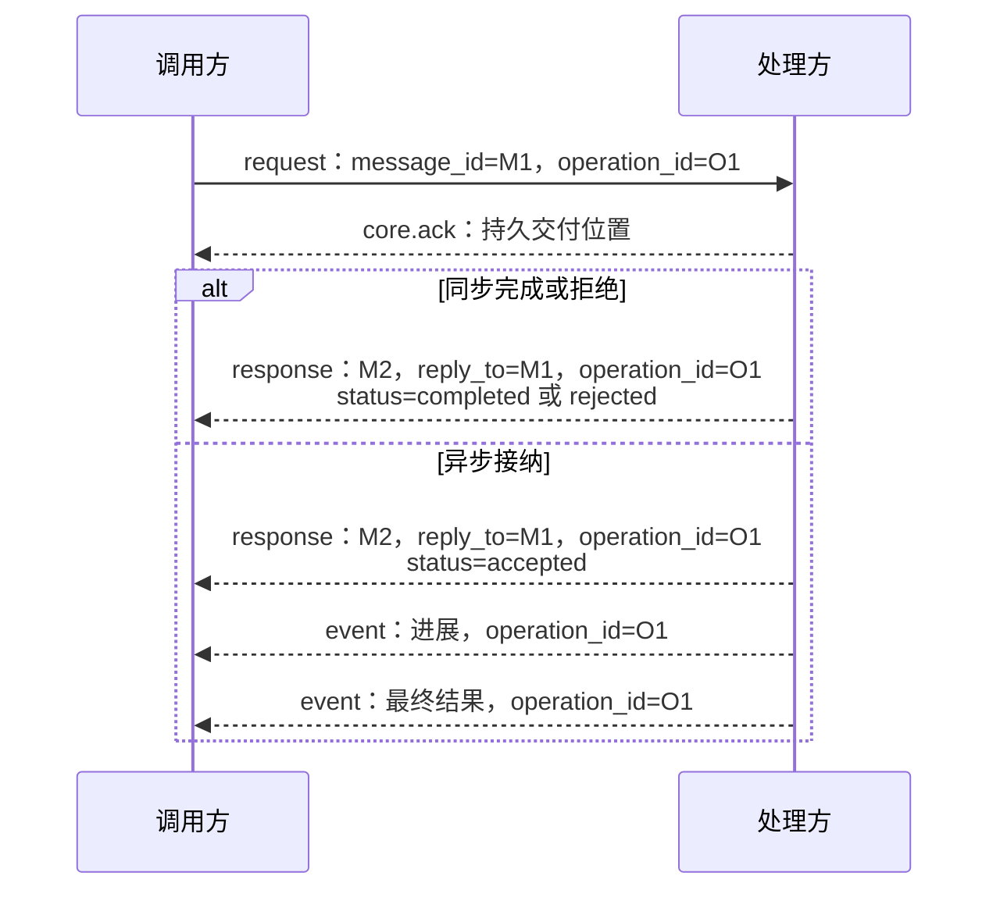

# 线格式与字段查阅

[总览](README.md) · [消息语义](message-contract.md) · [传输绑定](transport.md#reference) · [扩展声明](extensions.md#manifest)

本页集中定义 v1 的公共字段与解析规则，供实现者按“信封 → 请求关联 → 交付期限 → 编码 → 错误”查阅。可靠交接的职责见[消息契约](message-contract.md)，任务、执行与 UI 的行为见[领域契约](task-and-ui.md)；结构合法之后，接收端仍须核对身份、流绑定及业务前提。

当前版本尚未发布，正文与 Schema 同步修订；正式发布后按[版本规则](extensions.md#version)冻结同版结构和语义。类型必须先安装再参与通信，消息不能触发远程 Schema 下载。JSON Schema 使用 Draft 2020-12，`$id` 中的 `https://harness.invalid/protocol/v1/` 仅作为离线资源标识。

## 1. 公共信封

公共信封承载身份关联、交付和类型选择；`task_id`、`surface_id`、界面修订和任务控制权版本由领域载荷定义。下表是字段归属，具体类型可通过注册声明收紧要求，不能放宽公共约束。

| 字段 | 类型 | 必填条件与约束 |
| --- | --- | --- |
| `protocol_version` | 整数 | 所有消息，v1 为 1，与会话一致 |
| `message_id` | UUIDv4 | 所有消息，一次逻辑消息一个标识，重投不变 |
| `kind` | 枚举 | 所有消息，request／response／event／control |
| `type` | 命名空间字符串 | 所有消息，如 harness.task.submit |
| `type_version` | 正整数 | 所有消息，具体类型独立发布 |
| `source`、`target` | UUIDv4 | 所有消息，在用户作用域内核验源与目标逻辑端点 |
| `reply_to` | UUIDv4 | response 必填，指向请求 message_id；control 直接答复按类型要求携带，request／event 禁止 |
| `operation_id` | UUIDv4 | 副作用或长期工作的请求及其响应、进展和结果必填；纯查询可省略，control 禁止 |
| `delivery` | 对象 | request／response／event 必填，control 禁止 |
| `authorization` | 对象 | request 必填，v1 为 `{ "grant_ref": "…" }`；其他类别禁止 |
| `expires_at` | 时间字符串 | request 必填，新行动最迟可启动时间；其他类别禁止 |
| `payload` | 对象 | 所有消息，由已安装类型 Schema 定义 |
| `extensions` | 对象数组 | 业务消息可选，control 禁止；同名附加项不得重复 |

用户来自受信会话，委派主体来自受验证授权；顶层没有供客户端自由填写的 `user_id` 或 `actor_id`。接收端将 `source` 与受信来源绑定，不能仅凭信封中的标识认定身份，具体检查见[身份与隔离](message-contract.md#isolation)。

回复和事件通过来源、原操作或订阅关系及内容使用权限校验，不重新携带行动授权引用；主动 UI 推送仍需获准会话或订阅。这样存档回复无需保存可复用的行动凭证。

## 2. 请求、响应与异步事件

请求响应回答本次请求是否接纳或完成，后续事件报告原操作的进展与结果。图中的 M1、M2、O1 是阅读用别名，实际使用 UUIDv4；消息名省略 `harness.` 前缀。箭头表示协议消息，省略本地持久提交；`core.ack` 只确认交付位置，不裁决业务结果。

| 响应状态 | 载荷与成功边界 |
| --- | --- |
| `completed` | 附类型指定的 `result`，表示该请求完成；查询完成或输入已消费不等于整个任务完成 |
| `accepted` | 附类型指定的接纳信息，处理方已承担后续责任；执行与效果由后续事实或结果说明 |
| `rejected` | 附 `error`，不携带成功 `result`；调用方按错误指示继续 |

各请求允许的状态由类型 Schema 限定，并非所有请求都有三种分支。response 沿用请求的 `type`、`type_version` 和适用的 `operation_id`，交换 `source`／`target`，通过 `reply_to` 关联请求。后续事件使用独立 `type` 和 `message_id`，保留对应操作标识。

接纳答复须持久保存，重投返回原决定，不重新创建操作。回执或答复丢失后的消息重投与操作核对分别遵守[可靠交接](message-contract.md#handoff)和[操作恢复](recovery-and-control.md#retry)；收到 `accepted` 后也不能把尚未取得的最终结果推断为成功。

| 操作关系 | 标识使用 |
| --- | --- |
| 原操作的进展与结果 | 使用原 operation_id，各条消息分别有 message_id |
| 查询或取消原操作 | 被查询／取消的标识放 payload.target_operation_id；新取消操作有自己的 operation_id |
| 另一条用户回应 | 使用独立 operation_id，由输入请求的原子消费裁决 |
| UI 转交到任务核心 | 子操作有独立 operation_id；父子映射持久保存，恢复或重试沿用同一子操作 |

类型与最终事件的配对见[标准消息族](task-and-ui.md#catalog)。例如 `task.query_result` 与 `ui.get` 为纯查询，`ui.set_presentation` 为有独立操作标识的同步写操作；它们都返回 response，但完成含义分别是取得查询结果和完成本端呈现更新。

## 3. 交付字段与两类期限

| 交付类别 | 字段 | 约束 |
| --- | --- | --- |
| 可靠 | mode=reliable、stream_id、seq、retain_until、scope | seq 为从 `"1"` 开始的十进制字符串；retain_until 限定交付保留窗口；scope 固定业务作用域 |
| 临时 | mode=ephemeral | 无可靠流、序号或保留期限，仅用于注册表允许的事件 |
| 会话控制 | 无 delivery | hello、ack、resume、ping 等按会话状态处理；业务取消使用业务消息 |

`delivery.scope` 在可靠消息中必填，结构为 `{kind: task|operation|surface, id: UUIDv4}`；临时消息和会话控制没有该字段。字段须与受信业务关联及持久流绑定一致，响应继承原请求作用域；完整映射及拒绝条件见[作用域与流注册](transport.md#stream-registration)。

两类期限分别限制行动与消息保管，重投均不得延长：

| 所处情况 | 处理方式 |
| --- | --- |
| 消息仍在保留窗口，但新行动已超过 `expires_at` | 不启动新行动；仍可交接过期拒绝与回执，原操作的核对责任继续保留 |
| 首次接纳消息时已超过 `retain_until` | 拒绝接纳，不能重新计时延长窗口 |
| 已有责任耗尽交付窗口 | 留下可追踪失败或恢复缺口，转业务核对；不能据此判定动作未发生 |

已接纳请求的重投仍按原记录判断，期限不会撤销已经发生的执行事实。流身份、累计游标与恢复状态见[传输与会话](transport.md#ack)。

正式任务结果超窗后，通过[成果查询](task-and-ui.md#result-recovery)取得新的查询响应，不能修改旧消息的标识或保留期限来伪装续传。

## 4. 原语及解析规则

| 项目 | v1 规则 |
| --- | --- |
| UUID | 小写、36 字符、UUIDv4；生产使用安全随机源，不从用户数据或时间推导；固定示例值仅用于阅读 |
| 时间 | `YYYY-MM-DDTHH:mm:ss.SSSZ`，真实日历日期、UTC、秒 00–59；无闰秒、时区偏移或省略毫秒形式 |
| 64 位整数 | 十进制字符串、无前导零，范围 0 至 18446744073709551615；流序号、任务及界面内容修订至少为 1，本端呈现初始修订及 expected_revision 允许 0 |
| JSON 数值 | 有限数；整数值限于 ±9007199254740991，大整数使用十进制字符串 |
| 缺省与重复键 | 可选字段省略，不以 null 代替；JSON 解析时拒绝重复对象键 |
| 未知字段 | 信封和标准载荷默认拒绝；附加语义使用 extensions，不任意增加顶层字段 |
| 标识冲突 | 同一 `message_id` 或可靠流位置对应不同逻辑消息时拒绝；同一 `operation_id` 固定请求意图，其进展与结果可由不同消息报告，见[操作关联](message-contract.md#identity) |

接收端先在 JSON 解析时拒绝重复键和非 JSON 数值，再验证信封、类型载荷及字段关联。Schema 的 `format` 可能仅作为注解，实现须启用本协议的时间和 uint64 检查；结构校验不能替代消息之间的上下文核对。`harness-time`、`harness-uint64` 与解析实现示例见[校验脚本](validation/validate.py)。

原语采用标准的严格子集，依据为 [RFC 9562](https://www.rfc-editor.org/rfc/rfc9562.html)、[RFC 3339](https://www.rfc-editor.org/rfc/rfc3339.html)、[RFC 8259](https://www.rfc-editor.org/rfc/rfc8259.html)及 [JSON Schema 2020-12 Validation](https://json-schema.org/draft/2020-12/json-schema-validation)。

## 5. 错误对象与后续动作

错误对象必含 `code`、`message`、`retry`，可带类型限定的 `details`。`code` 使用命名空间字符串，`message` 供人阅读；程序依据 `code` 和 `retry` 分支，不解析自然语言。先按处理阶段选择返回方式，再解释错误码：

| 拒绝位置 | 返回方式与后续责任 |
| --- | --- |
| 消息无法解析、识别或接纳 | 可用会话消息 `core.error` 返回，携带可安全取得的 `for_message_id` 及 `acceptance=not_stored／stored／unknown`，说明消息持久接收情况 |
| 已进入业务处理的请求 | 使用原类型的可靠 response，`status=rejected` 并附错误；处理决定及返回责任须可恢复 |

事件与响应按所属领域的事实接收规则处理，不能为它们生成类型未定义的 response。`core.error` 属于会话控制，不提供可靠交付保证；未收到它不能作为成功依据，`acceptance=unknown` 也不能当作未接收。错误内容不得泄露其他用户资源，调用方按已知交付阶段及以下指示继续。

| 错误码 | 含义 | retry |
| --- | --- | --- |
| core.invalid_message | JSON、Schema 或字段关系不合法 | never |
| core.unsupported_type、core.unsupported_extension | 类型、版本或必要扩展不受支持 | after_change |
| core.unauthenticated、core.forbidden | 会话或授权不成立 | after_change |
| core.overloaded、core.unavailable | 容量不足或目标暂不可达 | same_message 或 after_change |
| core.identity_conflict | 相同消息／流位置对应不同内容 | never |
| core.delivery_expired、core.recovery_gap | 交付过期或无法连续恢复 | query_operation |
| core.request_expired、core.precondition_failed | 行动过期或业务前提失效 | after_change |
| execution.effect_unknown | 原操作效果无法确认 | query_operation |
| task.result_unavailable | 获准查询的完整正式结果已清理、删除或不可恢复；不以摘要伪装成功 | never |
| ui.input_expired、ui.input_conflict、ui.input_invalid | 输入失效、已被其他回应消费或格式不符 | after_change |

| retry | 调用方后续动作 |
| --- | --- |
| `never` | 不自动重投此请求；已有业务责任和未知效果仍按原操作核对 |
| `same_message` | 仅在有效窗口与容量内重投原消息，保留消息、操作、流身份与原期限 |
| `after_change` | 等待权限、能力或业务前提等相关条件改变后重新判断；不通过换标识绕过原操作约束 |
| `query_operation` | 先核对原操作；查询不到记录不等于未执行，不能直接改成重新执行 |

业务再次尝试的判定集中见[操作恢复](recovery-and-control.md#retry)。

## 6. 校验入口与 Schema 归属

结构校验以公共信封为入口，按已安装的 `type／type_version／kind` 选择载荷 Schema，再检查附加项与视图。各资产只定义自己负责的结构；领域消息的行为和查询边界由[任务与 UI 契约](task-and-ui.md#catalog)定义，扩展的安装与兼容规则见[扩展声明](extensions.md#manifest)。

| 资产 | 用途 |
| --- | --- |
| [common.schema.json](schemas/common.schema.json) | UUID、时间、整数、业务作用域、内容引用、授权引用和通用对象 |
| [envelope.schema.json](schemas/envelope.schema.json) | 信封、消息类别和条件必填 |
| [standard-message.schema.json](schemas/standard-message.schema.json) | 标准类型的封闭入口，按 type／version／kind 选择载荷 |
| [core](schemas/core.schema.json)、[task](schemas/task.schema.json)、[execution](schemas/execution.schema.json)、[ui](schemas/ui.schema.json) | 会话及各领域载荷，当前草案统一类型版本 1 |
| [standard-registry.json](schemas/standard-registry.json) | 类型、Schema 引用、交付类别、权限声明与恢复约定 |

接收与业务交接阶段继续检查身份、流、期限、权限及业务前提，再按[持久交接规则](message-contract.md#handoff)接纳或拒绝。校验命令、静态覆盖及运行验证要求见[契约校验](validation/README.md)。
