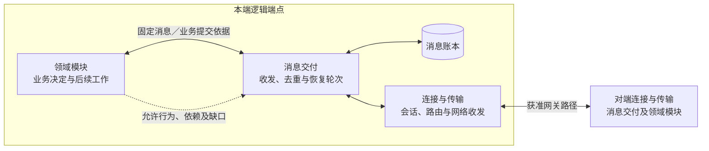
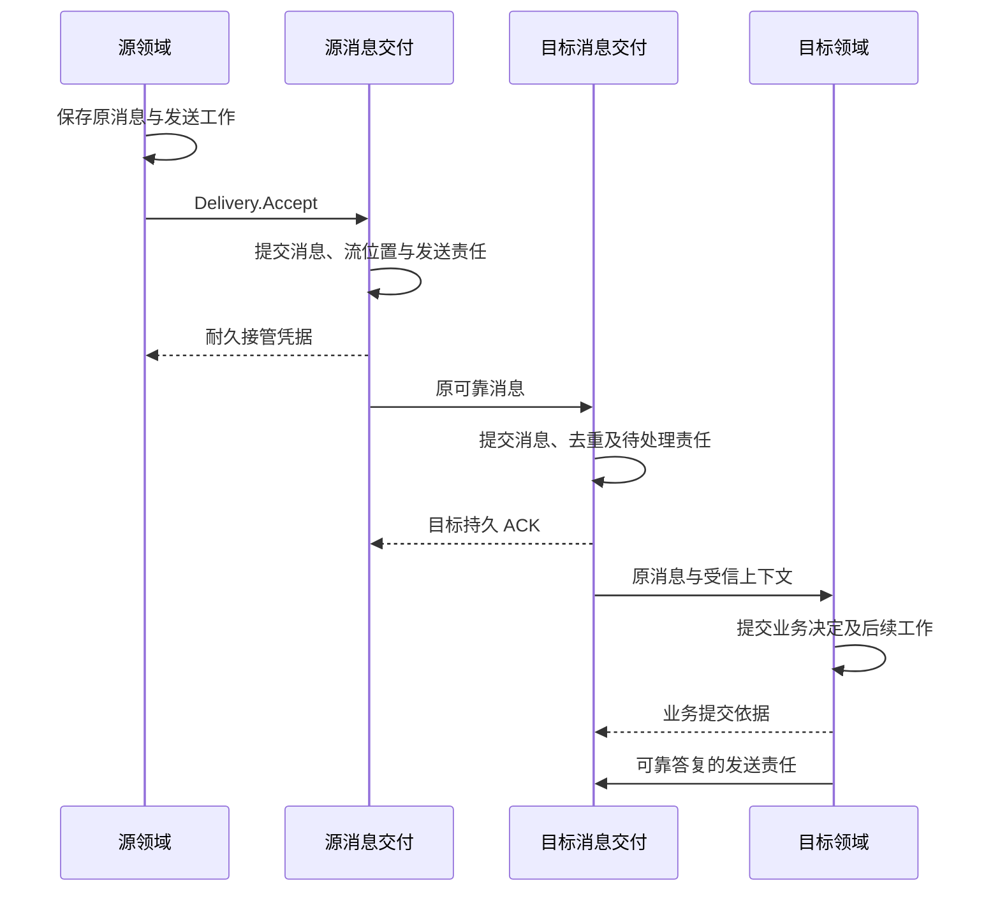

# 端点通信详细设计

端点通信为任务、Agent 协作、UI、记忆及其他领域提供共同的可靠交接：保存原消息和待处理责任，核对目标回执，恢复连接，并按领域结论开放相应行为。各领域继续保存业务决定；消息已收到、业务已接纳、操作效果已确认分别有自己的依据。

本方案对应[系统全景图](../diagrams/system-panorama.drawio)的 `communication` 分组及其中的 `connection` 连接适配器节点。该节点展开为消息交付（Delivery）和连接与传输（Transport）两类实现职责；此分工不要求新增进程、独立服务或独立数据库。Agent 委派合同及其结果、控制和用量归[Agent 协作](../agent-coordination/README.md)，交互状态及用户输入归[应用与交互](../application-and-interaction/README.md)。

实现本模块先读本页，再读[消息交付实现](delivery-and-recovery.md)和[通信验证](validation.md)。独立客户端、服务端或第三方实现从[端云协议规范](protocol.md)进入完整阅读路径；规范包括公共行为、领域契约和机器资产，不能只按 Schema 实现。当前交付为设计与静态校验资产，运行、隔离、互操作和容量均须另外取证。

## 1. 模块分工与事实归属

**逻辑端点**是按用户隔离、可寻址的通信身份，绑定持续账本和一个有效活动所有者。同一设备的不同用户分别保存端点、会话、收发及恢复记录；连接重建不改变消息身份，也不授予新的端点或任务控制权。

下图表示本端到对端的逻辑交接。实线是消息或回执，虚线是领域恢复依据；框不表示独立部署。

| 事实或决定 | 保存／裁决方 | 本模块的责任 |
| --- | --- | --- |
| 消息身份、流注册、连续位置、收发及待交接责任 | 消息交付及持续账本 | 原消息去重、目标确认、续传、缺口与有限核对 |
| 会话、获准路径、目标能力及网络可达性 | 连接与传输；受信配置和目标端点提供依据 | 核验来源和路由，不把网关能力当成最终目标能力 |
| 本轮恢复记录及对应行为的放行条件 | 消息交付汇集并持久保存领域证据 | 核对用户、作用域、恢复轮次和 owner；依据失效先关闭受影响行为 |
| 任务、委派、输入消费、执行效果、许可和记忆事实 | 所属领域权威 | 调用其处理及恢复接口，不从 ACK、超时或流 ready 推断业务结论 |
| 端点活动所有者与旧实例隔离 | 身份权威、受信宿主及运行存储 | 每次创建责任和实际使用时落实资格；通信不选举 owner |
| 启动计划、扫描机会与生命周期 | 扩展与运行保障 | 使用所属 DeliveryWork 和 RecoveryRound；宿主调度不能覆盖领域或交付结论 |
| 引用内容的可用性与实际字节 | 内容提供方及读取方 | 传递获准引用；消息 ACK 不证明内容已经取得或验证 |

同用户任务仍使用一个固定写权威，父子任务和远程协作沿既有[任务裁决](../task-kernel/lifecycle.md)运行。消息、领域账本各自提交，可以使用同一数据库产品；本模块不要求跨库全局事务。

## 2. 关键选择

| 推荐 | 依据与主要代价 | 适用边界与替代条件 |
| --- | --- | --- |
| 共用可靠交付，各领域独立裁决 | 同一交付实现复用去重、流和恢复，代价是消息接收与业务提交分别确认 | 两处责任都必须可恢复；同库优化不改变调用方观察到的成功含义 |
| 原消息、原操作与原流身份持续保存 | 确认丢失可以核对原责任，避免未知执行被当成新操作 | 保留和配额有成本；超窗留下领域核对责任，不能换身份重做 |
| 按作用域恢复，按行为放行 | 单个对象缺口不阻塞无关工作，查询与事实收尾仍可推进 | 维护各领域证据及失效条件，不能用一个 ready 或关闭整个 work lane 代替 |
| 网关 WSS／JSON 承载消息，HTTPS 承载引导与内容 | 浏览器、原生端和服务端共享一种接入；文件字节独立限额 | 直连后置，媒体通道另行扩展；具体规范见[传输与会话](transport.md) |
| 默认宿主事务账本与有界工作者 | 短事务、唯一约束和有限扫描可保存交接责任，不依赖独立消息中间件 | 数据库、表和工作领取是实现选择；替换实现须通过同一运行及互操作验收 |

v1 保护各段传输，不要求端端加密。中继保存、处理、转发以及结果披露分别需要许可；没有同时满足可靠性和数据策略的路径时拒绝，不自动降低可靠等级。

## 3. 从消息接管到业务确认

领域先保存固定消息及发送工作，然后调用 `Delivery.Accept`。通信取得耐久接管凭据后，领域才结束自身发送工作；目标消息交付保存入站及待处理责任后确认 ACK，目标领域保存业务决定与后续工作后才确认处理完成。

下图只表示一条可靠请求的正常交接。两个“已提交”各指所属账本；业务答复的返回同样经过可靠发送责任。

完整成功条件由[协议交接契约](message-contract.md#handoff)定义；事务、提交键、工作记录和恢复扫描集中在[交付实现](delivery-and-recovery.md#ledger)。UI 的父子输入操作、Agent 的委派／子提交映射分别由所属领域保存，通信不将它们合并为消息去重记录。

## 4. 中断后由谁继续

| 中断位置 | 继续者与依据 | 不能据此确认的事 |
| --- | --- | --- |
| Delivery 接管后答复丢失 | 领域沿原 message_id 查询或重交；通信返回原接管记录 | 超时不证明未接管，不分配第二个流位置 |
| 目标已接收，ACK 丢失 | 源通信窗口内重投；目标返回持久前缀并继续未交接责任 | 重投不创建新业务操作；中继回执不能代替目标 ACK |
| 业务已提交，交接确认丢失 | 目标通信重交原消息，领域核对并返回原决定 | 已有消息 ACK 不代表业务成功，当前未见也不证明未提交 |
| 外部行动结果丢失 | 所属领域查询原操作与真实效果 | 通信不能自动换目标、换操作或重做动作 |
| 流 ready，但撤权／取消证据未应用 | 通信保留本轮缺口，领域按行为返回允许范围 | 可通信、可续传和新行动获准是独立结论 |
| 窗口耗尽或正文不再允许发送 | 通信先保存缺口及后续责任，再按策略清理；领域查询原业务结果 | 不给旧消息换流、重编号或延长原期限 |

恢复由通信组织本轮证据，领域应用自己的快照、切点及连续变化后裁决。获准查询、控制和事实收尾按各自权限继续；变化缺口、证据过期或 owner 改变时先关闭依赖它的行为。宿主只提供有界扫描机会，完整职责见[通信恢复实现](delivery-and-recovery.md#recovery)与[运行生命周期](../extensions-and-runtime/lifecycle-and-recovery.md#readiness)。

## 5. 阅读与权威入口

| 读者目标 | 连续阅读路径 |
| --- | --- |
| 实现本模块 | 本页 → [交付、账本与恢复实现](delivery-and-recovery.md) → [通信运行与容量验证](validation.md) |
| 独立实现协议 | [协议规范入口](protocol.md) → 公共行为与线格式 → 所需领域的规范性合同 → 扩展与契约验收；发布版本固定完整引用闭包 |
| 理解跨领域任务 | [整体设计推演](../design-walkthrough.md) → [应用与交互](../application-and-interaction/README.md)／[Agent 协作](../agent-coordination/README.md)；消息语义回查协议 |
| 查机器资产 | [Schema 与线格式](wire-format.md#schema-ownership)、[注册表](schemas/standard-registry.json)、[静态校验](validation/README.md#static) |

## 6. 已定义范围与启用依赖

当前 v1 尚未发布，标准消息覆盖会话、任务与执行、身份恢复、远程大脑、记忆、委派、用户交互及治理发布。领域合同与 Schema 已联动定义，草案统一修订；当前没有消息 SDK、网关或可靠账本的运行验收结果。

| 依赖或能力 | 当前设计与缺口 | 未满足条件时的行为 |
| --- | --- | --- |
| 网关接入与领域合同 | 网关 WSS、受限身份恢复和各领域线合同已定义；需安装并验证实现 | 身份、协商或当前领域证据任一不足，相应行为保持受限 |
| 端点账本与活动所有者 | 持续账本、原提交核对、旧实例隔离已有契约，平台实现待验 | 无法证明耐久性不确认接管；缺隔离依据不激活接替 |
| 可靠存储与容量 | 原子交接、流绑定、窗口、总配额及收尾份额见[交付实现](delivery-and-recovery.md) | 接纳前拒绝或降速，已接纳责任保留；超窗留下可查询缺口 |
| 业务结果与内容 | 正式结果、原取消／管理答复按领域保留；内容独立授权读取和验证 | 结果清理、无权或内容不可取分别报告，不以当前摘要重建原答复 |
| 中间预览及输入 | 固定投影、来源和必需预览绑定已定义，提供方及受信宿主须运行验证 | 必需内容缺失、失效或不获准时关闭依赖该预览的输入 |
| 有限离线 | 依赖远端缓存依据的模式默认关闭，许可、可信时间、防回滚及本地依赖须逐平台验证 | 条件不足停止依赖它的新行动，保留已发生及未知效果 |
| 后置能力 | 端端直连、跨主机接替、运行中任务权威迁移、连续媒体通道及内容分片续传 | 启用前补齐所属合同与证明；断线不授予接管资格 |

[通信验证](validation.md)分别报告结构、运行、互操作与容量证据；十万同时在线等仍是项目目标，不由静态 Schema 或样例交换证明。
