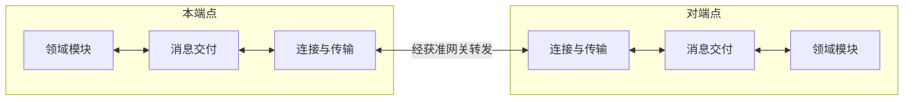
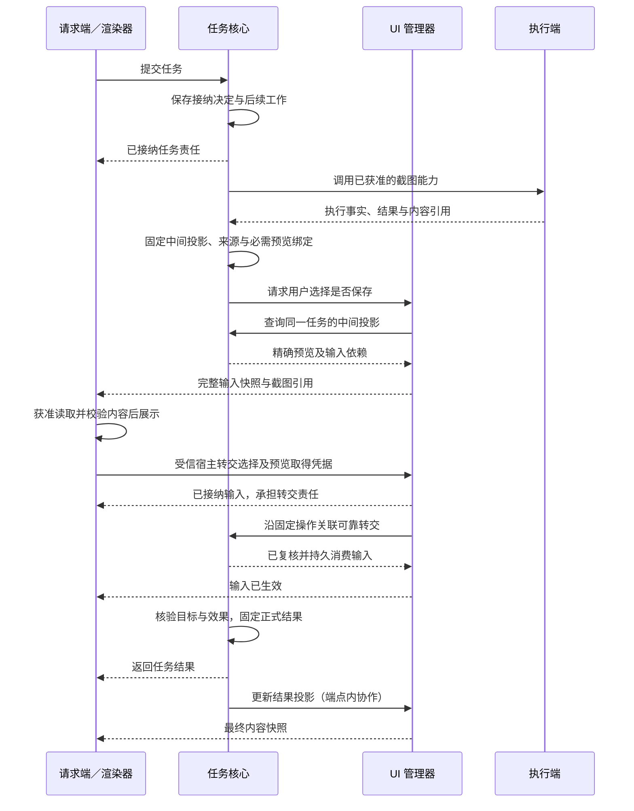
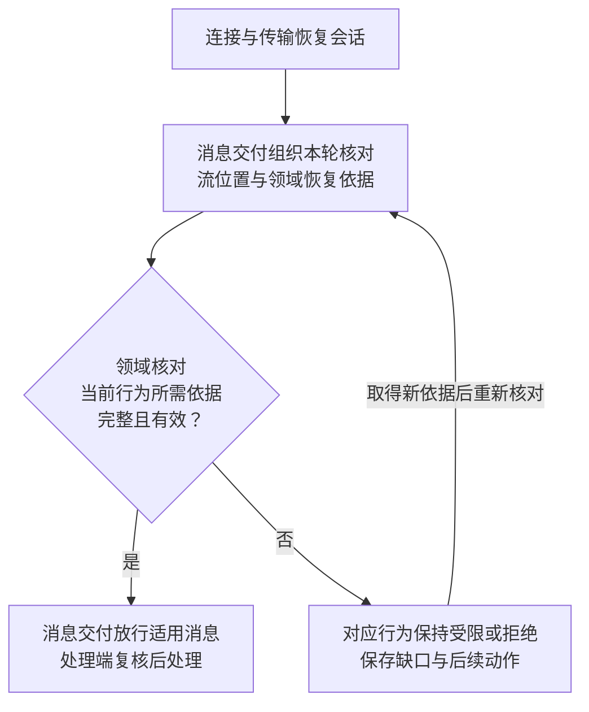

# 端云协议框架

端云协作需要在断线、重复消息和进程重启后继续承担已接纳的工作，同时核对离线期间变化的权限、任务状态与执行效果。本协议将可靠交接交给共同的消息交付模块，将业务状态与完成判断留给各领域，覆盖任务协作、能力调用、UI、记忆和授权控制。

v1 尚未发布，标准消息覆盖会话、任务与执行、身份恢复、远程大脑、记忆、委派、用户交互及治理发布，默认采用网关 WSS／UTF-8 JSON。HTTPS 承担认证、票据、恢复资格引导及大内容；端端直连后置。领域合同、Schema 与示例已联动定义，启用仍须取得实现、平台及互操作证据，完整依赖见[v1 范围](#scope)。

本设计依据[项目目标](../../harness-project-goals.md)和[系统全景图](../diagrams/system-panorama.drawio)。先读本页建立职责、交接与恢复主线，再按[阅读路径](#reading)进入专题；字段、参数与异常清单由所属专题集中定义。

## 1. 职责与状态归属

**逻辑端点**是协议中可寻址、按用户隔离的通信身份，按能力启用领域模块。同一设备上的不同用户使用隔离的端点、会话、队列与恢复记录。下图将全景图中的“连接适配器”展开为消息交付、连接与传输两类实现职责；框与连线表示职责及消息交接，分组表示逻辑端点，不要求独立部署。

| 实现职责 | 负责内容与交接边界 |
| --- | --- |
| 领域模块 | 保存本领域业务状态，裁决权限、业务前提、操作效果及恢复条件；处理消息并生成响应或事件 |
| 消息交付 | 校验公共消息及身份关联，保存收发与待处理责任，负责去重、流控制、回执及续传；组织领域核对，按结论限制或放行适用消息 |
| 连接与传输 | 建连、会话管理、端点路由、网络收发与重连，保护链路；连接建立后仍须核对流与业务状态 |

文中的**权威**指对某类业务状态有裁决权的模块或服务。协议不集中保存所有业务事实，各领域按以下边界协作：

| 领域模块 | 保存的事实与裁决责任 |
| --- | --- |
| 任务核心 | 接纳委派、输入和控制请求，保存任务状态及后续工作，判定进展与完成；任务控制方是有权推进任务的逻辑端点，由该端任务核心行使控制权 |
| 能力目录与执行协调器 | 目录声明能力；执行协调器保存操作记录，管理取消并核对执行与效果；承载这些职责的端点称为执行端 |
| 界面状态管理器（UI 管理器） | 保存共享界面内容、每端呈现状态及输入转交责任；输入是否生效由发起输入请求的业务权威裁决 |
| 记忆服务／同步管理 | 管理记忆查询、修订、删除、冲突及数据驻留，提供同步与恢复依据 |
| 授权服务 | 保存身份、许可与撤销事实，提供权限判定及恢复依据；资源处理端在使用资源或启动行动前落实限制 |

首期同一用户的任务及内核操作由一个固定的[任务写权威](../task-kernel/lifecycle.md)裁决，可部署在端侧或云端。父子任务共用该权威，各自保存状态、承担推进责任，子任务结果交回父任务；执行端可以分布部署。任务写权威与授权、记忆权威各有职责，不要求共用事务。云端业务节点与中继也分别承担责任，中继转发不取得任务控制权或数据使用权。

各领域独立保存状态。任务、界面与记忆使用各自的状态版本，UI 的共享内容修订与每端开关修订也分别维护；执行操作分别报告过程阶段、执行事实和效果，不能用其中一项推断其他结论。对接外部协议时，在所属领域与外部系统之间按需引入[协议适配器](extensions.md#external)。

## 2. 关键设计与取舍

| 选择 | 依据 | 主要代价与适用边界 |
| --- | --- | --- |
| 共用可靠交接，业务模块分别裁决 | 持久收发可以复用，任务完成、执行效果和输入生效的条件不同 | 接收回执与业务接纳分别持久提交，各领域须保存决定及后续责任；消息去重不保证外部动作恰好执行一次 |
| 按业务对象隔离恢复，按行为逐项放行 | 一个任务的缺口不应阻塞无关任务；取消、授权和执行事实可能在离线期间变化 | 增加流与游标数量，须分批恢复并共享总配额；跨对象依赖仍须核验，流可续传不代表行动获准 |
| 首期固定同用户任务写权威 | 在一个写权威内约束任务与内核操作身份，避免引入跨权威路由、去重和迁移 | 依赖该权威的新工作在其不可达时等待；跨权威分区或交接须先补齐操作索引迁移等契约 |
| 正式结果与 UI 呈现独立恢复 | 消息超窗、用户关窗后，仍可能需要查询成果或完成已接纳输入 | 结果按获准保留策略独立查询，引用内容另行读取和验证；UI 关闭持续生效，后台快照只更新内容 |
| 可靠消息保存责任，临时增量允许丢失 | 指令、正式输入与结果需要恢复；进度和预览可由快照或最终结果重建 | 可靠消息受窗口及配额限制，超窗转业务核对；临时消息不能承担唯一的执行或完成依据 |
| WSS／JSON 承载消息，HTTPS 承载大内容 | 浏览器、原生端与服务端复用一种消息格式和接入方式，大内容单独读取 | 首期不并行提供其他线格式；消息送达与内容交付分别确认，连续音视频另行扩展 |

逻辑端点的收发与操作关联属于持续账本。实例接替须恢复原账本并隔离旧实例；重连或切换路由保留原消息、操作与流身份，也不转移任务控制权，详见[活动所有者](transport.md#endpoint-owner)。

离线执行仅在许可明确允许、仍有效且本地依赖齐备时开放，并接受远端撤权的传播延迟。v1 保护各段传输，不要求端端加密；云端只能处理获准内容，留端数据加工后的结果仍须检查披露权限。离线与数据边界分别见[离线执行](recovery-and-control.md#offline)、[身份与数据限制](message-contract.md#isolation)。

## 3. 截图预览与成果交付

首期同宿主集成沿[整体设计推演](../design-walkthrough.md)，先澄清保存目标，再生成有来源答案、保存固定成果、独立读回并完成；澄清可凭完整输入请求作答，不依赖中间成果预览。默认任务策略、能力与内容提供方仍须装配并取得运行证据。

下图沿[截图示例](examples/task-ui-flow.json)展示用户查看执行设备截图后选择不保存的场景。核心按 [UI-P3](../application-and-interaction/contracts-and-storage.md) 发布固定中间投影，输入绑定必需预览；跨端先取得身份、来源、准确目录及控制依据。ReadTask／ReadResult 与中间投影分别读取，所需提供方缺失时不开放依赖预览的输入。JSON 示例只证明静态结构与关联，运行仍须验证。

图中请求方兼渲染端，任务核心与 UI 管理器位于同一云端点，执行端承载截图能力。图聚焦上述条件齐备后的业务交接，省略握手、交付回执及界面开关操作；临时截图、读取及呈现须已获准，渲染端由用户显式打开并取得有效快照后展示。

消息交付与业务模块各有一处持久交接：目标端回执确认消息及待处理责任已保存；业务接纳确认处理决定与后续工作已保存。两处提交各自可恢复，不要求跨模块全局事务。执行端报告操作事实，任务核心取得目标与相关效果依据后才能确认任务完成，完整规则见[可靠交接](message-contract.md#handoff)。

图中的“不保存”表示不把截图列为持久任务成果，临时内容仍按获准生命周期清理。返回结果或内容引用不代表内容已交付，所需内容可读取且可验证后才能确认完整。任务结果与 UI 投影独立保存；最终快照到达时只更新内容，本端已关闭则保持关闭，完整交互见[任务执行与 UI](task-and-ui.md)。

## 4. 断线或结果不明后由谁继续

沿上述条件场景，执行端可能已生成截图，但结果在断线中丢失，用户随后取消任务。连接恢复后，发送方不能仅凭超时重新截图，接收方也不能仅凭流可续传继续旧行动。**业务作用域**是可独立核对的任务、原操作、界面或其他已注册领域对象；各作用域按自己的依据恢复，关联操作仍须遵守所属任务的取消。

下图表示恢复职责的交接，节点是处理步骤。判断针对某一类行为，接收原执行事实与启动新行动分别核对；所需查询和控制同步按自身权限推进，不等待旧行动先获准。

取消获准且被接纳后，任务控制方保存取消决定、停止新派发并继续追踪原操作；执行端尽力停止在途工作，保留已发生事实与未明效果。即使任务已进入取消终态，获准的事实核对和结果上报仍可继续，迟到结果不重开任务。连接可用、流可续传、业务行为获准是三个独立结论，完整恢复与取消规则见[恢复与控制](recovery-and-control.md)。

| 中断位置 | 谁继续、凭什么继续 | 可以确认的边界 |
| --- | --- | --- |
| 消息已接收，回执丢失 | 消息交付在窗口内重投原消息，接收方按持久记录返回原状态 | 不创建新业务操作；超窗报告缺口并转业务核对 |
| 截图可能已生成，执行结果丢失 | 执行端按原操作核对，任务核心据事实决定后续工作 | 查不到记录或效果未知时不自动重做；再次尝试须由业务判断 |
| UI 已接纳输入，转交前崩溃 | UI 管理器恢复输入与转交责任，持久确定或复用固定操作关联后继续转交或核对；业务权威裁决原输入是否已消费 | 关窗不撤销已接纳输入；只有业务消费确认后才能报告生效 |
| 正式结果消息超窗，或引用内容不可取 | 请求方向任务权威查询固定结果，内容服务按当前权限提供所需内容 | 结果查询不触发重新执行；结果已清理或内容缺失时明确报告，不能以摘要替代完整交付 |
| 授权、取消或其他恢复依据缺失 | 消息交付保存缺口并组织领域重新核对；处理端限制依赖该依据的行为 | 获准的查询、控制同步与事实收尾可以继续，无关作用域不被一并阻塞 |

## 5. 连续阅读与契约查阅

按下表顺序沿业务协作进入交付、领域恢复、建连和扩展；实现精确字段或核对验证证据时查阅相应资产。

| 文档 | 阅读时要回答的问题 |
| --- | --- |
| [任务执行与 UI](task-and-ui.md) | 谁推进任务、谁确认输入生效，成果与界面如何独立恢复？ |
| [消息契约](message-contract.md) | 消息与业务操作如何关联，两处交接分别保存什么、确认什么？ |
| [传输与会话](transport.md) | 端点如何建立身份与路由，流、回执和容量如何支持续传？ |
| [恢复与控制](recovery-and-control.md) | 断线、取消或未知效果后，谁核对事实、允许哪些行为、谁继续处置？ |
| [跨端领域合同](domain-profiles.md) | 首次恢复如何引导，各领域消息、来源、控制和原回执怎样衔接？ |
| [扩展与兼容](extensions.md) | 类型与声明式视图如何扩展，安装、协商和版本分别保证什么？ |
| [线格式与字段](wire-format.md) | 公共信封、请求响应、编码及错误对象的精确约束是什么？ |
| [契约校验](validation/README.md) | 哪些结构与关联已有静态检查，哪些行为仍需运行验证？ |

## 6. v1 范围与待完成部分

当前协议及[注册表](schemas/standard-registry.json)中的全部标准类型均为版本 1，尚未发布。正文、Schema 与示例同步修订，不保留早期草案的兼容分支；正式发布后的同版冻结与演进规则见[扩展版本](extensions.md#version)。领域线合同与机器资产已经定义，运行实现和互操作仍须取证。

| 依赖或能力 | 当前设计与缺口 | 未满足条件时的行为 |
| --- | --- | --- |
| 网关接入与端端直连 | 已定义网关 WSS 接入；直连的接入、对端身份核验、来源及路由绑定契约与实现验证待补齐 | 不启用直连；网关路径也须满足身份、授权及数据策略，无可用路径时等待或拒绝 |
| 身份、端点账本与离线许可 | [身份与授权](../identity-and-authorization/README.md)已定义内部接口；持续账本、旧实例隔离、可信时间及相应适配器仍须实现验证 | 缺少隔离依据不启用接替；缺少离线条件不签发或使用离线许可 |
| 跨端领域恢复 | [领域合同](domain-profiles.md)已定义身份、准确目录、远程大脑／记忆／委派、交互与治理管理；受限恢复资格和逐领域证明独立于连接票据 | 实现、协商、恢复证据任一不足时，相关行为保持受限；不能用只读恢复资格启动行动 |
| 可靠存储与容量 | 两处原子交接、作用域与流绑定、窗口及用户总配额已规定；[协作与端云](../endpoint-communication/delivery-and-recovery.md)已给出消息交付内部存储与恢复设计，故障注入和负载验证待实施 | 容量不足在接纳前拒绝或降速；已接纳责任须保留，超窗留下可追踪缺口 |
| 结果恢复 | 正式任务结果、原任务／执行取消答复和管理回执分别独立查询 | 超出领域保留、正文已删或无权时报告相应缺口；不以当前状态重建原答复 |
| 中间成果预览 | 固定投影、来源和必需预览绑定已定义；提供方须支持按原版本读取及失效处理 | 必需内容不可取或不获准时关闭该输入，不从执行存储拼接未经核心提供的投影 |
| 内容服务 | HTTPS 传输、完整性与生命周期已规定，服务待实现验证；v1 不要求分片续传 | 引用失效、内容不可取或校验失败时报告缺口，由业务决定等待、重新提供或结束 |

任务控制权交接属于后续能力，首期关闭。目前只定义冻结、状态转移、唯一生效和新方激活的约束，启用前还须落实权威记录及用户操作索引迁移，详见[后续交接](recovery-and-control.md#ownership)。

SDK、网关、独立客户端、按需外部协议适配及任务／UI 闭环均待实现验证。协议不指定开发语言和数据库，实现遵守所属模块的存储及部署约束。静态契约校验、故障恢复与互操作验收、规模测试分别提供证据；十万同时在线等仍是[项目目标](../../harness-project-goals.md)，验收要求见[验证范围](validation/README.md#runtime)。
