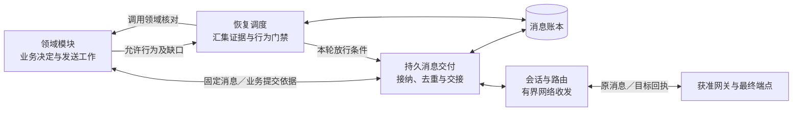
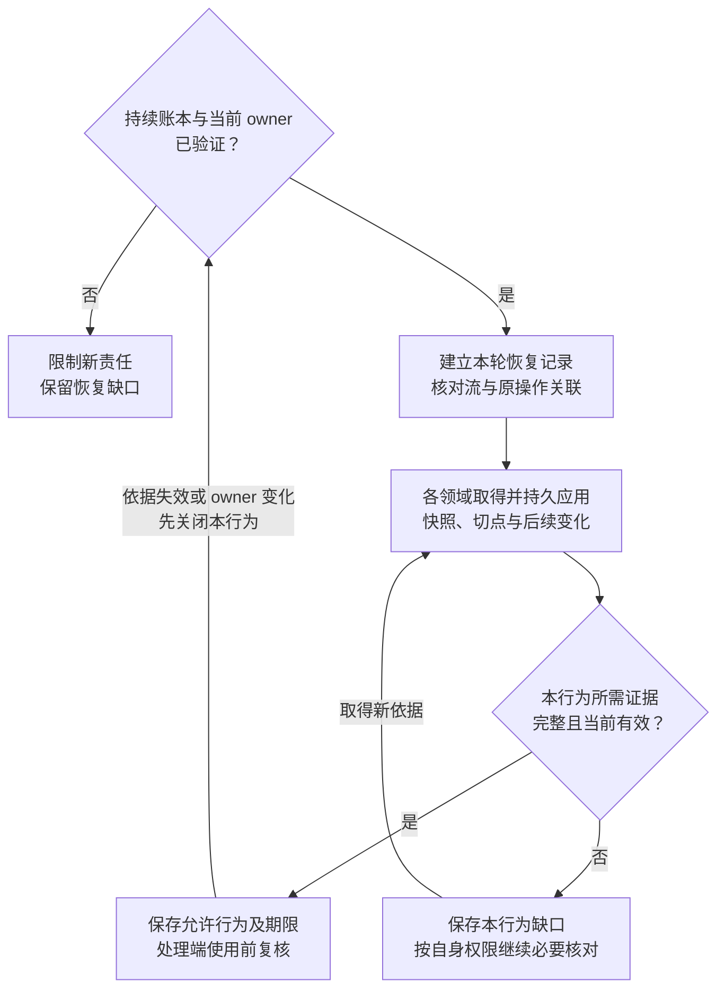

# 消息交付、连接与恢复

[总览](README.md) · [协作契约](peer-contracts.md) · [委派与结果](delegation.md) · [验证与待决项](validation.md)

连接适配器把[端云协议框架](../endpoint-communication/README.md)中的消息交付、连接与传输落实为可恢复的本地责任。它保存消息账本、会话及路由绑定，组织领域核对；任务、执行、UI、记忆和授权仍保存各自业务事实。本文是这些职责的内部实现设计，不新增线字段、消息类型或领域裁决权；精确编码、流状态与参数沿用协议。

默认部署由同一受信宿主装配持久交付服务、传输工作者和已安装的领域处理器。授权等领域权威可在本地调用；跨端时必须另外具备已安装、已协商且通过验证的领域适配器。身份、记忆、Brain 及协作领域 profile 已定义，运行实现与验收仍是启用依赖；直连及跨主机所有者接替后置，通用交付不能补足相应资格，缺少依据时限制对应行为，采用状态见[验证与待决项](validation.md)。

## 1. 交付负责持久交接，领域负责业务结果

以现有任务提交消息为例：发起方先固定消息身份及请求，保存发送工作，再调用 `Delivery.Accept`。成功只表示交付服务已耐久接管；目标消息 ACK、目标核心接纳任务和任务正式结果分别由自己的记录证明。两端即使同进程，也通过相同的责任交接，不能以内存回调返回代替持久接纳。跨端委派使用已定义的 [CO-P1 领域合同](peer-contracts.md#wire)，本例的普通提交只说明交付链路。

图中的方框是本端职责；消息账本只保存交付与恢复记录，领域账本继续保存业务决定。连接适配器内部不另设任务调度器，也不解析模型输出决定再次尝试。

| 交接 | 确认前保存什么 | 确认丢失后谁继续 |
| --- | --- | --- |
| 领域 → 本端交付 | 原消息、流注册／序号、配额占用与发送责任 | 领域沿原 message_id 查询或重交；交付返回原接管事实 |
| 最终源端 → 最终目标交付 | 原消息、身份去重、流位置与待领域处理责任 | 源端窗口内重投；目标返回持久前缀并继续未完成交接 |
| 目标交付 → 目标领域 | 领域已提交处理决定、操作关联及后续责任 | 交付再次交接原消息，领域按原身份返回已存决定 |
| 领域响应 → 本端交付 | 响应和正式结果的可靠发送责任 | 领域未确认接管前保留发送工作；交付负责目标 ACK 或可查询缺口 |

完整保证沿[协议的两处持久交接](../endpoint-communication/message-contract.md#handoff)。没有可恢复业务提交依据的处理器不能接纳有副作用消息；临时进度只能在有界缓冲中合并或丢弃，不承担唯一结果、控制或后续工作责任。

## 2. 内部接口与固定路由

下表定义宿主内的逻辑接口，均携带受信用户、端点及当前活动所有者上下文。`Delivery.Accept` 和 `Core.CheckRecovery` 复用[内核既有接缝](../task-kernel/storage-and-interfaces.md#内部协作接口)；其余是本组件内部查阅或适配接口，不能直接作为新的 RPC 发送。

| 接口 | 输入 → 输出 | 成功含义与限制 |
| --- | --- | --- |
| `Delivery.Accept` | 已固定的消息身份、目标、类型／版本、载荷、scope、原期限和窗口 → 接管凭据／确定拒绝／未知 | 同一 message_id 同内容返回原记录；新接纳原子分配流位置并保存发送责任，不表示已联网、目标收到或业务成功 |
| `Delivery.Read` | 原 message_id、所属端点 → 接管记录、目标确认范围、领域交接或交付缺口 | 本地读权威账本；当前未见与确定未接纳分开，旧备份不能裁决未发生 |
| `Route.Resolve` | 受信目标绑定、用途、消息及扩展要求 → 最终 endpoint、获准路径和有效能力依据／缺口 | 只在配置和已验证发现中选择，不改任务权威或原消息目标；不可达保留等待，无获准路径则拒绝新接纳 |
| `Domain.ResolveScope` | 已安装消息语义、受信来源及原请求／操作关联 → scope、行为类别及依赖／缺口 | scope 必须与线声明及流注册一致；响应继承已保存请求关联，不信任任意自报标签 |
| `Domain.Handle` | 原入站消息、交接身份及当前门禁依据 → 可恢复的业务提交依据／未提交／未知 | 任务委派调用现有核心接口；领域完成原提交后才可标记入站已处理，业务拒绝也须能恢复答复 |
| `Core.CheckRecovery`／领域恢复适配器 | 当前恢复轮次、scope、所有者、授权／控制／原操作与交付依据 → 允许行为、依赖、期限和缺口 | 领域裁决；交付仅组合落实。其他领域沿各自已定义接口装配，不假装存在统一远程恢复 RPC |

新消息调用方固定业务消息内容；由交付服务在接纳事务中分配尚未确定的流身份和序号，完整信封此后不可变。重复 Accept 先查原接管记录，不重新分配流位置。调用方已提供完整已固定的交付身份时，核对并复用该身份。规范比较依据同版 Schema 的逻辑值与冻结内容，不能只比较未经验证的摘要；JSON 键顺序不构成差异，字段缺省、数组顺序和数值按已安装版本解释。升级后旧未决记录仍由固定的旧解释版本处理。

首期任务目标来自受信配置中该用户的固定任务写权威，执行和 UI 目标来自领域保存的绑定；同进程目标也具有明确的逻辑端点和账本归属。`Route.Resolve` 不接受任务文本中的任意 URL，不凭能力相似自动转移未明操作。`core.describe` 查询最终目标能力，网关 welcome 只声明网关自身能力；已知 endpoint_id 不等于获准访问，也不提供全局任务／端点目录。

新发送须满足最终目标、返回方和路径上必要语义的能力要求，完整规则沿[目标协商](../endpoint-communication/transport.md#routing)。能力版本变化后重新协商；原消息不支持时留下不兼容缺口，不能修改原类型、目标或 payload 再视作重投。允许变更网关路径时仍保留 source、target、流及操作身份，并重新核对路径的数据策略和接收限制。

所有网关转交必须保留已认证来源，拒绝跨用户路由和伪造 source。默认不启用可保管业务载荷的中继缓存；如装配该能力，中继使用独立有界保管记录，只返回自己的 `relay_stored`。它不能冒充目标 ACK，源端仍承担最终目标交付责任。禁止中继处理或保存的数据没有可用获准路径时拒绝，不自动降低可靠等级。

## 3. 消息账本、索引与提交边界

以下是本组件内部记录的权威定义，不增加线字段。所有键首先含受信 user_id、所属 endpoint_id；流键另外固定原 source、target 与 stream_id。记录的 owner 代次用于限制谁可以提交新责任，不替换已保存消息身份或任务 `owner_epoch`。

| 记录 | 必须保存的字段组 | 唯一性及用途 |
| --- | --- | --- |
| EndpointLedger | ledger_id、账本代次、有效 owner 及隔离依据引用、存储恢复状态 | 持续端点账本只允许一个有效所有者；账本代次变化不能清空原去重后继续旧身份 |
| Stream | 原端点双方、stream_id、scope、注册 lane、类型解析版本、下一发送序号、连续接收／目标确认位置、窗口与开放／封闭记录 | 流身份唯一，scope 与 lane 不变；序号无环绕，退休 ID 不复用；收发各保存自己可证明的位置 |
| OutboundMessage | message_id、完整原消息与规范摘要、固定流位置、接纳凭据、原 expires_at／retain_until、目标确认与缺口 | message_id 及原流位置各唯一；相同身份不同内容冲突，不重新创建责任 |
| InboundMessage | 原消息、来源验证及流关联、接收提交依据、待交接／已处理／缺口、领域提交引用 | 持久保存与待处理责任一起提交；目标 ACK 不删除未交接项 |
| DeliveryWork | work_id、种类、消息／流关联、pending／leased／done／closed、领取代次、期限、固定步骤、重试预算与下次时间 | 发送、交接、ACK 合并、resume、缺口核对及清理分开保存；同一责任唯一 |
| RecoveryRound | recovery_id、scope、端点／owner、各领域权威／修订／切点、应用与连续性依据、允许行为／期限、缺口及下一工作 | 只解释本轮及列明作用域；网络连接、流 ready 与业务结论分别保存 |
| DeliveryGap | 原消息／流／scope、已知交付阶段、原因、原领域关联、核对责任、通知与保留依据 | 超窗、撤权、账本缺失等不能仅写日志；没有原载荷仍可按获准最小关联查询责任 |
| CommitReceipt／RetiredIdentity | 固定提交键、已提交结果或封闭依据；已退休身份及必要位置／窗口 | 提交未知沿原键核对；防止旧身份从空记录重新接纳 |

索引至少包括待执行工作的 `(用户, 种类, 下次时间)`、待交接消息的 `(用户, 流, seq)`、出站未确认范围、即将到期窗口、scope 到相关流／恢复轮次的反向关联，以及领取代次和提交键查询。用户轮转先于单用户批量；恢复不能靠每次扫描全部历史消息实现。消息 ID 和流位置的唯一约束由存储落实，内存缓存只加速查询。

| 本地事务 | 原子保存／核对的内容 | 提交后才能进行的动作 |
| --- | --- | --- |
| 出站接纳 | owner 与原接管记录、流注册及下一个 seq、消息、配额占用、发送工作和接管凭据 | 返回接管成功、允许首次发送；容量拒绝不消耗流序号 |
| 入站接纳 | 来源、身份及配额复核；原消息、去重、流注册／位置、待处理工作；推进可证明的连续前缀 | 发送目标 ACK；不得先 ACK 再异步补消息 |
| 业务交接确认 | 已验证的领域提交引用、原入站处理状态及工作完成 | 释放本组件交接责任；领域响应发送仍由其独立工作保证 |
| 目标 ACK 应用 | 回执来源与流绑定、单调确认位置、对应消息交付状态及可清理标记 | 清理已确认载荷；中继回执或业务响应不推进该位置 |
| 恢复结论应用 | 本轮／owner、领域证据和失效条件、按行为放行结果、后续连续核对工作 | 开放列明行为；证据变化时条件更新先关闭受影响项 |
| 窗口结束／清理 | 原责任当前状态、缺口及核对／通知责任、配额与保留位置 | 释放允许删除的载荷；不能先删除再尝试报告缺口 |

网络和领域调用在事务外进行，单库产品部署也不要求与领域账本形成全局事务。出站与入站的关键提交键均由原消息身份及步骤生成；重试、租约和新进程不能为同一步换键。存储返回已提交、确定未应用或未知，未知先调用同一写权威核对原回执。当前未见、只读副本滞后或旧备份缺行均不证明未应用；只有原事务结束或被隔离、旧提交入口封闭且仍在原权威，才可以沿原键重做确定未应用的步骤。

业务已经提交、交付未收到确认时，重交原消息并核对原业务决定。业务尚未提交且暂时不可用时，交付继续保存待处理责任，可以已有接收 ACK，但不能合成业务 accepted。账本不可写时不能报告接纳或“已持久等待”；暂停新接纳并保留调用方的原责任。

## 4. 连续前缀、窗口及清理

收到乱序消息可以在限额内持久暂存，但 ACK 只覆盖可证明的连续接收前缀；缺少 seq=n 时不交接后续消息，不把 n+1 当作可跳跃位置。前缀内消息交接仍受各自业务条件约束，累计 ACK 不等待领域处理完成，也不表示目标效果已经发生。业务因果及跨流依赖由领域检查，不能从序号推断任务、UI 或授权版本。

重连按[既有 resume 规则](../endpoint-communication/transport.md#stream-resume)分批核对目标持久位置。目标证明未取得时保存 unknown；确认位置倒退或大于本端已发送范围时停止自动恢复并报缺口，不能把本端记录覆盖成较方便的数值。ready 仅允许窗口内原消息继续履行交付责任；reconcile_required、unknown 和 expired 的处理沿协议，不生成新的核心流状态。

原消息需要重投时同时核对消息保存／传送用途及当前披露条件。撤权后不能为可靠性重发旧正文，也不能删改原字段后继续使用原身份。交付保存阻断原因及领域核对责任，获准的最小控制查询可经独立流继续；无法补齐的旧位置最终按窗口结束规则封闭，不虚构一条“跳过消息”推进累计 ACK。已有目标持久接收事实继续保留，撤权不会把过去的接收改写成未发生。

窗口耗尽时，未获目标 ACK 的源端不能判断目标未收到；目标已收到但尚未业务交接的项目也不能静默清除。双方分别登记已知阶段、原操作及领域核对责任，停止旧消息自动发送／新业务执行。确定的历史提交仍可在当前权限内核对，后续尝试由领域决定。新工作可使用新流，但不能给旧消息换流、重编号、延长期限或借新流绕过同一 scope 的恢复限制。

清理有以下固定次序：先证明允许清理，再持久保存仍需承担的责任和最小关联，最后删除载荷并释放占用。目标 ACK 允许源端提前清理已确认载荷；目标待领域处理载荷保留到交接或明确缺口责任成立。去重及游标至少覆盖对应交付窗口，未决业务关联和缺口按责任保留策略继续保存，流退休不删除领域正式结果、原操作或内容恢复依据。

仅过期缓存可直接回收；已接纳责任占满空间时拒绝新接纳，不以轮转最旧消息腾空间。确需删除尚有恢复依赖的正文时，先禁止使用并登记缺口，保留已获准的最小控制记录。接纳时连这些记录都不允许保存的模式直接拒绝。备份恢复必须核对账本连续性与旧实例隔离，无法证明曾确认记录仍可恢复时保留缺口，不能从旧备份重新分配旧序号。

## 5. 活动所有者及按行为恢复

活动所有者资格由[身份与运行存储](../identity-and-authorization/contracts.md#identity)提供，交付、传输写入和本地执行入口共同落实。本组件只使用该资格，不选举 owner。新实例须恢复原账本并取得旧实例全部写入／执行入口的隔离依据；失联、换票据或关闭 WSS 均不足以接替。首期只开放受信本地监督器支持的接替，跨主机等价证明缺席时等待。

同一 owner 的多条连接共用序号分配、去重、工作领取与总配额；连接数不增加活动所有者数量。发送工作每次领取保存代次，实际网络写入前重新验证 owner 和领取资格。旧工作者在最后一次检查后发出的已准备字节仍可能迟到，所以接收端继续按原消息去重及当前业务条件处理；租约过期不能证明此前网络发送或外部效果未发生。

每个 scope 的本轮恢复与活动 owner 绑定。首次连接同样需要初始依据，`core.welcome`、`core.resumed` 和空控制队列都不能打开业务。恢复顺序如下图；图建模一个作用域内一种行为的放行判定，各行为独立运行。

领域适配器的最小责任沿[协议恢复接口](../endpoint-communication/recovery-and-control.md#recovery-reference)：返回权威来源、快照修订、切点和连续接续依据，由所属领域持久应用后出具本轮证据。交付校验用户、scope、recovery_id、端点与 owner 绑定，汇集允许行为、依赖及有效期；不同领域版本不合并成一个全局版本。未列入本轮的流或对象不视作已恢复。

门禁至少分别表达：原操作查询、获准控制处理、事实及结果接收、既有发送责任的披露、新目标行动。某任务已取消仍可接收获准迟到效果；任务恢复依据不授予记忆读取权，记忆视图可读也不授予任务派发权。`Core.CheckRecovery` 负责任务及内核操作关系，执行、UI、授权、记忆分别提供本领域结论，交付不代替这些模块推断成功。

变化入口中断、证据到期、来源失效或 owner 改变时先关闭依赖它的行为，再重新核对。任务取消须传递到关联操作的条件，不因操作独立成流就失效；无关 scope 可以继续。查询与控制同步按自己的当前权限推进，不能等待被它们恢复的新行动先获准。领域权威不可达或尚无可互操作 profile 时保存缺口并有限等待，不从本地旧缓存推断 allow。

活动所有者、业务门禁和用户配额均在实际提交／使用边界再次检查，恢复完成不承诺某个瞬时全局快照。离线继续默认关闭；只有当前 owner、任务控制或委派资格、本地依赖、有效离线许可、可信时间及防回滚均经验证才可启用，完整条件沿[协议离线边界](../endpoint-communication/recovery-and-control.md#offline)。网络断开不转移任务控制权；首期固定任务写权威不可达时，依赖它的新工作等待，已有获准本地工作按既定责任继续。

## 6. 有界工作、收尾及取消

DeliveryWork 只调度交付、交接和恢复。每次领取有有限期限与代次；领取过期先核对上一步提交及原消息，不更换 message_id 或 operation_id。重试保存累计次数、总期限、下次时间和成本上限，重启不刷新；到限停止主动消耗，留下可查询缺口和一次获准通知，仍可接收合法迟到事实。受信运维入口可以恢复原工作、重新核对原流、隔离旧实例后恢复账本，不能清空去重、改写未知为成功或新建原业务操作。

线 lane 固定取已安装注册表。调度先按用户公平分配，再在用户内分配 session、control、recovery 和 work 预算；流数与连接数不能放大额度。普通 work 不占用 control／recovery 保留容量，会话消息另有有界缓冲。恢复与控制也有速率上限，不能持续饿死已就绪普通工作。

`task.cancel_result`、`execution.cancel_result`、执行事实及正式结果仍在协议规定的 work lane 内。实现为已接纳工作的必要收尾保留独立的有界 work 份额，根据已保存的操作关联及已安装类型分类，调用方不能自报优先级。此份额覆盖记录、发送工作、队列和工作者机会，接纳新工作前计入预算；不修改线 lane，也不把“禁止新行动”实现为关闭整个 work 队列。

单条消息必须装入适用的字节与数量配额；所有队列、活跃流、待处理责任和出站载荷均同时有数量和字节上限。配额不足且尚未接纳时拒绝或背压；已接纳责任继续保留，临时预览先合并或丢弃。领域须预留自己的业务答复和收尾责任空间，交付则为已经接纳的消息与必要控制保留空间，两者不能相互假定对方无限存储。

取消交付等待仅停止调用方等待，不撤回已接纳消息或任务。任务取消由原核心裁决，执行取消由执行端核对；取消可能先于原调用到达，不能凭一次未找到就证明未来不会执行。原操作查询、取消意图和迟到结果分别保留身份与责任，完整边界沿[协议取消](../endpoint-communication/recovery-and-control.md#cancel)。取消完整答复超窗仍有既有缺口，Delivery.Read 只能报告原交付事实，不能重建领域原答复。

## 7. 本地部署、容量与观测

默认装配一个端点持久账本及其有界工作者，按用户隔离命名空间；同一用户任务仍路由到固定任务写权威。Store 须提供本地原子事务、条件更新、唯一约束、耐久回执、可证明连续的备份恢复及 owner 隔离接缝。首期不依赖独立消息中间件或自动多主接管；替换存储和网络实现须通过同一交付矩阵，不能仅凭产品支持事务就宣称端到端耐久。

进程启动先验证账本和 owner，再恢复未知提交、目标确认位置、待领域交接和原发送责任，随后按 scope 开放业务。正常退出先停止新接纳和新工作领取，持久保留在途交接及缺口，再关闭连接与存储。退出超时不意味着对端操作停止。纯浏览器宿主若没有经验证的耐久账本适配器，只能作为受信宿主前端，不能宣称自身能在跨重启后承担可靠端点责任。

WSS／UTF-8 JSON、HTTPS 内容通道、握手、心跳、重连和交付窗口统一沿[协议参数表](../endpoint-communication/transport.md#reference)，不在本模块复制第二套默认值。启动配置还须固定以下有限上限；未配置必要项不启用新接纳，数值由参考实现容量试验确定。

| 本地限额 | 满额行为与观察点 |
| --- | --- |
| 每用户及端点的活跃流、持久消息／字节、未处理责任、缺口数 | 接纳前拒绝；原责任和清理依据不被淘汰，记录拒绝原因及最老年龄 |
| 用户间份额、目标并发、各 lane 与 work 收尾配额 | 拥塞时取消、查询及必要收尾仍获得机会；记录排队时间和实际调度份额 |
| 乱序暂存、WebSocket 本地写缓冲、单轮流恢复批次 | 超限背压或拒绝，不能虚报连续位置；大恢复分批，不饿死新会话及其他用户 |
| 工作领取、每轮批量、重试次数／期限、缺口核对预算 | 超限留下可查询责任并停止主动重试；原期限不因重启延长 |
| 消息载荷、去重、游标、退休身份、提交回执及备份保留 | 先验证已交接／恢复窗口／未决责任再清理，不能以普通缓存 TTL 清除账本 |

观测保存获准的 message_id、operation_id、scope、流位置、recovery_id、owner 及状态关联，覆盖接纳耗时、目标 ACK 延迟、领域交接延迟、缺口年龄、恢复证据过期、配额拒绝、重投字节和用户公平性。日志不复制凭证或敏感 payload，观测系统失效不影响账本责任。HTTPS 引用内容的实际读取、校验及完整交付由内容服务和领域判定，消息 ACK 指标不能替代它。

本篇仅确定实现及验收边界。正常双端交付、各提交点崩溃、缺序与超窗、撤权后重投、双实例迟到、旧轮恢复证据和拥塞收尾须按[验证设计](validation.md)观察消息账本、领域事实及实际动作；静态协议校验不能证明这些运行保证或系统容量。
