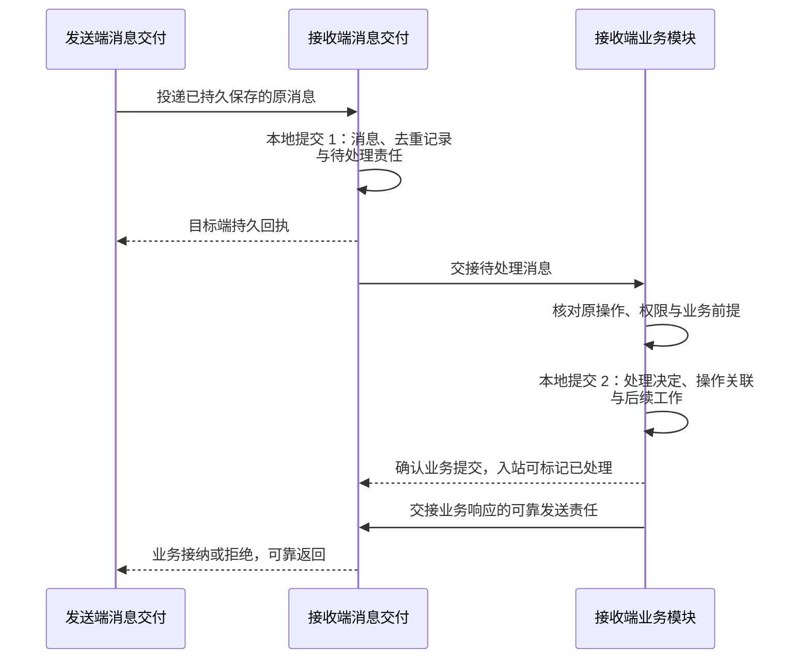
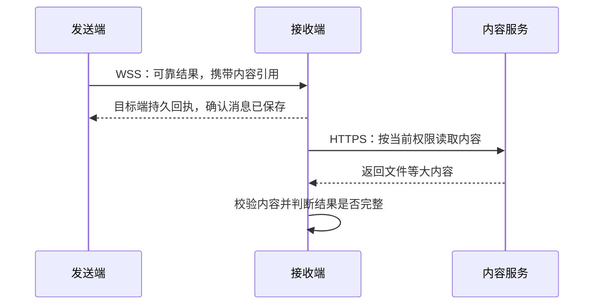

# 消息契约与可靠交接

[协议规范](protocol.md) · [传输实现](transport.md) · [恢复与控制](recovery-and-control.md) · [字段查阅](wire-format.md)

一次能力调用可能已被接收，业务尚未接纳；也可能已经执行，结果却在断线中丢失。本页规定消息交付与业务模块如何分别保存事实、确认交接，并在失败后继续承担原有责任。消息交付采用至少一次交付尝试并识别重复消息，业务模块核对原操作、实际效果及再次尝试的条件。

该选择使各领域复用持久收发，又能分别裁决业务状态；代价是接收与业务处理各有一个本地提交边界，需要沿原身份恢复。实现须提供持久账本、去重及待处理记录；记录无法可靠保存时不能确认接纳。当前交付仍是设计与静态契约，运行依赖及验证范围见[总览](README.md#scope)和[契约校验](validation/README.md)。

## 1. 两处持久交接边界

下图从接收端看一条可靠请求：发送端已经保存原消息及发送责任，接收端先承担消息保管责任，业务模块再保存处理决定。箭头表示交接，标出的本地提交是相应确认的前提；省略连接、中继及后续实际执行。

两处提交各自保证相关记录一致恢复，不要求跨模块全局事务。业务提交成功后，消息交付才能标记入站已处理；业务响应的发送责任已经保存在后续工作中，交给消息交付持久接管后才可结束该发送工作。确认丢失时重交原消息或原响应，业务凭已存决定答复，不能留下“已确认却无记录”或“已处理却无后续工作”的空档。任务内核侧的对应实现边界见[入站与出站交接](../task-kernel/storage-and-interfaces.md#delivery-store)。

| 交接边界 | 确认前须可恢复的事实 | 确认丢失或崩溃后由谁继续 |
| --- | --- | --- |
| 发送端消息交付接纳 | 消息、流序号、已核验的流注册及发送责任；接纳前检查汇总配额，容量不足拒绝或降速 | 发起方沿原 message_id 核对或重交，直至确认消息交付已接管；后者恢复原发送责任 |
| 接收端消息交付确认 | 消息、流注册、游标、去重记录和待处理责任 | 发送端在窗口内重投；接收端返回已有交付状态，并继续交接尚未处理项 |
| 业务模块提交 | 处理决定、操作关联与后续工作；交付放行后，处理端仍复核当前权限及业务前提 | 消息交付重交尚未确认处理的原消息；业务返回原决定，恢复已保存的后续工作 |
| 响应与正式结果返回 | 接纳、拒绝及正式结果的可靠发送责任 | 业务模块确认发送责任被接管，消息交付跟踪目标端回执；只在目标持久确认后提前清理载荷，必要去重和交付记录按窗口保留 |

中继的落盘回执只确认本段保管责任，不能触发发送端提前清理。保留窗口耗尽须留下失败或恢复缺口，不能静默丢弃尚未交接的责任。累计回执及中继转发见[有序交付](transport.md#ack)。

上述记录属于持续的逻辑端点账本，连接或进程替换仍须恢复原有事实，不能新建互不相知的收发与执行账本，详见[活动所有者](transport.md#endpoint-owner)。

| 可观察事实 | 业务可以据此判断什么 |
| --- | --- |
| 接收持久化回执 | 指定节点已保存消息并承担交接或失败报告责任；业务尚可能拒绝 |
| 业务接纳 | 处理决定及后续工作已保存；动作和效果尚待后续报告 |
| 执行事实 | 已知的启动、执行、失败或停止进展；效果可能仍未知 |
| 效果确认 | 原操作取得可核对的效果证据；任务核心继续判断整体目标是否完成 |

本协议不保证任意外部动作恰好执行一次。消息去重用于识别已接收的逻辑消息，业务处理及恢复仍须核对原操作与实际效果。

## 2. 消息、操作与业务状态分别关联

消息身份用于回答“是否为原消息”，操作身份用于回答“是否为原业务调用”。为了让一个对象的缺口只限制依赖它的工作，可靠消息还绑定业务作用域，并按类型确定的通道类别组织到有序流中。

| 关联 | 用途与约束 |
| --- | --- |
| `message_id`、`reply_to` | 标识逻辑消息并关联响应；重投保留消息标识与内容 |
| `operation_id` | 标识一次业务操作；同一操作的多个消息分别拥有消息标识 |
| `task_id`、控制权版本等 | 由领域载荷定义，处理端检查命令的适用性；独立 UI 不强制关联任务 |
| 业务作用域 `delivery.scope` | 可以独立核对并限制交付的任务、原操作、界面或已注册领域对象；完整类别与字段映射见[流注册](transport.md#stream-registration)，跨对象业务依赖仍须核验 |
| 通道类别 lane | 消息类型注册时确定的 work／control／recovery 类别，用于分流与调度，不直接授予业务行动资格 |
| 可靠流 `stream_id`、`seq` | source 到 target 的单向、跨连接有序序列，同端点内交接也可使用；每流固定一个作用域与 lane，同一组合可有多条流，跨流不承诺全局顺序 |
| 类型与类型版本 | 决定载荷及行为语义；只使用已安装且协商支持的类型 |

同一 message_id 或流位置不能对应不同逻辑消息；同一 operation_id 固定原调用意图，其进展和结果分别使用自己的消息标识。任务、UI 与记忆保持各自状态版本，业务版本与因果关系决定执行依赖，流内有序交付不能代替业务检查。字段和关联的精确约束见[请求与响应](wire-format.md#response)，作用域的受信解析与固定绑定见[流注册](transport.md#stream-registration)。

例如，原执行操作 O1 尚未得到结果，调用方发起查询或取消。下表只描述同一调用方到执行端的请求；M1、O1 等是阅读用别名，实际标识使用 UUID。

| 请求 | 消息／操作身份 | 作用域 | lane 与流 |
| --- | --- | --- | --- |
| 调用 | message_id=M1，operation_id=O1 | operation／O1 | work 流 |
| 查询 O1 | message_id=M2，target_operation_id=O1；纯查询可省略 operation_id | operation／O1 | recovery 流 |
| 取消 O1 | message_id=M3，operation_id=O2，target_operation_id=O1 | operation／O1 | control 流 |

三条请求核对同一个原执行操作，但取消本身是独立操作，三类请求也使用不同流。重投保留原消息及流绑定；查询可在自身权限内先行，取消是否生效仍由执行事实决定。响应继承原请求作用域，结果类型的 lane 则按注册声明，不能从请求类别推断；完整映射见[流注册规则](transport.md#stream-registration)。

## 3. 消息交付与内容承载分别选择

交付类别按消息类型的恢复需求声明，发送方不能为绕过配额或数据限制自行降级。指令与正式结果需要可恢复的责任记录，预览增量则可以由后续快照覆盖：

| 消息交付类别 | 适用内容 | 恢复方式 |
| --- | --- | --- |
| reliable | 指令、正式输入、可靠事实、最终结果 | 持久记录与目标端回执；窗口内重投，超窗转业务核对 |
| ephemeral | 文本片段、进度、预览 | 可合并或丢弃，通过快照或最终结果恢复 |

内容大小决定承载方式，与消息是否可靠分别判断。大内容通过 HTTPS 传输，业务消息携带受控引用，使控制消息不必等待文件字节全部送完。下图从结果接收方看消息与内容的两次交付；箭头分别表示 WSS 消息和获准的 HTTPS 读取：

消息回执不代表引用内容已经可用。临时增量丢失也不能据此认定业务失败，业务结论取决于可靠事实及所需内容。

| 交付约束 | 处理方式 |
| --- | --- |
| 期限 | 行动期限限制新动作启动，交付窗口限制消息保留；重投不延长二者 |
| 超窗或去重依据缺失 | 报告可查询的失败或缺口，交业务核对；旧消息不能当作全新指令执行 |
| 内容引用不可用 | 缺失、失效、不可验证或权限撤销均需报告，业务决定重新提供、等待或结束 |

最终结果依赖的内容可读取且可验证后，才能判断交付完整。失败报告须在有界记录中可查询，不能依赖立即送达失联端点。流字段与期限见[交付字段](wire-format.md#delivery)，内容传输见[HTTPS 通道](transport.md#content)；控制／恢复分流与保留容量、作用域隔离及总配额集中见[传输容量](transport.md#capacity)。

流窗口管理原消息的交付责任，业务对象的查询和保留期限由领域契约决定。删除消息载荷或退休流不能删除仍须保留的成果恢复依据；具体查询语义见[正式结果恢复](task-and-ui.md#result-recovery)，取消答复的窗口限制见[取消边界](recovery-and-control.md#cancel)。

## 4. 身份与数据限制落实到交接位置

可靠交接会保存消息和业务记录，因此接纳前也要核对允许保存哪些内容。用户及源端点绑定已验证会话，委派主体须结合受信来源及授权关系复核，不能仅凭持有 grant_ref 认定身份。转发保留原始来源，业务处理端在资源使用前复核权限、用途、范围、有效期及业务前提；委派只能收缩权限。本地用户接管优先阻止新自动动作。

| 位置 | 实现责任 |
| --- | --- |
| 路由、队列、去重、游标、交接记录 | 按用户隔离，不能因标识碰撞或引用被猜中而跨用户访问 |
| 端点账本与活动所有者 | 同一端点只允许一个有效所有者创建新责任；接替恢复原账本并隔离旧实例，WSS 会话切换不转移此资格 |
| 中继 | 只使用获准的转发信息；可靠排队所需的内容保存也须获准 |
| 资源处理端 | 分别检查读取、提取、保存、同步、行动与披露权限；留端数据加工后的结果仍检查返回权限 |
| 内容服务 | 内容引用绑定用途、访问范围与有效期，不能将持有引用等同于获准访问 |
| 日志与追踪 | 保存获准的最小关联及状态，避免复制敏感载荷或凭证 |

v1 保护各段传输，不承诺云端无法解密。数据策略禁止中继保存时，选择满足策略的路径或交付方式；无法同时满足可靠性与数据策略则拒绝，不自动降低可靠等级。回复、事件及推送的权限关联见[公共信封](wire-format.md#envelope)。

## 5. 错误交给能够处理它的模块

消息阶段的重投沿原消息继续；业务阶段的未知由原操作核对解决。例如接收确认丢失时，发送端重投，接收端凭消息记录去重；若操作可能已执行而结果丢失，查询原操作，不能因消息超时再生成一次截图。两种情况可能先后发生，分别依据交付记录和执行事实处理。

| 情况 | 处理责任与后续动作 |
| --- | --- |
| 回执丢失、消息重复 | 消息交付模块在有效窗口内重投同一消息，接收方返回原交付状态 |
| 身份或权限不成立 | 停止对应会话或业务处理，修复前保持受限 |
| 类型或能力不兼容 | 可选能力独立关闭；未知执行指令、必要类型或必要扩展不受支持时明确拒绝 |
| 容量不足、目标暂不可达 | 报告是否已持久接纳和允许的后续动作；已接纳项按原消息跟踪 |
| 业务前提过期 | 业务模块拒绝旧请求，不能通过新标识绕过检查 |
| 交付窗口耗尽、恢复缺口 | 停止自动重放，由业务核对当前状态 |
| 业务恢复证据不完整或失效 | 限制对应作用域的行动，重新取得并应用权威证据；不能从流 ready 或控制队列暂时为空推断可继续 |
| 操作效果未知 | 执行模块查询原操作；记录不足时保留未知，是否再次尝试由业务判断 |

错误须关联原请求并说明交付阶段、接纳状态与后续动作，不能把“可重试”统一实现为重新执行外部动作。字段及错误码见[错误对象](wire-format.md#errors)，原操作核对见[恢复规则](recovery-and-control.md#retry)。接收提交后崩溃、业务提交后确认丢失、外部效果已发生但结果丢失，须分别在[运行验收](validation/README.md#runtime)中观察消息记录、业务回执与真实效果；静态用例不能证明持久交接成立。
