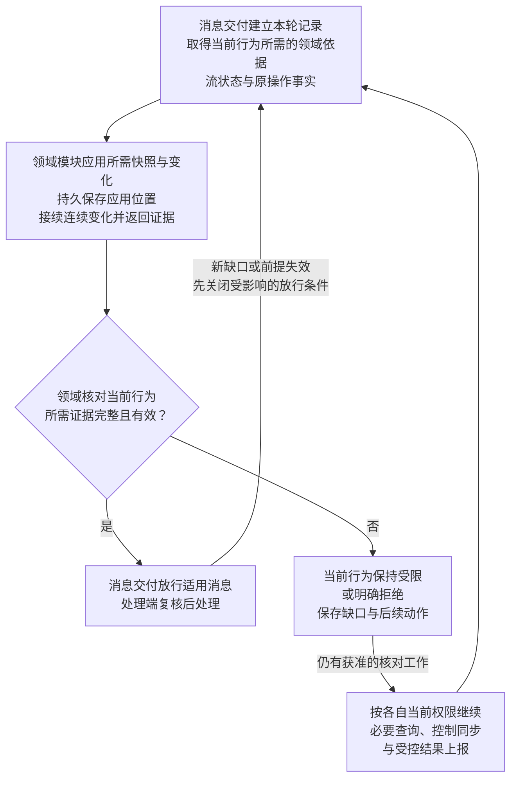
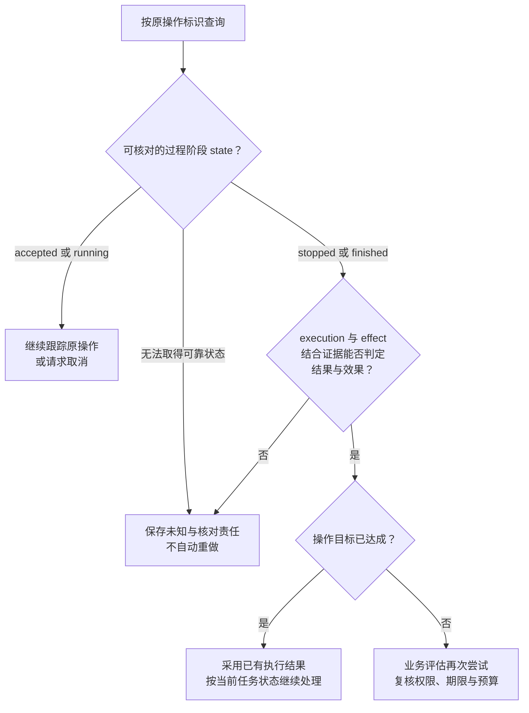
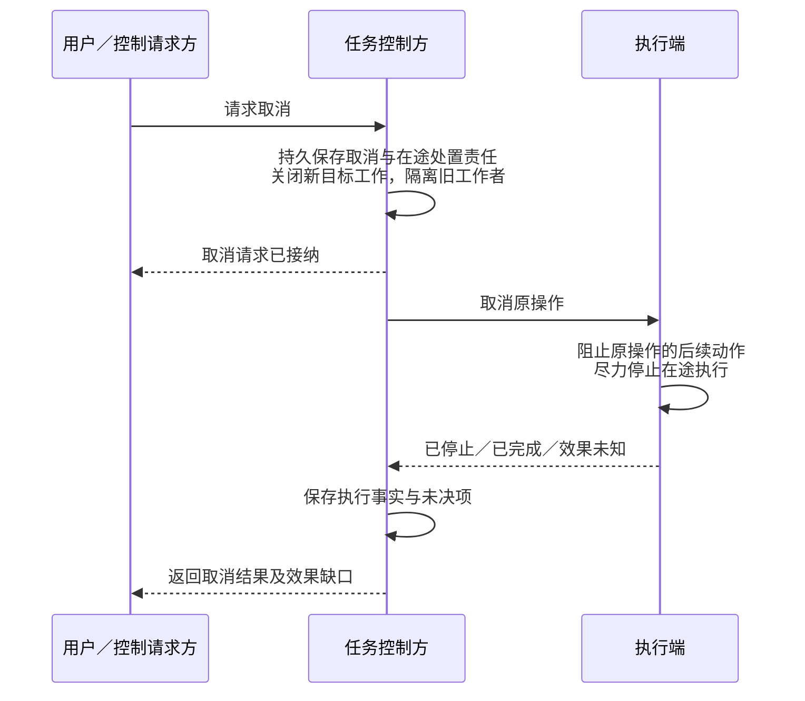
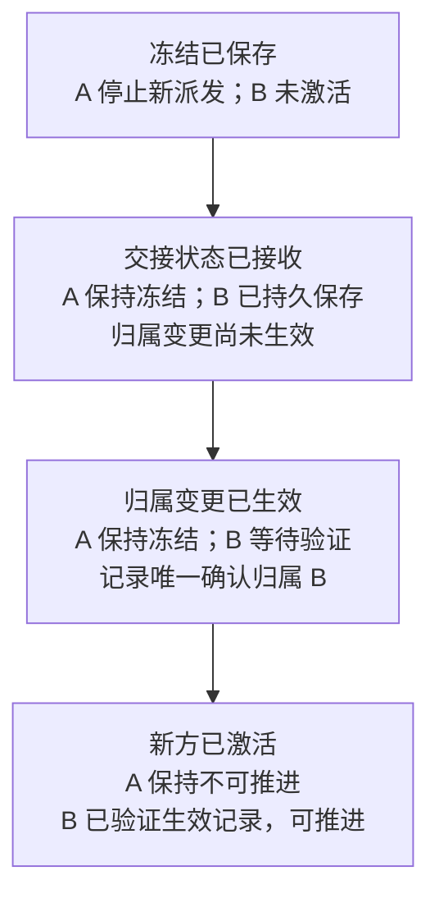

# 恢复与控制

[协议规范](protocol.md) · [可靠交接](message-contract.md#handoff) · [流恢复字段](transport.md#stream-resume)

恢复要同时解决两件事：继续承担已接纳的责任，并阻止已失效的旧行动。消息交付模块组织核对、保存缺口并按结论放行，领域模块裁决业务状态，处理端在使用资源或启动行动前落实当前限制。恢复查询和迟到事实也有自己的权限条件，不能因新行动被禁止而一并丢弃。

首期同用户任务及内核操作共用一个[固定写权威](../task-kernel/lifecycle.md)，父子任务各自保存状态和承担推进责任。执行端可以分布部署，端点实例接替不转移任务控制权；控制权交接属于[后续能力](#ownership)。

本篇定义恢复所需的接口责任与证据，运行实现尚待验证。身份、记忆及其他领域的[跨端合同](domain-profiles.md)已纳入 v1；缺少已安装、已协商且经过验证的处理器或恢复证据时，相关行为保持受限。首次恢复通过独立受限资格取得身份依据，不能因行动门禁尚未开放而阻断恢复自身。依赖远端缓存依据的离线模式默认关闭；原取消固定答复在领域保留期内独立查询，见[取消](#cancel)。

## 1. 按作用域核对，按行为放行

**业务作用域**是可以独立核对并控制交付的任务、原操作、界面或已登记领域恢复对象。按作用域恢复，使一个任务的缺口不阻塞无关任务；同一作用域内仍须分别判断接收事实、查询、取消和新行动。代价是维护各领域的恢复证据及行为限制，不能用一个全局 ready 表示完成。作用域之间的业务依赖继续成立，执行操作独立分流后仍受所属任务的取消约束。

恢复产生三个不同结论，各自依赖相应证据：

| 判断 | 证据与负责方 | 可以据此做什么 |
| --- | --- | --- |
| 连接可用 | 连接与传输完成会话、身份、能力及端点活动所有者核验 | 使用连接通信；首次连接同样核对初始业务状态 |
| 流可续传 | 消息交付核对目标端持久位置、连续前缀及保留窗口 | `ready` 允许按流规则恢复原消息；`core.resumed` 不提供业务恢复证明 |
| 某类业务行为允许 | 领域模块核对该行为所需的权威状态、权限、原操作及依赖 | 消息交付解除对应限制，处理端逐项复核；可允许接收事实而仍禁止新行动 |

恢复以可靠消息经核验的 `delivery.scope` 为对象，字段与流的固定绑定集中见[流注册](transport.md#stream-registration)。该字段只标明要核对的对象，不代替恢复证据；一个缺口只限制依赖它的工作，其他独立作用域按各自依据继续。

会话可通信后，消息交付为本轮恢复建立记录，汇集各领域快照、修订和原操作事实。**同步切点**表示快照已覆盖的位置；领域权威还须提供从该位置连续取得后续变化的依据。下图描述本轮核对到放行的处理步骤，对每一类行为分别执行判断：

查询、控制同步和受控结果上报按自己的当前权限推进，不等待旧行动先获准，否则恢复会被自己依赖的门禁阻塞。lane 只用于分流与调度：v1 的执行事实、执行结果和取消结果注册在 `work` lane，关闭新行动不能直接关闭整个 work 类别。完整映射见[流注册](transport.md#stream-registration)。

快照生成期间的变化必须落在快照或切点后的连续记录内，不能留出“快照已取完、订阅尚未建立”的丢失窗口。各领域按自己的修订持久应用；发现变化缺口、证据过期或来源失效时，先关闭依赖它的行为，再重新核对。各权威不要求原子生成同一时刻的快照，因此一次恢复完成也不提供瞬时全局撤权保证；处理端仍按行动所需的新鲜度复核权限、取消、任务控制及原操作前提。

首次连接和重连都须取得当前权限及适用业务依据。必要权威不可达、记录不足或尚未持久应用时，依赖该证据的行为等待；本地旧缓存和旧离线许可不能代替本轮所需证据，需要实时证明但无法取得时同样等待。失效的 UI 回应也不能重新绑定到新请求。领域职责、接口和证据集中见[核对查阅](#recovery-reference)，流状态见[传输与会话](transport.md#stream-resume)。

运行时须注入快照切点前后的并发取消／撤权、后续变化缺口、旧恢复答复迟到及端点所有者更换，分别观察已应用位置、允许行为和实际行动。具体验收见[恢复与控制矩阵](validation/README.md#runtime)；流 ready 或控制队列暂时为空均不足以证明业务恢复成功。

## 2. 先核对执行过程，再判断效果与重试

响应丢失、超时或恢复发现缺口时，先核对原操作。消息交付在交付窗口内重投原消息；执行协调器保存并核对操作事实，业务模块据此决定是否再次尝试。消息重投继续履行原交付责任，业务再次尝试则可能产生新的外部动作，二者不能共用一个无条件重试开关。查询不到记录、节点不可达或交付窗口耗尽，都不足以证明动作未发生。

执行查询分别返回三个维度，不能用其中一项替代其他结论：

| 字段 | 表达什么 | 判读边界 |
| --- | --- | --- |
| `state` | 执行过程阶段：accepted、running、stopped、finished | stopped／finished 表示过程停止或结束，尚不能证明效果已知或目标已达成 |
| `execution` | 是否启动、执行、失败，或执行事实未知 | failed 可以同时伴随部分外部效果或未知效果 |
| `effect` | 效果是否适用、已确认、未观测到或未知 | not_observed 不证明动作未发生；须结合能力语义与证据判断 |

例如 `state=finished`、`execution=failed`、`effect=unknown` 表示执行过程已经结束，但外部效果仍待核对。若原操作属于任务，任务核心保存有限的查询／取消责任；主动核对预算耗尽后报告缺口，仍可接收获准的迟到事实，完整规则见[任务恢复](../task-kernel/recovery-and-validation.md#recovery)。当前契约支持原操作核对、受信补证及管理回执查询；补证按原任务／条件及事实权威验证，普通 UI 输入不能替代效果证据。

再次尝试须同时满足动作语义、原操作事实及当前授权条件，消息交付模块不能生成新的操作标识绕过去重。已有执行结果也不能重开已取消的任务。错误码与 retry 指示见[错误对象](wire-format.md#errors)。

## 3. 离线执行限定在已获准的本地工作

本节的离线指当前无法联系所需权威、依赖有限缓存证明继续工作，默认关闭，只有端点的授权、时间和运行存储适配器通过验证后才可启用。全部权威与依赖在本地并实时可核验时，公网断开不构成本节的缓存许可模式；该配置仍须有实际本地身份及执行依据。有限离线许可使已获准的本地工作能够持续，同时接受远端撤权无法即时到达的限制；需要实时权限确认的行动仍须联网。许可编码与跨端证明已在身份 P1 定义，实际签名验证、可信时间和防回滚仍须取证，完整机制见[离线许可与可信时间](../identity-and-authorization/mechanisms.md#offline)。

| 必须满足的条件 | 不满足时 |
| --- | --- |
| 当前实例仍是该逻辑端点的活动所有者 | 停止以该端点产生新消息或行动；会话重连不能代替所有者验证 |
| 本节点是任务控制方，或持有相应已委派工作的权限 | 等待原控制方或相关依赖；不能因父任务失联取得整个任务的推进权 |
| 所需能力、数据及依赖本地齐备 | 等待依赖恢复 |
| 许可明确允许离线，范围匹配且仍有效 | 停止新行动，等待授权或用户处理 |
| 可信时间、防回滚及唯一本地账本依据仍有效 | 停止新的离线使用；不能通过重启、恢复旧快照或重新下载许可延长有效期、重置已消费事实 |

上述条件必须同时满足。许可到期阻止新的使用单元，本地用户中断立即阻止新自动行动并尽力停止在途操作；已发生或未知效果沿原操作核对，不能假定已回滚。云端撤权的传播受离线许可窗口约束，重连后的上报、保存和同步仍分别授权，恢复不能成为上传受限数据的理由。

离线实例仍可能合法行动时，新会话不能自行夺取同一端点的活动所有权。接替须恢复原账本并证明旧实例不能继续产生新工作；证明不足则等待，不能只依据连接断开或网关记录变化激活替代实例，详见[端点与活动所有者](transport.md#endpoint-owner)。

## 4. 取消意图与执行事实分别收敛

取消先关闭新目标工作，再收敛在途操作。任务核心持久保存控制决定与后续处置责任，执行端报告停止、完成或未知效果；任务终态与外部效果分别裁决，使失联执行端不会无限阻塞本地取消，又能保留尚未解决的责任。

图中“取消请求已接纳”仅确认取消决定和后续责任已提交。任务进入 `cancelled` 还须满足本地不再产生或准备目标工作、旧工作者资格已隔离、所有可能在途项都有持久处置责任；这些条件不要求远端已经停止。远端失联或效果不明时保留 `effects_pending=true`，取消回执、节点断开或连接恢复均不直接清除它。完整裁决见[任务内核的取消规则](../task-kernel/lifecycle.md#cancel)。

例如云端控制任务、电脑执行原操作 O1，电脑断线期间用户取消，O1 的结果在重连后迟到：

| 阶段 | 恢复后的行为 |
| --- | --- |
| 云端接纳取消，电脑仍失联 | 关闭新目标工作并保存 O1 的取消／核对责任；本地屏障完成后可进入 cancelled，保留未知效果 |
| 电脑重连 | 核对本轮取消与授权依据、原流及 O1；窗口内按连续前缀恢复原消息，有缺口则补齐或查询原操作，不重新启动 O1 |
| O1 的结果迟到 | 核验来源、原操作关联和当前接收、保存及披露权限；获准时接收事实，任务的新目标行动仍关闭 |
| O1 已结束且效果已确认 | 保存真实效果并更新任务修订，任务仍为 cancelled；只有没有其他开放项时才清除 effects_pending |

执行失败但效果未知、单独取消回执或设备重连都不足以清除待核对项。迟到事实不覆盖已固定的取消答复或正式任务结果，当前状态另行查询。完整异常推演见[断线、取消与迟到效果](../task-kernel/recovery-and-validation.md#cancel-example)。

窗口内可沿原可靠结果消息恢复取消答复；前序正文缺口使答复受阻时，立即通过 `task.query_cancel@1` 或 `execution.query_cancel@1` 读取领域账本中的原固定答复，不等待窗口届满。超窗后仍使用这两个查询，在领域保留期和当前权限内核对。查询绑定原取消及其目标，当前状态、正式任务成果和后来的效果均不能重建原答复；查询成功不补齐旧流或推进其 ACK。领域尚未固定答复、原记录已清理或不可读取时明确返回未决／缺口／拒绝；无权查询不泄露对象存在性。保留规则见[内核接口](../task-kernel/storage-and-interfaces.md)。取消操作与原调用的标识、结果关联见[任务及 UI 消息](task-and-ui.md#catalog)，异常规则见[取消边界查阅](#cancel-reference)。

## 5. 核对接口与边界查阅

### 5.1. 领域职责与放行依据

| 核对对象 | 负责模块 | 放行依据 |
| --- | --- | --- |
| 业务授权与撤销 | 授权服务、处理端 | 获准范围、用途、接收方和有效期成立；撤销快照及后续变化已连续衔接 |
| 取消与任务控制权 | 任务核心／协作任务端点 | 权威任务修订及取消记录已应用；当前控制方和允许继续的工作已确认 |
| 消息缺口与重复 | 消息交付模块 | 窗口内补齐；超窗报告缺口并转领域恢复 |
| 原操作及外部效果 | 执行协调器 | 已知结果复用，未知效果继续查询或待处理 |
| 记忆修订与删除 | 记忆服务／同步 | 按获准视图和领域修订核对，不按到达顺序覆盖 |
| UI 快照与待转交输入 | UI 管理器 | 快照有效，输入仍指向有效请求、版本及权限 |

### 5.2. 核对接口与完成证据

实现须提供以下领域核对接口。表中定义调用关系与返回责任，不增加新的核心会话消息；权威在本地时可本地调用，跨端时须有已安装、已协商的领域同步契约。

| 接口职责 | 输入与发起方 | 权威返回与接收方责任 |
| --- | --- | --- |
| 取得恢复快照并接续变化 | 消息交付提交用户、作用域、本次恢复标识、端点活动所有者及已知修订 | 各领域权威返回快照、领域修订、同步切点及从该切点连续取得后续变化的依据；无法满足时明确报告缺口 |
| 应用快照与控制变化 | 所属领域模块接收上述数据，验证来源、关联与适用权限 | 持久保存快照、已应用位置及取消／撤销等控制事实；返回应用完成证据，不以仅收到快照代替应用完成 |
| 判定允许继续的责任 | 消息交付汇集各领域证据、流状态及原操作事实，调用对应领域核对接口 | 领域返回可接收的事实、可继续的行动、仍受限项和依赖；消息交付只解除这些行为对应的限制 |

| 完成证据 | 必须包含的关系 |
| --- | --- |
| 恢复身份 | 用户、作用域、本次恢复标识、端点及活动所有者绑定；旧实例或上一轮答复不能开启本轮门禁 |
| 权威状态 | 权威来源、快照修订和同步切点；各领域独立版本，不伪造跨领域统一版本 |
| 应用与连续性 | 已持久应用至切点，后续变化入口已接续；变化缺口、来源失效或证明过期必须可检测并关闭受影响的放行条件 |
| 业务结论 | 允许行为及其依赖、权限证明和适用有效期；任务可接收事实而仍禁止行动，不能压成一个全局 ready |

### 5.3. 取消边界

| 边界情况 | 处理要求 |
| --- | --- |
| 用户在本地接管 | 执行端立即阻止新自动操作并保存控制变化，随后同步，无须等待云端 |
| 远程执行端失联 | 保留并优先同步取消意图，仅报告已知状态，不宣称远端已停止 |
| 取消与完成并发 | 保留真实完成事实和取消请求，不以取消覆盖已发生效果 |
| 已执行动作不可撤销 | 补偿行动另行判断能力与授权，取消不隐含回滚 |
| 在途效果未知 | 停止后续派发，保留待核对记录 |
| 取消先于原调用到达 | 执行端可拒绝未找到目标；保留该答复并继续核对，原调用出现后可按权限建立新的取消尝试。v1 不保证持久保存先到取消以屏蔽后到调用 |
| 同一取消操作重投 | 返回原接纳决定及已固定结果，不因重投创建新操作；后续事实通过当前状态核对 |
| 取消结果被同流前序正文缺口阻塞 | 立即以原取消关联启动 recovery 查询；不等窗口、不新取消、不跳序，原交付缺口另行保留 |
| 取消结果超出交付窗口 | 查询领域保存的原固定答复；超过领域保留或无恢复依据时报告缺口，当前状态不能重建原答复 |

## 6. 后续能力：控制权交接（首期关闭）

后续交接保留“原方先冻结，新方取得唯一生效依据后激活”的约束，不提供超时自动撤回或自动强制接管。启用前须补齐用户级操作身份的路由与迁移去重、交接载荷、权威记录及唯一生效机制；以下图表仅规定该条件能力，不能作为首期已支持交接的依据。

图中每个节点均为同一次 A → B 交接的阶段，同时标出双方状态：

| 实现约束 | 必须保留的事实 |
| --- | --- |
| 原方冻结 | 冻结持久化，重启不能恢复派发；在途动作仍可能继续或效果未知 |
| 状态交接 | 包含任务状态、已派发操作及未知效果、待处理工作、取消状态和授权依据 |
| 唯一生效 | 以当前控制方及控制权版本为前提，仅允许一个目标生效；延迟和重复请求不能再次转移 |
| 新方激活 | 验证唯一生效记录后才能推进，接收快照本身不授予控制权 |
| 在途工作 | 沿用原操作关联继续核对；处理端检查适用的控制权版本与授权，交接前已持久派发且列入交接记录的工作按原操作恢复，其余旧命令不能创建新工作 |
| 交接不明或原方失联 | 查询同一次交接记录；无法证明原方停止新派发时等待，双方均不能因超时自行恢复推进 |

未来若支持撤回或强制接管，须额外证明旧控制方及相关执行路径不能继续产生新的派发；只修改云端归属记录不足以满足这一条件。
