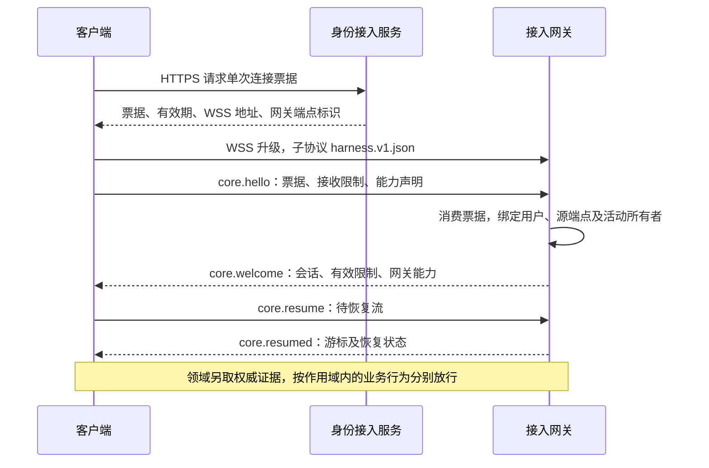
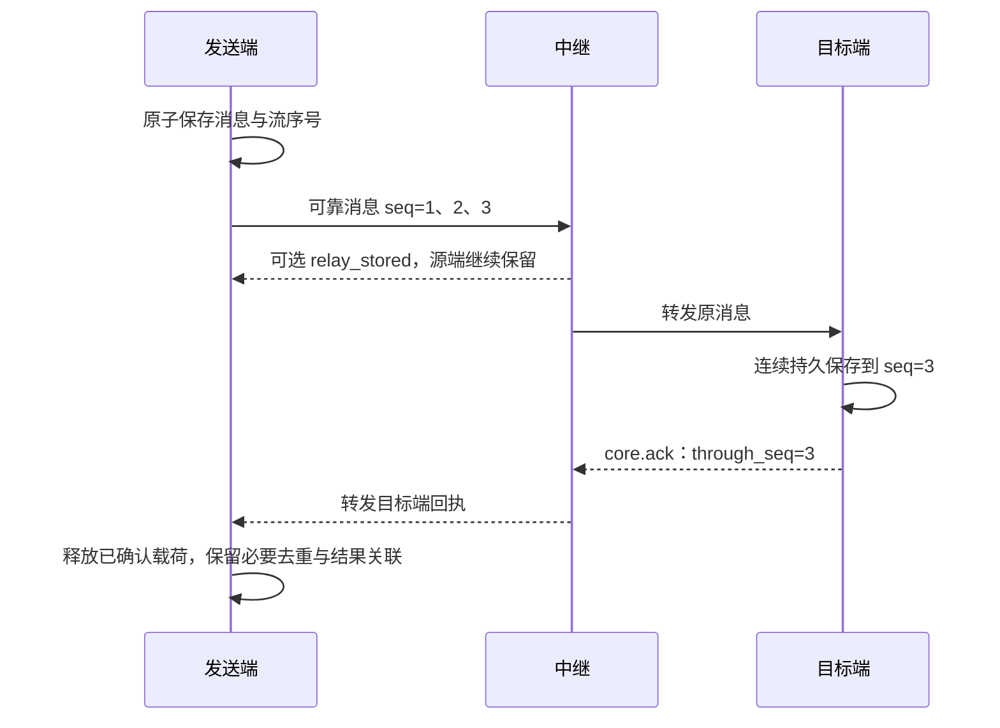

# 传输与会话

[协议规范](protocol.md) · [消息契约](message-contract.md) · [恢复条件](recovery-and-control.md#resume) · [字段查阅](wire-format.md)

v1 选择 WSS／UTF-8 JSON 作为浏览器、原生端和服务端的共同消息通道，HTTPS 承载票据与大内容。当前定义的接入路径是经网关建立 WSS 会话；首期维护一种线格式和接入路径，不并行提供 Protobuf 或 SSE 降级，连续音视频另行扩展媒体通道。

端端直连属于条件能力；接入、对端身份验证及路由来源绑定的契约与实现验证补齐前不启用，完整边界见[v1 范围](README.md#scope)。本文依次规定会话、端点身份与路由、可靠流及容量、内容通道；精确信封字段集中在[线格式](wire-format.md)，接入绑定与参数集中在[文末查阅表](#reference)。

连接与传输模块保护链路并维护会话；消息交付保存流注册、游标及收发责任；领域模块提供业务恢复结论。WSS 已连通、消息可续传和业务可行动分别判断。身份、持久存储或领域依据无法落实时，相关接纳及恢复保持受限，不能以会话建立代替这些保证。

## 1. 建连、认证与业务开放

连接票据通过首条 `hello` 提交，使浏览器和原生端复用同一握手，不依赖浏览器设置自定义认证头，也避免票据进入 URL。身份成立后继续协商能力和恢复状态，再开放满足条件的业务。图表示客户端经网关接入的一次正常建连；箭头为网络交互或网关内部提交，业务放行另依赖领域核对。

`core.*` 在文中省略 `harness.` 前缀。首次连接没有待恢复流时，`streams` 为空；仍须取得初始业务恢复依据。`core.resumed` 只报告流恢复状态，收到它不直接开放业务。

| 阶段 | 实现约束 |
| --- | --- |
| 票据签发 | 使用已认证的 HTTPS 身份；票据绑定用户、逻辑端点、服务受众和有效期，单次消费 |
| 认证前 | 只接收一个 `hello`，限制大小与等待时间；失败结束连接，不接收业务消息 |
| 认证后 | 票据消费与连接绑定持久成功后才返回 welcome；一个连接对应一个用户、源端点及其获准活动所有者，网关校验上行 `source` 及所有者资格 |
| 凭证保存 | 票据不进入可靠队列、日志或业务快照；示例使用虚构票据 |
| 重连与到期 | welcome 丢失或其他重连均重新申请票据并协商，保留原消息、操作及流标识；会话到期发送 `goodbye` 后断开，不在存档消息中刷新凭证 |

## 2. 端点身份、能力与路由

会话可以重建，原消息与执行责任仍属于持续的逻辑端点。先核对谁可以使用该端点账本，再确定目标能力和可信转发路径。

### 2.1 端点账本与活动所有者

**逻辑端点绑定一个持续的持久账本，首期只有一个活动所有者。** 活动所有者是获准使用该端点身份进行收发和业务执行的运行实例；其身份／代次区别于 WSS 会话，也区别于任务的 `owner_epoch`。账本包括出入站消息、流注册及游标、去重、待处理责任和恢复所需的业务操作关联；各模块仍按[持久交接边界](message-contract.md#handoff)保存自己的事实，不要求全局事务。

活动所有者的验证和持久隔离由身份与运行存储提供，网关及本地执行入口共同落实。身份模块已定义[内部身份绑定与受信本地接替](../identity-and-authorization/contracts.md#identity)；跨端证明的协议映射、跨主机等价隔离证明及适配器实现验证仍待落实。v1 的 `session_id`、票据字段及 `owner_epoch` 均不能替代该机制；无法落实所需隔离依据时不启用接替。

| 情况 | 身份与恢复要求 |
| --- | --- |
| 同一实例重连或使用多条链路 | 共享原账本及活动所有者资格；所有链路汇总配额，不能各自分配同一流的序号或独立执行原操作 |
| 新实例接替 | 恢复原账本与操作事实，持久确认新所有者及旧所有者隔离依据，再开始本轮恢复；旧实例不能继续写新消息、领取工作或启动行动 |
| 仅替换 WSS 或更新网关会话 | 只改变连接，不能证明旧实例及其本地执行路径已停止；不得据此激活第二个所有者 |
| 旧实例失联或仍有有效离线许可 | 未能证明旧实例已隔离时等待；不能凭网络超时夺取同一身份。隔离新行动后，既有在途效果仍沿原操作核对 |
| 账本丢失或新安装 | 不得冒充原端点从空账本续传；经身份模块注册新端点，或明确进入原端点恢复缺口。新身份不能自动重做旧操作 |

运行验收须注入旧连接迟到、双实例使用同一身份、接替后旧进程继续运行及离线旧实例恢复，确认只有有效所有者可以创建新责任。

### 2.2 协商目标能力并保留来源

协商分两层：`welcome` 描述网关自身能力，`describe` 查询最终目标端点。发送方选择目标可接收的类型版本，不能用网关能力代替目标能力。

| 消息 | 协商内容 |
| --- | --- |
| `core.hello` | 支持的协议版本、接收限制、消息／扩展／视图能力 |
| `core.welcome` | 选定协议、会话标识、双向有效接收限制、心跳参数及网关能力；`reply_to` 指向 hello |
| `core.describe` | 查询同用户可访问端点的能力；查询不授予端点使用权限 |
| `core.capabilities` | 目标端点、能力修订、接收限制及类型版本；响应查询时填写 `reply_to` |

能力声明的 `kinds` 表示该端点可接收的类别。请求发出前，目标须支持相应 `request`，源端点须支持相应 `response`；事件消费单独声明。核心会话控制类型为必需，业务领域按能力启用。

网关保留原始源、目标及业务字段，不改写操作标识或将未知消息翻译成另一种操作；整条路径的接收限制均须满足。目标信任已认证网关转交的来源绑定，因此网关负责拒绝伪造 `source` 和跨用户目标。v1 的信任模型不覆盖不可信中继。用户身份来自受信连接，委派主体结合 `authorization.grant_ref` 与受信来源关联复核，具体身份绑定见[身份契约](../identity-and-authorization/contracts.md#identity)。

## 3. 可靠流：注册、确认与续传

可靠流把一个作用域、一个调度类别内的消息组织为连续序列。固定绑定使缺口可归属到具体对象，连续回执使发送方知道哪些载荷可以清理；代价是不能跳过缺失序号，需通过独立控制或恢复流继续核对业务。

### 3.1 先固定作用域与流注册

[业务作用域、lane 与可靠流](message-contract.md#identity)分别回答恢复哪个对象、按什么类别调度、在哪个序列中交付。流身份为 `(用户, source, target, stream_id)`，跨重连保留，退休后不得复用；序号从字符串 `"1"` 连续增长。

每条可靠消息携带 `delivery.scope`，结构与类型由[交付字段](wire-format.md#delivery)定义。lane 取已安装类型注册的 work／control／recovery 类别，不由单条消息自报。

每条可靠流只承载一个业务作用域，并固定一个 lane。发送端和接收端都通过已安装类型及受信业务关联解析作用域，验证 `delivery.scope` 与解析结果相同，再原子保存流身份及绑定；不能盲信客户端标签，未知关联先核对。标准消息按下表确定作用域：

| 消息 | 固定作用域及关联来源 |
| --- | --- |
| 任务状态、结果、输入、控制、投影请求与事件；大脑调用 | kind=task，id 为 `task_id`；按类型载荷或已保存的任务关联核验 |
| 执行请求与事件 | kind=operation，id 为原执行操作；调用及事实使用原 `operation_id`，查询／取消请求及取消结果使用 `target_operation_id`，不得误用取消请求自己的操作 ID |
| UI 内容、输入、动作及呈现请求与事件 | kind=surface，id 为 `surface_id`；输入消费仍核验其关联任务和输入请求，界面分流不改变业务归属 |
| `task.query_operation`、`ui.query_operation` 请求 | kind=operation，id 为 `target_operation_id`；即使尚未解析出任务或界面，也可在查询权限内独立核对 |
| 任务与 UI 目录、订阅 | kind=collection，id 为获准 collection_id；目录过滤与订阅绑定仍由处理方核对 |
| 授权恢复、目录、记忆、内容与治理 | 按注册的 authorization／catalog／memory／content／collection 对象，使用其固定恢复、集合、内容或命令身份 |
| 委派及发布 | kind=operation，分别使用原 D 或专用批准操作 approval_id；控制命令自有身份，不能替代被管理对象 |
| 响应 | 通过 `reply_to` 及已保存请求继承其作用域，拒绝响应也不重新分配作用域；lane 按该类型的注册声明 |

完整映射以[标准注册表](schemas/standard-registry.json)的 `scope_binding={kind,field}` 为准。field 是请求／事件的信封字段或 `payload` 内路径；响应一律继承已保存请求。字段相等只是结构关联，处理器仍核验对象确属当前用户、端点、原调用或订阅。`target` 形式的查找集合绑定经过认证的目标权威，不表示可访问该权威的全部记录。

同一流不得混入另一作用域或变更 lane，重投保留原绑定及全部消息内容。缺少 `delivery.scope` 或与领域解析、流注册不一致时拒绝接纳。新流不能绕过该作用域尚未完成的恢复、业务限制或总配额。扩展消息类型同样须提供可验证的作用域解析及恢复规则，缺失时不接纳其可靠消息。

### 3.2 目标回执与载荷清理

目标端确认连续持久位置，发送端据此回收载荷；中继保管与目标接收分别报告，避免中继落盘后源端过早失去恢复依据。图表示同一可靠流经中继交给目标的过程，箭头为消息或回执；目标保存后才可确认，中继转发保持原身份。

| 项目 | v1 规则 |
| --- | --- |
| 回执身份 | ack 的 source 为原目标，target 为原源；载荷携带原流双方、stream_id 和 through_seq |
| 确认范围 | 仅覆盖连续持久前缀；可提前保存乱序消息，交接仍等待连续前缀，实际执行顺序由业务依赖决定 |
| 中继回执 | 仅以自身身份发送 `relay_stored`，不冒充目标，也不触发源端提前清理 |
| 回执丢失 | 回执不再要求回执；通过重投或恢复重新取得，业务响应和结果不能代替流游标 |
| 身份冲突 | 同一 message_id 或同一流序号对应不同内容时报告 `core.identity_conflict` 并停止该流；JSON 键顺序不构成内容差异 |

目标回执丢失时，源端仍保留原消息并重投，目标凭持久记录返回已有位置。接收后崩溃由目标恢复待处理责任，不能因为已向源端确认就丢弃业务交接。消息接收、业务接纳与结果报告的完整提交边界见[可靠交接](message-contract.md#handoff)。

### 3.3 重连后核对连续位置

`core.resume` 提交各流的 `last_sent_seq`、`known_acked_seq`，`core.resumed` 返回有证据的目标持久位置。网关尚未取得目标证明时不能报告 ready；下表只裁决流能否续传，业务按[恢复流程](recovery-and-control.md#resume)另行放行。一次请求及响应最多携带 256 条流，更多流分批核对，各答复只覆盖本批列明的流；未列出不能视作已恢复，已取得完整依据的作用域可先开放。

| 流状态 | 游标与允许行为 |
| --- | --- |
| `ready` | through_seq 必填；从确认位置之后重投窗口内原消息，行动仍检查授权与 expires_at |
| `reconcile_required` | 仅在持久位置已知时填写 through_seq；暂停旧行动，业务核对后仍须补齐该流的连续交付依据，才能再次 resume 为 ready |
| `unknown` | 省略 through_seq；记录不足，不能跳过旧序号或宣称从未执行 |
| `expired` | 省略 through_seq；业务核对后用新流承载新工作，不能改写旧消息重投 |

未知位置不能填虚构的 0。返回位置不得大于源端已发送位置，也不能倒退后被源端静默接受；目标丢失曾确认记录属于恢复缺口。消息去重至少保留到 `retain_until`，累计游标覆盖对应恢复窗口，旧消息超窗后转入业务核对。

某个序号无法补齐时，后续消息即使已落盘也不能跳过该位置交接或累计确认。缺失项窗口耗尽后，保存未交接项的失败／缺口及业务核对责任，封闭旧流的新发送；获准的新工作用新流承载，不给旧消息重编号、换流或延长期限。流退休不等于任务、操作或内容可删除：保留尚有效的去重、游标及结果关联，旧 ID 永不复用，迟到消息按旧流事实或缺口处理。

## 4. 容量与调度

[流恢复](#stream-resume)只解决原消息从哪里继续。恢复查询和取消还需要在普通工作拥塞时取得处理机会，因此按 lane 分流并保留独立容量；所有流和连接仍受汇总配额约束。

查询沿注册的 `lane=recovery`，取消沿 `lane=control`。有缺口的执行流可经独立恢复流查询原操作，不要求旧行动先获准；其他已就绪作用域继续处理，跨作用域依赖仍由领域核对。消息不能自报优先级绕过行动限制。

lane 用于分流与调度，业务放行仍逐类判断。例如 `execution.fact`、`execution.result` 和取消结果使用 work；禁止新行动时仍可能允许获准的结果上报，不能将整个 work 类别当作新行动开关。

| 容量边界 | 检查与满额行为 |
| --- | --- |
| 用户、目标、会话及单流 | 先汇总适用配额，再限制单流；消息数与字节数同时满足，增加流或连接不能扩大总额度 |
| 持久队列与活跃流注册 | 建流、接纳消息前检查；满额背压或拒绝，不为新流静默清理已接纳责任 |
| 控制、恢复与会话队列 | 普通工作不能占用控制／恢复保留容量；核心会话消息另设有界队列 |
| 恢复批次 | 分批且受调度限额约束；大量历史流不能饿死其他用户或就绪工作 |

临时消息不占可靠在途额度，收发队列仍有界，可合并或丢弃。浏览器限制写入 WebSocket 前的本地缓冲并优先调度控制；已进入 TCP 的字节不可抢占，因此保留容量不构成拥塞下取消零延迟的保证。

参考额度集中在[参数表](#reference)。[运行验收](validation/README.md#runtime)须观察流注册、游标、业务门禁和总占用，覆盖非法作用域／lane、缺口隔离、迟到旧序号、超过 256 条流及多连接总配额；Schema 通过不能证明调度与持久行为。

## 5. HTTPS 内容通道

大内容独立传输，消息仅携带内容引用，使文件传输与业务控制分别限额。内容服务由受信配置或端点发现取得，不接受消息中任意下载地址。`content_id` 的使用仍需授权，UI 呈现、云处理及长期保存分别检查用途。

内容上传的持久化条件保持如下表；提供端的来源关联、引用保留、当前状态证明及本端清理责任统一见[内容与来源的共同交接](../content-and-provenance.md)。该专题补充内部提供方合同，不给本节 HTTP 接口增加字段或原上传查询能力，也不把内容服务的清理回执解释为外部派生副本已全部删除。

| 交接 | 成功依据与异常责任 |
| --- | --- |
| 上传方 → 内容服务 | 内容服务完成持久性与摘要检查后返回引用；响应丢失留下的孤立临时内容按生命周期清理，重复上传不创建新任务操作。引用发布前确认所需的[有限保留责任](../content-and-provenance.md#publication) |
| 读取方 → 内容服务 | 服务按当前权限返回内容，读取方校验长度及摘要；引用失效、无权或字节不可取时向业务报告缺口 |
| 结果接收方 → 业务模块 | 所需内容可读且可验证后才能确认完整交付；消息回执仅确认消息已保存，详见[内容交付边界](message-contract.md#delivery) |

v1 不要求分片续传；后续 Range、分片或媒体绑定须保留相同的授权与完整性语义。接口路径、授权头和 HTTP 状态集中在下节。

## 6. 接入绑定与参数查阅

| 项目 | 固定绑定 |
| --- | --- |
| WSS | `wss://<gateway>/harness/v1/connect`，子协议 `harness.v1.json` |
| 编码 | UTF-8、无 BOM；一个 WebSocket 文本消息对应一个 JSON 对象，使用 JSON Schema 2020-12；不接收批量数组、NDJSON 或二进制业务消息 |
| 分片 | 传输实现组装 WebSocket 分片，大小限制作用于组装后的 UTF-8 字节数，不以单个 frame 为业务消息 |
| 连接票据 | `POST /harness/v1/connect-tickets`；JSON 请求含 endpoint_id，响应含 ticket、expires_at、websocket_url、gateway_endpoint_id，禁止缓存 |
| 恢复引导 | `POST /harness/v1/recovery-grants`；已认证宿主请求 endpoint_id、requested_authority，返回 bootstrap_grant_ref、权威／端点／owner／账本绑定、expires_at 与有限 allowed_types；禁止缓存 |
| 本人管理引导 | `POST /harness/v1/management-grants`；仅当前本人强认证的受信宿主，按 endpoint_id、requested_authority 与有限 allowed_types 请求，返回本人管理资格及 recent_auth_until；不允许 Agent 代取或委派 |
| 上传内容 | `POST /harness/v1/contents`，请求体为媒体字节；返回 content_id、提供端点、媒体类型、字节数、SHA-256 |
| 读取内容 | `GET /harness/v1/contents/{content_id}`；按内容引用校验返回值 |
| 内容授权 | 已认证 HTTPS 身份及 `Harness-Grant-Ref`；内容服务复核用户、读取／保存动作与用途 |

恢复引导凭据由身份权威独立校验，只开放[受限恢复路径](domain-profiles.md#2-首次授权恢复)；Agent／插件不得取得宿主资格，网关连接票据不能代替它。登录、设备注册和票据内部格式由身份模块提供，仅持有 endpoint_id 不构成身份依据。HTTP JSON 使用 `application/json`；票据、恢复及本人管理引导成功为 200，上传成功为 201，读取成功为 200 及声明的媒体类型。失败使用适用的 400／401／403／404／409／410／413／429／503，并返回 `{error}`；错误结构与线消息一致，404 不泄露跨用户资源。结构见 [HTTP Schema](schemas/http.schema.json)、[内容引用](schemas/common.schema.json)和 [HTTP 示例](examples/http-exchanges.json)。

| 可配置参数 | 参考值 | 约束 |
| --- | --- | --- |
| 单条消息上限 | 256 KiB | 双方接收限制及路径限制取适用的较小值；超限改用内容引用或拒绝 |
| 普通可靠在途上限 | 64 条、1 MiB | 各流合计，按目标和会话限制尚未取得目标回执的消息，并受用户总配额约束；两项均须满足 |
| 控制与恢复保留容量 | 8 条、256 KiB | 普通工作不能占用；核心会话消息另设有界队列 |
| 活跃流与持久记录配额 | 实现配置，待负载验证 | 按用户及端点有界；建流、接纳前检查，不能仅限制每流消息数 |
| 交付保留上限 | 24 小时 | 首次接纳时验证 retain_until，可协商缩短；重投不延长 |
| 握手等待／票据有效期 | 10 秒／60 秒 | 接入配置；票据有效期写入签发响应 |
| 应用心跳／空闲失联 | 30 秒／90 秒 | welcome 下发；core.ping/pong 通过 nonce 关联 |
| 回执发送／重投等待 | 最长 250 毫秒／10 秒 | 超时仅重投原消息，不重做业务动作 |
| 重连退避 | 1 秒起步、上限 30 秒，带随机抖动 | 遵守服务端等待指示；无网络或身份失效时停止盲目重连 |

参数用于实现与测试参考，需经负载验证。welcome 不得扩大客户端声明的接收容量；单条消息须能装入适用额度，空闲超时须大于心跳周期。

传输依据为 [RFC 6455](https://www.rfc-editor.org/rfc/rfc6455.html)；浏览器首消息认证的接口约束见 [WebSockets Standard](https://websockets.spec.whatwg.org/#the-websocket-interface)。
