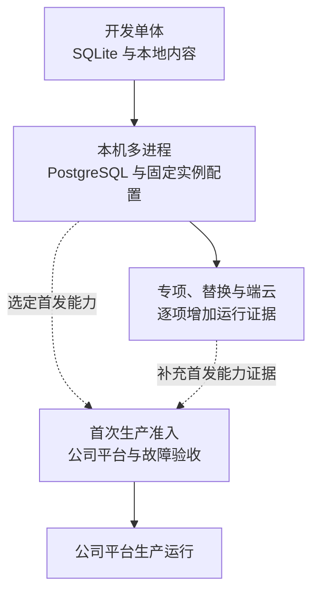
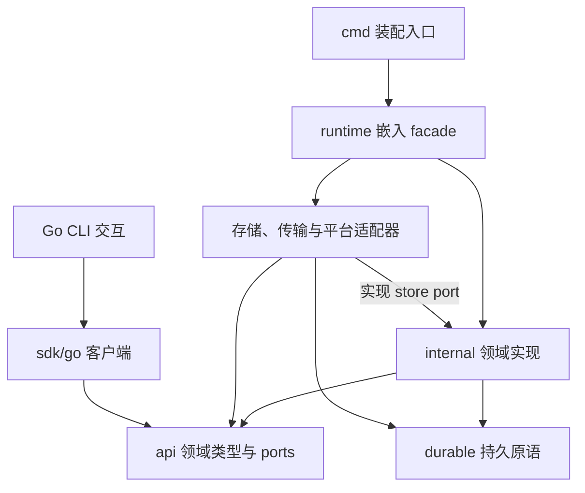

# 工程落地：技术栈、代码目录与实施计划

[方案入口](README.md) · [宿主装配](deployment.md) · [验收规则](validation/README.md) · [生产准入](deployment-production.md)

本页把现行架构落实到一个可编码的工程方案，不估算工时。2026-09-28 已确认单仓、Go 初期单 module、显式 SQL 与独立 PostgreSQL/SQLite 适配，以及 React/TypeScript/Vite。模型使用火山方舟的 OpenAI 兼容接口，搜索使用豆包搜索；开发采用受限测试身份，生产预留公司身份适配器。生产由公司自有平台承载，开发先完成单体和本机多进程集成，只为公司平台保留必要接入边界。

目前仓库交付的是设计与静态契约，以下目录、运行入口和测试均是待实现方案。现有静态检查不能作为数据库、驱动或生产运行证据。领域规则、字段与恢复语义继续归各专题及 [contracts](contracts/README.md)，本页只定义工程组织与交付顺序。

## 1. 从可运行闭环推进到生产

首条链路使用同一个任务完成接纳、形成提案、授权准入、受管文件操作、独立读回和完成核验。先使它在本机可恢复，再将相同模块装入不同进程测试跨域交接；两种装配都使用真实数据库与字节介质。固定模型回放只用于机制测试，真实模型、搜索效果另取证据。

图中的方框是验证环境，实线表示开发集成顺序，虚线表示首次生产开放必须经过的独立验收。公司平台尚未接入时可以继续开发后续功能，不能据本机结果宣称生产就绪。



生产仍从首次上线就分开网关、应用、工作池及执行宿主；公司平台负责部署、发现与基础设施。三可用区、账本单区 RPO=0、控制与查询 RTO≤60 秒仍是生产目标，目标文件根的耐久与接管另验。开发单体和本机 PG 集成不承诺这些故障保证，详见 [ADR-0003](../adr/0003-production-distributed.md)。

<a id="stack"></a>
## 2. 技术栈与选型边界

下表区分用户已确认的工程方向与据此选定的常规实现依赖。工程建立时固定经编译、契约和适用运行测试验证的版本；不把本次资料核查当作依赖组合已兼容，也不在计划中使用浮动 latest 代替安装锁。

| 范围 | 选择 | 理由、主要代价及适用边界 |
| --- | --- | --- |
| 核心、宿主与 CLI | Go 1.27；标准库为主 | 同一领域实现装配单体与独立进程。按 Linux/macOS、amd64/arm64 建立实际构建矩阵；不承诺所有系统能力只靠纯 Go 完成 |
| Go 工程 | 一个 go.mod；Go modules；标准 go test、race、vet 与 fuzz | 契约、实现及 SDK 同仓验证。公共 API 收敛在 api、runtime 和 sdk/go，内部包不作为扩展依赖，依据 [ADR-0010](../adr/0010-monorepo-shared-contract-release.md) |
| HTTP 与内部 RPC | net/http、grpc-go、官方 Protobuf runtime | HTTPS 承担既定发现、认证和字节入口；gRPC 保留严格 JSON 外壳，不引入第二套领域字段定义。原始 Protobuf 验证必须在普通解码前完成 |
| 端云 WSS | coder/websocket | 复用现有应用帧、流控及恢复协议；固定 Origin、大小限制、单一有序写队列和连接生命周期。请求期限不直接代替整条连接的读期限 |
| JSON 契约 | Go 标准库严格 JSON 解析及 jsontext；santhosh-tekuri/jsonschema/v6 | 先检查重复键、Unicode 和原始数字，再校验 2020-12 Schema、方法关联与 JCS。格式断言显式开启，只装载锁定的本地 Schema |
| PostgreSQL | PostgreSQL 18；pgx/v5 + sqlc；显式 SQL | 事务句柄、锁序、条件更新和提交未知可直接审查。开发只需本机 PG，生产接公司服务；复杂 SQL 必须实际生成并验证 |
| SQLite | modernc.org/sqlite + database/sql；独立 sqlc 查询 | 无 cgo 的默认路径减少开发构建依赖；Linux/macOS 分别验收。若原生扩展或实测性能要求改变，再比较 mattn/go-sqlite3。WAL、FULL、foreign_keys、单写队列与在线备份仍须落实 |
| 数据库迁移 | pressly/goose/v3；两种方言独立迁移目录 | SQL 步骤便于审查，明确 migrate 入口和锁；工具版本表不代替扩展生命周期的 migration_id、制品摘要及业务恢复责任。禁止每个副本启动时自动迁移 |
| 持久工作 | 本项目接纳／有限工作模板 + 原数据库 jobs | 沿用共同提交、有限扫描和可丢通知；不另选工作流引擎或消息平台。框架与每个领域映射分别验收 |
| 字节与检索 | 开发本地不可变文件库；生产 ContentStore 适配公司对象存储；词法检索默认 | 字节先耐久、引用后提交；文件效果目标与 ContentStore 分开。向量检索依质量证据启用，暂不引入独立向量库 |
| 模型 | 火山方舟 OpenAI 兼容 Chat Completions；openai-go/v3 | SDK 只用于请求编码和传输，显式指定方舟地址、凭据和固定模型 profile，关闭透明重试。供应方扩展隔离在 ModelAdapter，工具执行仍由 Executor 负责 |
| 联网搜索与正文 | 豆包搜索 Custom 版独立 WebSearch；net/http 搜索及正文获取驱动 | 搜索与正文获取分别经过执行准入，保留来源及实际内容范围；搜索凭据独立配置。具体调用边界见[外部接入](#integrations) |
| 浏览器 | React + TypeScript + Vite；pnpm workspace；React Router | 轻量参考客户端以静态资源发布，本地由 Vite 开发服务运行。项目负责接入既定 Surface、输入和当前资格语义；有明确 SSR 等要求时重评前端装配 |
| 浏览器 SDK 与本地状态 | TypeScript；原生 WebSocket；IndexedDB + idb | SDK 负责原命令和恢复，UI 只调用 SDK。IndexedDB 事务成功后才发送；本地存储失败则拒绝新发送，清理后失去记录也不以新身份自动补交 |
| 前端校验与测试 | Ajv 2020-12、Vitest、React Testing Library、Playwright | SDK 运行时校验与 Go 使用同版 Schema；入站严格解析须在 JSON.parse 丢失重复键前处理。浏览器测试覆盖刷新、断连、确认过期和本地存储失败 |
| 登录 | 开发固定测试身份；生产 OIDC 公司身份适配器 | 开发无需 IdP 服务，测试身份仅对受限本机入口生效；生产禁止使用 dev 身份。认证结果映射主体和租户，业务权限仍按原 Grant/Use 裁决 |
| 观测 | Go slog + OpenTelemetry | 开发先输出结构化日志和有限诊断，生产配置公司已有收集端。Span、日志及指标不替代业务账本或最终计费 |
| 开发装配 | 单体默认；本机进程脚本和可选 Compose | Compose 只提供本地依赖及便捷启动。无需 Kubernetes、Helm、服务网格或本地全套监控集群 |
| 生产装配 | 公司自有平台及第 3 节的宿主接口 | 公司平台实现与故障验证独立安排，项目不建设公司调度／扩缩控制面 |

显式 SQL 的主要代价是维护两种方言。领域规则与可观察行为共用，行锁、单写队列、迁移及领取查询分别实现；不能用一套 SQLite 测试推定 PostgreSQL 并发正确，也不让 ORM 或驱动自动重跑可能已提交的业务闭包。

严格线格式是一个需要先验证的实现风险：默认 Protobuf 解码可能覆盖重复字段，普通 JSON 解码可能丢失原始数值或重复键。受控 gRPC codec 在普通反序列化之前按固定描述符检查原始字节；SDK 和服务共同运行非法输入向量。选定库不能满足要求时，更换解析／生成实现，不能为了沿用库而放宽协议。[Protobuf 编码语义](https://protobuf.dev/programming-guides/encoding/#last-one-wins)、[gRPC codec](https://pkg.go.dev/google.golang.org/grpc/encoding#CodecV2)

金额继续使用带单位的十进制表示；安全整数检查发生在浮点转换及 JCS 之前。生成的类型与 Schema 结构匹配不等于认证、权限、字段关联或效果已验证。完整合同见[编码规则](contracts/protocol.md#2-编码与共同决定)。

主要工程依据：[Go 1.27](https://go.dev/doc/go1.27)、[Schema 校验库](https://pkg.go.dev/github.com/santhosh-tekuri/jsonschema/v6)、[WSS 库](https://pkg.go.dev/github.com/coder/websocket)、[sqlc 事务](https://docs.sqlc.dev/en/latest/howto/transactions.html)、[SQLite 驱动](https://pkg.go.dev/modernc.org/sqlite)、[goose](https://github.com/pressly/goose)、[React 客户端构建](https://react.dev/learn/build-a-react-app-from-scratch)、[pnpm workspace](https://pnpm.io/workspaces)、[React Router](https://reactrouter.com/start/declarative/installation)、[Ajv Schema 支持](https://ajv.js.org/json-schema.html)、[Vitest](https://vitest.dev/guide/)、[idb 事务](https://github.com/jakearchibald/idb#transaction-lifetime)。上述是工具能力依据，方案取舍与运行验收由本项目负责。

<a id="platform"></a>
## 3. 公司平台接入与本地替身

入口复用宿主启动和生命周期处理器，先由配置文件、信号和受限管理命令调用，再对接公司平台。以下是实现责任，不新增公开 harness/1 领域方法，也不要求当前确定公司的具体控制 API。

| 方向与能力 | 开发阶段交付 | 公司平台接入及失败行为 |
| --- | --- | --- |
| 平台启动宿主 | 固定角色、实例身份、配置及制品摘要；显式启动 all 或单一角色 | 平台传入同义配置；原 Orchestrator、command、operation 身份不随实例改变 |
| 平台读取健康 | 分开存活、恢复中、可接纳、排空状态；输出有限诊断 | 进程存活不等于业务就绪；数据库、当前批准或恢复依据不足时保持不接纳 |
| 平台请求排空／退出 | 一个按角色处理的生命周期入口；可由 SIGTERM 或受限管理命令调用 | 网关停止新握手，应用停止相应新接纳，worker 停止新领取，执行入口停止新启动；保留查询、控制及原责任收尾直到退出期限 |
| Harness 读取实例位置 | 开发静态实例集合，替换时仍按原逻辑服务恢复 | 平台实例发现适配器提供实际地址及有界新鲜度；位置未知时等待或拒绝，不改派到另一个任务 owner |
| Harness 取得数据库与内容存储 | SQLite／本机 PG 与本地文件；有界连接池 | 接公司写主、连接池和对象存储；写权威、准确字节或原根不可核验时关闭对应新行动 |
| Harness 取得身份和凭据 | 本机受限开发身份、显式凭据文件或环境引用；不把真实秘密写进仓库 | 适配公司 IdP、密钥及服务身份。平台认证不能代替 Harness 的 Grant、Use、确认消费和当前披露核验 |
| Harness 取得时间依据 | ClockAdapter 与受控测试时钟；声明可验证的暂停范围 | 平台提供误差、同步和暂停依据；不能证明的离线或缓存资格保持关闭 |
| Harness 输出运行信息 | 日志、OTel 与有限指标；版本、角色和排空残留可查询 | 接已有收集与告警，不为开发增加公司监控系统副本 |

管理入口只绑定受限本地或公司管理通道，并校验调用身份。迁移采用单独控制动作，核对精确安装锁与步骤并取得迁移锁，成功记录仍由原 owner 保存；扩展激活和业务授权不能由平台的启动参数绕过。

排空超时允许进程退出，但不会把已经发出的文件、模型或 GUI 动作记成取消成功。下一实例从原账本核对；旧调用仍可能发生时保留 unknown 与未结费用。平台将实例标为健康、完成主库提升或启动新容器，都不能替代当前写资格、旧发送者隔离和原历史完整性检查。

<a id="layout"></a>
## 4. 代码目录及依赖方向

以下是未来实现仓库的布局，不表示本次已创建源码工程。现有文档与机器契约迁入实现仓库时保留一份维护源；当前 [contracts](contracts/README.md) 继续权威，迁移时统一更新引用和生成入口，不能在新旧目录各维护一份 Schema。

```text
harness/
├── go.mod / go.sum
├── package.json / pnpm-workspace.yaml / pnpm-lock.yaml
├── AGENTS.md / CONTEXT.md      # 工程约定与领域术语
├── api/                       # 公开 Go 领域值类型及组件 ports
├── runtime/                   # 公开嵌入与装配 facade，默认组件的构造入口
├── sdk/
│   ├── go/                    # 同一 Go module 中的客户端与扩展辅助
│   └── ts/                    # 独立 npm 包；类型、WSS、原命令与恢复
├── cmd/
│   ├── harness/               # CLI：任务、控制、输入、安装及诊断
│   ├── harnessd/              # 宿主：单体或指定生产角色
│   └── harness-sim/           # 有状态模拟设备，可独立启动和注入故障
├── internal/
│   ├── orchestrator/          # 以下九目录按现行模块负责事实和业务规则
│   ├── brain/
│   ├── execution/
│   ├── memory/
│   ├── security/
│   ├── interaction/
│   ├── collaboration/
│   ├── extensions/
│   ├── evaluation/
│   ├── durable/               # Tx、接纳模板、JobStore、Claim 与条件提交
│   ├── host/                  # 配置、容量、时钟、启动恢复及按角色排空
│   ├── wire/                  # 生成 DTO/Proto、严格解码、方法登记与映射
│   ├── transport/             # WSS、gRPC、HTTPS 适配与有界连接管理
│   ├── storage/
│   │   ├── postgres/          # repository 实现、queries/、querygen/
│   │   ├── sqlite/            # repository 实现、queries/、querygen/
│   │   └── content/           # 本地不可变字节与公司存储适配
│   ├── adapters/
│   │   ├── models/ark/        # 方舟 OpenAI 兼容请求及供应方字段映射
│   │   ├── search/doubao/     # 独立 WebSearch；不代替 Brain 的决定循环
│   │   ├── fetch/            # 获准 HTTP 正文获取、范围及失败事实
│   │   ├── file/             # 受管文件操作与读回
│   │   └── device/           # 模拟设备驱动
│   └── platform/              # 本地实现与公司发现、身份、凭据的接入
├── apps/
│   └── web/                   # 参考应用；Surface、输入、预览、任务与设备
├── contracts/                 # Schema、方法登记、Proto、正反向向量唯一源
├── migrations/
│   ├── postgres/              # 按提交域组织受控 SQL 步骤
│   └── sqlite/
├── tests/
│   ├── conformance/           # SDK、替换组件和严格线格式一致性套件
│   ├── integration/           # 真实两种数据库与多进程集成
│   ├── faults/                # 进程、网络、存储、时钟故障及独立断言
│   ├── quality/               # 冻结任务、完整样本清单与质量报告
│   ├── capacity/              # 初始负载、逐级规模及恢复积压
│   └── fixtures/              # 回放、有限模拟源和受限测试身份
├── dev/                       # 单体、多进程、可选 Compose 与本地配置
├── packaging/                 # 制品、摘要、安装锁及平台启动示例
├── tools/                     # 契约生成与验证、构建和报告工具
└── docs/                      # 架构、ADR、接入说明与运行手册
```

api 保存对扩展有意义的领域类型与端口，不导出数据库行、job 内部结构或生成 Proto。runtime 组合默认实现并接受声明的替换组件；sdk/go 与 sdk/ts 提供远程客户端和扩展辅助。Go 初期只有根 go.mod，sdk/go 不另起 module；浏览器 SDK 与 Web 在 pnpm workspace 中分别构建，SDK 不依赖 React。

图为 Go 包的编译依赖，箭头表示“依赖”。存储、网络和平台实现由装配入口注入，业务规则不向它们反向导入。跨领域应用协作使用声明的 ports；共库操作由宿主显式传入同一受限事务，不凭目录拆成 RPC。TypeScript 单独依赖 sdk/ts 及由同版 Schema 生成的类型，不导入 Go 包。



各领域目录优先按入口、规则、store port 和处理器组织文件；只有复杂度需要时才增设子包，不机械建立九套多层框架。SQL 按本库领域责任分文件，生成结果留在存储适配器内部。迁移按真实提交域编号，不按网关、应用或 worker 各建一套“自己的表”；跨库步骤使用既有持久交接，迁移工具不能制造跨库原子性。

生成 DTO、SDK 类型与方法映射只从固定契约生成。选用生成器前必须通过 oneOf、封闭对象、十进制字符串、安全整数及引用结构的正反例；生成不覆盖的领域规则手写，但仍以同版契约校验。生成产物可随源码发布，CI 检查重新生成无差异，禁止手改生成文件来修复线格式。

规则单元测试就近放在 Go/TS 源文件旁，tests 集中放置跨包、跨进程和验收资产。测试中的独立真值入口只授予判定器。模拟手机使用独立设备状态、串行动作入口和动作日志，React 可用于呈现其页面；Brain 只取得获准观察。通用组件一致性套件可以随 SDK 分发，测试目录并不自动成为稳定业务 API。

<a id="phases"></a>
## 5. 分阶段实现与退出条件

沿用系统四阶段的功能顺序，把第一阶段细分为能持续集成的切片。各阶段增加运行证据；本机开发、真实外部依赖和公司平台生产分别报告。每个切片只开放已经具备依赖的能力，不能为了演示完整菜单假设远端能力已经实现。

105 个领域方法按切片逐步实现，首轮围绕任务、权限、内容和文件链路；通用编码与对应方法的正反例同步接入。未实现方法不宣称可互操作，入口明确返回不支持。契约资产保持同版完整，不要求第一条任务运行之前实现全部方法。

### 阶段一：可运行闭环与本机多进程恢复

| 切片 | 交付内容与先决依赖 | 退出证据 |
| --- | --- | --- |
| 1.1 工程与契约入口 | 建立单仓、公开端口、生成及校验流程；最小 CLI/SDK；明确首装报告、批准和真实 ready 的路径 | 现有严格线格式向量在 Go/TS 入口复用；配置与契约版本可核对；非法输入不会先被宽松解码吞掉 |
| 1.2 持久基础与最小可信宿主 | 两种数据库迁移与 repository；原命令、Tx、JobStore、时钟及本地身份；受信报告导入、compatibility 批准与启动恢复 | 真实 PG/SQLite 适配器通过适用 FW-01～09；PG 两个以上 worker 的竞争、旧完成及提交未知有证据；首装和重启不能绕过批准 |
| 1.3 第一条任务链 | Task、目标条件、预算、规则 Brain/固定回放、Grant、内容、受管文件 Executor、独立读回；CLI 可提交、输入、暂停、取消和查询 | SYS-01/02/03/07 的接纳、失答复、撤权、取消及未知效果；进程退出后沿原身份恢复。文件根丢失不自动换空目录 |
| 1.4 真实模型与费用 | 方舟 Chat Completions 适配、固定 profile、正文保存与提案检查、用量及原账；累计费用修订、outbox 和结算槽恢复 | 可复现真实生成任务；不发生 SDK 隐藏重试；实际请求未知时保留费用责任。具备真实计费能力的路径通过 SYS-24/29、PROD-29 的适用断点后才开放 |
| 1.5 Web 与本机多进程 | TS SDK、IndexedDB、Surface、准确预览与可信输入；独立 WSS 网关、应用、worker、执行宿主；静态发现及平台控制入口 | 刷新、断线和重投不另造命令；PROD-02/10 及内部重绑、丢唤醒的本机断点通过；两个以上应用／worker 的结果可核查 |

1.1 的公开端口和错误语义明确后，Go 宿主与 TS SDK 可以分别推进；固定夹具只证明客户端映射。真实任务集成以 1.2 的持久接纳为前提，真实外部发送以 1.3 的授权及效果记录为前提。Web 可以先据同版样例构建页面，输入消费和确认的验收必须连接真实负责端。

阶段一退出时应具备一个可演示、可重启、可解释未知的真实任务闭环，两种数据库和本机进程故障证据齐全。没有公司平台或真实模型凭据时，分别记录生产待接入或真实模型待验证；回放通过不能替代 1.4 的真实接入证据，也不阻塞其他独立切片继续开发。

### 阶段二：联网问答、模拟手机与用户控制

| 切片 | 交付 | 退出证据 |
| --- | --- | --- |
| 2.1 联网取证 | 豆包 WebSearch 与独立正文获取、来源与时间、截断/冲突/失败；准确正文进入内容存储和上下文 | V1 冻结任务集；搜索接口错误、超时费用未知和正文获取失败分别覆盖；实际读取支撑引用，摘要不会掩盖正文缺失 |
| 2.2 多设备执行 | 至少三台状态独立的模拟手机；观察、动作、再观察、独立效果查询及本人接管 | V2 与 E-05/E-12；旧观察、旧代次、未知保存及可能迟到动作均不能触发下一自动写 |
| 2.3 记忆与个性化 | 词法默认实现、获准提取、来源、纠正、限制、删除与副本清理；上下文与长期记忆分用途 | C2、C7 的运行证据；撤权及删除期间不披露旧索引内容。中文词法、向量混合等候选仍走专项对照 |
| 2.4 广度与资源控制 | API 目录与准确声明、适配器扩展、初始质量集；租户公平、连接/队列/存储上限及控制保留容量 | API 数量、90%/95% 指标和实测负载如实报告；未知效果、超时和失败计入既定分母 |

2.1、2.2、2.3 可在阶段一的内容、权限和执行端口稳定后分别推进；共同完成条件与费用规则不另造专项版本。API 扩充持续进行，最终数量和质量目标到阶段四统一验收。

### 阶段三：独立替换、端云与组合故障

Brain、Memory、Executor 各提供第二种独立实现，通过同一合同；至少用一个异构语言参考组件验证线格式，语言工具链只在该切片引入。本机 Brain 调云模型不算远程 Brain，同实现换端口也不算独立替换。

依次完成本机 Orchestrator＋云能力、云 Orchestrator＋端侧能力，随后接入外部 Agent、离线许可与额度、受管副本关闭。时钟与暂停、防回放、旧发送者隔离和原效果核对分别验收；缺少某平台保证时关闭对应离线路径。按实际组合执行滚动格式兼容、连接重建、授权变化和恢复积压，取得对应 L3/L4 证据。

### 阶段四：受控改进与目标规模

完成完整样本运行、隔离评测、正式证据资格、改善批准、逐目标激活和独立旧版批准回退。首装所需的最小 Evaluation/Extensions 已在阶段一，不能拖到本阶段才补齐。

冻结质量集、费用/重试上限及停止规则，完成 1000 项以上语义不同 API、首次正确率和有限重试成功率验收。真实目标规模、连接展开、单区故障及积压排空在公司平台执行；开发可先完成压测工具和较小负载测量。优化候选只有在冻结对照显示收益并通过适用门禁后启用，真实手机和任意不可信原生插件另按平台验收。

<a id="production-gate"></a>
### 首次生产上线的独立门槛

生产接入可以在开发切片具备所需功能后安排，不固定为某一开发阶段的前置任务。上线前冻结实际开放能力、负载及依赖，逐项满足[生产部署](deployment-production.md)及对应故障用例：独立进程角色、当前身份与租户隔离、同步耐久及旧主隔离、原责任恢复、内容介质、时间资格、排空发布和故障剩余容量。

首轮生产必须取得单区账本 RPO=0、控制／查询 RTO≤60 秒的真实证据；新工作恢复时间、目标文件字节及容量范围单独报告。PROD 用例按已启用能力执行，尚未实现的能力保持关闭并列缺口；最终规模实验仍归阶段四，不能因冻结较小上线负载取消最终目标。

<a id="integrations"></a>
## 6. 外部服务接入

模型与搜索供应方已经确定；精确模型版本、凭据引用、账户限额和公司身份参数属于部署配置，在对应切片实测后固定。缺少凭据、外发许可或费用依据时关闭相应外部能力，并报告具体缺口；本地规则与固定回放可继续验证其他机制，不能据此宣称真实接入完成。

### 6.1 火山方舟模型

ModelAdapter 通过 Chat Completions 调用方舟模型，使用 openai-go/v3 显式设置 base URL 和 API Key；北京区参考地址为 `https://ark.cn-beijing.volces.com/api/v3`。OpenAI 兼容性只作为该调用路径的接入依据，供应方额外字段由适配器编码和解析。普通聊天输出仍按既有内部产出格式校验，原生结构化输出仅在选定模型实测支持后启用。[方舟兼容说明](https://ark.volcengine.com/region:cn-beijing/docs/compatible-with-openai-sdk)

SDK 显式设置 `WithMaxRetries(0)`，代理和网关也不得透明重试；一轮 Decision 仍至多一次物理推理。截断、拒绝、非法提案或发送结果未知均交回现有决定流程，不在适配器内再次调用模型修复。SDK 升级时用故障注入核对实际发送次数。[Go SDK 重试设置](https://github.com/openai/openai-go#retries)

模型 profile 固定模型标识及可验证版本、请求选项、处理地点、期限和预算声明；端点配置变化须重新核验，不能把可变别名当作冻结的验收版本。每次请求沿原 model_call_id 保存获准保留的披露依据、请求摘要、供应方请求号及用量。按原请求查询、停止和最终费用能力分别声明；未取得相应证据时保留 unknown 与未结责任。费用模式及缺少可信上界时的限制继续按[权限与预算](security/README.md#2-主体资源和许可)，本轮不默认启用估算模式。

### 6.2 豆包搜索与正文获取

第一版使用豆包搜索 Custom 版的独立 WebSearch API，由 Execution 的搜索驱动直接调用。API Key 路径为 `POST https://open.feedcoopapi.com/search_api/web_search`，采用 Bearer 认证；模型和搜索各自配置凭据引用。公司统一身份要求 AK/SK 时可替换为同产品的 TOP 网关接入，领域行为保持一致。[豆包搜索 Custom 版 API](https://docs.volcengine.com/docs/Networkedsearch/Networkedsearch-2?lang=zh)

适配器的初始配置如下，均随能力版本固定；改变查询或新增一次实际尝试仍需按既有准入、重复策略和预算规则处理。

| 参数或结果 | 参考配置与实现约束 |
| --- | --- |
| Query、SearchType、Count | 使用 web 模式，默认 10 条；入口检查 Query 的 1～100 字符和结果数量上限 50，超界返回参数错误，避免供应方静默截断查询 |
| Filter | `NeedUrl=true`、`NeedContent=false`，保留有落地链接的候选，正文另行取得。NeedContent 是结果筛选条件，不能作为正文完整性的证明 |
| QueryControl、EnableWaiting | `QueryRewrite=false`、`EnableWaiting=false`；查询内容和等待责任由当前任务与 Executor 显式控制 |
| 响应判断 | 同时检查 HTTP 结果、ResponseMetadata.Error 和 Result；保存请求号及获准保留的实际结果。接口失败不能映射成“搜索成功但没有结果” |
| 搜索材料 | 分别保留 Url、Title、发布时间、Snippet、Summary、Content 的存在与来源。官方将 Summary 定义为与查询相关的正文片段，Content 也为可选；均不据字段名承诺完整、实时或已独立核验 |

搜索提案经过 Orchestrator 准入后由 Executor 发起，成功只确认候选材料已取得并持久保存。随后选中的 URL 经独立获准的正文获取动作读取，按实际取得范围保存字节、抓取时间和限制，再供 Brain 形成有依据的回答。HTTP 获取使用有界重定向、大小和期限控制，重定向后的目的地重新核验；抓取失败、截断或解析失败分别保留，不以搜索摘要补成“已读全文”。请求内容、正文和外发范围仍服从现有许可。

方舟也提供让模型调用 `web_search` 的内置工具路径；它把搜索控制放进模型服务调用，无法直接复用本方案逐行动准入与持久事实边界，因此当前模型 profile 不启用该路径。独立搜索的代价是由 Harness 承担多次交接、正文获取和来源核验，收益由 V1 任务集验证。[方舟联网搜索工具](https://ark.volcengine.com/region:cn-beijing/docs/web-search)

搜索声明为 read_only 时，可在仍有效的授权、期限及剩余预算内有限重试；每次实际发送单独记录尝试与费用，不能把新结果当原请求查询。发送后超时不证明未调用或未收费，原未结费用继续保留。供应方调用明细和最终账单能力在接入时单独核验，结果条数、耗时和 HTTP 成功均不能代替最终费用依据。

### 6.3 开发身份与公司登录

开发使用显式 dev 配置下的固定测试身份和有限租户夹具，无需本地 IdP。测试身份只允许受限本机入口，生产配置发现它即拒绝启动；跨设备测试使用实际配对和受信测试身份。

生产认证预留 OIDC 适配器接公司身份提供方，公司协议不同时替换这一适配器。它负责认证、会话及主体和租户映射；Grant、当前撤销、业务确认和披露核验继续由原 Harness owner 裁决。具体身份参数随首次生产接入冻结，不阻塞本地开发。[OIDC Core](https://openid.net/specs/openid-connect-core-1_0.html)、[OAuth 安全规范](https://www.rfc-editor.org/rfc/rfc9700.html)
