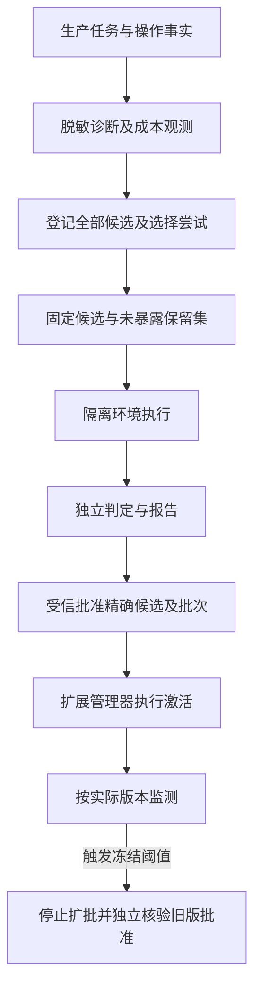
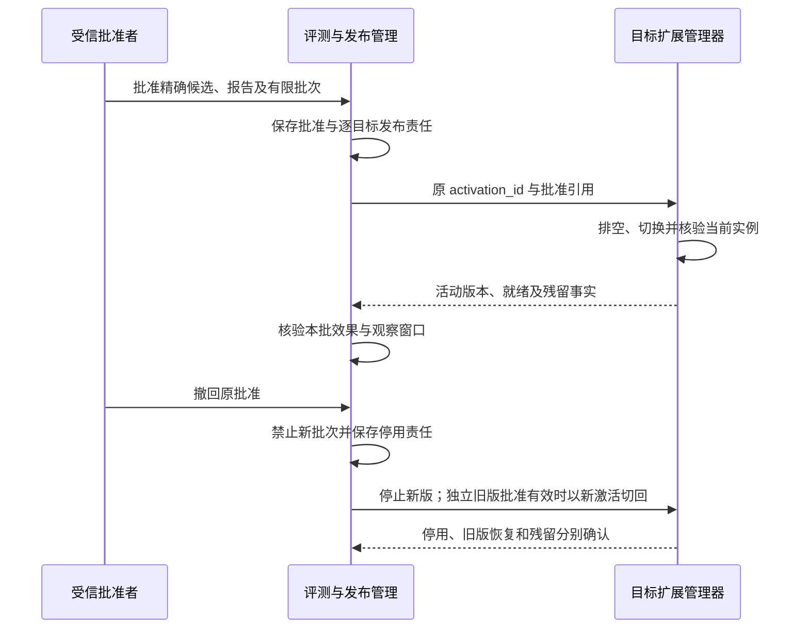

# 运行观测、能力评测与受控改进

[模块与数据 UML](../uml-models.md#evaluation) · [可编辑 UML 图册](../diagrams/uml-models.drawio)

[总览](../README.md) · [项目目标](../goals.md) · [系统验收](../validation/README.md) · [版本激活](../extensions/README.md)

实现阅读：[模块形状与依赖](implementation.md#module-shape) → [可靠工作接入](implementation.md#reliable-work-integration) → [证据对象流转](implementation.md#data-flow) → [暴露与撤回内部时序](implementation.md#key-sequence) → [生产可用性与容量](implementation.md#production)。先阅读本页行为合同，再按实现页落实持久化与恢复；线字段及正反例继续由公共契约资产维护。
本模块让一次任务可以诊断、让能力可以重复测量，并把有证据的改进送到有限发布范围，覆盖 C8、C9。运行观测保存诊断线索；评测保存固定计划和独立判定；发布批准保存允许启用什么；扩展管理器保存每个目标实际运行什么。它们共享关联标识，不合并成功含义。

默认复用宿主数据库、持久 job 和内容库。没有必需的隔离环境、独立真值或获准评测数据时，相应计划拒绝开始；不从任务自己的“成功”状态推断效果达标。当前文档给出契约及验收方法，未提供实际成功率或容量结果。

评测用例接入[可靠接纳与持久工作框架](../reliable-work.md)，共同保存领域事实与下一责任。重领只推进原 SampleRun、环境和发布目标；冻结分母、正式尝试次数及原暴露门禁仍由评测 owner 裁决，公共模板不能将未知样本改为重跑或把扫描尚未完成解释为仍可发布。

## 1. 观测事实与效果证据分别保存

关键业务决定、授权消费、操作效果及原命令回执保存在所属模块；观测丢失不能阻止原操作恢复。诊断事件只记录时间、关联 ID、版本、阶段、错误分类、时延及用量摘要。正文、提示词和截图默认不进入通用日志，需专项用途许可时使用受控内容引用。

默认增加 OpenTelemetry 适配器，通过 Span 表达一次处理，通过 Link 关联重试、子任务和异步收尾。OpenTelemetry 的 Link 支持关联同一或不同 Trace，便于诊断长任务；业务恢复仍按 task_id/operation_id/command_id 查询。依据：[OpenTelemetry Tracing API](https://opentelemetry.io/docs/specs/otel/trace/api/)。

业务记录需要恢复完整性；Trace 可以采样，样本缺失必须可见。延迟、错误率和用户资源隔离使用有界标签聚合，不把用户正文或任意任务 ID 放入高基数指标标签。获准诊断时再按受控关联 ID 查询详细记录。

选择“固定计划＋隔离成对比较”作为改进默认依据。直接比较生产日志更便宜，但用户目标、数据和环境变化会混入结论；生产监测用于发现退化，不直接声称因果收益。只有稳定分组、完整分母和明确用户数据许可具备后，才开展生产对照实验。

## 2. 先完成候选选择，再开启保留评测

反复查看同一组考题的反馈再修改候选，会让测试集参与设计；即使每次计划都不可变，最好一次的成绩也不能作为独立改善证据。因此数据分为开发、选择和保留三个用途：开发集用于调试，选择集用于比较候选，保留集只在本次发布候选固定后确认。三者按来源任务组隔离，同一任务的改写、派生材料及重复种子不能跨组伪装成新样本。

候选开发者、模型和选择过程可以读取前两类数据，不能读取保留答案、逐例评分或汇总成绩。受信评测维护者登记分区的内容摘要、来源组和访问范围，评测存储同时保存受管流程的所有候选及尝试，包括失败、取消和未形成报告的尝试。已有尝试只能追加后续状态；重新命名候选、计划或发布申请不能抹去来源关系与暴露历史。来源组来自数据谱系与维护者审查，哈希去重只能发现相同字节；无法说明样本来源或候选已知测试暴露时，报告保留污染缺口，不能声称已证明独立性。

每个 release_request_id 在运行前只绑定一个精确候选、一份正式计划和一个未暴露保留分区。plan_create 在同一事务中保存此绑定与分区占用；第二个候选竞争同一申请，或另一申请竞争同一分区时拒绝。原计划重投、恢复原 run 和已冻结的有限重试不属于再次选择候选。占用开始后分区不再用于其他候选的正式确认，即使运行中断也不回收为“未使用”；这是有意承担的数据成本，避免从停止时点或不完整反馈挑选有利测试。

正式报告全部封存后才开放反馈。受信批准者通过 evaluation.feedback_open 取得报告，系统先保存 exposure_id、关联来源组索引、唯一影响扫描 job、主体、报告摘要、内容范围与时间，再返回内容；答复丢失仍视为已暴露，查询同一命令不制造新额度。该报告封存后的正常反馈不撤销自身，但同来源组的其他正式计划若尚未封存仍受影响：新报告及改善使用被原暴露门禁同步拒绝，扫描负责逐项封闭环境；已经开始的样本动作可能在环境实际封闭前继续，其效果与费用仍须收尾。evaluation.read 在此之前只返回进度与准备故障，不能泄露保留逐例结果、成绩或通过状态。

报告、答案或样本通过其他路径泄露时，受信评测维护者调用 evaluation.exposure_record，追加分区、来源组范围、泄露证据及发生时间；尚无报告也可以登记。原评测 owner 在短事务中保存暴露事实、可按来源组查询的索引、原回执和唯一的影响扫描 job 后即可确认接纳。这个回执只证明暴露已进入同步资格门禁，不证明所有受影响计划已逐项更新或目标已停用。影响扫描按有界页补写失效投影，并为在途环境封闭、已批准目标撤回保存逐项责任；扫描中断沿原 job 续页。

正式改善计划、run 接纳、每次新环境／样本／重试的逻辑启动、报告封存、改善批准及其在线启动、离线租约和扩批在各自决定前，都从原评测 owner 核对所用分区和来源组的**暴露原事实**；投影尚未追上或门禁不可核验时，不能凭旧 `PlanEligibility` 或批准缓存继续。兼容发布仍核对当前数据用途与契约证据，不把保留集独立性门禁套在 conformance 报告上。非受控暴露发生在正式报告封存前或时点不明时，该计划及报告失去正式资格；事后才发现早期泄露同样生效。原报告保持不可变，读取时给出当前资格和原因；正常封存后经 feedback_open 开放不使原报告失效，但禁止这份分区进入后续正式确认。已签发的在线启动窗口及离线租约仍按其固定期限和已知撤回规则收束，失联目标可能在窗口内行动，须在逐目标状态中如实展示；所有在途效果、环境清理和用量核对继续由原运行负责。详细的并发与分页规则见[评测实现](implementation.md#7-报告读取与反馈暴露)。

看过保留反馈后修改候选，必须登记新候选并使用另一份未暴露分区。复用原分区时必须显式创建选择用途计划，其报告为 exploratory，不能作为发布的独立改善证据；不能在正式申请失败后自动降级继续运行。受控运行器为评分读取真值不视为向开发过程暴露，但该次分区占用仍不可复用。普通兼容性发布和没有旧基线的首装可明确申请只验证契约，产出 conformance 报告及 compatibility 批准，不得借此声称能力改善。失败的改善申请不可原地自动降级；新的兼容申请仍保留原候选与尝试历史。所有记录仍复用评测数据库、用途权限和持久 job，不增加独立评测服务。

换用未暴露分区只是必要条件，不能通过新建发布申请不断尝试直到通过。同一 improvement_id 在第一次正式计划前绑定受信评测维护者核定的不可变 ImprovementPolicy，冻结候选范围、正式尝试总上限、停止规则和整个过程的推断／比较方法。默认只允许一次正式确认；需要多次确认时，必须在任何保留反馈开放前规定适用的多重比较或序贯方法，不能把每次未调整的 95% 区间当作整个过程的保证。

plan_create 在保存正式计划的同一事务中占用该策略的下一个 formal_attempt_index，失败或取消不退回额度；原计划恢复仍使用原序号。后续探索可以继续，但超出策略的结果只能作为 exploratory。新 improvement_id 必须关联已有改进来源，不能重置同一过程的尝试历史；有竞争候选的再次正式确认需要事先覆盖这些选择的整体策略。缺少可核对策略或适用方法时，仍报告单次比例，statistical_gate 和 improvement_gate 为 inconclusive，不产生正式改善资格。

### 冻结执行条件与独立取证

EvaluationPlan 固定数据集版本、样本集合、基线与候选安装锁、环境、判定器、预算、重试、停止规则及失败口径，同时固定主要改善指标、最小实用改善量和逐类退化界限。创建后不可修改；调整产生新 plan_id 和摘要，旧报告继续指向旧计划。正式申请的原绑定不能改指新计划，新计划另用新申请及未占用分区。开始运行前再次检查数据用途、环境准备及预算，来源失效时暂停或拒绝受影响样本。

基线与候选各自从同一冻结初始状态运行，不共享可被前一运行修改的设备或记忆。双方任一任务启动前完成整对环境预检；冻结种子决定样本顺序及双方先后，热身集和缓存条件单列。样本的实际输入引用、种子、初始状态摘要和最终真值引用一并保存；需要网络实时性的样本注明获取时点及不可完全回放的部分。评测样本复制前按内容 owner 登记受管持有者，不能把生产日志默认视为获准训练或评测材料。

EvaluationRun 是一份冻结计划的整体执行，SampleRun 是其中一个 `(sample_id, arm)` 的逻辑样本位置，Attempt 是该位置的有限物理尝试。一份计划只接纳一个逻辑 run；分批派发、重启恢复和计划内重试均沿原 run。另一轮实验须创建新计划并重新核对正式尝试及保留占用，不能用新 run_id 重置原计划的失败或费用。

评测环境提供方实现 prepare、start_sample、inspect、observe_truth、seal 和 destroy。prepare 按预先保存的 environment_key 幂等创建隔离环境，该键唯一绑定 `(run_id, sample_id, arm)`，固定初始数据与种子；不同样本和两臂不共用创建键。prepare 与 start_sample 都在物理启动前核验原 Evaluation owner 的准确有限时许可，缺可信签发依据或跨机时钟界限时拒绝。候选只接触任务侧观察与动作入口，不能读参考答案、改判定器或伪造真值。判定器通过独立只读通道取得效果证据。代码候选的评测依赖通过验收的代码隔离，数据型 Skill/配置候选也不能修改运行器与评分配置。

每个样本运行固定目标与预算。计划允许的重试生成新 attempt_id，但样本 ID 和原操作恢复身份不变；效果未知时仍按[执行规则](../execution/README.md)核对，不能为了得到一个可评分答案重复未知写动作。样本结束后先封闭新动作并核清允许的在途责任，再取最终真值、评分和清理环境。

### 环境交接与取消

环境提供方是可替换 SDK 适配器，默认与评测工作者一起部署；它保存实际实例及封闭事实，评测数据库保存 run 与该实例的唯一映射。接口的操作键在首次调用前写入 run 的 job，不能以新实例掩盖原实例失联。

| 环境方法 | 输入与输出 | 效果确认 |
| --- | --- | --- |
| prepare | environment_key、run_id、sample_id、arm、环境版本、初始状态/种子、额度、原环境准备许可；返回 environment_id | 原键与样本臂共同固定，环境已耐久登记且准备完成；许可过期或身份不符拒绝新建，答复丢失按原 environment_key 查询 |
| start_sample | 原 environment_id、sample_id、arm、attempt_id、原样本启动许可；返回原尝试入口 | 环境 owner 在物理启动前核对有限时许可、未 seal 及固定样本身份；重复只查原 attempt，不凭排队 job 扩大资格 |
| inspect | 原 environment_id 或 environment_key；返回固定 run/sample/arm、当前实例、动作入口及责任 | 未找到必须说明查询范围；暂时未找到不证明从未创建 |
| observe_truth | 原环境、观测切点、判定器身份；返回受保护真值引用 | 只允许独立判定器读取，返回证据版本及仍在途动作 |
| seal | 原环境、原控制 ID；返回已封闭新动作及未终结工作 | 环境 owner 裁决实际封闭，命令接纳不能代替完成 |
| destroy | 原环境、封闭证据、清理策略；返回逐载体清理与残留 | 未 seal 或仍可写时拒绝销毁；清理失败沿原管理命令继续 |

用户取消整个 run 后，运行器禁止其新样本及新目标动作，为全部已创建和创建结果未知的环境保存 seal 责任。已完成样本保留原结果，未完成样本按冻结的中断口径记录 reason=cancelled；封闭及清理继续，即使评测的总期限已经结束。取消与准备答复丢失竞争时逐一核对原 environment_key，不提前释放全部配额。

联网问答既测固定内容回放，也测带实际取得时间的联网样本；两者结果分别报告。模拟手机环境提供多个独立设备、可观察 UI 和受保护的真实状态，点击、滑动、输入、返回、取消和接管都用实际状态变化判定。任务侧截图与判定侧真值不能来自同一份模型自述。

缺失证据、未知效果、超出次数和候选自身异常按冻结口径进入结果，不能删掉失败样本提高成功率。双方启动前的环境预检失败记 invalid，并使正式报告缺少必需覆盖；启动后的提供方或运行基础设施故障按未成功保留在分母中。只有预先规定的整次实验无效条件可以使报告 inconclusive，不能逐例剔除坏结果；任何重测都保留原 run 及原因。量化口径和阈值由[系统验收](../validation/README.md#metrics)集中定义。

### 关键交接与恢复责任

| 发起方 → 处理方 | 输入与产出 | 何时可确认成功 | 持久事实与失败后的继续者 |
| --- | --- | --- | --- |
| 候选开发者 → 评测管理 | 精确候选、来源及所有尝试 → 登记回执 | 候选与谱系已登记，尚无质量结论 | 评测管理保存登记；调用者查原命令，不删除失败尝试 |
| 评测维护者 → 内容 owner／评测管理 | 获准数据分区及来源组 → 分区登记 | 用途授权成立且分区摘要、暴露历史可查 | 内容 owner 保存许可，评测管理保存用途和占用；缺失时拒绝正式计划 |
| 发布申请者 → 评测管理 | 固定候选与正式计划 → 保留占用 | 申请、候选、计划和分区在同一事务绑定 | 评测管理保存唯一绑定；答复丢失查原 plan，不另占一份；run 接纳后才生成执行 jobs |
| 评测工作者 → 环境与被测宿主 | 原 run、任务、命令和环境键 → 独立效果证据 | 原任务实际效果与截止证据足够判分 | 各 owner 保存自身效果；工作者恢复原键并负责 seal、清理及费用核对 |
| 判定器 → 评测管理 | 全部冻结样本与证据 → 封存报告 | 分母、缺口、三类门禁和摘要已保存 | 评测管理保存报告；丢答复查原报告，不能只提交最好子集 |
| 受信批准者 → 评测管理 → 扩展管理器 | 已记录暴露的报告、批准 → 原 activation_id | 批准保存与实际绑定就绪分别确认 | 评测管理继续发布 job；扩展管理器保存实际版本并核对原激活 |

## 3. 报告、批准、激活与回退

报告绑定 plan_id、全部运行结果与证据摘要，给出契约符合性、实际任务效果、时延、成本、样本覆盖和缺口。独立判定器可以是规则、受保护的真值检查或固定模型评估；主观评分必须声明评估模型、提示版本和不确定性，不能伪称客观证明。

### 任务验证器的准入证据与责任

任务验证器复用本模块的候选登记、固定计划、独立判定、报告及发布批准。提供方声明准确规则、实现和适用范围，并交付合同测试、典型反例及已知局限；受信评测维护者审查覆盖与参考依据，批准者限定允许用途，Orchestrator 根据任务固定策略裁决证据能否用于完成。安装的 compatibility 批准、单次任务的 assessed 以及验证器准确性实测分别成立：普通开放质量可以在基础合同和范围审查后使用 assessed，但须披露尚无专项校准；高影响或额外保证须取得策略指定的专项证据，缺失时不启用该用途。完整准入规则集中在[任务验证](../orchestrator/verification.md#accuracy)。

专项计划分别测量误判、漏判、unknown／拒判及类别覆盖；人工参考的来源和分歧处理运行前固定，模型与人工一致性不直接当作真值。确定性检查也须验证谓词覆盖和实现正确性。提供方负责线上问题复现与修复候选，维护者确认判断缺陷及影响范围，批准者负责停止新使用或收窄用途。已证实缺陷通过 Orchestrator 受信提交域的内部登记入口保存准确原事实及分页影响责任，使活动任务完成直接受缺陷门禁约束；原报告和历史 Result 保持不变，另展示影响说明。`evaluation.approval_check` 不提供任务证据资格，跨域缺陷导入与未冻结接口的保证边界见[停用与判断缺陷](../orchestrator/verification.md#defects)。

### 发布门禁与执行

报告分别保存比例目标是否达到、附加统计门禁是否通过、相对基线改善是否成立。后者使用相同样本的配对结果、计划固定的最小实用改善量和各类退化上限；总体变好不能覆盖权限违规或关键类别退化。正式改善批准要求三项适用门禁及必需契约全部通过；报告为 exploratory 或任一必需依据不足时不产生正式改善资格。计算和判断顺序见[验收口径](../validation/README.md#comparison)。

改进候选包括记忆提案、Skill、执行策略、Agent 配置和可审查代码补丁。常规记忆更新按已有用途授权进入[记忆系统](../memory/README.md)，不要求为每次用户偏好修订走软件发布；宣称效果改善仍需报告。Skill 和配置需通过评测后按批准范围逐步启用，插件与内核代码还必须经维护者审查。

批准固定候选制品、报告、有限目标集合、批次划分、观察窗口、退出阈值、期限及精确回退版本。用户或维护者通过[受信确认入口](../interaction/README.md)决定，模型和候选自身没有此权限。Confirmation 由 evaluation owner 保存，原 approve 命令在请求确认前固定；批准事务内核对 owner、原命令、准确规范意图并一次消费，不另做跨库确认消费。一次批准可以预先包含多个有限批次；扩大目标集合、更换候选或降低阈值都需要新的批准。

发布 job 为每个目标创建唯一 activation_id，通过[扩展激活接口](../extensions/README.md)交接。批次只有在所有目标报告实际绑定且 ready、观察窗口及最小样本均满足时才进入下一批；节点离线、样本不足或激活未知时等待或停止，不把命令 applied 当成整批成功。

远端在线激活或启动一项新工作前，目标节点以固定 use_id 调用 evaluation.approval_check，绑定 activation_id、当前代际的 reopen_id 或业务 work_id、目标、精确安装锁及当前实例。reopen 只恢复原组件新实例，不切代际或重复迁移。批准服务在当前批准有效时持久保存一次启动回执，返回 approval_revision 和 start_before；初始待测窗口为 30 秒，并受批准到期限制。max_offline_window=0 仅关闭离线续用，不把在线启动窗口缩为零。

处理端须在 start_before 之前登记该动作已使用回执，并在实际启动门禁再次核对期限；只启动绑定的原动作，回执不能用于任意新工作。同一 use_id 查询或重投返回原截止时间，不续期；到期且已证明原动作尚未启动时，可用新 use_id 核验当前批准，不能修改旧回执。回执已签发后短暂断线，只允许尚在窗口内的这一固定动作启动；不获得断网后继续创建其他工作的资格。已知撤回立即停止新启动；撤回未到达时可能在这段在线窗口内启动，必须如实报告这一竞态边界。

离线续用另由 evaluation.approval_lease 显式分配，只有 max_offline_window>0 才允许。租约绑定已激活的目标、锁与实例，返回 lease_id 和 continue_until，期限取批准到期及已批准离线窗口中的较早者；同一租约查询不延长期限。它只允许已有批准范围内的新工作，不允许离线激活新版本或扩批。期限到达或获知撤回后关闭新使用，远端持有者适用[离线时间与防回退规则](../security/README.md)，重启不能沿用旧实例租约。

全本地批准与宿主共库时，把当前批准核验与启动登记放在同一事务，无需在线回执、离线租约或公网依赖；批准的绝对到期仍使用 [ClockAdapter](../deployment.md#clock-adapter) 的可信时间检查。远端窗口也沿该接口保守换算，宿主暂停或时钟回拨不延长旧资格。撤回响应只表示发布管理已保存决定与传播责任，节点尚未确认时保留未确认范围；批准检查与业务 Grant 始终分别成立。

达到退出阈值或撤回新版批准时，管理器先停止扩批并向目标发送停用。自动回退复用独立的旧版 ReleaseApproval：新版批准固定 rollback_lock 和 rollback_approval_ref，当前只允许引用同一批准 owner 的既有批准；批准新版时共同核验旧批准仍 active、精确锁匹配、目标范围覆盖且期限不早于新版批准，并检查旧版自己的报告资格与当前来源用途。引用固定选中的批准及接纳时修订，不冻结它以后的有效性。

回退时重新核验该旧批准当前有效、证据可用、旧代码可信且当前格式可读；任何一项缺失均只停用并报告恢复缺口。条件成立才保存新的回退 activation_id，并使用旧版 approval_id 取得在线或共库启动依据，回退后的 work／reopen 也继续核验旧批准。撤回新版不撤回旧批准，不复活已失效批准；希望全部版本停止须分别关闭相应批准。批准 owner 不可达时不离线激活。停用不会回滚已有外部效果，报告分别保留新版停止、旧版恢复和在途责任。

## 4. 不可变计划与可更新运行记录

| 对象／字段 | 权威与约束 |
| --- | --- |
| Observation：event_id、correlation、component_binding、time、kind、summary | 观测保存；correlation 引用业务 ID，summary 受数据最小化限制，不能代替业务账本 |
| Candidate：candidate_id、release_kind、improvement_id?、parent_candidate_ids、kind、artifact_ref、source_refs、baseline_lock、digest | 精确制品及来源；改善候选必有 improvement_id，关联同一过程的全部候选；首装兼容候选可无旧基线。评测前登记，改动产生有谱系的新候选 |
| ImprovementPolicy：improvement_id、policy_digest、candidate_scope、formal_attempt_limit、stop_rule、inference_method、comparison_method、related_improvement_ids | 受信维护者核定，首次正式计划前不可变绑定；覆盖整个改进过程的选择与停止规则，新申请不重置尝试额度 |
| DatasetPartition：partition_id、dataset_ref、split、sample_ids、source_group_map、content_digest、permission_refs | split 为 development、selection 或 holdout；来源组映射阻止相关样本跨用途；登记不自动授予正文访问权 |
| HoldoutReservation：reservation_id、release_request_id、candidate_id、plan_id、partition_id、reserved_at | 评测管理保存；release_request_id、plan_id 及 partition_id 各自唯一占用，原绑定不可改写或回收 |
| FeedbackExposure：exposure_id、partition_id、source_group_ids、report_id?、report_digest?、recipient、scope、occurred_at、recorded_at、evidence_refs、reason | report 字段可缺，分区／来源组范围和证据必需；occurred_at 可为 unknown，recorded_at 是保存时点；scope 指成绩、逐例反馈、答案或样本内容，答复丢失不撤销暴露 |
| PlanEligibility：plan_id、revision、status、exposure_ids、reason | 评测管理的可滞后失效投影；status 为 eligible 或 ineligible，失效不可恢复。当前资格须同时核对暴露原事实，不能仅凭投影放行计划、批准或启动；报告原摘要不变 |
| EvaluationPlan：plan_id、digest、purpose、partition_id、sample_ids、seed、release_request_id、reservation_id、policy_digest、formal_attempt_index | purpose 为 development、selection、compatibility_check 或 release_confirmation；正式确认必须绑定保留占用及过程策略中的唯一尝试序号，兼容计划不要求改善基线。样本集合有界且不可换样本 |
| EvaluationPlan：baseline_lock、candidate_lock、environment_binding、judge_binding | 固定实现、配置、环境与判定器版本，候选无修改权限 |
| EvaluationPlan：metrics、thresholds、budget、retry_policy、stop_rule、invalid_run_policy | 阈值、固定样本量或其他预先审查的停止规则、失败口径运行前固定；默认不允许看到结果后加样本直到通过 |
| EvaluationPlan：sampling_frame、sample_unit、cluster_map、weights、inference_method | 明确目标总体、抽样与相关结构；无合适方法时可报告固定集比例，但统计门禁 inconclusive |
| EvaluationPlan：primary_metric、minimum_practical_gain、regression_limits、comparison_method | 正式改善必须有大于零的最小实用改善量和各关键类别、费用、时延的退化限额；方法在反馈前固定 |
| EvaluationRun：run_id、plan_id、revision、state、completed_samples、total_samples、environment_refs、report_id? | 每 plan 唯一整体运行；state 为 queued、running、scoring、finished、blocked。样本总数不因两臂或重试增加，completed_samples 只统计全部所需臂已有最终结果的样本 |
| 内部 SampleRun／Attempt：sample_id、arm、attempt_id、outcome、usage、evidence_refs、environment_key | 同一 plan/sample/arm 一个逻辑位置；arm 为 baseline 或 candidate，有限尝试另存。最终 outcome 为 pass、fail 或 invalid，未知责任仍保留；不将样本结果字段冒充整体 Run 线字段 |
| EvaluationRun：cancel_requested、reason、environment_sealed、cleanup_state | 取消请求、实际封闭分别记录；cleanup_state 为 pending、cleaned 或 residual，清理未完不删除原环境映射 |
| EvaluationReport：report_id、plan_digest、run_refs、metrics、coverage、gaps、digest、evidence_class | evidence_class 为 conformance、formal 或 exploratory；分别表示兼容合同证据、正式保留确认和探索。全部尝试及失效报告可追溯 |
| EvaluationReport：target_attainment、statistical_gate、improvement_gate、paired_counts、category_changes | 三项门禁分别带 applicable、result（pass／fail／inconclusive）及原因；兼容报告的不适用质量门禁不能写成 pass。配对四格及分类退化支撑改善结论 |
| ReleaseApproval：approval_id、revision、release_kind、candidate_digest、report_digest、targets | release_kind 为 compatibility 或 improvement，分别核验兼容证据或正式改善门禁；目标集合精确。state 为 active、revoked、expired，撤回后不可复活 |
| ReleaseApproval：approved_by、confirmation_ref、max_offline_window | 绑定受信批准主体与精确确认；离线续用上限默认零，非零必须明确批准 |
| ReleaseApproval：batches、window、minimum_samples、stop_rules、expires_at、rollback_lock、rollback_approval_ref? | 回退锁为空时不得带批准引用；非空时必须引用同 owner 的独立旧版批准，锁、目标、期限与其自身证据均核验。window 是每批观察窗口 |
| ApprovalUse：use_id、approval_id、approval_revision、target_id、lock_id、instance_id、action_kind、action_id、start_before | action_kind 为 activation、reopen 或 work；action_id 对应原激活、新实例重开或业务工作身份；固定回执由批准服务保存，处理端保存原动作的使用登记 |
| ApprovalLease：lease_id、approval_id、approval_revision、target_id、lock_id、instance_id、continue_until | 只对显式获准离线续用的已激活实例分配，不用于激活或扩批 |
| Rollout：rollout_id、approval_id、target_activations、current_batch、state | state 为 running、waiting、stopped、finished；逐目标事实来自扩展管理器 |

批准者身份、认证证据和管理权限使用[安全合同](../security/README.md)。报告摘要防止引用对象悄然改变，但摘要本身不能证明判定器可信；运行环境和受信写入口仍须保证候选不能篡改证据。

本节定义领域语义和持久责任；方法能否作为冻结协议对外启用，以[共同接口](../contracts/README.md)登记的机器契约范围为准。尚未冻结精确请求／输出的领域方法可先在宿主内实现，不能仅凭下表宣称第三方互操作已完成。

| 方法 | 业务输入／输出 | 持久成功及后续责任 |
| --- | --- | --- |
| evaluation.candidate_register | 精确候选、improvement_id、父候选及来源；返回 candidate_id/digest | applied 表示不可变候选与谱系保存；相同 ID 不同摘要冲突 |
| evaluation.partition_register | 精确数据分区、来源组、用途、许可及已知暴露；返回 partition_id/digest | 保存分区资格；新 ID 不能清除相同内容或来源组的既有占用及暴露 |
| evaluation.plan_create | 候选、分区、环境、判定、抽样、比较及预算；正式计划另带 release_request_id、policy_digest；返回 plan_id/digest | applied 表示冻结计划已保存；正式计划的候选绑定、HoldoutReservation 与策略尝试序号同事务保存，尚未运行 |
| evaluation.run | run_id、plan_id、plan_digest；返回单个 EvaluationRun | 一次保存全部计划样本位置；同 plan 的不同 run_id 返回 precondition_failed 并关联原 run，分批与有限重试仍属于原 run |
| evaluation.cancel | 原 run_id、预期运行修订、原因；返回该 EvaluationRun | applied 只证明整个 run 停止新工作及封闭责任保存；覆盖其全部已创建及创建未知的环境，各 seal 结果分别确认 |
| evaluation.read | 计划、run 或 report ID；返回获准事实及缺口 | 只读；保留反馈开放前仅返回进度及准备故障；开放后仍限暴露主体和范围，正文另受用途许可控制 |
| evaluation.feedback_open | exposure_id、封存 report_id/digest、recipient、scope；返回 Exposure 及反馈引用 | 核验受信主体及范围，在返回任何保留反馈前原子保存暴露；同命令返回原回执，失联按原命令查询 |
| evaluation.exposure_record | exposure_id、partition_id、source_group_ids、scope、recipient、occurred_at、evidence_refs、reason；可带 report_id/digest；返回原暴露与 impact_job_id | 仅受信评测维护者可追加；原暴露、来源组索引、唯一影响扫描责任和原回执同事务保存。影响扫描分页补写资格投影及撤回责任；当前门禁在扫描完成前直接核对原暴露 |
| evaluation.approve | 精确候选/报告、批次、期限、退出及回退策略；返回 approval_id | 受信批准及发布 job 同事务保存后 applied；不证明目标已经激活 |
| evaluation.revoke | approval_id、预期修订、原因；返回固定撤回决定及未确认目标 | 保存撤回、停止扩批和逐目标停用责任；发布管理持续查询原命令 |
| evaluation.approval_check | use_id、approval_id、目标、精确锁、实例、action_kind/action_id；返回 ApprovalUse | 通过 Command 持久保存固定在线启动回执后 applied；只证明原动作在有限窗口内获准，同一 use 查询返回原截止 |
| evaluation.approval_lease | approval_id、已激活目标、精确锁、实例、所需窗口；返回 ApprovalLease | 仅 max_offline_window>0 且当前批准有效时持久分配；不证明实例已启动任何工作 |
| evaluation.rollout_read | rollout_id；返回每目标实际绑定、就绪、停用及恢复缺口 | 汇总可以部分完成，不能用全局状态掩盖单节点未知 |

环境销毁采用原环境管理命令；sealed 表示候选已不能继续写入，cleanup_state 单独表示物理清理。无法 seal 时保持 blocked 和额度占用，继续查询原环境，禁止直接创建新环境替代原责任。数据撤销按[内容治理](../memory/README.md)停止后续使用并清理受管评测副本。

Rollout.finished 表示有限批次已执行及观察完毕，不解除当前活动节点的批准检查、撤回传播或回退责任。逐目标映射保留到目标停用、残留已核清及必要保留期结束；审批到期后产生停用工作。尚未活动的节点不再继续原批准，需新批准才能加入。

典型拒绝有 plan_conflict、holdout_unavailable、feedback_not_ready、source_unavailable、environment_unavailable、evidence_incomplete、approval_inactive 和 rollback_unavailable。保留集冲突必须改用未占用、未暴露分区或显式降为探索；报告未封存时等待原计划。其他调用方可以修复依赖后恢复原 run、查询原环境、停止发布或提交新的明确计划；不能修改旧计划、删除原失败或把停用改标为旧版恢复。

## 5. 异常交接与可观察验证

| 用例 | 前置／刺激 | 可观察结果与目标 |
| --- | --- | --- |
| EV-01 | 候选尝试改参考答案、评分阈值或提交伪造真值 | 隔离拒绝；报告保留攻击或失败，不产生有效通过；C8、C9 |
| EV-02 | 执行效果未知且评分进程重启 | 沿原 run、环境和操作核对，未知不计成功、不重复未知动作；C4、C8 |
| EV-03 | 删除失败样本或修改冻结计划后重交同 ID | 摘要或幂等冲突，原分母和失败仍可查；C8 |
| EV-04 | 批准后在一个节点激活答复丢失 | 查询原 activation_id，仅按实际就绪推进，其他目标结果保持独立；C9 |
| EV-05 | 激活与撤回竞争，部分节点离线 | 新批次停止，在线节点封闭新使用，离线目标标未确认并受有限窗口约束；C7、C9 |
| EV-06 | 新版改变状态格式后触发回退 | 兼容才报告旧版恢复，不兼容只报告停用与缺口；C9 |
| EV-07 | 观测后端丢失或采样关闭 | 任务照常按业务账本恢复，诊断显示缺口，验收不冒充完整取证；C5、C8 |
| EV-08 | 评测数据被撤权，环境清理暂时失败 | 后续使用停止，报告标来源缺口，物理清理继续有责任与残留；C2、C7 |
| EV-09 | max_offline_window=0，远端在线检查及同 use 重投 | 原动作可在有限 start_before 前启动；重投不延长窗口，断网不能凭它启动其他工作；C5、C9 |
| EV-10 | 在线回执签发后撤回，分别注入已知撤回和通知延迟 | 已知撤回端立即禁止新启动；未知端仅原动作可能在在线窗口内启动，状态保留竞态事实；C7、C9 |
| EV-11 | 两个候选同时申请同一正式计划或同一保留分区 | 仅一个不可变绑定成功；失败候选、原尝试及冲突可查询；C8、C9 |
| EV-12 | 开放报告提交后丢答复，随后修改候选并换申请名复测同内容 | 暴露已保存；内容和来源组识别仍命中，拒绝正式用途或仅出探索报告；C9 |
| EV-13 | 开发者在正式运行中读取逐例结果，或只提交已完成的高分子集 | 未开放反馈被拒；报告覆盖缺失，正式门禁 inconclusive，原分母不变；C8、C9 |
| EV-14 | 总体提高但关键任务类别退化，或差异显著而未达到最小实用改善 | improvement_gate=fail，不能获改善批准；各类结果及代价仍可查；C9 |
| EV-15 | 重复种子、同源改写或重试被作为新增独立样本，且正式比例恰达目标 | 独立分母不增长；相关结构或样本不足使统计门禁不通过，比例与门禁分别报告；C8 |
| EV-16 | 先后注入环境预检失败与正式启动后的提供方超时 | 前者保留 invalid 与覆盖缺口，后者在原分母计未成功；不能逐例剔除超时提高成绩；C8 |
| EV-17 | 报告批准后发现样本在评测前已泄露，另测尚无报告时登记泄露 | 无报告也可登记；来源组关联的正式资格失效，禁止新批准并保存已有批准撤回责任；原报告及失败原因仍可追溯；C8、C9 |
| EV-18 | 同一改进过程换申请名和未暴露分区反复正式确认，或改 improvement_id 隐去前次失败 | 跨申请检查固定策略与全部尝试；超限不接纳正式计划，来源或方法不足时门禁 inconclusive，新 ID 不清除选择历史；C8、C9 |
| EV-19 | 一次泄露关联超过单页计划和多个已批准目标，影响扫描在两页之间崩溃 | 原暴露回执只有一个 impact_job_id；未扫描到的旧批准也无法通过新启动或扩批门禁，扫描恢复后每个目标只保存一份撤回责任；已发窗口和离线租约按固定边界单列；C7、C9 |
| EV-20 | 分区 A 的正式报告封存后开放正常反馈；同来源组的分区 B 仍在正式运行且一个样本动作已经启动 | A 的原报告资格不倒退；B 的新环境／样本／重试启动门禁及封存／改善使用门禁立即失效，原环境由影响扫描封闭；暴露前已获有限时启动许可的动作仍可能启动或继续，效果、清理和费用责任不丢失；C8、C9 |

评测并发、环境数、单样本时间、总调用费和保留字节必须由计划和宿主共同限定；耗尽时停止接纳新样本，保留原环境封闭与清理预算。生产任务与评测分配独立资源份额，避免候选压测耗尽取消和恢复容量。服务规模、专项质量及 1000 项 API 的证据由[系统验收](../validation/README.md)汇总，不能由一次演示或接口结构合法替代。
