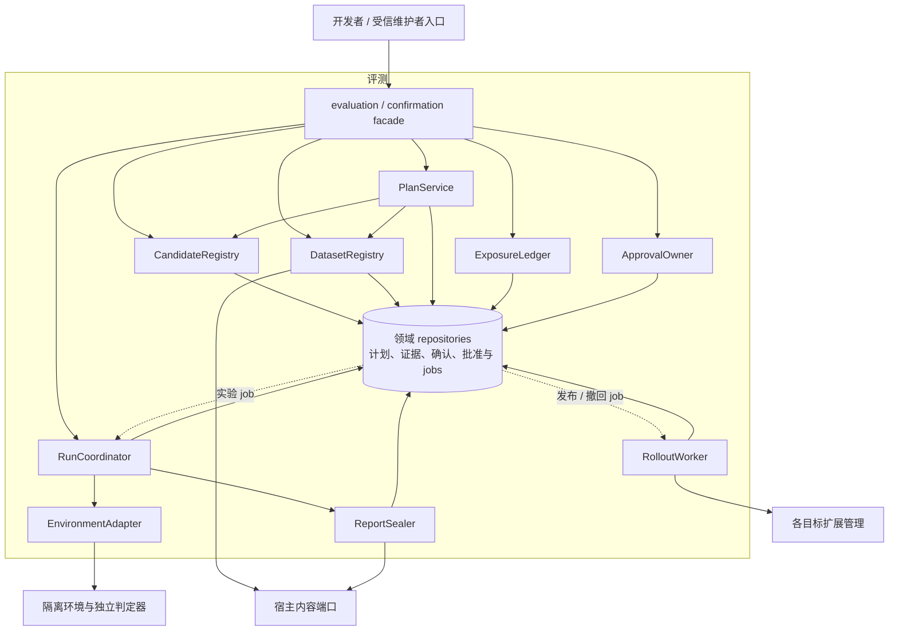
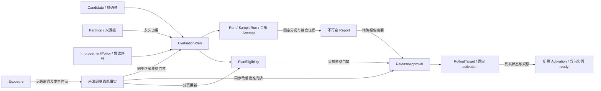
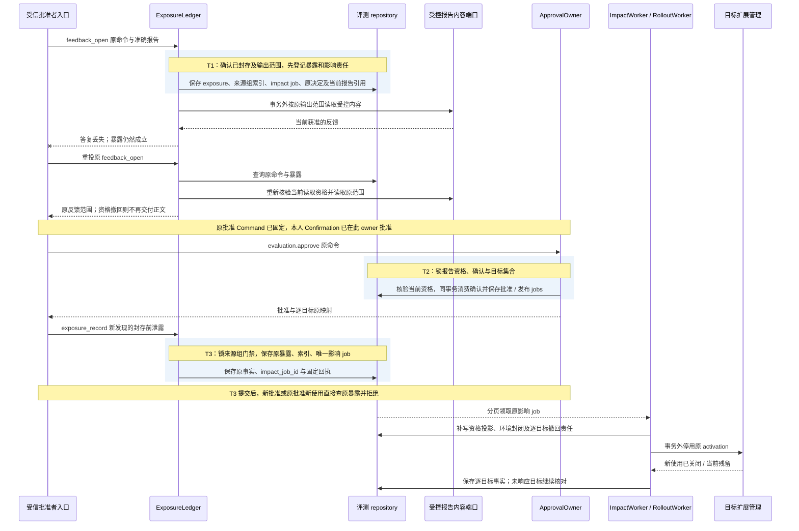

# 评测账本、证据资格与发布实现

[模块主线](README.md) · [指标权威定义](../validation/README.md#metrics) · [组件切换](../extensions/implementation.md)

本页落实候选、固定计划、运行、报告、暴露、批准和发布的内部接口及事务。
默认实现将治理账本、内容元数据和持久 job 放在原评测 owner 的提交域，字节使用共享对象存储；实验运行在独立隔离池并占用独立资源份额。
业务效果由独立判定器取证，评测不直接改任务成功状态。
静态序列只验证已给出事实的结构与关联，不执行模型、隔离或设备。

## 1. 模块形状与信任边界

评测治理是宿主内的领域包，对外 facade 是 evaluation 方法处理器与本 owner 的 confirmation 方法处理器。
CandidateRegistry、DatasetRegistry、PlanService 和 ApprovalOwner 负责短事务准入，RunCoordinator 与 RolloutWorker 负责持久任务推进，ReportSealer 与 ExposureLedger 管理证据封存及当前资格。
这些内部组件通过领域 repositories 访问原 owner 的数据库；EnvironmentAdapter 隔离真实实验环境的创建、真值与封闭端口。
生产评测工作者独立进程运行，候选、计划、资格和批准仍由原评测 owner 裁决。确认记录由本评测 owner 保存并在批准事务内消费，UI 不承担该事实。

| 内部单元 | 接口 | 权威责任 |
| --- | --- | --- |
| CandidateRegistry | register/read | 精确候选、父谱系及改进过程关联 |
| DatasetRegistry | register/reserve/close | 来源组、用途权限、保留占用与关闭 |
| PlanService | create/read | 冻结计划、永久尝试序号及准入裁决 |
| RunCoordinator | start/cancel/recover | 样本、两臂环境及有限重试责任 |
| EnvironmentAdapter | prepare/start_sample/inspect/observe_truth/seal/destroy | 实际环境身份、受信启动许可、候选隔离和封闭事实 |
| ReportSealer | assemble/seal | 完整分母、缺口、独立证据和不可变摘要 |
| ExposureLedger | open/record | 正常反馈开放和异常泄露的永久事实 |
| ApprovalOwner | approve/check/revoke | 当前批准及有限使用依据 |
| RolloutWorker | activate/observe/stop | 逐目标映射、批次门禁及撤回传播 |

候选开发者只能读取获准的开发和选择材料。
受信评测维护者登记分区及过程策略，独立判定器取得受保护真值。
候选无法修改计划、判定器、评分表或原始证据。
有代码候选时必须先验收隔离环境；“子进程运行”本身不满足该保证。

图例：实线表示同步依赖；指向 repositories 的实线为同 owner 的事务读写，虚线为持久 job 的领取。EnvironmentAdapter 操作隔离环境，DatasetRegistry 读取准确材料，ReportSealer 写入不可变报告，RolloutWorker 激活、观察或停用目标；这些外部调用均在事务外执行，答复回写原责任后才能推进下一步。
图中 facade 的反馈输出受 ExposureLedger 控制，不能从 ReportSealer 或内容端口旁路读取保留成绩。
分区占用、环境身份、报告封存和真实激活分别确认。
报告通过不会直接生成业务 Grant，也不会证明组件已在节点就绪。

## 2. 两类发布和探索活动

| 活动 | 证据用途 | 可以产生的批准 |
| --- | --- | --- |
| development / selection | 调试、候选比较及诊断 | 不能作为正式改善证据 |
| compatibility_check | 契约、权限、安全前提及状态格式符合 | compatibility，仅说明可按合同运行 |
| release_confirmation | 未暴露保留数据上的正式改善确认 | improvement，必须通过全部适用门禁 |

首次内置安装使用 compatibility 路径，无旧版时 baseline_lock=null。
普通兼容发布不必证明相对改善，必须有真实契约证据及精确目标批准。
失败的改善申请不能原地改为兼容发布；需另建明确目的的候选申请和计划，历史失败保留。
这不会重新获得正式改善次数或解除保留分区暴露。

报告 evidence_class 分 conformance、formal、exploratory。
conformance 对应兼容验证，formal 对应具备正式资格的保留确认；其他结果只作探索。
三项质量门禁分别带 applicable、result 和 reason。
不适用的改善门禁写 applicable=false、result=inconclusive，不能冒充 pass。
兼容批准只核验其必需契约、环境与格式；改善批准要求适用质量门禁全部通过。

## 3. 表、唯一键与保留

| 表 | 键与索引 | 固定事实 |
| --- | --- | --- |
| candidates | candidate_id；digest；improvement_id | 制品、父谱系、候选锁与发布目的 |
| improvement_policies | improvement_id UNIQUE | 范围、次数、停止规则、整体推断方法和受信批准 |
| dataset_partitions | partition_id；content_digest | 精确样本、来源组、用途与权限引用 |
| partition_sources | (partition_id, source_group_id) | 跨分区的来源关系；相同字节之外的谱系 |
| source_group_gates | source_group_id UNIQUE；revision | 来源组登记时建立；正式资格核验取共享锁，异常暴露登记取排他锁并递增修订 |
| holdout_reservations | partition_id UNIQUE；plan_id UNIQUE；release_request_id UNIQUE | 不可返还的正式保留占用 |
| formal_attempts | (improvement_id, attempt_index) UNIQUE | 跨申请的永久尝试次数 |
| evaluation_plans | plan_id UNIQUE；digest | 固定输入、抽样、判定、停止及预算 |
| evaluation_runs | run_id UNIQUE；plan_id UNIQUE | 每冻结计划唯一整组运行、状态、取消和清理责任 |
| sample_runs | (plan_id, sample_id, arm) UNIQUE | 基线／候选固定样本位置和结果 |
| sample_attempts | (sample_run_id, attempt_index) UNIQUE | 全部物理尝试、费用与环境身份 |
| environments | (run_id, sample_id, arm) UNIQUE；environment_key UNIQUE | 创建前固定原环境键；不同样本／臂不共用键，保存实例、封闭与清理状态 |
| sample_start_admissions | (run_id, sample_id, arm, stage, attempt_id?) UNIQUE；formal_gate_revision、start_before | stage 区分环境准备与样本尝试；每次有限时逻辑启动许可单独绑定，暴露前已提交者单列在途 |
| reports | report_id UNIQUE；digest | 不可变内容；当前资格在独立表 |
| plan_eligibility | plan_id UNIQUE | 可滞后的正式资格投影及已归并暴露；准入还须查询原暴露 |
| feedback_exposures / exposure_sources | exposure_id UNIQUE；(source_group_id, exposure_id) 索引 | 原暴露、来源组范围、发生时点与证据；正式资格的同步门禁事实 |
| exposure_impact_jobs | exposure_id UNIQUE；扫描游标与 work_revision | 正常反馈与异常泄露均建立；按来源关系分页更新计划投影、封闭运行并登记撤回；exposure_record 原回执返回固定 impact_job_id |
| formal_quarantines | tenant／评测 owner、受影响分区、证据引用、状态与恢复依据 | 历史数据来源组超线格式范围或关联不完整时先持久封闭该 owner 的全部正式改善门禁，待完整核验后才解除 |
| release_approvals | approval_id；(state, expires_at) | 精确候选、报告、目标、批次、截止和回退 |
| approval_uses | use_id UNIQUE | 原动作、实例、批准修订和固定启动窗口 |
| rollout_targets | (approval_id, target_id) UNIQUE | 固定 activation_id 与实际观察 |
| rollback_targets | (source_approval_id, target_id) UNIQUE | 新版发布的唯一回退 activation_id、独立旧版批准引用、触发及逐目标恢复事实；不覆盖旧批准原 rollout |
| closed_governance_keys | (scope_hash, object_kind, original_id) UNIQUE | 关闭、次数及占用的最小不可重用索引 |

上述唯一性都包含 tenant 和权威 owner，跨租户不能形成同一业务对象。
数据库约束与事务裁决共同防止并发占用；后台清理不能删除决定正式资格的计数键。
保留分区正文、原报告和样本可按用途清理，最小占用及暴露摘要继续阻止旧数据被当成全新证据。
若内容已清理，读取返回 gone，不重新构造报告或重新执行原计划。

### 核心证据对象与流转

图中的箭头表示精确引用及派生依据；当前资格与不可变报告分别建模。使用同一来源组的派生分区仍通过来源关系影响资格，不能仅按字节摘要判断独立性。

| 对象链 | 创建与持久化 | 传递、消费与归并 | 清理后保留的责任 |
| --- | --- | --- | --- |
| Candidate / Partition / Policy → Plan | Registry 保存准确制品与来源；PlanService 一次提交计划、正式尝试序号和 holdout 占用 | RunCoordinator 只接收冻结 plan 引用；重试不换样本、目的或统计方法 | 过程次数、来源关系和占用索引，取消或改名不返还 |
| Plan → Run → SampleRun / Attempt / Environment | 先持久固定样本位置、环境创建键与 job，再调用 EnvironmentAdapter | 每次物理尝试独立留证；独立判定器经受保护通道交回真值；RunCoordinator 归并所有尝试及未知责任 | 原环境与费用核对、seal / destroy 责任不随运行终态消失 |
| Run → Report | ReportSealer 先构造不可变正文，再锁计划、样本修订和当前资格提交摘要 | 消费者读取准确报告引用；完整分母及报告内容不随审批或撤回改写 | 原报告摘要、缺口和正式资格关联；正文清理后返回 gone |
| Exposure → PlanEligibility | 正常反馈先记永久暴露再输出；异常泄露先保存原事实、来源组索引和唯一影响扫描责任 | 资格门禁同步查询原暴露；分页扫描补写投影、环境封闭和撤回 job，迟发现的早期泄露也能阻止新使用 | 暴露和失效摘要持续阻止重用材料；日志清理不恢复资格 |
| Confirmation → Approval → RolloutTarget | 本人决定在 owner 保存；approve 同事务消费确认并建立有限目标映射 | RolloutWorker 以固定 activation 查询实际切换、当前 ready 与观察，再按既定门禁扩批 | 每个目标实际状态、撤回及残留；不能仅保留“整批成功”汇总 |

运行计数、发布进度和仪表盘是这些原事实的投影，不取代原样本、尝试与目标映射。
跨 owner 交回缺失时保留对应环境或目标的未知项；只对已证实事实归并，不能把缺少观测当作成功或零费用。

## 4. 候选、分区与计划准入

candidate_register 固定候选制品、锁、来源和父谱系。
同一 candidate_id 的摘要、发布目的及 improvement_id 不允许修改。
新候选必须明确关联既有改进过程；改名不重置正式尝试历史。
无法核对来源关系时可以做探索，不产生正式改善资格。

partition_register 检查内容可读取、用途允许、样本唯一且来源组覆盖完整。用于正式改善的分区在登记时还须限制来源组数量，使任一次完整暴露范围可由线格式表示；超出时拒绝正式资格，不等待泄露后才截断证据。
同一个来源任务的改写、派生及重复种子必须落在同一来源组。
维护者不能仅依赖内容哈希宣称来源独立；来源审查结论也需可查引用。
关闭、撤权或保留暴露的分区不能再当作新的正式确认材料。

plan_create 的共同事务步骤：

1. 查原命令和 plan_id，事务外解析候选、分区、锁、判定器、环境及权限引用；事务内先锁原命令与 tenant／owner 正式门禁，再按 source_group_id 升序锁相关来源组门禁，随后重读固定引用。
2. 检查样本恰为冻结分区的获准子集，预算、期限、重试及停止规则有界。
3. 按 purpose 检查兼容或正式确认的必需条件。
4. 正式确认再锁 ImprovementPolicy、分区及 release_request 唯一占用，并核对分区／来源组的原暴露索引及 formal_quarantine；不可核验时不占用保留资格。
5. 检查整个过程剩余次数；分配唯一 formal_attempt_index。
6. 同时保存计划、永久次数占用、保留占用及原回执。

正式确认的分区必须为 holdout，且未被该候选谱系及选择过程暴露。
ImprovementPolicy 在第一项正式计划前由受信维护者确认，不由候选自己选择。
默认只允许一次正式确认；多次需要预先给出覆盖全部尝试的分析方法。
失败、取消、环境准备失败均不退还已占用次数或保留资格。

兼容计划固定契约用例及环境，不要求改善策略、成对收益或未暴露保留成绩。
它仍检查用户数据使用权限，不把测试用途当作默认许可。
计划保存后不得换样本、阈值、种子、候选或统计方法。
修改只能建新计划，并保留原尝试关系。

## 5. 运行与环境交接

run 接纳固定 run_id、plan_id 和 plan_digest；先查询原命令及 plan_id 的唯一运行绑定。相同 run_id 和准确绑定返回原运行；不同 run_id 请求同一 plan 返回 precondition_failed，related_id 指向原 run。计划内重试和分批不新建 run，另一轮实验须新计划并重新占用其适用的正式资格。
首次正式改善接纳按原命令、tenant／owner、来源组、计划的共同锁序取得门禁，再次检查唯一运行槽及准确计划，核对原暴露与 formal_quarantine，同事务保存唯一 Run、全部 SampleRun 位置和首次环境准备 jobs。兼容用途也在锁原命令和计划后竞争同一唯一槽。资格不可核验时不建立新的正式环境责任。completed_samples 按已结束全部所需臂的样本计数，不按臂或 attempt 增加分母。
物理重测始终另建 attempt，不能覆盖前次结果或挑选最好结果。

每个环境准备、样本首轮及重试在真正交给环境适配器前，还须在短事务中按 tenant／owner、source_group_id 升序的共同锁序核对该 plan 全部来源组的暴露原事实及 formal_quarantine，保存绑定原 run/sample/arm、阶段及可选 attempt_id 的有限时 start_before 与当前 gate_revision。无许可、已过期或资格不可核验的 worker 不发新启动；EnvironmentAdapter 在实际 prepare 或 start_sample 前须从原 Evaluation owner 可认证地查询许可，或验证该 owner 签发的许可，核对准确 run/sample/arm/阶段、适用时的 attempt／原实例以及 start_before；跨机截止按宿主可信时钟误差保守缩短，不接受 worker 自报的 gate_revision、期限或签发者。任何一项不可验都拒绝新启动，不能凭已有 queued job 新建环境或 attempt。暴露若先于该事务提交，新许可拒绝；许可若先提交，则其后才发生的暴露不能倒消已经逻辑准入的动作，远端可能在原有限窗口内物理启动，按在途效果、费用和 seal 责任报告。已知暴露或 seal 的环境不得再接受旧许可启动；许可不授权后续新 attempt，影响扫描仍向全部已创建／未知环境传播封闭。事务内不等待远端；窗口上限由宿主固定并以本链路的撤回时延验收。

| 阶段 | 保存事实 | 成功点 |
| --- | --- | --- |
| queued | 固定样本位置与环境创建键 | 后续 job 可恢复 |
| running | 两臂实例、前置检查及全部尝试 | 实际任务已经准入 |
| scoring | 封闭状态、独立真值及完整原结果 | 已有足够证据进行固定判定 |
| finished | 最终报告或明确无效结论 | 不代表环境清理结束 |
| blocked | 原环境或副作用未知，恢复责任可查 | 不创建替代环境掩盖未知 |

成对运行在任何一臂启动前完成双方环境预检。
基线与候选不共享可变设备或记忆；种子固定顺序，热身和缓存条件单列。
候选只接触观察和动作入口，真值通道由判定器独占。

环境 prepare 使用预先保存的 environment_key，连同 run_id、sample_id、arm 固定一份原创建意图。
创建答复丢失时 inspect 原 environment_key，核对返回的 run/sample/arm 映射；同键不同臂是冲突，暂时查不到不能证明从未创建。
未知效果只核对原操作，不为了获得可评分答案重新发出不可重复动作。

取消以整体 run 为边界，先禁止其新样本，逐一登记该 run 全部已创建和创建结果未知的环境 seal 责任。
seal 确認禁止候选继续行动后，仍需核对在途效果与账务，再 destroy。
无法 seal 则保持 blocked 和预留，不能直接删除环境后声称无残留。
任务总期限不取消清理责任；清理使用预留管理份额。

## 6. 评分、分母与报告封存

评分只读取固定计划和实际证据，不能依据任务自报成功得分。
unknown 在已证明成功比例中计零，同时保留它区别于确定失败的原因。
启动后的提供方错误和基础设施故障保留在冻结分母中。
仅预先声明的整组无效条件可令报告 inconclusive；不逐例剔除坏结果。

ReportSealer 在短事务前构造完整报告内容、摘要及来源引用。
首装的受信发行报告可由最小宿主调用内部 import_conformance 端口导入：核验来源、签名、制品摘要和目标环境覆盖，并保留外部运行身份。
该端口只接纳 conformance，不授予 formal 改善资格；本机环境预检独立留证，不伪造本机模型或工具运行结果。
正式改善报告的事务先按共同锁序取得 tenant／owner 与来源组门禁，再锁计划、全部样本结果修订与当前资格，核对原暴露索引和 formal_quarantine；兼容报告只核对其所需用途与契约证据。这样封存时不会遗漏并发暴露或资格变化。计划样本数及来源组数受装配上限约束；超出锁内可核验范围的计划不得接纳正式运行。
同一个 report_id 只能对应一份内容摘要；后续泄露改变当前资格，不修改原报告。

| 门禁 | conformance 报告 | formal 改善报告 |
| --- | --- | --- |
| contract_gate | 必须 pass，无必需 unknown | 同样必须 pass |
| target_attainment | 不适用项明确标记 | 按冻结首次/重试比例判断 |
| statistical_gate | 不据兼容覆盖集作总体推断 | 抽样与过程方法有效，附加统计门禁 pass |
| improvement_gate | 不适用，不能标称改善 | 配对实用改善与每类退化均满足 |
| coverage / eligibility | 完整契约覆盖和获准材料 | 完整样本、正式保留资格及当前来源有效 |

固定覆盖集可以报告比例，但不自动成为总体统计样本。
同源改写、重复种子及有限重试不能增加独立样本数。
分类退化、费用与时延越界不能被总体加权收益掩盖。
统计方法及阈值不在运行后为结果改写。

## 7. 报告读取与反馈暴露

evaluation.read 的 report 分支只返回封存状态、当前资格和准备故障。
它不返回成绩、逐例答案、通过状态或能反推出保留结果的错误细节。
正式报告封存后，受信批准者用 feedback_open 申请获准范围。

反馈事务先按共同锁序锁该报告关联的来源组门禁，保存 exposure_id、来源组索引、唯一 impact job、接收主体、报告摘要、范围和时间，再读取受控报告内容。它不撤销本报告的既有资格，却使同分区和同来源组不再可作为新的正式保留材料；共享来源组的其他正式计划若尚未封存，原暴露门禁立即阻止其正式报告及改善使用，影响扫描再分页保存失效、环境封闭与撤回责任。扫描尚未封闭的 B 环境可能已有样本动作在运行；这些动作不能进入正式成绩，实际效果、清理和费用仍沿原环境责任核对。feedback_open 原线输出仍为 exposure 与本报告，不以扫描完成作为反馈读取前提。
返回答复丢失仍视为暴露；重投原命令恢复原结果，不产生第二次未暴露资格。
只能对完全封存报告开放，不能边跑边向候选展示成绩。

exposure_record 记录异常泄露，允许尚无 report_id。
发生时点未知时按可能污染正式过程的情况保守失效。
受信维护者须核验输入的 partition_id、来源组与泄露证据对应；`source_group_ids` 覆盖所有可能受影响的组。无法缩小到具体组时取该分区的完整来源组集合，不能让提交者选择有利子集。若在历史数据中发现来源关联不全或一次泄露范围超过线格式上限，原 owner 先以受信管理入口持久保存泄露证据及 formal_quarantine，封闭本 owner 全部正式改善门禁；随后拆分可表达的准确范围逐条登记原暴露并核对关联，完成前不得解除隔离。事后发现泄露永远不能仅因线格式不容纳而丢弃证据或继续使用旧批准。
原评测 owner 在一个短事务内保存暴露、准确来源组关联、原命令回执和按 exposure_id 唯一的 impact job；返回固定 impact_job_id。它不在该事务内遍历全部计划或目标。来源组关联有输入上限；分区登记时先建立来源组门禁行。所有涉及来源组的正式占用、run 接纳、环境／样本／重试逻辑启动、报告封存、批准、在线使用、反馈开放和异常暴露事务，都先按相同稳定顺序锁 tenant／owner 门禁及来源组 ID，再读取或更新原暴露；异常暴露递增相应门禁修订，资格核验取共享锁。这样若准入先提交，后提交的暴露使其后续使用失去资格；若暴露先提交，准入必须看见并拒绝。资格门禁或 formal_quarantine 状态不可核验时不根据旧投影放行。

正式改善计划在创建时不得使用已有暴露的保留分区或关联来源组。已创建计划在报告封存前发生非受控暴露，或后续发现其发生时点不明／早于或等于封存切点时，当前正式资格为 ineligible；已封存报告仍保存原内容和摘要。正常 feedback_open 发生在封存后，只影响该分区之后的正式用途，不撤销原报告。当前资格由计划、封存切点和原暴露事实共同决定；PlanEligibility 只是便于查询的失效投影，不能作为改善发布使用门禁的唯一依据。兼容性报告仍依其契约证据与当前数据用途判断，不因保留集暴露自动撤销。

每项正常反馈或异常泄露的 impact job 都从来源组关联索引按稳定键分页找出受影响计划、运行和批准。尚未封存的同源正式计划受已记录暴露影响；已封存报告仅在暴露发生时点早于或等于其封存切点、或时点不明时失效。原报告封存后的正常反馈不撤销原报告，但会影响仍在运行的其他同源计划。每页在短事务内推进扫描游标，幂等写入失效投影、环境 seal 责任，以及每个原 approval／target 的撤回或停用责任；崩溃重领沿原游标继续，不能从尚未处理的计划数推断“没有影响”。扫描中的 approval_check、approval_lease、计划或报告决定、扩批仍直接查询原暴露，旧批准不能借投影滞后继续签发新的使用资格。已签发但目标尚未知撤回的在线回执及离线租约只在原固定窗口内可能继续，不能宣称瞬时封闭失联节点；逐目标撤回、残留效果与费用继续核对。跨 owner 的内容关闭由原 owner 继续传播，评测本地不伪造远端删除。

正常封存后的反馈不撤销这份报告的既有正式资格，但禁止该分区再用于后续正式确认。
事后发现封存前已泄露则原计划失效，已经形成的批准也必须撤回。
原报告仍可用于诊断，不能删除后再生成一份“干净”报告。

### 反馈丢答复与早期泄露在批准后被发现

此图展开 ExposureLedger 与 ApprovalOwner 对同一报告当前资格的共同裁决。
正常封存后向受信批准者开放反馈保持该报告已有资格；随后发现封存前泄露则改变当前资格并撤回批准，两种暴露不能合并处理。

若 T3 先于 T2 提交，批准直接拒绝；若批准先提交，原批准与报告仍可查询，但当前资格从 T3 起受原暴露门禁约束，撤回工作必须可恢复。既有在线启动窗口和离线租约在原期限内可能继续，状态须标明尚未确认的目标。
反馈读取当前被拒绝不会抹去原暴露，重投也不获得一个新的未暴露身份。
撤回答复丢失由 RolloutWorker 查询原目标 activation 和停用命令，不能以已发送控制代表实际封闭；在途效果与费用仍由原 owner 收尾。

## 8. 批准与逐目标发布

approve 先查原命令；改善批准按共同锁序先取得 tenant／owner 与相关来源组门禁，再锁候选、报告当前资格和目标集合，验证 report_digest 与 candidate_digest，直接查询原暴露及 formal_quarantine 并按报告封存切点计算当前资格；PlanEligibility 投影尚未更新或影响扫描未完成，都不允许以旧 eligible 值放行。兼容批准核对 conformance 的契约和当前来源用途，不要求未暴露保留集。
本人或维护者的 Confirmation 固定发布目的、目标、批次、期限、停止规则、回退锁与独立旧版批准引用。
调用端先固定 evaluation.approve 的完整原 Command，再向 evaluation owner 请求 confirmation.request；UI 经本人会话 decide 后提交原命令。
approve 在自己的批准事务内锁定并一次消费同 owner 的 approved 确认，核对原 command_id、准确 Schema、规范摘要及期限；消费和发布责任共同成败。
compatibility 检查 conformance 报告；improvement 检查 formal 及全部适用门禁。
任一所需证据缺失、来源失效、报告未封存或内容不匹配时拒绝。

rollback_lock 非空时，rollback_approval_ref 必填且只能指同一批准 owner 的另一份既有 ReleaseApproval。approve 同事务核对引用修订、旧批准 active、精确锁一致、覆盖本次目标及不早于本次 expires_at 的期限，并按旧批准自身 release_kind 核验报告、暴露门禁和当前来源用途；不得用新版报告替代。回退锁为空时拒绝携带该引用。新版批准与引用共同固定，旧批准以后撤回、到期或证据失效仍立即影响回退资格；接纳时的引用修订不允许覆盖旧批准当前状态。

批准记录与每个目标唯一 activation_id 同事务保存。
目标集合有限且不变；扩大目标、更换锁或降低门禁需要新的批准。
多批次只按预先批准的集合推进，不能在后台自动扩为全部用户。

RolloutWorker 在发送每个新 activation 或扩批前核对原批准；改善发布还要核对报告的原暴露门禁及 formal_quarantine。然后查询原 activation，等待真实 active、当前实例 ready 与观察证据。
本批所有目标通过最小观察窗口及样本数量，且未触发停止阈值后，才推进下一批。
离线、无样本、激活未知都保持等待或停止，不能把 applied 当作整批发布成功。

撤回先保存指定批准 revoked、传播 jobs 和原回执；撤回新版不连带撤回其引用的旧版批准。
目标收到后封闭新使用；已发生效果和费用继续核对。
回退工作按原新版批准和 target 唯一保存 rollback_targets：新的固定 activation_id、预期当前代际及所引用旧批准；它不覆盖旧批准最初发布的 rollout_targets。重新核验旧批准当前状态、锁、目标、期限及其自身证据资格，再核对旧代码信任和当前格式，全部成立才交接 extensions.activate。该 activation 的 approval_id 是旧批准 ID，old_lock 是被停用的新版，new_lock 是固定回退锁；后续 work／reopen 继续使用旧批准。无当前批准依据或目标离线时只保留停用与恢复缺口，不凭原新版回执或旧离线租约激活。
新版本后来又被另一份发布替换时，原回退命令的预期代际冲突；读取当前绑定并报告原恢复已被后续发布取代，不盲改 expected_generation 覆盖新赢家。回退提交后丢答复只查询原回退 activation；迟到的新版停用仍绑定原 activation，不能封闭已切回的代际。
停用成功、旧版就绪与残留责任分别报告。

## 9. 在线启动、离线续用与重启

在线 approval_check 绑定固定 use_id、action_id、目标、锁、当前实例和动作类型。
action_kind=activation 改变活动代际，reopen 恢复原代际的新实例，work 启动一项新业务工作。
reopen 不能换锁、扩大目标或重新执行迁移。

全本地批准 owner 与宿主共库时，当前批准核验和启动登记在共同事务中完成。
批准的绝对到期仍在该事务中按 [ClockAdapter](../deployment.md#clock-adapter) 的可信当前时间检查；共库只免除远端窗口，不免除时钟前提。
返回的本地启动证据引用 commit_id，不伪造远端回执或启动截止。
远端 owner 在保存 ApprovalUse 前同步核验原批准与当前目标；改善发布还核验相关报告的原暴露门禁及 formal_quarantine。窗口取批准期限和有限在线上限的较小者。必需门禁不可达或无法核验时不签发新回执；已经签发的原动作只在原窗口内按原规则处理。

原 use 重放保持原绑定和 start_before。
已知撤回立即阻止启动；未知撤回仅可能影响原窗口内的固定动作。
不得把一个 work 回执复用于其他工作或用查询刷新期限。
宿主暂停恢复或时间信任代次变化后，先封闭旧本地资格，再按原 use／lease 核对当前状态与保守截止；已过期的窗口不能因 UTC 回拨或重新换算而延长。

approval_lease 对改善发布同样先核验原暴露门禁及 formal_quarantine，只针对已有活动实例及显式非零离线窗口。
租约不能离线激活新版或扩批；新进程实例也不能继承旧租约。
重启读取历史激活依据，但重新取得本次实例的 reopen 依据后才开放入口。

原批准撤回或过期后不可复活。
恢复同一已失效批准下的版本需新的受信批准；自动回退使用已独立获准且此刻仍有效的旧版批准，不复活原批准。历史回执、已发生效果和关闭索引仍保留。

### 生产部署、评测容量与可用性

部署采用[公共可用性策略](../deployment-production.md#availability)与[容量和过载策略](../deployment-production.md#capacity)。
评测 owner 的短事务留在同租户数据库分区，实验环境工作者按独立样本与两臂运行横向扩展，发布工作者按目标展开。
同一 improvement 过程的策略、永久次数、来源组关联、保留占用和资格裁决必须可在同一权威内核对；不能为扩容复制一份“尚未使用”的保留资格。
进程重领原 job 不改变计划或环境身份，独立部署的工作者通过原命令和回执交回事实。

| 扩展单位 | 必须串行或等待的边界 | 依赖不可用时的行为 |
| --- | --- | --- |
| PlanService 与治理 facade | improvement 过程、partition / 来源关联、正式尝试序号、原命令 | 权威不可用不新占用、不新批准；恢复原记录后继续，不能另起 owner 绕过次数 |
| RunCoordinator / EnvironmentAdapter 按样本工作 | 同 plan / sample / arm 的逻辑位置与原环境创建键；两臂预检屏障 | 创建或动作未知先查原环境；候选真值隔离不可证明则关闭对应正式运行 |
| ReportSealer 按 run 构造报告 | 封存时固定计划、全部样本修订和当前资格的共同检查 | 内容不完整或原证据不可读则保持未封存或明确无效，不输出成绩 |
| ExposureLedger / ApprovalOwner | 报告资格、相关来源组原暴露、确认一次消费与批准对象 | 数据库中断不宣称暴露登记或批准成功，也不凭旧资格投影放行；已保存暴露不因正文读取失败撤销 |
| RolloutWorker 按批准和目标 | 固定批次门禁、同 target 的 activation 和当前实例 | 目标、批准或观测不可达则等待/停止扩批；已发生效果和费用保留收尾 |

高并发主要花在模型调用、设备环境、内容读取与独立判定，控制账本的写入量随物理 attempt 增长。
先隔离评测与正常任务的模型额度、环境槽和内容读写份额，再增加实验工作者；不能让一次大评测占尽控制、撤回和环境清理能力。
提供方调用已经启动后的错误、超时和费用未知仍进入固定分母与账务，供应商拥塞不能变成删除坏样本的理由。

报告构造在事务外完成，事务中只核对固定样本集合及其已保存修订和资格；可维护索引及计数投影减少定位开销，最终封存仍须验证完整性，不能只相信一个汇总计数。
热点通常是同一改善过程集中创建计划、一次暴露关联大量来源组或计划、一次运行的大报告封存，以及多目标同时重连形成的观察积压。
原暴露提交只写有限来源组索引和唯一影响 job，按来源关系分页定位受影响计划并逐项保留工作责任。测量来源组门禁的读写竞争、影响扫描最老游标、待撤回目标数及端到端停用时间；在无法确认当前资格前不得发新批准或启动使用，不能用后台传播尚未完成作为暂时准许依据。

容量实验记录每份计划的独立样本数、物理尝试数与费用、环境创建/封闭/销毁延迟、未知环境龄期、报告构造与锁内提交耗时、资格失效到撤回落实的分段延迟、批次等待和最老目标观察。
新实验超限时排队或拒绝，已经启动的尝试继续受原预算约束并保留结算与环境清理；扩批限额耗尽时等待，不扩大预先批准的目标集合。
容量与正式统计资格分别验收：增加更多同源样本、重复种子或重试既不是新的独立样本，也不能弥补吞吐不足。

## 10. 故障实验与交付证据

| 实验 | 前置与刺激 | 必须观察到 |
| --- | --- | --- |
| V-I01 | 干净安装无旧基线 | compatibility 证据可批准；无虚构 paired improvement |
| V-I02 | 失败改善申请改目的重投原 ID | 摘要或计划冲突，历史失败和次数不丢失 |
| V-I03 | 两计划并发抢同一保留分区 | 一个唯一占用；失败请求不能新建身份绕过 |
| V-I04 | 超限后改申请名或 improvement_id | 同过程关联仍命中，不能复用正式资格 |
| V-I05 | 环境创建成功后丢答复并取消 | 查询原环境，seal/清理责任继续，无替代环境 |
| V-I06 | 候选读真值或写评分规则 | 隔离拒绝并留证据，运行不取得有效通过 |
| V-I07 | 提供方超时后删除该样本 | 完整分母检查失败，未知仍占原位置 |
| V-I08 | 报告封存前请求反馈 | 无成绩输出，feedback_not_ready |
| V-I09 | feedback_open 提交后断线 | 暴露已登记，重投不恢复未暴露资格 |
| V-I10 | 批准后发现更早泄露 | 当前资格失效、撤回 jobs 持久，原报告摘要不变 |
| V-I11 | 兼容报告用于改善批准 | evidence_incomplete，不能借用不适用门禁 |
| V-I12 | 部分目标仅 applied 或观察不足 | 不推进下一批，逐目标真实状态可查 |
| V-I13 | 重启复用旧实例窗口 | 拒绝；新的 reopen 依据绑定当前实例 |
| V-I14 | 原批准撤回后重放激活回执 | 历史事实可查，新的工作和重开均拒绝 |
| V-I15 | 清理保留数据后重复登记旧分区 | 最小关闭/暴露索引阻止当作全新保留材料 |
| V-I16 | 一次异常泄露关联超过 100 个计划／目标，在 impact job 第一页提交后崩溃；同时请求旧批准的新 use 与下一批发布 | 原 exposure 回执只给一个 impact_job_id；受影响项即使尚未扫描也被原暴露门禁拒绝新使用和扩批；重领续页且每目标撤回责任唯一，已签发窗口与离线租约分别报告 |
| V-I17 | A 分区报告封存后反馈开放；同来源组 B 分区正式运行尚未封存且已有样本动作启动 | A 原报告保持资格，B 在原暴露门禁立即失去正式资格；反馈的唯一 impact job 分页封闭 B 环境并更新投影，已启动动作可能继续到实际封闭，效果、费用和清理责任不丢失 |
| V-I18 | 一次暴露与 B 的 run 接纳、队列中环境准备、样本首轮及重试各自并发，环境适配器延迟读取启动许可 | 暴露先提交则所有新逻辑启动拒绝；许可先提交只允许原 attempt 在有限 start_before 内物理启动，超期拒绝；未获许可的 queued job 不能启动，已启动动作进入原环境 seal、效果和费用核对 |
| V-I19 | 两个不同 run_id 同时接纳同一 plan；随后分批派发及有限重试 | 只有一个整体 Run，另一命令 precondition_failed 并关联原 run；sample/arm 位置、分母及费用不重复，取消覆盖全部原环境 |
| V-I20 | 同一 run 两样本的两臂并发准备，任一 prepare 答复丢失 | 四个独立 environment_key，恢复只查原键；同键换 sample/arm 拒绝，未知环境不能换键重建 |
| V-I21 | 新版撤回后自动回退，分别注入旧批准撤回／到期／证据失效和切回后崩溃 | 有效旧批准独立授权新的回退 activation、work 与 reopen；其他分支只停用并保留缺口，不复活新版批准，迟到新版停用不关闭新代际 |

运行报告固定环境、全部样本、费用、原命令、证据摘要和异常注入位置。
本页不提供实际成功率、隔离通过或容量达标结论。
[回退记录序列](../contracts/examples/protocol/65-approved-rollback.json)和[定向静态校验](../validation/validate_release_recovery.py)检查独立批准、原回退重放及单计划唯一 Run；环境隔离、并发竞争和实际 Renderer 行为仍须上述运行实验。
