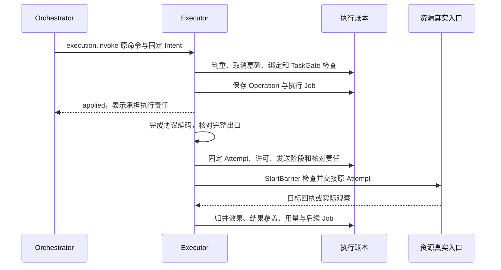

# 执行系统与外部效果

Executor 保存一次获准行动的实际执行事实。它首先回答“发生了什么、还有没有迟到可能”，再报告返回值。API 成功码、进程退出和模型描述都不足以证明用户目标完成。

默认以 API 为主，受管文件和 GUI 是具体驱动。驱动共享 Operation、Attempt、授权和效果核对合同，目标自身的幂等及观察能力决定恢复上限。

字段、来源与存储关系统一见[本模块数据记录](../data/module-records.md#4-executor-与真实目标)和[存储附录](../data/storage.md)。本章集中说明业务裁决与恢复。

## 1 Operation 与 Effect

Orchestrator 的 OperationIntent 固定 task/goal/control、唯一准入来源、Capability、Binding、最后业务参数、资源、期限、费用上界及许可关联。Executor 接纳同一 operation_id 后保存自己的 Operation；两方可以位于不同数据库。

Operation 的执行状态为 accepted、started、closed；效果独立为 not_started、applied、not_applied、unknown。另存 may_apply_later=true/false/unknown、证据、准确结果、累计用量及 usage_final。

- not_started：有可靠本地证据未越过实际入口
- applied：目标证据证明声明效果发生。后来的目标变化不改写这项历史事实
- not_applied：目标证据证明本次声明效果没有发生
- unknown：现有材料不足以判断，包括回执丢失和目标不可查询

closed 表示该执行责任已封闭新的目标尝试，不保证 effect 已知，也不保证费用最终。仅有 not_applied 仍不足以重试；还须 may_apply_later=false 和当前授权等前提成立。

### 多次尝试的效果归并

只读能力须由准确Capability及真实出口证明不产生目标业务写效果。其旧响应或费用未知不制造“迟到业务副作用”：后一次获准读取成功时可发布那次准确输出/观察，旧费用继续单独结算。read_only仍不能以此绕过来源权限、资源占用或实际在途上限。

有写效果的Operation级判断必须覆盖其完整Attempt和可能发送集合，不能选择最后一条响应。effect与“还有没有迟到”分别归并：

| 已知事实 | Operation级结果 |
| --- | --- |
| 全部尝试有可信未越入口依据，且旧发送均封闭 | not_started；may_apply_later=false |
| 任一原目标证据证明声明效果已发生 | 保留历史applied；其他尝试仍未知时may_apply_later为true/unknown，不算安全收束 |
| 没有applied，全部可能发送尝试均被证实未发生且不会迟到 | not_applied；may_apply_later=false |
| 其余情况或证据互相矛盾 | unknown或保留已证实的历史applied并附争议；may_apply_later不填false，保存核对责任 |

“目前文件不同”不是原写未发生的反证。能力的 effect_rule 明确谓词、目标关联、证据优先级及组合；无法用该规则消解矛盾时记录 effect_disputed，不覆写原Attempt。result_ref只有在准确输出及其覆盖已核实时发布；一次成功不能隐去其他可能重复副作用。closed 只封新的目标Attempt，未知核对和费用可以继续；不能关闭后又以重试名义启动。

## 2 能力合同决定重试

每个 Capability 固定版本和摘要、闭合的输入/输出 Schema、规范资源解释、效果谓词、证据规则、请求上限、计费与重复行为。Binding 再固定具体实现、端点、资源、配置、InstallLock 和实例就绪要求。

| effect_class | 原操作可再次发送的前提 |
| --- | --- |
| read_only | 不产生目标业务写效果，当前权限及预算有效；重新读取仍是新的观察/收费尝试 |
| target_idempotent | 目标实际识别原幂等键，键作用域与保留期覆盖恢复窗口；所有尝试保持该键及业务输入 |
| no_idempotency_guarantee | 只有已证实 not_applied 且不会迟到，才允许同 Operation 内有限重试 |

目标幂等保留期届满、未知写入、目标只返回暂时 not_found，均不能支持无条件重发。SDK 的“safe retry”声明必须由准确驱动与当前工具合同共同核验。重新换 operation_id、执行端或参数不构成安全恢复。

能力还明确 partial_read、完整遍历或当前状态读回的含义。空数组可能是过滤失败、权限缺口或真空集；每次结果须带实际筛选、分页覆盖、截断、目标观察时间、获取时间、缓存及媒体缺项。不能以本地 LIMIT 当全集完成。

## 3 从接纳到真实入口

StartBarrier是实际发送宿主内的受信入口。它与本地TaskGate、设备control_epoch和停止门禁串行裁决。宿主必须逐项核验Grant使用、发布批准、资源租约、观察窗口和可信时间，并采用Task、Operation、ControlSnapshot、UseReceipt及ApprovalUse中的最早截止。

资源owner必须先持久保存原Attempt的在途记录和核对责任。确认提交后，宿主才允许真实交接。资源owner与Executor分库时分别提交；准备答复未知时，必须先查询原记录。控制在交接后到达，只能阻止后续交接；已经交出的Attempt必须继续核对。

远端控制或撤权的提交不等于本地入口已知道。在线使用采用短的原 use 启动窗口；离线只按显式额度和期限继续。对完全即时撤回的需求，必须让真实入口和授权裁决共事务，或在撤权落实切点原子更新并由目标入口核验fence；远端Grant提交本身仍不等于目标已换代，否则拒绝提供该保证。

编码阶段只映射已固定意图：路径、参数位置、单位、正文及响应选择器来自准确版本。签名和临时认证可以刷新，不能改变业务对象或接收方。完整出口检查包括重定向、DNS实际连接、回调、分页和下载子请求；每个物理请求占原上限。封存后 hook 不能添加材料或动作。

### 执行方法的成功点

execution.invoke 沿核心Schema原意图，A输出operation_ref与执行/效果初态；execution.cancel的A只表示永久封新尝试及停止核对责任已存，未知ID先保存受信原Task绑定的取消记录。execution.reconcile payload 为 operation_id、source_revision?，A只Raise原核对，不接受调用者指定effect。execution.get/list返回完整当前Operation和分页Attempt，execution.control.get返回原最高控制及窗口引用。特有reason为 intent_mismatch、task_gate_stale、use_window_expired、resource_conflict、effect_disputed、unsafe_retry；“不能再尝试”和“原效果已核清”必须分开返回。

## 4 取消、未知与迟到

execution.cancel 对未知 operation_id 也保存取消墓碑及回执。原 invoke 后到不得启动。execution.control更新控制事实和独立签发窗口，规则如下。

TaskGate 与工作租约、设备代次互相独立。Job epoch 阻止旧 worker 写账本；设备 control_epoch 阻止旧入口继续控制资源；TaskGate 限制本任务的新动作。任何一个都不能单独证明第三方队列已排空。

发送后失答复时，查询原目标幂等键、原请求 ID 或独立观察。无法核实时保留 unknown、may_apply_later 与资源限制。cancel ACK、超时、设备离线和空读回都不能填成 not_applied。自动核对耗尽转明确待处置，不删原记录。

可信迟到事实按 owner/object/revision 归并。任务已 cancelled 时，原操作可以后来 applied，Task 仍 cancelled。新的补偿动作需要新授权、新意图和自己的效果证据。

### 控制事实与签发窗口

TaskGate 保存最高 control_revision 及控制事实摘要。摘要仅覆盖 orchestrator/task、goal_revision、control_revision、status/control；同控制修订的这些事实不同才冲突。ControlSnapshot 另有独立 window_id、issued_at/start_before和proof。窗口身份与控制版本不能共用一个计数。

原 Orchestrator 可用独立 `task.control_window` 命令签发同一当前控制事实的新有限窗口。输入固定 task_id、expected_goal_revision、expected_control_revision、receiver_id、原operation_ref；输出新的ControlSnapshot。它核当前Task/原Operation关系、未封闭入口、控制、期限及接收方。签发和交回责任耐久后才返回。旧窗口查询只返回旧窗口；同window_id异内容冲突。

`execution.control` 接收准确ControlSnapshot，保存更高控制事实或同事实的新窗口；旧控制不能覆盖新状态。实际入口选择本Attempt绑定的有效窗口，并核当前最高TaskGate。新窗口不修改原invoke、业务参数、Operation deadline或UseReceipt，不自动使旧目标/旧控制的意图重新获准。已过期授权使用仍按[安全恢复](../security/README.md#2-grant-和使用裁决)处理。

## 5 受管文件驱动

默认只支持稳定 file_owner 下的受控根。用根目录句柄解析相对路径，拒绝路径穿越、符号链接逃逸及解析后替换，并排除旁路写者和硬链接别名；禁止将字符串前缀检查当隔离。

一次覆盖写固定准确目标、期望前版本、内容摘要和原 operation_id。驱动在原文件owner保存路径占用、含原临时文件身份的耐久journal，写同目录临时文件、验证字节并同步；在同路径入口锁内重新比较期望版本，再原子替换并同步目录。目标 OS/文件系统必须分别验证这些语义。写入和原 journal 无法跨介质原子提交时，恢复结合原路径、准确临时文件身份、前后摘要、journal阶段及保留标记；仅摘要相同不足以关联原写入，不能猜。

文件已被其他主体改动时，不用“当前不是我写的版本”推导原写未发生。效果已知但当前成果不一致，交回版本冲突与新的观察。读回由独立 Operation 完成，准确摘要/路径/观察时点绑定条件；写驱动自己的缓存不能冒充读回证据。

单故障域文件根失联时停止该根新写。多区 PostgreSQL 完整不表示文件字节已跨区复制；另一区的空目录不能接管原根。跨宿主恢复先隔离旧写者并验证同一目标介质。

## 6 GUI 与本人接管

设备资源保存稳定 resource_id、owner、holder、control_epoch、实际实例、期限及占用。resource.acquire/renew/release/takeover 分别持久裁决；一次 GUI 变更默认独占设备，并且只有一个在途写动作。

Observation 绑定 device/instance/control_epoch、准确截图/树、观察时点、目标版本与允许新动作的短窗口。动作必须基于当前观察。流程为：取得资源 → observe → 一次动作 → 新 observe → 核对目标。坐标来自旧截图或切换界面后不能继续用。

本人接管先推进 control_epoch 并封闭 Agent 新入口，再核对在途动作。返回的“接管决定已保存”和“旧动作实际已停”分开。恢复自动控制先核清旧在途，resource.acquire拒绝仍可能迟到的冲突动作，再重新acquire和observe，不能沿用旧观察。新截图或lease到期不解除未知隔离。驱动声明atomic或best_effort：模拟设备可以原子校验版本后动作，真实GUI通常只能尽力缩短观察到动作间隙，需报告此限制和独立后观察；高风险操作不能假设屏幕未变。

本机设备宿主持生命周期 OS 排他锁，恢复原 TaskGate、墓碑、Attempt 和资源代次，核清驱动队列及子进程后才开放写。锁释放只证明原进程不再持锁；多机互斥需设备自身 fence 或运维隔离旧入口。不能因云 worker 租约过期自动换宿主控制设备。

专项先用多个独立有状态模拟手机验证完整观察与变化。模拟通过不声称 Android/iOS 真机已经支持。

## 7 程序化工具与可复用环境

本系列选定一个小合同来填补环境复用缺口，而不新增 kernel 服务。Environment 归 Executor；默认 cell 串行、网络/文件/凭据/子进程不可直接访问，只允许已登记的纯计算和类型化 host call。参考隔离装配采用受限 WASI 组件和进程资源限制；具体运行时版本及平台探针进入 InstallLock，未通过隔离实验前不开放不可信程序。

Environment 保存 environment_id、tenant/owner、准确配置/隔离摘要、InstallLock、instance_id/generation、phase、limits/expiry、来源集合、活动操作关联和停止/清理残留。phase 为 preparing、active、closing、closed、destroying、destroyed。

首版cell使用私有工作命名空间。它读取固定 namespace_revision 的已提交被动数据，成功时生成新的不可变namespace Content；Executor在原事务比较 expected_generation/namespace_revision及停止门禁，共同更新namespace head、原Operation结果与后续Job。失败/取消不发布部分变量。stdout等中间输出标provisional，不证明命名空间已提交。

hostcall已发生的外部效果不随cell变量回滚。它们仍是独立子Operation/Decision/Delegation，完整关联不能丢。宿主无法隔离部分变量、原进程未确认退出或hostcall启动仍未知时，环境不得接新cell；保留closing/待处置，不能仅因客户端取消完成就复用。

| 方法与允许前态 | 必填payload（除?） | 本地决定及成功点 |
| --- | --- | --- |
| environment.create；创建 | environment_id、config_ref、install_lock_ref、limits:Amount[]、expires_at、source_refs | A保存preparing与准备Job；仅read显示active/ready后可运行，不将A称ready |
| environment.get/list；查询 | 原对象/分页 | phase、generation、instance、namespace_revision/ref、ready_for_cell、活动/残留集合 |
| environment.stop；active/preparing；CAS | environment_id、expected_generation、reason | A进入closing并推进generation，封cell/hostcall；已closed同态A；closed要实际退出与子启动责任封闭 |
| environment.destroy；closed；CAS | environment_id、expected_generation | A进入destroying；实际介质和holder清理后destroyed。未知残留不谎报完成 |
| environment.checkpoint；active且静止或closed；CAS | environment_id、expected_generation、expected_namespace_revision | A固定checkpoint_ref及原namespace/配置/格式/来源；只引用已提交被动数据 |
| environment.restore；closed；CAS | environment_id、expected_generation、checkpoint_ref、config_ref、install_lock_ref | A以新instance/generation进入preparing，ready后active；不得恢复运行栈、socket、旧许可或外部副作用 |

运行cell使用既有 execution.invoke 的 `environment.run_cell` Capability；闭合arguments为environment_ref、expected_generation、expected_namespace_revision、code_ref、input_ref、output_schema_ref。输出包含原operation_ref及提交后namespace_ref/revision；一个环境默认一个cell。后继cell必须读新head，不得自动刷新原CAS。destroyed不可restore；首次准备失败沿closing→closed保留原因/清理。恢复配置或格式不兼容返回unsupported/checkpoint_incompatible，不偷偷换运行时。

特有reason为 environment_busy、generation_changed、namespace_changed、checkpoint_not_quiescent、checkpoint_incompatible、source_closed、runtime_not_ready。active只表示环境已就绪；ready_for_cell还要求没有冲突活动cell、未知子启动和旧实例。原账单更正不会阻止已经安全退出的环境接新独立工作。

### hostcall 不靠程序自己编号

call_position由受信宿主在父cell Operation内按1起的单调十进制位置耐久分配，程序不能自选。每位置固定 kind、typed_input_ref、input_digest、原Task/目标及generation；相同位置只读原决定，异参idempotency_conflict。循环中的每一次新调用有新位置。首次发送前与原准入command/outbox共同保存，映射未知沿原command恢复。

三种kind分别是 operation（准确Capability/Binding/参数）、decision（固定Snapshot/模型/上限）和delegation（有界子目标/Agent/额度）。原Orchestrator统一核验并返回唯一 target_kind/target_ref 或固定拒绝；不能用一种返回值冒充另一种责任。stop保存完整未结hostcall集合，依次关闭各 hostcall 已关联的子 Operation、取消原Decision或关闭/取消原Delegation；映射未知先查原准入，并保留关闭责任。

首版不重放已开始cell，也不从旧检查点续跑程序栈。只能隔离旧实例、核清原hostcall后恢复被动数据，再由当前Task提交新的明确cell。新call或新cell不能清零累计上限；外部效果未知不凭命名空间恢复就当未发生。

取消一个cell不默认销毁环境；实际退出、原hostcall和命名空间资格核清后，才允许后续cell。

保留变量不延长其使用权限。无法细分变量来源时，采用整个命名空间的来源并集；任一限制影响后续读取和外发。计算资源费用单列，hostcall费用沿原源账本，不能父子双扣。

## 8 执行验收

正例和反例都必须有独立目标真值。覆盖：保存后丢回执、取消先于 invoke、旧 worker 恢复、幂等保留期过期、重定向越界、目标忽略筛选、漏页、零测试、GUI旧观察、本人接管竞争、cell已响应停止但进程仍忙、检查点不重放外部写入。

每次测量实际出站、目标变化、原 Attempt、控制落实、费用和残留。拒绝所有请求不能证明适配器正确；合法获准动作也要可重复成功。文档示例不构成上述平台证据。
