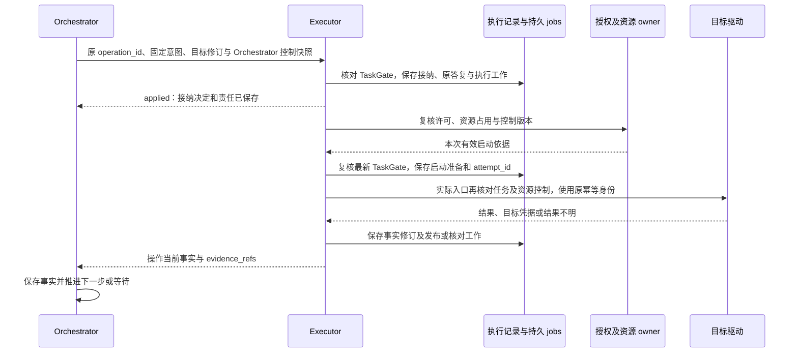
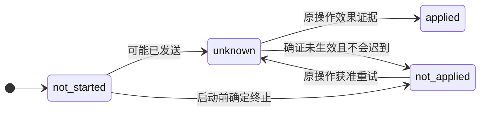
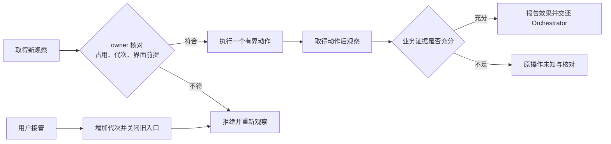

# 执行：准确调用、效果事实与设备控制

[模块与数据 UML](../uml-models.md#execution) · [可编辑 UML 图册](../diagrams/uml-models.drawio)

Executor 接收 Orchestrator 准入的操作，使用固定能力与实例绑定执行，持久保存实际事实及核对责任。本模块直接承担 C4，通过取证、恢复、授权和扩展参与 C3、C5–C8；独立替换和端云部署遵守 A1–A4。当前为设计规格，默认实现、1000 项 API 覆盖及 V2 模拟手机验收均待实现取证。

Orchestrator 保存“为什么要做”，Executor 保存“做到了哪一步、效果是什么”。能力目录描述行为契约，实例绑定确定谁以何种驱动访问哪个目标。任务完成由[任务运行](../orchestrator/README.md)裁决，身份和设备占用规则与[授权](../security/README.md)协作，本页是操作、能力和 GUI 字段的权威位置。

实现阅读：[模块形状与依赖](implementation.md#module-shape) → [框架接入](implementation.md#reliable-work-integration) → [原操作对象流转](implementation.md#data-flow) → [发送与核对时序](implementation.md#key-sequence) → [固定设备入口恢复](implementation.md#entrance-recovery) → [生产部署和容量](implementation.md#production)。本页保留行为主线，执行记录、发送门禁、能力装配、模拟设备及故障断点在实现篇查阅。

## 1. 默认选择与适用条件

| 选择 | 理由 | 主要代价与边界 |
| --- | --- | --- |
| API 优先，GUI 补充 | 准确参数、明确返回和目标侧查询更容易建立效果证据 | 没有适用 API 时使用 GUI；API 结果不明时不能直接换 GUI 重做 |
| 搜索候选后固定准确声明 | 大型目录不能全部进入模型上下文，关键词命中不足以判断参数及行为 | 多一次描述查询；少量固定工具可跳过搜索，仍需固定版本和绑定 |
| 按能力声明重复语义 | 网络故障不说明目标是否已经执行；不同工具不能共用“超时便重试” | 无目标幂等或核对能力的高影响动作会保留未知，工具接入者承担声明与验证成本 |
| 一个操作承载一个有界动作 | 取消、接管、授权与新观察能在动作之间生效 | 长 GUI 流程增加交接次数；目标自身原子的业务 API 可作为一个有界动作 |
| 资源 owner 负责启动互斥 | worker 租约结束不表示旧 worker 已停止，跨 Orchestrator 也不能各自认为持有设备 | 同设备串行；只有驱动证实独立资源域后才细化锁粒度 |
| 设备发送入口固定宿主 | OS 排他锁保证同机入口唯一，重启沿原记录核对动作 | 不能隔离旧发送者的资源不自动跨实例接管，恢复控制查询不等于恢复新动作吞吐 |

工具返回的业务文本不具有控制权限。可信驱动解析实际结果，Executor 校验结构并记录证据；模型对一张截图的判断可以作为评估，不能替代目标凭据。受信插件仍须遵守预算、授权及日志规则；任意原生不可信驱动只有通过平台隔离验收后才可启用，见[扩展](../extensions/README.md)。

执行器的效果核对、中途质量评估和 Orchestrator 的完成汇总按[任务验证](../orchestrator/verification.md)分别建模。质量评估复用普通 Operation，输入固定条件、规则、实现及准确候选，输出报告与原操作事实共同保存；此时 `effect=applied` 只证明已取得声明的评估结果，报告的条件 verdict 仍可以是 fail 或 unknown。Executor 保留原报告与核对责任，Orchestrator 负责条件记录、当前适用性和最终完成。

## 2. 一次执行的责任交接

执行入口与工作者使用[公共接纳及有界工作模板](../reliable-work.md)保存原命令、领取责任和条件回写；ExecutionStore、GateStore、FactStore 仍裁决操作接纳、实际入口与效果事实。Executor 和独立资源 owner 各自在自己的提交域接入逻辑 JobStore；公共层不把远程接纳变成跨库事务，也不按超时自动重试目标动作。槽键、处理器及完成／等待条件见[接入设计](implementation.md#reliable-work-integration)。

下图只表示操作执行和事实持久化。Orchestrator 与 Executor 同进程时可合并短事务；独立部署时双方保存后续工作，网络调用不进入数据库事务。

Executor 接纳时验证绑定可用、参数结构、目标范围和必要依赖，再保存记录和工作。真正启动前重新核对控制、许可、期限、资源占用及配置仍可使用；不能用接纳时的许可替代启动检查。单次许可消费与动作执行间存在外部提交缝隙时，按原使用身份查询消费结果，不能另取一份许可重发。

执行端先持久保存启动准备，再发起外部调用。若在两者之间崩溃且不能证明没有发送，按可能已发送处理；不得仅因没有完成记录便推定 `not_started`。每次受允许的实际发送有独立 `attempt_id`，目标幂等键和原操作身份保持固定。适配器的隐式重试必须禁用或完整暴露，不能绕过重复策略。

结果与需要继续的核对工作同事务保存。Orchestrator 通过查询取得最终事实，变化通知只是加速；接收通知、记录 `accepted`、保存 `applied` 回执分别表示传输或方法完成，都不等于外部效果成功。通知丢失后由 Orchestrator 的持久查询工作继续，Executor 的核对责任也不会因结果已发出而消失。

| 发起方 → 处理方 | 固定的交接对象 | 成功依据 | 失败后由谁继续 |
| --- | --- | --- | --- |
| Orchestrator → Executor | 原 operation、输入摘要、绑定与目标／控制修订 | 原操作接纳、回执和执行 job 持久保存；还未证明已行动 | Orchestrator 查原回执与操作；Executor 恢复原执行责任 |
| Executor → Grant／资源 owner | 原使用单元及资源控制代次 | 使用获准且资源入口仍接受该代次 | Executor 核对原使用；任一依据不明不启动 |
| Executor → 目标驱动 | 原幂等身份与准确目标 | 目标凭据或可绑定原操作的效果证据 | Executor 查询或观察原效果；无证据保留 unknown |
| Executor → Orchestrator | 单调事实修订、证据和累计费用 | Orchestrator 幂等保存事实及后续任务工作 | Orchestrator 的查询 job 修补遗漏；Executor 不因“已通知”清除核对责任 |
| Orchestrator → Executor／独立资源入口 | 当前 TaskGate 或原操作取消 | 实际入口已封闭旧资格，返回范围与在途清单 | Executor 保存转交并核对逐入口；Orchestrator 展示尚未确认的部分 |

这里 `applied` 回执确认的是方法决定，`Operation.effect=applied` 确认的是声明效果，两者不得共用一个成功布尔值。取消先到、控制乱序与效果丢失的完整规则紧接下文；交接表用于定位责任，不另定义恢复策略。

### 任务控制先于、晚于行动到达时

Executor 为每个 `(orchestrator_id, task_id)` 持久保存 `TaskGate`，记录 Orchestrator 最新已知的任务状态、控制和目标修订。它约束该任务在本执行端的所有操作，与设备占用的 `control_epoch` 分开；任务允许运行与设备允许被控制必须同时成立。

Orchestrator 通过 `execution.control` 传播控制，Invoke 也必须携带由 Orchestrator 认证的 `ControlSnapshot`。模型只能提出业务行动，不能自行签发或修改控制依据。快照绑定原 Orchestrator、任务与接收执行端，经已登记认证关系验证；重放到另一任务或执行端无效。没有控制记录时，任一种消息都可先初始化 gate，因此取消和暂停不必等第一条 Invoke 到达。

更新只接受更高 `control_revision`，同修订同内容去重，同修订不同 gate 内容冲突；更低修订只返回当前事实。`goal_revision` 不得倒退。任何终态不可恢复，尤其 `cancelled` 后即使收到更高修订的 active/running 快照也拒绝；Orchestrator 必须新建任务，不能以恢复命令复用取消身份。

控制接纳事务保存 gate、原命令回执和停止／唤醒／拒绝未启动操作的工作。TaskGate 的更新与启动准备通过同一持久门禁串行；实际驱动入口也在其发送门禁检查最新 gate。控制已到达但 worker 尚未消费队列时，不能继续凭缓存许可发送。动作已经交给不可撤回的外部入口，则列入在途集合，继续查询，不能把迟到控制当作未执行证据。

执行端内的启动事务及实际入口逐项检查：gate 为 active/running、操作目标修订匹配、该操作无取消墓碑、控制启动凭据尚有效、Grant 使用窗口与原 deadline 未过，以及资源代次、占用和 GUI 观察仍有效。检查必须同时成立，单独的工作租约、授权回执或资源占用不能替代其他条件。

| 收到的当前控制 | 已接纳但可证明未启动 | 已可能启动或效果未知 |
| --- | --- | --- |
| 同目标暂停 | 保留原输入与操作，`accepted + not_started`，等待原因指向 gate 修订 | 阻止下一次发送，已有动作尽力停止并核对；暂停不抹掉已有事实 |
| 同目标恢复 | 新鲜控制依据、有效许可和原期限均满足时唤醒同操作 | 只允许原操作声明的核对及恢复路径；不能重复未知副作用 |
| 目标修订 | 旧目标操作封闭，记录 `closed + not_applied`、`may_apply_later=false` 和 `stale_goal` | 保留原目标身份并核对；新目标不能把原动作改成未发生 |
| 任务终态或操作取消 | 封闭发送，记录确定未执行及原因 | 关闭后续发送，尽力停止，在途效果继续核对 |

`ControlSnapshot` 的有限 `start_before` 约束远端使用旧控制的窗口。暂停后恢复可由 Orchestrator 提交新控制快照；同一 gate 修订的刷新使用新的 `command_id`，仅在 Orchestrator 仍允许且主体、目标修订不变时签发新凭据。原命令重投或查询必须返回原窗口，不能续期。刷新不能改写 gate、延长原操作 deadline、Grant 的使用窗口或单次授权，也不能使 `closed` 操作重新发送。原 Invoke、业务参数、费用上限及操作身份均不变；原使用依据不足时，仅在获得新的合法启动依据后继续，否则保持明确阻塞。

Orchestrator 刚提交暂停而执行端仍未收到时，执行端可能在旧快照允许的有限窗口内开始动作。因此 Orchestrator 保存控制不等于全局停止；失联执行端明确显示未确认，并受原 `start_before` 限制。窗口按任务政策与部署上限取最小值，需向用户说明；同 owner 共库可共同提交以缩小窗口，不能将这项优化泛化为所有跨端即时停止保证。

`execution.control` 只有在持久记录并封闭本执行端旧入口后，才返回已执行的 `enforced_control_revision` 与在途清单。若设备 owner 有独立命令入口，Executor 保存转交责任，待该入口持久应用相同 gate 后才计入已执行；此前只报告 accepted 和逐入口待确认。已封闭表示不再由这些入口启动旧资格动作，不表示所有旧动作已停止。

`execution.cancel` 对未知 `operation_id` 也保存 `CancellationTombstone`，不能只回 `not_found`。随后迟到的 Invoke 命中该墓碑时被拒绝启动，并建立可查询的取消事实；墓碑不能被任务 resume 清除。若执行权威存储不可核对，返回提交未知，不能编造未启动结论。完整 gate、回执和取消记录至少保留至责任结清及查询窗口结束，之后可压缩为长期最小关闭索引；该索引不按 TTL 删除。未知操作取消时无法从未收到的 Invoke 推算期限，因此也必须保留禁止索引。完整记录已清理时返回 `gone`，不得重新初始化为可执行身份。

例如暂停修订 8 晚于恢复修订 9 到达：执行端保持修订 9，不把旧暂停重新施加；恢复 9 晚于取消 10 到达则保持取消。目标从 3 修订为 4 后，未启动的目标 3 操作确定终止；若目标 3 的写入已交给远端服务，worker 租约到期也只能继续核对该写入，不能宣称旧目标没有效果。

### 效果和重复恢复

操作的 `execution_state` 表示执行端发送过程，`effect` 表示目标效果，两者独立。`closed` 表示该操作不再发送目标动作，只允许查询、观察和收尾；仍可能存在已在目标排队的动作，因此必须结合 `may_apply_later`。超时、断连、取消请求和暂时查不到记录都不能证明未发生效果。

只读能力的 `applied` 表示已取得声明的读取结果；未知读取不产生未知业务副作用，可以在声明范围内重取或选择另一来源，不能据此声称旧结果已成功。客观完成仍须有当前任务要求的可用证据，未知计费另按预算结算。

图固定建模 `effect`，不是任务状态。`applied` 表示声明的效果曾实现，不保证资源永远不再变化；后续被用户改动应保存新的资源观察，不能删掉已经发生的事实。`not_applied → unknown` 仅适用于原操作仍可执行、未被取消或关闭重试的情况。

可信提供方后来上调原 Operation 费用时，执行 owner 保留原任务与操作身份，在保存更高累计用量的同一事务建立发往原 Orchestrator 的持久交回责任；`closed`、任务终态或旧结算 job 已完成均不取消这项责任。交回只唤醒原任务重新读取 Operation 账单，任务按准入时固定的唯一计费来源归并累计差额；同一收费在 Grant use 等投影出现不能再次计入预算。源 owner 收到原任务已持久接纳核对工作的 JobAck 后才结束交付，答复丢失沿原命令重投。

| `effect_class` | 结果丢失后的允许路径 | 禁止与调用方后续 |
| --- | --- | --- |
| `read_only` | 对声明无目标业务副作用的读取，可在授权、期限和剩余预算内有限重试；每次记录成本和实际内容版本 | “读接口”标签不足以保证无副作用；消耗额度仍计费。数据可能变化，调用方按实际版本重新判断 |
| `target_idempotent` | 先查询原操作；目标契约保证同键同意图最多产生一次效果且有效窗口未过时，才可原键重放 | 键作用域、保留期或原 payload 不明时不得重放；窗口到期转未知核对，不自动换键 |
| `non_repeatable` | 已确证 `not_applied` 且 `may_apply_later=false` 时才可在原操作内获准重试；否则只查询原凭据或做独立观察 | 不能因重试预算尚余而重复；无法核实则保持未知，Orchestrator 请求具体核对或失败/取消，并继续必要收尾 |

驱动在异常分类上先判定是否已跨发送边界，再判定有无目标凭据和查询能力，最后才应用重复策略。通用 `5xx`、网关超时或空响应不能自动归类为未执行。目标显式拒绝且保证不会后续生效，才可报告 `not_applied`；一个队列中暂时没有查到的记录不具备该保证。

对同一意图切换 API、GUI、执行端或驱动版本属于新行动。Orchestrator 必须先取得原操作已不可能追加效果的依据，或确认新动作在业务上不会重复原效果；原操作未知时不得把新操作当重试替身。补偿也属于新的、单独授权的行动，不能把删除或退款隐含在取消中。

### 核对不是无限忙等

Executor 采用有限次数、退避和绝对核对期限查询目标；参数由能力声明和任务期限共同取最小值。自动核对耗尽后保存未知、下次可检查条件及所需权限，停止主动高频查询。Orchestrator 可以等待外部恢复事件、请求用户提供具体目标凭据、授权一次只读核查，或以未解决效果失败/取消。任务终态不删除后续迟到结果和账务责任。

用户处置入口展示原操作、目标、发送时间、可能效果与已取得的证据。允许提交目标回执、触发获准查询、终止自动推进或接受任务失败；普通“我觉得做成了”不能直接将未知效果改为已确认。若目标系统无法提供可信证据，记录用户陈述及保证限制，仍保留原不确定事实。

## 3. API 绑定如何落到实际请求

能力接入同时验证目录解析、输出语义和实际重复行为。完整性、分页、筛选、观察时间及缺失字段在各能力的准确输出合同中说明，不能以结构合法代替结果正确；规则及接入反例见[返回范围与语义验收](implementation.md#output-coverage)。这份证据由原 Executor 保存，条件是否满足仍由 Orchestrator 判断。

参考实现从固定版本 OpenAPI 文档导入参数、请求体和响应结构，经接入者补齐业务效果、授权、幂等及核对声明后，生成能力和绑定。OpenAPI 能描述 HTTP 操作、参数、响应与安全方案；它不替本项目证明业务幂等或实际效果。导入基线固定为 [OpenAPI 3.1.1](https://spec.openapis.org/oas/v3.1.1.html)，这是本方案的兼容范围选择，不声称它是最新版本。

输入与输出使用 [JSON Schema 2020-12](https://json-schema.org/draft/2020-12/json-schema-validation) 的已声明验证词汇表；SDK 校验器和一致性测试固定相同方言。接入时对可选字段、空值、枚举、数值单位、日期和分页进行明确映射，不能让模型自行发明 HTTP 编码。接入者必须补足 OpenAPI 未表达或目标实现偏离的约束。

绑定保存准确服务地址、HTTP 方法、路径及参数编码、认证引用、响应选择器、超时和可访问网络范围。模型只提供能力业务参数，不能任意替换服务地址、认证头或驱动代码。密钥在执行位置由受信凭据入口注入；不会作为目录内容或模型参数返回。重定向后的目标同样核对网络范围，下载按大小、类型和用途限额处理。

驱动 SDK 的 `invoke` 接收原操作、单次尝试、固定参数与启动依据，返回结构化事实；`query` 只核对原目标关联键或收据；`cancel` 尽力停止并报告能否证明不再生效。查询和取消支持程度来自准确声明，不支持时显式返回缺口。驱动把目标凭据映射为效果的逻辑属于受信、版本化实现，必须用真实目标或有状态模拟目标验证；Schema 通过或模型说“完成”均不是映射正确的证明。

响应先区分传输失败、业务拒绝与效果凭据，再校验输出。分页、轮询或大文件下载只能在声明的有限工作范围内执行，每次物理请求可计量；它们不隐含新的业务动作。搜索和抓取返回实际 `content_ref`、来源 URL、获取时间、返回版本及截断/失败说明，供 V1 在正文上取证；搜索命中不等于已获取来源全文。

能力更新产生新版本，绑定更新产生新修订。已接纳操作固定原版本；停用安全缺陷驱动可以阻止其继续启动，同时保留只读核对所需的受限实现。若原版本已无法安全核对，显式报告缺口，不静默迁移到语义不同的新版本。激活、停用和保留依据见[扩展](../extensions/README.md)。

### 3.1 默认受管文件能力

首阶段文件读写只开放按租户登记、由单一受信文件 owner 管理的受控根。OS 权限或隔离须排除其他进程写入及根内外硬链接别名；已有目标的链接数不能证明唯一时拒绝受管写入。绑定固定根、能力版本和允许的相对路径规则；原操作固定规范化目标路径、预期文件版本、输入 ContentRef 与摘要。驱动在实际读取或替换时从受控根句柄逐段解析并复核同一资源，不接受绝对路径、`..` 或越界符号链接；平台无法提供经验证的句柄相对解析时，该路径不可执行。原内容向文件驱动披露、文件读取与写入各按当前用途取得 Grant，文件已存在不能代替许可。

写入先在目标目录建立绑定原 operation_id 的临时文件，完整写入并持久化字节与摘要。文件 owner 跨 Executor 副本持久占用同一路径；在同一入口锁内比较预期版本、重新核验启动门禁并原子替换目标，随后持久化目录与原操作的结果依据。单独的 `rename` 不提供版本比较；另一动作不能在原写入可能迟到时覆盖它。答复丢失时先查原写入日志、目标版本和摘要；仅当受控根能排除其他写者、原发送者已隔离且这些证据可唯一关联原操作，才报告 `applied` 或确定未执行。否则保持 `unknown`，不换临时文件或新 operation_id 悄悄重写。普通用户目录、网络盘或不能证明独占、原子替换和持久化的目标须由独立驱动声明较弱保证，不能继承受管文件保证。

## 4. GUI：每动作观察与用户接管

GUI 动作使用设备 owner 发出的观察，绑定设备、界面修订、控制代次和有效时间。观察同时提供截图与可得的结构信息、焦点和可操作区域；未取得的结构信息必须标记缺失。能力声明坐标系、方向、输入方式及动作上限，大脑不能把另一分辨率或旧页面坐标直接用于当前设备。

一个 `gui.act` 只包含点击、滑动、输入或返回中的一个有界动作。设备 owner 在实际入口核对占用者、控制代次及观察前提，再提交动作；动作后总要获得新观察，Orchestrator 根据该观察与业务证据决定下一步。后观察是该能力声明的只读验证步骤，使用独立费用计量；未获读取权限时拒绝启动要求后观察的动作。

同一 GUI 资源域一次只开放一个尚可能改变界面的自动动作。动作答复丢失或 `may_apply_later` 未排除时，可以沿原操作查询、取得获准的新观察及让本人接管，但不能让同一持有者凭新观察继续点击，也不能因占用仍有效就启动下一动作。资源 owner 只有取得原动作已结束且不会再迟到改变界面的可信依据，才解除该资源域的在途隔离；无法核清时保持自动执行等待。驱动若证明两个资源域互不影响，才可分别开放。

默认有状态模拟器能在同一串行入口比较界面修订并执行动作，提供动作日志及确定变化。真实平台若不支持原子比较，只能声明较弱的界面前提保证：驱动在发送前尽可能重新观察，不能把该模式写成“绝不误点”。高影响动作需要目标确认或政策规定的用户确认；其支持范围必须另行验收。

设备 owner 保存 `control_epoch` 与当前 `ResourceLease`，后者只表示设备占用，与[授权离线租约](../security/README.md#offline) `OfflineLease` 分开。占用到期后立即封闭旧启动入口，但在原动作可能继续执行时不自动把设备交给第二个自动执行者。owner 重启先恢复原动作与代次；不能核实旧命令已结束时维持自动执行隔离，仍允许本人查看和接管。

用户接管时先增加代次并关闭旧命令入口，再确认接管；旧代次命令即使在网络中迟到也被拒绝。接管绕过自动任务队列，不等待它们清空。已跨过物理发送边界的动作可能仍生效，接管回执明确列出这类操作，不承诺撤回。恢复自动执行必须经过用户交还、核清仍可能迟到的旧动作、重新获取占用和全新观察，不能续用接管前的坐标或观察。

例如用户要求在模拟手机添加一个提醒：观察列表，打开新增页，输入内容，点击保存，每个动作分别记录。保存后查询到目标提醒标识才确认创建。反例是点击“保存”后连接中断，重连后看见编辑页仍在，就再点一次；页面未跳转不能排除第一次已经创建。应先查原动作日志或查询匹配提醒；没有唯一关联证据便保持未知，不能悄悄生成第二条。

## 5. 契约查阅

共同方法信封、修订比较、认证及错误见[共同契约](../contracts/README.md)。方法成功均指本方法业务提交，不能推导任务成功；以下字段未标可选即必需。所有查询按当前主体过滤，目录可见不等于获准调用。

| 方法 | 输入与输出 | 持久成功及失败后的继续者 |
| --- | --- | --- |
| `capability.search` | `query, resource_scope?, cursor?, limit` → 候选引用及下一游标 | 只读、有限分页；Brain 经 Orchestrator 获取，失败不影响已有准确版本的可用性 |
| `capability.describe` | 准确能力及绑定引用 → `Capability, Binding` | 返回固定版本及当前可用性；不存在或停用时 Orchestrator 重新选择，不能猜契约 |
| `execution.invoke` | `Invoke` → `Operation` | Receipt 为 `applied` 时，Operation 的 `execution_state=accepted` 表示操作、原答复与工作已保存；答复丢失查原操作，同键异意图冲突 |
| `execution.get` | `operation_id` → `Operation` | 当前事实；暂时不可达保持查询责任。`not_found` 后原键重投不等于新建目标动作 |
| `execution.list` | owner_id、query_id、limit、cursor? → 当前获准 Operation 集合页 | 按 execution.get 的当前披露资格冻结有限成员；含终态，partial／gaps 不表示完整；[分页与订阅恢复](../contracts/protocol.md#collection-snapshots) |
| `execution.control` | `ControlSnapshot` → `ControlReceipt` | 先持久接纳 gate 与传播责任；所有受控入口落实后才确认 enforced 修订；丢答复由 Orchestrator 查询或重投原控制命令 |
| `execution.control.get` | `orchestrator_id, task_id` → `ControlReceipt` | 返回当前已知和已执行修订、逐入口缺口及在途集合；Orchestrator 保留工作直至确认，不以操作查询代替任务控制确认 |
| `execution.reconcile` | `operation_id, evidence_refs?, query_budget_ref` → `Operation` | 接纳一次有限核对责任；证据需验证，Executor 更新原事实，Orchestrator 查询至可决策状态 |
| `execution.cancel` | `orchestrator_id, task_id, operation_id, reason` → `Operation` 或 `CancellationTombstone` | 保存禁止新发送及尽力停止责任；未知操作先存墓碑，迟到 Invoke 不能启动；在途效果继续核对，不隐含补偿 |
| `resource.acquire` / `resource.renew` / `resource.get` | 资源、获准持有者与实例、有限期限；占用及期望修订；资源 ID → `ResourceLease` 或当前占用 | owner 原子分配或延长，冲突返回设备忙；过期或被接管的占用不能续期；答复丢失先查原命令 |
| `resource.observe` | `{resource_id, invoke}`，Invoke 固定 `gui.observe` → `{operation, observation?}` | `execution.invoke` 的便利绑定，复用操作、权限、预算及查询恢复；applied 接纳读取责任，只有实际读取成功才有 Observation |
| `resource.takeover` | `resource_id, reason` → 新代次及在途操作集合 | owner 持久增加代次并关闭旧入口后确认；调用方仍查看在途未知效果 |
| `resource.release` | `resource_id, expected_control_epoch` → 当前占用事实 | 当前持有者交还；旧代次冲突不能覆盖新持有者；重新自动执行需新占用 |

| `Capability` 字段 | 定义与约束 |
| --- | --- |
| `capability_id, version, digest, semantic_operation_id, description` | 固定行为契约；描述含适用范围、前提和副作用，版本不可原地改义 |
| `input_schema, output_schema` | 带方言的完整参数与输出定义；外部 Schema 引用随版本固定并在激活前解析 |
| `effect_class` | `read_only / target_idempotent / non_repeatable`，按第 2 节决定可重复路径 |
| `verification` | 效果谓词、证据类型、原操作查询方式、`may_apply_later=false` 的可接受依据；缺失项明确标为不可证明 |
| `retry` | `max_attempts, initial_backoff_ms, max_backoff_ms, reconciliation_timeout_ms`；幂等类另含 `key_scope, key_retention_ms, replay_guarantee_ref` |
| `authorization` | 所需资源、动作、用途、是否需设备占用或额外确认；不包含可被模型直接使用的密钥 |
| `limits` | 最大时长、输入输出大小、物理请求数、`cost_bound` 与 `max_cost`、资源互斥域；estimate 的 max_cost 是预留估算值，不是费用上界 |

| `Binding` 字段 | 定义与约束 |
| --- | --- |
| `binding_id, revision, capability_ref, executor_id` | 精确契约与承载实例；Orchestrator 按固定组合准入 |
| `target_ref, driver_ref, configuration_ref` | 固定逻辑目标、驱动版本与配置版本；敏感配置只在执行端可读 |
| `availability` | `ready / offline / disabled`，仅是候选条件，不能代替启动时复核 |

| `Invoke` 与 `Operation` 字段 | 定义与约束 |
| --- | --- |
| `Invoke.operation_id, task_id, orchestrator_id` | Orchestrator 固定身份；同一操作不能换用户、意图或执行端 |
| `Invoke.goal_revision, control_snapshot` | 准入时固定目标修订及 Orchestrator 认证的初始 `ControlSnapshot`；不得由模型填充；当前 gate 的更高修订优先 |
| `Invoke.capability_ref, binding_ref, arguments, intent_hash` | 固定能力、绑定和规范化输入摘要；参数全文或内容引用由授权规则决定 |
| `Invoke.authorization_refs, reservation_ref, deadline` | 本次许可依据、执行费用预留和最后允许启动时间；执行端不能自行放宽 |
| `Invoke.gui_precondition?` | GUI 动作必需的 `observation_id, control_epoch, lease_ref, max_age_ms`，外加声明的页面或焦点条件 |
| `Operation.operation_id, revision, execution_state` | `execution_state=accepted / started / closed`；`closed` 不表示外部目标已结束 |
| `Operation.effect, may_apply_later` | `effect=not_started / applied / not_applied / unknown`；`may_apply_later=true / false / unknown`，否定值须证据支持 |
| `Operation.attempts, target_receipt_ref?, evidence_refs` | 物理尝试身份、时间、目标关联键、结果或错误；证据与内容版本绑定，不能以日志字符串代替目标凭据 |
| `Operation.result_ref?, usage, usage_final, next_action` | 输出、累计用量及正常计费是否最终；可信迟到上调仍追加原操作用量修订，不重开动作。`next_action` 说明等待查询、补权限、补证或可结束的具体条件 |

| 任务控制对象 | 权威字段与约束 |
| --- | --- |
| `TaskGate` | `orchestrator_id, task_id, control_revision, goal_revision, status, control`；状态及控制枚举复用[Task](../orchestrator/README.md#records)，其中 control 是 Orchestrator 合并自身与祖先限制后的有效控制；身份固定，修订单调，终态不可逆 |
| `ControlSnapshot` | `gate: TaskGate, executor_id, issued_at, start_before, orchestrator_proof`；Orchestrator 认证当前内容并限定启动窗口；同修订刷新仅替换有效时间凭据，不能改变 gate |
| `ControlReceipt` | `gate, enforced_control_revision, entrances[{entrance_id, enforced_control_revision, gap?}], inflight_operation_ids, observed_at`；enforced 取所有受控入口共同落实的修订，缺入口确认时不得报告全端生效 |
| `CancellationTombstone` | `orchestrator_id, task_id, operation_id, cancel_command_id, cancelled_at`；由认证 Orchestrator 或具备本人管理权的入口签发，禁止该操作启动且不能恢复；未知原意图不补造业务参数 |

`authorization_refs` 使用类型化的 Grant、UseReceipt 或 OfflineLease 引用；其字段与使用规则仅在[授权](../security/README.md)定义。`ResourceLease` 字段为 `lease_id, revision, resource_owner_id, resource_id, holder_id, instance_id, control_epoch, expires_at, state`，`state=active / released / revoked`，到期按时间另行判定。占用本身不授予观察或行动权限，启动还须有效使用依据。

| `Observation` 字段 | 定义与约束 |
| --- | --- |
| `observation_id, resource_id, control_epoch, captured_at, expires_at` | owner 签发或经认证返回的观察身份及适用窗口 |
| `ui_revision, screenshot_ref, structure_ref?, focus, viewport` | 实际界面修订、图像、可得结构、焦点和坐标定义；真实平台不支持强修订时明确标为弱观察 |
| `precondition_strength` | `atomic / best_effort`；默认模拟器须提供 `atomic`，不同保证分别验收 |

参数、权限、观察过期、设备忙与版本不符等启动前拒绝必须返回 `not_started` 事实及对应错误；只有执行记录能确定从未跨发送边界时才允许这样返回。接纳后的超时返回原操作未知或已有证据，不能退回普通“失败，可重试”的无身份错误。

## 6. 部署、恢复与验收

本地执行器与 Orchestrator 可共用数据库和内容库，远端执行器保存自身记录及有限保留的原命令答复。完整幂等记录覆盖责任及查询窗口，最小关闭／禁止索引长期保留；完整内容已清理的身份返回 `gone`，不能当作新请求执行。设备在 NAT 后主动拉取绑定给自己的有界命令；断连时不把同一操作重新分配给另一设备。

调度按用户、目标服务和资源域分别设置队列、并发、请求速率与存储限额。达到上限在接纳前返回可重试过载，已经接纳的责任仍持久保留；查询、取消、接管和结果收集保留容量。API 请求进程槽与目标业务是否终结分别管理，不能因连接关闭便释放业务互斥。隔离资源占用的释放依据由 owner 保存。

| 用例 | 故障或刺激 | 必须观察到的结果 | 对应目标 |
| --- | --- | --- | --- |
| E-01 准确 API | 同名不同版本能力、可选参数、分页及业务拒绝 | 固定正确版本与编码；真实请求和结果可关联，拒绝不误报成功 | C4、C6 |
| E-02 三类重复 | 分别在三类目标生效后丢失答复 | 读取有限重试；幂等原键不重复效果；不可重复类只核对，不换工具重做 | C4、C5 |
| E-03 准备后崩溃 | 保存启动准备后、发送边界附近逐点崩溃 | 不能证明未发送时按未知处理；worker 重启不自行产生第二效果 | C5、C8 |
| E-04 旧 worker | 占用过期、旧 worker 恢复，并发从另一 Orchestrator 发起 | owner 只允许当前占用和代次启动；无法撤回的在途操作明确列出 | C5、C7 |
| E-05 GUI 全链路 | 多台有状态模拟手机上点击、滑动、输入、返回、掉线与接管 | 每动作前后可观察状态变化；旧观察和旧代次拒绝；保存不明先核对 | C4、C7、V2 |
| E-06 取消与撤权 | 动作已发出后取消或撤权，再收到成功 | 未启动工作被阻止；迟到事实保留，任务不重开；核查另受当前权限约束 | C5、C7 |
| E-07 取证真实性 | 抓取失败、重定向、正文截断或搜索片段误导 | 实际内容、来源与限制齐备，授权外目的地不读取，未取得全文不声称已取得 | C3、C7、V1 |
| E-08 替换与过载 | 本地/远程执行器替换，通知丢失、队列达到限额 | 契约、查询恢复和既有责任成立，取消与查询仍可用 | A1–A4、C5 |
| E-09 控制先到 | 先取消未知操作或整项任务，再送达原 Invoke | 墓碑或终态 gate 已持久；不启动，原查询返回固定禁止事实；重启后仍成立 | C5、C7 |
| E-10 控制乱序 | pause 8、resume 9 反序到达，随后 cancel 10 与旧 resume 竞争 | 最高有效修订生效；取消不可恢复，逐入口 enforced 与在途事实可查 | C5、C7 |
| E-11 目标变更与失联 | 部分动作尚未启动、部分已发出时修订目标；控制传播中断 | 旧目标未启动动作确定拒绝，已发出动作继续核对；旧快照最多在已声明窗口内启动，不虚报全局停止 | C5、C7 |
| E-12 GUI 未知效果阻塞 | 同一持有者的保存动作越过入口后丢答复，期间取得新截图并要求下一次点击 | 新截图不解除原在途隔离；只允许原效果核对、只读观察及本人接管，确认无迟到可能后才能继续自动动作 | C4、C5、V2 |
| E-13 受管文件写恢复 | 在临时文件落盘、原子替换前后分别断电，随后重投原操作；同时尝试路径替换和另一写者竞争 | 只在原版本／摘要与独占证据齐备时确认或安全继续；越界路径拒绝、未知写入不重复 | C4、C5、C7 |
| E-14 终态操作账单上调 | Operation 和 Task 均终态，原结算 job 已完成；可信费用更正后丢交回答复并重启 | 原操作费用与固定交回责任同事务保存，重投到原 Task 的 JobAck；Task 主动读原账并只记差额，Grant use 同笔投影不双扣 | C5、C7 |

以上验收需运行实现与可核对目标状态。[全局验证](../validation/README.md)定义覆盖、90% 首次正确率和 95% 有限重试成功率的计分方法；本页机制不能直接证明这些数字，也不把模拟手机结果外推为真实平台支持。
