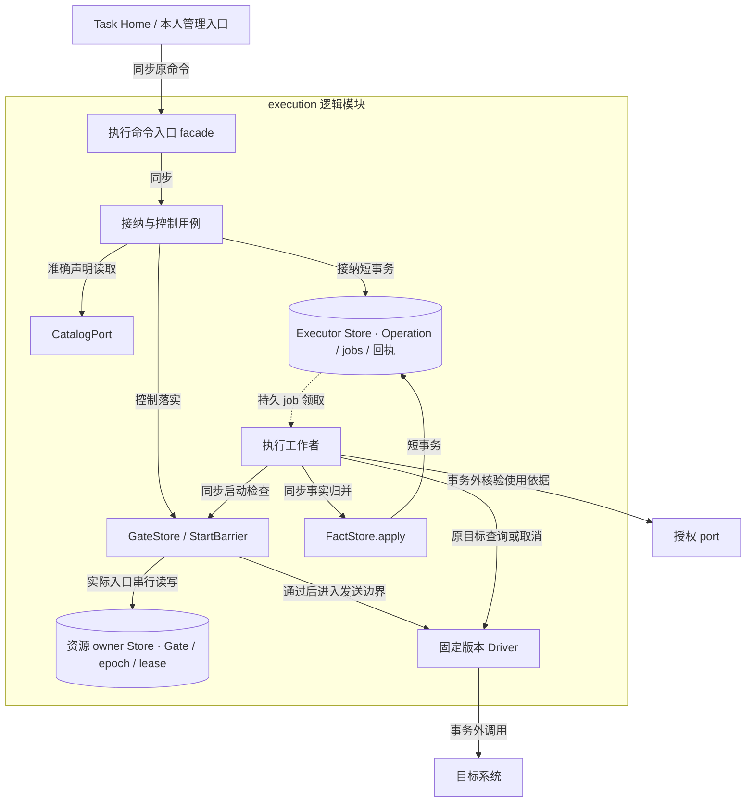
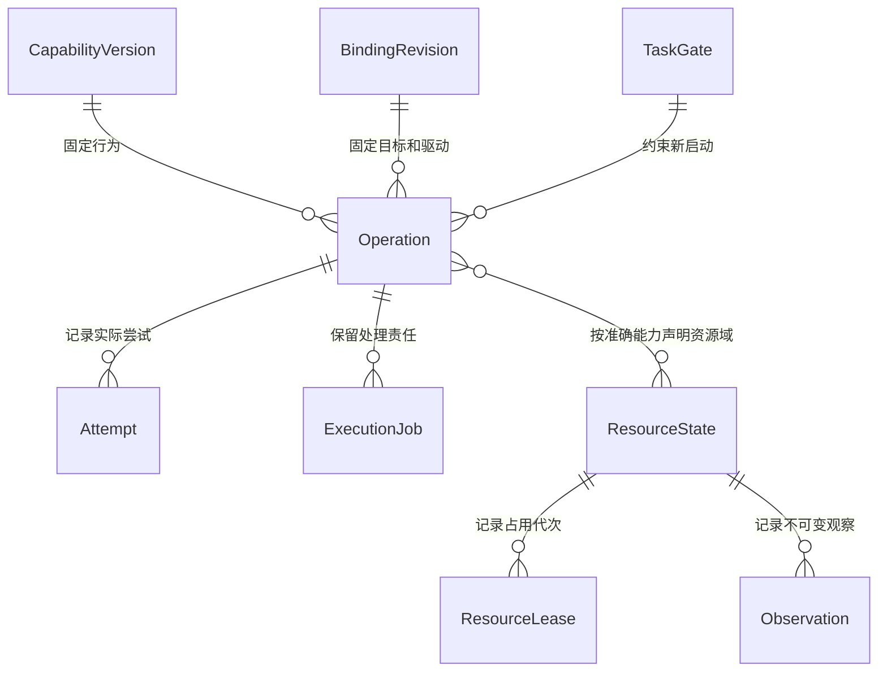
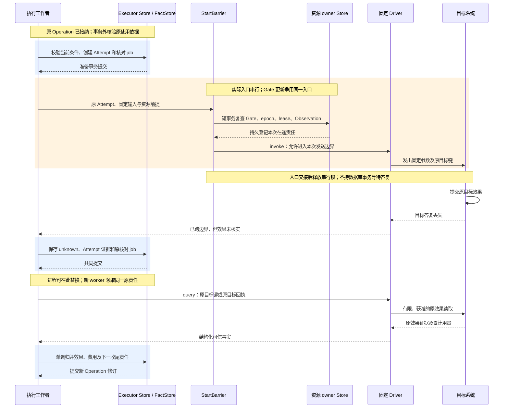

# 执行实现：原操作、发送门禁和资源 owner

[模块主线](README.md) · [任务实现](../task-runtime/implementation.md) · [授权实现](../security/implementation.md) · [线协议](../contracts/protocol.md)

本页将执行主线落为参考实现。Executor 接纳一项原操作，资源 owner 裁决实际入口，驱动提供目标效果证据。三个职责可共进程，但外部副作用总在业务提交之后；网络成功和 Receipt.applied 都不代替 Operation.effect。

参考实现支持声明完整的 API 驱动、版本化文件能力和有状态模拟手机。真实手机或任意原生不可信驱动需要各自的平台验收；缺少可验证入口、效果核对或必要权限时，按能力合同拒绝或保留未知，不能从模拟器保证推断真实平台保证。

<a id="module-shape"></a>
## 1. 模块形状与内部接口

执行模块对外 facade 是执行命令入口，承接执行、控制、目录和资源方法；内部按接纳／控制用例、执行工作者、门禁与效果规则、Store／port／Driver 适配组织。下述接口名是参考实现的职责，不是已经实现的类。宿主注入存储、授权 port 和固定版本 Driver；WSS／gRPC 处理器与具体驱动不能绕过门禁直接更新效果。



图中实线为同步调用或读写，虚线为持久 job 驱动。Executor Store 与资源 owner Store 是写权边界；默认可共库，分开部署时通过原命令和确认交接，不共同提交。资源 owner 的 StartBarrier 是最后一个可拒绝旧资格的入口；目标已经接受的动作进入在途集合，此时收到取消不能报告未执行。

| 内部接口 | 固定输入 | 输出及限制 |
| --- | --- | --- |
| 执行命令入口／接纳与控制用例 | 认证主体、固定原命令、当前容量 | 路由到所属用例与原回执；不在请求栈等待目标动作完成 |
| 执行工作者 | 原 operation、工作种类和领取代次 | 调用原使用核验、启动／查询／取消与事实归并；不自创替代 operation |
| CatalogPort.describe | capability_ref、binding_ref | 完整准确声明与当前可用性；不替调用授权 |
| ExecutionStore.accept | 原 Invoke、认证 Home、规范化摘要 | 原 Operation 与接纳 Receipt，或固定拒绝 |
| GateStore.apply | 认证 ControlSnapshot | 最新 gate、逐入口执行修订及在途清单 |
| StartBarrier.enter | operation、attempt、TaskGate、使用依据、资源前提 | 允许进入不可撤回发送边界，或明确启动前拒绝 |
| Driver.invoke | 固定输入、attempt_id、原目标幂等键 | 目标凭据、结构化输出、已跨发送边界标记 |
| Driver.query | 原目标键／收据、有限查询权限 | 原效果证据或仍未知；不新建业务动作 |
| Driver.cancel | 原目标关联 | 尽力停止事实及能否证明不再生效 |
| FactStore.apply | 原 operation、单调修订、证据及累计用量 | 原事实与下一核对责任共同提交 |

驱动在加载时固定版本和配置摘要。运行时不会把模型生成的 URL、请求头或任意驱动名称注入这些接口；模型只提供准确能力的业务参数。

ExecutionStore.accept 封装接纳的条件事务，GateStore.apply 封装控制单调合并，FactStore.apply 封装效果和费用规则后提交；它们共用宿主事务接口而不开放任意表写权限。Store 适配器处理数据库语句，Driver 处理目标协议，领域规则只依赖它们的固定输入、证据与错误。资源 owner 和执行工作者可在同一进程，是否跨网络由资源所属位置决定，不按内部接口数量拆服务。

## 2. 持久记录和并发边界

| 记录 | 必要数据 | 并发及保留约束 |
| --- | --- | --- |
| capabilities | 行为版本、摘要、完整 Schema、授权、效果与重复合同 | 版本不可原地改义；被原操作引用时保留 |
| bindings | capability_ref、目标、driver_ref、configuration_ref、availability | binding_id 与 revision 固定，停用另有当前指针 |
| operations | 原 Invoke、摘要、发送状态、效果、可能迟到、费用 | `(tenant, operation_id)` 唯一，意图不可替换 |
| attempts | operation、attempt_id、准备时间、发送边界、目标键和结果 | 每次实际发送独立行，原业务幂等键不变 |
| task_gates | Home、task、最高控制修订、有效控制、终态标记 | 与发送准备及实际入口串行检查 |
| gate_entrances | gate、入口、已落实修订、未决原因 | 全端 enforced 取全部必要入口的最低已落实修订 |
| operation_cancellations | Home、task、operation、原取消命令、关闭原因 | 未见 Invoke 也写入；不按 TTL 删除 |
| resource_states | resource、owner、control_epoch、人工控制、当前 lease | owner 唯一写者，设备动作串行 |
| resource_leases | lease_id、持有者及实例、epoch、修订、期限、state | 原 lease 不能换主体；过期不自动证明旧动作结束 |
| observations | 原 observation、epoch、界面修订、期限、准确截图引用 | 不可变；动作验证读取同一版本 |
| target_correlations | operation、目标关联键、可信回执引用 | 不以相似截图或自然语言描述替代唯一关联 |
| execution_jobs | 原业务对象、类别、领取代次、due_at、有限次数 | 查询、控制及效果归并有独立容量 |
| closed_identities | 原操作／任务身份、最小摘要、关闭修订 | 长期禁止再初始化，不保存正文 |

执行存储将同一任务 gate 与发送准备放入一致事务边界。共享资源入口另锁 resource_state；多个资源按规范化 resource_id 排序，不能由模型指定加锁顺序。执行工作者不在数据库事务内等待远端授权或网络答复。

资源 owner 为一个资源维护串行发送入口。门禁内读取最新本地 gate、epoch、占用和观察；只有仍满足全部条件，才把本次动作交给驱动的不可撤回入口。控制更新使用同一入口锁，所以“控制已到达但工作队列尚未消费”不会留下继续启动窗口。

独立 owner 部署时，Executor 保存转交控制 job。只有 owner 确认实际入口已应用 gate，才将该入口计入 enforced；代理收到消息、入队和写入 Executor 本地 gate 都不足以确认远端门禁生效。

<a id="data-flow"></a>
### 2.1 原操作与实际尝试的对象流转

Operation 保存不可变意图和当前执行事实，Attempt 保存一次实际发送的准备及目标关联。Capability／Binding 版本决定如何解释原输入，TaskGate 和资源记录则是每次启动必须重新检查的当前控制。后两者不能被冻结为 Operation 接纳时的一次性许可。



图为持久关联：一个资源可被多个历史操作引用，不表示可以并发使用；只有需要该资源的能力建立关系。Attempt 每次发送独立，目标业务幂等键始终属于原 Operation。Observation 的截图正文在内容负责方保存，执行记录只保留准确引用及验证前提。

| 阶段 | 创建、持久化与传递 | 消费与清理依据 |
| --- | --- | --- |
| 接纳 | 接纳用例固定 Capability／Binding 与原 Invoke，事务写 Operation、原 Receipt 和 ExecutionJob | Home 取得的是执行责任；目录更新不改原意图和绑定 |
| 准备 | 执行工作者取原授权使用依据，准备事务新增 Attempt、目标关联和核对责任 | StartBarrier 使用最新 Gate、epoch、lease 和 Observation 检查本次入口；领取过期不撤销已准备 Attempt |
| 发送 | 固定 Driver 获得原参数、Attempt 和目标键，向目标传递一次声明允许的请求 | 目标回执及边界证据返回工作者；丢答复仍保留原目标关联，不另造操作 |
| 核对归并 | Driver.query／cancel 返回原效果与停止事实；FactStore.apply 提交单调效果、累计用量和下一 Job | Home 读取原 Operation 并归并；通知只唤醒查询，不能代替权威事实 |
| 关闭及清理 | 效果已核清且迟到可能消除后关闭原责任；内容按引用和用途保留 | 清理完整 Attempt／日志前保留必要证据；取消、终态 Gate 和原身份最小禁止索引长期留存 |

执行结果正文与 Observation 都可能比操作元数据大得多，先以不可变内容保存再提交引用。写内容失败不能提交一项带可读取证据的 applied 效果；目标本已写成时效果依据与内容缺口分别记录，不能因截图或附件丢失抹掉真实副作用。

## 3. 从接纳到可能已经发送

接纳事务验证认证 Home、目标、准确绑定和参数，查询原 operation 及长期取消索引，然后合并不倒退的 TaskGate。新的 active gate 不能覆盖已保存的终态索引。

| 当前输入 | 接纳结果 |
| --- | --- |
| 原 operation、完全相同意图 | 返回原 Operation；新的 command 不能建立第二份执行责任 |
| 原 operation、不同意图或执行端 | idempotency_conflict，不覆盖原记录 |
| 取消墓碑命中 | 返回固定禁止事实；不建立可发送工作 |
| 终态 TaskGate 或旧目标 | 拒绝启动，保存可查原因 |
| 有效意图且容量足够 | 操作、原回执和执行 job 共同提交 |
| 存储结果无法确定 | 不伪造 accepted／not_started；调用方查原身份 |

`execution.invoke` 的 Receipt.stage 为 applied 时，只表示 Operation.execution_state=accepted 的接纳事实已持久保存。接纳之后实际开始也可立即反映在返回快照，但不能把传输 Receipt.accepted 和执行状态 accepted 混作同一个枚举。

### 3.1 启动准备

执行工作者在事务外取得原 use_id 的授权依据，然后进入启动准备事务。检查：任务 active/running、原目标修订、无取消索引、控制 start_before、原 deadline、使用窗口、绑定可用性、资源占用及观察条件。任何一项不满足都不能发送。

满足条件后新增 attempt_id，保存本次准备、目标关联及核对责任，再提交。接着进入资源 owner 的实际发送门禁，重新检查最新 gate 和资源条件。

```text
run_original(operation):
  load immutable intent and original target key
  obtain or query the exact bounded authorization use
  persist start preparation and attempt_id under latest task gate
  enter resource owner send barrier
  recheck latest gate, epoch, lease, observation and all time bounds
  if barrier refuses: persist provable not-started outcome
  else: call pinned driver with original key and this attempt_id
  persist target facts and usage together with next recovery work
```

准备后崩溃、门禁放行后答复丢失、驱动无法证明是否跨发送边界，都按可能已发送处理。不能因 attempts 表没有完成时间就改为 not_started。过期工作领取可重领，但新工作者只处理同一 operation 与目标键。

驱动自行重试必须关闭，或把每次物理请求完整暴露为计费与重复检查的一部分。调用库的默认重试配置不是业务幂等证明。

<a id="key-sequence"></a>
### 3.2 发送入口与丢答复核对时序

下图展开一次目标写入，固定 Driver 支持原目标键查询。蓝色区是本地数据库事务；橙色区是资源 owner 的发送临界区，其锁与控制落实共用，不能误作跨目标网络事务。



若控制在橙色临界区之前落实，StartBarrier 拒绝本次启动；之后落实则将该 Attempt 视为在途，只关闭后续发送并继续核对。独立 owner 的入站命令和在途责任也须持久化，Executor 失联不能让它丢掉已交接动作。图中两个 Store 不构成共同事务。

目标缺少原键查询时，恢复严格采用固定能力声明的替代证据；没有可信证据则持续 unknown，不能补一条模拟成功结果。准备事务或归并事务丢提交答复时先读原 Attempt／Operation 修订；不因工作者未看到 commit 成功而重新发送。

## 4. 效果归并及重试算法

Operation 的发送状态和效果独立。发送关闭后，effects 仍可能 unknown 或 may_apply_later=true。下表给出事实合并的允许边界；完整状态含义仍归[主线](README.md)。

| 已知事实 | 新输入 | 归并结果 |
| --- | --- | --- |
| not_started | 跨发送边界证据或无法判定发送 | unknown；保存原尝试 |
| unknown | 能绑定原操作的目标效果凭据 | applied，保存证据版本 |
| unknown | 确证未生效且不会迟到 | not_applied，may_apply_later=false |
| applied | 后续资源被用户修改 | 保留历史 applied；另存新资源观察 |
| closed | 建议重新发送目标动作 | 拒绝；允许原效果查询与必要收尾 |
| 任意状态 | 较旧事实修订 | 不覆盖当前投影，保留可审计引用 |

发生失败时先判断发送边界，再检查目标凭据和查询能力，最后应用效果类型的重复策略。不能根据 HTTP 5xx、连接超时或“当前未查到”跳过前两步。

只读能力在剩余授权、期限和预算内有限重取。目标幂等能力先查原键，只有固定键作用域、保留期、相同参数和回放保证仍成立时才原键重放。不可重复能力只有明确 not_applied 且不会迟到时，才允许仍开放的原操作获准重试。

同一意图换 API、GUI、驱动或执行端都属于新行动。Home 必须取得不会重复原效果的依据；Executor 不能自行把 unknown 转移给另一设备。补偿也有新的操作、预算和授权，不隐藏在 cancel 内。

核对 job 每次执行一个有界查询，按能力声明退避，受绝对核对期限和专属预算约束。耗尽自动额度后保留原不确定事实，等待可读目标凭据、恢复事件或受信的一次核查；停止自动高频查询不删除迟到事实入口。

## 5. TaskGate、控制刷新和长期禁止索引

Gate 只接受更高 control_revision；同修订同内容幂等，同修订异内容冲突。目标修订不可倒退，终态身份不可恢复。较低控制返回当前事实，不把旧 pause 重新施加到新 resume 上。

同 gate 修订的新控制凭据可以更新 issued_at／start_before，但不能改 gate、原 Invoke、操作 deadline 或授权使用。原 command 重投必须返回原窗口；需要刷新时 Home 建立独立固定命令。

整端 ControlReceipt 的 entrances 是当前受控入口集合。安装新入口前先落实当前 gate；未完成时不可接目标工作。移除入口前证明它已封闭且不会继续发送，再从集合移除，不能靠删行抬高 enforced。

### 5.1 取消先到与清理

未知 operation 的取消必须创建最小禁止索引。此时执行端没有原 Invoke，不能推算其最晚启动或重投时间；禁止索引不得按固定 TTL 删除，也不能被 task.resume 清除。

完整取消记录与正文按策略清理后，最小索引仍保留原 Home、task、operation、关闭依据和必要摘要。迟到 Invoke 命中后返回 gone 或固定禁止事实，不产生新的可发送操作；字段更改不提供新身份资格。

TaskGate 终态同样压缩为长期关闭索引。只有原任务从未登记、没有关闭索引且认证控制有效时，才允许初次初始化；索引不可用、从旧备份恢复或存储损坏时，先关闭自动行动并核对原权威。

完整原回执已清理后的查询是 gone，不是另一份业务 rejected Receipt。索引还保存请求摘要时，同 ID 异请求返回 idempotency_conflict。统一查询线格式见[共同契约](../contracts/README.md)。

## 6. 能力目录与 API 驱动装配

目录将声明与绑定分开。Capability 固定业务语义、输入输出 Schema、效果类型、验证、重复、授权和限额；Binding 固定执行端、准确目标、驱动与配置。搜索结果只包含候选引用和简短说明，描述查询返回完整固定版本。

| 冻结对象 | 实现必须检查的字段 |
| --- | --- |
| Capability | capability_id、version、digest、semantic_operation_id、description、input_schema、output_schema、effect_class |
| verification | predicate_ref、evidence_kinds、query_supported、cancel_supported、可选 not_applied_rule_ref |
| retry | max_attempts、initial_backoff_ms、max_backoff_ms、reconciliation_timeout_ms；幂等类必须有 key_scope、key_retention_ms、replay_guarantee_ref |
| authorization | resource_scopes、actions、purposes、requires_lease、requires_confirmation |
| limits | max_duration_ms、max_input_bytes、max_output_bytes、max_physical_requests、cost_bound、max_cost、mutex_domains |
| Binding | binding_id、revision、capability_ref、executor_id、target_ref、driver_ref、configuration_ref、availability |

`cost_bound=strict` 表示可信上限；estimate 只能在用户明确允许估算预算的配置启用。Capability 声明只是接入者的受信合同，必须有目标测试证据，不能从 JSON 合法性推导保证兑现。

接入流水线从已固定的 OpenAPI 基线生成参数映射，由接入者补充业务副作用、幂等键、查原效果和授权声明。安装先解析全部 Schema 依赖，固定其摘要，验证请求与响应样本，再生成候选索引；未补完业务合同的 API 不进入可执行目录。

Schema 的内容本身是 JSON Schema 文档，因此保留其标准词汇表达能力；安装校验必须验证声明方言与可解析引用。协议夹具只接受本地已解析引用，且参数根对象关闭未知字段。SDK 与服务都使用同一固定能力版本继续验证 arguments。

`capability.search` 以认证可見范围、规范化资源范围和查询文本筛选，分页最多取请求 limit。游标绑定查询及身份，扫描超限给 gaps；搜索失败时已经固定的准确绑定可独立使用。`capability.describe` 不把 disabled 改为 ready，也不自动返回替代版本。

实际 HTTP 编码在驱动中固定方法、路径模板、参数位置、单位、空值、分页、响应选择器和网络范围。凭据在执行位置注入；重定向和下载仍逐项受目标和字节上限约束。返回文本只作为业务数据，不能改变 TaskGate 或发出额外调用。

安全停用驱动阻止新发送；旧操作核对所需的受限实现继续保留。确实无法安全查询旧版本时报告原版本缺口，不能换版本伪造同一事实。

## 7. 资源占用、观察和接管

Capability.semantic_operation_id 标识提供方命名空间中的语义业务操作；版本、驱动和账号变更不增加这个计数身份。resource.observe 必须绑定该字段为 `harness.gui.observe` 且 effect_class=read_only 的准确声明，不能用便利入口调用普通写工具。

资源 owner 使用 ResourceLease 表示自动执行占用，用 control_epoch 表示当前控制代次。任务控制修订与资源代次同时检查，不能相互替代。本人查看设备可以使用独立 read 权限，不要求先取得自动执行占用。

| 方法 | 条件检查与提交 |
| --- | --- |
| resource.acquire | 当前无人手动控制、无有效旧占用、无可能迟到旧动作；建立新 lease 及更高 epoch |
| resource.renew | 原 lease_id、expected_revision、主体和实例一致，仍 active 且未过期；仅延长原期限并增加 lease revision |
| resource.get | 返回当前 owner、epoch、人工控制、可选 lease 与在途操作，不改状态 |
| resource.takeover | 本人管理依据有效；增加 epoch、撤销自动 lease、封闭旧入口，返回在途集合 |
| resource.release | 比较 expected_control_epoch，当前持有者或本人管理入口交还；关闭占用／人工控制，保留在途集合 |
| resource.observe | 携带固定 gui.observe Invoke；沿执行接纳、许可、费用与恢复路径取得新 Observation |

占用到期后旧入口停止新发送；原动作可能仍生效时不自动授予第二执行者。下一次成功 acquire 建立新的代次和 lease_id，旧 lease 不能续期复活。

resource.observe 的 payload 为 `{resource_id, invoke}`，Invoke.arguments.resource_id 必须相同，并绑定准确只读 gui.observe 能力。applied Receipt 确认原读取责任；输出为 `{operation, observation?}`，只有真实 effect=applied 时携带 Observation。没有图像时调用方按原 operation 查询，不能把空结构当新截图。

Observation 固定 resource_id、control_epoch、ui_revision、captured_at、expires_at、截图和可得结构引用、focus、viewport 与 precondition_strength。viewport 声明逻辑像素、宽高、缩放和方向；动作坐标不跨观察版本复用。缺结构信息可以省略 structure_ref，但不能编造节点。

GUI 动作必须引用仍新鲜的观察与当前占用。发送门禁在模拟器内部比较界面修订、epoch、焦点和动作前提后改变状态；动作后获得新的观察。若后观察需要额外 read 权限，启动前即核实该权限存在。

本人接管独立于自动任务队列。资源 owner 先增加代次、关闭自动入口，再答复接管；已经进入不可撤回目标的动作仍列在 inflight_operation_ids。交还自动执行需要本人 release、核清迟到效果、新 acquire 和新观察。

## 8. 有状态模拟器的最小实现

每台设备保存独立身份、页面栈、列表数据、表单草稿、焦点、ui_revision 和动作日志。默认至少三台设备，禁止以共享同一内部状态的三个标签冒充多设备。

| 页面／动作 | 状态变化 | 可用于验证的事实 |
| --- | --- | --- |
| 列表点击项目 | 推入详情页，增加 ui_revision | 新观察含准确标题及返回入口 |
| 列表打开新增页 | 建立独立草稿并改变焦点 | 表单观察及唯一草稿身份 |
| 输入 | 修改指定表单字段，增加修订 | 新观察包含输入内容与焦点 |
| 滑动 | 改变可见区间，增加修订 | 页面仍在原设备且窗口不同 |
| 保存确认 | 创建唯一目标项及原动作关联，退出草稿 | 独立查询可沿原操作找到目标 ID |
| 返回 | 弹出页面或按声明关闭草稿 | 新观察与页面栈一致 |

模拟器动作执行和内部日志在同一串行入口提交，因此可提供 atomic 观察前提。真值检查读取独立管理通道；Brain、能力输出和普通驱动查询都不能读取验收答案或任意内部表。

可注入断点包括准备前、准备后、门禁检查后、目标提交后、答复发布前和 Home 归并前。故障注入只改变可控时序或网络，不直接手改最终效果状态来制造正例。

## 9. 调度、恢复和停机

执行工作按用户、提供方和资源域分队列，实际领取同时受这些限额约束。任务工作租约、进程并发槽和设备业务互斥分别保存；连接关闭只释放进程资源，不证明外部动作终结。

每操作核对只有一个活动责任槽。新事实到达可以唤醒旧槽；不同查询 command 可以合并下一次工作，但各自原回执必须可查。控制、接管、撤权和查询保留容量，目标洪峰不能排在它们前面耗尽持久空间。

重启先恢复关闭索引、TaskGate、资源代次、未决 attempts 和原回执，再开放新动作。不能证明旧发送已结束时将资源置为自动执行隔离；本人管理和必要只读核查保持可用。

升级排空只阻止新的原操作接纳，保留旧版本核对。停机日志记录仍未知的 operation 和资源，重启按原身份恢复；不能以 graceful shutdown 完成便认为目标动作已终结。

<a id="production"></a>
## 10. 生产部署、性能与资源隔离

执行 API 入口和处理无共享资源的工作者可在固定逻辑 Executor 内横向扩展。能力目录按准确版本缓存，操作与控制仍由原负责方保存。设备上的资源 owner 保留唯一实际入口；增加云端副本不能增加一台设备的可用写并发。进程替换与跨可用区恢复遵守[公共可用性策略](../deployment-production.md#availability)，不更换原 operation 的执行端身份。

| 扩展单位与串行键 | 执行方式 | 限制与瓶颈 |
| --- | --- | --- |
| 目录查询与不同资源的原操作 | 无状态入口按 tenant、provider、resource 分配有界工作槽 | 准确版本缓存可复用；当前 availability、授权和门禁不能当永久缓存 |
| `(tenant, operation_id)` 与 Attempt 准备 | 同一原操作串行推进，领取代次仅保护提交 | 多 worker 只能恢复原操作；旧 worker 是否仍可能发送由实际门禁和目标事实裁决 |
| `(Home, task_id)` 的 Gate | 控制修订单调合并，逐入口传播；当前入口集合可查 | 控制传播扇出受已绑定执行端数量约束，不能以本地数据库提交延迟代替全端生效延迟 |
| `(owner, resource_id)` 的发送入口 | Gate、epoch、lease 与观察检查使用同一资源入口锁 | 同设备单入口是业务约束；驱动证明资源独立后才可细分资源域 |
| 原目标键与提供方配额 | 按准确驱动合同执行原键查询及允许重放 | 供应商限流与幂等保留窗口影响恢复能力，扩充本地 worker 不会消除约束 |

| 依赖中断 | 保持的事实及对外表现 | 恢复前不能做的事 |
| --- | --- | --- |
| Executor 数据库不可写或写资格不明 | 新接纳不可用；原命令结果可能未知，现存操作继续按原身份核对 | 不从空缓存建立 Operation 或开放新的发送责任 |
| 资源 owner／设备失联 | 原租约、在途 Attempt 和控制 pending 保留；设备入口到窗口后关闭新启动 | 不因连接超时、worker 租约到期或另一个云副本存活而接管设备 |
| 授权负责方或当前控制不可核验 | 可保存已发生结果与核对缺口；没有新使用资格就等待 | 不延长原 start_before、使用窗口或 operation deadline |
| 目标系统超时／限流 | 按是否跨边界保存失败或 unknown，原查询有限退避 | 不换工具、设备或新目标键重做未知效果 |
| 内容介质不可写／不可读 | 截图和附件保留明确缺口；已有目标效果依据继续保存 | 不回传虚构 ContentRef，不把内容缺失改写为目标未发生 |

连接池、Driver 并发、图片内存、内容写入和查询吞吐分别限额；大截图使用有界流与准确内容引用，避免在多个 worker 中复制完整字节。目标超时会占用调用槽，因此原效果查询、控制／接管和账务归并各有保留容量。耗尽高频自动查询后保留原责任，依恢复事件或受信核查继续；禁止靠删除 unknown 操作减轻积压。

按[公共容量方法](../deployment-production.md#capacity)，分别记录接纳延迟、准备事务锁等待、实际入口等待、Driver 延迟、目标限流率、在途与 unknown 年龄、控制提交至每入口 enforced 的耗时、截图字节率及核对预算消耗。同设备吞吐以动作占用时长和强制新观察成本估算，API 吞吐则受提供方配额与响应长尾约束，二者分开压测。

验收负载应包含独立设备并行、一台设备持续热点、提供方长尾、节点集中重连及旧 worker 迟到。需要证明控制和核对在新动作过载时仍能前进，且资源只存在一个有效发送入口。云数据库故障时由平台证明旧主隔离；端侧无法证明原状态完整时保持自动执行隔离。可用性来自这些明确边界，不承诺在未知效果下立即恢复新动作吞吐。

## 11. 故障断点与独立断言

每个实验记录认证主体、准确版本、原 command／operation／attempt、前后 gate 和资源代次、目标日志及累计费用。需要通过真实入口执行，静态序列不是该运行证据。

| 编号 | 初始状态与刺激 | 断言及恢复 |
| --- | --- | --- |
| EX-01 | Invoke 持久接纳后丢答复并重启 | 同 operation 和工作槽恢复；Receipt.applied 不被当作目标成功 |
| EX-02 | 准备事务提交、发送前崩溃 | 无确证时报告可能已发送；恢复查询原目标键，不创建新意图 |
| EX-03 | 目标写成后丢答复 | target_idempotent 原键查询／有限重放；non_repeatable 只核对；无第二效果 |
| EX-04 | pause 已写 gate，旧 worker 尚未消费控制队列 | 实际发送门禁拒绝旧资格；不能仅凭旧缓存授权发送 |
| EX-05 | 取消未知 operation，清理完整记录，迟到 Invoke | 长期禁止索引仍在；无启动；同身份不能恢复 |
| EX-06 | 终态 gate 压缩后重放较高 active 修订 | 关闭索引阻止重新初始化；不产生自动工作 |
| EX-07 | 独立 owner 未收到控制，Executor 已收到 | Receipt 只能报告 accepted／逐入口 pending；owner 实际落实后才 applied |
| EX-08 | 自动动作已准备，本人接管后旧动作迟到 | epoch 增加；未跨入口者拒绝，已跨入口者列为在途并核对 |
| EX-09 | lease 过期但旧动作仍可能迟到，另 Home acquire | 拒绝第二自动执行者；不能用失联超时替代效果终结 |
| EX-10 | 观察后界面改变，使用原坐标点击 | 模拟器原子比较拒绝；重新观察；无错误页面副作用 |
| EX-11 | acquire／renew 回答丢失，重投同命令 | 原 lease 与期限返回；renew 不换主体、不复活已接管 lease |
| EX-12 | API 版本同名、目录停用或参数未知字段 | 准确绑定校验拒绝错误版本及参数；不会静默切驱动 |
| EX-13 | 图像读取失败、Observation 仍被伪装返回 | 查询结果不能给 applied 读取证据；任务记录缺口而非复用旧图 |
| EX-14 | 磁盘接近保护水位，同时新动作洪峰 | 新接纳过载；原控制、核对和结果归并仍有持久容量 |

[目录序列](../contracts/examples/protocol/21-capability-catalog.json)和[资源序列](../contracts/examples/protocol/22-resource-lifecycle.json)覆盖精确字段、绑定、占用修订和接管关联；签名、门禁原子性、设备效果与磁盘故障须通过以上运行实验。
