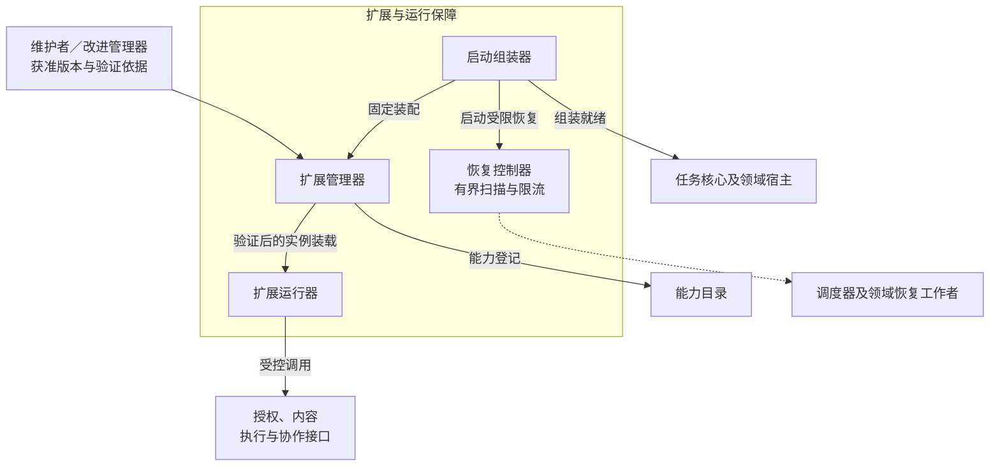
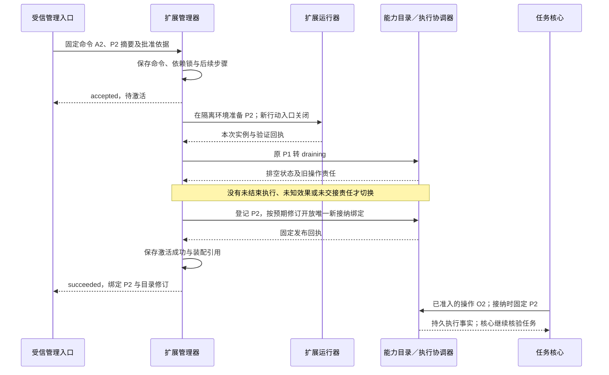

# 扩展与运行保障详细设计

扩展与运行保障把获准的组件版本装配为可运行环境，并在启动、升级、失联和关闭时保留各模块已有的处理责任。启动组装器管理依赖和生命周期，恢复控制器协调恢复扫描与容量，扩展管理器验证并激活版本，扩展运行器装载实例并落实隔离。任务是否继续、操作产生何种效果和许可是否有效，仍由对应领域模块裁决。

本方案依据[系统全景图](../diagrams/system-panorama.drawio)、[项目目标](../../harness-project-goals.md)及现行模块契约。全景图中的 `extensions` 分组包含上述四个节点；“观测、评测与改进”是相邻分组，本方案只接收其获准版本和输出可追踪记录，不展开评分、改进提案或发布策略。

## 1. 范围、成熟度与阅读顺序

采用固定用户写权威和受信宿主，完成本地／跨节点精确版本安装、验证、批准后自动激活、撤回停用、预批准回退及重启恢复的设计。**装配版本**是一次部署选定的组件、依赖、接口及配置的不可变集合；**实例绑定**沿用能力目录定义，表示某个执行端上固定的驱动实现及配置，不能用包版本代替它。

| 范围 | 当前设计与入口限制 |
| --- | --- |
| 默认闭环 | 受信维护者批准精确产物与批次 → 自动交接及逐节点安装／激活核对 → 持续复核批准 → 撤回停用及适用预批准回退；安装后的能力仍经目录、授权及执行入口调用 |
| 依赖具备后开放 | 第三方代码须有文件、凭据、网络与资源隔离适配器；旧责任须有原实现和领域恢复入口。缺隔离拒绝装载代码，缺原实现保留缺口并关闭相关启动 |
| 端云与多 Agent | 可分别装配端、云模块；内部 Agent 复用协作任务端点，外部 Agent 只安装适配配置。跨端领域载荷与有限离线沿原模块启用条件，运行中任务迁移及跨主机接替后置 |
| 后置能力 | 热迁移进程状态、无停顿持久格式迁移、跨节点原子发布和自动扩批；现行普通升级保持排空，安全停用不等待排空，见[采用状态](validation.md#proposals) |
| 实际交付 | 本轮交付详细设计和验收用例；没有可运行组装器、扩展 SDK、沙箱或恢复控制器，不据此宣称 L2–L4 已通过 |

连续阅读本页 → [安装、激活与隔离](installation-and-isolation.md) → [生命周期与恢复](lifecycle-and-recovery.md)。实现查阅[契约与记录](contracts.md)，验收和待决项查阅[验证设计](validation.md)。跨节点管理采用 [release 领域合同](contracts.md#wire)，与本地命令共用原身份及回执；安装包描述与已有[协议扩展声明](../endpoint-cloud-protocol/extensions.md#manifest)分别定义。

本模块直接承担 C6 的扩展接入与替换、C5 的启动和恢复保障、C7 的宿主隔离及权限边界；为 C8 提供配置与恢复记录，为 C9 落实获准产物的启用、停用和版本回退。C1–C4 的效果仍由大脑、记忆和执行验证。A1–A4 均适用；V1、V2 分别在真实内容检索和有状态模拟设备任务中验证替换、重启及未知效果恢复，不能由插件加载成功代替专项验收。

## 2. 分工与事实归属

图从单个部署宿主看交接：实线是本地调用或持久交接，虚线是恢复触发。四个职责可共处一个受信宿主，事实保存位置见下表，插件进程边界另见隔离设计。

| 事实或决定 | 保存／裁决方 | 本模块职责 |
| --- | --- | --- |
| 包来源、精确摘要、依赖锁、验证报告、启用依据 | 扩展管理器 | 拒绝同版本异内容、缺依赖和未获准的版本 |
| 装配计划、生命周期命令、未完成安装步骤 | 启动组装器及扩展管理器的持久记录 | 从原命令恢复；运行健康观察独立更新，不把历史成功当作当前就绪 |
| 能力语义、实例发布状态、登记回执 | 能力目录 | 通过既有 Register／SetAvailability 管理；本地安装记录不覆盖目录权威 |
| 进程句柄、隔离配置及停止证据 | 受信扩展运行器 | 说明本地进程是否被隔离；不能据进程退出断言外部 API 没有效果 |
| 任务、操作、工作、预算及控制归属 | 任务核心／运行存储、执行协调器／执行存储 | 触发所属工作者扫描，保留原标识、预算与期限 |
| 主体、许可、撤销及端点活动所有者 | 身份与授权 | 受信宿主绑定实例身份，每次使用仍复核；安装不签发用户许可 |
| 评测结论、推广策略、代码发布批准 | 评测／改进管理器及维护者 | 验证已有依据，按获准范围启用；不降低门槛或以一致性通过代替效果改善 |

直接交接的成功依据和失败后继续者见[交接表](contracts.md#handoffs)。目录状态、生命周期状态、管理命令进度分别描述不同对象，不合并为一个全局“运行中”。

## 3. 决定闭环的选择

| 推荐 | 依据与主要代价 | 替代方案及改变条件 |
| --- | --- | --- |
| 固定依赖闭包，启动时不在线求解或下载 | 重启必须能找到原实现；增加本地制品保留量，升级需显式生成新锁定集合 | 安装准备按 release.apply(action=prepare) 语义受控取得精确制品并固定驻留回执；启动只读原锁定集合，网络能力声明始终不触发安装 |
| 先装载验证，后开放目录接纳；使用可核对的分步命令 | 运行器与目录不能共享进程事务；每步保留原命令，提交未知先查询，可能短暂不可用 | 不引入全局事务。将二者同库实现可减少往返，仍须保留各自成功含义 |
| 默认排空受影响绑定后切换 | 现有操作已固定旧实现，热替换会破坏查询、取消和结果解释；升级可能被未知操作阻塞 | 有明确并存需求后，可保持新接纳指向新实例、旧操作路由原实例；仍须满足目录唯一接纳约束和领域绑定，首期不开放自动热迁移 |
| 受信内置代码同进程，第三方代码在隔离进程；Skill 按数据读取 | 避免把操作知识变成宿主代码；进程模型增加 IPC 与资源成本，支持平台必须逐个验收 | 仅把子进程当隔离不足。宿主无法证明资源与出口限制时拒绝第三方执行；替换沙箱须通过同一负例集 |
| 恢复由原领域执行，本模块只协调生命周期和限额 | 内核、执行、消息已有持久责任，再维护任务恢复账本会出现双重裁决 | 出现实测扫描瓶颈后可更换触发与分片方式，仍不能重建操作、重置预算或越过领域门禁 |
| 版本回退作为新管理命令，保留当前业务账本 | 回退代码不能撤销已发生的效果或已应用的撤权；旧代码须能读取当前持久格式 | 格式不兼容时保持受限，执行领域另行评审迁移；不直接恢复旧数据库快照 |

以上选择保持相邻模块的事实归属，跨节点交接使用本轮定义的领域线契约。全景图既有五条交互均保持，新增图只是模块内部展开。

## 4. 贯穿场景：升级文件插件后继续保存任务

用户已批准任务 T“将内容保存到 A 并读回核验”。旧文件插件 P1 提供能力 `file.write@1`，新包 P2 修复驱动实现且保持能力语义，因而使用新实例配置修订；若效果或恢复保证改变，则必须发布新能力版本。下面从维护者已经批准 P2、其测试和隔离依赖均具备的起点展开，文件名与版本为逻辑示例。

如果 P1 的操作 O1 已写入文件但结果丢失，`draining` 不能清除它。执行协调器先沿 O1 和 P1 查询，扩展管理器保留旧包和受限入口，A2 显示阻塞原因；重启后继续原核对，不把 O1 交给 P2 重做。当前查询许可被撤销时保持缺口，管理员可通过[执行处置入口](../capability-and-execution/validation.md#management)补交可验证证据或请求获准核对，不能手工确认“无效果”。

若目录已经开放 P2、管理器尚未保存答复就崩溃，恢复时查询原发布命令：已发布则补记 A2 成功；未能确定则保持待核对。此时 P2 可能已接纳操作，不能靠停止进程或删除目录条目宣称激活从未发生。受影响绑定短暂不可用可以接受，重复外部行动不能接受；完整异常见[激活边界](installation-and-isolation.md#activation)。
