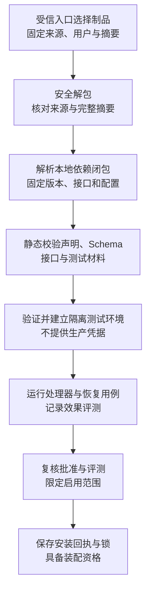
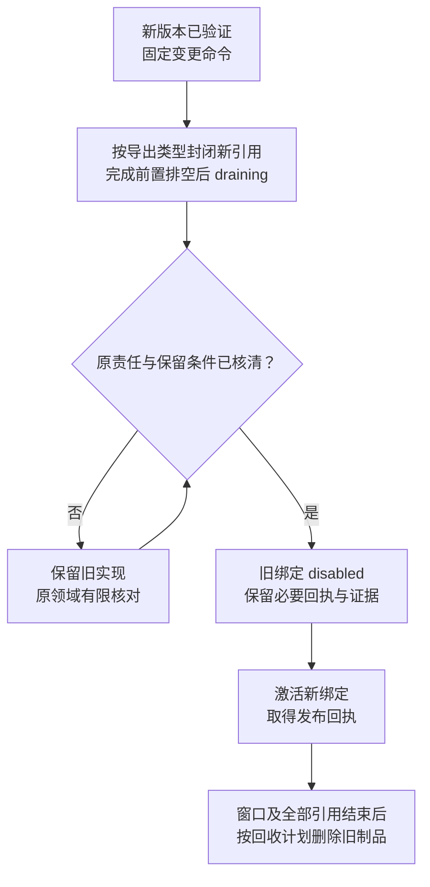
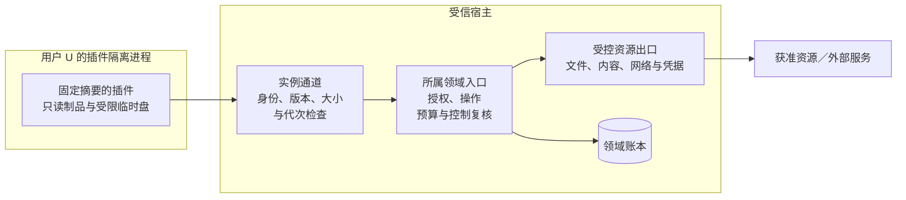

# 安装、激活与隔离

[总览](README.md) · [契约](contracts.md) · [生命周期与恢复](lifecycle-and-recovery.md) · [验证](validation.md)

## 1. 从制品到可装配版本

安装只接受受信管理入口选择的制品，按以下顺序验证，任一必需项失败即停止进入下一阶段；已得到的诊断保留。隔离、批准和业务授权是独立条件，某一项通过不豁免其他检查。

下载只在管理入口已经选择的来源发生，采用字节、时间、重定向及并发上限，不在解析 manifest 或运行时隐式抓取依赖。解包在隔离临时目录进行，拒绝路径越界、符号链接／硬链接逃逸、重复路径、设备文件、异常展开大小和大小写冲突；包自带安装脚本不执行。制品摘要经受信批准来源比对才能证明选中了获准内容，摘要匹配本身不证明作者可信。

完整依赖锁固定每个导出的宿主接口、内容和配置。默认用显式候选列表选择满足条件的最高管理优先级项，以精确 ID 稳定消除歧义；无法唯一匹配就拒绝并报告冲突，不借可变 `latest` 别名启动。必需依赖成环直接拒绝；可选依赖缺失须有声明过且经验证的受限行为。系统组件依赖的启动顺序另由[生命周期计划](lifecycle-and-recovery.md)确定，制品依赖图不等于所有组件必须独立部署。

| 导出种类 | 安装时验证 | 激活后的使用入口 |
| --- | --- | --- |
| 驱动／能力插件 | 准确声明、资源规范化、权限意图、效果判据、原调用查询／取消、物理重试限制与隔离负例 | 目录提供候选，执行协调器接纳并保存操作，运行器只装载固定驱动 |
| Skill | 固定内容、来源及用途、所需能力、模板／解释格式；不把脚本附件自动变成可执行代码 | 受信上下文或策略适配器按任务快照读取；不单独登记 execution 能力 |
| 大脑／模型／记忆组件 | 所属模块公共接口、一致性用例、配置与持久格式、来源处理及替换限制 | 组装器按现有接口注入；当前工作与来源绑定由原模块固定 |
| TaskPolicy／Verifier 组件 | [本地贡献声明](contracts.md#task-policy-contribution)中的精确策略／验证器、目标和输入／条件／证据格式、能力保证及有限执行负例 | 核心沿[TaskPolicy 接口](../task-kernel/storage-and-interfaces.md#task-policy)固定任务绑定并裁决条件与完成；组件不保存任务事实、不自行派发 |
| 内部 Agent 配置 | 精确策略、Skill、模型及委派合同版本，最大扇出／深度、预算与取消保证 | 协作任务端点；主体取得受信绑定后仍由任务内核管理决策循环 |
| 外部 Agent 适配配置 | 对端身份与路径、原任务映射、查询／取消／用量保证及其限制 | 外部 Agent 保留独立运行时；不因安装配置就在本地另启同一 Agent 循环 |
| 协议处理器／附加项／视图 | 复用现有 manifest 与 Schema，验证请求响应、授权、作用域解析、交付和恢复；必要约束及 fallback 都需行为用例 | 只对已安装且验证通过的语义声明支持，发送时仍检查目标及受约束路径能力 |

一致性验证和任务效果评测分别记录。前者确认接口、隔离及恢复行为，后者说明 V1／V2 或改进产物的实际效果；任何一类未通过不能由另一类的分数覆盖。测试制品在独立用户与账本命名空间运行，使用模拟资源及获准测试内容；测试禁止访问生产凭据、设备和业务队列。尚无运行实现时报告“用例待执行”，不把 Schema 通过填写成验证报告通过。

## 2. 分步激活与提交未知

管理器按[管理命令契约](contracts.md#commands)耐久保存步骤后再调用运行器或目录。每个目标绑定串行推进，包可以有多个导出，但不承诺跨导出全局原子激活；需要共同可用的依赖集合在全部必需导出就绪前保持其上层入口关闭，独立导出可独立接纳。调用方能查询每个导出的成功与缺口，不能只得到含义不明的“包已启动”。

| 导出 | 发布权威与成功回执 | 新引用边界与原命令恢复 |
| --- | --- | --- |
| 驱动能力 | 既有能力目录的实例发布修订及回执 | 执行接纳边界固定实现；查原登记／发布命令 |
| Skill／Agent 配置 | 管理器在 AssemblyRecord 中按预期修订原子保存目标作用域、导出到精确锁的选择绑定和命令回执 | 宿主在新任务／新轮获准固定配置时读取；旧配置引用不改变，查原管理步骤 |
| 组件代码 | AssemblyRecord 固定组件绑定；组装器取得 Attach 和当前 Readiness 依据后保存该步结果 | 未就绪不开放依赖它的新工作；提交未知查原装配命令及实际附着，不以选择指针替代运行就绪 |
| TaskPolicy／Verifier 组件选择 | AssemblyRecord 保存精确策略、验证器及配置锁；核心宿主检查目标路由与本地接口可用性 | 仅供后续任务固定选择；旧任务保留原绑定，缺依赖不回落较宽判据，原管理步骤可查 |
| 协议处理器／附加项／视图 | AssemblyRecord 保存受信本地语义注册、Schema／实现绑定和发布修订 | 处理器就绪、恢复入口具备后才投影本端协商能力；当前支持仍由目标校验。旧可靠消息保留原语义处理，回执丢失查原注册命令 |

配置与语义注册只是本模块持久记录的用途，不新设注册服务。以下五步展开驱动能力路径；其他导出复用相同的准备、提交前复核和原步骤恢复规则，使用上表的发布权威，不向能力目录登记虚假工具。组件附着和注册投影丢失可从固定选择恢复；它们尚未就绪时不确认激活成功。

| 步骤 | 必须完成的检查与持久结果 | 崩溃或超时后的继续方式 |
| --- | --- | --- |
| 1. 接纳激活 | 固定制品、目标、预期绑定、真实批准权威及修订和期限；核对所声明的回退路径依据，保存原交接键、下一步骤及制品保留责任 | 查原管理命令；接纳不等于目录 active |
| 2. 准备实例 | 运行器建立原实例代次和受控通道，在生产行动入口关闭时装载；只做无目标副作用的健康探测 | Inspect 原实例；若是否仍活跃未知先隔离，不能换进程 ID 再启动副本 |
| 3. 登记声明 | 目录 Register 保存 staged 声明及实例、验证材料；同版异内容拒绝 | 按原登记命令查询；不得通过重命名能力逃避冲突 |
| 4. 开放新接纳 | 从真实权威复核当前批准及其回退路径、当前 owner、依赖、运行器准备依据、权限与原截止；SetAvailability 按预期发布修订切到 active | 目录是能力接纳的发布权威；处理端启动仍复核。运行器 readiness 过期或实例消失时拒绝启动，协调停用 |
| 5. 固定结果 | 保存目录发布回执、实际绑定和管理成功结果，释放管理执行槽 | 目录已提交但此步丢失时补记原结果；历史成功保留，当前健康另查 |

运行器“准备好”不授予业务调用权限，也不能在初始化时自行联网或启动设备行动。插件从宿主取得的执行入口仅接受领域已保存的原调用及有限资格；目录未开放时新的调用在执行接纳边界被拒绝，目录开放后仍受授权、资源及控制门禁约束。目录提交后运行器崩溃，属于已发布绑定不可用；执行端区分尚未启动与可能启动并保存真实缺口，管理器不把登记回执当成操作执行回执。

Prepare、Register 和发布各自有固定回执，无跨模块事务。收到 RPC 答复只在处理方回执已经耐久保存时代表对应阶段成功；不存在以消息收到确认全部激活的捷径。提交未知先查原命令，只有明确未生效且原目标永久封闭后才能撤回；一次 `not_found` 不足以证明不会有迟到提交。已激活的版本需要停用时提交新的状态命令，保留原激活成功事实。

## 3. 升级、停用、回退与卸载

目录实例状态沿[既有状态机](../capability-and-execution/catalog-and-contracts.md#catalog)，不在此定义第二套。正常升级先准备新版本，再对受影响旧绑定停止新引用与新接纳，完成排空后切换；不关闭无关用户、能力或仅用于查询的通道。

图中的等待是有退避、额度及期限的持久 blocker，不是无限占用工作线程的循环。前置排空根据实际固定对象决定：普通驱动的具体实现直到 Execution.Invoke 接纳才固定，任务只引用能力语义，因此可直接 draining 并核清已接纳操作；固定组件代码的任务则先关闭新任务／配置引用入口，让既有任务继续生成必要的后继操作，等这些长期引用释放后再关闭其所需执行接纳。不能先禁用后继操作，再等待依赖它的任务完成。

排空依据由受影响领域提供：执行操作已结束且效果核清、事实已可靠交接；确实固定了代码实现的任务／大脑／协作不再持有使用引用；消息处理器无未处理消息及恢复窗口引用。等待的是适用于该导出的全部条件，卸载另满足[保留条件](contracts.md#storage)。任务终态、租约过期或目录搜索不再命中都不足以证明排空。

对于策略、Skill 和 Agent 配置，首期新任务可在显式选择新配置后使用新版本，已有任务／轮次继续固定原版本；若宿主不能同时保留这些纯数据版本，则先停止受影响新任务接纳并等待旧引用释放。模型配置更换必须由核心启动新轮与新预留；运行器不能把原 work／attempt 换模型续发。对需要换代码实例的组件，默认等全部相关调用／任务引用排空；无限期长任务可以由用户按既有任务接口取消，取消后仍需处理未知效果，不能强制改配置。

安全停用直接请求目录 disabled，并通过受信资源入口关闭新启动及隔离不再可信的进程，不等待排空。进程内未发出的 Start 是否永久封闭由驱动／执行入口证明；已发往外部系统的请求仍可能完成。原实现仍可信且当前权限允许时只保留受限查询／取消路径；制品被安全撤回或无法保证其行为时禁止再次装载它，使用原领域已保存证据和获准外部核对，缺少查询替代则报告 recovery_gap。停用不伪造成功，也不释放未知成本或设备互斥门禁。

回退是一次指向旧制品的新激活命令，有新的管理修订和批准检查；只影响后续合法准入。实现保持同能力语义时也要重新固定实例配置修订，不能复用失效的旧运行资格。业务数据、原操作 ID、命令回执、权限撤销、当前 owner 和已发生效果均保留。旧程序不支持当前持久格式则拒绝回退；首期禁止包安装脚本自动修改核心／领域表。模块私有格式迁移同样需声明读取范围、独占使用及失败恢复，缺验证的迁移包不激活；跨版本在线迁移列为后续提案。

发布前的回退声明按[启用依据](contracts.md#approval)检查，声明有效期间保留目标制品和完整依赖。此前验证通过不替代实际回退时对当前格式、权限及代码信任的复核；旧版已被安全撤回、数据超出声明范围或原责任未核清时仍须阻止切换。预批准回退只省略再次人工选择，仍以新固定管理命令执行并复核这些条件；受阻时已完成的安全停用保留，不能自动扩大回退范围。停用回执和旧版激活回执分别返回，管理调用方据此区分已停用、旧版已恢复和恢复受阻，不能把停用成功转成回退成功。

### 批准的持续有效性与跨节点撤回

批准权威可以在本地或远程；断外网不等于本地权威不可达。每个部署／产物／能力明确批准检查的新鲜度上限、可离线持续使用的有限上限及适用动作；默认离线上限为 0，经时间、防回滚和门禁验收后才能配正值。新激活和新批次始终核对当前批准，离线窗口只覆盖已活动版本的获准使用，不允许新增安装、激活或扩批。

激活命令截止、批准的持续使用截止与业务许可截止分别保存。每个新的使用单元取批准／来源／业务许可／任务截止及预算的最严格边界；实际接纳和 Start 前仍由领域复核。活动版本的许可不能因健康、重启或原激活 succeeded 而续期。批准查询固定真实权威、approval_id、范围摘要及单调修订；断连或刷新失败不会生成新有效期，旧快照不能覆盖已应用撤回。

改进侧撤回先封闭新派发并可靠通知目标；扩展侧在本地事务应用撤回位置、关闭新引用及启动门禁，再返回应用回执。每节点独立记录已接纳、已关闭新使用、停用、旧版恢复及未知效果；离线目标至多在预先批准窗口内继续，其最晚新使用边界清晰展示。要求即时撤回的能力禁止离线。到期／撤回后尽力停止可中断调用，已经进入外部系统的操作仍按原领域核对，不能承诺同步消除在途效果。

正常升级的排空可能被长任务或未知调用阻塞，保存 blocker 并有限核对；用户可按现有控制接口暂停或取消任务，但不能清除未明效果。安全撤回直接封闭新使用，不等待排空；原代码不再可信时禁止重装恢复，仅保留获准证据或可信替代查询。上述门禁同样适用于 Skill、Agent 配置、组件代码和协议处理器，由各导出的发布权威执行。

## 4. 身份、隔离与受控出口

默认同进程装配受信内置组件；经过审查的插件代码在受监督隔离进程中运行。首个参考平台选择 Linux，其他桌面和手机平台只有提供等价适配器且通过用例后才声明支持。此处是实现要求，当前仓库没有沙箱实现；不提供“任意第三方程序均可安全运行”的保证。

图展示一个用户实例的信任边界。插件持有宿主分配的受限通道，不持有数据库、认证连接或凭据的直接访问权；箭头是受控调用。

宿主从已登记的用户、actor、端点与实例通道构造 RequestContext。Agent 主动发起调用时 actor 来自其受信实例映射；驱动或模型适配器代处理某次调用时，原行动 actor／source 从领域已保存的调用关联取得，并验证其在该实例允许范围内，实例通道只证明处理服务身份。Agent／服务使用身份模块既有 kind，不增加 plugin 主体类别；不得将原行动 actor 替换为运行器的服务主体。插件载荷自带 user_id、actor 或更高 owner_epoch 不改变受信上下文。共享 SDK 在入队前复核允许的 source 和 actor，不能将认证连接、用户全局 token 或数据库句柄传进插件进程。

| 隔离面 | 默认落实方式与边界 |
| --- | --- |
| 代码与文件 | 固定只读制品、独立挂载视图与用户临时目录；拒绝宿主文件、其他用户数据、设备节点、宿主进程检查和可写共享库。文件操作经宿主资源入口规范化和授权，不能将整个用户主目录挂入插件 |
| 网络与凭据 | 插件网络空间不提供直接外网路径；宿主仅开放契约化请求，固定允许的接收方、方法、用途、字节及截止并重新检查重定向。生产凭据留在对应受信适配器，不通过环境变量或日志交给插件 |
| 进程与调用 | 独立受限身份、禁止提权、系统调用允许集、限制进程派生与进程间访问；插件不能启动未锁定的依赖程序。IPC 关闭继承的多余文件描述符，校验接口版本、长度、调用关联及实例代次 |
| 资源消耗 | CPU、内存、进程数采用用户父级与实例子级限额；临时盘、日志、IPC、网络字节及昂贵宿主操作另行计量。实例重启和多插件并行不能增加用户总额 |
| 实例停止 | 受信监督器保存进程组／沙箱身份，确认子进程全部退出并封闭宿主通道后报告本地隔离；单个 PID 消失不算全部隔离，外部效果另由执行协调器核对 |
| 来源与内容 | Skill 和插件结果保留来源及用途，不能覆盖控制指令、验收条件或权限；日志、异常堆栈和测试输出同样受限。任务内容不自动成为插件可保存的长期记忆 |

Linux cgroup v2 提供层级资源控制，可用于用户及实例额度；它不是权限检查。seccomp 过滤系统调用，内核文档明确它本身不是完整沙箱。文件访问限制可组合挂载隔离与 Landlock，启用时按实际内核 ABI 检查规则是否受支持，缺必需能力就拒绝该隔离 profile；网络接收方限制仍由宿主出口实现。上述组合是本方案推荐，必须经逃逸负例和过载试验验证，不能把单个机制启用等同完整隔离。[cgroup v2](https://docs.kernel.org/admin-guide/cgroup-v2.html)、[seccomp](https://docs.kernel.org/userspace-api/seccomp_filter.html)、[Landlock](https://docs.kernel.org/userspace-api/landlock.html)（核对于 2026-09-24）。

默认拒绝插件自行联网意味着部分现有第三方 SDK 需要改为宿主适配调用，不能透明装入后宣称原权限边界成立。若驱动需要直接访问原生设备或专用协议，应作为经过审查的受信资源适配器装配，并明确其扩大了可信代码范围；管理器不自动把普通包提升为受信组件。

## 5. 实例异常与有限恢复

| 异常 | 本模块动作 | 原责任与后续行为 |
| --- | --- | --- |
| 健康探测失败、进程崩溃或内存上限终止 | 关闭相关新接纳，记录实际实例代次和故障；按配置有限重启 | 执行／模型调用可能已发送，先核对原账本，不重复调用、不释放未知额度 |
| 宿主与插件 IPC 中断，进程是否继续未知 | 先关闭通道并请求监督器隔离原实例；不能确定就保持受限 | 不同时启动可作用于同一资源的替代实例；已接纳责任在领域账本恢复 |
| 用户撤权或安全停用与 Start 竞争 | 将控制应用交原资源门禁串行裁决；切断失效实例新使用资格 | 已发生效果如实保留；取消、查询分别使用当前许可 |
| 验证通过后制品或配置被篡改 | 启动前重查固定摘要，拒绝变更内容并保存来源诊断 | 不从其他路径自动补一个“同版本”包；已加载实例按安全停用处理 |
| 包下载／验证／启动反复失败 | 记录尝试次数、退避、总期限及一次去重通知；达到上限停止主动推进 | 维护者可查看报告、更换经批准的新版本或发起有界核对；不无限重启制造调用风暴 |

激活期间准备最多尝试三次，两次重试间隔为 1、5 秒，单次超时 30 秒，受原管理命令截止约束。已激活实例后来发生故障，则由监督器在原实例记录上持久建立唯一未结束的 RecoveryEvent，固定本次故障、配置、三次总尝试、同样退避和首次故障后 120 秒的主动准备／重启截止；不借已到期激活命令继续，也不重新激活目录。每次恢复均复查当前代码信任、使用范围、owner 和原锁，资格不足保持受限。这些数值是单机验证起点，未实测。

进程重启复用原事件及累计次数；连续健康 60 秒后才能关闭事件，期间再次故障计入同一事件。稳定观察可以在主动重启截止后结束，已经健康的实例不因观察尚未结束而被关闭；截止后再故障则不自动重启。每个绑定另设滚动一小时最多三次自动恢复事件的持久上限，超过上限或原事件耗尽需新的受信处置命令；不能靠短暂探测成功制造无限重启。重启只恢复装载与获准查询通道；原发布仍 active 且领域重新核对通过时可解除故障造成的临时就绪限制，已 disabled 或安全撤回的绑定仍须新的显式激活。新的目标行动由领域工作决定，业务预算、操作标识及期限均不变。存储、控制及收尾空间不足时停止新装载和接纳，不删除旧恢复责任换取容量。
