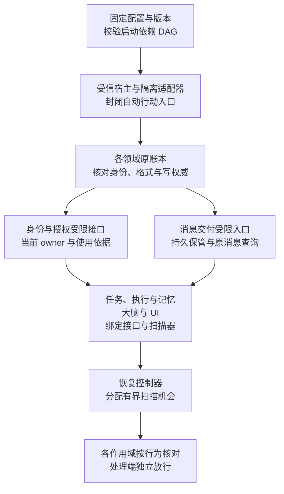
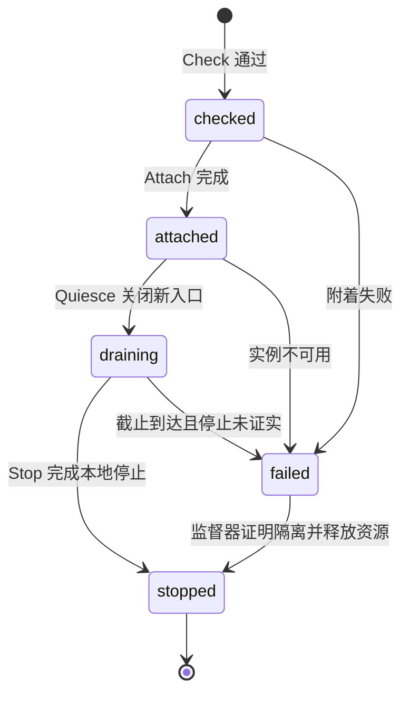
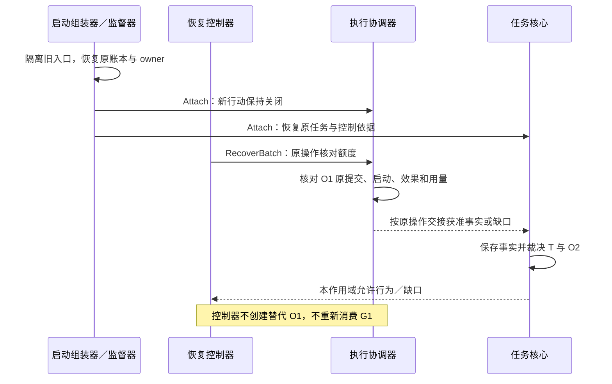

# 启动组装、关闭与恢复

[总览](README.md) · [安装与隔离](installation-and-isolation.md) · [契约](contracts.md) · [验证与待决](validation.md)

启动组装器把已批准的配置、组件及依赖绑定成一个受信宿主；恢复控制器为已有责任分配扫描机会与资源。任务核心、执行协调器、授权服务和消息交付仍分别裁决自己的业务事实。本页定义宿主本地生命周期适配接口及运行规则；跨节点制品与管理使用 [release 领域合同](contracts.md#wire)。本地生命周期不另设远程消息族，各领域继续保存各自的任务及操作事实。

默认采用固定用户写权威、本地受信监督器和持续账本。首期没有跨主机自动接替、自动迁移任务或账本回滚续跑；端云部署只装配现行契约已支持且已经验证的适配器。下文是设计要求，启动隔离、存储耐久性及实际恢复尚需实现验收。

## 1. 从配置构造可检查的启动计划

组装器先读取受信部署配置选定的装配版本，固定本轮组件版本、提供／依赖接口、用户写权威路由、账本身份、资源限制与隔离适配器。首次启动使用随发行固定并经维护者批准的内置清单；组装器、管理记录存储和最小身份适配器属于这份引导清单，不依赖待安装插件。后续使用已成功激活的选择；发现激活步骤提交未知时，先由内置管理入口核对原步骤，不能自行选择旧版或新版开门。缺少必需项、接口版本不匹配、重复权威或启动依赖成环时，整份相关启动计划拒绝；不得临时安装组件、换模型或改投另一用户存储。可选组件缺席只关闭明确依赖它的能力，其依赖方必须声明等待或降级行为。

启动计划的依赖边表示“提供方的受限接口可调用之后，依赖方才可附着”，不表示全部业务工作已经放行。组件间业务调用可以成环；构造和注册入口不能沿该环同步发起业务。先绑定处理器，再由领域在工作处理阶段发起调用，避免为解启动环而增加业务中间层。

图表示默认本地组装的先后关系。箭头是启动前置条件；同层节点可以并行附着，任一失败只影响依赖它的分支。

只读预检可以在未取得 owner 时进行，但不得把读到的旧快照当作当前允许写入的依据。打开可写账本前，监督器须持有同账本的独占资格并证明旧实例全部写入与执行入口已隔离；再由身份模块的 `ActivateOwner` 确认活动所有者。首次登记和本地身份引导通过[受信登记接口](../identity-and-authorization/contracts.md#interfaces)完成，不依赖尚未开放的普通业务连接。旧进程仍可能控制设备时停止接替，数据库锁已释放不能补足该证明。

启动计划可以记录配置摘要、组件版本、启动阶段和失败原因以供诊断，但这些记录不授予业务资格。计划重跑复用领域原账本；宿主本轮标识改变不改变任务 `owner_epoch`、原操作 ID、消息 ID 或单次许可。新的 owner 资格必须由身份权威裁决，不能用本地启动计数替代。

## 2. 宿主本地生命周期接口

以下是本页权威定义的本地适配接口。实现可以采用同进程类型化调用或受限进程 IPC；调用者始终是受信宿主。适配器只包装所属组件已有入口、扫描器和停止设施，不能向组件暴露任意修改领域表的能力。缺少相应提供方实现时，返回具体依赖缺口，不能用空成功回执占位。

| 接口 | 输入与返回 | 保证及调用规则 |
| --- | --- | --- |
| `Check` | 固定组件／配置版本、依赖声明、账本只读句柄 → 可组装或缺口 | 有界静态与只读检查；不消费许可、不创建业务责任、不触发外部行动 |
| `Attach` | 本轮宿主标识、固定配置、受限依赖句柄、已验证 owner 依据 → 附着结果 | 绑定原账本、注册处理器与扫描器；所有新目标入口默认关闭；不得隐含执行迁移或恢复副作用 |
| `Readiness` | 本轮、用户／作用域及行为集合 → 逐行为允许／受限、依据引用、有效期、缺口 | 只汇集领域当前结论；适配器或依赖不可用返回受限。不是永久可复用的启动令牌 |
| `RecoverBatch` | 本轮、用户、扫描类别、有限资源额度、可选游标 → 已扫描／尝试数量、待续提示、缺口、下一游标 | 调用所属组件扫描器和既有工作入口；额度只限制宿主资源，不增加任务预算或领域重试额度 |
| `Quiesce` | 本轮、绝对关闭截止、关闭原因 → 门禁已关闭、已落盘责任／未决摘要 | 先停止新接纳与新目标领取，再保存结果及已有责任；答复不证明外部动作已停止 |
| `Stop` | 同一本轮、绝对截止 → 已停止本地工作者／未证明隔离项 | 附着逆序释放本地资源；有未证实停止的物理调用时保留隔离缺口，由监督器处理 |

同一实例内生命周期调用按组件串行。重复 `Attach` 同版本返回原附着结果，异版本拒绝；重复 `Quiesce` 和 `Stop` 不重复创建业务取消或延长关闭截止。进程崩溃后从原账本重建适配器，按恢复规则核对，不要求恢复进程内生命周期回执。

每次调用有有限超时和取消信号。调用超时只使本轮步骤待核对：组装器读取实际附着／停止情况；涉及领域持久提交时调用原领域回执查询。不能把超时转换为“尚未做过”，也不能重复启动未经隔离的进程。不能在有限时间内完成一次批次的适配器会被停止分配新批次，影响作用域受限；已有外部调用仍由原领域负责。

下图只描述一个组件实例的本地生命周期。`attached` 允许受限恢复，不表示业务就绪；门禁是下一节独立状态。

依赖暂不可用通常只关闭相应行为，组件可保持 `attached` 接收允许的事实；不能把业务等待都报成进程故障。`failed` 的实例不原地回到 `attached`；监督器隔离后启动新实例，恢复原账本。

## 3. 先接收已有事实，再按作用域放行

启动与重连都分别处理下列行为。判定键至少含受信用户、领域作用域、行为、本轮及 owner；返回依据失效、owner 改变或连续变化入口断开时，先关闭依赖行为，再重新核对。跨端消息的最终放行仍由[消息交付的恢复轮次](../endpoint-communication/delivery-and-recovery.md#recovery)落实，本模块不建立另一个可覆盖它的全局 ready 标志。

| 行为 | 开放前最小条件 | 缺席时的行为 |
| --- | --- | --- |
| 原记录查询与诊断 | 身份、当前查询／披露权限及可信读视图 | 拒绝或返回缺口；旧备份只可作标明来源的离线诊断 |
| 获准控制处理 | 当前身份、领域控制入口及保存控制决定的可写账本 | 保留原调用方待提交责任；不报告取消／撤权已经持久生效 |
| 事实及结果接收 | 来源／原操作绑定、当前保存权限、账本与收尾容量 | 有可靠保管者则继续保管，否则不确认接纳；不能丢弃后谎报已处理 |
| 既有责任披露与交付 | 原固定消息／结果、当前接收方和披露许可、交付恢复依据 | 保存原发送责任和缺口；不改写正文后沿原身份发送 |
| 新任务接纳与新目标行动 | 所需领域当前控制、授权、路由、版本、内容、预算、容量及实际启动条件 | 入口拒绝新接纳或原已接纳工作等待；业务模块确定具体结论 |

消息账本可写、内核暂不可用时，交付在既定容量内保存入站并承担交接责任，不能返回业务 accepted。反之，执行结果获准保存而新行动被取消时，事实接收仍应开放。没有持久保存能力时允许关闭本地行动入口，但“已停接纳”不等于“已保存取消决定”。

恢复控制器对每类作用域请求其领域适配器提供缺口和唤醒条件；各适配器的接入位置如下。表中的扫描是所属模块已有持久责任的执行方式，`RecoverBatch` 不要求领域另增一个通用远程扫描接口。

| 适配对象 | 包装的既有入口／责任 | 当前缺失时的限制 |
| --- | --- | --- |
| 任务内核 | `Core.CheckRecovery` 及调度器原 Work 扫描、提交键核对 | 交付可有限保管，任务新接纳与派发关闭 |
| 授权 | `OpenRecovery／ReadChanges／ApplyRecovery`、原使用与命令回执 | 相应使用受限；不凭旧缓存允许新行动 |
| 消息交付 | 原 DeliveryWork、RecoveryRound、消息与流核对 | 领域保留发送工作，不虚构目标 ACK 或已交接 |
| 执行与大脑 | 原操作／调用回执、控制门禁及结果／用量交接 | 受影响能力不启动，原物理占用不释放 |
| 记忆与 UI | 原同步／提交责任、UI 已知任务与呈现记录 | 缺内容则依赖工作等待，不能枚举未定义的全局任务目录 |

跨端领域 profile 缺席时关闭该跨端能力，不由组装器拼造新消息来填补。组件健康与恢复就绪分别报告：进程可服务查询但新行动受限时，健康探针应保留原因，自动重启不能作为清除业务缺口的手段。

恢复无需等待全库清空未知项。领域允许 A 的事实接收、限制 A 的新派发时，A 按两种行为分别工作；不相关的 B 可以继续。依赖同一取消、许可或资源占用的操作必须共享相应限制，不能通过拆作用域避开。

## 4. 有界扫描与公平调度

恢复控制器只调度“哪个组件、哪个用户、哪类工作获得下一批机会”。领域扫描器按自身索引选取原工作，并通过领域事务领取、核对和保存结果；本模块不读取一份任务快照后自行决定重跑，也不统一改写不同模块的 Work 状态。

每次启动先为提交未知和已保存未交接事实分配批次，再为取消／撤权／控制恢复、失效领取核对和普通未决责任安排批次。这个顺序是调度偏好；同一作用域的强制先后条件由领域门禁决定。未获当前控制依据的新行动始终关闭，不能因排到了一个批次而执行。

| 调度层 | 规则及持久责任 |
| --- | --- |
| 宿主与用户 | 在宿主总并发／字节／时间上限内按用户加权轮转；新连接、流或组件实例不能增加该用户总份额 |
| 用户内组件与类别 | 对控制、恢复、已有收尾分别保留有限并发和队列空间，普通工作有非零最小份额；各类自身也限速，防止永久占满 |
| 单批次 | 限制扫描条数、实际尝试数、读取字节与运行时长；任一上限到达就返回续扫位置，不持事务等待外部调用 |
| 单原工作 | 重试次数、not_before、绝对截止和费用在原领域账本中保存；恢复和换工作者均不刷新 |
| 唤醒与重扫 | 通知只提前安排扫描；通知丢失仍按有限周期重扫到期索引，不能靠全历史全表扫描才能找到责任 |

游标只是扫描优化。领域查询采用稳定排序键和有界页，保存游标或重启丢失游标都不能遗漏未完成项；走完一轮后重新从到期索引起点扫描，并对新到期项安排机会。具体领取及旧工作者隔离仍使用原 `claim_epoch` 等领域机制。宿主记录批次统计与公平调度位置，不把“已扫描”写成业务完成。

保留量由待接纳责任需要的最坏收尾记录与处理路径估算；默认配置必须给出有限值，负载验证见[验收](validation.md)。容量不足先拒绝新接纳，已接纳控制、核对和结果不能被新工作淘汰。资源已全部耗尽时保持原责任并报告过载，不能承诺保留量足以抵御无限故障或无限输入。

`task.cancel_result` 和 `execution.cancel_result` 仍使用 work lane。收尾优先级只作用于其既有队列内部，落实[交付保留容量](../endpoint-communication/delivery-and-recovery.md#scheduling)，不把消息改为 control lane。观测导出、批量评测及安装预检使用独立有限份额，不能占用控制／收尾保留量。

核对次数或费用耗尽由原领域保存待处理缺口及一次去重通知，恢复控制器随后停止给这项工作分配主动调用机会；被动事实接收继续按自身权限进行。恢复组件重启不会重置原耗尽状态。宿主可恢复调度或重查原记录，无权追加业务预算、清除 once 消费或命令领域把 unknown 改成 failed。

## 5. 关闭按依赖逆序，持久责任先于释放

关闭先对所有附着组件发出 `Quiesce`，封闭新业务接纳、新目标领取与启动入口；对已经取得启动资格的操作，使用领域现有串行门禁裁决是否仍可启动，不能只停调度器。已有控制、事实接收及发送责任交接在收尾容量和关闭截止内继续。随后等待有界收尾，按依赖逆序停止业务工作者、交付／连接、授权及存储；承接它们收尾的依赖必须保留到交接已完成或责任已在原账本保存。

| 阶段 | 必须留下的依据 | 截止到达后的动作 |
| --- | --- | --- |
| 限制新工作 | 本轮关闭标记、实际入口关闭结果；领域控制事实仍归其账本 | 监督器隔离未响应的本地入口，不合成业务取消 |
| 结果与发送收尾 | 原结果／用量、原发送工作、交接凭据或未知提交键 | 保存未决摘要，停止主动等待；下次恢复原责任 |
| 停止工作者与连接 | 已停止本地线程／进程的证明，尚未核清的物理调用及资源占用 | 无隔离证明不允许替身接管设备／账本；连接断开不等于外部动作停止 |
| 关闭存储 | 已提交记录及未解决提交引用；各领域自己的耐久提交结果 | 存储错误按提交未知恢复，不能用“正常退出”日志覆盖 |

`Quiesce` 的宿主截止只限制关闭等待，不修改任务、操作、许可或消息原期限。默认不因关闭自动取消用户任务；支持中断的在途调用按其已有权限和领域规则请求停止，不能保证远端操作同步结束。关机或强杀没有完成上述步骤时，下一启动照常从原账本查责任，不能以缺少关闭日志判定旧操作没有发生。

## 6. 异常贯穿例：写入可能成功后宿主崩溃

沿[授权与执行的写入例](../identity-and-authorization/README.md#example)：任务 T 已将写文件 A 的操作 O1 派发，单次许可 G1 已绑定 O1，启动准备已经持久保存，响应尚未回传时宿主崩溃。读回 O2 仍须等待 O1 的可信事实及自身读取权限。

若核对只得到“当前未见文件”，E 保留未知，不因重新启动而创建新写入；若旧驱动仍可能行动，资源保持占用，监督器不能先起替身。核对 G1 已消费也不能推断写入发生或未发生，效果依据仍由 E 获取。

若 T 在宕机期间已持久取消，核心先恢复该控制决定；后来获得的 O1 成功事实仍可保存，但不会重新准入 O2。若事实已保存、交接确认丢失，E 沿原关联重交，核心按原回执去重。缺少当前读取或披露权限时只保存获准最小缺口，不为恢复自动读回 A 或上传正文。

## 7. 备份、恢复和版本回退边界

数据库格式、配置和可执行组件的恢复分别判断。各领域继续使用既定存储方案，备份须覆盖其完整提交域：任务与用户操作唯一索引、授权消费与撤销、消息序号及待交接、执行启动与原外部句柄不能拆成可独立丢失的恢复项。跨领域可以各自备份，但恢复时必须核对两侧交接记录及丢失区间；不能因都来自同一时刻附近就宣称全局一致。

| 情况 | 本模块允许的动作 | 放行前必须证明 |
| --- | --- | --- |
| 进程崩溃，原持续账本完整 | 隔离旧入口后在原账本恢复 | 原 owner 隔离、提交未知可核对、当前授权与领域门禁成立 |
| 更换程序但账本未回退 | 先关闭，按批准版本重新组装 | 新程序可读原未决记录及固定版本解释；配置与迁移验收通过 |
| 恢复较旧备份或丢失日志尾部 | 以受限模式只读检查、补齐权威日志／回执与内容 | 曾经接纳、消费、准备启动或 ACK 的记录仍可恢复；旧实例已隔离 |
| 无法补齐已确认记录或消费历史 | 关闭受影响账本的行动与旧身份接纳，保留恢复缺口 | 声明数据损失与无法恢复范围，保留可证明事实和原责任的关闭／未知记录；不以新账本／新 endpoint 让原请求当作首次执行 |
| 回退程序版本 | 按[安装切换约束](installation-and-isolation.md)验证后重新组装 | 旧程序能正确解释当前 schema 和所有未决记录；不执行未经证明可逆的数据迁移 |

已确认记录无法恢复时，受影响旧账本及身份的行动资格持续封闭，不承诺恢复运行。受信入口显式确认可证明事实、缺口及数据损失后，才可为新的数据和任务重新准入；新准入不能复用旧操作来重做未知副作用，也不能重置旧预算、消费、消息确认或责任。旧任务报告不可恢复，无法证明的历史保持缺口。

备份可用性验收必须恢复到隔离环境并核对原提交、消息位置、once 消费、执行准备、内容引用和收尾责任。只验证文件可打开或进程能启动不足以开放工作。与原账本并存的恢复副本不能使用原有效身份对外发送或启动；测试依赖必须替换为无真实副作用的受控实现。

恢复旧快照使本启动周期的离线时间锚失效，默认重新联网取得可信时间与当前授权；授权、预算或期限不随快照回退。无法取得反回滚依据时离线行动继续关闭。首期恢复流程不给出可绕过领域依据的“强制继续”开关。

生命周期适配器、有界扫描索引、监督器隔离证明和备份连续性校验是实施依赖；尚未实现时，允许完成配置静态检查，但不得宣称接替、恢复或离线续跑已成立。关键故障注入及各检查层次的证据记录见[验证与待决](validation.md)。
