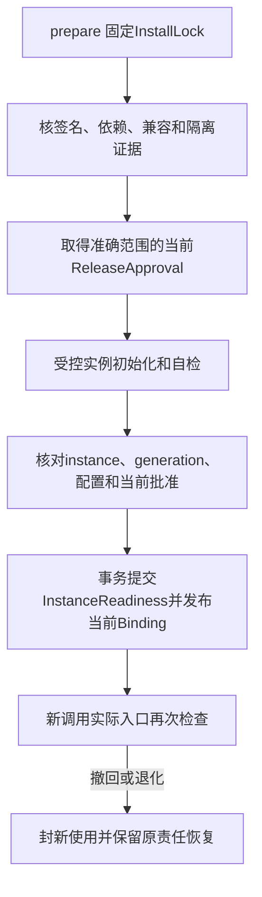

# 能力安装与安全发布

安装回答“运行什么代码”，发布批准回答“在哪个范围允许启用”，实例就绪回答“这一次实际装载是否可服务”。这三项事实分开保存。更新组件不会改变原Task、Operation、Grant和账单的含义。

默认Go内核与审核组件静态构建，独立可替换组件通过受控进程或服务装配。不用Go热卸载插件建立恢复保证，也不因为一个包自称sandbox就给它宿主权限。

## 1 三份准确声明

| 声明 | 固定内容 |
| --- | --- |
| Capability | 语义操作身份、输入输出Schema、效果/证据谓词、幂等与错误、授权用途、请求和费用上限 |
| Binding | 准确实现、端点/资源、配置、Capability版本、InstallLock、实际实例条件 |
| InstallLock | 制品及递归依赖摘要、配置、平台/ABI、协议profile、数据读写格式、迁移及信任/隔离证据 |

Skill另保存用途、前提、反例、证据/工具依赖、冲突和退出规则及准确正文版本。加载Skill不产生执行许可。Agent配置固定Brain、允许能力和控制上限，不能用配置覆盖用户Grant。

Installer只读取固定制品和闭合依赖，不在运行时递归获取任意URL Schema。未满足依赖、格式或平台条件的安装可以保留准备状态，但不得成为可派发Binding。

## 2 从准备到当前实例就绪

extensions.prepare 保存原命令、准确锁定清单、准备阶段与Job。首装走明确compatibility批准，依据契约/恢复/平台证据；不假装已有改进基线。improvement目的的候选必须通过[评测门禁](../evaluation/README.md)，失败不能换标签绕过。

Activation保存activation_id、InstallLock、目标范围、generation和可见revision。generation表示当前绑定代际，revision随可见状态、readiness、残留和禁用变化递增。历史激活不变，当前InstanceReadiness绑定本次随机instance_id、配置/制品摘要、自检、批准及期限。

异步初始化回调只可CAS更新自己原instance/generation；旧A回调不能覆盖新B，旧清理也不能删除B的句柄。handler对外可见必须晚于readiness事务确认。adapter构造、自检或恢复对象不得隐式发模型或目标请求。

## 3 发布和在途工作

ReleaseApproval固定批准者、准确InstallLock、用途/目标范围、评测或兼容证据、有效期及撤回状态，另固定有限targets/batches、最小样本/观察窗和stop_rules。每批目标实际ready且观察达到门槛才扩批；扩大总targets或放宽门槛须新批准。评测通过不是发布权限，本人或维护者批准也不证明实例已就绪。

新调用固定准确Binding和安装引用。它使用有限ApprovalUse或同事务当前批准检查，实际启动复查。批准撤回封闭新窗口并向已登记实例保存控制责任；已签有限窗口和已启动动作按原事实核对，不能宣称分布式瞬时停机。

版本发布先小范围启用，固定观测指标、扩批条件和停止阈值，再逐批扩大。质量、误动作、P95延迟、成本和未知效果分别监测，不能以总体平均改善掩盖高影响错误。

旧任务默认继续原InstallLock。若原版本被安全停用，等待或按已批准兼容恢复分支处理，不能拿“最新同名工具”解释旧Operation参数。旧版的原效果/费用查询端口在未结责任关闭前必须可用，或者由经过合同验证的兼容接管器承担。原代码已不可信且无合格接管器时停止运行该代码，只保留账本查询和明确效果核对缺口，不能为收尾继续执行恶意插件。

## 4 回退是一次新的激活

依 [ADR 0007](../../adr/0007-independent-rollback-approval.md)，新版发布显式关联准确旧InstallLock和独立旧批准。自动回退必须再次确认旧批准当前有效、目标范围匹配、证据仍适用、当前数据格式可读写，并以新activation_id和固定expected_generation取得新实例readiness。若已被后续发布替换，返回冲突，不自动刷新expected_generation；迟到旧deactivate只作用原activation。当前实例重启另取reopen use，不递增原已提交generation，不重跑迁移，也不继承旧离线lease。

撤回新版不撤销旧版独立批准，也不使旧版永久获准。旧批准失效、不可核验或格式不兼容时停用并报告恢复缺口。回退不回滚业务数据库，不抹除已发生效果、撤权、一次消费或迟到账单。

数据格式采用expand→有界backfill→切换→观察→contract。每步固定migration_id、制品摘要和检查点。只有旧实例全部退出、未结原工作可恢复且回退保留期结束，才删除旧字段。不可兼容迁移明确维护窗口和回退限制。

## 5 引用、停用和卸载

Task、Decision、Operation、环境、Skill及评测运行对准确InstallLock建立holder引用；引用接纳与本地准入同事务。跨owner先完成可核验登记，再派发新工作，不能只靠内存refcount。

extensions.deactivate先封新使用、保存逐实例停止与原责任核对。dispose先封新引用，再检查完整既有/在途holder集合和实际实例退出，未知不当零引用。已停用记录及原回执可查询，未结账务和最小身份继续保留。

可增长实例/holder集合按修订、计数、分页查询，内部完整索引裁决卸载。一个响应只含100个实例不是其余实例已停。初次停用的回执和最终残留清理分开呈现。

## 6 可替换实现的验收

每个Brain、Memory、Executor都应有第二种独立实现通过合同；至少一个异构语言组件走真实WSS/gRPC。仅改变函数名或本地Brain调用云模型不等于远程Brain可替换。

发布验收覆盖：准备后重启、批准撤回与启动竞争、旧初始化回调、停用后原结果查询、旧批准失效回退、当前格式不兼容、跨owner holder登记丢答复和卸载大扇出。正式开放前版本锁定、方法登记、Schema、SDK和运行证据同版发布，遵循[ADR 0010](../../adr/0010-monorepo-shared-contract-release.md)。
