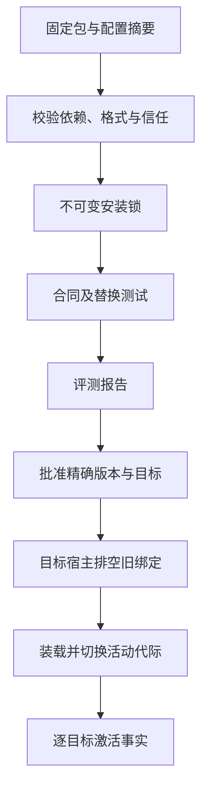
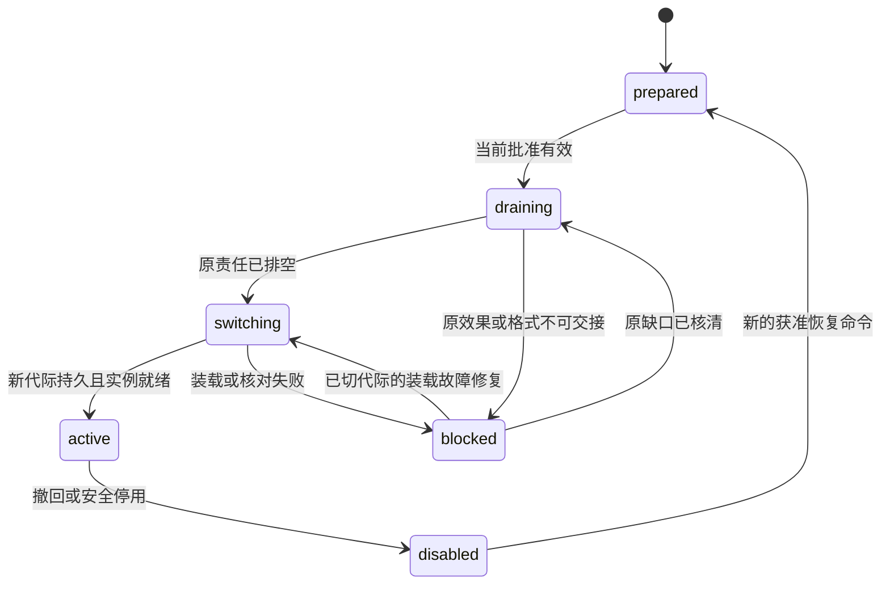

# 扩展装配、安装与版本切换

[模块与数据 UML](../uml-models.md#extensions) · [可编辑 UML 图册](../diagrams/uml-models.drawio)

[总览](../README.md) · [共同接口](../contracts/README.md) · [授权与隔离](../security/README.md) · [评测与发布](../evaluation/README.md)

实现阅读：[模块形状与依赖](implementation.md#module-shape) → [锁与实例对象流转](implementation.md#data-flow) → [重启内部时序](implementation.md#key-sequence) → [生产可用性与容量](implementation.md#production)。先阅读本页行为合同，再按实现页落实持久化与恢复；线字段及正反例继续由公共契约资产维护。
扩展系统把默认实现和替换实现装配成可运行宿主，覆盖 C6、C9 及 A2、A4。Plugin 是携带代码或适配器的安装包；Skill 是供 Agent 使用的操作知识与流程内容；Agent 配置绑定 Brain、Skill 和允许能力。三者都需版本化，安装不自动授予用户数据或设备权限。

默认宿主运行内置或经维护者审核的受信代码。任意不可信原生插件只有在目标平台隔离通过验收后才可运行；缺少隔离适配器时拒绝安装为可执行实例。Skill、模型结果和外部 Agent 内容始终按不可信输入处理，即使它们来自已安装的软件包。

## 1. 扩展点保持行为合同，宿主负责装配

默认实现以 Go interface 表达进程内 Brain、Memory、Executor ports；独立组件进程通过 gRPC + Protobuf 提供相同公共契约。安装锁绑定实现、配置、数据格式和权限声明，任务开始时固定所需版本。替换一个 port 不应修改其他模块的任务状态或完成规则。

受信内置实现以 Go package 随宿主二进制构建发布，更新这类代码需排空并重启宿主；需要独立安装和切换的可执行扩展交付为受控子进程或服务。默认不使用 Go `plugin` 动态装载：其无法关闭，工具链及公共依赖不一致还可能导致崩溃，会把版本切换绑定到宿主构建细节。独立组件通过版本化协议承担切换成本，同进程接口保留给编译时装配。[Go plugin 限制](https://pkg.go.dev/plugin#hdr-Warnings)

采用直接装配与精确版本锁，不先建设动态插件市场、全局依赖解析服务或通用工作流引擎。开发者需要维护的是声明、实现和一致性测试；复杂升级集中到有状态组件切换时处理。存在多个互不兼容的用户依赖且无法按宿主隔离时，才考虑多版本并行装配。

包版本遵循 SemVer，但运行锁始终记录精确版本和摘要；兼容范围只参与安装前求解，不在任务进行中重新选择版本。已发布版本内容不变是 SemVer 的明确要求，实际兼容性仍由本项目测试证明。依据：[Semantic Versioning 2.0.0](https://semver.org/spec/v2.0.0.html)。

评测与批准由[evaluation](../evaluation/README.md)保存，扩展管理器保存本宿主安装和激活事实。报告通过不等于获准启用；批准到达也不等于该节点已经运行新版本。

| 发起方 → 处理方 | 交接对象 | 持久成功点 | 失败后由谁继续 |
| --- | --- | --- | --- |
| 安装入口 → 宿主管理器 | 准确制品、配置与平台 | 制品核验及不可变安装锁可查 | 管理器沿原准备命令恢复，半包不对外激活 |
| 发布协调者 → 目标宿主 | activation_id、精确锁、目标、批准与预期代际 | 接纳切换责任；实际 active／ready 另确认 | 协调者查原激活；宿主继续原排空／切换 |
| 目标宿主 → 批准 owner | 固定激活或 work 身份及当前锁 | 当前批准下的有限启动依据已保存 | 宿主查原 use；不使用过期回执或刷新旧截止 |
| 管理器 → 旧组件／所属领域 | 原绑定和排空要求 | 原责任已达可交接边界 | 所属领域核对未知操作，管理器保存 blocked，不换驱动重做 |
| 管理器 → 调用入口 | 新代际与实际就绪实例 | 活动指针持久且本实例自检完成 | 重启先装载核对；指针存在不能单独开放入口 |

安装、批准、切换接纳、实际就绪和旧版恢复分别可查。下文默认切换算法是参考实现；替代实现不必复制内部步骤，但必须保留这些外部成功边界。

## 2. 安装锁与 SDK 的最低要求

干净安装先启动只承担身份、安装、批准和恢复的受信最小宿主。内置制品以契约符合性报告和本人或维护者经批准 owner 确认入口作出的决定建立 compatibility 批准，确认与批准在同一事务消费；没有旧版时 old_lock_id=null。普通兼容发布同样只声明合同符合，宣称改善的发布另走完整正式证据门禁。首装材料缺失时保留管理与诊断入口，不能直接开放业务执行。完整交接见[首装实现](implementation.md)。

安装先取得完整制品并校验摘要，展开到独立的暂存目录，拒绝绝对路径、路径逃逸和越界符号链接。默认制品必须预构建，不自动执行下载包中的安装脚本。审核过的构建在单独构建环境执行，产出新的固定制品后才进入宿主安装流程。

安装器解析声明，求得一个有限、无冲突的完整依赖集合，校验来源、主接口版本、宿主平台、数据格式和信任要求。完成后原子发布安装锁及制品可用记录；引用该锁的任务只能读取锁内文件，不能在运行时依赖最新包名解析。

| 扩展点 | SDK 必须体现的行为 |
| --- | --- |
| Brain | 有界单轮提案、输入版本绑定、调用用量与恢复；合同见[大脑](../brain/README.md) |
| Memory | 查询和修改修订、当前来源权限、删除及派生索引；合同见[记忆](../memory/README.md) |
| Executor | 准确声明、原操作身份、启动/效果分别报告、查询与接管；合同见[执行](../execution/README.md) |
| 外部 Agent 与 UI 适配器 | 保留原命令和任务映射，不伪造消费、批准或效果；见[协作](../collaboration/README.md)、[交互](../interaction/README.md) |
| Skill 与 Agent 配置 | 固定内容摘要、依赖、来源与适用范围；所有行动仍经核心和执行授权 |
| 生命周期适配器 | prepare、inspect、drain、activate、deactivate、dispose；每个持久管理命令可查原回执 |

默认 Go SDK 提供认证上下文、命令去重、内容引用、截止时间、结构化错误和一致性测试夹具；跨进程客户端由 Protobuf 契约生成，浏览器 UI 与 JavaScript SDK 可使用 TypeScript，外部工具语言不限。共享代码不能代替服务端权威：远端实现仍须独立保存自身效果事实，本地受信插件也不得直接修改其他模块的业务表。RPC 或 Go context 取消不替代持久业务取消，生命周期规则归[宿主接口](../deployment.md#7-默认宿主的装配与持久接口)。

受信原生插件的安全基础是审核和宿主权限边界；Go package 可见性、interface 和同进程 API 限制用于减少误用，不构成恶意代码隔离。同进程组件具有宿主进程可触及的权限，只接纳经过审核的受信实现。

不可信原生扩展需要平台提供独立 OS 身份或等效隔离、受控文件与网络出口、资源上限、密钥隔离、跨用户隔离及终止证明。平台适配器必须逐项故障验证；仅另起进程、使用 goroutine 或限制 SDK 方法不满足此要求。没有通过的平台保留数据型 Skill 和受信插件能力，明确关闭不可信代码执行。

## 3. 默认排空切换，按真实状态报告回退

正常切换先禁止向旧绑定接纳新的相关工作，再等待原任务、模型调用、执行操作和查询责任达到可交接边界。任务依赖的锁保持固定；不在一半任务里混用两个策略版本。只有声明可保留旧实例并存、且验证了资源及格式隔离的无状态实现，才能让新任务先使用新版本。

内置 Go 组件的装载通过启动精确新制品对应的宿主完成；重启前保存原 activation 和步骤检查点，新宿主保持业务入口关闭并沿原步骤恢复。独立扩展的装载通过启动或连接精确组件完成。两种方式都必须重新取得实际就绪与启动依据，不能用内存中更换 interface 值代替版本切换。

排空结束后，管理器装载新实例并完成自检，再取得绑定原 activation_id、实例及精确锁的在线启动回执；全本地共库则直接核验当前批准。远端在 start_before 之前登记回执使用；本地把当前批准检查与启动登记放入同一事务，不创建虚构的在线回执。随后按预期旧代际更新 active_binding 和 activation_generation，保存原管理回执。入口只向当前代际且本进程已确认 ready 的实例派发；重启时先重新装载与核对，持久指针存在不能代替实例就绪。

已激活实例的每项新工作同样绑定原 work_id，取得在线回执后在窗口内登记启动；回执不能替代业务授权，也不能给另一项工作复用。只有显式分配了离线续用租约时，才可在 continue_until 前按原批准范围启动新工作；max_offline_window=0 的默认配置仍可逐项在线核验。获知撤回立即阻止新启动，未收到撤回时仅保留[evaluation 定义的有限窗口边界](../evaluation/README.md)。

旧入口携带过时代际时拒绝新调用。Executor 已接纳操作仍按原操作绑定查询，不能把同一 operation_id 交给新驱动再执行。激活答复丢失时发布协调者查询原 activation_id，不能根据端口探活就认定新版本已经生效。

切换状态按 prepare、停止接纳、排空、装载、自检、提交代际、开放入口的顺序恢复。崩溃后管理器先查活动绑定和原管理命令；旧绑定仍在则继续排空，新绑定已提交则重做该版本自检，核验当前批准并取得绑定本次实例的 reopen 启动依据后恢复入口，不能再次迁移数据或增加活动代际。状态格式迁移属于独立固定管理步骤，需有原步骤查询和重入判据，未声明这些能力的包拒绝迁移。

上图建模一份目标激活记录。任务状态、包安装状态和节点在线状态独立表达。安全停用先封闭新使用，再处理原责任；受信旧实例可保留为只核对模式，若该代码本身已不可信，则停止运行并明确查询缺口，不能为获得“排空成功”继续执行恶意代码。

回退是激活一个精确旧锁。发布前必须验证旧版能读取新版写入后的当前数据；不允许用旧数据库快照覆盖已发生的授权、消费、删除或任务事实。默认接纳向后可读的格式变更；不可逆迁移要单独给出恢复设计，并明确该批次不能承诺自动恢复旧版。

管理结果分别报告 new_use_disabled、previous_version_ready 和 residual_work。停用成功仅证明新入口封闭；只有旧版本重新装载、就绪且验证通过，才报告旧版恢复。残留外部调用不能因回退完成而清零。

## 4. 安装与激活的权威字段

| 对象／字段 | 约束 |
| --- | --- |
| PackageManifest：package_id、version、digest、kind | kind 为 plugin、skill 或 agent_config；精确制品不可就地覆盖 |
| PackageManifest：entrypoints、ports、contract_versions、dependencies | 声明有限入口、端口接口版本及依赖范围；入口不得逃离制品目录 |
| PackageManifest：requested_permissions、trust_requirement、state_formats | 表达所需范围、信任/隔离及可读写格式，不自动签发 Grant |
| InstallLock：lock_id、manifest_digest、resolved_dependencies、config_digest、platform | 固定完整依赖及配置摘要；改变任何项产生新锁 |
| InstallLock：trust_evidence、conformance_report、state_compatibility | 绑定审核或平台隔离证据、合同测试及格式兼容证据 |
| Activation：activation_id、target_id、old_lock_id、new_lock_id、approval_id | 每个目标一份不可变切换意图；批准对象定义在[evaluation](../evaluation/README.md) |
| Activation：phase、generation、ready_instance、last_observed_at | phase 使用状态图；ready_instance 必须属于当前宿主实例，重启重新取证 |
| Activation：startup_evidence、instance_readiness、approval_revision?、activation_use_id?、approval_lease_ref? | active 必须有原激活启动依据及当前实例就绪依据。startup_evidence 区分 local_transaction 与 remote_use；activation_use_id 仅是原远端激活的历史身份，不因重启刷新。instance_readiness 在新实例重启时绑定新的 reopen 依据；本地共同事务不要求在线回执。可选租约只用于已有活动实例离线续用 |
| Activation：new_use_disabled、previous_version_ready、residual_work、error | 分项保存停止、恢复及残留；不能从一个布尔值推导全部成功 |

| 方法 | 业务输入／输出 | 成功含义与恢复 |
| --- | --- | --- |
| extensions.prepare | 制品引用、配置及目标平台；返回 lock_id、校验缺口 | applied 表示安装锁和已核验制品耐久可用；下载未知继续查原命令，不能激活半包 |
| extensions.activate | 预先保存的 activation_id、目标、精确新旧锁、approval_id、预期代际；返回原 activation_id | applied 表示切换请求及执行责任保存；实际 active/ready 另查 Activation |
| extensions.deactivate | 目标、原绑定、原因及控制依据；返回原停用决定 | 原子关闭新入口后保存事实；残留操作单列，由所属模块继续 |
| extensions.read | lock_id 或 activation_id；返回精确状态、当前就绪及残留 | 查询不能凭配置期望值替代实际装载事实 |
| extensions.dispose | lock_id、预期引用修订；返回删除或 blocked 引用清单 | 只有无任务、原操作、回退保留及管理责任引用才清理制品 |

所有写入沿[公共 Command](../contracts/README.md)查询原回执；同一命令参数变化返回冲突。一个目标同一端口最多有一个活动代际，竞争切换用预期代际裁决。卸载请求无法排空时返回可查阻塞引用，不能先删除驱动再要求它核对原操作。

调用方可处理的拒绝包括 package_invalid、dependency_conflict、contract_unsupported、isolation_unavailable、approval_inactive 和 generation_conflict。drain_blocked、state_incompatible 返回具体原责任或格式证据，维护入口允许重试核对、停止新使用或选择经过批准的兼容锁，不提供抹掉旧引用后强行报告升级成功的动作。

## 5. 故障与验证

| 用例 | 前置／故障 | 可观察结果与目标 |
| --- | --- | --- |
| EX-01 | 下载中断、摘要不符或依赖缺失 | 无可激活安装锁；原准备命令可重试且不执行安装脚本；C6 |
| EX-02 | 活动指针更新后宿主崩溃 | 原激活记录可查；重启完成装载和实例核对前无新派发；C5、C6 |
| EX-03 | 旧驱动有未知写操作时升级 | 排空 blocked，保留原版本和核对责任；不会由新版本重做；C4、C5 |
| EX-04 | 新版写入格式后要求回退 | 兼容版本实际就绪才报恢复；不兼容只报停用及缺口；C9 |
| EX-05 | 两个激活命令竞争同一代际 | 最多一个改变活动绑定，失败方拿到版本冲突；A4 |
| EX-06 | 不可信插件试读宿主密钥或越用户访问 | 未验收平台直接拒绝装载；已验收平台应阻止访问并留隔离证据；C7 |
| EX-07 | 替换 Brain、Memory、Executor 任一默认实现 | 同一合同夹具及端到端场景成立，其余模块无需改完成规则；A2 |

包数、磁盘暂存、依赖深度、并存锁数和排空期限均有宿主限额。到排空期限转 blocked 并保留旧服务或明确停用，不强杀后伪造无残留。SDK、包检查器、平台隔离适配器与替换夹具仍需实现；这些用例是后续运行证据要求。
