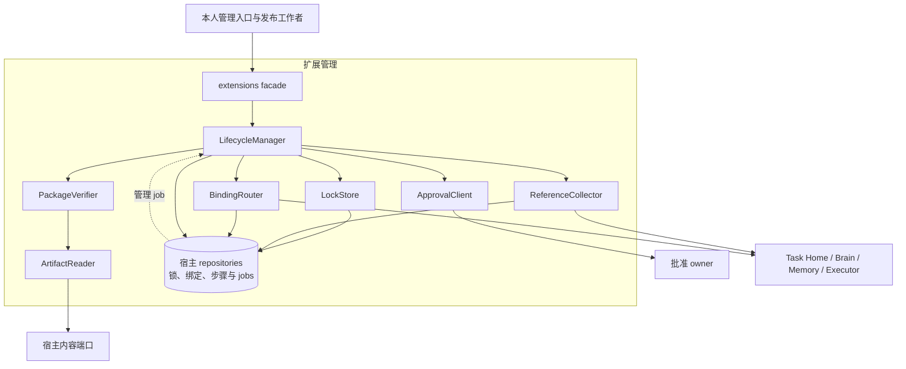
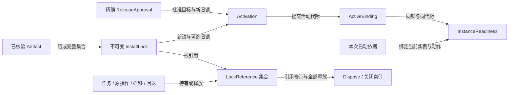
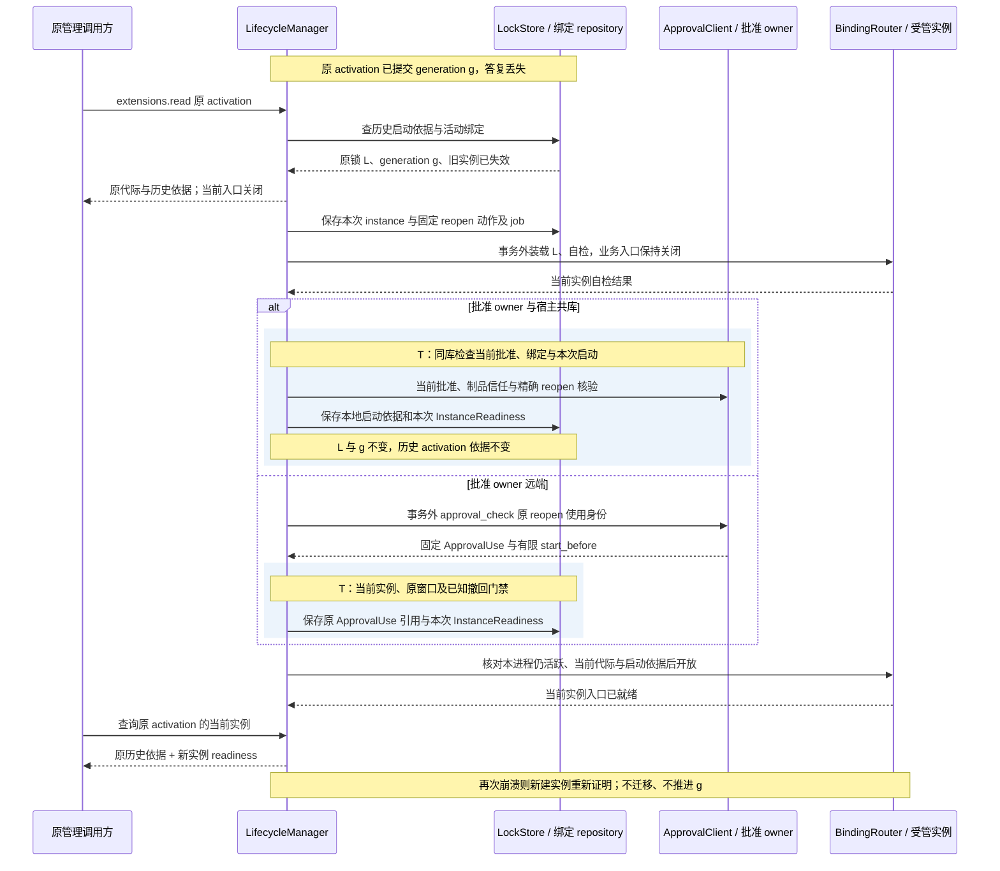
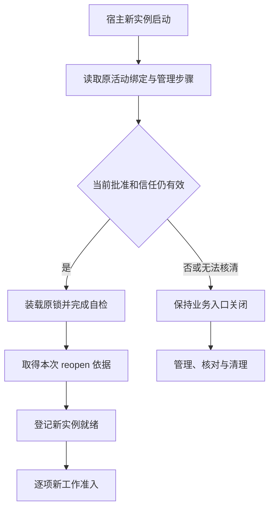

# 宿主装配、首装与组件切换实现

[模块主线](README.md) · [批准与评测](../evaluation/implementation.md) · [线字段](../contracts/protocol.md)

本页给出参考宿主的安装目录、账本、生命周期和重启算法。
制品安装、运行批准、活动绑定和进程就绪是四类事实。
每一类有独立的持久成功点；把包解压成功或端口探活当作发布成功都不成立。
默认组件与替换实现都遵守同一能力合同。

## 1. 模块形状、最小宿主与依赖

扩展管理是受信宿主内的装配包；对外 facade 为 extensions 方法处理器，对内由 LifecycleManager 组织准备、排空、切换、停用与恢复。
PackageVerifier 实现制品约束，LockStore 和 ReferenceCollector 管理持久锁及引用，BindingRouter 是业务派发实际经过的就绪门禁。
ArtifactReader 和 ApprovalClient 是内容及批准端口的适配器；LifecycleManager 通过持久 management_jobs 继续耗时步骤，不把网络、装载或驱动核对放进数据库事务。
这是一组依赖受限的内部组件，不要求新增服务框架或把每个组件部署为进程。

最小宿主包含身份、账本打开、制品校验、管理命令入口与恢复调度。
它由用户安装的受信发行程序启动，属于明确的信任根。
管理入口在受管组件尚未激活时仍能报告诊断、安装、批准和停用。
不要求尚未安装的 Brain 先批准自己，也不能把管理入口当作任意任务执行器。

| 内部模块 | 所有权与接口 | 不可越过的边界 |
| --- | --- | --- |
| ArtifactReader | 取得不可变内容及摘要 | 不执行包内下载、构建或安装脚本 |
| PackageVerifier | 验证清单、路径、依赖和信任证据 | 不能用包自述代替维护者或隔离验收 |
| LockStore | 发布完整 InstallLock 与依赖引用 | 不修改已发布锁的文件和配置 |
| LifecycleManager | prepare/inspect/drain/activate/deactivate/dispose | 保存原管理命令及恢复位置 |
| BindingRouter | 当前代际与本进程 readiness | 只派发到批准有效且实际就绪的实例 |
| ApprovalClient | 本地当前检查或远端有限回执 | 不签发用户业务 Grant |
| ReferenceCollector | 任务、原操作、迁移及回退保留引用 | 无法核清引用时不能删除旧包 |

最小宿主不依赖受管组件的正常业务队列处理停用和诊断。
任何默认组件也不得直接改另一个模块的业务表。
同进程接口用于保持职责和减少误用；不构成对恶意原生代码的隔离。
任意来源原生代码只有隔离平台通过验收后才可装载。

图例：实线表示同步依赖；指向 repositories 的实线为事务读写，虚线为持久管理 job 的领取。ArtifactReader 读取准确内容，ReferenceCollector 在事务外核对原责任，BindingRouter 向精确就绪实例派发。ApprovalClient 访问当前批准：批准 owner 共库时参与同一事务，远端时在事务外调用；图中节点不代表独立服务。
BindingRouter 的进程内入口与持久就绪记录共同构成开放条件，单独写一行 ready 不会令尚未装载的进程可用。
任何一步缺失时，管理入口可达，业务派发保持关闭。

extensions.list 由现有查询入口读取本 owner 的 Activation 仓储，复用 extensions.read(kind=activation) 的当前披露策略。共享存储中的有限 collection_queries 保存认证范围、query_id、原参数、按 ID 排序的成员、期限与位置；页读取不固定旧记录修订，也不跨请求持有事务。查询槽、扫描上限、权限变化失效、partial 与提示合并统一按[集合恢复契约](../contracts/protocol.md#collection-snapshots)实现；此表仅为临时查询状态，不增加全局目录或业务 owner。

## 2. 干净安装与两类发布

安装器核验发行包摘要、受信来源和随包契约证据。
发行报告必须绑定实际制品及依赖、平台和配置范围；不接受只写“已测试”的文本声明。
目标机器环境与证据覆盖范围不符时，本机预检必须补齐差异或拒绝启用。
离线首装可使用已核验的随包材料与本地批准，不必联络云端评测服务。

| 场景 | 必需证据 | 批准及激活 |
| --- | --- | --- |
| 首次内置装配 | 受信发行来源、固定契约报告、目标环境预检 | 本人受信确认后建立本地 compatibility 批准；old_lock_id=null |
| 普通兼容发布 | 精确制品契约、安全前提、状态格式兼容证据 | compatibility 批准；不声明相对能力改善 |
| 改善发布 | 完整正式保留资格、改善及相关质量门禁 | improvement 批准；不得把失败结果自动降级为兼容发布 |

首装走普通兼容发布的证据类型，不要求虚构一个旧版基线。
契约报告可以在可信构建环境形成，本机仍执行目标平台与就绪检查。
批准由用户或获准维护者保存，候选插件和模型不能自签。
首装 UI 把预先固定的 evaluation.approve 命令交给批准 owner 的 confirmation.request/read/decide 入口。
批准 owner 在同一业务事务消费确认并建立本地批准；最小宿主不使用独立 UI 数据库中的“已批准”标记。
首装器通过 ReportSealer 的受信 conformance 导入端口核验随包报告签名、精确制品及环境范围，再保存本地只读报告记录。
导入保留原报告的环境和运行来源，并另记本机预检；不能把外部报告重标为本机刚完成的运行。
普通调用方没有直接写入报告的公共接口，缺失可核验材料时需先运行 compatibility_check。
安装某组件不授予读取用户文件、发云或控制设备的业务权限。

首装事务先写唯一 InstallLock，再由批准管理创建本机有限目标的 ReleaseApproval。
原 activation_id 以空旧锁和 expected_generation=0 接纳；重投不能再创建第二个初始绑定。
启用失败保留原管理命令、缺失依据和暂存引用。
用户可修复依赖或停用；没有“忽略未通过证据并假装就绪”的默认路径。

## 3. 目录和制品原子发布

| 路径类别 | 用途 | 写入规则 |
| --- | --- | --- |
| staging/prepare_id | 下载和展开临时制品 | 独立目录，限制总字节、文件数、深度 |
| artifacts/digest | 已核验不可变制品 | 内容同步后原子发布；不可就地覆盖 |
| locks/lock_id | 锁定清单与配置引用 | 权威在数据库；导出文件仅便于诊断 |
| runtime/instance_id | 进程局部状态及安全句柄 | 重启重新建立，不作为历史业务事实 |
| migrations/step_id | 已登记迁移步骤产物 | 原步骤可查询，不因进程重启重跑副作用 |

展开前拒绝绝对路径、路径逃逸、越界符号链接和重复覆盖入口。
对可执行文件只依据固定清单打开，不能用运行时“最新版本”解析替换路径。
依赖求解产出有限、无冲突的完整集合，实际下载摘要必须逐项匹配。
依赖包含平台条件时，锁记录最终平台与选择结果。

内容先同步，再在短事务中发布制品可用记录和 InstallLock。
下载中断或事务未提交的暂存目录可以清理；已有持久引用的对象不能当孤儿删除。
prepare 同命令返回原锁；参数变更需要新命令及新锁。

## 4. 管理账本与索引

| 表 | 键及必要索引 | 权威事实 |
| --- | --- | --- |
| artifacts | digest UNIQUE | 实际字节位置、大小、校验及信任证据 |
| install_locks | lock_id UNIQUE | 清单、完整依赖、配置、平台与格式声明 |
| lock_references | (lock_id, owner_kind, owner_id) UNIQUE | 任务、执行操作、迁移、回退和管理引用 |
| activations | activation_id UNIQUE；(target, created_at) | 精确新旧锁、批准、预期代际及历史激活依据 |
| active_bindings | (target_id, port) UNIQUE | 唯一当前 generation 与 lock_id |
| instance_readiness | (target_id, instance_id, generation) | 本次装载检查及启动依据，重启失效 |
| lifecycle_steps | (activation_id, step_kind) UNIQUE | 原步骤状态、已知效果及查询责任 |
| migration_steps | (activation_id, domain, step_id) UNIQUE | 格式迁移前置、幂等键及结果证据 |
| management_jobs | job_id；(state, next_run_at, priority) | 排空、装载、停用和原责任查询 |
| closed_extension_keys | (scope_hash, command_id) UNIQUE | 最小关闭索引，阻止旧管理命令重新执行 |

锁引用的增加与业务对象接纳在同事务或持久交接中完成。
跨领域不能通过遍历当前进程对象推断全部引用。
停机中的 Executor 仍可能持有原操作；其账本未确认释放时保留驱动制品。

引用集合维护单调 reference_revision。
dispose 同时比较 expected_revision 与 reference_revision，避免检查后新任务取得引用。
清理成功保存关闭索引；晚到的旧 dispose 或 prepare 命令不会重新发布已经清理的相同身份。

### 对象关系与持有者流转

下图表示引用关系和有权改变引用的事实，不表示先安装就必然会激活。活动绑定可持续跨越多次进程重启，当前实例就绪随实例重建。

| 对象链 | 创建与持久化 | 交接、消费与归并 | 清理边界 |
| --- | --- | --- | --- |
| 临时内容 → Artifact → InstallLock | ArtifactReader 取得准确字节；PackageVerifier 校验后先耐久发布字节，再由 LockStore 提交完整锁 | 后续管理和业务只传锁及摘要引用，不重新求解最新依赖 | 未发布临时内容可清理；已发布内容需全部锁引用释放 |
| 管理命令 → Activation → LifecycleStep / job | LifecycleManager 保存精确目标、新旧锁和预期代际，同事务建立原恢复工作 | Worker 沿原 activation 和步骤查询、排空、迁移及装载；重复领取不产生新切换 | 管理正文可按期清理，原命令身份与实际步骤关闭摘要保留 |
| Activation → ActiveBinding → InstanceReadiness | 切换提交形成历史启动依据与活动指针；每次实例装载另留自检和当前启动依据 | BindingRouter 同时核对持久代际、当前实例和实际入口；重启仅重建当前 ready，不覆写历史依据 | 旧 ready 不授予新实例资格；原 activation 仍解释历史版本变化 |
| 业务持有者 → LockReference → Dispose | 新持有者接纳责任时登记引用或持久交接；未知责任仍占用原锁 | ReferenceCollector 汇集各 owner 的释放事实并推进 reference_revision；dispose 条件事务与新引用互斥 | 最后引用释放前不可删驱动、回退锁和迁移所需格式；删除后保留关闭索引 |

ReleaseApproval 的当前有效性归批准 owner，扩展只保存准确引用与取得的启动依据。
LockReference 是跨 owner 责任的本地索引；若交回缺失或 owner 不可达，缺失不会归并成“零引用”。
新持有者尚未完成引用登记前不能使用锁，防止清理与首次使用之间出现无记录窗口。

## 5. 激活事务与排空

activate 接纳只固定切换意图和后续 job。
事务锁目标活动绑定，核对原新旧锁、期望代际和批准可查询性。
同一目标竞争切换只有一个预期代际可成功，失败方得到 generation_conflict。
已接纳动作不会因为管理命令 expires_at 到期而丢失恢复责任。

排空先关闭向旧绑定的新任务接纳，再通知相关领域持有者到达交接边界。
任务中的版本锁不改变，已经进入的决策、模型调用、原执行操作继续沿旧绑定核对。
不存在“超时后假定旧调用已消失”的排空成功。

| 持有者 | 可以释放引用的事实 | 不能作为释放依据 |
| --- | --- | --- |
| Task Home | 任务不再使用该锁，全部原操作已有独立可保留绑定 | UI 显示任务结束 |
| Brain | 原物理调用终结或其未知责任仍有可查询负责者 | HTTP 超时 |
| Executor | 原动作效果及驱动查询责任已交接 | 旧进程被杀 |
| Memory | 数据格式、索引及原写责任可由目标版本读取 | 新版读了一个样本 |
| 发布管理 | 回退保留窗口结束或有新明确保留策略 | 新版刚刚 ready |

排空期限达到时转 blocked，并保存具体阻塞引用。
新版本不能接管同一个 operation_id 并再次执行。
只有显式声明且验收了状态和资源隔离的无状态实现，才允许旧任务保留旧实例并存。
默认仍按排空切换，避免把并存作为所有扩展的隐含要求。

## 6. 激活依据与实例就绪

激活是改变目标活动代际；实例重开是在当前代际上装载新进程。
两者不能合并，否则重启可能重复迁移，或错误复用旧实例授权。

| 对象 | 固定内容 | 可以随重启变化的内容 |
| --- | --- | --- |
| Activation.startup_evidence | 原 activation_id、锁、批准修订及提交依据 | 不变 |
| Activation.activation_use_id | 远端原激活使用身份；本地可缺省 | 不变，不作为当前实例依据 |
| Activation.instance_readiness | 当前 instance、当前代际、自检及新启动依据 | 每次进程实例重建 |
| Activation.revision | 本 owner 持久可见投影修订，独立于 generation | phase／ready／残留变化同事务递增并写提示责任；read、list、Change 共用该修订，迟到低修订不可覆盖 |
| ActiveBinding | target、port、generation、lock | 只在新激活时推进 generation |

本地共库 `startup_evidence.kind=local_transaction` 保存批准修订、commit_id、实例及动作身份。
当前批准检查、动作启动登记与活动指针更新在同一短事务中提交。
本地证据没有 start_before，也不伪造远端 ApprovalUse。

远端 `startup_evidence.kind=remote_use` 绑定已取得的 ApprovalUse。
实例必须在原 start_before 内登记原动作，且实际启动门禁再次核验。
时间窗口过期且确知动作未开始时，可创建新的使用申请，旧依据仍保留。
未知是否已经提交时先查原 activation，不换 activation_id 再切一次。

### 活动提交后崩溃：恢复当前实例

以下时序从原 activation 已提交、答复丢失开始。它展开 LifecycleManager、存储、批准适配器和实际入口的关系；首装与切换的宏观流程仍见模块入口。
P 表示已经存在的原批准，图中的共库分支与远端分支互斥。

原 management job 与 reopening job 先查自己的持久结果，再决定是否需要外部调用。
远端批准答复丢失时查询／重投原使用身份，取得的窗口保持不变；窗口已过且已证实本次未启动时才申请新的使用身份。
共库事务与撤回竞争按同一提交顺序裁决；远端取得依据后也必须在开放入口时核对已知撤回和窗口。
装载、自检或批准失败均保留管理查询和原责任恢复，不能返回当前 ready；历史激活记录不因此被删除。
当前查询投影按已有 blocked / disabled 等事实表达入口关闭；phase=active 仍要求真实的当前实例 ready，不能用历史成功替代。

## 7. 重启和批准撤回

若原激活尚未提交，沿原步骤继续排空或装载。
若新代际已经提交，重新装载该锁，不再进行格式迁移或增加 generation。
重开使用 `action_kind=reopen`、新的固定 action_id 和当前 instance_id。
这个动作只恢复原组件入口，不授权新版本、目标或配置。

历史 startup_evidence 保持原实例；当前 instance_readiness 绑定新 reopen 依据。
新实例不继承旧实例的离线租约；远端批准服务不可达时保持业务入口关闭。
本地批准共库且完整时可本地核验，不依赖公网。

获知批准撤回、到期或制品信任失效时，先禁止新工作与新的重开。
已发生效果、查询责任和费用不因停用消失。
受信旧实例可以处于仅核对模式；代码本身不可信时停止运行，并如实显示无法查询的原责任。

## 8. 停用、回退与格式迁移

deactivate 锁目标当前代际，验证管理身份与原 activation。
关闭 BindingRouter 的新入口与写停用回执同事务提交。
结果分别给出 new_use_disabled、previous_version_ready 和 residual_work。
残留非空不妨碍报告已经停止新使用，但不能报告全部责任结清。

回退是新的精确旧锁激活，不是恢复整个数据库备份。
必须已有批准允许的 rollback_lock，且旧版本仍可信、能读新版写下的全部现存格式。
任何授权撤销、删除、消费和外部操作事实都不能随软件版本回退。

迁移先保存固定 migration_step_id 和前置格式摘要。
迁移适配器必须可查询原步骤，给出重入及完成判据。
只支持执行而不能判断先前执行结果的迁移不得用于自动切换。
迁移已经提交后进程崩溃，恢复只核验目标格式并装载，不能再次执行迁移副作用。

不可逆迁移在批准前声明无法自动恢复旧版。
失败时可停用并提供诊断、导出及修复入口，不能假称已回退。

## 9. 清理、容量和错误恢复

制品清理分准备删除、物理删除、关闭索引三个步骤。
只有全部引用已释放时可进入物理删除，删除失败沿原管理命令重试。
清理掉字节不等于可以删除原命令幂等身份。
关闭索引保留锁摘要、原管理身份及关闭类别，受控正文与日志按保留期清理。

| 错误 | 调用方动作 | 仍须保留 |
| --- | --- | --- |
| package_invalid | 修正制品，以新摘要准备 | 原拒绝回执 |
| dependency_conflict | 形成无冲突完整锁 | 已接纳原准备身份 |
| isolation_unavailable | 选择已验收平台或受信包 | 不运行不可信代码 |
| approval_inactive | 取得新的受信批准 | 原激活及撤回事实 |
| generation_conflict | 读取当前绑定再决定新切换 | 不覆盖赢家的活动代际 |
| drain_blocked | 核对原责任或明确停用 | 旧驱动、原操作与未知费用 |
| state_incompatible | 选择兼容锁或批准独立恢复方案 | 当前数据与迁移证据 |

宿主限制暂存字节、包数、依赖深度、并存锁数和排空并发。
空间接近保护水位时拒绝新准备，预留停用和恢复账本空间。
管理 job 有独立有限工作槽，不能被普通模型任务占满。

### 生产部署、扩展单位与热点

宿主部署遵守[公共可用性策略](../deployment-production.md#availability)与[容量和过载策略](../deployment-production.md#capacity)。
扩展管理随目标宿主运行；发布工作者可以跨目标并行，活动指针仍由每个目标的固定权威裁决。
云端替换管理进程可以接续同一数据库的 job，但目标进程的装载与 ready 必须重新取得；进程替换不等于迁移 Task Home 或重新激活一个代际。
默认按目标排空切换，以暂停该目标的新工作换取清晰的原责任归属。只有已证明状态和资源隔离的无状态实现才可并存；下载并行不会自动满足这个条件。

| 扩展单位 | 串行位置 | 依赖或节点故障的表现 |
| --- | --- | --- |
| 下载与制品校验工作者 | 同摘要发布、同 prepare 命令与完整锁提交 | 内容不可读或摘要不符则 prepare 未完成，原临时数据可恢复；不发布半锁 |
| 每目标 LifecycleManager | target / port 的 generation、原 activation 与 migration step | 目标失联保持切换未知或 blocked；原端隔离未证明前不在另一端重复迁移或接管原操作 |
| BindingRouter 与当前受管实例 | 当前 target / instance / generation；逐次工作启动依据 | 共库权威不可用或当前批准不可核验时关闭对应新使用；已记录的收尾沿原责任继续 |
| ApprovalClient | 同一精确动作和使用身份 | 远端不可达时不开放新实例；存活实例仅可在已有明确有限依据内工作，不能刷新窗口 |
| ReferenceCollector 与清理 job | 同 lock 的 reference_revision、删除状态及持有者索引 | 任一持有者未知则保留原包；空间不足先拒绝新准备，不能删除待核对驱动 |

容量瓶颈通常分为下载字节与磁盘暂存、制品核验 CPU、单目标排空等待、批准往返和长期锁引用增长。
不同目标的准备与核验可并行；同目标同端口不能通过多个 LifecycleManager 同时提交来提高切换速度。
制品摘要和完整锁可缓存，当前批准、制品信任状态和本实例 ready 必须按原门禁检查；缓存安装成功不能授权新启动。
发布批次限额约束同时排空目标数，避免一批更新耗尽服务的剩余可用容量；具体值由目标负载和恢复演练测定，不在此新增规模承诺。

记录各阶段耗时、最老未解排空引用、每个目标的旧/新代际与当前实例、拒绝新使用原因、暂存与并存制品字节、批准依赖延迟、迁移恢复次数和清理积压。
报警应区分“历史已激活但当前未 ready”与“尚未提交切换”，否则自动修复可能重复迁移。
下载和批量准备超限时排队或拒绝新工作，停用、撤回、原步骤查询和清理保留独立工作槽。
扩容前先测独立目标的并发收益和单目标的等待来源；单个驱动未知责任不能靠增机器或强删锁来解除。

## 10. 故障实验

| 实验 | 注入位置 | 预期事实 |
| --- | --- | --- |
| X-I01 | 空目录首装，尚无评测服务或模型 | 管理入口可启动；有效兼容证据与批准后才有业务入口 |
| X-I02 | 解压路径逃逸、半包、摘要不符 | 无可激活锁，不执行任何包脚本 |
| X-I03 | prepare 事务提交后答复丢失 | 同一锁和原回执，依赖不会再次求解为新版本 |
| X-I04 | 同代际并发 activate | 最多一个活动绑定，另一方明确冲突 |
| X-I05 | 旧 Executor 有未知副作用 | blocked 并保留旧驱动，新驱动不重发原 operation |
| X-I06 | 活动指针提交后立即崩溃 | 恢复原代际，自检及本次依据完成前无新派发 |
| X-I07 | 新实例复用旧 ApprovalUse 或租约 | 拒绝重开，历史激活仍可查询 |
| X-I08 | 本地共库激活与撤回竞争 | 同事务顺序裁决，不要求伪造在线回执 |
| X-I09 | 远端回执后撤回，通知延迟 | 已知撤回立即关入口；未知端仅受原有限窗口 |
| X-I10 | 迁移提交后崩溃再恢复 | 迁移只核对不重做；数据历史不回滚 |
| X-I11 | dispose 与新引用并发 | 引用修订冲突，仍被需要的包不删除 |
| X-I12 | 已删除锁的旧命令重放 | 最小关闭索引阻止重新安装或再次清理副作用 |

每项实验记录原管理命令、代际、实例、批准与实际派发记录。
字段合法、状态序列正确只能证明记录一致，不能证明进程真正停止或磁盘写入耐久。

## 11. 管理接口的查询投影

extensions.read 的 kind=install_lock 返回不可变锁和引用修订。
kind=activation 返回切换阶段、历史启动依据、当前实例就绪及残留。
调用者必须按 kind 解析，不能把安装锁的存在解释为活动组件。

| 写接口 | applied 的边界 | 后续查询 |
| --- | --- | --- |
| prepare | 字节完整且锁耐久可用 | install_lock |
| activate | 切换意图及后续工作已接纳 | activation |
| deactivate | 新使用入口已经封闭 | activation 的残留与旧版就绪 |
| dispose | 已删或阻塞决定已保存 | 原回执及引用修订 |

同一管理命令的原回执不可因进程重启更换 decided_at。
原包清理后读取可以返回 gone，关闭索引仍拒绝该原身份重新执行。
