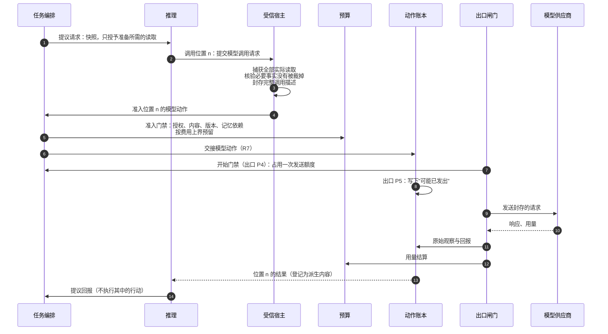

# 模型调用：准备、准入、发送与恢复

| 日期 | 修订说明 |
| --- | --- |
| 2026-10-05 | 初版：把分散在任务编排、推理接口、出口闸门、动作账本、预算和内容治理中的模型调用规则串成一条流程，只链接、不新增规则。 |

- 状态：草稿
- 读者：实现推理宿主、模型出口和恢复逻辑的开发者
- 读完之后：知道一次模型调用经过哪些模块、在哪里持久化、崩溃或超时后从哪里恢复，以及每条规则的权威位置
- 上游：[核心契约 2.6](../core/contracts/README.md#26-四道门禁)、[任务编排 4.1](../core/tasks/README.md#41-创建任务与请求推理)、[推理接口](../ports/reasoner/README.md)、[出口闸门 4.1](../core/egress/README.md#41-正常调用)

**本文只编排流程，不新增或修改规则。**每一步的规则以链接的章节为准；本文与它们冲突时，以它们为准并修正本文。

## 1 要点

模型调用和其他外部动作一样：先准入，再经出口闸门发出，用量记入预算。它与普通动作的区别只有两点：

1. **准入的对象必须是确定的调用。**推理可能先检索材料再调用模型，所以先由受信宿主固定完整的调用描述，再准入；准入之后不得再改变输入。
2. **一次提议请求可能调用多次模型。**每次调用由"提议请求 + 调用位置"标识，推理崩溃后按同一位置拿回原结果，不重复发送和计费。

## 2 一次调用的经过

| 步骤 | 做什么 | 权威位置 |
| --- | --- | --- |
| 提议请求 | 任务编排登记提议请求和快照，只授予准备所需的读取；此时推理还没有模型发送资格 | [任务编排 4.1 第 4 步](../core/tasks/README.md#41-创建任务与请求推理)、[推理接口 2.1–2.2](../ports/reasoner/README.md#22-提议请求) |
| 封存调用描述 | 受信宿主捕获实际读取、生成完整调用描述；不接受推理自报的输入摘要 | [推理接口 3](../ports/reasoner/README.md#3-接口) |
| 准入 | 对确定的调用描述执行准入门禁，工作类别可以是"准备"（解释新输入、整理条件） | [核心契约 2.6](../core/contracts/README.md#26-四道门禁)、[任务编排 4.1 第 5 步](../core/tasks/README.md#41-创建任务与请求推理) |
| 预留 | 按费用上界预留；费用上界未知的调用不准入 | [预算 4.1](../core/budget/README.md#41-准入执行与结算) |
| 开始与发送 | 出口 P4 核验并占用发送额度，P5 写下"可能已发出"后才发送；适配器追加的任何内容都会被拒绝 | [出口闸门 4.1](../core/egress/README.md#41-正常调用)、[出口闸门 4.2 模型一行](../core/egress/README.md#42-各类出口的执行要求) |
| 回报与登记 | 原始观察、用量、输出分别交给动作账本、预算和内容治理；输出是派生内容 | [出口闸门 4.1](../core/egress/README.md#41-正常调用)、[内容治理 4.2](../core/content/README.md#42-摘要索引嵌入记忆与模型输出) |
| 提议回报 | 推理解析提议，不执行其中的行动；任务编排检查代次和版本后裁决 | [推理接口 4](../ports/reasoner/README.md#4-关键流程) |

## 3 两种额度

| 额度 | 何时占用 | 何时不占用 | 权威位置 |
| --- | --- | --- | --- |
| 调用位置 | 新位置的模型动作准入时 | 重取已有位置的结果 | [推理接口 2.1](../ports/reasoner/README.md#21-上下文快照) |
| 实际发送 | 每个新的发送身份在出口 P4，包括账本批准的安全重发 | 查询或重投同一发送 | [核心契约 2.6 开始-5](../core/contracts/README.md#26-四道门禁)、[预算 4.1](../core/budget/README.md#41-准入执行与结算) |

M1 两种额度都是 1；需要安全重发时，核心事先分配额外的发送额度。

## 4 三种"再来一次"

"重试"在模型调用里有三种完全不同的含义，不得混用：

| 情况 | 怎样处理 | 占用 | 权威位置 |
| --- | --- | --- | --- |
| 推理崩溃后重新运行，又走到已有位置 | 同位置、同描述：返回原结果，不再发送；同位置、不同描述：报冲突 | 不占任何额度 | [推理接口 3](../ports/reasoner/README.md#3-接口) |
| 发送结果未知，账本按 G1 安全重发 | 沿用原动作和原尝试标识，重新通过开始门禁；只在供应商能力允许时进行 | 一次发送额度和对应费用 | [动作账本 4.2](../core/ledger/README.md#42-结果未知后由能力组合决定策略)、[核心契约 2.6 重试门禁](../core/contracts/README.md#26-四道门禁) |
| 补充材料、换模型、新的采样 | 使用新的调用位置，重新封存和准入 | 一个新位置、新的预留和发送额度 | [推理接口 3](../ports/reasoner/README.md#3-接口) |

## 5 故障后从哪里恢复

| 故障 | 从哪里恢复 | 不得做什么 | 权威位置 |
| --- | --- | --- | --- |
| 准入回执丢失 | 按原命令查询准入决定 | 新建命令重复准入 | [推理接口 5](../ports/reasoner/README.md#5-故障与恢复) |
| 推理进程崩溃 | 新工作者读取原提议请求，按调用位置拿回已有结果 | 因缓存消失就直接重发 | 同上 |
| 出口进程崩溃 | 写下"可能已发出"之前且能证明未发出的，按记录继续；之后的保持未知 | 把"记录了但实际没发"当成没发 | 同上；[出口闸门 4.1](../core/egress/README.md#41-正常调用) |
| 模型响应超时 | 效果按未知处理，由动作账本按供应商声明的能力决定核对或安全重发；原动作的费用照常结算 | 把未知当成"没发出"；用新位置重新采样时，原动作的未知和费用不会因此消失 | [动作账本 4.2](../core/ledger/README.md#42-结果未知后由能力组合决定策略) |
| 调用描述无法重现 | 返回"准备不可恢复"，由核心决定是否建立新的提议请求 | 修改已准入动作的载荷 | [推理接口 4](../ports/reasoner/README.md#4-关键流程) |
| 输入在准备后被撤回或纠正 | 开始门禁拒绝发送 | 用旧内容继续发送 | [核心契约 2.6](../core/contracts/README.md#26-四道门禁) |
| 用量回报缺失或更正 | 保持未知或暂估上界，按计费来源对账 | 把未知当零 | [推理接口 5](../ports/reasoner/README.md#5-故障与恢复)、[预算 4.1](../core/budget/README.md#41-准入执行与结算) |

## 6 测试要点

本文不另列测试；验收用例在各权威文档中：推理接口第 10 节（调用描述与实际发送、出口次数）、任务编排第 10 节（模型输入在准入后变化）、出口闸门测试表（隐藏重试）。实现时用同一条执行历史串起它们：准备 → 准入 → 发送 → 超时 → 推理崩溃 → 按位置恢复 → 安全重发或保持未知。
