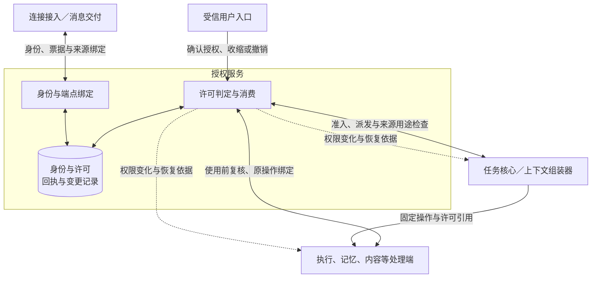
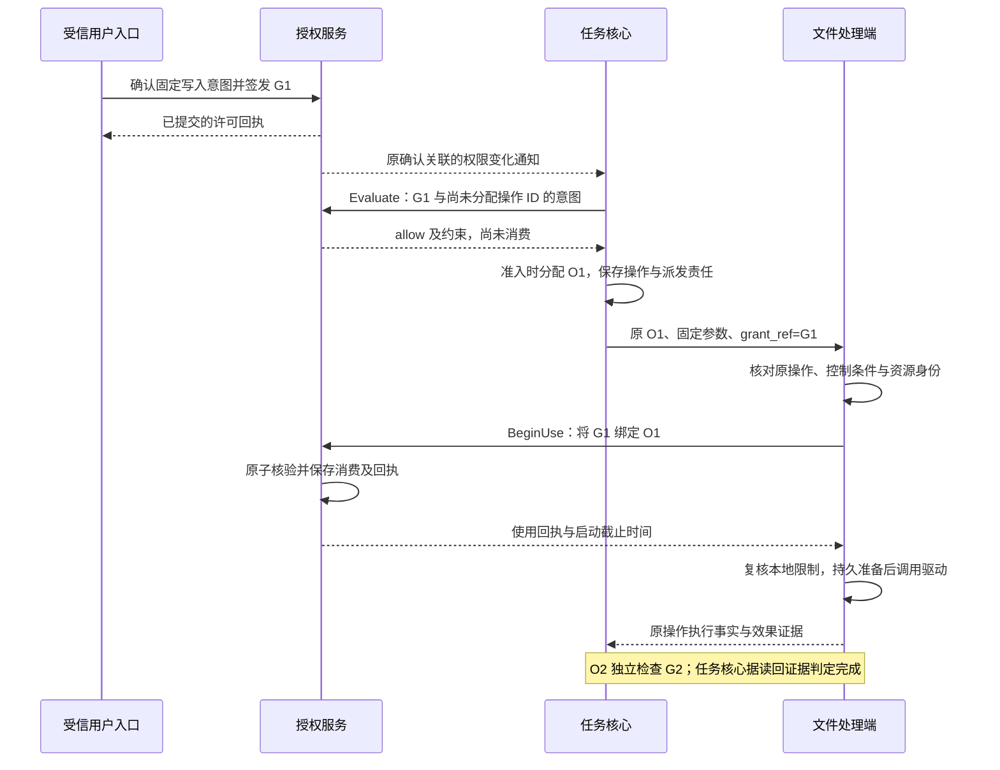

# 身份与授权详细设计

身份与授权为 Harness 提供受信身份、权限判定、许可签发与撤销。授权服务保存“谁在什么范围内获准做什么”的事实；任务核心据此决定是否推进，资源处理端在实际使用数据或启动行动前再次检查。许可通过不代表操作已经执行，撤销成功也不代表远端动作已经停止。

本方案展开[全景图](../diagrams/system-panorama.drawio)的 `authorization` 分组及其唯一组件 `authorizer`，落实“用户隔离”和“处理端复核”两项约束。图上 `coordinator ↔ authorizer` 的虚线表示执行协调器请求权限判定并取得答复；任务、记忆、连接等调用由现行正文补足，属于同一职责的展开。本轮不改变全景图分工。

这是设计契约，尚无运行实现。先读本页，再沿[判定、消费与恢复](mechanisms.md)理解行为；实现时查[身份与接口](contracts.md)，评审和落地查[验证与依赖](validation.md)。依据为[项目目标](../../harness-project-goals.md)、[端云协议](../endpoint-cloud-protocol/README.md)及[任务内核](../task-kernel/README.md)，不沿用归档中的默认选型。

## 1. 范围与实施入口

首期采用**每用户一个授权写权威、在线判定、按操作绑定的单次许可**。写权威是对该用户身份、许可与撤销序列作唯一提交裁决的授权存储，与任务写权威职责不同，可在同一部署共用数据库产品。端点失联不会自动获得签发权限。

| 范围 | 本方案选择与启用条件 |
| --- | --- |
| 默认闭环 | 用户登录与端点登记、连接票据、持续／单次许可、逐用途判定、收缩委派、撤销、原操作核对；逻辑接口可先在同进程接入 |
| 条件能力 | 离线许可须同时具备本地持久消费账本、可信时间、活动所有者隔离及受信许可分发；缺一项就不签发或不使用离线许可 |
| 当前依赖缺口 | 资源规范化及约束执行、可信用户确认入口、端点隔离适配器、跨端授权连续同步均需提供方实现和验收；缺失时分别拒绝相关资源、拒绝新增授权、禁止接替、保持恢复受限 |
| 后续范围 | 不可信中继、跨用户共享、企业角色管理、外部 Agent 自行签发、身份迁移代理、任务控制权交接；本轮不为这些能力增加许可继承规则 |

本方案定义身份模块的内部提供方接口，不向 v1 信封增加字段，也不把新接口当作已有 WSS 消息。跨端同步的标准载荷仍是[待决提案 P1](validation.md#proposals)；同进程实现可以先验证完整闭环。现有端云方案中的“身份能力待实现”仍成立。

本模块直接承担 C7，支撑 C2 的用途和驻留约束、C4 的行动复核、C5 的离线与恢复、C6 的扩展主体、C8 的授权审计及 C9 的发布权限。C1 的计划、C3 的检索和 V1 的取证都使用相同检查；V2 另验证设备操作、中断与接管。A1–A4 通过逻辑服务与处理端分工、可替换认证适配器及共同接口实现，实际成熟度按[验证矩阵](validation.md#tests)取得证据。

## 2. 事实归属与协作边界

**主体**是经认证或受控委派确定的行动者，用户、端点和 Agent 分别标识；**许可**是授权权威保存的有限权限记录；`grant_ref` 只是该记录的引用，持有引用本身不能使用权限。**活动所有者**是获准使用端点持续账本的运行实例，与登录会话、任务控制方的 `owner_epoch` 分开。

图从权限使用链看分工。实线表示请求／返回，虚线表示变更通知；通知促使重新核对，不能直接证明资源已停止使用。框内三部分是授权服务内部职责，不新增全景图组件。

| 交接：发起方 → 处理方 | 输入 → 输出及成功含义 | 持久责任与失败后的继续者 |
| --- | --- | --- |
| 用户入口 → 授权服务 | 受信确认、固定请求范围 → 授权回执 | 授权服务保存确认、许可、变更及回执；入口按原请求查提交未知。普通模型文本或 UI 点击事件不能自行成为确认凭据 |
| 连接接入 → 授权服务 | 已认证 HTTPS 上下文、endpoint_id → 单次票据；hello 中票据 → 会话绑定 | 票据消费与会话绑定由身份存储原子保存；网关只在消费成功后 welcome；失败重新申请票据，不改旧业务消息身份 |
| 任务核心／组装器 → 授权服务 | 受信身份、具体资源动作、用途、来源 → 判定与缺口 | 核心保存采用的判定和工作阻塞；判定不消费单次次数；权威不可达时由原工作等待、有限重试 |
| 资源处理端 → 授权服务 | 原操作、固定意图、处理端身份 → 操作绑定的使用回执 | 授权服务保存单次占用；处理端保存实际启动、效果和后续责任。授权提交未知只查原键，不启动；执行结果未知由执行端查原操作 |
| 消息交付 → 授权服务 | 恢复轮次、端点所有者、所需行为 → 当前授权切点、连续接续与缺口 | 授权服务保留快照／增量依据；交付模块汇集各领域结论后放行，处理端继续复核；缺口重建快照 |
| 记忆／内容／观测／扩展 → 授权服务 | 资源、用途、接收方与保留需求 → 有限权限和可执行约束 | 各处理端保存资源事实并执行约束；授权服务不代替资源删除、效果核验、沙箱隔离或任务预算账本 |

以上交接复用现行[可信 RequestContext](../task-kernel/storage-and-interfaces.md)、[处理端复核](../task-kernel/README.md)、[票据接入](../endpoint-cloud-protocol/transport.md#session)和[领域恢复](../endpoint-cloud-protocol/recovery-and-control.md#resume)，本次补齐身份模块侧规则。尚无详细设计的邻接模块必须按验证依赖实现其一侧，不能仅因函数可调用就宣称端到端成立。

## 3. 关键选择与代价

| 选择 | 依据与主要代价 | 何时改变选择 |
| --- | --- | --- |
| 在线使用不透明引用，由权威查许可；不把全部权限塞入长寿命会话令牌 | 与现有 `grant_ref` 一致；当前撤销、用途及单次竞争可在一处裁决。代价是在线依赖与每次实际使用的存储访问 | 明确需要离线且能接受有限撤权延迟时，签发专用离线许可，不能把普通缓存升级为许可 |
| 有限的资源／动作／用途集合，加可判定的约束；首期不引入通用策略脚本引擎 | 可证明委派只收缩，拒绝未知语义；同类处理端容易互操作。代价是新资源类型需安装规范化器与约束执行器 | 出现不能用集合、区间和固定限制表达的真实策略时，再比较专用规则与策略引擎 |
| 一个子许可绑定一个父许可；使用一个完整覆盖请求的许可链 | 避免分别拼接“可读取”与“可外发”产生未经批准的组合；链深有界。代价是跨来源操作需要分别检查所有来源，并取得覆盖目的的许可 | 需要跨主体协同或多方批准时另定义组合语义，不能默认合并权限 |
| 单次许可在处理端使用时永久绑定原操作，失败不自动退回 | 准入检查、网络重投和实际使用次数不同；消费与外部效果不能原子提交。可能浪费一次许可，但不会将结果未知变成另一次行动机会 | 用户明确同意再次尝试时签发新许可、新操作，并保留原操作的核对责任 |
| 撤销先持久生效，再传播；已启动效果单独核对 | 网络隔离和外部副作用无法随数据库写入瞬间消失。必须向用户区分已撤销、已应用端点及在途效果 | 若特定设备要求更强停止保证，先证明其驱动的中断／隔离能力；无此证据就不承诺即时停止 |
| 授权记录采用事务存储，按用户分区 | 许可、单次占用、撤销修订、变更和回执需要原子提交；无需先拆独立授权微服务 | 单分区容量不足时先实测，再设计迁移与唯一写权威；不能用异步副本判定新权限 |

默认云端参考存储选择 PostgreSQL，单机端侧权威选择 SQLite；二者提供相同的条件提交契约，具体隔离策略及依据见[存储](mechanisms.md#storage)。这不要求任务内核、记忆和授权共享事务。

## 4. 贯穿场景：写入文件并读回

用户 U 在已登记电脑 E 上要求任务 T 将内容保存到文件 A，并读回核验。受信确认入口为固定写入意图签发单次许可 G1，明确路径、内容摘要、执行端 E、截止时间及本地用途；另授予 G2 允许对 A 读回并向该用户展示核验结果。此时尚无执行操作 ID：核心先检查意图获准，再在准入事务中分配 O1，处理端首次消费时把 G1 绑定 O1。写入许可不会隐含读取、长期记忆或云端同步权限。例中假设确认入口、文件规范化器和驱动已实现。

时序只表示 O1 的授权与执行交接；O2 读回按自身权限重复同一路径。大脑不持有登录凭据，也不能替换确认范围。

关键异常是“G1 已消费，文件可能已写入，响应丢失，此时用户撤销 G1”。授权服务保存撤销事实；处理端禁止继续凭 G1 启动，按 O1 保存或核对已发生的效果。任务核心不会退回单次额度或生成 O1 的替身。读取状态、读取文件内容、上报最小效果事实分别检查现有控制或披露权限：G2 仍有效时可读回，G2 也撤销时保持效果缺口，用户可以通过受信管理入口只批准原操作核对。具体分支见[撤销与恢复](mechanisms.md#revocation)。

许可签发与原确认请求绑定，核心按已保存的确认关联接收通知或调用 ReadConfirmation，取得 grant_ref 后重新 Evaluate；通知丢失不重新弹出确认或再签发。只有当前权限结论能解除权限 blocker，不能仅因“通知收到”就派发。原输入请求是否消费仍按[内核输入规则](../task-kernel/lifecycle.md)分别核对。

## 5. 核心保证

| 编号 | 设计保证 | 权威定义 |
| --- | --- | --- |
| I1 | 身份由受信入口建立；跨用户引用、伪造 source 和借用他人 grant_ref 均不能通过 | [身份绑定](contracts.md#identity) |
| I2 | 每次使用同时满足主体、资源、动作、用途、接收方、时间及全部来源限制；委派不能扩权 | [判定顺序](mechanisms.md#evaluation) |
| I3 | 单次许可只绑定一个固定操作；重复检查不消费，重试不退回或重绑定 | [消费边界](mechanisms.md#use) |
| I4 | 撤销与新授权消费有确定提交顺序；远端传播及已启动效果如实报告 | [撤销](mechanisms.md#revocation) |
| I5 | 离线权限不能超过签发边界；时间、账本或所有者无法验证时停新行动 | [离线与恢复](mechanisms.md#offline) |
| I6 | 恢复证明绑定本轮、端点与完整切点；旧快照、流 ready 或队列为空均不能代替授权恢复 | [连续同步](mechanisms.md#sync) |
| I7 | 身份、许可、回执及收尾记录按用户隔离，敏感正文不默认进入审计；过载不丢已接纳责任 | [持久化与容量](mechanisms.md#storage) |
