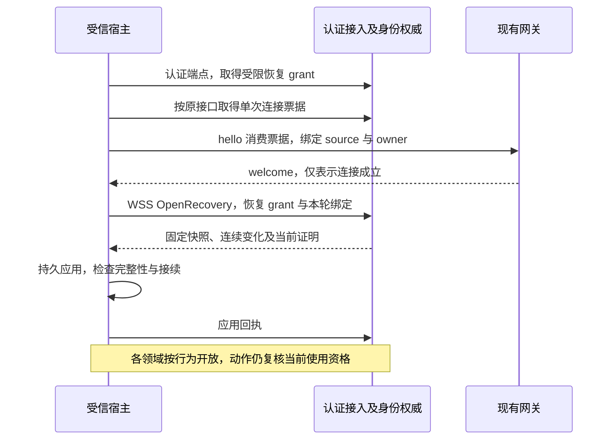

# 跨端授权、恢复与受信确认

[身份总览](README.md) · [内部接口](contracts.md) · [判定与离线机制](mechanisms.md) · [验收](validation.md)

身份 P1 已纳入设计。默认采用经现有网关的 WSS 领域消息，使云端与 NAT 后的端侧权威复用同一条持久交付和来源验证路径。身份接入、单次连接票据及首次恢复资格引导保留 HTTPS；目录和来源权威不必另开公网 HTTP 服务。该选择增加领域恢复状态与消息登记的实现责任，但避免再维护一套同步推送／轮询协议。当前只有规范和静态资产，不能据此宣布跨端实现可用。

## 1. 首次恢复的信任与受限引导

受信组装固定用户的身份权威、接入服务、端点与持久账本。原生／浏览器登录和本地 OS 身份沿[身份模型](contracts.md#identity)建立，不接受请求自报主体。云端用户的本地任务权威也继续使用原用户身份权威；本地独立身份不能借断网冒充云端签发方。

宿主向已认证的 `POST /harness/v1/recovery-grants` 提交 `endpoint_id` 与 `requested_authority`。接入服务从认证上下文取得宿主服务主体、用户及 owner，校验登记与账本资格，然后由指定身份权威签发或返回原受限恢复许可。身份权威不可达时拒绝新增／续期；接入服务不代签其他权威。返回 `bootstrap_grant_ref`、权威、端点、owner 代次、账本、固定到期及允许消息类型；请求／响应禁止缓存、凭据不进入诊断日志。该许可绑定宿主服务主体，不能交给 Agent 使用。

恢复许可只允许 `authorization.open_recovery/read_recovery/read_changes/apply_recovery/query_command`，其中查询仅限本端点恢复所产生的命令。允许集合与可披露的许可／主体由权威按登记角色限制；调用方提交集合只能收缩，不能凭猜测 grant_ref 枚举用户全部许可。接入根身份、端点登记与恢复 grant 都不赋予资源行动、正文读取、签发业务许可或批准用户请求的权限。运行账户禁用、端点资格失效或到期时立即拒绝新的恢复使用。

随后保持现有 `POST /harness/v1/connect-tickets` 请求／响应结构，票据经 hello 消费，网关固定用户、source、owner 和受信路由。welcome 后，交付可让已安装恢复消息按其专用资格先行；权威直接从自身当前账本验证该资格，不依赖调用端尚未恢复的许可快照。恢复消息仍携带真实 `authorization={grant_ref}`，不引入无授权 request 或额外核心 control。

## 2. 消息、作用域与连续恢复

下表类型均以 `harness.` 为前缀、`type_version=1`。请求与响应可靠交付，副作用请求的 envelope operation_id 等于 payload command_id；纯查询的请求身份不用于建立新的行动。字段由 [identity Schema](../endpoint-communication/schemas/identity.schema.json) 固定，跨字段关系由接收器核验。

| 类型 | 输入／输出与持久责任 | lane／作用域 |
| --- | --- | --- |
| authorization.open_recovery | 原 command_id、恢复轮次／owner／账本、所需集合与行为 → 固定快照、切点及清单；权威同时保存有限接续责任 | control；authorization／recovery_id |
| authorization.read_recovery | 原绑定、固定页游标 → 许可、祖先、用户／主体／端点状态、密钥及策略证明；分页不得混用切点 | recovery；同恢复轮次 |
| authorization.read_changes | 原绑定、已知修订 → 覆盖区间、变化与后续游标；空结果也必须证明区间已检查 | recovery；同恢复轮次 |
| authorization.apply_recovery | 原绑定、清单摘要、已应用水位与本地持久应用证明 → 原回执；只允许该端点当前 owner 上报 | control；同恢复轮次 |
| authorization.resolve／query_state | 精确 grant 或本人获准分页集合 → 当前许可／主体与最小证明；解析不授予行动权 | recovery；authorization／本次查询集合 ID；resolve 由受信目标 grant 解析固定集合 |
| authorization.delegate | 原父许可、目标主体及收缩申请、受信委派依据 → 子许可；验证单父链、不扩大任何用途／地点／期限／任务或操作绑定 | work；operation／command_id |
| authorization.query_command | 原命令 → 固定提交回执或未见／历史缺口；当前未见不证明未提交 | recovery；operation／原命令 |

`recovery_binding` 固定权威、恢复 ID、端点、owner 代次、账本、集合摘要与绝对期限。快照清单覆盖全部页及其摘要；页序号／数量必须匹配清单，累计字节及条目按部署有限配置。变化覆盖连续区间，不用消息 seq 替代授权修订。响应和应用证明同时绑定本轮与集合，旧 owner 或旧轮不能解锁。恢复快照有效期、日志保留和重试均有限，到期或缺页先关闭依赖行为，再重新开轮。

resolve、query_state 与恢复页用 grant_states 分别表达静态 Grant 的当前 active／revoked／expired 状态、单次消费状态和各已登记端点应用进度。continuous 的 consumption=not_applicable，不能被解释为只允许绑定一项操作；once 的 bound 必须保留原操作／意图／单元和启动截止。applications 按端点给已应用修订、原离线使用截止及 applied／unknown；applications_complete 只表示登记集合已枚举。未知应用不等于未执行，截止到达不证明物理停止。当前状态读取仍不能代替 BeginUse。

恢复消息在自身权限内先行；整个 work lane 不能被“停止新行动”一并封闭，已有获准事实仍可上报。需要暂停、撤销、来源及任务控制等多项条件时分别核验，授权恢复完成不替代任何邻接领域恢复。bootstrap 资格到期只影响后续恢复请求，不抹除已提交回执；换凭据后新查询仍指向原命令，不能给旧消息换身份或期限。

## 3. 主体、来源与有限使用

`authorization.evaluate` 在准入前传递尚无操作／单元 ID 的 evaluation_intent；`begin_use` 在操作分配后传递完整 use_intent：原操作、受信 actor、处理端、真实资源、动作、用途、接收方、处理位置、有限单元和来源角色、意图摘要、完整 source_bindings 及 operation_basis。入站服务先从会话与已保存的原操作确定这些关系，再比对载荷；声明字段不产生身份。`begin_use` 在许可使用权威提交占用，返回历史 use_receipt 和本次 current_decision；两者同时满足且原 start_before 未过才允许启动。`query_use` 只恢复历史，不授予新启动资格。

共享编码见 [domain-common](../endpoint-communication/schemas/domain-common.schema.json)。source_binding 是完整平铺来源闭包的一个精确版本，含来源权威、资源、修订、字节摘要、观察时点、策略修订、用途／接收方／处理端、保留截止及当前 proof_ref。闭包不完整、超限或未知约束拒绝；证明引用必须由所指权威经受信关联核验内容摘要、版本与期限，不能只因 proof_id 形似 UUID 放行。完整来源查询归 [source.prove](../content-and-provenance.md#remote)，字节及保留归内容权威。

operation_basis 固定原操作、任务控制（适用时）、预算（适用时）、来源摘要与生产者证明；身份权威验证处理服务与原行动 actor 两个主体，二者不合并。适用的控制／预算不能因为共享 Schema 字段可选而省略；无任务的一次本人管理操作才可按其动作模式不带任务控制。预算数额与约束由对应领域账本裁决，授权服务不自行增加额度。

共享单用途 budget 的 limits 映射到任务 target 或 cleanup 账本时保持同一预算／分配身份和 purpose，不重复预留；task-control 双限额描述两本账，usage_item 用 purpose 包装共享累计 usage。cost 同时核对币种、最小单位 scale 和 hard／estimated 保证，不能只比较数值。

线 Grant 显式保留 source_endpoints、处理端集合、完整 scope、单父引用、delegation_allowed／delegation_depth 及 policy_proof。无父的根许可必须有 confirmation_proof 且深度为 0，子许可深度为父加一并验证全部祖先；父不允许委派或任何包含关系不可判定时拒绝。资源条目以 selector_kind=exact／container 与 resource_type 解释 resource_ref，容器成员及包含关系由资源权威证明；参数策略、用途、接收方、处理位置、保留和可选 task／operation 绑定必须作为同一条目整体满足，不能跨条目拼接。

UseIntent 和准入 evaluation_intent 同时携带 parameter_schema_ref、parameters 内容引用及 required_obligations。参数内容按已安装动作 Schema 校验，并绑定真实规范化参数与 intent_sha256；验证方需获准取得这些有限字节，取不到或未知 Schema 则 indeterminate。处理端声明能落实的必需约束与许可条目逐项核验，不能只确认一个参数摘要就声称参数限制已满足。

`authorization.revoke` 使用精确对象、预期修订和原命令；确认成功只表示权威已提交。后续各端应用位置、离线截止和执行效果分别查看。

用户本人管理资格由当前受信认证建立；跨端宿主通过已认证的 `POST /harness/v1/management-grants` 提交 endpoint_id、requested_authority 与有限 allowed_types，取得 management_grant_ref、权威、端点、owner／账本、固定到期和 recent_auth_until。接入只从已安装本人管理目录签发允许子集，不接受任意授权 scope；当前用户的近期强认证、受信宿主、活动 owner、账本与目标权威均从受信上下文核验。它不允许工具／模型行动或跳过真实确认，Agent 不继承此管理资格。此引导与受限 recovery-grants 分离，恢复资格不能换取管理权限。

## 4. 受信确认与 UI 的绑定

`authorization.create_confirmation` 保存完整申请范围并返回 confirmation_binding：原确认、surface、input_request、显示内容摘要、许可范围摘要、宿主端点、一次性 nonce 及截止。UI 只能呈现身份权威保存的这份范围；普通任务表单即使文字相同也不取得授权入口资格。

用户在受信宿主明确批准／拒绝后，宿主以近期认证和真实用户交互签发或取得一次性 user_presence_proof，绑定上述全部关系、用户及批准结果。证明由预先登记的确认入口权威核验，不信任浏览器业务载荷自报。`authorization.confirm` 的原 command_id 与确认消费、批准事实和根许可签发在同一事务提交；拒绝和过期不签发。UI recorded／task.input consumed 均不能替代这项回执。

批准响应丢失时用 `query_confirmation`／`query_command` 查询原决定，不再弹出同一批准来重签；scope、对象、用途、接收方或显示摘要变更须新建确认。外部 Agent 追加权限引用已登记确认，但新批准不扩大原委派；只有在新许可和原委派边界均成立时继续原工作，超出原目标／范围必须重新准入新的委派。本人管理 grant 允许发起确认，不允许程序跳过真实用户证明。

## 5. 离线证明 profile 1 与密钥

[缓存证明离线模式](mechanisms.md#offline)仍默认关闭；全部权威及依赖均在本地实时核验的独立部署不受公网是否连通影响。开启后用户选择的时长受任务类型、资料策略和部署上限共同约束，且不超过所有适用截止。只有本地控制／预算、能力、来源、唯一账本、可信时间和防回滚同时成立才使用；重启或时间锚失效停止新的离线使用。许可截止只禁止新使用单元，不能证明已启动的不可中断调用结束，也不能证明副本已擦除。

`authorization.issue_offline` 在原签发权威核对明确离线授权、目标 owner／账本、可信时间锚及完整来源后，返回签发回执和 compact JWS。签发事务固定 once 的唯一消费端，响应丢失查询原命令；不得为同一许可重分配消费权威。令牌存于受控凭据存储，不放普通诊断日志。

| 部分 | profile 1 的固定规则 |
| --- | --- |
| 受保护头 | `typ=harness-offline-grant+jwt`、`alg=Ed25519`、固定 kid；不接受 none、算法回退、令牌自带远程密钥 URL |
| JWT 标准声明 | iss 为受信签发权威端点，aud 为唯一消费／处理端点，sub 为原 actor，jti 唯一；iat／nbf／exp 为整数 NumericDate 秒，换算期限向保守方向取整，不能延长原截止 |
| Harness 声明 | profile_version=1、完整叶许可及按单一 parent_grant_ref 连续排列的祖先、owner_generation、ledger_id、授权／策略修订、time_anchor_id、完整 source_bindings 及 source_deadline；Schema 见 offline_claims |
| 公钥 | 授权恢复快照提供 kty=OKP、crv=Ed25519、alg=Ed25519、kid、x、not_before、verify_until 与 revoked；签发者根信任先由认证接入配置固定 |
| 轮换与废止 | 先可靠分发新公钥，再用其签发；旧验证键保留至全部原许可到期。废止已知时立即停用；离线未获知的风险受原窗口约束，要求即时废止的资源不允许离线 |

算法名称采用 [RFC 9864](https://www.rfc-editor.org/rfc/rfc9864.html) 的完整 Ed25519 标识，密钥编码沿 [RFC 8037](https://www.rfc-editor.org/rfc/rfc8037)，类型、发行者、受众及算法白名单校验沿 [RFC 8725](https://www.rfc-editor.org/rfc/rfc8725)。这些标准只规定密码及令牌规则；可信时间、账本唯一性、来源适用性和离线预算仍由本项目验证。活动版本还须有独立有效批准依据；离线不启用新版本、不扩批。
