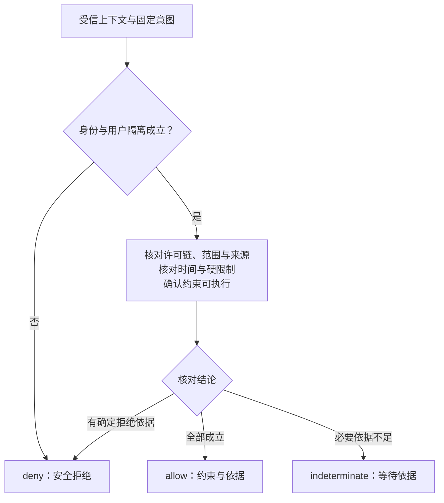
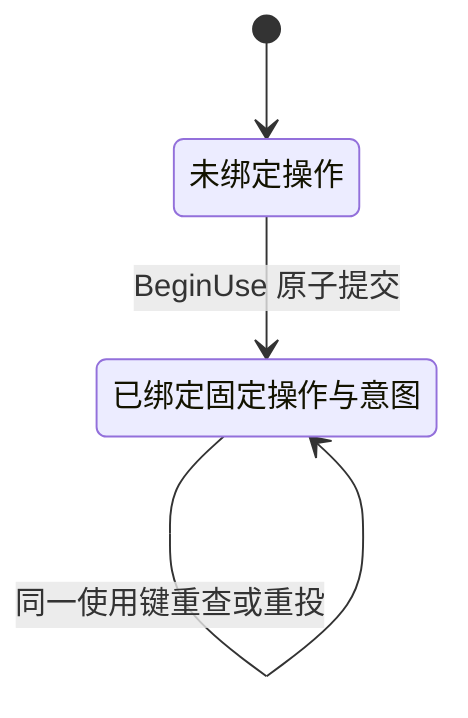
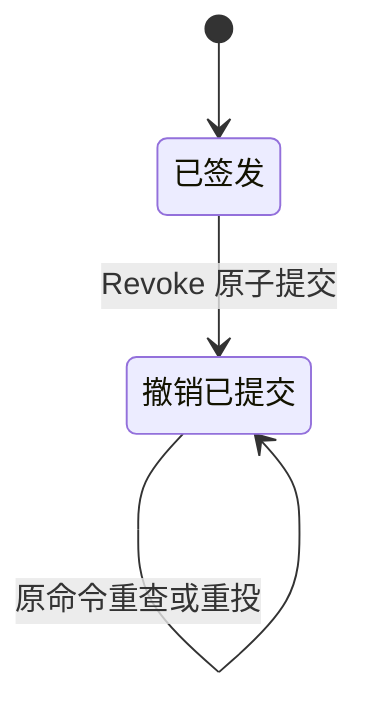
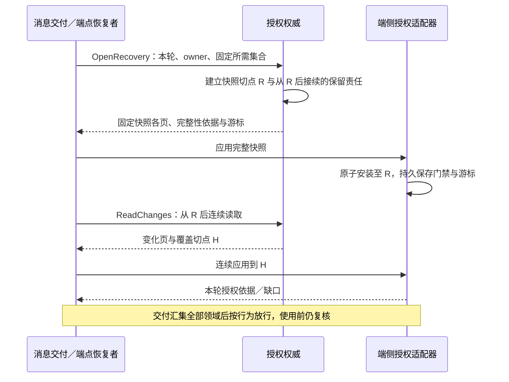

# 判定、消费与恢复

[总览](README.md) · [字段与接口](contracts.md) · [验证与依赖](validation.md)

## 1. 从具体使用意图作出判定

`Evaluate` 与 `BeginUse` 共用以下规则；后者还在提交事务内复核并保存使用事实。可信入口先确认调用方身份和用户归属，资源适配器再固定真实资源、动作、用途、参数及来源。资源无法规范化或约束无法落实时直接拒绝，不能先允许再交给模型解释。

图表示判定顺序，节点是检查阶段。身份／隔离失败优先安全拒绝；其后任一必要依据缺失即不能允许。所有前提同时成立才可通过。

有可靠证据证明已撤销、到期或身份不匹配时返回 deny；查不到当前权威、未知来源关联或时间不能证明时返回 indeterminate。对未获准调用者，两者均不泄露对象存在性；有权调用者才能取得可恢复缺口。

| 阶段 | 判定规则 |
| --- | --- |
| 身份与宿主 | 验证账户、主体、来源端点及当前 owner；原行动 actor 与叶子 subject 相等，宿主有权代表它；处理服务另匹配受众，同用户其他 Agent 也不能借用 |
| 权限链 | 根确认有效；父链逐级有效且未撤销，issuer 和 user 一致。链不能循环，超过深度限额拒绝；不能仅验证叶子签名 |
| 范围与硬限制 | 用户禁用、端点禁用、资源拒绝及数据硬限制优先；许可不能覆盖这些限制。每个请求必须由一条完整许可链覆盖 |
| 用途与来源 | 检查全部 source_bindings；派生摘要、计划和运行记录沿原来源限制，不因换名字成为公共数据；多个来源限制取交集 |
| 时间与新鲜度 | 同时满足许可、来源证明、使用回执、任务／请求等适用期限；要求在线实时判定的使用不接受离线依据 |
| 处理能力 | 处理端声明并落实接收方、位置、保留等约束；不能执行则拒绝。预算、任务控制、设备接管还由所属模块独立判断 |

子许可由 `Delegate` 在同用户事务内验证父链后产生：资源、动作、用途、受众、宿主范围均为父许可子集，开始时间不早于父许可、到期不晚于父许可，保留上限不增加，新增约束只能更严格。禁止从只允许在线的父许可派生离线能力。持续父许可可产生单次子许可；单次父许可首期禁止再次委派，避免多个子许可分别消费同一额度。没有明确可判定包含规则的约束拒绝委派。

撤销父许可不逐个修改所有后代：在线判定读取整链，撤销提交后新 BeginUse 无法通过；通知使用父子索引找受影响端点。离线后代受签发时固定的最短有效期约束，遵守离线延迟边界。

为避免数据已经交给模型后才检查，同一使用链在取内容、交给模型、准入、派发及发布前分别核对当前允许用途。撤销后不能撤回已经交付给外部接收方的字节；后续引用、保存和再次发送均停止或按新许可判定。授权服务不从任意文本推断已脱敏，脱敏产物要有获准处理及资源策略证据。

## 2. 单次消费与实际启动的边界

单次许可的“一次”是**一个固定操作意图的使用资格**，不是一次网络请求，也不是成功效果次数。正常例子的 G1 可以经过多次 Evaluate；只有文件处理端准备使用时调用 BeginUse，才绑定 O1。once 的状态对象是使用占用，和许可撤销状态分别存储。

图没有 Bound → Unbound。操作明确未执行、失败、取消、超时或效果未知都不自动释放许可；用户可选择对新意图另行确认。这样无需让授权服务猜测外部效果，也避免迟到原请求与重新分配的许可同时生效。

`BeginUse` 的事务顺序：

1. 核对当前身份、用户与回执披露权限；进入用户授权提交域的串行事务，再按固定使用键查旧回执，同键异意图拒绝。
2. 已有回执时读取整链、当前身份与范围，复核全部规则，返回原不可变 receipt 及独立 current_decision；不能刷新 `start_before`。历史已消费与当前 deny 可以同时存在，只有当前 allow 且回执未过期才能启动。
3. 首次使用时在同一事务内读取并核对全部当前依据。once 已占用其他操作／意图即拒绝；同操作的来源 slot 继承首次占用的统一截止，不产生新的启动窗口。continuous 为本次固定使用单元保存回执。
4. 原子保存单次占用（如适用）、使用回执及最小审计；提交成功才返回可用回执。授权事务中不调用驱动，不提交任务或执行账本。

授权回执与处理端启动分属两个提交边界。处理端先保存原操作与固定意图，取得回执后核对本地撤销、任务取消、owner、启动期限及设备接管屏障，再持久记录“可能启动”并调用驱动。这个本地门禁与控制应用必须由同一资源入口串行执行；应用撤销后，排队旧命令不能越过门禁。驱动启动前还须检查令牌期限和屏障，避免长队列把过期许可变成有效行动。

| 崩溃或竞争点 | 恢复责任与允许行为 |
| --- | --- |
| 授权提交成功，回执响应丢失 | 处理端按原使用键 ReadUse 查原提交；恢复启动须重投 BeginUse 取得当前结论，历史回执不能直接用于启动 |
| 已绑定许可，处理端尚未保存启动准备 | 查原操作并重投 BeginUse；若能证明未进入可能启动阶段、当前 allow 且原回执仍有效，可沿原操作继续；不能分配给别的操作 |
| 已保存“可能启动”，尚无执行结果 | 处理端按既有[原操作恢复](../endpoint-communication/recovery-and-control.md#retry)核对；仅看到授权消费记录不能判定执行过或未执行 |
| 相同 operation_id 换参数、目标或来源 | 使用回执及执行账本的意图绑定均冲突；拒绝，不更换摘要重试 |
| 回执启动期限已过，操作确定未启动 | 此回执不再允许启动；once 仍占用。用户确认新尝试才建新许可和新操作 |
| 两个实例同时消费 | 在线由用户事务和 grant 唯一占用裁决；离线必须由同一端点唯一账本裁决，不允许两个消费权威 |

短期使用回执解决已检查到实际启动之间的有限延迟，不提供远程撤销的零延迟保证。在线 `start_before` 固定为授权时刻加配置的最大启动窗口，并与全部适用截止时间取最小值；处理端必须能保守判断该时间。窗口由部署按任务及资源风险固定有限上限，上线前实测验收，架构不硬编码统一秒数。已观察到连接中断或恢复未完成时，普通在线回执不能用于首次启动，剩余窗口不构成离线许可；继续须恢复当前依据并保留原截止。尚未检测到的网络故障和最后一次检查后的并发撤销仍存在这个有限竞争窗口，不能声称检查与远端物理启动原子发生。

持续读取、数据流和多步 GUI 不能凭一次回执无限运行。处理端把使用限制到目录预先定义的有限单元，例如一次请求、一个受限字节块或一个 GUI 动作；开始下一单元按[稳定使用键](contracts.md#interfaces)重新检查。已启动的不可中断外部调用可能超过启动窗口，效果按执行事实处理；若产品要求到期即停止传输，驱动必须另支持运行期间截止检查，否则不开放该能力。

### 同一消费权威的集合使用

一次有界生成或行动需要多个许可／来源 slot，且它们同属一个用户授权提交域时，默认使用 `BeginUseSet`。处理端先耐久固定完整集合与原 command_id；授权服务在既有用户串行事务内校验全部成员的身份、来源、范围、当前撤销、原意图及占用，再一次保存全部消费、成员回执和集合回执。任何校验不通过，整个新集合不产生消费；确定拒绝也保存原命令决定。共同 start_before 取各项适用截止及本次启动窗口的最小值，所有成员使用这一截止。

首次集合请求若发现成员已由其他集合或单项调用消费，不把旧成功与新消费拼成集合成功；返回冲突，处理端沿原责任核对。相同原命令重投先比完整固定集合，已成功时返回原集合回执，再复核当前所有成员以生成独立 current_decision；后来撤权可产生“原集合已消费、当前 deny”，不得刷新截止。首次提交答复丢失时，通过 ReadUseSet 或原样重投恢复；查不到不证明未提交，不能拆成单项消费或换集合身份。

授权集合提交与实际发送仍分属不同边界。发送前继续经过处理端当前控制、owner、来源和截止门禁；已成功的集合不因取消、未发送、失败或未知效果退回。跨权威、跨用户、不同使用单元或超过 64 项不进入该接口；处理端不能静默分批而宣称全成／全拒绝。跨权威配置若允许逐权威接纳，应在首次消费前固定分组及部分消费代价，任一组拒绝就不启动，已消费组继续保留。要求整体原子资格的部署不开放这种配置。

| 方案 | 本轮选择与依据 | 代价及适用边界 |
| --- | --- | --- |
| 同权威逐项 BeginUse | 单一许可仍使用；多项共同启动改用集合 | 逐项存在部分消费窗口，不能用预检消除并发撤权 |
| 同权威 BeginUseSet | 推荐并采用；复用既有用户事务，不新增权威或分布式事务 | 校验批次有界，集合身份及完整回执需保存；提交后的取消仍不退款 |
| 跨权威统一消费 | 本轮不引入 | 各方没有共同提交域，不能把本地集合保证外推为全局保证 |

## 3. 撤销、用户接管与原操作核对

许可生命周期只描述授权事实。`expired` 是由可信时间导出的有效性结果，不等待后台定时任务才能生效；`revoked` 为不可逆撤销事实。再次授权产生新许可，不复活旧 grant_ref。

`Revoke` 在同用户提交域中更新撤销事实、递增授权修订、追加连续变更及通知责任、保存原命令回执。BeginUse、Delegate 和 Revoke 按提交顺序裁决：撤销在前则后续新使用拒绝；使用在前则保留真实使用记录，传播撤销以阻止尚可阻止的行动。签发和撤销的回执只说明本权威已提交。

授权服务持久记录每个受影响端点的应用位置及未到期离线许可，不用消息已收到代替已应用。处理端在本地事务保存撤销位置和门禁后才能确认应用；执行系统另报告停止及效果。未确认端点显示“撤销待应用”与最晚许可边界，不能合并为“全部已停止”。已到期只证明不能再合法启动，不证明旧外部调用已经结束。

本地用户接管由设备入口先保存停止自动行动屏障并尽力中断，再向任务和授权模块传播事实；不需要先等云端撤销成功。重新开放自动操作须有新的明确用户意图及当前有效权限，不能因为网络重连自行恢复。云端撤销与任务取消各自保存事实，任何一方已知的限制都应阻止新行动。

| 撤权后的行为 | 使用依据与限制 |
| --- | --- |
| 启动新的目标行动 | 当前有效行动许可及本地控制前提；旧准入、旧消息或历史回执不足 |
| 查询 O1 是否已执行 | 当前管理／核对许可，绑定该用户原操作；最小状态查询不等于重新读取文件内容 |
| 取消或阻止原操作 | 当前控制权限；本地用户中断路径由受信宿主认证，不从失效行动许可推导控制权限 |
| 接收迟到执行事实 | 验证原生产者、操作关联和最小记录保留依据；不得借事实通道启动新行动或带入无权披露的正文 |
| 保存／展示／上传结果 | 按当前数据用途和接收方逐项判定；新行动被拒绝不意味着可以任意上传收尾数据 |
| 删除信息及纠正策略 | 授权服务改变后续使用规则，资源权威执行删除／修改并给结果；撤销回执不能当作删除完成 |

为使收尾可恢复，接纳操作前要求当前策略允许保留最小操作关联、幂等和授权审计，并预先明确主体可用的状态核对／控制范围。这些控制依据与目标行动许可分开；不是撤权后自动获得的超级权限。如果连最小收尾记录也不允许保存，拒绝该执行模式。

回到 O1：用户可在受信管理入口查询原许可／撤销及原操作最小状态、撤销剩余许可，或新建仅针对 O1 的核对许可。没有读取 A 的权限就不能读回文件；权威或执行端不可达时显示缺口。入口不提供“强制标记未执行”或清空消费状态；人工提交外部证据沿[任务管理合同](../task-kernel/recovery-and-validation.md#gaps)，只形成待核验材料；普通授权确认不能替代效果证据。

## 4. 离线许可与可信时间

本节“离线”指身份、来源等所需远端权威不可达，处理端依赖缓存证明继续使用的模式。所有权威、资源及依赖都在本地且能实时核验的独立部署，不因公网断开而进入该模式；原云端用户不能据此改用本地签发者。

离线能力按端点启用，不改变云端唯一签发权威。权威在线签发不可变的离线许可，绑定精确端点、owner 代次和账本，限定本地资源、用途、有限时间及允许的操作。默认禁止离线再委派；已签发父链的有效范围与最早到期一并固化到可验证证明中，撤权延迟由用户确认。

签名格式采用专用 JWS/JWT profile，固定 `typ=harness-offline-grant+jwt`、issuer、audience、算法允许清单和 key id，用经过审查的实现验证签名及所有声明；不同票据或登录 token 不能互换。算法及发行者／受众校验依据 [RFC 8725](https://www.rfc-editor.org/rfc/rfc8725.html)。离线证明还须包含 contracts 中的完整许可范围、父链绑定、许可版本和时间锚关联；可互操作编码、密钥发布／轮换采用[离线 profile 1](cross-endpoint.md#offline-profile)；运行未验收的部署仍关闭离线能力。

签发密钥仅授权权威持有，验证器按受信配置接受发行者及密钥，不从许可中的任意 URL 下载。常规轮换保留旧公钥至相关许可最长到期；密钥泄露时停止签发并发布废止，离线验证器无法即时得知，其最坏窗口仍受原离线截止约束。要求即时响应密钥废止的资源不允许离线。

单次离线许可在签发时将 `use_authority` 固定为目标端点，在线权威不再为它消费，其他端点不能使用。离线端将占用、原操作、使用回执及待上报责任一起持久保存，跨重启保留。可复制或回滚的账本不足以证明单次性；缺乏防回滚／旧实例隔离的设备不开放单次离线消费。丢失账本后不能重新下载许可当作未消费。

时间锚也必须处在不可回滚或回滚可检测的受信运行环境。整个虚拟机快照可能同时回滚账本、单调计时与检测标记，单靠软件自报“同一启动周期”无法识别。无法由快照外部的受信监督器／硬件证明未回滚，或无法排除这类恢复路径的部署，持续与单次离线能力全部关闭；不能只关闭单次消费后继续声称持续许可有可靠到期上限。

持续许可也必须按有限使用单元检查；启动窗口不能越过离线截止。用户选择的离线时长还受部署上限约束，首期默认上限为 0（关闭），能力验收通过后才允许配置正值。

时间有效性使用受信在线时间区间 `[L, U]` 加同一启动周期内包含休眠时长的单调增量。时间锚获取要绑定请求往返及最大允许误差；估计上界包含传输延迟和漂移，不能直接把服务端发送时刻当作本地当前时刻。只有 `L >= not_before` 且 `U < expires_at` 才能使用，时间不确定不延长许可。规则是为维持本项目的有限授权保证所作的设计推导，签名标准本身不提供可信本地时间。

| 情况 | 行为 |
| --- | --- |
| 墙钟回拨，但有效单调时间锚仍成立 | 按保守时间区间判断，记录异常，不按墙钟延长 |
| 重启、恢复虚拟机快照、计时回滚、休眠计时语义未验证 | 时间锚失效，停止新的离线使用；联网重新取当前依据。受信硬件跨重启时间可作为后续替代，首期不假定存在 |
| 离线许可到期或本地已知撤销 | 停止新使用单元，尽力停止可中断工作；效果未知仍保存原操作责任 |
| 本地能力齐全但任务控制权或预算不足 | 等待所属模块，不凭离线许可获取任务控制权或新预算 |
| 恢复连接 | 先取得本轮当前授权及任务／操作事实；旧离线证明不能替代恢复依据，上传与长期保存重新判定 |

## 5. 连续授权恢复与缓存

默认在线 BeginUse 访问写权威，不缓存可以脱离当前检查重复使用的 allow。可缓存不可变许可内容，撤销及账户状态必须获得所需的新鲜度；失效通知只改善延迟，正确性不依赖通知恰好送到。在线 token 状态检查与缓存撤销延迟的通用边界可参见 [RFC 7662](https://www.rfc-editor.org/rfc/rfc7662.html)，本方案没有把 Evaluate 定义成 OAuth introspection 接口。

恢复快照可按端点所需许可集合筛选，完整性对象包括许可及祖先、账户／主体／端点状态、相关硬限制和密钥版本。请求把所需集合固定；后续新增 grant_ref 必须单独查询当前权威或重新扩大同步集合，不能因未见记录就推断有效。

图表示一轮授权恢复，字段集中在下表；它只给消息交付的授权维度结论，不取代任务、流与执行恢复。

| 恢复对象 | 必须绑定的内容与规则 |
| --- | --- |
| 恢复请求 | recovery_id、用户、目标端点／owner、所需集合及摘要、所需行为、新鲜度要求；重开一轮用新 ID |
| 快照 | snapshot_id、相同请求绑定、授权 revision=R、策略／密钥版本、固定分页游标和完整性清单；分页不能读取不同时间的活动表拼成快照 |
| 变化页 | 同一订阅绑定、覆盖区间 `(from_revision, through_revision]`、区间内全部相关变化与下一游标；无相关变化也返回受信覆盖证明，筛选后的条目无需逐个 revision 连续 |
| 应用回执 | 原恢复轮次、owner、集合摘要、snapshot_id、已持久应用位置 H、有效时间与允许行为；只在完整快照和覆盖区间无缺口时产生 |
| 缺口 | 快照不完整、游标落后清理水位、owner 变化、超期或页绑定不符；关闭依赖行为并重开快照，不能以当前最新页补洞 |

OpenRecovery 在同一一致性快照确定 R，并保证变化日志从 R 之后可接续；它不需要长期锁住业务写入。快照分页可物化有限快照或持有有限寿命的数据库快照，超时作废重建。日志保留到订阅确认位置或有界恢复窗口；到限可终止该恢复租约并明确 gap，不能悄悄清理后仍报告连续。

撤销发生在 R 前时进入快照，发生在 R 后时进入覆盖区间。应用后的新变化由接续读取承接；连接断开或新鲜度期限到达，相关行为重新受限。迟到旧轮回执因 recovery_id 或 owner 不匹配不能解除当前门禁。授权恢复就绪不代表瞬时全局撤权已同步，在线行动仍按 BeginUse、离线行动仍受离线边界约束。

## 6. 持久化、部署与容量

授权服务内部使用一个事务存储管理以下记录，不另建独立策略引擎、消费服务和撤销服务。跨用户可分区，同用户所有身份／许可变更和消费以用户控制行串行；禁止业务实现绕开该入口写表。

| 记录 | 关键键／索引 | 原子关系及清理 |
| --- | --- | --- |
| 身份与端点 | 用户外部身份唯一键；`(user, actor)`、`(user, endpoint)`；会话和票据摘要 | 登记／禁用与回执、相关变更一起提交；票据消费与连接绑定同事务；凭据正文不写审计 |
| 许可与撤销 | `(user, grant_ref)`、parent_ref、subject、端点／受众、expires_at | 不可变范围与可变撤销事实分离；签发／撤销、revision、变更责任和回执同事务 |
| 使用与命令回执 | `(user, command_id)`、固定使用键；once 的 `(user, grant_ref)` 唯一占用 | 占用、使用回执及审计同事务；不因执行失败删除占用；至少覆盖重投及原操作未决责任 |
| 连续变更与通知 | `(user, revision)`、订阅及到期、端点应用位置 | 修订从事务内用户控制行递增，不用可能跳号的数据库序列充当连续覆盖证据 |
| 确认与快照 | 用户／确认 ID、固定范围、消费回执；恢复轮次／快照页 | 确认单次消费与许可签发同事务；快照超时保存失效依据，重启不把未完成快照当完整 |

云端参考实现用 PostgreSQL：先锁用户控制行，再读取当前状态、核对回执和唯一约束，提交前不作网络调用；涉及其他锁按固定顺序取得。不能先在无锁快照检查再写入。若替换为 Serializable，序列化失败须整体重试原事务，提交未知仍先核对原键，见 [PostgreSQL 事务隔离](https://www.postgresql.org/docs/current/transaction-iso.html)。

单机权威用 SQLite 写事务与唯一约束实现相同关系；采用 `BEGIN IMMEDIATE` 提前取得写资格，忙冲突有界重试，见 [SQLite 事务](https://sqlite.org/lang_transaction.html)。端侧仅验证云端离线许可时，SQLite 保存本地消费／应用账本，不因此成为云端签发权威。数据库耐久性、备份恢复及防回滚配置需运行验收；文件存在不证明这些保证已成立。

提交未知沿原 command_id／使用键核对。查询返回已提交、当前未见、已封闭未应用或恢复依据不足；只有确认旧事务结束或已隔离、入口已封闭，才能报告未应用。写权威不可用时不给出成功撤销；调用方在自己的持久存储保存待提交意图，并保持相应工作受限。

所有缓存、索引、对象存储引用和日志查询键均含受信 user_id；跨用户去重禁止。审计只记时间、主体、资源的受控标识、动作／用途、许可链、依据修订、原操作、判定原因及关联回执，不默认保存文件内容、模型上下文、登录 token 或完整连接票据。审计再利用、评测或记忆提取都要另查用途权限。

授权变更和使用回执是正确性记录，正文和诊断日志采用独立保留策略。清理前核对未决操作、离线截止、可接受重投窗口及订阅水位；正文删除后保留获准的最小占用／墓碑。必须删除全部可恢复依据时封闭相关身份／许可，迟到请求不能重新创建同一许可或消费；这会损失历史可查性，入口明确报告不可恢复。不能为新任务清除已接纳责任。

| 有界配置 | 首期规则与过载表现 |
| --- | --- |
| 许可链深度／单许可范围项／单次来源数 | 必须有限；参考起点 8／64／256，超限拒绝且不静默截断。数值为估算配置，待来源链样本验证 |
| 在线启动窗口／离线上限 | 在线参考 5 秒；离线默认 0；与实际时间误差、驱动启动排队及可接受撤销窗口共同验收 |
| 会话、票据、许可、确认请求配额 | 按用户及源端点汇总；签发前限流，控制／撤销预留独立容量，普通签发不得占满 |
| 判定及消费并发、事务等待、重试 | 每用户有界队列，按用户公平调度；超时区分未接纳与提交未知，不无限等待持有事务 |
| 快照页大小、恢复窗口、日志字节与订阅数 | 均有限；超窗显式 gap，慢端点不无限阻止清理；控制日志压力大时先拒绝新增许可 |
| 审计和回执保留 | 接纳前确认额度与策略；必须保留的记录满额时停止新接纳，继续处理已有撤销和核对 |

容量按“每秒使用次数 × 每次判定链长／来源数 × 活跃用户分布”、变更速率、回执及恢复保留期估算。十万在线连接不等于十万次每秒授权；先测单用户热点锁竞争、正常用户延迟、撤销传播分位数和快照存储占用，再决定分区数。首期不宣称达到项目规模目标。
