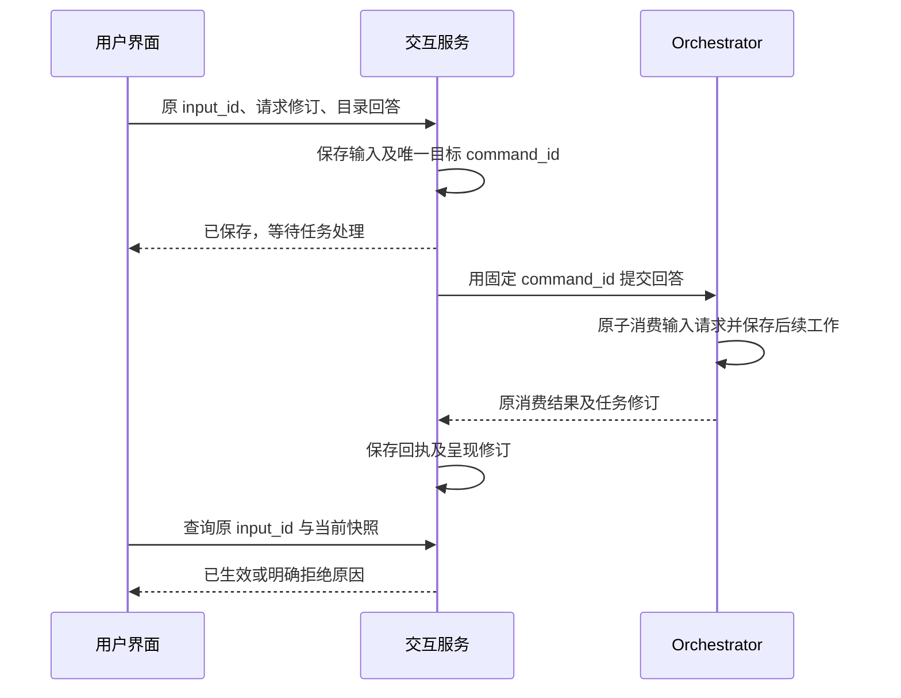
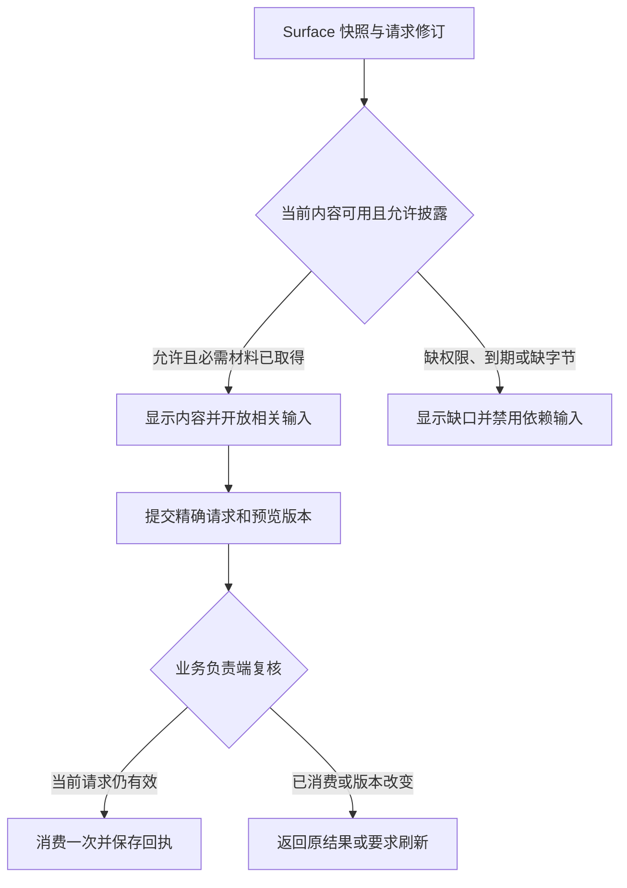
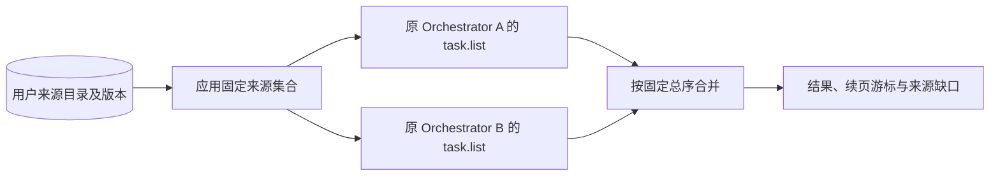

# 应用、界面与用户输入

用户提交“生成报告并保存到指定目录”后，可能先在 Web 查看进展，再到手机上回答保存位置，最后重开原对话读取成果。交互模块要把这些操作关联到同一个任务，并让用户分清回答已保存、任务已经采用回答、报告已按要求保存这三个时点。断线后仍须能查到原处理结果。

连续对话由 Session 组织消息及任务引用；一个要持续推进的目标由 Task 保存。页面则是可替换的呈现：交互服务保存一份有版本的界面对象 Surface，其中引用原任务和待回答请求；实际业务负责方保存请求并决定是否采用回答。关闭页面、归档对话与取消任务因此有各自的入口和结果。

本章先沿目录回答说明正常交接，再说明呈现、输入、授权和故障恢复。应用还可通过独立 Surface 管理记忆或应用内容、处理授权请求并接管执行，不必为每个页面创建 Task。对应项目目标为 C5、C6、C7 及 A4。

默认提供 CLI 和轻量 Web 适配器，Web 支持生产入口和本地调试装配。交互服务保存 Surface 与输入转交责任，Orchestrator 保存任务输入消费与任务控制，授权服务保存许可决定。界面不能通过渲染一个“同意”按钮取得授权裁决权。

本页的输入消费、版本复核和恢复语义属于适配器共同契约。参考实现核心使用 Go；浏览器、CLI 和设备统一经 `/v1/connect` 的 WSS 双向长连接调用，同进程使用 Go 接口，服务跨进程使用 gRPC。HTTPS 保留发现、认证与大文件传输。界面样式可以替换，替换后仍须区分“本端已保存”“业务已消费”和“目标效果已证实”。

[总览](../README.md) · [任务运行](../orchestrator/README.md) · [授权](../security/README.md) · [公共调用契约](../contracts/README.md) · [模块与数据 UML](../uml-models.md#interaction) · [可编辑 UML 图册](../diagrams/uml-models.drawio)

## 实现阅读路径

先阅读本页的职责与行为，再读[实现设计](implementation.md)：声明式快照、可靠输入与受信确认。[Session 与 Task](session-and-task.md)说明应用内部对话归组；[会话记录与原命令存储](implementation.md#session-storage)给出消息、创建来源和交付 outbox 的唯一约束与恢复。实现设计规定内部记录、事务、算法与故障实验；[机器契约](../contracts/schemas/protocol.schema.json)和[方法登记](../contracts/schemas/methods.json)提供精确协议字段。

普通应用接入先读[默认应用与 SDK 工作流](../application-workflow.md)：用现有提交、查询、控制和结果端口完成工作，Decision／Operation 子记录由内核管理。[四类数据流程](../request-data-flows.md)列出直接回答、读后回答、冷恢复及保存读回的读取、写入与可合并事务；这些是组合设计，尚无运行 SDK。

实现阅读顺序为[模块结构与依赖](implementation.md#module-shape) → [公共框架接入](implementation.md#reliable-work-integration) → [核心对象流转](implementation.md#data-flow) → [输入跨数据库事务边界时序](implementation.md#key-sequence) → [生产可用性与性能](implementation.md#production)。接纳、转交和投影复用[公共框架](../reliable-work.md)，服务、连接层与宿主渲染器可分开扩容；实际请求和确认的消费仍归业务 owner，传输 Delivery 的确认也不替代业务回执。

多端竞争与恢复另沿[持久成功点](implementation.md#input-durable-boundaries) → [输入与取消竞争](implementation.md#input-control-races) → [两端确认](implementation.md#confirmation-races) → [快照先于提示](implementation.md#surface-publication) → [旧流隔离](implementation.md#surface-generation) → [SDK 查询原决定](implementation.md#sdk-original-decision)阅读；这些规则沿用现有身份、状态和传输世代，不增加公开运行对象或字段。

本页与实现设计均为待实现规格，静态序列通过不代表服务、隐私隔离或恢复机制已经运行。

## 1. 用快照恢复界面，用业务记录确认输入

任务发现保存目录尚未明确时，原 Orchestrator 先保存一份 InputRequest：它固定问题、回答格式、请求修订及期限。交互服务把这份请求的引用放入 Surface；宿主向请求负责方读取准确内容，再让用户回答。用户提交后形成 InputSubmission，交互服务保存原目标命令并负责转交。Orchestrator 在自己的事务里采用一次有效回答、更新任务并保存后续工作，交互服务再取得这个决定。消息、转交和业务消费由此能沿原身份逐项查询。

默认界面读取可版本化的快照，变化通知只负责唤醒。相较于把所有渲染增量变成必须连续接收的指令，这使新设备和断线设备可以直接恢复当前状态；代价是应用维护快照版本与分页查询。只有实际带宽或交互频率证明有必要时，才增加局部补丁，并继续保留完整快照入口。

同一条 WSS 连接承载 Command、Query、原回执查询与 Change 提示。Change 可以合并、重复或丢失；重连、提示缺口或版本不一致时，宿主重新读取当前获准快照，不依赖通知连续回放。连接建立、帧收到和 ReplyAck 都不证明用户已看到页面或业务输入已消费；精确帧及恢复规则见[公共传输契约](../contracts/transport.md)。

浏览器握手使用同源 Secure、HttpOnly 会话 Cookie，并由入口校验 Origin；CLI／设备使用受限 bearer 凭据。握手只建立连接主体，后续每条业务消息和状态披露仍检查当前身份、凭据代次与权限，连接存活不延长会话期限或内容使用许可。设备断线后沿原 input_id 和 command_id 恢复，UI 在取得原业务回执前保持待发送、处理中或离线状态。

下图以“用户为任务选择保存目录”为例。箭头表示命令或查询，两个写入点分别确认本地转交和业务消费。

| 发起方 → 处理方 | 交接输入 | 持久成功点 | 失败后由谁继续 |
| --- | --- | --- | --- |
| 用户宿主 → 交互服务 | 原输入、请求修订、回答及精确预览引用 | 交互服务保存 InputSubmission、唯一目标命令和转交责任 | 宿主查询原 input_id；交互服务恢复转交，不生成第二个目标命令 |
| 交互服务 → Orchestrator／已绑定处理器 | 固定目标命令、业务请求与用户回答 | 业务负责端原子消费请求并保存决定及后续工作 | 交互服务查原命令；业务负责端继续已接纳责任 |
| 受信确认宿主 → Grant owner | 本人认证和准确授权请求 | Grant owner 保存许可决定，界面取得固定回执 | 宿主查原授权；普通 Surface 不补造许可 |
| Orchestrator／应用投影器 → Surface owner | 已绑定来源修订与完整声明式快照 | Surface owner 提交新快照和变化提示责任 | 投影器重读源状态；宿主读取当前快照补齐提示遗漏 |

表格只汇总责任，输入消费和撤回规则分别见[输入](#input-consumption)与[故障恢复](#interaction-recovery)，对象字段集中在[契约查阅](#interaction-contracts)。

同宿主共库时，输入登记和 Orchestrator 消费可以合并为一个事务，避免额外队列。跨端时交互服务必须先持久化唯一目标命令，再向 Orchestrator 发送；重启沿原命令查询或原样重投。没有持久宿主支持的浏览器只能显示“本端待发送”，不能承诺清理浏览器数据后仍能恢复未发出的回答。

### 任务结果与缺口视图

默认先展示结论、准确成果版本和关键待处理项，详情按需展开原目标与条件映射、逐项依据及证据入口。模型总结作为正文呈现；状态、完成依据、未知效果和清理事实取自原 owner，不能从总结中的“全部完成”生成成功标记。目标覆盖的语义判断限制与 verified／assessed／user_accepted 同时可见；受信预览仍只保证取得与呈现准确内容，不证明用户实际阅读。

| 展示事实 | 用户可执行的后续动作与边界 |
| --- | --- |
| 覆盖遗漏、条件未通过或材料不足 | 展示对应要求、缺口及来源；系统在原权限内补证，只有含义或授权确需用户决定时请求输入 |
| 原操作效果未知 | 展示原操作与核对状态；“继续核对”只唤醒原查询责任，不能映射为重新执行动作 |
| 授权或依赖等待 | 展示负责方和所需改变，按钮绑定当前准确请求；只有具有相应管理权限的用户可补许可或资料 |
| 取消已接纳、远端仍未确认停止 | 同时展示任务终态及未确认范围；原 owner 继续控制与核对，不能显示全部已停 |
| 来源已关闭、物理副本尚有残留 | 区分禁止新使用、有限离线窗口及逐持有者清理，不能用任务成功或一个删除回执覆盖残留 |
| 证据已不可读或状态暂不可核验 | 保留获准的原版本／历史判断并说明当前缺口；不展示缓存正文冒充仍可验证，不据离线快照启用新动作 |

投影器从 Orchestrator 内部只读投影取得[目标覆盖](../orchestrator/verification.md#goal-coverage)，再关联 Task／Result、原操作、委派和内容 owner 的获准事实；各来源修订分别记录，不假装存在跨 owner 原子快照。同任务的覆盖、条件与 Result 必须来自一致的目标修订，未取得时显示更新中。沿既有 Surface 和受控内容发布这些信息，不新增客户端可写“完成证明”。默认宿主的内部投影尚须实现；只接公开协议方法的第三方适配器不得从缺字段猜出完整覆盖。断线、提示丢失及当前权限变化后重读快照与原 owner，具体用例见[OPT-01／05／07](../validation/optimization-evidence.md#scenarios)。

## 2. 界面对象与设备呈现分别管理

Surface 的业务快照由固定 surface_owner_id 管理。任务 Surface 指向 orchestrator_id/task_id，独立 Surface 指向一个已注册应用处理器。处理器声明允许的事件种类、输入格式和幂等查询；不能把任意界面事件路由到任意管理接口。

任务投影更新绑定 task_revision，交互服务只应用较新的源修订；同修订不同内容视为冲突并回查 Orchestrator。独立 Surface 的应用处理器通过预期 Surface 修订更新快照。两类更新均同事务保存新快照和变化提示责任，提示丢失时完整读取仍能恢复。

每台设备独立保存打开、关闭及最后查看修订。关闭页面停止本端主动呈现，不取消任务，也不撤回已消费输入；稍后结果到达只更新可查询记录，不自行重新打开页面。用户明确点击取消时，才发送任务控制命令。设备接管入口直接到[执行资源控制](../execution/README.md)，不等待模型解释或普通聊天输入。

跨端发现按用户已登记 Orchestrator 和 Surface 负责端分别查询目录。用户来源由受信管理流程在[新任务落点开放前预登记](../deployment-production.md#21-稳定映射与扩容)；目录或部分端点失联时显示缺口，不创建第二个任务裁决者。任务标题、预览及目录条目本身也需读取权限，任务 ID 不能绕过检查。

界面呈现只使用本次读取获准的内容引用。正文、截图及派生内容保留精确版本、摘要与来源；读取和披露分别检查[内容与记忆规则](../memory/README.md)。缓存到期、来源失效或权限改变后，既有卡片显示不可用，不继续用缓存提供新的阅读或回答依据。

### 2.1 跨 Orchestrator 任务列表

应用按当前认证用户从身份服务的权威数据库分片读取**完整已登记来源、每来源披露授权权威集合及目录版本**，在一次聚合查询的首屏固定该集合。首次新任务落点和后来获得其他 Orchestrator 的任务披露权限，都要求先登记来源及相应授权权威；登记可能产生空来源，却不能漏掉已获准目录项。每个 Orchestrator 的 `task.list` 仍只读取自己的 Task；应用以 `(created_at DESC, orchestrator_id, task_id)` 合并当前获准披露的条目，同时间任务由后两项稳定决胜。任务的唯一标识是 `(orchestrator_id, task_id)`：同一来源重复返回该标识只呈现一次，不同来源即使碰巧使用相同 task_id 也分别呈现。不同数据库分片的 `created_at` 只用于呈现排序，不提供因果顺序或同一时刻的数据库快照。

查询完整性还依赖**可见任务范围的授权版本**：改变本来源可披露任务集合的任务共享、新增 Grant、撤权等操作，由各原授权 owner 持久推进范围修订。授权变更的发起方须从原 Task／共享引用界定受影响来源，或向受信范围端口取得可证明完整的有限来源集合；一个 Grant 若会扩大多个历史来源的披露，Grant owner 须在授权生效前为该用户预登记全部来源及其披露授权权威。无法界定完整集合时受信管理端拒绝本次扩权；既有外部变更已生效却无法确认登记时，内部目录返回不完整，聚合器报权限缺口。一个来源若涉及多个授权 owner，当前授权查询适配器须返回覆盖目录所列完整 owner 集合版本及各 owner 修订的可比较复合 token；新授权 owner 开放前也须登记进该集合。聚合器在首屏、续页及宣称遍历完成前核验同一 token。无法证明 owner 集合完整、某 owner 不可达或 token 不可比较时只能报权限缺口，不能声明已遍历。原 Orchestrator 仍逐项按当前披露权限过滤；授权版本用于发现原页未扫描过的历史任务后来变得可见，不能代替逐项核验，也不增加 `task.list` 协议字段。

聚合器沿[集合恢复顺序](../contracts/protocol.md#collection-snapshots)为每个固定来源先建立变化水位并缓冲，再读首屏；提示窗口中断或缓冲溢出时标缺口。变化提示只要求重新读取原 Task，不自行授予披露权限。分页期间若新提交任务的排序键落在已输出段，旧游标标排序缺口并要求新查询；尚未输出的条目可以在后续页按总序呈现。这样续页不会把新发现的较新任务附在旧页尾。

来源查询是应用聚合器调用受信身份端口的内部读取，`read_user_sources(已认证 tenant_id, user_id)`；返回同一提交视图中的 `{sources: [{orchestrator_id, disclosure_authority_ids}], directory_version}`，或明确不可用／不完整结果；不从客户端提交来源或权威。聚合器从目录所列每个授权权威取得该用户在该来源的可比较的任务披露授权修订，合成复合 token，连同首次 `task.list` 返回的本地 `upper_bound` 固定在短期聚合游标中。目录读取失败、任一范围 token 不可核验或来源 `task.list` 失败时，可以显示已取得的条目和来源级缺口，但不能发出可续接的完整聚合游标。目录与范围版本只检查集合变化；每个条目仍由原 Orchestrator 按当前权限披露。该内部读取不增加 `harness/1` 公开方法；提供方的登记和版本推进条件见[生产路由](../deployment-production.md#21-稳定映射与扩容)。

| 聚合规则 | 行为与边界 |
| --- | --- |
| 首屏与游标 | 首屏保存目录版本、来源及其授权权威集合、认证主体与过滤摘要、每来源 `upper_bound` 和可见任务范围的授权版本；不透明续页游标保存每来源尚未呈现的继续位置及最后全局排序键。可重复读取未呈现的候选，不能因预取跳过它；每页复查目录及授权范围版本，游标不可跨主体、过滤或版本使用；任一版本不可核验时只报缺口 |
| 查询期间新增任务 | 各来源按首次固定的本地上界继续分页。上界不是提交水位；新任务可能落在已输出段或尚未输出段，前者标排序缺口并重查，后者按总序纳入后续页。应用按 `(orchestrator_id, task_id)` 去重并复核变化水位，不把旧分页当当前全量快照 |
| 删除、撤权与权限范围变化 | 每页在原 Orchestrator 重查当前披露权限。删除或撤权沿原 `task.list.gaps` 报告；授权范围版本变化使聚合游标失效并报 `authorization_changed` 缺口，应用清掉旧完整性声明和失效内容，以新查询重建 |
| 扩容新增来源或映射回退 | 来源目录换版后原分页不混入新来源，返回 `source_changed` 缺口并要求新聚合查询；旧来源仍保留可读，不能仅查当前新任务默认落点 |
| 数据库分片超时及恢复 | 可展示已查来源的带来源标签的 `partial` 结果及 `unreachable_endpoints`，但不发可宣称全局顺序的聚合续页游标；应用内部可有限重试原来源。数据库分片恢复后以新聚合查询重取首屏，不能把迟到来源接在已展示页尾 |
| 完整性声明 | 只有目录读取完整、目录及各来源可见任务范围的授权版本未变、所有固定来源到末页、各来源无 gaps／partial／超时／排序缺口且变化水位连续，才能声明“所列来源在各自查询上界内已遍历”；不声明跨数据库分片同刻一致快照 |

首屏须在有限并发下取得每来源的下一候选，才可输出全局有序的一页；单来源超时不能把其未知候选排序到其他来源之后并声称有序完整。按来源数分别测扇出、延迟、扫描行数、授权范围版本核验与短期游标记录写入、并发及最老查询年龄，并设置每用户／租户预算；超预算标 partial，不无限扫描。默认按需聚合，不给任务汇总索引业务裁决权。只有来源数增长使查询扇出成为实测瓶颈时，才比较可重建任务索引的读取收益、维护成本与新鲜度；索引缺项不能证明 Task 不存在，当前披露仍到原 owner 核验。此处是应用聚合契约，`harness/1` 的 `task.list` 协议方法继续只服务一个 Orchestrator。

## 3. 输入、主观验收与真实授权

InputRequest 由实际业务负责端创建，固定 request_id、revision、schema、期限及必需预览。Orchestrator 对同一请求只消费一个有效回答；两个设备同时作答时，以业务消费事务的提交裁决胜方，另一端收到已消费的请求及可披露的回执，不悄悄覆盖。交互接纳或目标入口的内部准备均不证明该事务已提交；公开回执阶段按方法登记，不能给只支持 applied／rejected 的 task.input 增加 accepted 阶段。

结构化回答的 answer_ref 指向 UTF-8、`application/json` 的 `input-answer/1` 正文。正文固定 `format`、`action_id` 和按字段名组织的 `fields`；选择值使用请求声明的 option ID，可选未答字段省略。宿主按准确请求校验并以 JCS 字节发布 Content，交互服务读取同一正文；普通澄清和应用处理器在业务消费前独立复验。具体类型、字节上限与验收分支见[回答正文合同](implementation.md#input-answer-content)，不能从纯文本“同意”或显示标签猜测结构化字段。

此处队列管理有准确 InputRequest 的结构化 InputSubmission：queued 可以用 `interaction.input_withdraw` 独立撤回，sending 后只能保存 withdrawal_requested 并核对。任意 Session 聊天队列、steering、follow-up、多 Lane 及按 Run 控制仍是能力缺口，不能从本队列推导已经支持，也不能通过 task.cancel 撤回某一条输入。应用保留原提交、接纳／消费和输出关联；完整范围见[输入与回合视图](../application-workflow.md#input-scope)。

普通澄清只改变其允许的目标参数。对开放式成果的用户验收，必须绑定精确成果版本及未满足条件；验收结果交 Orchestrator 决定 completion_basis，不能覆盖未知副作用。任务目标整体改变是否创建关联任务，遵循[任务运行](../orchestrator/README.md)的修订规则。

目标方法由已绑定处理器决定：clarification 调用 task.input，application 调用已登记处理器。acceptance 先由受信宿主固定完整 task.accept_result 命令，绑定请求修订、候选摘要、goal_revision、`decision=accept` 及预定 confirmation_ref；在原 Orchestrator 完成 confirmation.request／read／decide 后，才把同一 consumer_command 放入验收回答正文，交给 interaction.input 保存和转交。InputService 验证原确认绑定并复用这个 command_id，不另造验收命令。验收表单只表达 `action_id=accept` 和 `fields={"decision":"accept"}`；拒绝确认或关闭预览不生成验收 InputSubmission。完整顺序与恢复见[验收交付](implementation.md#acceptance-delivery)。

验收的 approved 只表示本人已作出确认，queued 只表示交互服务已保存转交；原 task.accept_result 的 applied 才表示请求、确认和验收事实已共同消费，Task 是否完成仍由后续核验决定。Orchestrator 原子消费原请求并保存验收记录，界面不能通过更换命令类型消费同一请求两次。

授权确认走受信入口：宿主显示请求主体、动作、准确资源、用途、上限、期限和拟使用的数据位置；宿主先固定原业务命令及规范意图，在实际业务负责端登记确认；用户认证并提交决定后，业务负责端在原命令的事务中消费确认并产生决定。请求内容、插件自绘 UI、远端 Agent 的“已获批准”字段都不能替代此过程。界面只传递授权 request_id 与原决定回执，完整 Grant 字段和消费规则集中在[授权](../security/README.md)。

两端对同一确认点“确认”或“拒绝”，只产生一份持久本人决定；批准仍待原业务一次消费。败方、重复点击和普通答案都不写自动许可。已批准后再拒绝不能撤销既有业务，应按原许可或任务的受信控制入口处理；完整竞争与撤权规则见[确认事务](implementation.md#confirmation-races)。

需要“先看截图再确认”的输入，交互服务在返回快照时给出 required_content_refs。宿主先向实际请求负责端调用 `interaction.request_read` 取得准确请求、Schema 和预览要求，再取得并校验这些内容版本后才启用按钮，提交时将实际预览的引用放入 preview_refs。Surface 输入块只保存 request_ref 和呈现标签，字段与约束以请求 owner 的 schema 为唯一依据；旧请求修订或 owner 不可达时禁用依赖输入并刷新或等待。业务负责端复核请求修订、期限、所需引用覆盖关系和当前来源状态与使用许可；按钮曾经可点击不是消费依据。若只是缺图但普通目录输入仍完整可回答，应用按具体请求的依赖开放输入，不封闭整个界面。

## 4. 权威对象与业务接口

共同标识、认证、命令回执和幂等规则见[公共契约](../contracts/README.md)。下列对象的 revision 在各自负责端单调增加，不比较不同对象的修订大小。

| 对象／字段 | 约束 |
| --- | --- |
| Surface：surface_id、surface_owner_id、app_binding、task_ref? | app_binding 固定处理器版本；task_ref 是 orchestrator_id/task_id，可为空 |
| Surface：revision、snapshot | snapshot（SurfaceSnapshot）集中保存 title、blocks、request_refs、expires_at；任务投影另含 source_revision。blocks 只含[严格声明式组件](implementation.md#2-严格声明式组件)，不运行模型脚本 |
| InputRequest：request_id、owner_id、revision、kind、schema、question_ref、deadline、state | kind 为 clarification、acceptance 或 application；权限请求引用安全模块对象，不复制为普通请求 |
| InputRequest：required_content_refs、allowed_actions、consumed_by? | 必需预览绑定精确版本；consumed_by 由业务负责端原子保存 |
| 验收请求绑定：goal_revision、candidate_ref、candidate_hash | 仅 acceptance 必填；改目标或候选后创建新请求修订，旧确认不得套用 |
| InputSubmission：input_id、revision、surface_id、request_id、request_revision、answer_ref | 首次接纳后不可换回答；状态变化递增 revision；新回答用新 input_id，仍受一次消费约束 |
| 回答正文：format、action_id、fields；验收另含 consumer_command | `input-answer/1` 的封闭 JSON 对象；普通回答按准确请求 Schema 校验，验收只携带已获受信确认的原 task.accept_result 命令；confirmation_ref 位于该命令 payload，不另设同义字段 |
| InputSubmission：preview_refs | 回答所针对的精确 ContentRef 列表；无预览要求时为空。受信 Renderer 取得并呈现后才提交，业务端检查其覆盖 required_content_refs 及当前来源状态与使用许可；引用本身不是取得或阅读证明 |
| InputSubmission：target_command_id、state、withdrawal_requested、receipt_ref | state 为 queued、sending、applied、rejected、withdrawn；sending 表示已领取发送，可能已消费；queued 只证明交互服务已持久保存 |
| Presentation：surface_id、endpoint_id、intent_revision、open、seen_revision | 本端负责；seen_revision 仅是显示遥测，不证明用户理解或同意 |

| 方法 | 业务输入／输出 | 成功与失联后的责任 |
| --- | --- | --- |
| interaction.request_read | request_ref；返回当前准确 InputRequest 与材料缺口 | 实际请求 owner 认证并复核披露；旧修订返回 revision_conflict，不拿旧按钮消费新请求 |
| interaction.surface_create | 应用绑定、可选 task_ref、初始快照；返回 surface_id | 保存 Surface、应用绑定及原命令回执后 applied |
| interaction.surface_read | surface_id、可选已知修订；返回获准快照或未变化 | 每次复核当前权限；内容不可取返回具体缺口 |
| interaction.surface_update | surface_id、预期修订、完整声明式快照及源修订；返回新修订 | 只允许已绑定处理器或 Orchestrator 投影器调用；保存快照及提示责任后 applied |
| interaction.surface_list | 负责端、有限筛选及游标；返回可披露条目、下一游标及完整性 | 在首次查询时固定有限候选集合，每页复核权限；失联端单列 |
| interaction.input | 原输入、请求修订、回答与预览引用；返回 input_id、state | queued 后由交互服务 job 负责转交；重复读原输入得到固定决定 |
| interaction.input_read | input_id；返回原转交和业务消费回执 | 不能凭当前表单消失推断历史回答成功 |
| interaction.input_withdraw | input_id、预期修订；返回 withdrawn 或 withdrawal_requested | queued 时原子撤回；已发送则仅保存核对责任，不能保证阻止业务消费 |
| interaction.present | surface_id、预期 intent_revision、open/close；返回新修订 | 负责端保存本设备意图后 applied；迟到结果不覆盖 close |
| interaction.application_event | 独立 Surface、准确 surface_revision/app_binding、event_id、事件类型及负载引用；返回固定目标 service/command_id 与转交状态 | 仅调用固定应用处理器，按输入相同的持久转交规则恢复 |

独立应用处理器必须实现幂等消费及原命令查询。只能接收普通回调且无法查询的处理器，不可用于承诺可恢复的有副作用事件。Surface 可以清理，但未收束输入及其目标映射按命令保留策略继续保存；清理历史显示不删除业务消费事实。

## 5. 故障、拒绝与用户后续动作

| 场景 | 对外行为与恢复 |
| --- | --- |
| 用户回答已被 Orchestrator 消费，UI 回执丢失 | 显示处理中并查原 target_command_id；返回原应用结果，不再创建回答 |
| WSS 网关断开，原输入是否提交不明 | 保留原 input_id 与 command_id；重连后查原回执和当前快照，不把连接失败当作业务失败，也不更换这些标识重试 |
| 两台设备提交不同答案 | 一份被消费，另一份明确 request_already_consumed；刷新到新快照，必要的新澄清必须由负责端发起 |
| 输入已接纳但尚未领取，用户撤回或取消任务 | queued 撤回与 sending 竞争；任务取消独立到原 Orchestrator。取消生效后旧输入不能重开该 Task，后来的独立 Task 不受原取消影响；见[事务与队列竞争](implementation.md#input-control-races) |
| 用户提交时请求或候选已更换 | 拒绝旧修订，保留拒绝回执并刷新原请求；旧答案不能自动套用新目标或新候选 |
| 预览已看过，但提交前到期、撤权或来源关闭 | 禁止消费依赖该预览的输入，给出具体材料缺口；由请求负责端重建有效预览或等待有效授权或可用材料，用户重新查看后再提交新输入 |
| 预览引用版本不符或正文未取得 | 受信 Renderer 不启用依赖按钮；业务端拒绝版本不符、引用不全或当前来源不可用或使用许可无效的输入。正确引用本身不能证明任意认证客户端已经取得或呈现正文 |
| 关窗后重启，正式成果到达 | 保持本端关闭意图；任务目录可查成果。主动打开后才重新读取正文 |
| Surface 所在端在线，请求 owner 失联 | 禁用新的依赖输入；失联前已保存的 queued／sending 输入保留原目标和恢复责任，仍显示尚未确认生效。尚未发送的输入可撤回，发送结果不明时查原命令 |
| 模型生成伪造权限按钮或管理链接 | 作为不可信文本呈现；实际批准只能进入宿主认证的权限页面 |
| 读取权限撤销，用户仍有删除或取消权 | 关闭正文展示，保留最小可授权管理元数据与控制入口；不能要求读正文才能管理 |
| 终结 Change 丢失，或旧连接／旧预览在新页面打开后返回 | 读取持久快照与原决定恢复；旧世代回调不能覆盖当前页面或开放按钮，见[呈现恢复](implementation.md#surface-generation) |
| SDK 保存原命令或保存答复失败 | 首发前失败不发可恢复写入；首发后失败沿已保存身份查原 input、Confirmation 或命令，不将本端错误改成业务拒绝，见[SDK 恢复](implementation.md#sdk-original-decision) |
| 本人已批准验收，但尚未交互接纳或转交回执丢失 | 保存并查询同一 consumer_command、Confirmation 和原 input_id；approved 不冒充已验收。排队后由交互 worker 交付原命令，不因重新打开表单再确认或换命令 |
| 验收回答为纯文本、包含额外字段或替换已确认命令 | 交互接纳前拒绝格式或绑定；普通回答不产生 Confirmation，不能从回答文字合成许可或成果验收 |

排队输入撤回与发送领取在交互服务内原子竞争：撤回先提交则永不发送；领取先提交则显示“撤回待核对”，不能声称已阻止消费。没有原请求撤销能力时，应明确用户需继续用业务取消或纠正入口处理。

输入超出 schema、请求过期和版本冲突返回明确拒绝，保留原拒绝回执；读获准新请求后才能提交新的回答。来源不可用与当前无权限分别表达，前者可等待原材料恢复，后者须从本人管理入口取得相应用途许可，不能靠刷新反复尝试读取。

## 6. 交互验收

| 用例 | 刺激 | 预期可观察结果与目标 |
| --- | --- | --- |
| UI-01 | 消费后丢答复、重启界面并重投 | 一次消费，一个目标命令；C5、A4 |
| UI-02 | 两设备并发回答不同目录 | 一胜一拒绝，保存目标不漂移；C7 |
| UI-03 | 必需截图过期或被撤权 | 缺口可见，相关回答禁用，普通无依赖输入仍可用；C2、C7 |
| UI-04 | 关窗与结果到达竞争 | 本端关闭意图不被结果覆盖，任务事实不被关闭修改；C6 |
| UI-05 | 独立记忆管理 Surface 无 task_ref | 可分页查看获准元数据并发起受控修改，接口不强制建任务；C2、C6 |
| UI-06 | 将伪造批准放入 Skill 或外部输出 | 无 Grant 产生，真实受信确认仍需用户认证；C7 |
| UI-07 | WSS Change 丢失、合并、乱序或重连后提示不连续 | 完整快照恢复，输入和效果判断不依赖通知连续性；A4 |
| UI-08 | 预览后更换候选或关闭来源，再提交已启用按钮的回答 | 原输入拒绝并有固定回执；刷新显示准确缺口，不自动把旧确认用到新版本；C5、C7 |
| UI-09 | 两来源在同一时间创建任务，跨页返回同名 task_id 或重复条目 | 按完整 `(orchestrator_id, task_id)` 去重并以固定总序稳定续页，不合并不同来源任务；C5 |
| UI-10 | 翻页期间新增较新任务、开放新来源或改变历史任务披露范围 | 新任务落在已输出段、目录或授权范围版本变化时返回缺口并新查询；旧游标不宣称完整；C5、C7 |
| UI-11 | 首屏目录读取失败、某来源超时，或恢复中变化水位断裂 | 已知条目可显示为 partial，缺口标出来源；不产生可续接的全局有序完整游标；C5 |
| UI-12 | 用相同 InputRequest 在 Web／CLI 编码目录与多选回答，再提交未知字段或显示标签 | 合法输入产生相同规范正文；错误输入在消费前明确拒绝；C5、C7 |
| UI-13 | 受信验收 approved 后经输入队列交付，在 queued 撤回或业务消费后丢回执 | 原 consumer_command_id 不变；撤回与发送按原输入竞争，失回执查原验收，批准、排队、消费和任务完成分别呈现；C5、C7 |

Surface、排队输入、快照字节、WSS 连接、连接发送队列和每用户订阅数均设置有限配额；满额拒绝新 Surface/输入，保留取消、撤回、回执查询和已接纳转交的容量。慢客户端的 Change 可合并或丢弃，持续阻塞时断开并要求从快照恢复；业务回执与已接纳责任留在原 owner，不随连接队列丢弃。浏览器储存、CLI 终端显示和原生端各自验证实际能力，不从其中一个适配器的通过结果外推全部 UI。
