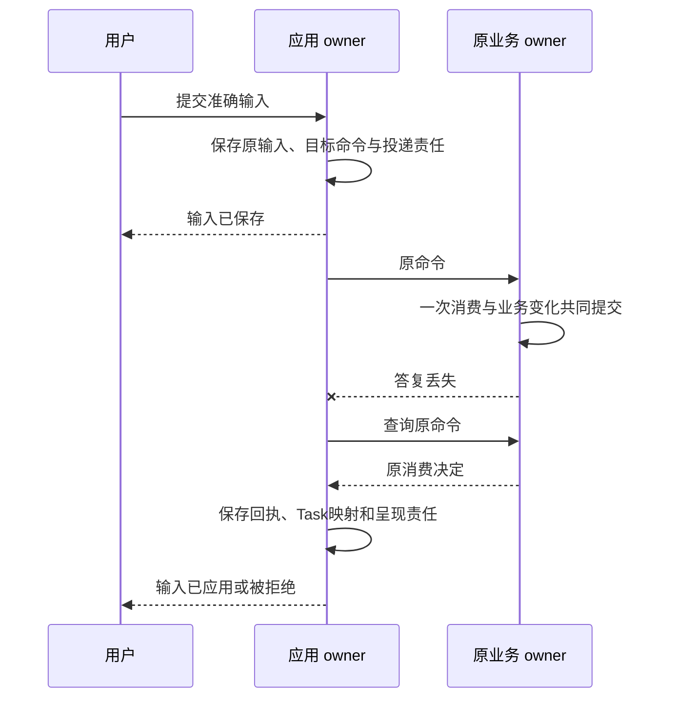

# 应用会话输入与未来触发

应用负责表达用户意图和呈现业务事实。它持久保存每条输入怎样投递，不替 Task、Grant 或 Executor 决定成功。关闭窗口、归档会话、切换分支和停止等待均不取消任务。

本系列补全 Session自由输入、历史分支和Schedule的最小合同。它们由应用 owner 加现有 JobStore 实现，不增加通用消息代理或独立调度服务。

## 1 会话与任务的关系

Session 组织消息和任务，Task 组织目标。一段 Session 可以有多个 Task；一个 Task 可以跨多个 Decision 和 Operation。所谓Turn是原提交、消费与回复的关联视图，不另建执行状态机。

Session 保存 owner/id/revision、open/archived/deleted、默认分支。Message 保存 parent_message_id、单调seq、准确content_ref、role和submission_ref。Branch 保存head、来源分支/截止和配置引用；更新head使用CAS。

Submission 保存原输入身份、kind、session/branch/序号、准确正文、history_cutoff、目标Task或前序Task、原目标逻辑服务/Command、queued/sending/applied/rejected/withdrawn及撤回请求。即时提交时应用保存Message、Submission、原命令和Job后才发送。后续目标先保存不可变Submission意图、前置与绝对排队截止；满足交付条件后，在短事务中唯一固定dispatch命令、owner和首次接纳期限，再进入sending，后续不刷新原期限。

“输入已保存”“目标已接纳”“条件已就绪”必须分开。Message.role 不证明本人身份，原 Submission/Command 的受信主体绑定才提供来源依据。应用不把提炼结果当权威 Requirement；具体交接见[输入到条件](../data/requirement-lifecycle.md)。

“输入已保存”与“业务已应用”必须分开。旧输出绑定原Submission/Branch，不能写到用户后来选中的分支。

### Session的创建和查询

session.create的target是原应用owner；payload为session_id、default_branch_id、config_ref。原命令按共同规则判重后，在一个事务建立open Session、空Branch（history_cutoff=0）、原回执及必要Job，applied返回session_ref/branch_ref。不创建Task，不调用模型。相同session_id的不同配置或不同原创建身份为idempotency_conflict；已删身份不重用。首次接纳expires_at过期时持久拒绝原命令，已存在决定始终返回原决定。session.read/list返回当前获准元数据/分支分页；正文已清理返回gone视图，失联不返回not_found。child.create只有查到该原创建applied，才能开放handle。

## 2 三种自由输入有明确语义

| 入口 | 选定行为 |
| --- | --- |
| session.submit_goal | 始终创建新Task；首发前持久固定发现选定的Orchestrator与原命令 |
| session.steer | 指定active Task、expected_goal_revision和本人原文补充；由原Task owner消费为目标修订 |
| session.enqueue_goal_after | 保存一个后续新目标，等前项目标工作封闭后创建新Task/预算/命令 |

应用将steer投递为原task.steer。Task owner先持久保存补充准备、收紧门禁和控制传播，再固定完整目标并安排条件重核；旧Decision不能采纳。只有Task owner已持久接纳门禁，才约束后续准入。应用queued不能承诺已中断，已发送Operation继续核对。paused任务可接受补充但不自动resume；终态拒绝steer，UI让用户选择新目标。

follow-up默认是第三种，避免含混地复活原Task。前项目标终态、相关未知效果和可迟到输入已不再能启动目标工作后才交付；单纯迟到账务不阻止独立新目标。明确独立并行的工作直接submit_goal。

FIFO只约束同分支的新目标队列，默认每分支最多20项、每用户100项。当前Task的回答、steer和控制独立优先转交；同一Task的steer按自身seq保序，避免等待前项完成的后续目标挡住前项所需回答。原expected_revision冲突不自动改值重排。queued撤回与发送准备在同一Submission行锁下竞争；sending后只记录withdrawal_requested并查原命令，不能声称已撤回。取消Task A不自动清Task B或后续队列；显式清队列逐项返回结果。

### 输入方法的成功点

应用接口继承[共同方法合同](../protocol/method-contract.md)。`session.submit_goal` 固定 session_ref、branch_ref、expected_branch_revision、content_ref、attachment_refs、policy_ref、budget、task_deadline；`session.steer` 另固定 target_task_ref/expected_goal_revision；`interaction.input` 固定 request_ref、answer_ref、preview_refs。三者的 applied 只返回 submission_ref/state=queued 和原投递查询入口，不能直接承诺Task已消费。

应用先在同一事务保存原Message/Submission、分支head及投递责任，再发原业务命令。内容尚不可取得、分支 CAS 冲突或 Interaction 所属库耐久提交失败时不发送。state从queued经sending到applied/rejected；withdraw只在queued下可提交withdrawn，sending后返回withdrawal_requested并继续查原业务决定。错误reason为 branch_changed、input_unpublished、request_target_mismatch、queue_full、already_sending；表单服务端重新校验答案，不能相信renderer通过。

`submission.read` 返回原输入、目标owner/command、当前投递阶段及原Task/请求消费映射；权限不足时返回redacted，不重投。明确区分task.input的“业务回答消费成功”与interaction.input的“应用转交已保存”。同一回复只归原分支。独立应用InputRequest可以没有Task，不能为了统一接口虚构Task。

## 3 精确请求与受信表单

InputRequest归实际消费它的业务owner，固定request_id/revision、target、适用时的goal_revision、问题Content、允许回答Schema、预览引用、expires_at和状态。`interaction.input`负责持久转交，`task.input`或对应业务方法负责一次消费。

独立应用请求可以没有Task；成果验收还固定candidate_ref/hash和准确可见限制。

Surface可以关联Task，也可以独立存在。它保存准确app_binding、surface_id/revision、准确快照、请求引用和生命周期。application_event只进入该绑定登记的事件Schema/handler与固定目标Command，前端不能任意选择method/URL。Presentation保存端点、版本、open/close意图与intent_revision；呈现器每次读取的 generation 绑定主体、Surface、意图和请求版本。关窗/换页/重连/撤权使旧snapshot/body/not_modified回调失效；正式快照先耐久再提示。not_modified也核当前披露和保留资格，不能只比Surface修订。显示或点击不直接证明消费。

输入块只引用request_ref，表单Schema只能来自原owner的InputRequestView。Renderer支持受限字段类型、选项和声明约束，不执行任意脚本或远端Schema。Renderer只有取得完整准确必需正文、校验摘要并成功呈现才启用依赖按钮；仅摘要、下载失败或渲染失败不满足，普通无依赖控制仍可用。提交携准确request_revision、结构化答案和预览引用；业务owner重新校验，不相信前端验证通过。

Confirmation另按[安全合同](../security/README.md)绑定原准确命令并一次消费。Renderer负责取得并显示准确正文；preview_refs不是用户阅读证明。离线界面可以暂存回答，过期或改版后业务端拒绝，不自动重新解释。

## 4 状态展示和集合恢复

UI分别展示任务接纳、等待、控制决定、执行端落实、效果、完成依据、费用与清理。模型流片段标provisional；只能由持久Result声明正式完成。原效果unknown或外部停止未确认时显示责任方及下一步，不用绿色勾统一盖住。

订阅只提示“某对象可能有更新”。客户端先订阅取得水位并缓冲，再分页读完整授权集合，再处理水位之后包括未知ID在内的提示；缺口、权限变化或缓冲溢出时重建快照。更新按对象修订，不从不同owner的墙钟猜全局先后。

跨Orchestrator任务列表由身份权威的用户来源目录定位，客户端不能自报完整来源。每来源同时登记全部披露授权权威。首屏和每次续页核对目录版本及所有授权范围代次；任何变化废弃旧聚合游标。按 `(created_at,orchestrator_id,task_id)` 稳定合并各来源，维护每来源游标、上界和缓冲；不得把已取未返回项丢掉。

一来源失联返回已知部分及来源级gap，不输出受限对象ID。所有来源遍历完且无gap只能称“该查询范围已遍历”，不是同刻全局快照。恢复预算初值100页/10000项/60秒，自动重建最多2轮，仍不完整则显示缺口，避免快照风暴。

## 5 分支只改变未来上下文

`session.branch.create(source_head,expected_source_revision)`复制准确历史引用及截止，不复制Task、Operation、Grant use、预算或Job。切换分支只改变之后的上下文选择，零模型和零工具调用。

活动Task固定创建时branch/cutoff。选择旧分支不得把文件、发送过的消息或设备操作倒回过去，也不把活动Task搬到新分支。复用历史仍须当前来源和用途许可。branch head并发冲突显式返回，不把迟到输出追加到当前分支。

## 6 未来和周期规则

Schedule由应用owner保存，TriggerWorker复用原JobStore。保存规则不授予永久行动许可。以下字段、时间边界、交付切点和状态一起组成首版合同。

首版只支持下列闭合 ScheduleSpec。日历值均按固定 timezone/tzdb_version 解释，计划时点为秒精度，effective_after保留裁决时间原精度，不先取整；weekdays 为 ISO 1..7，monthdays 为1..31，数组必须去重升序。Occurrence只对应能解析为UTC的合法计划时点；DST空缺和不存在的月日按规则不生成Occurrence，不得伪造UTC时间。不得把任意 RRULE 或cron字符串塞入spec。

| type | 必填字段 | 计算规则 |
| --- | --- | --- |
| once_at | at:Time | 只产生该UTC时点；创建时at≤effective_after则expired/schedule_time_elapsed；已接纳后错过则保存skipped |
| interval | anchor_at:Time、every_seconds:Count且>0 | anchor_at+n×every_seconds，n≥0；编辑保留输入明确给出的anchor，不按worker启动时间重算 |
| daily | local_time:HH:MM:SS | 每个当地日期的该时间 |
| weekly | local_time、weekdays:int[1..7] | 只选指定当地星期 |
| monthly | local_time、monthdays:int[1..31] | 只选存在的当地日期；不存在跳过，不滚到下月 |

新规则只考虑 `planned_at > effective_after`。effective_after 在create/update原事务由owner可信时钟固定；与同锁到期竞争，先生成的旧Occurrence保留，后编辑不能重写它。无未来时点时 next_due_at 省略并置 exhausted=true；state仍enabled/paused/deleted，不伪造一次触发成功。tzdb无法取得则dependency_unavailable，不用宿主默认版本替代。首版max_concurrency固定1，misfire阈值60秒，DST缺时skip、重复取earlier，不补跑。

规则需要跨过很长停机区间时，next_due_at及原扫过区间持久推进。每批最多100个过期时点或10ms计算预算；记录bounded missed_range及下个游标，继续Job，不在一次事务展开多年Occurrence。missed_range只表达已跳过的计划时点范围/规则版本/数量，不能冒充逐次执行记录；需要逐次审计时再分页物化。恢复总预算受TaskPolicy/租户限制，不以无穷catch-up占用控制池。

### 接口、交付和状态

| 方法 | payload与CAS | applied / 查询输出 |
| --- | --- | --- |
| schedule.create | spec:ScheduleSpec、timezone、tzdb_version、template_ref、policy_ref、install_lock_ref、task_timeout_seconds、budget | schedule_ref、rule_revision、next_due_at?、exhausted；规则和首Job已存 |
| schedule.update | schedule_id；CAS；完整替换上述配置 | schedule_ref、新rule_revision/effective_after；已生成Occurrence不重解释 |
| schedule.pause / resume / delete | schedule_id、reason；CAS | schedule_ref、state、affected_occurrences:CollectionSummary；只控制未来交付，不自动取消Task |
| schedule.read/list | 原schedule或统一分页 | 当前配置、规则版本、活动槽/未知范围与next_due |
| schedule.skips.list | schedule_id、rule_revision?、统一分页 | 返回有界missed/paused区间；这是跳过汇总，不是执行Occurrence |
| occurrence.read/list | occurrence_id或schedule_id+统一分页 | phase、原命令/owner、Task映射、slot_closed及原closure依据 |

task_timeout从planned_at起算，`Task.deadline=planned_at+task_timeout_seconds`；`accept_before=min(Task.deadline,planned_at+60秒)`。重试和停机不延长这两个值。到期事务分两支：槽为空时保存recorded Occurrence、冻结输入/历史和期限，并占用该槽；槽已满时保存skipped/overlap，不占新槽也不修改旧槽。任何释放必须比较槽中的occurrence_id。首次派发准备在同Schedule锁内完成 recorded→sending，复查当前启停、原固定配置/当前许可/预算，再固定唯一owner、完整submit Command和发送Job。该事务提交后视为可能交付，pause不再保证撤回。

| 原phase | 允许下一步及槽处理 |
| --- | --- |
| recorded | 门禁有效且未超期→sending；被pause/delete阻断、已missed或容量策略skip→skipped并释放其槽 |
| sending | 只重传完全相同的幂等task.submit或查原回执；applied→accepted，固定rejected→rejected。临时not_found/失联不释放槽 |
| accepted | 保存Task映射；只有原Task的goal_work_closed与effects_closed均为true，才slot_closed并释放槽；纯账务不阻塞 |
| skipped/rejected | 终结本Occurrence；不复用身份，不恢复原规则实例 |

submit的原首次接纳期限已过时，重传相同原命令仍只能返回原applied，或在原命令键下持久拒绝expired；这能关闭确定未接纳的原创建，不能换ID/刷新expires_at。接收方不支持这种原键去重/拒绝查询时，不开放Schedule交付能力。活动槽保存occurrence_id、slot_closed、closure_ref/核验来源修订；Task终态、消息送达或费用为零都不足以释放。

特有错误reason为 unsupported_spec、invalid_calendar_value、tzdb_unavailable、rule_changed、schedule_time_elapsed、active_slot_unknown。update与控制CAS冲突不自动重放新版本。schedule.delete保留原Occurrence/Task映射及墓碑；明确的“同时取消任务”逐项生成原task.cancel，返回集合落实状态。

resume与到期使用同一Schedule锁。resume先保存暂停区间的跳过依据，再将next_due_at推进到当前裁决时间严格之后的合法时点；rule_revision不因恢复而改变。它不补发暂停期间时点，也不改写此前已生成或可能发送的Occurrence。

## 7 应用恢复验收

浏览器SDK先确认IndexedDB事务成功才首次发送；存储失败拒绝新发送。刷新/断线沿原命令恢复，本地记录全丢后可以从受信目录找已接纳Task，但不能凭相似目标文本重投新ID。

必须测：输入保存后退出、业务消费后丢答复、queued撤回与sending竞争、确认改版、分支切换时迟到输出、来源新增/撤权与跨页竞争、Schedule编辑/停用/DST/重启，以及终态Task不被后续消息复活。所有新接口属于本系列待实现合同，不能以已有UI原型宣称互操作已完成。
