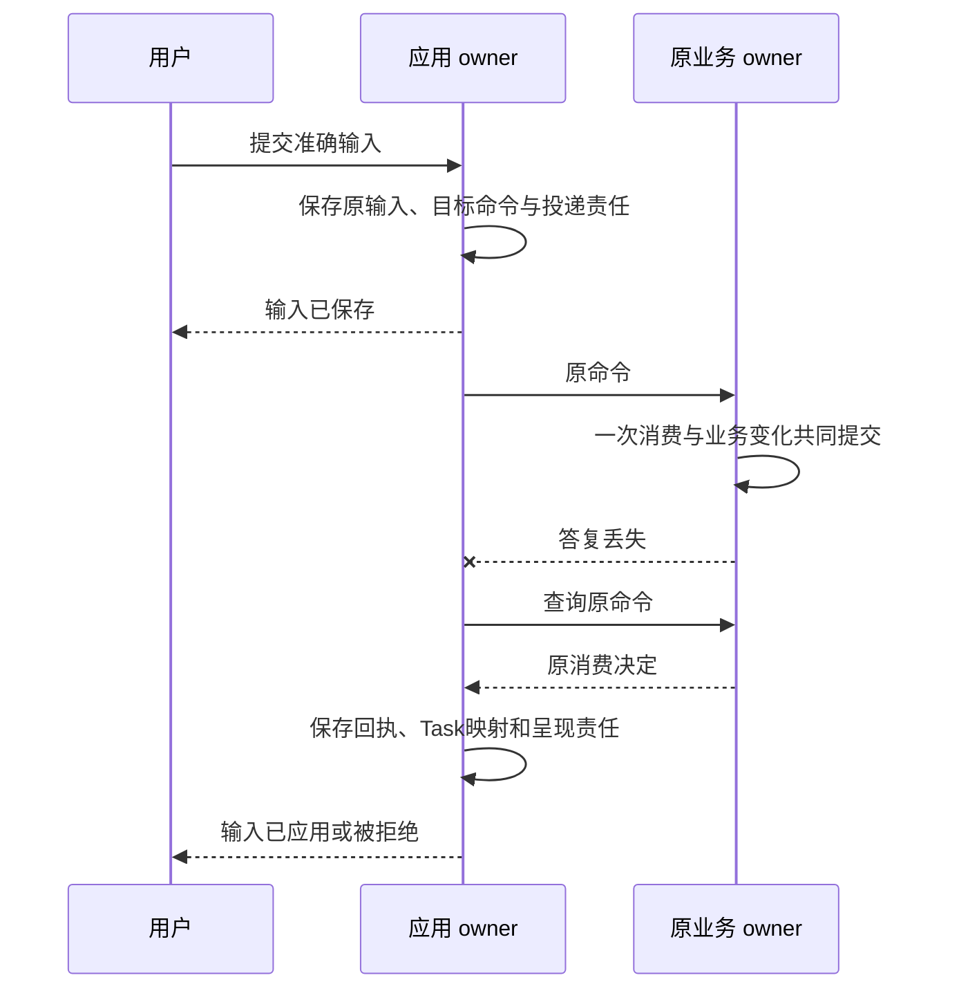

# 应用会话输入与未来触发

应用负责表达用户意图和呈现业务事实。它持久保存每条输入怎样投递，不替 Task、Grant 或 Executor 决定成功。关闭窗口、归档会话、切换分支和停止等待均不取消任务。

本系列补全 Session自由输入、历史分支和Schedule的最小合同。它们由应用 owner 加现有 JobStore 实现，不增加通用消息代理或独立调度服务。

## 1 会话与任务的关系

Session 组织消息和任务，Task 组织目标。一段 Session 可以有多个 Task；一个 Task 可以跨多个 Decision 和 Operation。所谓Turn是原提交、消费与回复的关联视图，不另建执行状态机。

Session 保存 owner/id/revision、open/archived/deleted、默认分支。Message 保存 parent_message_id、单调seq、准确content_ref、role和submission_ref。Branch 保存head、来源分支/截止和配置引用；更新head使用CAS。

Submission 保存原输入身份、kind、session/branch/序号、准确正文、history_cutoff、目标Task或前序Task、原目标逻辑服务/Command、queued/sending/applied/rejected/withdrawn及撤回请求。即时提交时应用保存Message、Submission、原命令和Job后才发送。后续目标先保存不可变Submission意图、前置与绝对排队截止；满足交付条件后，在短事务中唯一固定dispatch命令、owner和首次接纳期限，再进入sending，后续不刷新原期限。

“输入已保存”与“业务已应用”必须分开。旧输出绑定原Submission/Branch，不能写到用户后来选中的分支。

## 2 三种自由输入有明确语义

| 入口 | 选定行为 |
| --- | --- |
| session.submit_goal | 始终创建新Task；首发前持久固定发现选定的Orchestrator与原命令 |
| session.steer | 指定active Task、expected_goal_revision和本人原文补充；由原Task owner消费为目标修订 |
| session.enqueue_goal_after | 保存一个后续新目标，等前项目标工作封闭后创建新Task/预算/命令 |

steer在Task锁内保存新目标、控制修订、重新核验与decide责任，使旧Decision不可采纳；已发送Operation继续核对。只有Task owner已消费后才约束下一准入，应用queued不能承诺已中断。paused任务可接受补充但不自动resume；终态拒绝steer，UI让用户选择新目标。

follow-up默认是第三种，避免含混地复活原Task。前项目标终态、相关未知效果和可迟到输入已不再能启动目标工作后才交付；单纯迟到账务不阻止独立新目标。明确独立并行的工作直接submit_goal。

FIFO只约束同分支的新目标队列，默认每分支最多20项、每用户100项。当前Task的回答、steer和控制独立优先转交；同一Task的steer按自身seq保序，避免等待前项完成的后续目标挡住前项所需回答。原expected_revision冲突不自动改值重排。queued撤回与发送准备在同一Submission行锁下竞争；sending后只记录withdrawal_requested并查原命令，不能声称已撤回。取消Task A不自动清Task B或后续队列；显式清队列逐项返回结果。

## 3 精确请求与受信表单

InputRequest归实际消费它的业务owner，固定request_id/revision、target、适用时的goal_revision、问题Content、允许回答Schema、预览引用、expires_at和状态。`interaction.input`负责持久转交，`task.input`或对应业务方法负责一次消费。

独立应用请求可以没有Task；成果验收还固定candidate_ref/hash和准确可见限制。

Surface可以关联Task，也可以独立存在。它保存准确app_binding、surface_id/revision、准确快照、请求引用和生命周期。application_event只进入该绑定登记的事件Schema/handler与固定目标Command，前端不能任意选择method/URL。Presentation保存端点、版本、open/close意图与intent_revision；本地每次读取generation绑定主体、Surface、意图和请求版本。关窗/换页/重连/撤权使旧snapshot/body/not_modified回调失效；正式快照先耐久再提示。not_modified也核当前披露和保留资格，不能只比Surface修订。显示或点击不直接证明消费。

输入块只引用request_ref，表单Schema只能来自原owner的InputRequestView。Renderer支持受限字段类型、选项和声明约束，不执行任意脚本或远端Schema。Renderer只有取得完整准确必需正文、校验摘要并成功呈现才启用依赖按钮；仅摘要、下载失败或渲染失败不满足，普通无依赖控制仍可用。提交携准确request_revision、结构化答案和预览引用；业务owner重新校验，不相信前端验证通过。

Confirmation另按[安全合同](../security/README.md)绑定原准确命令并一次消费。Renderer负责取得并显示准确正文；preview_refs不是用户阅读证明。离线界面可以暂存回答，过期或改版后业务端拒绝，不自动重新解释。

## 4 状态展示和集合恢复

UI分别展示任务接纳、等待、控制决定、执行端落实、效果、完成依据、费用与清理。模型流片段标provisional；只能由持久Result声明正式完成。原效果unknown或外部停止未确认时显示责任方及下一步，不用绿色勾统一盖住。

订阅只提示“某对象可能有更新”。客户端先订阅取得水位并缓冲，再分页读完整授权集合，再处理水位之后包括未知ID在内的提示；缺口、权限变化或缓冲溢出时重建快照。更新按对象修订，不从不同owner的墙钟猜全局先后。

跨Orchestrator任务列表由身份权威的用户来源目录定位，客户端不能自报完整来源。每来源同时登记全部披露授权权威。首屏和每次续页核对目录版本及所有授权范围代次；任何变化废弃旧聚合游标。按 `(created_at,orchestrator_id,task_id)` 稳定合并各来源，维护每来源游标、上界和缓冲；不得把已取未返回项丢掉。

一来源失联返回已知部分及来源级gap，不输出受限对象ID。所有来源遍历完且无gap只能称“该查询范围已遍历”，不是同刻全局快照。恢复预算初值100页/10000项/60秒，自动重建最多2轮，仍不完整则显示缺口，避免快照风暴。

## 5 分支只改变未来上下文

`session.branch.create(source_head,expected_source_revision)`复制准确历史引用及截止，不复制Task、Operation、Grant use、预算或Job。切换分支只改变之后的上下文选择，零模型和零工具调用。

活动Task固定创建时branch/cutoff。选择旧分支不能把文件、发送过的消息或设备操作倒回过去，也不把活动Task搬到新分支。复用历史仍须当前来源和用途许可。branch head并发冲突显式返回，不把迟到输出追加到当前分支。

## 6 未来和周期规则

Schedule由应用owner保存，TriggerWorker复用本地JobStore。新增`schedule.create/read/list/update/pause/resume/delete`和`occurrence.list/read`为版本化应用扩展；保存规则不授予永久行动许可。

Schedule固定：id/revision/state、IANA timezone、tzdb_version、spec、准确template/policy/install引用、任务期限和预算、effective_after、next_due_at。首版spec只支持once_at、固定interval及daily/weekly/monthly日历规则；不能表达的请求明确拒绝，禁止静默近似。

选定默认：max_concurrency=1；错过超过60秒skip；DST不存在时刻skip、重复时刻取earlier；月度不存在日期skip；前次目标未封闭或容量不足时记录skipped，不排无限补跑。一次性规则错过也明确显示missed/skipped。首版不支持补跑；用户可以显式提交新Task，原skipped记录保留，不伪装成原触发成功。

Occurrence以 `(schedule_id,rule_revision,planned_at_utc,fold)` 唯一，固定local_slot、模板/历史截止、原命令及选定owner、phase=recorded/sending/accepted/skipped/rejected、原回执与Task映射。

到期事务锁Schedule，验证版本/启停/next_due，唯一生成occurrence并占用单活动槽、保存原交付责任，再推进next_due。占用覆盖recorded、sending接纳未知及已接纳而目标未封闭的Task；不能只数已有task_ref，未知创建不释放槽。规则编辑同锁固定新的effective_after，只影响其后未生成触发，不修改答复未知的旧载荷。发送前复查当前enabled/pause/delete门禁、该Occurrence原固定规则/配置、当前来源/Grant、预算与期限；普通规则更新不重解释或撤销已生成Occurrence；sending之后丢答复只查原Task接纳。

pause/delete先封新occurrence和可证明未发送项。已sending继续核对，已accepted的Task不自动取消。用户要求同时停止已发起任务时，逐项保存原cancel命令并展示未确认范围。resume默认不补历史。时区与时间判定用固定tzdb和可信时钟，不用worker本机默认时区。

## 7 应用恢复验收

浏览器SDK先确认IndexedDB事务成功才首次发送；存储失败拒绝新发送。刷新/断线沿原命令恢复，本地记录全丢后可以从受信目录找已接纳Task，但不能凭相似目标文本重投新ID。

必须测：输入保存后退出、业务消费后丢答复、queued撤回与sending竞争、确认改版、分支切换时迟到输出、来源新增/撤权与跨页竞争、Schedule编辑/停用/DST/重启，以及终态Task不被后续消息复活。所有新接口属于本系列待实现合同，不能以已有UI原型宣称互操作已完成。
