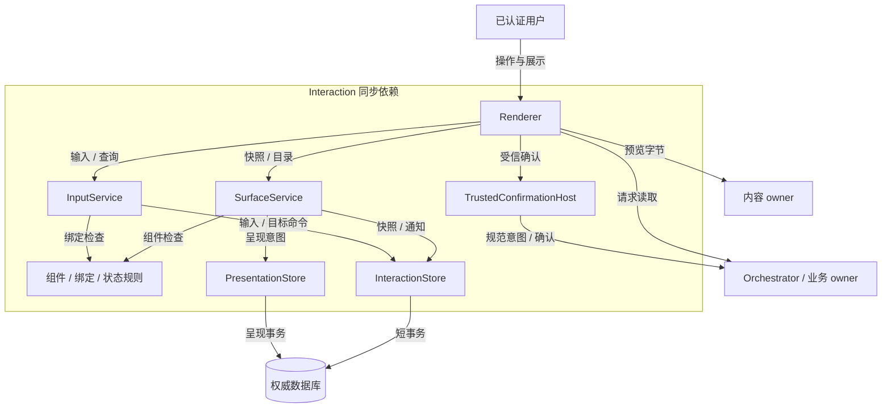
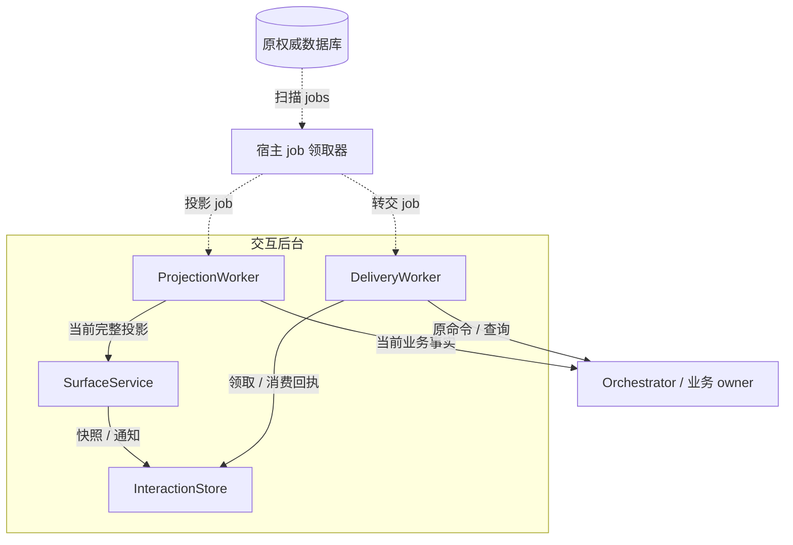
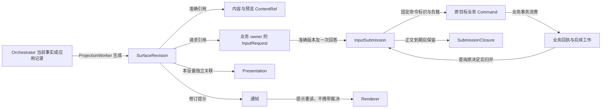
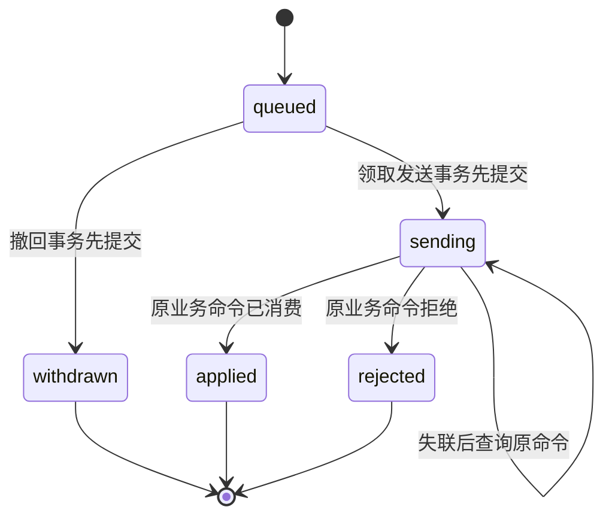
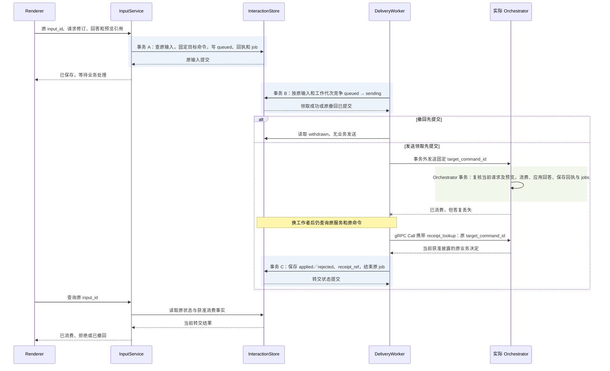

# 交互实现：声明式快照、可靠输入与受信确认

[模块主线](README.md) · [任务编排器](../orchestrator/README.md) · [内容与清理](../memory/implementation.md)

本实现核心使用 Go，提供 CLI 和 Web 两个适配器，共用 Surface、输入转交和请求消费契约。
浏览器、CLI 和设备经 `/v1/connect` 的 WSS 双向长连接调用；HTTPS 保留发现、认证和大文件传输，精确协议编码格式见[公共传输契约](../contracts/transport.md)。
界面对象（Surface）保存版本化快照与请求引用；SurfaceSnapshot 是某一版本的界面快照，Presentation 保存某台设备的打开／关闭意图及已呈现修订。三个对象的状态分别记录。
UI 可以显示已保存、处理中、已消费或拒绝，不能自行裁决任务成功或签发许可。
本文定义参考组件和协议行为，浏览器与终端的运行验收仍待实现。

<a id="module-shape"></a>
## 1. 模块结构、内部分工与正常路径

用户为任务选择保存目录时，交互服务先固定回答、请求修订和唯一目标命令。
Orchestrator 消费请求后保存目标参数及下一项工作；交互服务查询原命令取得结果，再更新可见快照。
期间关闭页面只改变本端呈现，不取消任务或撤销已经消费的输入。

交互模块由持久交互服务与 CLI／Web 宿主适配器组成。SurfaceService 和 InputService 是服务 facade，
application 层执行快照投影、输入转交和状态比较；InteractionStore 将业务表、回执和 jobs 映射到宿主数据库。
PresentationStore 封装设备呈现意图。Renderer 和 TrustedConfirmationHost 是宿主侧组件，
通过既有内容、请求与业务 owner port 工作；它们不是新增的任务或授权裁决层。
本机通过 Go 接口同进程装配，云端独立进程间使用 gRPC；可以分开部署连接层和服务，但协议选择不要求拆分模块或共库事务，领域对象标识及事务边界保持一致。
组件格式、请求引用覆盖和转交状态比较是同包纯规则函数；application 层取得当前事实后调用，
再由 store 的条件事务固定结果，规则函数本身不负责网络或持久化。



下面单独展示持久工作领取与继续处理。与上图同名的组件、store 和权威库均为同一对象，不表示另建服务或数据库。



两图实线为同步依赖，虚线为从原数据库领取持久工作；store 仍在同一权威库的短事务中保存业务记录、回执和 jobs。
外部调用不位于交互数据库事务内。Renderer 与 TrustedConfirmationHost 属于 CLI／Web 宿主，其余组件属于持久交互服务；两图只分开观察调用和恢复依赖。
不同用户动作可以由同一个宿主进程调用上述组件，逻辑分工不等于独立微服务。
快照更新不反向获得业务裁决权。
普通表单处理器只能接收自己登记的事件；授权确认使用独立受信入口。

| 组件 | 保存或处理的事实 | 不承担的责任 |
| --- | --- | --- |
| SurfaceService | 快照版本、固定应用绑定、来源修订 | 不解释模型 HTML 或脚本 |
| ProjectionWorker | 从当前 Orchestrator 记录生成完整快照 | 不维护第二份任务状态机 |
| InputService | 原输入、固定转交命令、撤回竞争 | 不把排队解释成业务已消费 |
| DeliveryWorker | 原目标发送、查询及回执保存 | 不因超时更换目标命令 |
| PresentationStore | endpoint 的 open、intent_revision、seen_revision | 不以显示状态证明用户同意 |
| Renderer | 受支持组件、内容读取、依赖输入禁用 | 不签发授权或验证外部效果 |
| TrustedConfirmationHost | 本人认证与准确内容展示 | 不相信插件提供的“已批准”字段 |
| InteractionStore | 快照、输入、应用事件与回执／jobs 的原子存储 | 不跨数据库消费 Orchestrator 请求或 Confirmation |

默认完整快照较易恢复。通知仅提示对象变化，遗漏后通过读取恢复。
局部补丁会引入版本应用顺序和客户端状态成本；当前不实现补丁协议。

### 1.1 长连接入口与恢复

WSS 网关把已认证的 Command、Query 和原回执查询交给原业务 owner；同连接返回结果并主动发送 Change。
浏览器以同源 Secure、HttpOnly 会话 Cookie 握手，网关校验 Origin；CLI／设备以 bearer 凭据握手。
连接认证不授予后续永久访问权限：每条消息都核对当前会话或端点代次及方法权限，推送和查询返回前也核对当前披露权限。
网关只持有连接、路由和有限发送队列，不能将传输 ACK 或 ReplyAck 写成 InputRequest 已消费的业务事实。

Change 只提示重新读取，可按 Surface 合并、重复或遗漏。重连先恢复原 input_id／command_id 的未结查询，再读取当前获准快照与本设备呈现意图。
连接中断不撤销已提交命令；只有查原业务回执才能确认消费或拒绝。无持久宿主的离线浏览器仍只能承诺本端待发送，不能显示“业务已消费”。
设备侧的 Delivery、Reply 与 ReplyAck 沿原 delivery_id 和业务对象标识恢复，连接或网关更换不创建第二项责任；具体确认和保留规则由公共传输契约集中定义。

<a id="reliable-work-integration"></a>
### 1.2 公共框架接入：转交与消费的两个本地事务范围

SurfaceService、InputService 复用[可靠接纳模板](../reliable-work.md#admission)，ProjectionWorker 和 DeliveryWorker 复用[有限工作循环](../reliable-work.md#claim)。InteractionStore 将原命令、快照／输入／事件及必要责任映射到交互数据库的同一本地事务范围。实际 InputRequest 和 Confirmation 的消费仍由各自 consumer owner 在其业务事务决定；框架不把它们移到交互库，也不以转交完成裁决任务成功。

InputService 用 `transaction.Within` 将 InputSubmission 或 ApplicationEvent、固定目标 logical_service_id、完整原目标 Command、交互回执与 `jobs.Raise(tx)` 共同保存。该提交只确认输入或事件已持久接纳；业务目标的原回执由 DeliveryWorker 在事务外取得，再用另一短事务保存消费投影。Surface 更新与变化提示共事务，Presentation 的打开／关闭独立保存。原目标暂不可达不影响交互服务保存本设备呈现意图，也不能让它先报业务已消费。

下表作业去重键带认证 tenant 和交互 owner；Surface、独立应用事件可以没有 task_ref。固定 target_command_id 是目标命令标识，job_id 是宿主作业标识，两者不能相互替代。

| 作业去重键与处理器 | 固定标识及事务参与者 | 完成、等待与恢复判据 |
| --- | --- | --- |
| `session_delivery / 目标逻辑服务 / command_id`：应用 DeliveryWorker | app_messages、app_command_outbox、固定目标服务／完整 Command、创建来源关联 | 原 Task 接纳或明确拒绝已保存，并将其与原消息关联后完成；Task 已接纳而关联未知时查原 Command 补关联，不新建目标。字段及共同提交见[会话存储](#session-storage) |
| `input_delivery / input_id`：DeliveryWorker | input_submissions、原目标服务／Command、原请求及准确回答／预览引用 | 撤回在发送前胜出，或已保存原业务 applied／rejected 回执才结束；sending 后未知保持原查询，不换输入或目标命令 |
| `event_delivery / event_id`：DeliveryWorker | application_events、固定 app_binding／处理器、原目标 Command | 只从原处理器查询消费决定；超时不能改派新处理器；原业务无查询能力时不开放有副作用事件 |
| `projection / surface_id`：ProjectionWorker | Surface、surface_projection 的已应用／待覆盖来源修订、投影停止依据、内容／请求引用及变化提示 | 关联存续期间持续核对原来源，当前已追平仍保存有限 waiting；只发布完整投影，旧版本不覆盖新快照；获准清理结束投影且残留责任已交接后才请求 done |

表中 delivery_jobs 与投影作业由逻辑 JobStore 承载，物理共表或分表保持现有布局。输入发送前，领域处理器先锁原输入，再锁作业记录，在同一事务核验 `jobs.Guard` 并裁决 queued→sending 与 withdrawn；Claim 本身不完成这项业务竞争。远端调用结束后按同一锁序归并事实并调用 `jobs.Finish`，使用[公共领取与作业版本规则](../reliable-work.md#completion)。若发送已经可能发生，租约接替或停止信号都不证明未消费，接替者仍查原业务命令。真正的迟到消费回执可沿独立认证的归并入口保存，但失效领取不能据此结束作业或覆盖新责任。

任务 Surface 创建或受信登记投影关联时，同事务建立 projection 作业记录。只要该投影仍提供页面，追平当前来源后仍以有限 waiting 继续核对原 Orchestrator；Task 终态、本设备关窗或一次快照到期都不自动结束这项责任。Surface 按保留策略获准清理时，同事务保存投影停止依据，并交接未结输入、内容及清理责任，之后才请求完成；task_ref 始终固定，不新增解除或改绑它的公开方法。

Surface 源核对发现尚未覆盖的新修订时，ProjectionWorker 保存经原 owner 核实的 `required_source_revision`，并与同一作业记录中的新增工作共同提交；若同事务已完成该修订的快照发布，则不再为已覆盖事实增加工作。`last_source_revision` 只随完整快照发布前移，保存待覆盖修订不能冒充页面已更新。可丢 Change 通过公共 Hint 提前尚未结束的作业记录的 due_at，不把每条通知解释成新业务责任；完全没有提示时原定期核对仍会读取新修订。旧工作完成时若已有新责任，保留原作业的可领取状态和较早的执行时间。核对间隔和退避上界按页面刷新目标在部署前冻结，额外查询及回写计入活跃 Surface 容量；不为每条连接各创建作业记录。页游标、Presentation 修订、业务请求修订与 work_revision 各有含义，不能相互充当已经处理的证明。

`surface_read`、request_read、input_read、列表与聚合分页保持查询；聚合游标的条件保存只保证续页一致，不新增后台业务队列。surface_create／update、present 等可同步保存决定及必要提示，不强制每次建 job。surface_notifications 是可合并的变化提示，丢提示后仍能读当前快照；它既不是原输入转交责任，也不是设备传输的 Delivery／Reply 账本。后者按[传输契约](../contracts/transport.md)保存自己的确认与恢复所用标识，ReplyAck 不结束尚无业务决定的 input_delivery 作业。

共同[观测](../reliable-work.md#observability)分别记录本地接纳、目标命令未决和快照投影等待；业务消费耗时不混入页面实际呈现或本人理解的指标。工作池为原输入核对、撤回和管理控制保留有限容量，普通快照提示与慢页面不能占尽这些保留容量。无持久宿主的浏览器不因采用相同模板接口就取得可恢复接纳能力。

<a id="application-composition"></a>
### 1.3 Session 与默认应用组合

应用组合入口位于既有交互宿主与领域 ports 之上，具体动作见[默认应用工作流](../application-workflow.md#entry-points)。它负责持久保存原提交、固定目标、查询原决定和组织呈现；TaskCoordinator 仍是唯一任务推进与完成裁决者。SDK 不提供另一条模型循环，不要求普通应用逐项维护 Decision、Attempt、Job 或 Claim。

Session 消息保存消息身份、顺序、获准正文引用及原提交关联；Task 的创建来源关联至多一个 Session，其他界面只引用原 Task。跨事务提交时，消息、完整原命令和交付 outbox 在应用库共同保存，Task 接纳后按原 submit_command_id 补关联；应使用既有交付框架，不新增通用 Session Run 作业。直接 API 调用可无 Session，原负责方和恢复身份仍必须固定。

应用记录的默认承载是 InteractionStore 所在本地事务数据库；具体[逻辑记录、唯一约束与提交顺序](#session-storage)如下。应用可以将这些记录嵌在既有聚合中，或复用命令/outbox 表；逻辑分工不要求每个对象独立建表。应用 Session ID 不进入未定义的公共 task.submit 字段，创建来源通过应用已保存的原 Command 与 Task 回执关联。

首版线性 Session 与 Surface、InputRequest、InputSubmission 分工独立：消息保存不证明问题已消费，Surface 是呈现对象，InputRequest 的创建／修订／消费仍归实际业务 owner。回合按原提交及回复关联生成投影；不能只有一个 task.status 而丢失多次输入的身份和控制范围。后续分支的数据要求及未开放范围见[历史分支](session-and-task.md#history-branches)。

应用必须按当前已支持的动作显示入口：独立目标提交 Task，结构化回答走原请求，控制绑定准确 Task，笔记只保存正文。普通聊天 steering／follow-up 没有公共合同时不把它编码为任意 task.input 或 task.cancel。原输入字段、消费事实、用户可见状态和各阶段的共同提交范围见[四类数据流程](../request-data-flows.md#transaction-boundaries)。

## 2. 严格声明式组件

Surface 固定 app_binding、surface_owner_id 和可选 task_ref。
blocks 是有界有序组件集合，每项 block_id 在本快照内唯一。
不允许自由 HTML、脚本、可执行 URL、任意事件名称或模型自定义组件实现。
内容引用可以指向已获准正文，渲染器必须取得当前可读字节后才显示。

| kind | 必需字段 | 可选字段与限制 |
| --- | --- | --- |
| text | block_id、content_ref | format 为 plain 或 markdown；Markdown 禁用原始 HTML 和脚本 |
| media | block_id、content_ref、alt | display 为 image／audio／video／file，不能据文件扩展名提升权限 |
| table | block_id、columns、rows | 列和单元格为有限纯文本；不执行公式或内嵌事件 |
| input | block_id、request_ref、label | 字段从准确请求修订的 schema 取得；只提交原请求，按钮是否启用由请求依赖决定 |
| action | block_id、request_ref、action_id、label | action_id 必须来自业务请求 allowed_actions |
| status | block_id、code、label | code 为 queued、working、waiting、done、error 或 unavailable；只是呈现 |

纯文本字段仍受快照披露权限约束，不能把敏感标题或表格绕过内容治理写入公开目录。
text 的 Markdown 链接只有受信导航器可以打开；链接文字不获得管理权限。
media 读取失败显示准确缺口，不把内容引用存在当作媒体已经呈现。
table 初值最多 20 列、100 行，每个单元格最多 512 个字符；大表通过内容附件读取。
不支持的组件种类拒绝 surface_update，不能忽略后继续消费依赖该组件的输入。

### 2.1 输入 Schema 子集

业务 owner 的 InputRequest.schema 采用封闭对象描述 fields，每字段有 name、type、required、label。
type 仅为 text、integer、boolean、choice 或 choices，不允许任意 JSON Schema 执行器扩展。
text 声明 max_length；integer 声明 minimum/maximum；choice(s) 列出准确 option ID 和标签。
choices 的选项数与最大选择数有界；不允许浏览器从远端脚本加载额外选项。

字段名不能重复；未知字段、重复选项或超限答案在宿主和业务端都拒绝。
Surface 只保存准确 request_ref 与块标签、布局，不复制字段 Schema；Renderer 从请求 owner 取得该修订的 schema 后生成表单，业务消费也使用这一份定义。
宿主原本就须读取当前请求及预览要求，复用这次读取可省去两份 Schema 的同步和兼容判断。代价是请求 owner 不可达时不能启用依赖表单；缓存快照不替代请求读取。
surface_update 校验组件格式与请求引用覆盖。请求修订已改变时，request_read 返回 revision_conflict，宿主禁用旧表单并刷新；无法用受支持字段表达的请求走受信专用入口。
表单 answer_ref 指向准确回答正文，不在重试时重新编码默认值。

<a id="input-answer-content"></a>
#### 回答正文的编码与校验

`answer_ref` 的 `media_type` 固定为 `application/json`，字节是无 BOM 的 UTF-8 JCS 编码，顶层遵循[回答正文 Schema](../../../contracts/schemas/input-answer.schema.json)。默认正文上限为 1 MiB；ContentPolicy、宿主与处理器声明的更小上限继续有效，取其中最小值。先严格解析并校验，再按 JCS 发布准确字节，由这些字节确定 ContentRef.hash 和 byte_length。重复键、非法 Unicode、非有限数值、整数舍入及额外顶层键均拒绝；字段值不裁剪、不转换类型、不注入默认值，也不做 Unicode 正规化。

普通 clarification／application 的封闭正文恰含 `format="input-answer/1"`、`action_id`、`fields`。action_id 必须在这份准确 InputRequest.allowed_actions 中；fields 是按 schema.fields[].name 建键的对象，不能提交 label、数组位置或未声明字段。required=true 的字段必须存在；optional 未答时省略，显式 null 不代表未答。空字符串和空多选集合是已经提交的值，分别按该字段的约束判断，不能静默改成省略。

| 输入类型 | JSON 值及准确校验 |
| --- | --- |
| text | 字符串；长度按 Unicode 码点计算，不超过 max_length，不把字符串当路径操作或脚本执行 |
| integer | JSON 安全整数，范围在 -9007199254740991 至 9007199254740991 内，并同时满足 minimum／maximum；不接收数字字符串或小数 |
| boolean | true 或 false；不以 0／1、空串或“是”代替 |
| choice | 一个 options[].id 字符串；显示标签和未登记 ID 拒绝 |
| choices | options[].id 字符串数组，值唯一且数量不超过 max_choices，按请求 options 的声明顺序编码；空数组表示选了零项，required 只约束字段是否存在 |

例如，当前请求声明必填的 directory 文本字段、file_type 单选字段（ID 为 pdf／markdown），allowed_actions 为 submit。用户填写 `/reports` 并选 pdf 后发布的完整规范正文为：

```json
{"action_id":"submit","fields":{"directory":"/reports","file_type":"pdf"},"format":"input-answer/1"}
```

同一请求下，纯文本 `/reports`、`{"directory":"/reports"}`、file_type 的显示标签、未知字段或 `directory=null` 都不是合法回答。[回答字节用例](../../../contracts/examples/input-answers/README.md)将请求声明、实际字节、ContentRef 和字段校验一起检查；只构造一个形式正确的 ContentRef 不能证明字段可解释。

Renderer 从请求 owner 读取准确修订后按此合同生成正文并发布 Content；InputService 取得同一字节，核对摘要、长度、格式、字段、action_id、预览及当前请求资格后才接纳。普通澄清的 task.input 和已登记 application 处理器在消费前再次读取该原 answer_ref 并独立校验，不信任“宿主已校验”标志。后续读取仍受当前内容状态与用途许可约束，正确摘要不替代当前资格。重投使用原 ContentRef 和原 Command，不重新序列化一个带新默认值的回答。

acceptance 使用同一版本的受限分支：action_id 固定为 accept，fields 恰为 `{"decision":"accept"}`，另含完整 consumer_command；confirmation_ref 只在其 payload 中。对应 InputRequest.schema 只含一个必填的 decision choice 字段，唯一选项 ID 为 accept，allowed_actions 恰为 `["accept"]`。标签用于呈现，不能增加补充意见或未交付给业务端的隐藏字段。该分支由 InputService 验证封套，实际 Orchestrator 复核原命令、确认、请求和候选，具体见[验收交付](#acceptance-delivery)。无法由受支持 Schema 和方法表达的行为走受信专用入口，不把任意文本或 JSON 塞进本封套。

### 2.2 请求和预览绑定

request_ref 为 owner_id、id=request_id 和 revision，不能只绑定一个按钮文字。
request_read 是只读 Query，输入 request_ref，输出 request 与 gaps；旧修订返回 revision_conflict。
业务负责端复核认证主体、当前披露与请求版本，返回 question_ref、schema、deadline、required_content_refs、allowed_actions 和 state。
state 为 open、consumed、expired 或 superseded；consumed 同时返回获准的 consumed_by。
acceptance 必须有 task_ref、goal_revision、candidate_ref 及匹配的 candidate_hash；application 不绑定任务。
读取请求不授予其正文或预览的永久使用许可，创建仍由 Orchestrator 或已登记应用处理器内部完成。
Surface.request_refs 必须覆盖 input/action 引用；同请求在页面多处展示仍是一次消费。
请求负责端保存 required_content_refs、deadline、allowed_actions 和当前消费状态。
acceptance 另绑定准确候选、goal_revision 和受信用户决定，不能借普通 application 事件改义。

受信宿主调用 interaction.request_read，向 request_ref.owner_id 所指实际业务负责端取得准确请求，再按当前 ContentPolicy 取得全部必需预览。
实际取得的准确引用组成 preview_refs；旧版本、只读到摘要或加载失败均不算完成预览。
受信 Renderer 完整取得字节、校验摘要并完成要求的呈现后才启用相关输入；这一客户端保证须由各适配器运行验收。
preview_refs 只绑定回答所针对的版本，不是取阅凭据。业务端复核请求、期限、引用覆盖与当前来源状态，不能据这些字段证明任意认证客户端实际取得或呈现了正文。
seen_revision 只记录曾显示哪个修订，不能证明用户读完、理解或同意。

<a id="preview-consumption-boundary"></a>
### 2.3 准确预览与消费前撤权

Renderer 固定本次准确 request_ref、候选及 required_content_refs；取得完整字节、校验摘要并完成要求的呈现后，只开放依赖这些版本的输入。摘要、缩略图、旧版本或下载成功但呈现失败均不满足该宿主保证。请求更新、来源关闭、到期或撤权后，立即禁用依赖按钮并使未完成呈现回调失效；重新开放须重读请求及当前获准正文，不复用旧“已预览”状态。

业务端仍复核准确请求、期限、引用覆盖、来源状态与当前用途许可。远端材料及资格通过所属 owner 的既有受信 port 核验；消费事务锁内重查本 owner 的任务、请求与确认，只接受依所属合同仍有效的依据。核验不可用、依据过期或版本不符时不消费，不声明跨 owner 的原子快照。普通无依赖输入可继续使用；取消、删除等最小管理入口不要求重新读取已撤权正文。

正例：截图 v3 完整呈现且消费时仍有效，回答只绑定 v3；反例：v3 呈现后换为 v4 或被撤权，即使旧按钮曾启用，仍须拒绝旧消费并重新取阅。依 [ADR-0008](../../adr/0008-trusted-renderer-preview.md)，preview_refs 只表达版本绑定；旁路认证客户端复制正确引用不能被业务端识别为“未预览”，也不能据此宣称用户已经阅读或理解，不新增取阅凭据。

## 3. 持久表、快照投影与目录

| 记录 | 主键与约束 | 事务用途 |
| --- | --- | --- |
| app_sessions | tenant、app_owner_id、session_id 唯一；revision 与消息序号按本 Session 推进 | 线性消息组织、标题与归档，不保存 Task 执行状态 |
| app_messages | 同应用 owner 下 message_id 唯一；(session_id, seq) 唯一；准确正文及原提交关联 | 消息保存与原提交 outbox 共同接纳，源正文仍按当前用途读取 |
| app_command_outbox | (tenant, target_logical_service_id, command_id) 在固定应用 owner 中唯一；完整目标、Command 和意图摘要固定 | 首发前保存原提交及交付责任，原接纳后补关联；可复用现有命令/outbox 存储 |
| app_task_links | (session_id, orchestrator_id, task_id) 唯一；创建来源对完整 TaskRef 条件唯一 | Session 可引用多个 Task；只有原提交登记可写创建来源，其他引用不改变它 |
| surfaces | tenant、surface_id 唯一；owner、app_binding、task_ref 创建后固定 | 版本化快照 |
| surface_revisions | surface_id、revision 唯一；完整快照摘要不可变 | 恢复当前呈现 |
| surface_projection | surface_id 唯一；last_source_revision、required_source_revision 各自单调；获准清理时保存投影停止依据 | 前者是已发布快照覆盖的来源修订，后者是已核实且须覆盖的修订；未覆盖要求与 job 责任共同保存；存续投影始终保留周期核对作业 |
| presentations | surface_id、endpoint_id 唯一；intent_revision 单调 | 本设备打开／关闭意图 |
| input_submissions | input_id 唯一；回答、请求、预览、目标服务及完整原 Command 固定 | 输入转交状态；对外 InputSubmission 只披露 target_command_id，worker 从本记录恢复原目标 |
| input_submissions 的验收绑定 | 验收分支固定原 consumer_command、confirmation_ref、准确请求／候选和规范摘要；本交互 owner 内，同目标服务的原 consumer_command_id 只绑定一个 input_id | 接纳时采用受信宿主事先保存的命令，恢复时复用；不由排队服务重新生成命令或批准 |
| application_events | event_id 唯一；应用绑定、事件类型、负载、目标服务及完整原 Command 固定 | 独立应用的可靠转交 |
| delivery_jobs | 工作种类与原 input_id／event_id 唯一定位一条作业记录；job_id、due_at、lease_epoch、work_revision 映射公共 JobStore | 原业务命令重投与查询；作业完成按原消费或发送前撤回事实，不以传输确认代替 |
| projection 的 JobStore 记录 | owner、surface_id 与工作种类唯一；领取与作业版本独立 | 原来源核对和完整投影；领域事实更新与同一作业记录中的新增工作共同提交 |
| surface_notifications | surface_id、revision 唯一提示责任 | 提交后通知，可重复唤醒 |
| surface_queries | query_id、主体、过滤摘要及有限集合 | 目录稳定分页 |
| aggregate_task_queries | 查询标识、过滤摘要、来源目录版本、各来源授权范围版本／上界／游标、未输出候选与期限 | 应用跨来源列表的短期续页状态，不保存第二份 Task 权威 |
| submission_closures | 输入／事件标识、目标 owner、command_id 和原决定摘要 | 长期最小输入去重记录 |

正文、截图和完整回答按各自用途保留，不因输入去重要求无限保存。
最小输入去重记录保留 input_id／event_id、目标命令、请求摘要及原决定摘要，不保留正文，用于阻止重复消费。完整回执清理后，同输入重投或查询按共同契约返回 `gone`，不同输入仍返回 `idempotency_conflict`。
Surface 清理不得删除仍未收束输入的目标映射和转交责任。

<a id="session-storage"></a>
### Session、消息与原提交的存储

Session 记录“用户从哪里提出目标、哪些消息属于这段对话”；Task 记录“这个目标由谁继续完成”。默认应用使用下列内部字段把两者关联起来。字段名服务于参考实现，不新增公开 session 方法、Turn/Run 状态机或 Task 协议字段；物理表可在同一业务 owner 的事务范围内合并。所有键带认证 tenant 和固定 app_owner_id，Task 引用始终保留 orchestrator_id 与 task_id。

| 逻辑记录 | 最小字段及不变约束 | 写入与查询 |
| --- | --- | --- |
| Session | session_id、title、revision、next_message_seq、archived_at? | 应用创建；同事务分配消息序号并追加消息。标题或归档改变本 Session 修订，归档不调用任务取消，也不自动关闭 Surface |
| Message | message_id、session_id、seq、source_kind、created_at；content_ref 或有界 inline_text；original_submission_ref?、原业务对象引用 | 消息身份、归属和已关联原提交固定；同一原提交的重投读原消息。若产品支持编辑，则保存新的准确内容版本和明确编辑关系，不能改写已发送 Command 的意图 |
| 原命令交付记录 | 原 tenant/目标逻辑服务/command_id、完整 Command、intent_hash、session_id、message_id；receipt_ref?、task_ref?；恢复所需 JobStore 关联 | 目标与命令在首次发送前固定；保存原回执、确定的 TaskRef 和关联结果。已发送不明不是拒绝，不另选 Orchestrator |
| SessionTaskLink | session_id、完整 task_ref、original_submit_ref?、is_creation_source | 创建来源必须带原 submit 引用，只能由持有该交付记录的应用 owner 建立；该登记域对完整 TaskRef 的 is_creation_source=true 加条件唯一约束。其他应用或 Session 只建立普通展示引用，不登记第二个创建来源 |

一个 Session 对应零到多条 Message 和 TaskLink；每条 Message 只属于一个 Session。消息、outbox 和创建来源链接在同一应用库通过 tenant/app_owner 范围内的外键或等价事务约束关联；TaskLink 的完整 TaskRef 是跨领域引用，不要求对远端 Task 建数据库外键。普通展示引用可以没有原 submit 记录，但不得因此转成创建来源或获得对 Task 的控制权。

同一条用户输入只有在应用明确为“新目标”后才建立 task.submit 交付记录。回答已有 InputRequest 仍引用原 InputSubmission；修改目标或控制任务引用对应原 Command；纯批注可以只有 Message。回合视图按这些原关联查询，不能从最近一条消息猜测输入用途。原提交登记按共同契约的 (tenant_id, logical_service_id, command_id) 唯一，把并发设备的同一原命令指向同一 Message；同身份而意图或 Session 关联不同则返回冲突，不悄悄搬移创建来源。

正常保存与交接依次经过以下边界：

1. 应用按[内容发布规则](../memory/implementation.md)保存准确正文。只有字节已耐久且引用可用，才将 ContentRef 写入消息和命令；有界内联文本也遵守来源、用途和保留条件。正文发布与应用数据库不在同一事务时，未完成引用沿原发布身份继续，不先发布一个不可读引用。
2. 应用短事务锁 Session 并分配 seq，保存 Message、固定原目标/完整 Command、原提交关联与交付 job。事务提交后可以显示“消息已保存”；此时还没有 Task 接纳证明。首次保存失败则不发送命令。网络发送与等待回执在事务外执行。
3. 原 Orchestrator 按共同接纳合同保存 Task 及原回执。应用沿原 Command 查询或原样重投，得到确定结果后，在自己的短事务内保存原回执、TaskRef、SessionTaskLink 及交接完成，并按 JobStore 版本规则结束已履行的责任。接纳成功后、关联写回前崩溃只会使关联暂缺，不再创建 Task。
4. 同一受信本地事务范围的应用和 Orchestrator 可以合并消息/原命令/Task 接纳/创建来源关联及必要 jobs。此时不强制另排一次交付；共同事务一旦采用，任何失败都不能留下“任务已接纳但原提交未保存”的部分结果。Content 字节先耐久和外部调用不进事务的条件仍保留。
5. 最终回复保存准确内容引用以及原 Task、Decision 或 Operation 关联。进度、效果、费用和完成依据从各原 owner 按修订读取，应用仅保存必要投影。Task 已终态也可能继续返回原效果或迟到账务，消息不能自行裁决它们已封闭。

正文过期、来源关闭或当前披露权改变时，历史列表停止披露原文和由它形成的缓存，显示获准的最小关联及缺口。Session 归档或正文清理不删除未结 outbox、原任务控制或费用责任；正文、回执敏感载荷和防重放所需的最小身份分别保留。最小关闭记录引用原命令键、决定摘要和关联结果；清理后的旧命令仍不能被当成首次提交。命令已接纳后的到期不终止原责任；确定未接纳且已过期时按原拒绝/不可再接纳结果收束，不能自动换新命令创建任务。

| 中断或竞争 | 原记录如何恢复 | 可观察结果 |
| --- | --- | --- |
| 首发前消息/outbox 事务失败 | 没有发送资格；保留用户草稿或明确失败 | 无 Task、无模型或工具调用，不声称任务已接纳；已准备正文沿自己的保留规则处理 |
| 首发后答复丢失 | 应用按原目标及完整 Command 查询/重投 | 同一个 Task 或固定拒绝，消息不重复 |
| Task 已接纳，TaskLink 提交前退出 | 恢复 session_delivery，取得原回执后补关联 | 原对话可找到同一 Task，创建来源保持唯一 |
| 两设备同时重交原提交 | 原提交唯一键与 Session 消息事务裁决 | 同一原消息/Task；参数或归属不同为冲突 |
| 关闭或归档时 Task 仍在运行 | 只更新对应组织或设备呈现记录 | 原 Task 和另一个 Task 各自继续；重新打开只读取 |
| 历史正文被关闭，但原写入仍未知 | 隐去正文；保留获准管理与原身份查询 | 不披露缓存，不抹掉原 Operation 的核对责任 |

本节验收见[Session 场景](#session-storage-validation)；跨事务执行仍服从[原命令接纳](../reliable-work.md#admission)和[工作完成](../reliable-work.md#completion)，不为应用另建一套租约或重试协议。

<a id="data-flow"></a>
### 3.1 核心对象关系与生命周期

Surface 保存版本化界面快照，InputRequest 属于实际业务 owner；页面只能引用该请求。
InputSubmission 表示一次可靠转交，最终业务回执才说明原请求是否消费。
Presentation 与这些业务对象并列存在，设备关窗不会删除请求或停止转交。



图中关联不授予读取许可。Renderer 每次取得当前可披露快照和请求依赖后，才读取内容并启用相应输入。

| 对象 | 创建与持久化 | 传递与消费 | 归并与清理 |
| --- | --- | --- | --- |
| Surface／Revision | 受信投影器或固定应用创建，更新保存完整快照与来源修订 | Renderer 当前读取；变化通知只提示重读 | 清理旧正文和快照须遵循来源政策，保留未结输入必需的准确关联 |
| Presentation | 每 endpoint 保存 open、意图修订和已呈现修订 | 本设备打开／关闭；不消费业务请求 | 可清理不再使用的设备偏好，但不能由此撤销业务效果 |
| InputRequest | Orchestrator 或应用 owner 内部创建并保存 schema、期限及消费状态 | 交互宿主从实际 owner 读取准确版本；原业务方法一次消费 | 过期／替代关闭新输入；原消费、过期或替代记录仍归业务 owner |
| InputSubmission／ApplicationEvent | 交互接纳事务固定原输入、负载、目标方法与 command_id | DeliveryWorker 沿原目标发送或查询，业务回执决定 applied／rejected | 正文按政策清理；未结责任保留，已结束输入的标识归入最小输入去重索引 |
| Confirmation | 实际 consumer owner 保存规范意图和本人决定 | TrustedConfirmationHost 认证展示；原业务命令在 owner 事务消费 | 确认与业务事实归 owner；交互服务不持有可重复消费的批准副本 |

### 3.2 创建与更新

surface_create 校验已注册应用版本、调用主体、组件类型、请求绑定及内容引用范围。
同事务保存 Surface、revision=1、原回执和变化提示；任务投影同时保存原来源关联及首个 projection 核对责任。
有 task_ref 时必须由该 Orchestrator 的受信投影器创建或登记关联，普通应用不能冒充任务投影。

surface_update 携带 expected_revision 和完整新快照。
独立应用由原 app_binding 对应处理器更新；任务投影还携带 source_revision。
任务投影只应用较新 Orchestrator 修订，同修订不同内容为冲突并回查 Orchestrator。
已应用的同修订同内容可以返回当前快照；另一个命令不能借此修改内容。

投影工作者只从 Orchestrator 正式状态生成待处理、等待、结果和控制说明。
ProjectionWorker 读取到旧源状态时不重写新快照；失败后重新读当前 Orchestrator，不拼接半份增量。
若原快照尚未覆盖 required_source_revision，投影作业继续等待或领取；重新读取不可核验时不能因已有较旧完整快照而结束这项责任。已覆盖时也按第 1.2 节保留周期核对；只有获准清理已结束投影生命周期，且未结责任已持久交接，才能完成作业。
输入消费回执与 Surface 更新可以异步，客户端通过原 input_id 查询确认业务是否生效。

### 3.3 读取与 not_modified

surface_read 每次复核当前快照和内容披露权限。
known_revision 相同且当前获准呈现与请求依赖没有变化时，可返回 not_modified。
权限或内容可用状态变化时，即使业务源修订未变，也返回 snapshot 或具体 gaps，不能让客户端永久保留旧正文。
服务端不得把 not_modified 当作延长缓存保留或使用期限的许可。

Renderer 对内容到期设置本端失效时点；一旦到期或收到关闭通知，旧卡片停止新阅读并显示不可用。
重新开放需要重新核验内容状态与当前授权，不沿用当初下载成功的事实。
浏览器截图、用户导出和终端滚屏的物理可收回能力按内容持有者声明报告，不声称可远程抹除用户已经看见的内容。

### 3.4 目录与设备发现

surface_list 对一个 owner 冻结有限 ID 集合，逐页返回当前获准的标题、绑定及 task_ref。
请求包含 query_id、有限 filters、limit 和可选 cursor；新条件使用新 query_id。
每页重新复核权限，失效项跳过，exhausted 只表示本次集合结束。

用于按类型订阅恢复时，filters 必须覆盖全部当前获准 Surface（app_ids=[]、task_refs=[]、include_expired=true）。200 项冻结上限截断时必须保留 partial／gaps，不能把末页当作完整目录；权限范围变化废弃旧页集合并重新订阅，新增可见的旧 Surface 也从新集合发现。完整条件、先订阅再枚举及有限重试统一见[集合恢复](../contracts/protocol.md#collection-snapshots)，固定截断不触发相同快照的立即循环。

跨端任务目录先从身份权威读取已预登记来源，按[跨 Orchestrator 列表契约](README.md#cross-orchestrator-list)固定来源版本、合并排序和续页。部分端点失联不导致本地任务消失，返回 unreachable_endpoints／partial；目录换版、权限变化或不可达时不把旧页包装成全局完整清单。
目录标题、预览和关联 task_id 均受最小披露要求，不能用知道 ID 绕过权限。

跨来源聚合使用受信内部端口，不属于 `harness/1` 的新领域方法。身份端口 `read_user_sources(已认证 tenant_id, user_id)` 从同一提交视图返回 `{sources: [{orchestrator_id, disclosure_authority_ids}], directory_version}` 或明确不可用／不完整结果；聚合器从目录所列各授权权威读取该用户在该来源的任务披露范围的授权修订，组成可比较的复合 token，失败时不把未知当成空集合。聚合器先为固定来源建立变化水位并缓冲，再分别读取 `task.list` 首屏，把各来源首屏的 `upper_bound`、原游标和尚未输出候选保存在共享的短期 aggregate_task_queries 中。客户端续页只持有不可伪造的查询引用；状态绑定 tenant、用户、过滤条件、来源及授权权威集合、目录版本、授权范围版本及不可延长期限，副本切换不依赖原进程内存。

每次输出一个全局排序项前，聚合器须为每个未耗尽来源取得下一候选，空的本地页继续按原本地游标扫描；不能把未知来源的下一项排在已输出页之后。预取但未输出的候选留在聚合状态，不因本地游标已前进而跳过。同一聚合游标的重读返回同一页和后继游标；推进位置与保存该页结果条件提交，两个应用副本不能各自跳过一页。每页输出前后复核来源目录和授权范围版本，并处理首屏后连续收到的 Change：新 Task 排序键进入已输出段，或任一水位出现缺口时，旧聚合游标失效。单来源超时、查询预算耗尽、目录或当前授权不可核验时可返回带来源缺口的 partial 结果，但不给可宣称全局有序完整的续页游标；恢复后以新查询重取首屏。单来源 `task.list` 的 `upper_bound` 不作全局提交水位或权限证明。

## 4. 输入转交、消费与撤回

<a id="input-durable-boundaries"></a>
### 4.1 接纳输入事务与持久成功点

1. 先按当前认证主体查原交互 Command 与 input_id 的持久决定；相同输入返回原结果，不因当前请求已消费或确认已到期而重做首次接纳。相同身份而回答、请求、预览或目标不同则拒绝冲突。首次输入再核对 surface_id、请求修订、准确 answer_ref 和 preview_refs。
2. 从实际 owner 读取准确请求，取得回答字节并执行[正文校验](#input-answer-content)。预览、内容状态或当前资格不可核验时不接纳新的依赖输入；授权请求不能转成普通 task.input。
3. 普通 clarification／application 根据固定处理器和受信装配确定唯一目标 logical_service_id、原服务地址、target_id、method 与 command_id，构造完整原 Command；acceptance 则验证并采用正文中事先固定且已批准的完整 consumer_command，令 target_command_id 等于其 command_id。目标服务只能从请求 owner 和固定绑定解析，不能由正文自选。若不能确定目标或原回执查询服务，拒绝接纳，不能先 queued 再靠当前默认路由补选。
4. 同事务保存 InputSubmission=queued、目标 logical_service_id／地址、完整原 Command 及其规范摘要、原回执与 delivery job；验收同时固定该命令与原 input_id 的唯一绑定。地址变化时仍按已固定的 logical_service_id 到原服务发现健康实例，不重新选择业务目标。
5. 提交后显示“已保存，等待处理”；不承诺 Orchestrator 已消费。验收 approved 也不提前改变这个含义。

同 input_id 的回答、预览、目标服务和原命令都不可改变。对外 InputSubmission 只包含 target_command_id；宿主查询原 input_id，由交互服务沿内部持久目标核对，不要求客户端凭一个 command_id 猜测业务服务。
用户编辑回答需要新 input_id，但原业务请求仍只消费一个有效答案。
无持久宿主的纯浏览器只能显示本端待发送，清除浏览器数据后不能承诺恢复未发输入。

验收的内部唯一键在固定交互 owner 内带认证 tenant、目标 logical_service_id 和 consumer_command_id；本 owner 下另一个 input_id 复用同一命令返回 idempotency_conflict，不能绕过原输入的撤回或终态。该约束和原 input_id 一起进入最小关闭记录，正文或完整回执到期也不允许旧确认在本 owner 换队列重发。它只约束原交互转交，不跨数据库声明全局唯一，也不把 InputSubmission 撤回解释为撤销 Confirmation 或其他入口已经发生的业务消费；全局业务一次消费仍由原 Orchestrator 裁决。

| 事实与保存者 | 必须共同提交的记录 | 可显示的含义与恢复依据 |
| --- | --- | --- |
| 宿主保存原写入 | 原服务、完整 Command、input_id／请求及准确负载引用 | 仅“本端已保存／待发送”；沿原身份首发或查原决定 |
| 交互接纳 | InputSubmission=queued、固定目标 Command、接纳回执与转交 job | “交互已保存”；入口命令的 applied 不等于目标请求已消费 |
| 发送资格取得 | 原输入 queued→sending 与有效 job Guard 条件 | 仅“已领取转交”；job Claim 本身不改变输入状态，可能尚未发送 |
| 目标入口持久准备，尚无业务决定 | 实际业务 owner 的原命令准备记录与继续责任 | 尚未确认消费，继续查原命令；仅方法登记支持时可返回 accepted，当前 task.input 不增加该阶段 |
| 请求消费 | 原请求 consumed_by、回答应用、业务回执与后续工作 | 仅该事务提交后显示“已消费”；交互取得并保存其固定投影 |
| 本人决定／确认消费 | 前者保存 Confirmation 的本人决定及决定回执；后者与原业务共同提交 | approved 不等于 Grant 已签发或成果已验收，见[两端确认](#confirmation-races) |

上述层次不是新增公开状态。Receipt.stage、InputSubmission.state、InputRequest.state、Confirmation.state 分别解释自己的记录；超时、页面关闭和传输确认不补造其中任何成功点。

### 4.2 转交状态机



图只建模 InputSubmission，任务是否完成是 Orchestrator 的独立状态。
sending 后撤回仅设置 withdrawal_requested；没有停止消费的确认，不得改成 withdrawn。
原业务入口没有请求撤销能力时，UI 提供业务取消或纠正入口，并继续核对原命令。

转交工作者先将 queued 原子改为 sending，再发送固定命令。
发送前崩溃与发送后答复丢失均沿原 command_id 查询；确证未接纳且仍在期限内才原样重投。
原命令接纳截止到期不代表已接纳回答失效，仍须查询最终消费结果。
同宿主共库可把输入登记与 Orchestrator 消费合并事务，但仍保存两类事实的含义。

### 4.3 业务消费

普通 task.input 在消费前从原 answer_ref 取得并校验正文，再在事务内比较请求 owner、kind、revision、deadline、当前未消费状态和所有必需预览。
消费、回答应用、回执及后续 job 同事务保存；两个设备竞争只有一个成功。
本轮目标或候选已改变时拒绝旧输入，不自动把旧回答套到新目标。
acceptance 只替代其允许的质量判断，不能覆盖未知外部效果。

验收的 task.accept_result 不含 answer_ref 或 preview_refs。InputService 负责封套和提交预览的准确校验；Orchestrator 独立从原请求复核必需材料、当前内容资格和准确候选，以原 consumer Command 及 Confirmation 验证用户的 accept 决定，在同一业务事务消费请求、确认并保存验收和核验 job。不能假定封套中的任意附加字段会传到业务端，也不能把批准或该方法的 applied 直接改写成 Task 成功。

交互服务取得固定业务回执后更新 applied/rejected、receipt_ref 和呈现修订。
普通“表单已消失”、WSS 传输 ACK、ReplyAck 或 Change 提示都不能替代该回执。
若当前权限不允许读取原回答，可以返回获准的消费状态，不重新披露正文。

<a id="acceptance-delivery"></a>
#### 验收先确认，再交付同一原命令

用户接受某个开放式成果时，Surface 仍引用原 acceptance InputRequest；受信宿主依次完成以下步骤。它们复用既有 Confirmation、Content、InputSubmission 和业务命令，不新增公开方法或 interaction.input／task.accept_result 的接口字段。

1. 宿主读取当前准确请求及其 goal_revision、candidate_ref／candidate_hash，取得 required_content_refs 并完成要求的预览。请求只开放 accept 决定；用户不接受时可关闭预览，或在受信确认页选择 deny，不为这个动作构造 task.accept_result。
2. 宿主生成 confirmation_id，固定 confirmation_ref 为原 Orchestrator、该 ID 和批准修订 2；同时固定完整 consumer_command：method=task.accept_result、target_id=原 task_id，以及原 command_id、expires_at 和准确 payload。payload 恰含 request_id、request_revision、candidate_hash、goal_revision、decision=accept、confirmation_ref。宿主在首次请求确认前耐久保存该命令及原目标，不能等用户批准后才生成 target_command_id。
3. 向原 consumer owner 提交 confirmation.request，随后以 confirmation.read 取得规范意图并在受信本人会话中 confirmation.decide。owner 按[共同确认规则](../security/implementation.md#固定命令后请求受信确认)核验整个 consumer Command 的 JCS 意图摘要。deny／expired／不可核验时没有验收 InputSubmission；approved 只是决定已保存，尚未采用成果。
4. approved 后，宿主发布 `format="input-answer/1"`、`action_id="accept"`、`fields={"decision":"accept"}` 和完整 consumer_command 的 JCS 正文。封套和命令不嵌入 Auth、bearer 或未声明键；confirmation_ref 只在 consumer_command.payload 中。宿主保存准确 answer_ref、preview_refs、原 input_id 和完整 interaction.input Command 后首发。原内容发布或本端保存失败沿原身份恢复，不另造一个待批准命令。
5. InputService 按第 4.1 节取得正文与原请求，从 payload.confirmation_ref 向原 owner 查询确认，逐项比较当前受信主体、consumer_method、目标、command_id、完整 consumer_command 与规范意图摘要。首次接纳要求同一确认已经 approved 且仍可消费；consumer 的请求、候选、目标修订、decision 和确认引用必须与准确请求一致。只接纳 task.accept_result 分支，不能把 grant.issue 等其他消费者借回答队列转交。tenant 和身份来自认证通道，正文不能指定认证身份或路由。
6. InputService 保存原命令和 queued 责任；DeliveryWorker 取得 sending 资格后原样交付。Orchestrator 锁原任务／请求／确认并重查当前前提，在同一事务消费 InputRequest 与 Confirmation、保存验收事实、原业务回执及后续核验工作。InputService 沿该原回执更新 applied／rejected。跨 owner 的前置读取不承诺原子性，最终业务事务仍可因过期、请求被替代或当前权限改变而明确拒绝。

一旦选择 interaction.input 交付，宿主不再并行直发这个 consumer Command；原业务回执查询不受此限制。同一受信本地事务范围可合并交互接纳和业务消费，但仍保留同一个已确认 command_id 和两类事实；跨数据库时保留各自的持久成功点，不跨库先消费确认。

queued 撤回胜出时只停止原 InputSubmission 的发送，Confirmation 保持已经 approved、尚未消费的历史事实，不伪造 deny／撤权。sending 后只记录 withdrawal_requested，沿原 consumer Command 查询是否消费；不得声称已阻止验收。若用户随后明确在同一交互 owner 再次验收，新的交付需新 consumer Command 和新 Confirmation，且原请求仍须 open；不能换 input_id 重新利用被撤回输入绑定的命令。

批准响应、交互接纳响应或业务消费响应丢失，分别查原决定 Command／confirmation.read、interaction.input_read、原 consumer Command 回执。恢复先查原 input 与命令去重记录；Confirmation 已 consumed 或输入已终态时返回原决定，不重新要求 approved 或改 confirmation_ref 的修订。未知或 gone 按[SDK 原决定恢复](#sdk-original-decision)处理，不能用新批准或新 command_id 掩盖原消费未知。

<a id="key-sequence"></a>
### 4.4 转交领取与业务消费的两个本地事务范围

下图展开交互服务与远端 Orchestrator 的输入交接。两处数据库分别提交，
原 target_command_id 是连接责任的依据；通知和页面状态不参与决定成功。



如果事务 C 提交后丢答复，恢复者读 InputSubmission 的原终态，不能产生新的目标命令。
如果原 Orchestrator 只能证明命令仍处理中，交互服务保持 sending；不能把查询接收成功当作消费成功。
发送领取之后到达的撤回只保存 withdrawal_requested，必须沿原业务能力核对，不能走图中的 withdrawn 分支。
原回执正文不可披露时只返回获准状态；无法取得消费决定时继续原责任，不从 UI 推断。

<a id="input-control-races"></a>
### 4.5 未领取取消、新输入与旧工作退出

撤回一份回答和取消整个 Task 分别提交 `interaction.input_withdraw` 与 `task.cancel`，不能互相代替。交互 owner 以原 input_id、预期修订和原 job 裁决 queued→withdrawn／sending；Orchestrator 以固定 `(orchestrator_id, task_id)`、当前任务及控制修订裁决取消，与输入消费使用同一任务锁序。取消决定未知时显示处理中并查原命令，当前 task.cancel 只返回 applied／rejected；取消业务事务提交后 Task 保持 cancelled，关闭新目标工作，将尚未消费的任务 InputRequest 置为 superseded 并保留原消费／关闭事实，同时保存控制与未结核对责任。

本节“新输入”指绑定当前 InputRequest 的回答，不承诺任意 Session 聊天消息的插队或多 Lane 调度。该能力缺口与原提交视图见[默认输入范围](../application-workflow.md#input-scope)；实现不能用取消整个 Task 代替单条输入撤回，也不能把已消费回答改写为 withdrawn。

| 提交顺序 | 持久裁决与恢复 |
| --- | --- |
| job 已 Claim，输入仍 queued，撤回先提交 | 保存 withdrawn 与撤回回执；旧 Claim 不取得发送资格，worker 不发原目标命令。重复撤回查原决定，不要求等租约到期 |
| queued→sending 先提交 | 撤回只保存 withdrawal_requested；即使 worker 尚未实际发送，也不能凭网络沉默报 withdrawn。查原目标命令，或由原业务取消能力阻断后续目标工作 |
| 目标命令已有内部准备但尚未消费，任务取消先提交 | 原 Task 取消记录阻断旧输入消费与目标启动；业务处理者给原输入命令保存准确拒绝／结束决定，交互继续沿原命令取得结果，不伪造交互 withdrawn 或新增 accepted 回执 |
| 输入消费先提交，任务取消随后提交 | 保留 consumed_by 和原回答事实；取消停止新的目标推进，已派发效果与费用仍核对。原回答不能被撤销成“从未消费” |

`task.submit` 已 applied 且 Task 已持久创建、目标 job 尚未领取时，也能对该准确 Task 提交取消；目标启动检查当前任务门禁，不等后台循环开始才承认取消。若提交结果未知且尚无 Task 引用，SDK 先查原 submit 回执，取得原 Task 后才绑定取消；“取消当前页面”不能猜测最近 Task 或生成另一个任务。无法定位时保留未知，不能声称已取消。

请求与目标命令创建后不改绑。取消后的同一 Task 不接受回答以恢复 active；终态后用户改变目标，沿既有规则创建新的独立 Task、新命令及对应 Surface，而旧 task_ref 固定。正例：T1 取消后创建 T2，迟到 T1 回答只得到原决定／拒绝，T2 正常推进；反例：将 T1 的 queued 回答迁到 T2，或把“取消本设备当前任务”延迟解析到 T2，均不允许。

旧 worker 退出、发送回调和队列交接只处理原 owner、job_id 及本次 Claim。锁内归并仍检查 lease_epoch、observed_work_revision 和最新领域状态；旧完成不能清掉同 job 后来的责任，输入状态不从 sending／终态退回 queued。真正的迟到消费事实仍可沿独立认证入口保存，失效 Claim 不能据此结束作业或覆盖新责任。内存 goroutine／取消句柄按原工作身份保存，defer 仅在句柄仍是自己时清除，不能清空用户级队列或取消一个后来替换的句柄；这些句柄不成为持久 RunID 或准入依据。正例：活动 Task 的新有效输入提交了后续工作，旧轮退出保留它；反例：旧退出因共享“当前运行”指针而删掉新输入或停止 T2。持久裁决仍使用[公共完成规则](../reliable-work.md#completion)，不是靠内存指针提供恢复保证。

## 5. 独立应用事件与受信管理

application_event 只用于无 task_ref 的独立 Surface。
事件绑定 event_id、surface_revision、app_binding、event_type、payload_ref 和 preview_refs。
处理器注册声明准确事件种类、负载 Schema、管理权限及原命令查询服务。
转交时由注册表确定目标，调用方不能选择任意管理方法或伪造 logical_service_id。

| 固定处理器示例 | 事件 | 领域消费与查询 |
| --- | --- | --- |
| memory-candidates | candidate.reject | Memory owner 比较候选修订和本人管理权，同事务拒绝及清理；查原目标命令 |
| memory-manager | record.create／replace／delete | 生成相应 memory 命令，仍复核领域权限和 expected_revision |
| registered-app | manifest 中声明的有限事件 | 应用处理器保存幂等消费及固定回执；没有查询能力不开放有副作用事件 |

application_event 的 applied 只表示交互服务保存事件和转交责任，输出 queued 或原转交状态。
原目标服务的 applied 才表示该应用事件已被业务消费。
模型生成的按钮不能登记处理器；应用安装和受信绑定需要宿主管理入口。

授权确认显示主体、动作、准确资源、用途、上限、期限和数据位置，使用宿主认证身份。
确认前先固定实际业务 command_id 与规范意图，再向业务 owner 发起 confirmation.request。
宿主通过 confirmation.read 展示规范意图，以本人受信会话提交 confirmation.decide，然后投递同一业务命令。
Grant owner、批准 owner 或 Orchestrator 分别在 grant.issue、evaluation.approve、task.accept_result 的事务中一次消费原 Confirmation。
确认内容及消费责任归实际业务 owner，UI 不建立跨库确认消费服务，也不从插件自绘文案推断批准。
Grant、ReleaseApproval 和普通 InputRequest 分别有权威 owner，不相互转型。
即使用户仍有取消／删除权而无正文读取权，管理入口仍以获准最小元数据提供控制。

<a id="confirmation-races"></a>
### 5.1 两端 confirm／deny 与原业务一次消费

受信按钮“确认”／“拒绝”映射为既有 `confirmation.decide` 的 approve／deny。两个设备读取同一 pending 修订、挑战、意图摘要和 consumer_command_id，各自先保存完整决定命令；owner 在事务中先查该决定命令的去重记录，再锁原 Confirmation，核验受信主体、准确绑定、期限、预期修订及当前管理权。只有一方能把 pending 提交为 approved 或 denied 并保存固定回执；败方不改变决定，不保存会话自动允许、Grant 或其他批准。

决定与消费有两个成功点。原业务 Command 到达后，consumer owner 的同一事务核验当前业务条件、准确 approved 决定及当前权限，消费为 consumed 并保存业务结果及必要工作；业务拒绝或事务失败不留下已消费确认，也不产生许可。Confirmation 与消费业务同 owner 共事务，UI 不跨库先标 consumed。普通 InputRequest 的回答和成果验收仍以第 4 节的一次请求消费为准，不能借批准另造第二次回答。

| 竞争／重放 | 正确结果 | 不允许的结果 |
| --- | --- | --- |
| deny 先提交，另端 confirm 迟到 | denied 不变；迟到决定按原修订冲突拒绝，原业务不能消费批准 | 迟到 confirm 写自动许可，或覆盖 denied |
| confirm 先提交，另端 deny 迟到 | approved 不变且尚非业务成功；若需关闭实际权限，走原许可／任务的受信控制入口 | 用旧 deny 冒充 Grant 已撤销，或把旧批准改成另一份业务决定 |
| 重发同一决定 command_id | 复核当前披露后返回该命令的原决定，即使 Confirmation 已 consumed | 因当前 revision 已变而把原成功改成冲突，再生成一个确认 |
| 同一按钮另用 command_id 重点 | 新命令仍受当前修订约束；可读取原决定，无第二次消费 | 从重复点击取得新的默认批准或延长确认期限 |
| approved 后、业务消费前撤权／到期／换内容 | 拒绝原业务，保留已决定但未消费的事实；变更意图须新命令、新确认及准确预览 | 使用旧成功页面、preview_refs 或缓存权限继续签发 |
| 原业务已消费但答复丢失 | 查原业务回执和 confirmation.read，恢复同一 consumed_by 与结果 | 因断线重签 Grant、重验收成果，或把已发生效果解释为未发生 |

断线先查询原决定命令、`confirmation.read` 与已固定 consumer Command 的回执。只在原记录明确仍 pending、资格及期限仍有效时重投原决定；确认读取失败不能自动 approve。真实撤权另由原授权 owner 裁决；确认页面消失、deny 按钮或普通聊天文字都不承担撤权传播责任。当前权限检查与支持的消费者继续按[安全实现](../security/implementation.md#固定命令后请求受信确认)执行。

## 6. 呈现意图、过载与恢复

present 按 surface_id、endpoint_id 和 expected intent_revision 保存 open/close。
某设备尚无记录时采用 closed、intent_revision=1、seen_revision=0 的初始意图；首次修改以 expected_revision=1 竞争创建，返回 revision=2。
客户端关窗后，迟到结果只更新 Surface；不会覆盖该设备的 close 或重新打开窗口。
同一 Surface 在其他设备的打开状态不受影响，seen_revision 不大于已实际取得的快照修订。
设备接管从受信入口直接到资源 owner，不排入普通聊天或模型队列。

| 资源 | 初始上限 | 达限行为 |
| --- | --- | --- |
| 每用户活动 Surface | 100 | 拒绝新建，保留查询和控制 |
| 单 Surface 组件 | 100 | 更新拒绝，不部分应用 |
| 单快照 JSON | 128 KiB | 大正文改为 ContentRef |
| 单表单字段／选项 | 32／每字段 100 | Schema 不接纳 |
| 每用户排队输入及事件 | 100 | 接纳前返回 overloaded，已接纳继续转交 |
| 每页目录条目／冻结集合 | 20／200 | 游标继续或 partial |
| 每用户 WSS 连接 | 8 | 拒绝多余连接；共享现有连接或退避重连后读取快照 |
| 每连接发送队列 | 按公共传输上限限制帧数与字节 | 合并 Change；持续慢端断开，原业务责任保留 |

CLI 终端无法证明已经擦除显示历史时，内容清理报告保留该载体限制。
浏览器重启后先恢复未结输入与本设备 close 意图，再读取当前获准快照。
连接层故障不阻止已接纳任务消费；页面显示离线，退避重连后按原 input_id／command_id 查询并读取当前快照，不能反复提交输入探测。

<a id="surface-publication"></a>
### 6.1 持久快照先于可丢提示

ProjectionWorker 取得原 owner 已提交的事实，校验源修订后，把完整 SurfaceRevision、当前修订、必要请求／内容引用及 surface_notifications 责任同事务提交。正文须已按内容合同发布；材料暂不可取时快照准确保存／返回缺口，不能先显示可操作的完成卡片再补引用。提交结果未知时先读原 Surface，不发猜测的新修订；提交失败不发送对应提示。

通知发送器只从已提交记录取 Change，在原负责端的权威读取路径已能读到该版本后才发送；不能先推送再异步刷数据库，也不能将复制延迟中的旧查询响应冒充最新快照。Task 的 Change 对应原 Task 的可读提交，Surface 的 Change 对应原 Surface 的可读提交，不等待所有页面投影，也不假装两个 owner 原子提交。Task 终态已知而投影尚旧时显示更新中，查询原 Task／input 决定，待 Surface 追平。

终结提示仍是既有 Change，不新增 RunComplete 权威。正例：终态 Surface 已提交而 Change 全丢，重连或有限周期核对仍读到准确结束事实；反例：发送“已完成”后快照提交失败，或因为提示未收到而重新执行原输入。表单状态、任务控制、许可决定及业务回执均按原记录恢复，不取决于通知是否到达。

<a id="surface-generation"></a>
### 6.2 旧流隔离与仅呈现增量合并

传输按已有 connection_id、网关当前 binding_id、subscription_id 隔离旧外连接、旧内部流和已替换订阅。Renderer 另为一次打开／刷新保存进程内的读取标记，绑定当前身份、Surface owner／ID、Presentation.intent_revision 和本次请求引用；它只隔离异步回调，不是公开字段或新的业务世代。关窗、切换 Surface、重连、换请求或权限失效均使旧标记失效。

收到快照、正文下载或 not_modified 后，应用前再次比较该标记、当前打开意图、准确引用与本地失效时点；旧返回直接丢弃，不覆盖新 Surface，不开启旧输入，不更新 seen_revision。Surface 修订不倒退，同修订不同内容回查；不同 Surface／来源的 revision 不作大小比较。已收到撤权／关闭后，旧成功回调不能恢复正文，当前资格不可核验时保留缺口。原 input／Confirmation 的迟到业务回执可由原服务保存，不因本端丢回调而丢弃业务事实。

重连顺序是：隔离旧回调 → 认证并核对原服务 Ready → 查询已保存的未知原决定 → 建立新订阅及提示缓冲 → 读取当前获准 Surface、本设备意图及准确请求 → 取得必需正文并呈现 → 按新水位处理提示、有限周期核对。保持 close 的设备只恢复记录，主动打开才读正文；采用[集合恢复](../contracts/protocol.md#collection-snapshots)的先订阅后枚举，缓冲溢出重建，不把旧页或旧提示接在新集合后。

宿主若提供 live/token 片段，须明确显示为尚未发布的临时内容；它可以先展示、合并或丢弃，不要求每片写 Surface／Content，也不新增本配置 Frame。这类易失呈现不推进正式快照修订，不开放依赖正文的输入，不代表任务完成或费用已结清。正式发布或最终结算尚未确认时回查原 owner、展示对应缺口；费用未结不撤销已提交的任务终态。

debounce 只用于状态标签、临时片段等呈现增量的刷新，最终呈现从已发布版本取得；合并同 Surface Change 仍保留重读义务及明确缺口。输入接纳、决定、撤回、取消、确认、业务回执与持久快照提交不等待 debounce，也不按“最后一条”丢弃。正例：连续十条进度合为一次刷新，仍保存每份业务决定；反例：新页面已展示 v8 后旧连接 v7 返回把页面降级，或合并两个 confirm／deny 决定为一个本端结果。

<a id="sdk-original-decision"></a>
### 6.3 SDK 存储失败与原决定查询

可恢复写入先把完整原 Command、规范摘要、原 logical_service_id／服务地址、准确对象与负载引用保存到宿主耐久记录，再首发。输入同时保存 input_id、请求和 Surface 引用；确认同时保存 confirmation_id、决定命令与完整 consumer Command。保存认证定位关系，不把 bearer 原文写入通用日志。新 request_seq 只关联网络尝试，重试不补默认值、换预期修订、改变正文或延长原命令期限。

| 本端故障点 | SDK 行为与可观察事实 |
| --- | --- |
| 首发前原命令保存失败／配额满 | 不发可恢复写入，只显示“本端待发送／存储失败”；可交给具备耐久能力的宿主保存同一原命令后发送，不声称服务已接纳 |
| 首发后、答复未知或保存答复失败 | 保留原待核对记录和身份，不清理为完成、不换命令；本端写失败不生成业务 rejected。已观察到的原业务决定可显示，同时明确本端恢复记录尚未更新 |
| 重启只剩首发前记录 | 先按原地址／服务查原决定；已 applied／rejected／accepted 分别恢复结果或继续有限等待，不因旧本端状态重新消费 |
| 原 owner 明确未接纳 | 原完整命令仍在首次接纳期限内且前提允许时原样重投；期限届满不新建替代命令来掩盖未知。原命令已 accepted 则继续查原决定，不把截止解释为责任消失 |
| 原身份记录损坏或丢失 | 已知 Task／Surface 可经获准目录与原 owner 找回；无法定位的写入保持未知。表单消失或当前任务列表为空不证明原输入未消费，禁止自动生成另一份答案／许可 |

恢复按对象选择既有路径：交互输入查 `interaction.input_read(input_id)`，由交互服务沿固定 target_command_id 查询；直接业务写入查原逻辑服务的 `receipt_lookup(command_id)`，再按获准 Task／请求读取核对；确认查原决定回执、`confirmation.read` 与 consumer Command 回执。读请求返回 consumed_by 可核对原消费，不能从它猜测仍未接纳的另一份输入。Query 可重新发起有界读取，不生成新业务命令。

当前读取无权限时仅披露获准最小状态；未知、dependency_unavailable、not_found 与 gone 分开处理。只有原权威明确未接纳才能考虑原样重投；gone 禁止复用原 command_id，转查保留的业务／终态事实，仍无依据时保持未知。确认 approved 只恢复批准事实，不能报告 Grant 已产生。答复成功保存后才条件清理本端待核对记录；持续存储故障停止新增可恢复写入，并保留原记录查询与必要受信管理路径，不静默降成内存队列。

正例：服务消费回答后 SDK 写答复失败，重启以已保存 input_id 查到同一 applied；反例：SDK 抛存储异常便以新 input_id 再发回答，或对一次丢回复的批准重签 Grant。此合同不要求每份渲染增量建本端账本；原写入身份和未结查询复用宿主原命令记录，设备意图由既有 Presentation 恢复，不另建运行或呈现账本。

<a id="production"></a>
## 7. 生产部署、可用性与性能

原 owner 和数据库接替遵循[公共可用性策略](../deployment-production.md#availability)，
连接数、请求率和故障容量分开按[公共容量策略](../deployment-production.md#capacity)估算。
云端 SurfaceService、InputService、WSS 连接层和 worker 可以独立增加进程，跨进程以 gRPC 交接，按 tenant 和稳定 surface_owner 路由原记录。
进程替换不移动业务 Orchestrator，也不让另一个数据库重复消费 InputRequest。
CLI 和 Web 共享服务语义；纯浏览器的未发送内存不计作持久交互接纳。

| 扩展单位 | 必须串行或条件更新的键 | 性能边界 |
| --- | --- | --- |
| facade 副本及不同 Surface | surface_id 当前修订及 source_revision | 旧投影不能覆盖新投影；同源修订不同内容仍须回查，不能靠最后写入获胜 |
| 输入和应用事件 worker | input_id／event_id、原 command_id、领取代次 | queued 撤回与发送领取由原库裁决；一个热点请求的两端答案仍只在业务 owner 消费一次 |
| Presentation 更新 | surface_id、endpoint_id、intent_revision | 设备间可并行；新成果不重开用户已关闭的设备页面 |
| WSS 连接层 | 连接绑定认证主体，每消息复核当前身份及权限；Change 按 surface/revision 合并 | 发送队列有界，允许重复或遗漏提示；慢端断开后读快照，连接层缓存不成为业务状态库 |
| ProjectionWorker | 每 Surface 应用水位单调 | 可合并到已观察的较新源修订后重新读取完整状态；不合并或丢弃任何输入／业务回执 |

交互权威库不可写时不返回 queued、withdrawn 或保存成功；浏览器可保留本端待发送提示，但不承诺跨清除数据恢复。
Orchestrator 不可达时已有 queued／sending 输入保留原目标责任，关闭窗口仍可在交互库保存；
不能把关窗解释成 Orchestrator 已取消。请求或必需内容不可达时页面展示缺口并禁用依赖输入，
不接纳新的依赖回答，也不会因已有截图、按钮或过期请求缓存而继续确认；已保存且尚未发送的输入仍可撤回，发送结果不明时继续查原命令。
连接层失效时退避重连并查原输入与当前快照；业务消费继续由原 owner 和转交 job 推进，不等待全部在线客户端。

快照缓存的键至少区分 owner、准确修订、认证主体和披露上下文，但键完整仍不等于内容状态与当前授权仍有效。
surface_read 的 not_modified 和 Query 重放都须重新证明当前披露；来源关闭、期限到达或核验不可用时，
旧快照不能继续支撑新的阅读和输入。Renderer 收到关闭或到期即清除受管缓存并刷新缺口，
通知未送达不能延长使用期限；镜像字节仍遵循内容模块每读在线的约束。
不得把连接缓存、传输 ACK、ReplyAck 或 Redis 记录作为请求已消费、用户已确认或当前权限的权威。

主要瓶颈是完整快照投影、逐项内容状态与授权检查和高在线数产生的查询／扇出，而非表单组件渲染本身。
度量接纳与查询 p95/p99、最老 delivery job、sending 未决时间、业务回执到本端可见的延迟、
投影落后修订数、not_modified 实际可用率、披露核验耗时、单快照字节、活跃连接与集中重连峰值。
请求消费延迟、页面刷新延迟和用户真正阅读分别报告；不能把后一项推断为前两项的成功保证。

过载先拒绝超额新输入、目录扫描和连接；对查询使用有限并发及退避，对同 Surface 通知合并唤醒。
已接纳输入不能从队列中丢弃；控制、撤回、原输入查询与原业务命令核对保留容量。
控制与回执流量在有限发送队列内优先调度；慢端耗尽发送额度时停止普通数据扇出，必要时断开该连接并保留原责任，不能让一个页面占满全用户控制容量。
同用户开大量页面时按共享用户额度计费和限流，不能让每个连接各自获得完整刷新额度。
第 6 节限额是待测初值；验收加入断线集中重连、热点任务更新、预览来源同时失效及通知层停机，
据实测调整查询频率与连接分片，不以降低内容状态与当前授权的核验频率换吞吐。

<a id="input-recovery-validation"></a>
## 8. 故障实验与检查边界

| 实验 | 输入与注入 | 必须观察到的结果 |
| --- | --- | --- |
| II-01 保存后断连 | queued 提交后丢响应，宿主重投 input_id | 一个输入、一个 target_command_id |
| II-02 领取竞争 | 撤回与 queued→sending 同时提交 | 先撤回则永不发；先领取则只标撤回待核对 |
| II-03 消费后断连 | Orchestrator 已消费，交互服务未收到答复 | 查原命令恢复 applied，不生成新回答 |
| II-04 双设备答案 | 同 request 不同 answer_ref 并发 | 一胜一拒，拒绝端获准确原因 |
| II-05 预览关闭 | 截图展示后关闭来源，再点击确认 | 原输入拒绝，新快照显示缺口 |
| II-06 旧投影 | 新 task_revision 已应用后送达旧投影 | Surface 不回退，同修订不同内容冲突 |
| II-07 关窗迟到 | 保存 close 后成果到达 | 本设备仍 close，用户主动打开可查询成果 |
| II-08 伪造脚本 | blocks 添加未知 kind、脚本或任意事件目标 | 更新拒绝，无 Grant 或管理调用 |
| II-09 目录失联 | 本机可用、另一 owner 断连 | 显示部分目录及失联来源，不宣称完整 |
| II-10 权限变化 | known_revision 相同但内容已撤权 | 不返回可继续阅读的旧缓存，依赖按钮关闭 |
| II-11 应用命令未知 | 应用处理器消费后答复丢失 | 原服务/命令查询恢复，不转给另一处理器 |
| II-12 控制过载 | 普通输入队列满时用户取消 | 管理控制仍有保留容量，未接纳输入不显示已排队 |
| II-13 网关提交后断开 | 原输入已提交，网关在回执送达前退出 | 客户端以原 input_id／command_id 查得固定结果；任务与输入各只有一份，连接 ACK 不算业务成功 |
| II-14 重连与慢页面 | 集中重连，同时使一个客户端停止读取 | 队列、内存与重连率受限；Change 可合并，取消仍获保留容量，快照能恢复 |
| II-15 长连接撤权 | 连接已建立后撤销会话或设备代次，再发输入及查询 | 原提交事实保留，新消息拒绝，旧连接不再获得未授权快照 |
| II-16 请求 Schema 单一权威 | Surface 仅含请求引用；读取后业务 owner 修订字段，再从旧快照读取请求或提交 | 字段由准确请求 schema 产生；旧修订读取或提交拒绝，不以旧快照字段继续消费 |
| II-17 预览保证边界 | 截断下载或呈现失败；另以认证旁路客户端复制正确 preview_refs | 受信 Renderer 不开放失败预览的输入；旁路正确引用不被误报为已证明预览，业务端仍只依准确版本、覆盖、请求、内容状态及当前授权裁决 |
| II-18 转交作业接替 | sending 后远端消费但答复延迟，旧 worker 租约失效并重领，再送达旧回执与 ReplyAck | 接替者查询同服务和 target_command_id；旧领取不能结束作业，独立归并可保存原消费事实，ReplyAck 不证明业务成功 |
| II-19 投影中新责任与无通知发现 | 旧投影取源时先提交较新来源与待处理工作，再让旧 worker 结束；另在当前已追平后关闭全部通知，使远端再次更新 | 快照不倒退，旧结束不覆盖新责任；原 waiting 核对作业在声明间隔内发现远端新修订，不靠扫描补齐作业记录；重复 Change 不增作业版本，关窗不终止投影 |
| II-20 Claim 后撤回 | 领取 job 但保持 queued；先提交撤回，再让旧 worker 竞争 sending | withdrawn 可查询且无目标发送；对照 sending 先提交时只得到 withdrawal_requested，不以 Claim／网络沉默宣称未消费 |
| II-21 接纳未推进即取消 | task.submit 已 applied 创建 Task、目标 job 尚未领取；另令目标输入命令已有内部准备但尚未消费，再先提交 task.cancel | 原 Task cancelled 可读；启动与输入消费均被门禁阻断，原输入决定可查；不能等待循环开始才取消，也不能由旧输入重开 Task 或增加未登记的 accepted 阶段 |
| II-22 后来独立 Task | T1 取消后创建 T2，再送达 T1 输入、控制和退出回调 | T1 保持终态且原效果继续核对，T2 正常推进；旧控制不解析为“当前任务”，旧 Surface 不改绑 T2 |
| II-23 队列交接与旧退出 | 活动 Task 的新输入保存新工作；旧领取结束，同时替换本端取消句柄 | 新责任不被旧 Finish 清掉；旧 defer 只清自己，不能清用户队列或取消替代句柄；持久结果以 Guard／work_revision 裁决 |
| II-24 双端 confirm／deny | 两端读取同一 pending 修订，分别抢先 approve 或 deny；再重复原决定命令和另 ID 点击 | 一份本人决定，原重放返回固定结果，新命令受当前修订约束；败方零 Grant／自动许可，批准本身不是消费 |
| II-25 确认消费边界 | approved 后撤权、到期或变更意图；另在原业务与 consumed 写入间注入提交失败及失回执 | 前者拒绝且不消费／不产许可；事务失败两者都不提交，失回执沿原 consumer 查同一业务；不能复用确认给新命令 |
| II-26 预览过期与旁路 | 准确字节已呈现后修订请求／撤权；下载成功但呈现失败；旁路复制正确 preview_refs | 受信 Renderer 禁用失效依赖，业务拒绝旧版本／无当前资格；不把正确引用判为已证明呈现，不为无法识别的旁路虚构错误 |
| II-27 旧世代回调 | 切换 Surface、关闭页面、重连／换订阅或撤权后交回旧快照、正文与 not_modified | 旧 connection／binding／subscription 或本端读取标记不能更新当前页面、seen_revision 或按钮；原业务事实仍在原服务可查 |
| II-28 终结提示与持久失败 | 正式快照提交失败时准备 Change；成功后丢弃全部提示，另使 Task 先终态而 Surface 暂落后 | 失败不发对应 Change；成功后查询恢复；落后显示更新中，不从提示猜成功，不重发原动作 |
| II-29 SDK 两处存储失败 | 首发前保存原命令失败；服务消费后保存答复失败，再重启 SDK | 前者无网络写入，只显示本端待发送；后者沿首发前记录查同一 applied，无新 input_id／Grant，不改成业务 rejected |
| II-30 原身份不可恢复 | 损坏本端记录，模拟原查询 unavailable／gone／not_found，以及 accepted 后接纳期限届满 | 原 owner 明确未接纳且原期限有效才原样重投；gone 不复用，无法定位保持未知；accepted 继续原查询，不造替代命令 |
| II-31 仅呈现 debounce | 临时片段先显示后丢弃，合并多条进度；同时连续提交输入、取消和两端确认，正式发布／结算失败 | 临时显示明确尚未发布，无逐片持久要求；业务决定不合并丢失，最终从原事实恢复缺口，片段不开放预览按钮或声明费用已结清 |
| II-32 规范回答字节 | Web／CLI 对同一准确请求产生包含五类字段的回答；再注入重复键、非法 Unicode、超大正文、非规范字节或错误 ContentRef 摘要／长度 | 合法字段映射产生相同 JCS 字节；不合格正文在接纳及普通业务消费前拒绝，无目标执行；不能只验证 ContentRef 外形 |
| II-33 字段与动作边界 | 依次提交未知字段、缺少必填、null、错误类型、超范围整数、option 标签、重复／乱序 choices 和未允许 action；对照省略 optional、false 和空 choices | 各无效值明确拒绝，合法省略和明确值保持原义，不补默认值、不静默转换或重排已经发布的正文 |
| II-34 验收经队列 | 固定原 task.accept_result，完成可信 approved，发布含完整 consumer_command 的验收正文，再经 interaction.input、sending 及原业务消费 | target_command_id 恒等于确认绑定的 consumer_command_id；请求、确认、验收与核验 job 在原业务同事务提交，approved／queued／验收 applied／Task 完成可分别观察 |
| II-35 伪造验收封套 | 普通文本“同意”、没有 consumer_command、附加任意字段、替换 command_id／目标／期限／确认引用、换成 grant.issue，或确认 pending／denied | 不产生验收 InputSubmission 或目标发送；普通表单不能写批准，InputService 不为错误封套合成另一条命令 |
| II-36 验收撤回与恢复 | approved 后 queued 撤回先提交；另让 sending 或业务消费先提交并丢响应，再以原 input_id 重投及另 input_id 复用同 consumer | 撤回胜出不发原命令且不伪造确认撤销；sending 保留核对，原 input 返回原决定，新 input 复用同 consumer 冲突；不再次验收或重签确认 |
| II-37 验收资格变化 | 交互接纳后改变请求／候选、到期或撤权；另在原请求消费与 Confirmation 消费之间注入事务失败 | 原业务独立复核并拒绝失效意图；提交失败不留下部分消费；原拒绝和未知沿同命令恢复，不由交互服务的早先校验覆盖当前门禁 |

交互 JobStore 适配器须运行[公共故障套件](../reliable-work.md#validation)，II-02、II-18、II-19 再验证发送／撤回竞争、跨数据库事务边界消费与投影新责任。静态协议检查覆盖字段、绑定和有限状态序列，不能证明浏览器确实取得字节或用户理解内容。
II-20～37 分别在业务事务、worker 接替及 CLI／Web 宿主注入故障验证，文档中的正反例不记为运行通过。II-32～37 同时使用[实际回答字节与关联用例](../../../contracts/examples/input-answers/README.md)验证格式和映射；静态通过不代替真实读取、授权和事务竞争。数据库不可写、提交结果未知和本端存储失败均须观察原记录与网络出口，而不能只断言界面文案。
旁路客户端原样复制正确引用属于该保证的边界；不将它登记为业务端可识别的“未预览”错误，也不把下载回执、ETag 或 seen_revision 当作用户阅读证明。
CLI、生产／本地 Web 和任何后续原生适配器分别完成预览、缓存、恢复及权限实验，不相互外推通过结论。

<a id="session-storage-validation"></a>
### Session 保存与 Task 关联的验收

这些场景从应用提交、查询和重开入口观察，不以某张表的行数替代可见行为。数据库故障注入同时核查[会话存储](#session-storage)的共同提交、原命令身份和实际网络出口。

| 实验 | 输入与注入 | 必须观察到的结果 |
| --- | --- | --- |
| UI-S01 首发前失败 | 保存 Message、原 Command、outbox 或 job 的同一事务失败 | 命令未发出、无 Task；重试不能留下只有消息没有继续责任的已接纳提交 |
| UI-S02 接纳后关联丢失 | Task 已 applied，应用在回执/TaskLink 提交前退出 | 重开原 Session 查原目标和 Command，恢复同一 Task 和创建来源，不追加重复消息或新建 Task |
| UI-S03 并发原提交 | 两设备重交原命令；另以相同身份改参数或 Session 归属 | 原输入恢复同一 Message/Task；不同意图或归属返回冲突，创建来源不移动 |
| UI-S04 同对话多个目标 | S1 关联 T1/T2；回答 T1 的原 InputRequest，再取消 T1、关闭页面并归档 S1 | 回答只被 T1 消费；T2 不受旧控制影响；原责任可查询，重开不新增模型请求或工具操作 |
| UI-S05 来源关闭与未决动作 | 原消息和摘要引用来源关闭，Task 仍有未知文件写入及迟到账务 | 历史正文和缓存停止披露；获准管理和原身份继续可用，不销掉效果或账务责任 |
| UI-S06 同域合并与跨域交接 | 分别运行同库共同事务、跨库接纳；在每个允许提交点前后崩溃 | 同库无部分接纳；跨库消息/outbox与Task回执各自耐久，原Command恢复唯一关联；外部调用不发生在短事务内 |

Session 仍是应用内部合同；这些用例未表示公开 session 协议或运行 SDK 已交付。自由输入队列、分支和多 Lane 不由本组线性消息验收覆盖。
