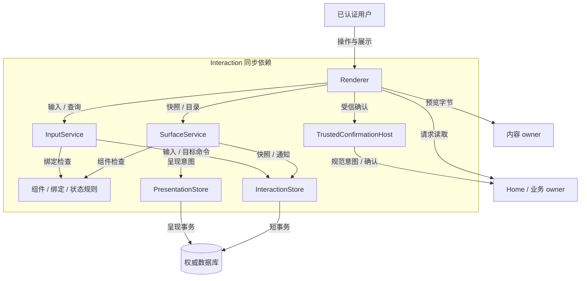
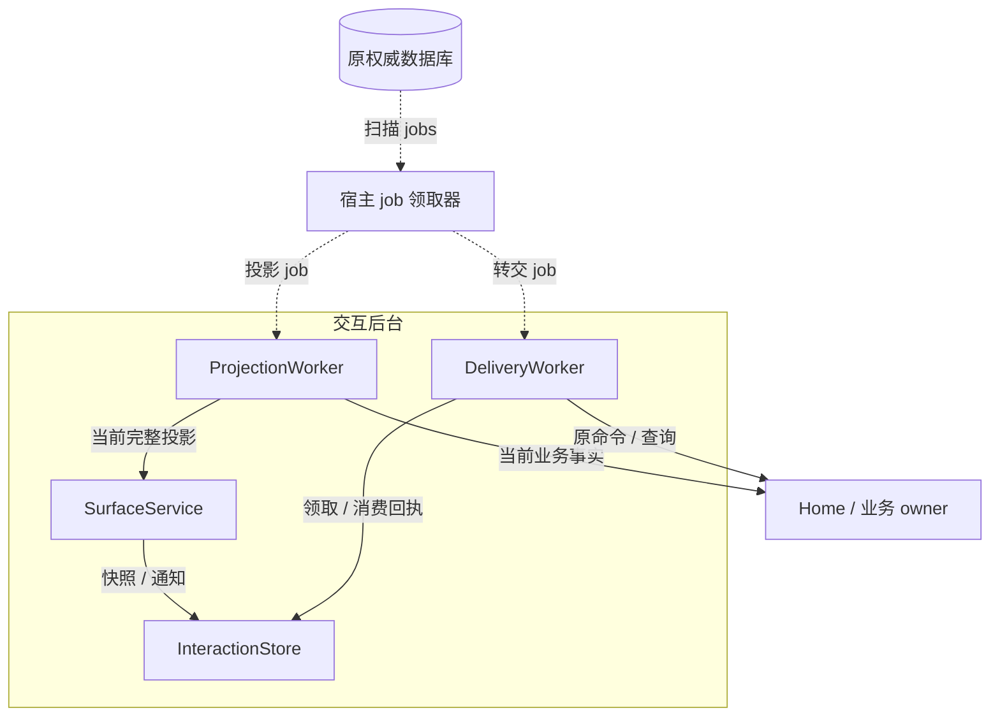
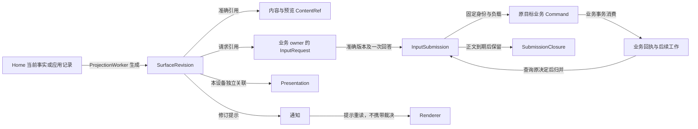
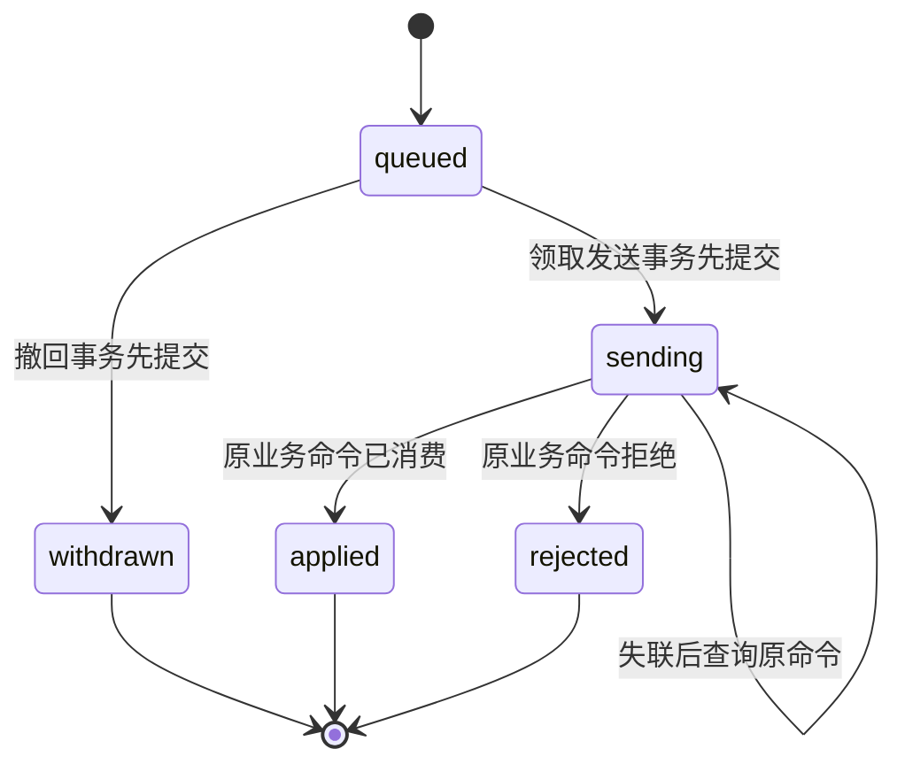
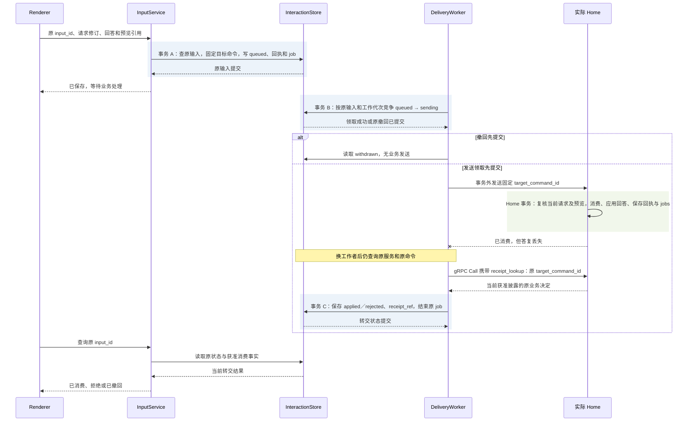

# 交互实现：声明式快照、可靠输入与受信确认

[模块主线](README.md) · [任务运行时](../task-runtime/README.md) · [内容与清理](../memory/implementation.md)

本实现核心使用 Go，提供 CLI 和 Web 两个适配器，共用 Surface、输入转交和请求消费契约。
浏览器、CLI 和设备经 `/v1/connect` 的 WSS 双向长连接调用；HTTPS 保留发现、认证和大文件传输，精确线格式见[公共传输契约](../contracts/transport.md)。
Surface 是可呈现的业务快照，Presentation 是某台设备是否打开它的意图；两者分别保存。
UI 可以显示已保存、处理中、已消费或拒绝，不能自行裁决任务成功或签发许可。
本文定义参考组件和协议行为，浏览器与终端的运行验收仍待实现。

## 1. 软件形状、内部分工与正常路径

用户为任务选择保存目录时，交互服务先固定回答、请求修订和唯一目标命令。
Home 消费请求后保存目标参数及下一项工作；交互服务查询原命令取得结果，再更新可见快照。
期间关闭页面只改变本端呈现，不取消任务或撤销已经消费的输入。

交互模块由耐久交互服务与 CLI／Web 宿主适配器组成。SurfaceService 和 InputService 是服务 facade，
application 层执行快照投影、输入转交和状态比较；InteractionStore 将业务表、回执和 jobs 映射到宿主数据库。
PresentationStore 封装设备呈现意图。Renderer 和 TrustedConfirmationHost 是宿主侧组件，
通过既有内容、请求与业务 owner port 工作；它们不是新增的任务或授权裁决层。
本机通过 Go 接口同进程装配，云端独立进程间使用 gRPC；可以分开部署连接层和服务，但协议选择不要求拆分模块或共库事务，领域身份及事务边界保持一致。
组件兼容、请求引用覆盖和转交状态比较是同包纯规则函数；application 层取得当前事实后调用，
再由 store 的条件事务固定结果，规则函数本身不负责网络或持久化。

下面单独展示持久工作领取与继续处理。与上图同名的组件、store 和权威库均为同一对象，不表示另建服务或数据库。

两图实线为同步依赖，虚线为从原数据库领取持久工作；store 仍在同一权威库的短事务中保存业务记录、回执和 jobs。
外部调用不位于交互数据库事务内。Renderer 与 TrustedConfirmationHost 属于 CLI／Web 宿主，其余组件属于耐久交互服务；两图只分开观察调用和恢复依赖。
不同用户动作可以由同一个宿主进程调用上述组件，逻辑分工不等于独立微服务。
快照更新不反向获得业务裁决权。
普通表单处理器只能接收自己登记的事件；授权确认使用独立受信入口。

| 组件 | 保存或处理的事实 | 不承担的责任 |
| --- | --- | --- |
| SurfaceService | 快照版本、固定应用绑定、来源修订 | 不解释模型 HTML 或脚本 |
| ProjectionWorker | 从当前 Home 记录生成完整快照 | 不维护第二份任务状态机 |
| InputService | 原输入、固定转交命令、撤回竞争 | 不把排队解释成业务已消费 |
| DeliveryWorker | 原目标发送、查询及回执保存 | 不因超时更换目标命令 |
| PresentationStore | endpoint 的 open、intent_revision、seen_revision | 不以显示状态证明用户同意 |
| Renderer | 受支持组件、内容读取、依赖输入禁用 | 不签发授权或验证外部效果 |
| TrustedConfirmationHost | 本人认证与准确内容展示 | 不相信插件提供的“已批准”字段 |
| InteractionStore | 快照、输入、应用事件与回执／jobs 的原子存储 | 不跨数据库消费 Home 请求或 Confirmation |

默认完整快照较易恢复。通知仅提示对象变化，遗漏后通过读取恢复。
局部补丁会引入版本应用顺序和客户端状态成本；当前不实现补丁协议。

### 1.1 长连接入口与恢复

WSS 网关把已认证的 Command、Query 和原回执查询交给原业务 owner；同连接返回结果并主动发送 Change。
浏览器以同源 Secure、HttpOnly 会话 Cookie 握手，网关校验 Origin；CLI／设备以 bearer 凭据握手。
连接认证不授予后续永久资格：每条消息都核对当前会话或端点代次及方法权限，推送和查询返回前也核对当前披露资格。
网关只持有连接、路由和有限发送队列，不能将传输 ACK 或 ReplyAck 写成 InputRequest 已消费的业务事实。

Change 只提示重新读取，可按 Surface 合并、重复或遗漏。重连先恢复原 input_id／command_id 的未结查询，再读取当前获准快照与本设备呈现意图。
连接中断不撤销已提交命令；只有查原业务回执才能确认消费或拒绝。无耐久宿主的离线浏览器仍只能承诺本端待发送，不能显示“业务已消费”。
设备侧的 Delivery、Reply 与 ReplyAck 沿原 delivery 和业务身份恢复，连接或网关更换不创建第二项责任；具体确认和保留规则由公共传输契约集中定义。

## 2. 严格声明式组件

Surface 固定 app_binding、surface_owner_id 和可选 task_ref。
blocks 是有界有序组件集合，每项 block_id 在本快照内唯一。
不允许自由 HTML、脚本、可执行 URL、任意事件名称或模型自定义组件实现。
内容引用可以指向已获准正文，渲染器必须取得当前可读字节后才显示。

| kind | 必需字段 | 可选字段与限制 |
| --- | --- | --- |
| text | block_id、content_ref | format 为 plain 或 markdown；Markdown 禁用原始 HTML 和脚本 |
| media | block_id、content_ref、alt | display 为 image／audio／video／file，不能据文件扩展名提升权限 |
| table | block_id、columns、rows | 列和单元格为有限纯文本；不执行公式或内嵌事件 |
| input | block_id、request_ref、label、input_schema | 只提交原请求，按钮资格由请求依赖决定 |
| action | block_id、request_ref、action_id、label | action_id 必须来自业务请求 allowed_actions |
| status | block_id、code、label | code 为 queued、working、waiting、done、error 或 unavailable；只是呈现 |

纯文本字段仍受快照披露权限约束，不能把敏感标题或表格绕过内容治理写入公开目录。
text 的 Markdown 链接只有受信导航器可以打开；链接文字不获得管理权限。
media 读取失败显示准确缺口，不把内容引用存在当作媒体已经呈现。
table 初值最多 20 列、100 行，每个单元格最多 512 个字符；大表通过内容附件读取。
不支持的组件种类拒绝 surface_update，不能忽略后继续消费依赖该组件的输入。

### 2.1 输入 Schema 子集

input_schema 采用封闭对象描述 fields，每字段有 name、type、required、label。
type 仅为 text、integer、boolean、choice 或 choices，不允许任意 JSON Schema 执行器扩展。
text 声明 max_length；integer 声明 minimum/maximum；choice(s) 列出准确 option ID 和标签。
choices 的选项数与最大选择数有界；不允许浏览器从远端脚本加载额外选项。

字段名不能重复；未知字段、重复选项或超限答案在宿主和业务端都拒绝。
表单 Schema 是便利呈现，实际业务请求 Schema 仍是消费入口的权威。
两者必须在 surface_update 时证明兼容；无法表达的请求使用受信专用入口并明确不支持普通表单。
表单 answer_ref 指向准确回答正文，不在重试时重新编码默认值。

### 2.2 请求和预览绑定

request_ref 为 owner_id、id=request_id 和 revision，不能只绑定一个按钮文字。
request_read 是只读 Query，输入 request_ref，输出 request 与 gaps；旧修订返回 revision_conflict。
业务负责端复核认证主体、当前披露与请求版本，返回 question_ref、schema、deadline、required_content_refs、allowed_actions 和 state。
state 为 open、consumed、expired 或 superseded；consumed 同时返回获准的 consumed_by。
acceptance 必须有 task_ref、goal_revision、candidate_ref 及匹配的 candidate_hash；application 不绑定任务。
读取请求不授予其正文或预览永久资格，创建仍由 Home 或已登记应用处理器内部完成。
Surface.request_refs 必须覆盖 input/action 引用；同请求在页面多处展示仍是一次消费。
请求负责端保存 required_content_refs、deadline、allowed_actions 和当前消费状态。
acceptance 另绑定准确候选、goal_revision 和受信用户决定，不能借普通 application 事件改义。

受信宿主调用 interaction.request_read，向 request_ref.owner_id 所指实际业务负责端取得准确请求，再按当前 ContentPolicy 取得全部必需预览。
实际取得的准确引用组成 preview_refs；旧版本、只读到摘要或加载失败均不算完成预览。
按钮启用只是本端资格，提交时业务端仍复核请求、期限、引用覆盖与当前来源状态。
seen_revision 只记录曾显示哪个修订，不能证明用户读完、理解或同意。

## 3. 持久表、快照投影与目录

| 记录 | 主键与约束 | 事务用途 |
| --- | --- | --- |
| surfaces | tenant、surface_id 唯一；owner、app_binding、task_ref 创建后固定 | 版本化快照 |
| surface_revisions | surface_id、revision 唯一；完整快照摘要不可变 | 恢复当前呈现 |
| surface_projection | surface_id 唯一；last_source_revision 单调 | 防旧投影覆盖 |
| presentations | surface_id、endpoint_id 唯一；intent_revision 单调 | 本设备打开／关闭意图 |
| input_submissions | input_id 唯一；回答、请求、预览和目标命令固定 | 输入转交状态 |
| application_events | event_id 唯一；应用绑定、事件类型、负载及目标命令固定 | 独立应用的可靠转交 |
| delivery_jobs | 原 input_id 或 event_id 唯一未结 job | 原业务命令重投与查询 |
| surface_notifications | surface_id、revision 唯一提示责任 | 提交后通知，可重复唤醒 |
| surface_queries | query_id、主体、过滤摘要及有限集合 | 目录稳定分页 |
| submission_closures | 输入／事件身份、目标 owner、command_id 和原决定摘要 | 长期最小关闭依据 |

正文、截图和完整回答按各自用途保留，不因输入去重要求无限保存。
最小关闭索引不保留正文，只防止原身份被重新解释或已消费输入复活。
Surface 清理不得删除仍未收束输入的目标映射和转交责任。

### 3.1 核心对象关系与生命周期

Surface 聚合可见快照，InputRequest 属于实际业务 owner；页面只能引用该请求。
InputSubmission 表示一次可靠转交，最终业务回执才说明原请求是否消费。
Presentation 与这些业务对象并列存在，设备关窗不会删除请求或停止转交。

图中关联不授予读取资格。Renderer 每次取得当前可披露快照和请求依赖后，才读取内容并启用相应输入。

| 对象 | 创建与持久化 | 传递与消费 | 归并与清理 |
| --- | --- | --- | --- |
| Surface／Revision | 受信投影器或固定应用创建，更新保存完整快照与来源修订 | Renderer 当前读取；变化通知只提示重读 | 清理旧正文和快照须遵循来源政策，保留未结输入必需的准确关联 |
| Presentation | 每 endpoint 保存 open、意图修订和已呈现修订 | 本设备打开／关闭；不消费业务请求 | 可清理不再使用的设备偏好，但不能由此撤销业务效果 |
| InputRequest | Home 或应用 owner 内部创建并保存 schema、期限及消费状态 | 交互宿主从实际 owner 读取准确版本；原业务方法一次消费 | 过期／替代关闭新输入；原消费与必要关闭依据仍归业务 owner |
| InputSubmission／ApplicationEvent | 交互接纳事务固定原输入、负载、目标方法与 command_id | DeliveryWorker 沿原目标发送或查询，业务回执决定 applied／rejected | 正文按政策清理；未结责任保留，已结身份归并最小关闭索引 |
| Confirmation | 实际 consumer owner 保存规范意图和本人决定 | TrustedConfirmationHost 认证展示；原业务命令在 owner 事务消费 | 确认与业务事实归 owner；交互服务不持有可重复消费的批准副本 |

### 3.2 创建与更新

surface_create 校验已注册应用版本、调用主体、组件类型、请求绑定及内容引用范围。
同事务保存 Surface、revision=1、原回执和变化提示。
有 task_ref 时必须由该 Home 的受信投影器创建或登记关联，普通应用不能冒充任务投影。

surface_update 携带 expected_revision 和完整新快照。
独立应用由原 app_binding 对应处理器更新；任务投影还携带 source_revision。
任务投影只应用较新 Home 修订，同修订不同内容为冲突并回查 Home。
已应用的同修订同内容可以返回当前快照；另一个命令不能借此修改内容。

投影工作者只从 Home 正式状态生成待处理、等待、结果和控制说明。
ProjectionWorker 读取到旧源状态时不重写新快照；失败后重新读当前 Home，不拼接半份增量。
输入消费回执与 Surface 更新可以异步，客户端通过原 input_id 查询确认业务是否生效。

### 3.3 读取与 not_modified

surface_read 每次复核当前快照和内容披露资格。
known_revision 相同且当前获准呈现与请求依赖没有变化时，可返回 not_modified。
权限或内容资格变化时，即使业务源修订未变，也返回 snapshot 或具体 gaps，不能让客户端永久保留旧正文。
服务端不得把 not_modified 当作延长缓存保留或使用期限的许可。

Renderer 对内容到期设置本端失效时点；一旦到期或收到关闭通知，旧卡片停止新阅读并显示不可用。
重新开放需要重新查询当前资格，不沿用当初下载成功的事实。
浏览器截图、用户导出和终端滚屏的物理可收回能力按内容持有者声明报告，不声称可远程抹除用户已经看见的内容。

### 3.4 目录与设备发现

surface_list 对一个 owner 冻结有限 ID 集合，逐页返回当前获准的标题、绑定及 task_ref。
请求包含 query_id、有限 filters、limit 和可选 cursor；新条件使用新 query_id。
每页重新复核权限，失效项跳过，exhausted 只表示本次集合结束。

用于按类型订阅恢复时，filters 必须覆盖全部当前获准 Surface（app_ids=[]、task_refs=[]、include_expired=true）。200 项冻结上限截断时必须保留 partial／gaps，不能把末页当作完整目录；权限范围变化废弃旧页集合并重新订阅，新增可见的旧 Surface 也从新集合发现。完整条件、先订阅再枚举及有限重试统一见[集合恢复](../contracts/protocol.md#collection-snapshots)，固定截断不触发相同快照的立即循环。

跨端目录由应用分别读取已登记 owner，再显示来源和 unreachable_endpoints。
部分端点失联不导致本地任务消失，也不能被包装成全局完整清单。
目录标题、预览和关联 task_id 均受最小披露要求，不能用知道 ID 绕过权限。

## 4. 输入转交、消费与撤回

### 4.1 接纳输入事务

1. 核对 input_id、surface_id、request_id/revision、准确 answer_ref 和 preview_refs。
2. 根据固定处理器确定唯一目标 logical_service_id、target_id、method 与 command_id。
3. 校验请求允许的输入类型；授权请求不能转成普通 task.input。
4. 同事务保存 InputSubmission=queued、固定目标命令、原回执与 delivery job。
5. 提交后显示“已保存，等待处理”；不承诺 Home 已消费。

同 input_id 的回答、预览和目标命令都不可改变。
用户编辑回答需要新 input_id，但原业务请求仍只消费一个有效答案。
无耐久宿主的纯浏览器只能显示本端待发送，清除浏览器数据后不能承诺恢复未发输入。

### 4.2 转交状态机

图只建模 InputSubmission，任务是否完成是 Home 的独立状态。
sending 后撤回仅设置 withdrawal_requested；没有停止消费的确认，不得改成 withdrawn。
原业务入口没有请求撤销能力时，UI 提供业务取消或纠正入口，并继续核对原命令。

转交工作者先将 queued 原子改为 sending，再发送固定命令。
发送前崩溃与发送后答复丢失均沿原 command_id 查询；确证未接纳且仍在期限内才原样重投。
原命令接纳截止到期不代表已接纳回答失效，仍须查询最终消费结果。
同宿主共库可把输入登记与 Home 消费合并事务，但仍保存两类事实的含义。

### 4.3 业务消费

Home 在事务内比较请求 owner、kind、revision、deadline、当前未消费状态和所有必需预览。
消费、回答应用、回执及后续 job 同事务保存；两个设备竞争只有一个成功。
本轮目标或候选已改变时拒绝旧输入，不自动把旧回答套到新目标。
acceptance 只替代其允许的质量判断，不能覆盖未知外部效果。

交互服务取得固定业务回执后更新 applied/rejected、receipt_ref 和呈现修订。
普通“表单已消失”、WSS 传输 ACK、ReplyAck 或 Change 提示都不能替代该回执。
若当前权限不允许读取原回答，可以返回获准的消费状态，不重新披露正文。

### 4.4 转交领取与业务消费的两个提交域

下图展开交互服务与远端 Home 的输入交接。两处数据库分别提交，
原 target_command_id 是连接责任的依据；通知和页面状态不参与决定成功。

如果事务 C 提交后丢答复，恢复者读 InputSubmission 的原终态，不能产生新的目标命令。
如果原 Home 只能证明命令仍处理中，交互服务保持 sending；不能把查询接收成功当作消费成功。
发送领取之后到达的撤回只保存 withdrawal_requested，必须沿原业务能力核对，不能走图中的 withdrawn 分支。
原回执正文不可披露时只返回获准状态；无法取得消费决定时继续原责任，不从 UI 推断。

## 5. 独立应用事件与受信管理

application_event 只用于无 task_ref 的独立 Surface。
事件绑定 event_id、surface_revision、app_binding、event_type、payload_ref 和 preview_refs。
处理器注册声明准确事件种类、负载 Schema、管理权限及原命令查询服务。
转交时由注册表确定目标，调用方不能选择任意管理方法或伪造 logical_service_id。

| 固定处理器示例 | 事件 | 领域消费与查询 |
| --- | --- | --- |
| memory-candidates | candidate.reject | Memory owner 比较候选修订和本人管理权，同事务拒绝及清理；查原目标命令 |
| memory-manager | record.create／replace／delete | 生成相应 memory 命令，仍复核领域权限和 expected_revision |
| registered-app | manifest 中声明的有限事件 | 应用处理器保存幂等消费及固定回执；没有查询能力不开放有副作用事件 |

application_event 的 applied 只表示交互服务保存事件和转交责任，输出 queued 或原转交状态。
原目标服务的 applied 才表示该应用事件已被业务消费。
模型生成的按钮不能登记处理器；应用安装和受信绑定需要宿主管理入口。

授权确认显示主体、动作、准确资源、用途、上限、期限和数据位置，使用宿主认证身份。
确认前先固定实际业务 command_id 与规范意图，再向业务 owner 发起 confirmation.request。
宿主通过 confirmation.read 展示规范意图，以本人受信会话提交 confirmation.decide，然后投递同一业务命令。
Grant owner、批准 owner 或 Home 分别在 grant.issue、evaluation.approve、task.accept_result 的事务中一次消费原 Confirmation。
确认内容及消费责任归实际业务 owner，UI 不建立跨库确认消费服务，也不从插件自绘文案推断批准。
Grant、ReleaseApproval 和普通 InputRequest 分别有权威 owner，不相互转型。
即使用户仍有取消／删除权而无正文读取权，管理入口仍以获准最小元数据提供控制。

## 6. 呈现意图、过载与恢复

present 按 surface_id、endpoint_id 和 expected intent_revision 保存 open/close。
某设备尚无记录时采用 closed、intent_revision=1、seen_revision=0 的初始意图；首次修改以 expected_revision=1 竞争创建，返回 revision=2。
客户端关窗后，迟到结果只更新 Surface；不会覆盖该设备的 close 或重新打开窗口。
同一 Surface 在其他设备的打开状态不受影响，seen_revision 不大于已实际取得的快照修订。
设备接管从受信入口直接到资源 owner，不排入普通聊天或模型队列。

| 资源 | 初始上限 | 达限行为 |
| --- | --- | --- |
| 每用户活动 Surface | 100 | 拒绝新建，保留查询和控制 |
| 单 Surface 组件 | 100 | 更新拒绝，不部分应用 |
| 单快照 JSON | 128 KiB | 大正文改为 ContentRef |
| 单表单字段／选项 | 32／每字段 100 | Schema 不接纳 |
| 每用户排队输入及事件 | 100 | 接纳前返回 overloaded，已接纳继续转交 |
| 每页目录条目／冻结集合 | 20／200 | 游标继续或 partial |
| 每用户 WSS 连接 | 8 | 拒绝多余连接；共享现有连接或退避重连后读取快照 |
| 每连接发送队列 | 按公共传输上限限制帧数与字节 | 合并 Change；持续慢端断开，原业务责任保留 |

CLI 终端无法证明已经擦除显示历史时，内容清理报告保留该载体限制。
浏览器重启后先恢复未结输入与本设备 close 意图，再读取当前获准快照。
连接层故障不阻止已接纳任务消费；页面显示离线，退避重连后用原身份查询和快照恢复状态，不能反复提交输入探测。

## 7. 生产部署、可用性与性能

原 owner 和数据库接替遵循[公共可用性策略](../deployment-production.md#availability)，
连接数、请求率和故障容量分开按[公共容量策略](../deployment-production.md#capacity)估算。
云端 SurfaceService、InputService、WSS 连接层和 worker 可以独立增加进程，跨进程以 gRPC 交接，按 tenant 和稳定 surface_owner 路由原记录。
进程替换不移动业务 Home，也不让另一个数据库重复消费 InputRequest。
CLI 和 Web 共享服务语义；纯浏览器的未发送内存不计作耐久交互接纳。

| 扩展单位 | 必须串行或条件更新的键 | 性能边界 |
| --- | --- | --- |
| facade 副本及不同 Surface | surface_id 当前修订及 source_revision | 旧投影不能覆盖新投影；同源修订不同内容仍须回查，不能靠最后写入获胜 |
| 输入和应用事件 worker | input_id／event_id、原 command_id、领取代次 | queued 撤回与发送领取由原库裁决；一个热点请求的两端答案仍只在业务 owner 消费一次 |
| Presentation 更新 | surface_id、endpoint_id、intent_revision | 设备间可并行；新成果不重开用户已关闭的设备页面 |
| WSS 连接层 | 连接绑定认证主体，每消息复核当前身份及权限；Change 按 surface/revision 合并 | 发送队列有界，允许重复或遗漏提示；慢端断开后读快照，连接层缓存不成为业务状态库 |
| ProjectionWorker | 每 Surface 应用水位单调 | 可合并到已观察的较新源修订后重新读取完整状态；不合并或丢弃任何输入／业务回执 |

交互权威库不可写时不返回 queued、withdrawn 或保存成功；浏览器可保留本端待发送提示，但不承诺跨清除数据恢复。
Home 不可达时已有 queued／sending 输入保留原目标责任，关闭窗口仍可在交互库保存；
不能把关窗解释成 Home 已取消。请求或必需内容不可达时页面展示缺口并禁用依赖输入，
不会因已有截图、按钮或过期请求缓存而继续确认。
连接层失效时退避重连并查原输入与当前快照；业务消费继续由原 owner 和转交 job 推进，不等待全部在线客户端。

快照缓存的键至少区分 owner、准确修订、认证主体和披露上下文，但键完整仍不等于当前资格有效。
surface_read 的 not_modified 和 Query 重放都须重新证明当前披露；来源关闭、期限到达或核验不可用时，
旧快照不能继续支撑新的阅读和输入。Renderer 收到关闭或到期即清除受管缓存并刷新缺口，
通知未送达不能延长使用期限；镜像字节仍遵循内容模块每读在线的约束。
不得把连接缓存、传输 ACK、ReplyAck 或 Redis 记录作为请求已消费、用户已确认或当前权限的权威。

主要瓶颈是完整快照投影、逐内容资格检查和高在线数产生的查询／扇出，而非表单组件渲染本身。
度量接纳与查询 p95/p99、最老 delivery job、sending 未决时间、业务回执到本端可见的延迟、
投影落后修订数、not_modified 实际可用率、披露核验耗时、单快照字节、活跃连接与集中重连峰值。
请求消费延迟、页面刷新延迟和用户真正阅读分别报告；不能把后一项推断为前两项的成功保证。

过载先拒绝超额新输入、目录扫描和连接；对查询使用有限并发及退避，对同 Surface 通知合并唤醒。
已接纳输入不能从队列中丢弃；控制、撤回、原输入查询与原业务命令核对保留容量。
控制与回执流量在有限发送队列内优先调度；慢端耗尽发送额度时停止普通数据扇出，必要时断开该连接并保留原责任，不能让一个页面占满全用户控制容量。
同用户开大量页面时按共享用户额度计费和限流，不能让每个连接各自获得完整刷新额度。
第 6 节限额是待测初值；验收加入断线集中重连、热点任务更新、预览来源同时失效及通知层停机，
据实测调整查询频率与连接分区，不以降低当前资格核验频率换吞吐。

## 8. 故障实验与检查边界

| 实验 | 输入与注入 | 必须观察到的结果 |
| --- | --- | --- |
| II-01 保存后断连 | queued 提交后丢响应，宿主重投 input_id | 一个输入、一个 target_command_id |
| II-02 领取竞争 | 撤回与 queued→sending 同时提交 | 先撤回则永不发；先领取则只标撤回待核对 |
| II-03 消费后断连 | Home 已消费，交互服务未收到答复 | 查原命令恢复 applied，不生成新回答 |
| II-04 双设备答案 | 同 request 不同 answer_ref 并发 | 一胜一拒，拒绝端获准确原因 |
| II-05 预览关闭 | 截图展示后关闭来源，再点击确认 | 原输入拒绝，新快照显示缺口 |
| II-06 旧投影 | 新 task_revision 已应用后送达旧投影 | Surface 不回退，同修订不同内容冲突 |
| II-07 关窗迟到 | 保存 close 后成果到达 | 本设备仍 close，用户主动打开可查询成果 |
| II-08 伪造脚本 | blocks 添加未知 kind、脚本或任意事件目标 | 更新拒绝，无 Grant 或管理调用 |
| II-09 目录失联 | 本机可用、另一 owner 断连 | 显示部分目录及失联来源，不宣称完整 |
| II-10 权限变化 | known_revision 相同但内容已撤权 | 不返回可继续阅读的旧缓存，依赖按钮关闭 |
| II-11 应用命令未知 | 应用处理器消费后答复丢失 | 原服务/命令查询恢复，不转给另一处理器 |
| II-12 控制过载 | 普通输入队列满时用户取消 | 管理控制仍有保留容量，未接纳输入不显示已排队 |
| II-13 网关提交后断开 | 原输入已提交，网关在回执送达前退出 | 客户端以原身份查得固定结果；任务与输入各只有一份，连接 ACK 不算业务成功 |
| II-14 重连与慢页面 | 集中重连，同时使一个客户端停止读取 | 队列、内存与重连率受限；Change 可合并，取消仍获保留容量，快照能恢复 |
| II-15 长连接撤权 | 连接已建立后撤销会话或设备代次，再发输入及查询 | 原提交事实保留，新消息拒绝，旧连接不再获得未授权快照 |

静态协议检查覆盖字段、绑定和有限状态序列，不能证明浏览器确实取得字节或用户理解内容。
CLI、生产／本地 Web 和任何后续原生适配器分别完成预览、缓存、恢复及权限实验，不相互外推通过结论。
