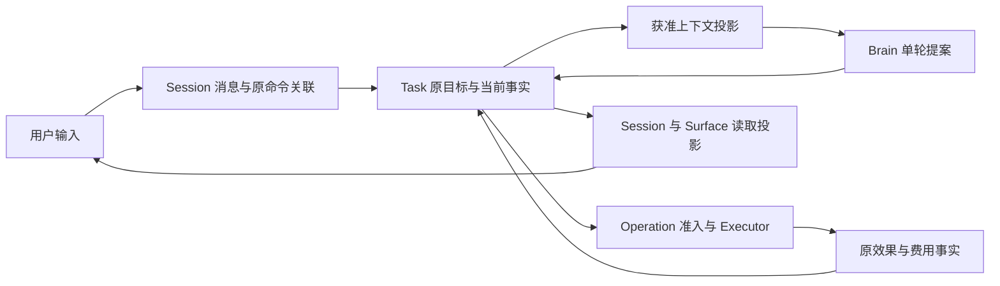

# Session 与 Task 的关联和恢复

用户在同一段对话中提交保存报告的目标，又提出核对另一份材料的目标。这两个目标可以独立等待输入、完成或取消；关闭对话后，它们仍须保留各自的继续责任。Session 保存这段连续对话的消息、历史材料及任务关联，每个 Task 保存一个目标及其控制、预算、行动和完成依据。应用由此能恢复对话，也能准确控制其中的某一项工作。

本页补充应用内部的设计接口及实现取舍，尚未新增公共 `session.*` 协议。客户端不能据此假定当前冻结契约已经支持跨实现的 Session 管理。共同领域词汇、输入消费和出站授权仍沿原模块；公开字段如需扩展，须连同 Schema、方法登记、示例和互操作检查一起交付。

六组对象的分类见[核心数据模型](../core-data-model.md)，普通应用的现有方法组合见[默认应用与 SDK 工作流](../application-workflow.md)，逐场景持久阶段见[请求数据流程](../request-data-flows.md)。Session 管理消息与原提交关联，Task 状态、效果和费用均从原对象读取。

## 1. 对话、目标与呈现的分工

| 对象 | 保存或表达什么 | 与其他对象的关系 |
| --- | --- | --- |
| Session | 一段连续对话的标识、标题、消息顺序、获准材料及任务引用 | 一个 Session 可关联零到多个 Task；初版每个 Task 至多固定一个创建来源 Session，其他界面只引用该 Task |
| Message | 用户或系统实际提交的对话内容、准确内容引用及原提交关联 | 属于一个 Session；完整消息不等于每次模型请求都会使用的输入 |
| Task | 一个目标及其控制、预算、效果核对和完成责任 | 可以由对话、API 或定时入口创建；没有 Session 也能按原接口运行 |
| Decision／BrainContext | 一次决策及其固定输入投影 | 从当前 Task 事实与本次获准材料组装；不直接把完整 Session 追加日志当提示词 |
| Surface | 可呈现的版本化界面和输入请求引用 | 可展示 Session 或 Task；关闭页面与归档对话都不取消 Task |

此处的 Session 是对话概念，区别于登录认证会话、WSS 连接和远端模型提供方的会话句柄。认证或连接重建不创建新对话；拥有 Session 标识也不自动取得其中 Task、Content 或模型处理的许可。

首版使用简单消息顺序，不实现分支树、跨 Session 合并或会话级预算。完整分支能力的设计要求单列在[历史分支](#history-branches)，尚不能宣称运行覆盖。跨任务复用历史材料仍按当前用途取得准确 Content，Session 不是跨任务 Memory 的替代品。

也不新增一套持久 Turn／Run 状态机：一次用户提交已有原 Command／InputSubmission，一轮决策已有 Decision，实际行动已有 Operation。界面需要把一条输入与若干回复显示成“一个回合”时，按这些原关联分组即可。参考项目的 Turn 可能包含多次模型与工具调用，不能机械地映射为一个 Decision，也不必总是一个完整 Task。原输入的接纳、消费、撤回与输出归属仍要保留，不能用一个 task.status 替代这些记录。

### 用户输入怎样落到原业务

应用根据用户选定的操作和当前请求，把输入送入相应路径：

- 新目标：固定原 `task.submit` 命令与目标 Orchestrator，接纳后建立 Session 到 Task 的关联。
- 回答已有问题：绑定准确 InputRequest 和请求版本，走原 InputSubmission 及业务消费。
- 修改目标或控制：使用对应原任务命令，消息只展示该命令的决定。
- 只保存对话批注：保存消息及获准内容，不产生行动。需要模型生成或计费时仍建立或续用适当 Task／Decision，不在 Session 内增加绕过准入的模型循环。

输入类型含糊时，应用保留草稿并让用户明确目标对象；若既有 Task 中的 Brain 帮助解释，它只给提案，受信入口仍固定具体业务命令。不能因为某句话出现在最近消息中，就把普通文本当作批准、取消或可信确认。

现有 `interaction.input_withdraw` 支持 queued 的结构化 InputSubmission 撤回，sending 后仅保存 withdrawal_requested 并继续查原消费。任意 Session 消息的排队、steering、follow-up 和 Run 控制没有对应公共合同；首版不将其混入 task.input 或任务取消。原提交身份、准确方法与状态的区别见[输入范围](../application-workflow.md#input-scope)。

## 2. 消息怎样关联原任务

主线可以由同一应用进程中的一个 facade 组织。图中每条箭头是职责交接，不意味着一次网络调用；同库的条件核验、预算预留与 jobs 更新仍合并在规定的短事务中。TaskCoordinator 掌握唯一行动循环，Session 只组织输入与展示。

消息正文按许可使用 Content 或内联的有界文本，Task 进度、Effect、费用与 Result 只保存原对象引用和必要呈现缓存，不复制为一套可以独立修改的会话真值。读取缓存要保留其对应修订和缺口；当前权限或源关闭后，消息列表也不能继续披露旧正文。

消息、原 Command、outbox 和 Task 创建来源的逻辑字段、唯一约束及恢复事务集中在[会话存储](implementation.md#session-storage)。消息保存与业务交接在不同事务范围时，应用先持久保存固定原命令和待交付关系，再发给原 owner，随后按原命令查询接纳结果。该关系复用应用的交付责任与 outbox；消息行和业务回执不同库不承诺原子提交。进程在 Task 接纳后、Session 关联写回前崩溃，恢复继续查原命令并补关联，不能再创建 Task。只有原消息已保存时，界面可称“消息已保存”；Task 的接纳或输入消费须分别取证。

归档 Session 只改变对话列表中的可见组织。删除正文按来源和保留规则清理，原 Task、取消记录、使用回执与未决效果仍保留必要责任；不以删除会话实现取消或销账。用户明确要求取消时逐项提交原 Task 控制，并展示各自结果。

## 3. 默认实现保留哪些边界

默认实现从一条真实任务闭环开始，复用应用 facade、所属领域存储和公共工作框架。逻辑记录不要求逐项建表，首条任务也不要求实现全部契约方法；拆分依据是独立查询、事务竞争、信任或保留边界。以下选择保留必要语义，并限制首版实现范围；实际维护和运行成本仍须在参考实现中测量。

| 设计位置 | 保留的必要区别 | 本版收敛方式 |
| --- | --- | --- |
| Session 与 Task | 对话延续、目标完成和执行责任有不同生命周期 | Session 放进 Interaction 应用层；无独立 Session 服务、调度器或授权体系 |
| Task、Decision、Operation | 目标可能取消，模型已计费，写入仍未知，不能压成同一个完成位 | 用聚合根及内部子记录表达；只在独立查询、事务竞争或保留规则需要时拆表 |
| 原事实、模型输入、呈现视图 | 三者的用途和真实性不同 | 原事实及准确 Content 保存一次；模型输入按轮固定引用；展示字段按原修订计算或重建 |
| 来源清单与授权检查 | 处理过哪些来源、真正发送哪些字段及当前是否获准各不相同 | 复用原 Decision／Attempt 的清单和摘要，不为每次核验建立单独账本或 RPC |
| 可靠工作框架 | 接纳、领取、新责任与旧完成竞争确有共性 | 先用 Task 和 Operation 两条真实路径验证模板；领域保留自己的成功判断，避免通用业务流程语言 |
| 完成与评测 | 成果质量、外部效果和版本改善不能互相代替 | 确定性条件用普通本地验证；只有必要的开放质量条件才调用适用评估器，不让每次工具读取都经历完整改善评测 |
| 安装与批准 | 当前精确制品和实例是否获准、就绪必须可查 | 默认内置受信组件静态装配，首装用已有兼容证据和有限批准；自动精炼、复杂热切换及改善发布随能力开放 |
| 生产与开发 | 生产故障域保证不能从单体推导 | 开发先一进程、一个权威数据库和本地字节库；再接 PostgreSQL 多进程。首个生产版本仍遵守已确认三可用区与隔离目标 |
| 完整公开契约 | 独立组件需要共同含义及恢复合同 | 按已实现能力声明可用子集，其他方法明确不支持；不要求首条文件任务实现全部 105 个领域方法 |

不应删去的核心是：原命令身份、当前准入、效果未知、可继续的持久责任以及完成依据。把这些藏进 Session 的一条“失败”消息，代码可能短些，却会在丢答复或取消后无法判断是否应该再写一次。

另一方面，记录同一事实的多个可写状态、强制每模块一库、同库仍走网络、仅为假设中的替换实现增加多层转发，都不能从可靠性要求推出。三类独立可替换组件仍保留既定端口；额外抽象应逐项回答“这个记录保存了哪项不可从原事实重建的信息”“这个独立提交点由什么信任或故障边界要求”。答不上来的先合并或移除。具体对象与读写阶段见[同场景对比](../../research/agent-harness-comparison/data-flow-io-comparison.md)。

## 4. 默认应用链与后续范围

第一条链是：用户在 Session 提交保存报告的目标，Task 获准形成准确正文，通过文件 Operation 写入并独立读回，Session 展示完成依据；进程中断后重开原 Session，查询同一 Task 和 Operation。最初的机制测试可使用固定回放模型，接真实模型时另验证实际字段、物理调用次数和费用。

首轮只需单层消息、原任务关联、一个模型适配器、受管文件驱动、最小 Grant／Content 和原库 jobs。九模块是逻辑职责，可以静态装在同一宿主；完整长期 Memory、外部 Agent、复杂多端确认、动态扩展和自动改善按工程阶段接入。依赖某能力的路径在取证前保持关闭，不能以简化为由绕过该路径本身所需授权或恢复检查。

新增 Session 设计的验收聚焦四个场景：同一对话发起两个独立目标；关闭页面后原任务继续；Task 接纳后关联写回丢失仍恢复同一 Task；来源关闭后旧消息和摘要不再披露。另验证取消 Task A 不影响同 Session 的 Task B，归档或重新打开 Session 不重启已终结任务。

这些取舍按[工程落地](../engineering.md)实施，并与[输入消费与呈现](implementation.md)共同审查。当前是设计方案，Session 的跨实现协议和真实运行证据仍待后续交付。

## 5. 历史分支的后续能力边界

首版只保证线性消息与原提交／任务关联。后续支持 fork、回退或选择历史时，应用需具备下列有类型的内部关系和用户行为；这张表不是已经发布的 Session 字段 Schema，也不表示当前运行支持。Pi 消息树、Codex fork／revert 等具体差异仍按各自固定调研路径解释。

| 必须表达的关系 | 用户可见行为与约束 |
| --- | --- |
| 消息身份、父消息关系与分支头 | 在准确节点选择历史；选中分支只改变后续上下文来源，不删除其他分支的原记录 |
| 来源 Session、来源截止位置与原条目身份 | fork 指向原来源，复制正文或摘要不能丢失其出处；来源当前不可用时显示缺口 |
| 分支位置对应的配置与准确绑定 | 区分历史曾使用的模型／工具／安装配置与当前可启动资格；不能用同名新版本替换原调用的解释 |
| 摘要与压缩覆盖范围 | 保存原材料版本、覆盖到哪个位置及适用分支；部分摘要、合成占位和用户历史不改写 Task 目标、Effect 或授权 |
| Task 与原提交关联 | 已有 Task 保持原负责方及创建来源；分支可引用原 Task，只有明确新目标才创建新 Task，不复制活动责任 |
| 工作区与真实外部效果 | 展示分支所依赖的工作区观察及其限制；历史回退不回滚文件、网络请求或其他已发生效果。确需恢复文件时另准入获授权的新 Operation |
| 当前权限、保留与清理 | 每次读历史与作为模型输入均复查当前用途和来源；分支引用不延长正文许可，也不代替跨任务 Memory 授权 |

分支创建不得复制活动 Operation、原授权使用、未结预算、待发命令或领取权；原任务终态、取消和账务仍在原 owner 保存。用户要基于旧材料继续工作时，先选择获准上下文，再明确提交新目标或对原 Task 作受支持的操作；没有完整输入调度合同就不自动续跑旧 Run。

启用该能力前须补齐并发更新分支头、来源缺口、工具调用／结果配对、跨分支摘要选择及故障恢复合同，再交付公开方法、Schema、示例和互操作检查。验收包含只读分支选择不触发模型或外部写、fork 不复制未决写责任、来源撤回后旧分支不披露以及新目标在当前授权下正常推进；这些场景目前均待运行验证。

## 6. 参考项目与选择依据

以下比较基于 2026-10-01 的固定源码调研，说明上述分工的选择依据；源码路径、时序及限制可从各项目报告继续查阅。参考项目的实现不构成本项目的运行证据。

| 项目 | 会话相关对象及主线 | 对本项目的启发 |
| --- | --- | --- |
| [Codex](../../research/codex/README.md) | Thread／Session 保存持续工作上下文，Turn／Step 推进一次输入；rollout、模型历史投影、独立元数据有不同职责 | 连续工作需要稳定入口，用户历史和实际模型输入可以不同；不能把回合结束等同于全部任务效果完成 |
| [Pi](../../research/pi/README.md) | 经典 AgentSession／SessionManager 组织输入、消息树、压缩及模型循环；AgentHarness 与独立 durable 又有 Lane、Operation、Conversation、Task 等不同组织 | Session 是方便的宿主接口，但可靠执行仍会分出独立身份；不能把所有 Pi 路径拼成同一种恢复保证 |
| [DeepSeek Harness](../../research/deepseek-harness/README.md) | SessionEvent 保存事件，surface 形成模型视图；Goal、Schedule 与本地 jobs 各有自己的状态和持久点 | 可以集中保存会话来源，再构建不同视图；持续目标和后台工作并不天然等于会话本身 |
| [Prime Agent](../../research/prime-agent/README.md) | SessionEngine 组织会话条目、GoalDriver、队列、kernel、子会话及压缩；恢复日志与其他状态分别保存 | 连续体验可以由一个 facade 提供，内部无需把目标、执行环境和消息存储合为一项成功事实 |
| [Crush](../../research/crush/README.md) | Session／Message 保存对话，RunID 关联一次提交与流呈现；Coordinator 驱动模型和工具 | 对话容器与一次运行可分别定位；内存预约、运行结束通知和持久业务完成需要区分 |

五个项目都支持会话式工作，但并不存在一个可以直接照搬的统一 Session 数据结构。它们的产品重心偏向持续编程助手或嵌入式运行时；本项目还承诺分布式任务、用途授权、效果恢复及独立完成判断。后者需要额外事实，但不意味着要增加同等数量的服务、数据库和 RPC。
