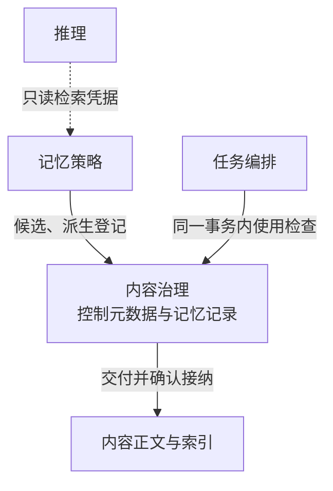
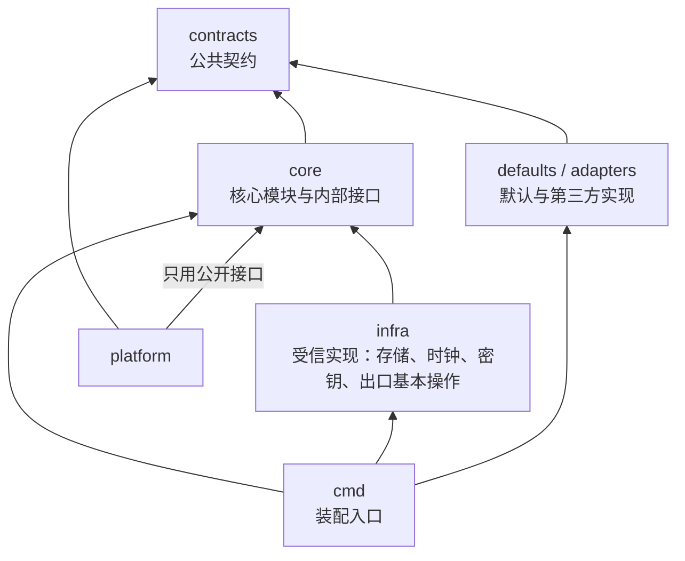

# 分层与模块

| 日期 | 修订说明 |
| --- | --- |
| 2026-10-07 | 生产装配保留真实循环的两阶段连接；全部模块及域 Work 完成验证后，才进入原实现资格核验和业务恢复。物理格式与身份资格仍由存储打开入口先检查。 |
| 2026-10-04 | 初版：核心与可替换部分的划分、模块职责、依赖规则、主线流程、M1 切片、部署映射和代码组织。 |
| 2026-10-04 | 根据各模块调研修订：模型调用在发出前准入；执行适配器的"副作用类别"改为独立属性；断网时无法证明当前授权就等待；撤销分阶段生效；M1 预算改为最小预留；明确可信基础设施 I/O 不属于出口；端点密钥绑定、设备接管控制和扩展权限上限的归属；可替换部分的接口定义并入核心契约；内容治理的控制元数据与裁决域同处一个事务设施；安全确认由受审查的宿主呈现；按用户分片不单独构成 G12 的证明。 |
| 2026-10-04 | 状态改为已采纳。 |
| 2026-10-04 | 按 `CLAUDE.md` 写作要求和[文档规范](conventions.md)修订用语：约束统一为"必须／不得""建议／不建议"，不再使用"应"；"执行端"统一为"执行端点"，发布回滚统一为"回滚"，授权统一用"撤销"。设计内容不变。 |
| 2026-10-04 | 按[第二轮评审处理记录](../review/archive/round-2/disposition.md)修订（[ADR 0003](../adr/0003-replacement-classes-and-assembly.md)）：P1 只识别必须受信的部分，替换资格分三类；R6 区分公共契约与内部接口，新增基础设施实现和装配入口；裁决域只建一个事务上下文（R2-08）。内容治理内明确记忆记录的写入职责（R2-09）。模型调用先固定实际输入再准入（R2-05）。 |
| 2026-10-04 | 按[第三轮评审处理记录](../review/archive/round-3/disposition.md)修订：受信实现增加"终局解释规则"一例，第三方执行适配器只提交解释，不取得效果裁决权（R3-06）。 |
| 2026-10-05 | 可读性：第 3 节 ASCII 图改为按事务域分组的结构图；8.1 的准入与完成步骤改为引用[核心契约 2.6 四道门禁](core/contracts/README.md#26-四道门禁)，补上开始门禁；第 11 节增加依赖方向图。划分与规则不变。 "设备控制权代际"统一为"设备控制权代次"。 |
| 2026-10-05 | 项目目标 10.2 撤销 V2（手机 GUI）后同步：M1 切片表中 GUI 改为 M4 可选。 |
| 2026-10-05 | 图示整理：行动主线改用 SVG，与整体方案共用；内容与记忆拆成独立 Mermaid 图，补充合并与省略范围。规则不变。 |
| 2026-10-05 | 模块名称统一为“执行网关”，职责与契约不变。 |
| 2026-10-05 | 图中的跨域交接改用具体行为说明，规则编号及解释放在图注或正文；交接机制不变。 |
| 2026-10-05 | 模块名称统一为“执行管理”，同步模块简称与图示；存储和连续性语境中的“账本”指其持久执行记录。职责与契约不变。 |
| 2026-10-05 | 模块名称由执行网关改回出口闸门，避免与网关与 SDK 撞名；图中分类标签改为中文；职责与契约不变。 |
| 2026-10-05 | 按 [ADR 0004](../adr/0004-language-and-stack.md) 同步第 11 节：确定受信实现目录 `infra/`、装配入口 `cmd/`、协议源 `contracts/proto/` 和故障注入测试 `conformance/fault/`；完整骨架改由[开发规范](../development.md)维护。依赖规则不变。 |
| 2026-10-06 | 按[第五轮评审处理记录](../review/disposition.md)修订：受信实现增加受信宿主与供应商编码、核验规则（X-07、X-08）；内容控制元数据明确属于裁决域事务域（X-05）；准入条件改为引用核心契约 2.6（LY-05）；8.2 的取消与断网两行按控制代次和默认部署的开始门禁改写（LY-06、X-04）；部署映射云端补出口闸门（LY-03）；第 11 节区分"内部接口"与 Go `internal/`（X-06）；12.2 指向项目目标 13（LY-07）。划分与依赖规则不变。 |

本文把[项目目标](project-goals.md)落到模块划分上，是各模块设计文档的直接上游。它规定有哪些模块、各自负责什么事实、谁可以调用谁；不规定字段、协议格式、开发语言和数据库。本文与项目目标冲突时，以项目目标为准。

## 1 一句话结构

**一个不可替换的核心，加上一圈可替换的策略和适配器。**核心持有并裁决事实，保证不变量；可替换部分产生判断或连接外部世界，通过固定接口接入核心。依赖一律指向核心，可替换部分之间不直接调用。

## 2 划分原则

| 编号 | 原则 | 说明 |
| --- | --- | --- |
| P1 | 持有事实的归核心，产生判断或连接外部的可替换 | 判断标准：一个实现如果写错了，会不会破坏项目目标中的不变量（G1–G12）？会，就必须**受信**。受信不等于不可替换，替换资格另按下表三类判断 |
| P2 | 一类事实只有一个写入方 | 其他模块只能读取，或者向写入方发命令 |
| P3 | 依赖指向核心 | 可替换部分之间不直接调用，经核心中转；唯一例外见 R4 |
| P4 | 逻辑模块不等于进程 | 拆进程只为伸缩、信任隔离或故障隔离，不按模块数量拆服务 |
| P5 | 事务边界显式声明 | 需要一起原子检查的事实放在同一事务域；跨域交接按 R7 进行，允许中间状态未知，责任不得消失 |

**替换资格分三类。**P1 回答"哪些实现必须受信"，不回答"哪些可以替换"。例如 PostgreSQL 和 SQLite 的存储实现写错都会丢失责任，属于受信实现，但它们必须可以替换。

| 类别 | 包括 | 替换方式 |
| --- | --- | --- |
| 核心裁决语义 | 第 4 节各模块的事实处理与状态转换 | 只随受审查的版本发布；第三方不能改变，插件不能注册核心处理函数 |
| 受信实现 | 存储、可信时钟、密钥管理、出口基本操作的平台实现；捕获实际读取、封存模型调用描述的受信宿主和供应商编码；按目标系统解释执行证据终局语义的规则；判定条件是否有证据满足的核验规则 | 可以替换，但必须通过对应的专项契约（例如[持久档位的平台准入表](topics/data-and-storage.md#54-持久档位)）和平台验证 |
| 第三方实现 | 第 5 节的推理、记忆策略、执行适配器、交互适配器 | 可以替换，只能使用被授予的接口和能力；能力声明和回报不被默认信任。执行适配器只能引用可信出口固定的原始观察、提交自己的解释，"不会再迟到生效"这类终局结论由受信的解释规则判定 |

按 P1，原先"记忆、推理、执行三个系统"的切法需要细化：

- **执行**拆成**执行管理**（核心）和**执行适配器**（可替换）。效果、未知状态和核对决定 G1、G2 是否成立，必须在核心；怎么调 API、怎么点 GUI 才是需要替换的部分。
- **记忆**拆成**内容治理**（核心）和**记忆策略**（可替换）。来源、用途限制和删除（G8、G9）适用于所有内容，包括工具结果和模型输出；提取、索引、检索和个性化才是需要替换的部分。
- **推理**只产生提议，整体可替换。
- **协作**不单独成模块：内部委派就是子任务，由任务编排管理；外部 Agent 是一种执行适配器。

## 3 总体结构

下图展开行动主线，突出裁决域与执行管理域。裁决域中的四个模块合并展示，执行适配器按一类展示。交付动作与回报状态都要先保存记录再确认接纳，中断后继续原交接，见[跨域交接规则 R7](core/durable/README.md#43-跨域交接r7)。


内容与记忆另画一条路径：只读检索是 R4 允许的直接调用；采纳、纠正和派生登记仍由内容治理掌握。这里的箭头表示接口请求或交接，反向的响应省略。



持久工作嵌入各事实所属的域，没有独立的中央队列；运行记录收集关联轨迹，不参与裁决。网关与 SDK、扩展管理、评测与进化仍是第 6 节的平台服务，这两张图不展开。核心契约只有定义，各模块和可替换部分都依赖它。

## 4 核心

| 模块 | 负责的事实 | 主要职责 | 主要对应 |
| --- | --- | --- | --- |
| 核心契约 | 无，只有定义 | 核心对象、标识、版本、状态、错误语义和协议格式；核心与 SDK 使用同一版本 | A4 |
| 持久工作 | 命令回执、待办工作、领取与租约 | 同一命令只产生一个决定；工作者崩溃后工作可被接替；过期的领取不得覆盖新结果 | G3、G11 |
| 任务编排 | 任务、条件版本、子任务、控制（暂停、取消）、准入决定、Result | 请求和接收提议，准入，派发动作，执行完成门禁 | G2、G4、G6、C1、C5 |
| 会话 | 消息顺序、用户输入、确认、与任务的关联 | 把用户输入准确投递给对应任务；每个确认只能被消费一次；会话可以不关联任务 | C6、C7 |
| 授权 | 许可、使用记录、委派关系、撤销、用户—端点—密钥绑定、扩展的权限上限、设备控制权代次 | 准入时检查；委派只收缩；签发出口凭据和只读检索凭据；撤销分阶段生效（见 8.2） | G7、G8、C7 |
| 预算 | 额度、预留、实际用量、结算 | 准入时预留；用量回报后结算；每个计费来源只计一次；退款单独记录，不自动变回可用额度 | G10 |
| 执行管理 | 动作意图的接纳、执行尝试、效果、是否可能迟到生效 | 调用执行适配器，保存效果，对未知效果发起核对，按适配器声明决定能否重试 | G1、G2、G11、C4 |
| 内容治理 | 内容记录：来源、版本、摘要、操作权利和处理目的的上限、保留期限、派生关系；**记忆记录**：稳定的记忆标识、当前采纳的修订、适用区间、采纳依据、冲突和替代关系、需复查状态 | 使用时检查操作权利和处理目的；删除和撤回沿派生关系传播，并跟踪清理是否完成。记忆记录维护"系统按什么依据采纳了什么陈述"，不判断世界事实的真假；记忆策略只提候选和排序 | G8、G9、C2、C3 |
| 运行记录 | 跨模块的关联轨迹 | 关联任务、提议、动作、授权和费用，供诊断和评测使用；记录本身受用途限制 | C8 |
| 出口闸门 | 无独立事实，用量写入预算，尝试写入执行管理 | 所有出口的唯一通道：核验出口凭据、记账、记录轨迹；插件在沙箱中运行，只能经它访问外部。核心自身的持久化和模块间交接属于可信基础设施 I/O，不经过出口闸门，但只能使用固定身份和目标 | G4、G5 |

**裁决域。**任务编排、会话、授权、预算放在同一个事务域内。准入门禁的全部条件（[核心契约 2.6](core/contracts/README.md#26-四道门禁)）在一个原子操作中检查，例如条件版本仍是当前版本、授权有效、预算预留成功、需要的确认已经消费。拆成多个事务域，就要处理跨域一致性，代价远大于收益。

裁决域在代码中**只创建一个事务上下文**，绑定同一用户、同一物理数据库事务和所声明的持久档位。任务、会话、授权、预算和参与检查的内容控制元数据，通过各自的内部接口加入这个上下文；不得各自开事务再把"四次成功"拼成一次准入。远程接口不接受本地事务句柄，跨域交接仍按 R7。

**内容治理的控制元数据属于裁决域事务域。**内容的用途上限、期限、禁止使用状态、派生关系和记忆记录，和裁决域放在同一用户分片中；参与准入和开始门禁检查时，通过内部接口加入上面那个唯一的事务上下文，使"使用检查"与"撤回"能严格串行。写入方仍然分开（R3），写入方不同不代表事务域不同。正文、索引和第三方存储不在这个事务中，按 R7 交接；来自其他事务域的内容登记（例如执行管理回报的证据）也按 R7 进入。

**执行管理单独成域。**它需要部署在离执行适配器近的地方，包括端侧设备，所以和裁决域之间按 R7 交接。云端部署时两者可以放在同一个数据库，但交接方式不变。

## 5 可替换部分

每个可替换部分都有默认实现，并通过一致性测试验证遵守下列约定。

### 5.1 推理

| 项 | 约定 |
| --- | --- |
| 输入 | 任务编排固定的上下文快照：目标、条件版本、进展、可用能力清单、只读检索凭据；一个模型调用请求接口 |
| 输出 | 提议（行动、修改条件、向用户提问、完成判断）和本次用量 |
| 必须遵守 | 每次模型调用（包括摘要等辅助调用）都先由受信宿主固定完整的调用描述（模型、参数、全部实际输入），再由核心准入，然后经出口闸门发出；准入之后不得再改变输入。不直接调用执行适配器；自身状态丢失后，核心能从记录重新发起提议请求 |

为降低延迟，推理可以一次提交一个有限计划。核心可以一次准入多步，但每一步仍记录各自的动作意图，并且只准入参数已经确定的步骤；依赖前序输出的后续步骤，等前序结果被接纳、参数确定后再准入。

### 5.2 记忆策略

| 项 | 约定 |
| --- | --- |
| 输入 | 内容治理中允许"保存"用途的内容引用；检索请求和只读检索凭据 |
| 输出 | 记忆条目和检索结果，每条都带来源内容引用 |
| 必须遵守 | 派生数据（摘要、索引、嵌入）登记到内容治理；收到删除或撤回通知后清理派生数据，并回报完成；检索时检查凭据的当前有效性。记忆的采纳、纠正和替代由内容治理的记忆记录写入，策略只提交候选；替换策略不能重置用户的纠正 |

### 5.3 执行适配器

| 项 | 约定 |
| --- | --- |
| 声明 | 能力、适用条件，以及几项相互独立的属性：是否产生外部效果；是否对同一尝试标识幂等（方式和有效期）；能否查询结果（关联方式、可见性延迟、保留期）；能否证明原请求不会迟到生效；是否计费及费用上界。声明是待验证的主张，需附验证证据；未声明或无证据的属性按最保守取值 |
| 接口 | 执行（尝试标识，参数）、查询（尝试标识）；GUI 类适配器另提供观察 |
| 输出 | 执行回报和证据：已生效、未生效，或无法确定 |
| 必须遵守 | 不自行重试有外部效果的调用，重试由执行管理决定；超时不得回报为失败；结果未知时重发沿用原尝试标识；所有网络和设备访问经出口闸门 |

**外部 Agent 适配器**把一次委派当作一个长时间运行的动作：外部 Agent 的进展和结果作为效果和证据回报；取消时发出取消请求，但结果仍需核对。

**GUI 适配器**负责"观察 → 动作 → 再观察"，把观察结果作为证据回报；"核验"是否达到预期，由执行管理和任务编排根据证据判断。

### 5.4 交互适配器

| 项 | 约定 |
| --- | --- |
| 输入 | 会话和任务的状态视图 |
| 输出 | 用户事件：输入、确认、取消、接管、交还 |
| 必须遵守 | 如实呈现中间状态，例如"取消已保存，结果核对中"；界面显示过不等于用户已确认；不绑定具体界面框架。安全确认由受审查的宿主呈现和提交，第三方交互适配器只能提供内容描述，不得自证具备安全确认能力 |

## 6 平台服务

平台服务由项目维护，不开放插件替换，但不参与任务裁决。

| 服务 | 职责 |
| --- | --- |
| 网关与 SDK | 端云连接、传输、断线重连、客户端恢复。命令的幂等由持久工作保证，网关不做业务判断 |
| 扩展管理 | 扩展的安装包、版本、依赖、检查结果、灰度和回滚。只能把扩展装到可替换部分的接口上；扩展的权限上限由授权持有，平台不得直接改变准入资格 |
| 评测与进化 | 在隔离环境运行测试集和基线，生成候选改进。Skill 和配置经扩展管理发布；插件和核心代码只生成补丁，经代码审查发布。读取运行记录时受用途限制 |

## 7 依赖与调用规则

| 编号 | 规则 | 保障 |
| --- | --- | --- |
| R1 | 推理不直接调用执行适配器。提议回到任务编排，准入后由执行管理派发 | G4、G6 |
| R2 | 所有出口经出口闸门，包括推理的模型调用、记忆策略的嵌入和索引调用、适配器的网络和设备操作、遥测导出。没有有效出口凭据的调用被拒绝。可信基础设施 I/O 不经过出口闸门，但使用固定身份和目标，不得承载扩展发起的请求 | G5 |
| R3 | 一类事实一个写入方。例如只有执行管理能写效果，只有任务编排能写任务状态；适配器只能回报，不得改状态 | A1 |
| R4 | 可替换部分之间不直接调用。唯一例外：推理可以用授权签发的只读检索凭据直接查询记忆策略，凭据限定用户、任务、用途和有效期。任何写入或外部动作仍必须走提议 | G6、G8 |
| R5 | 扩展只能实现可替换部分的接口，不得进入核心，不得获得超过安装时声明的权限 | C6、G7 |
| R6 | 核心契约分为**公共契约**（跨进程命令、稳定引用、可替换部分的接口、线协议）和**内部接口**（事务上下文、存储访问、平台时钟等，不进入 SDK）。核心模块依赖公共契约和自己声明的内部接口；受信实现只实现内部接口；第三方实现只依赖公共契约；只有装配入口知道具体实现，装配入口不写业务规则。不得提供通用的表访问或万能事件总线绕过写入方。由构建检查强制执行，见第 11 节 | A2、A1 |
| R7 | 跨事务域交接必须按"本方持久记录意图 → 对方持久接纳 → 本方记下回执"进行。回执丢失时查询原交接，不新建 | G3、G11 |

## 8 主线与故障处理

### 8.1 一个任务怎样流过各模块

1. 交互适配器把用户目标交给会话；会话持久记录后，任务编排创建任务和初始条件。
2. 任务编排固定上下文快照，登记提议请求，请推理给出提议。推理每需要一次模型调用，就由受信宿主固定完整的调用描述，任务编排对这个描述准入（条件、授权、预算预留），再经出口闸门发出，用量回报给预算。
3. 任务编排在裁决域的一个事务中执行准入门禁（条件见[核心契约 2.6](core/contracts/README.md#26-四道门禁)），通过后写下动作意图和待办工作。
4. 执行管理持久接纳意图，记录一次执行尝试；出口闸门在开始门禁（P4）再核验一次，然后调用执行适配器。
5. 适配器回报：已生效、未生效，或无法确定。
6. 结果无法确定时，执行管理按适配器声明的属性处理：能查询的去核对，只有确认未生效并且原请求不会再迟到生效，才记为"未生效"；对同一尝试标识幂等的，按原标识重发；都不满足的保留"未知"，并告知任务编排。
7. 推理根据新进展继续提议，回到第 2 步，直到提出完成判断。
8. 任务编排执行完成门禁：全部条件有证据，全部动作已收尾，本轮核验通过。通过就写入 Result 和终态；不通过就说明缺口，按缺口重新规划或等待。
9. 交互适配器呈现结果和遗留的不确定项。

### 8.2 故障时谁负责

| 情况 | 负责方 | 处理 |
| --- | --- | --- |
| 准入回执丢失 | 任务编排 | 用原命令标识查询结果，不提交新命令 |
| 执行尝试后宿主崩溃 | 执行管理 | 接替的工作者读取尝试记录，按 8.1 第 6 步处理，不当作未执行 |
| 推理调用超时 | 任务编排 | 可以重新请求提议，但新的模型调用要重新准入；原调用的未知状态和费用由执行管理和预算继续核对，不因重新请求而消失 |
| 用户取消 | 任务编排 | 停止新的准入，并递增控制代次：尚未通过开始门禁的动作随即过不了 P4；随后执行管理永久封闭它们的派发；已通过 P4 的按核心契约 2.6 竞争封闭，已发出的继续核对；界面如实展示 |
| 端侧断网 | 端侧执行管理 | 已经发出的本机动作继续记录和核对；已取得开始回执、尚未发出的，按原开始责任继续受本机派发控制和连续性检查；尚未通过开始门禁的动作等待，因为默认部署中开始门禁在云端裁决域（见[授权 4.5](core/grants/README.md#45-撤销与出口的竞争离线)）；需要新准入的步骤等待；重连后补传并核对 |
| 撤销授权 | 授权 | 撤销被接纳后，依赖它的新准入和新凭据立即被拒绝；各执行端点确认停止后撤销才算完成，期间界面显示"撤销处理中"；已经发生的效果不撤回；核对未知效果如需读取权限，必须另有核对许可 |
| 用户接管设备 | 任务编排、授权、执行管理 | 任务编排记录控制意图，授权推进设备控制权代次，端侧执行管理回报落实情况；没有回报时界面显示"接管等待中"，不宣称自动操作已停止 |
| 删除内容 | 内容治理 | 停止所有使用；沿派生关系通知记忆策略等持有方清理，跟踪到全部回报完成 |

## 9 M1 最小切片

M1 的目标是一条能在故障下正确恢复的主线。各模块做到的深度如下：

| 模块 | M1 做到 | 推迟到 |
| --- | --- | --- |
| 核心契约 | M1 涉及对象的完整定义 | — |
| 持久工作 | 完整 | — |
| 任务编排 | 单用户，完整的准入和完成门禁 | 子任务：M4 |
| 会话 | 输入、确认、与任务的关联 | 分支等：M2 |
| 授权 | 单次和持续授权、准入检查、出口凭据 | 委派、用途细分：M2 |
| 预算 | 准入时按单次调用的费用上界做最小预留，用量回报后释放或结清；费用上界未知的调用不准入 | 多维额度、迟到账单更正、退款、子任务分配：M2 |
| 执行管理 | 完整，含未知状态和核对 | — |
| 内容治理 | 记录来源、版本和派生关系 | 用途限制、删除传播：M2 |
| 运行记录 | 基础关联 | — |
| 出口闸门 | 完整，覆盖包括模型调用在内的所有出口 | 插件沙箱：M4 |
| 推理 | 最简默认实现 | — |
| 记忆策略 | 不做 | M2 |
| 执行适配器 | API、文件；外加可注入故障的模拟 API，覆盖幂等、可查询、不可查询三类 | GUI：M4（可选）；外部 Agent：M4 |
| 交互适配器 | 命令行或最简界面 | — |
| 平台服务 | 不做 | 网关：M3；扩展管理：M4；评测：M5 |

三点要求：

- **M1 只用于受控测试。**不接触真实个人数据，不开放第三方扩展，只运行经过审查的参考实现。M1 推迟的治理能力，通过不开放对应功能来保证相关不变量不被违反。

- **M1 可以单进程运行，但事务边界和跨域交接必须按正式设计实现**，不得因为同进程就省掉持久回执。否则后面拆进程时，故障语义要全部重做。
- **内容治理从第一天起记录派生关系。**删除可以推迟到 M2 实现，但如果 M1 不记录派生关系，M2 就无法追溯已有数据。

## 10 部署映射

以下是建议的默认生产部署，需要容量模型验证：

| 位置 | 部署内容 |
| --- | --- |
| 云端 | 网关池；裁决域服务（任务编排、会话、授权、预算），按用户分片；执行管理、出口闸门与执行宿主（推理工作池的模型调用也经过它）；推理工作池；内容治理与记忆服务 |
| 端侧 | 出口闸门；本机执行管理；GUI、文件等本机适配器；端侧内容治理与记忆，用于只留在设备上的隐私数据 |

任务默认由云端持有。端侧执行管理负责本机动作的效果，断网时不接管任务。

**建议按用户分片，而不是按任务分片。**授权和预算是用户级的，由多个任务共享。按用户分片能让准入始终是单分片事务，也让用户隔离（G12）更容易落实；但分片只提供数据局部性，隔离仍要靠带用户范围的键、权限检查、缓存键和资源配额来保证。代价是单个用户的负载不能跨分片分摊；个人场景下单用户的并发有限，这个代价可以接受，但需要容量验证。

## 11 代码组织

采用单仓库，目录与模块一一对应。开发语言和技术栈见 [ADR 0004](../adr/0004-language-and-stack.md)；完整目录骨架、依赖检查和工具链见[开发规范](../development.md#2-目录骨架)。下面只列与本文模块对应的目录：

```
contracts/          公共契约：命令、引用、可替换部分的接口、线协议
  proto/            结构定义的唯一来源（核心契约 7.5）
core/               核心模块；每个模块含事实处理器和本模块的内部接口
  durable/          持久工作
  tasks/            任务编排
  sessions/         会话
  grants/           授权
  budget/           预算
  ledger/           执行管理
  content/          内容治理
  trace/            运行记录
  egress/           出口闸门
defaults/
  reasoner/         默认推理
  memory/           默认记忆策略
adapters/
  api/  file/  gui/  agent/  interaction/
infra/              受信实现
  postgres/  sqlite/  clock/  keys/  egressio/
platform/
  gateway/  extensions/  eval/
cmd/                装配入口，一个可执行程序一个目录
sdk/                扩展 SDK（M3 起）
conformance/        一致性测试
  fault/            故障注入测试
```

依赖方向由构建检查强制执行（R6）。箭头表示"依赖"：




- `core` 依赖 `contracts` 和本模块声明的内部接口，不导入数据库驱动、网络框架或插件实现；
- 受信实现（存储、可信时钟、密钥、出口基本操作的平台实现）实现 `core` 声明的内部接口；
- `defaults` 和 `adapters` 只依赖 `contracts`，不依赖 `core` 内部；
- `platform` 只使用 `core` 的公开接口，不得直接写任务等模块的私有记录；
- 装配入口连接具体实现与模块接口，不写业务规则。

模块私有代码放在 `core/<模块>/internal/`，由编译器阻止其他模块导入；其余方向由 `make lint` 的依赖检查落实。"内部接口"（R6）指不进入 SDK、由受信实现实现的接口，与 Go 的 `internal/` 目录不是一回事；它放在哪个包、核心模块之间允许怎样导入、裁决域事务上下文由哪个包声明，见[开发规范 3](../development.md#3-依赖规则)。运行时 A 请求 B、B 再回报 A，不构成编译依赖环；两个模块共用一个数据库事务，也不意味着可以互写私有表。`conformance` 中的测试同时用于默认实现和第三方实现。

### 11.1 生产装配完成

生产宿主先按 [ADR 0011](../adr/0011-m1-format-and-stopped-recovery.md) 检查原数据库文件组的物理格式和身份，受支持时才打开原存储。模块构造立即检查可确定的必需依赖；任务、会话、授权、预算、执行管理和内容之间的真实循环分两阶段连接，不以首次业务调用补齐。

宿主必须先检查所有生产模块及裁决、内容、执行管理、运行记录域的 Work 实例是否存在，再汇总各模块的 `ValidateDependencies`。缺项、nil 和 typed nil 必须报告具体模块及依赖名。完成检查只读取连接，不核验保存的业务版本、不启动任何负责方恢复，也不读取目标资源。只有完成连接后，宿主才按原顺序核验历史模型、推理及动作实现资格，再恢复各原负责方；返回的生产 Harness 必须已经完整连接。

构造、循环连接与启动是装配入口的固定私有流程，不开放测试专用 Hook 或可注册的工厂，不让普通调用方替换资格检查与恢复顺序。必需装配与先拒绝边界可使用真实模块、SQLite 与消费方端口包装器做窄进程内检查；完整业务行为仍通过公共 Open、命令和负责方查询验收。原格式、身份、支持版本、原记录、固定 Job 类型、claim 围栏和事实写入职责不变。

## 12 取舍与待定事项

### 12.1 主要取舍

| 选择 | 得到 | 付出 |
| --- | --- | --- |
| 核心包含执行管理和内容治理 | 不变量不依赖第三方实现的正确性 | 核心更大，M1 前要做的更多；第三方不能替换这两部分 |
| 每一步都回到核心准入 | 没有旁路，提议与裁决分离 | 每步多一次往返和一次持久写入；可以用有限计划缓解 |
| 裁决域合并四个模块 | 准入是单个原子事务 | 四个模块不能各自独立扩缩 |
| 按用户分片 | 准入不跨分片，隔离简单 | 单用户负载不能分摊 |
| 适配器必须声明效果、幂等、查询等属性并附证据 | 执行管理能安全决定重试 | 增加适配器作者的负担；声明错误要靠一致性测试和证据核验发现 |
| 无法证明当前授权时等待 | 撤销语义不因断网而削弱（G8） | 端侧离线能力受限；依赖云端授权的步骤在断网期间停下 |

### 12.2 待定

- 是否支持端侧独立持有任务（端侧部署裁决域），决定入口在[项目目标 13](project-goals.md#13-待定事项)。对本文的影响：它能让端侧在断网时继续新的准入和开始，但复杂度高很多。
- 推理只读检索的延迟是否需要缓存，以及缓存怎样做到每次使用都检查当前授权（G8）。
- 按用户分片在活跃用户高峰下的容量表现。
- 模型供应商的计费回报不及时或事后更正时，预算怎样结算和追补。
