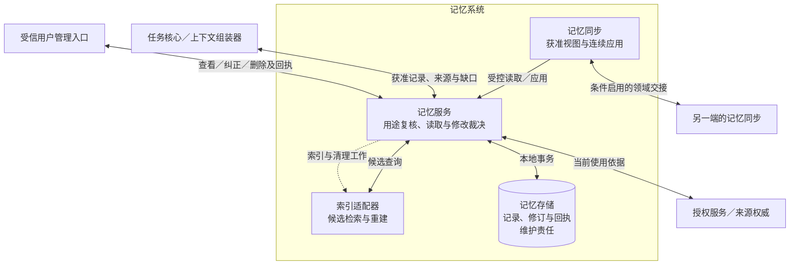
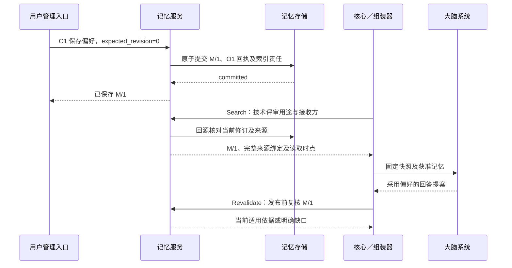

# 记忆系统详细设计

记忆系统把获准保存的信息变成可跨任务复用、可追溯、可纠正和删除的记忆。记忆服务裁决读取与修改，记忆存储保存记录、修订和回执，索引适配器提供检索候选，记忆同步维护面向指定接收端的获准视图。任务事实、任务完成和行动权限继续由各自权威裁决。

本方案展开[全景图](../diagrams/system-panorama.drawio)的 `memory` 分组及 `memory-service`、`memory-index`、`memory-sync`、`memory-store` 四个子模块。`core-memory` 的“获准记忆”交接由任务核心委托上下文组装器调用；`memory-query` 提供候选，`memory-write` 保存事实，`memory-sync-write` 经服务应用受控同步。下文是这些职责的细化，不改变全景图的模块边界。

先读本页建立主线，再读[读取、修改与失效](mechanisms.md)和[端云视图与恢复](synchronization.md)；实现时查[记录与接口](contracts.md)，验收与未决范围查[验证与交付](validation.md)。当前交付为设计，仓库尚无记忆运行实现，也没有新增可发送的记忆协议消息。

## 1. 首期范围与启用条件

首期采用**同用户固定记忆权威、同进程服务、事务存储和可重建的本地索引**。记忆权威是对该用户记忆修订与修改命令作唯一裁决的服务及账本，可以部署在端侧或云端。它与任务写权威分别保存本领域事实，不要求两个账本共同提交。

| 范围 | 本次设计与依赖缺席时的行为 |
| --- | --- |
| 默认闭环 | 用户显式保存／纠正／删除 → 权威提交 → 获准检索 → 组装器绑定来源 → 当前用途复核 → 个性化影响任务；修改答复丢失可查原命令 |
| 必需依赖 | 受信身份、授权使用接口、来源及策略解析、独占账本与当前时间；不能验证某条来源时排除该条并报告受限缺口，必要资料缺失由核心等待；存储不能保证回执耐久时拒绝新修改 |
| 交互与端侧提取 | 从用户输入、授权接入内容、运行记录提取候选，均须分别获准读取、提取、模型处理与长期保存；通过已有任务／执行契约接入，缺来源适配器或提取能力时只开放显式管理 |
| 端云结合 | 本模块定义只读视图、增量应用和恢复依据；跨端需先采用[MS-P1](validation.md#proposals)并实现消息、授权和来源绑定。缺少这些条件时远程访问／同步关闭，不能用普通 JSON RPC 绕过 |
| 离线 | 默认关闭。只在全部本地依赖、有效离线许可、可信时间及防回滚能力齐备时按[离线边界](synchronization.md#offline)开放；副本离线修改只是待提交意图 |
| 后续能力 | 多写者合并、自动权威迁移、跨用户共享、自动全量扫描个人数据、专用向量服务及自动任务结束提取；不作为首期依赖 |

混合部署优先把权威放在保存私密数据的端点，云端只持有准许同步的投影；端点不可达时云端无法取得当前依据的记忆不可用。云端权威适用于允许云端存储和处理的资料。首期不把同一用户拆成多个可并行修改的记忆权威，代价是其他设备离线时不能宣布全局修改成功。

本模块直接承担[项目目标](../../harness-project-goals.md) C2、C7；C1／C3 使用带来源和时间的记忆，C5 对应持久回执与恢复，C6 对应服务／索引替换，C8 对应复用及成本证据，C9 对应经验的受控更新。A1–A4 均适用。V1 验证个性化、来源和时效；V2 仅复用适用设备／应用版本的经验，实际观察、行动和效果核验仍由执行链完成。记忆更新成功不证明效果改善或任务完成。

## 2. 分工与交接

**记忆记录**是带类型、来源、时间和适用范围的一项信息；**记忆修订**是该记录一次不可改写的内容版本。**获准视图**是对特定接收端、用途和策略裁出的字段集合，副本不获得修改权。**来源闭包**包含派生内容依赖的全部原始来源及中间记忆修订，不能由模型删减。

图从服务边界看请求与事实归属。实线表示请求／返回或存储读写；虚线表示提交后的可恢复维护责任。索引和同步均不能绕过记忆服务改变权威记录。

| 发起方 → 处理方 | 输入 → 输出；成功含义 | 持久责任与失败后的继续者 |
| --- | --- | --- |
| 组装器 → 记忆服务 | 用途、接收方、查询／精确引用、限额 → 获准修订、来源闭包、缺口；成功只表示本次读取成立 | 核心保存固定快照及完整绑定；读超时由组装器有限重试，可选记忆缺席可以继续 |
| 用户管理入口／已准入记忆能力 → 服务 | 固定命令、期望修订、内容和来源 → 已提交／拒绝／提交未知 | 服务保存命令及处理结果；调用方保存原身份并查原命令，未知时不换 ID |
| 服务 → 授权／来源权威 | 真实主体、动作、用途、处理位置、来源集合 → 当前资格及约束 | 授权服务保存使用回执，来源方保存资源有效性；记忆服务沿原使用键核对，缺依据不使用 |
| 服务 → 索引适配器 | 用户范围、查询、固定索引代次及上限 → 候选 ID／修订、排序依据、截断信息 | 记忆存储保存索引维护责任；适配器失败时服务有限扫描或报告检索不完整；候选始终回源验证 |
| 服务 → 记忆存储 | 条件修改 → 内容修订、命令回执、变化及后续责任共同提交 | 本模块工作者扫描重建／清理责任；存储答复未知先查原事务，不能凭索引判定提交结果 |
| 同步 → 权威／副本服务 | 固定视图、恢复轮次、快照／增量 → 耐久应用位置与受限项 | 发送方保存视图及交接进度，接收方共同保存内容与游标；任一确认丢失沿原页恢复 |

前两项补齐内核已有的逻辑接缝；授权沿用 [Evaluate／BeginUse／ReadUse](../identity-and-authorization/contracts.md#interfaces)。任务记忆写入作为有限能力，由执行协调器派发，服务回执作为效果依据，不在 `ContextAssembler.Build` 中顺带保存。自动提取触发和外部派生副本清理的额外交接集中在待决提案中。

## 3. 关键选择

| 推荐 | 依据、代价与适用边界 | 有竞争力的替代及改变条件 |
| --- | --- | --- |
| 一个用户一个固定记忆权威，修改要求期望修订 | 纠正、删除和重复提交有单一顺序；不依赖设备时钟判胜负。失联设备只能排队待提交 | 多写者可改善离线编辑，但要解决删除优先、来源和隐私策略冲突；出现明确离线多端共同编辑需求后另立设计 |
| 默认本地事务库，索引为派生数据 | 回执、修订、清理责任可同事务保存；无需先引入独立消息队列或向量数据库 | 云端高写吞吐时替换事务实现和分区，仍须同用户命令／修订原子提交；不能按在线用户数推断当前实现达标 |
| 先结构过滤与文本检索，再逐条回源复核 | 易解释、可离线、无嵌入外发；同义表达召回有限 | 语义索引只有在冻结样本上证明收益且满足处理／存储许可后加入，同样只产生候选 |
| 显式信息直接保存，推断保留推断身份 | 不把模型置信度当事实正确性；允许获准常规更新自动生效，避免每条候选都增加人工确认 | 高风险资料可由应用策略要求确认；推断升级为用户声明必须有新的真实用户输入，模型不能自证 |
| 提取复用正常任务，服务只做确定性裁决 | 复用模型预算、授权、取消和事实恢复；后台自动触发还需明确提供方 | 在服务内另建模型循环会复制内核和大脑职责；首期不采用 |
| 逻辑失效先提交，清理分项追踪 | 删除当下阻止权威新读取，索引、视图、备份可分别恢复清理；不能承诺断网端或外部接收方即时擦除 | 同步阻塞到所有副本删除会被离线设备无限拖住；只有具体部署确能同步核对所有载体时才能提供更强完成条件 |

默认技术实现、检索边界及一手依据见[存储与容量](mechanisms.md#deployment)。记录规则由本模块统一裁决，替换索引不能改变类型、来源、权限、删除或成功语义。

## 4. 贯穿场景：偏好跨任务复用与纠正

用户明确要求“以后比较技术方案时，先给结论，再给取舍表；仅用于我的技术评审任务”。受信入口固定原命令 O1、适用范围及长期保存许可。记忆服务提交偏好 M 的修订 1，回执说明已保存；随后用户的新任务要求比较两种实现，组装器按任务类型取回 M，来源绑定包含 M/1 与其用户声明依据。大脑据此调整回答格式，核心按当前用途复核后发布。

图展示同进程默认闭环；授权服务调用在记忆服务与后续模型使用阶段各自落实，图中省略其往返。O1 是固定业务操作，不是一次网络请求。

最关键的异常是：O1 已提交但响应丢失，用户随后把偏好改为“先列风险”，而旧索引、旧上下文和断网副本仍持有 M/1。入口查询 O1 只能得知其历史提交；当前读取返回新修订，旧绑定复核失败，核心重新组装。删除同理：命令重投不复活 M，索引未清理也不能返回正文；副本与外部派生物的清理情况单独报告，不能把本地删除回执解释为全链擦除。完整竞争推演见[修改恢复](mechanisms.md#mutation)及[同步异常](synchronization.md#recovery)。

## 5. 实现必须保持的保证

| 编号 | 保证 | 权威定义 |
| --- | --- | --- |
| M1 | 记忆与派生结果保留类型、时间、适用范围和完整来源；不能提升事实／效果强度 | [记录与来源](contracts.md#records) |
| M2 | 索引、缓存和副本不裁决可用性；当前用户、用途、接收方与来源全部成立才可返回或复用 | [读取机制](mechanisms.md#retrieval) |
| M3 | 同命令同意图至多提交一次；修改、回执和后续责任原子保存，未知提交不自动换键 | [修改机制](mechanisms.md#mutation) |
| M4 | 纠正、过期、撤权和删除阻止后续不适用使用；逻辑禁用、载体清理及传播分别可查 | [失效与删除](mechanisms.md#invalidation) |
| M5 | 同步按权威修订与连续区间应用，旧快照、旧页和离线编辑不能复活已删内容 | [视图恢复](synchronization.md) |
| M6 | 读取、提取、保存、同步、模型处理和结果披露分别授权；用户及资源消耗隔离 | [授权与部署](mechanisms.md#authorization) |
| M7 | 个性化和经验收益以任务对照评测证明，存储／检索成功不能替代效果验收 | [验收矩阵](validation.md#tests) |
