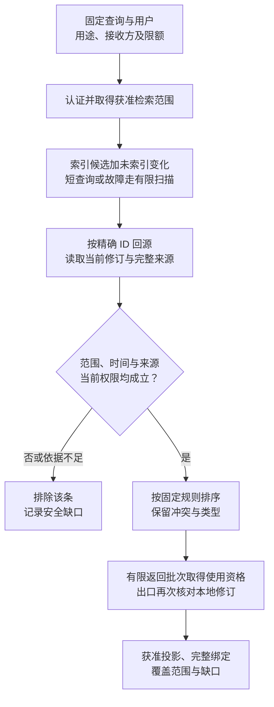
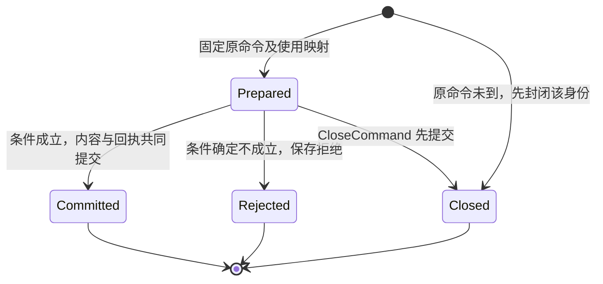
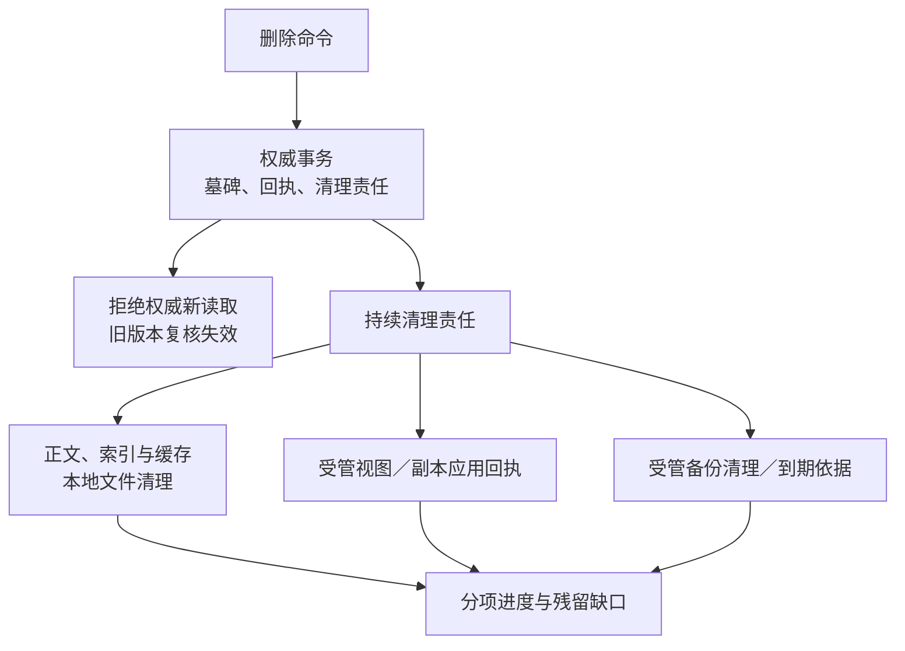

# 读取、修改与失效

[总览](README.md) · [记录与接口](contracts.md) · [同步与恢复](synchronization.md) · [验证与待决](validation.md)

本页沿记忆进入一次任务、被纠正及被删除的过程展开。字段和接口只在[契约页](contracts.md)定义；下文的修订、来源闭包和回执均沿该定义。

## 1. 从候选到可用记忆

检索先确定本次能访问的用户、用途、任务范围、接收方和预算，再找候选。默认索引保存本地获准字段及精确修订，不保存可以脱离记忆服务直接返回的权限结论。文档中的语义相关性不包含“模型判断后就有权读取”的含义。

图中的节点是一次读取的检查阶段。任一条记录失败只排除该条，所需记忆是否缺失由调用方按任务要求判断；图中的返回缺口不泄露无权对象身份。

默认读取按以下顺序有界执行：

1. 入口先建立可信身份，解析结构过滤与任务适用条件。检索 query 本身可能含私密内容，按对应处理用途授权；缓存键包括用户、主体可见范围、用途、接收方、查询、策略和索引代次。
2. 在一个短读快照记录查询切点 S，取得索引已覆盖水位 W。候选合并索引结果与 `(W,S]` 内变更的当前记录，删除项抑制索引旧项。变化跨度或读取上限超出时返回 partial，必要时改用受限权威扫描，不静默漏掉“刚保存但尚未索引”的记录。
3. 回源取精确版本，检查是否当前、非墓碑、未到期且范围匹配。为所有来源逐项取得当前状态和用途依据；本地来源根在记忆存储读取，外部来源由其权威提供。只有老摘要或旧 allow 不够。未经许可的条目不进入排序解释或结果计数。
4. 默认排序依次比较匹配的具体范围条件数、字面匹配分数、来源观察时间，前三项降序，memory_id 升序稳定打破同分。首个 profile 对正文和查询只作 ASCII 大小写折叠，按完整字面子串匹配；分数为正文非重叠出现次数，上限 8，回源后统一计算，不能把 FTS 内部分数和扫描分数直接混排。无查询文本时分数为 0，必须提供类型或适用范围过滤后有限枚举。偏好采用更具体且适用的显式用户声明；同维度、同范围存在冲突时一并返回冲突标记，不靠置信度或到达时间覆盖。fact 与 inference 不混成“事实分数”。用户当前指令的优先级由[大脑输入规则](../brain-system/decision-policy.md#evidence)落实。
5. top_k 及正文预算裁剪后，在实际返回前取得对应有限使用资格，并核对本地删除／修订屏障。返回全部来源和缺口；闭包放不下则排除该条，不能只删元数据保留正文。若同一竞争组无法完整放入，返回冲突缺口，不把单独留下的一项当已解决结论。

`Search` 的分页固定查询、范围、检索 profile、索引代次和切点；游标由服务保存或完整性保护，调用方不能改偏移绕过范围。下一页发现记忆变化或安全依据不再适用时使游标失效，重新搜索。初次查询在处理期间发生本地修订时，出口排除旧项并标 partial；不把混合时点结果描述为一致历史快照。授权与外部来源不存在跨模块原子快照，后续使用仍逐阶段复核。

### 默认索引与降级

索引适配器提供 `Candidates`、`ApplyChanges`、`Rebuild` 三项内部职责，分别接收固定查询、连续变化页、固定重建切点。候选返回 ID／revision、匹配分数、profile／代次、水位、可续位置和截断原因，不对外承诺权限或事实正确性。

默认文本路径为固定字面子串查询：不少于 3 个 Unicode 字符时用 FTS5 trigram 取得候选；1–2 字符查询及不适用的表达式先按范围过滤，再按稳定 ID 有限扫描。用户文本按字面编码，不作为 FTS 查询语言执行。SQLite 文档说明 trigram 的短于 3 字符 MATCH 不会产生匹配；`unicode61` 的连续字符分词也不能据此视为中文词语分词器，后者是基于其规则的设计判断。[FTS5 分词文档](https://www.sqlite.org/fts5.html#tokenizers)

索引工作按用户顺序应用变化；内容变更与索引水位共同提交，或由适配器提供等价的重放／查询依据。重复变化只返回原应用结果，旧修订不能覆盖新修订。换 profile 时在新代次从 S 重建，再追平连续变化到 H，原子切换代次；旧代次待查询释放后清理。不得先宣布水位再写索引。变化日志保留位置同时覆盖有效视图、可查询索引水位、重建切点及进行中的补漏查询；查询和重建开始时原子登记有限保留资格。容量不足须先使落后代次失效、保存新切点重建责任并关闭其查询，再释放旧保留。已经发生缺口则停止 ApplyChanges 并重建，不无限重试缺失区间。索引失败可以停用并回源扫描，扫描也超预算时只给 partial，不无界扫描。

语义向量为可替换候选路径，首期关闭。启用前需单独批准嵌入处理位置、向量存储和删除策略，固定模型／维度／版本并验证召回收益。向量是派生数据，不能因为“不像原文”而自动准许上传。

## 2. 修改提交、重复和并发

create／replace 先验证新内容的完整来源和保存策略，再固定原命令及授权使用映射。delete／restrict 仅要求当前管理／控制权限、目标关联和最小清理依据，不要求旧正文仍可读、旧来源仍有效或继续获准保存；restrict 必须可证明为收紧。来源撤权、过期或失联不能阻止用户删除。服务在数据库外执行外部权限／来源核对，不把网络或模型调用放进持锁事务。准备记录只表示原意图已登记，不表示记忆已经生效。

一次提交的原子边界包括：核对命令尚未最终裁决、当前 owner／控制资格和原期限、expected_revision、该动作要求的本地来源／控制屏障、有效使用回执及配额；随后共同写入新修订或墓碑、当前指针、适用来源、命令回执、change_seq 和索引／到期清理／视图维护责任。delete／restrict 不执行旧正文来源可用性前提，也不重新延长旧内容保留期。外部依据使用绑定精确来源、用途与期限的短期证明；跨权威并发撤销的有限窗口沿[授权保证](../identity-and-authorization/mechanisms.md#use)，不能称为零延迟撤销。

图只建模一个固定修改命令。网络超时是调用方观察，不是状态节点；业务结果由以下持久状态判断。

服务恢复扫描 prepared 命令，沿原键重取当前资格并保留原截止，或提交确定拒绝。内部工作领取失效后只允许新领取代次写结果；旧工作者必须通过相同事务条件，不因持有旧授权回执取得写资格。索引、清理和视图工作只推进自己的事实，不改变原命令结论。

| 竞争／故障 | 权威与调用方行为 |
| --- | --- |
| 两个修改都期望 revision=1 | 首个提交 revision=2；另一个固定 revision_conflict。调用方读取新值重新判断，不自动合并自然语言 |
| O1 提交后响应丢失 | ReadCommand(O1) 恢复 committed 与原修订；若今天无正文披露权，只返回获准最小状态，不再次保存 |
| 读副本／超时查询未见 O1 | 只能报告 not_observed 或 unknown。只有权威 CloseCommand 与原提交串行裁决，才可证明 closed_without_commit |
| CloseCommand 和 Mutate 并发 | 关闭在前，迟到请求不能提交；修改在前，返回真实 committed，用户需要新 delete 才能移除 |
| 许可消费成功但记忆事务未提交 | 先查原命令与使用回执；仅当前 BeginUse 允许且原截止未过才继续。once 不退回、不换单元 |
| 删除先提交，旧 replace 迟到 | 墓碑不可复活，期望旧修订的修改拒绝。再次保存须新的用户意图、新记录 ID 与新来源，不能把删前推断自动导回 |
| 部分候选保存后提取任务取消 | 已提交项保留真实回执，未开始项停止；取消不隐含撤销已保存内容，删除需新获准操作 |
| 数据库恢复旧备份或命令账本缺失 | 关闭受影响用户的修改和副本使用入口；先恢复权威连续记录并证明旧实例隔离，做不到则保留恢复缺口，不能重置 ID 当全新用户数据 |

### 提取和冲突规则

提取任务固定有限输入与来源，不自动扫描所有对话。明确偏好必须能指向实际用户陈述，推断写为 inference；经验引用正式操作、前提与结果，不把“模型计划做过”当经验。一个任务输出的全部记忆候选继承该次生成实际输入的来源闭包，即使模型只引用其中一项也不例外。

模型读过 M/1 后生成的内容不能直接 replace M：完整继承会让 M/2 依赖已被自身替换的 M/1，服务以自依赖拒绝。默认由用户作新的明确陈述，或另起仅含新依据的独立提取任务；旧 revision 只作为宿主 CAS 元数据，不进入这次生成内容。不得删除模型已读来源来伪造“独立依据”。

首期只自动去重同一命令及同一提取任务内规范内容完全一致的候选；相似文本只标记可能重复，不全局合并。确定的竞争键由已安装提取策略产生，例如“项目 X／技术评审／输出格式”；未知语义保留为独立记录。规则不能保证发现所有自然语言矛盾，调用方仍须处理来源冲突。纠正同一记录使用 replace；合并多个记录需用户确认新陈述并分别删除旧项，不引入隐式跨记录事务。

## 3. 纠正、失效与删除

纠正让旧修订不再适用于新使用；到期在读取时直接判定，不依赖清理定时器。撤销许可改变授权事实，删除改变资源事实，两者互不替代。对派生记忆，每次读取验证来源闭包中的全部当前版本及状态，因此反向依赖清理尚未遍历完成也不能继续返回已失效内容。

保存时同事务登记保留到期工作；业务 valid_until 只控制适用性，保留截止还控制正文、索引与其他副本清理。到期后读取入口按时间立即拒绝，工作者扫描已持久责任推进清理，重启不丢触发。策略须区分使用截止、清理最晚完成时间及允许的清理窗口；要求在某时点前物理清理而部署不能提供相应有界完成能力时，保存前拒绝该模式，不能用后台排队代替承诺。

本地删除事务把记录变成墓碑、禁用该修订的后续使用并保存清理清单。后台按反向依赖找到本模块内派生记忆和索引项；全部来源都参与限制，默认不尝试从多个来源中“减掉已删来源后继续使用原结论”。如需保留，必须只用剩余获准资料重新提取为新修订。外部来源状态不可达时不推断为删除，也不继续复用；显示 source_gap。

图只表示一次删除的责任分叉。两条支路可以同时存在，读取禁用和物理清理不组成同一个互斥状态机。

清理报告区分以下事实，不能汇总成无条件的“已彻底删除”：

| 清理面 | 确认依据与边界 |
| --- | --- |
| 权威不可再用 | 墓碑事务已提交；提交前已经交付的字节或已启动外部调用无法追溯撤回，出口门禁后的在途披露单独记录 |
| 本模块在线载体清理 | 覆盖修订和来源根正文、命令规范正文及 prepared 暂存、变化／维护载荷、冻结读取响应、派生正文、索引／缓存、暂存快照及消息载荷；精确记录处理范围、实现版本和结果。来源根仍为另一获准记录保留时，单列残留及依据，不报告该内容已全部清理 |
| 受管副本 | 各接收端按本轮视图代次持久应用 remove／视图关闭并回执；失联端列未确认及既有离线截止，截止只证明不得新使用，不证明磁盘已擦除 |
| 备份与日志 | 受管备份逐份清理或到期，恢复过程先应用外部保存的删除／关闭依据再开放；不可修改备份显示残留至到期。诊断日志默认不记正文，但已有敏感数据仍计入清单 |
| 外部派生物／已披露结果 | 框架任务快照、模型上下文、UI 和评测持有者沿[共同登记／关闭／清理合同](../content-and-provenance.md#holders)分别回执；外部供应方和用户导出按其真实能力报告，不能以记忆回执证明全部清理 |

删除正文不能清空去重事实后允许原命令重建内容。命令／墓碑至少保留到原期限、允许重投窗口和未决清理责任均结束；仅保留获准的最小控制元数据。若策略连最小元数据也要求删除，先持久关闭关联写入资格／账本代次，拒绝全部旧请求；缺少这种不可回滚关闭依据时不接纳该可恢复模式。来源元数据本身也属于受控数据。

若用户要求“忘记某来源并停止以后从它提取”，还须在来源／提取授权中明确禁止后续接入；删除一条记忆不自动撤销连接器权限。首期管理入口可串行发起删除和授权撤销、分别展示结果，不承诺跨模块原子完成。删除完成前，旧来源内容不得以原提取命令重新导入；新的来源采集受当前授权约束。

## 4. 有限使用、隐私与隔离

服务采用[授权使用键](../identity-and-authorization/contracts.md#interfaces)：先持久固定操作／使用映射，再按已安装动作模式分配有限单元及来源角色。一次修改、一次有界读取响应、一个同步页分别是独立使用。每一使用开始前完整意图固定，不能在同一键消费后追加来源或变更接收方。

Search 只支持 continuous。检索处理阶段固定规范查询、可处理资源容器和扫描限额，在读取候选前取得该阶段资格；容器成员由服务权威验证。选出结果后，另以该查询下稳定的返回阶段身份固定精确版本、投影、字节及全部来源，再取得披露资格。两阶段使用不同的固定 operation_id／意图，均在本地记录，不占用用户 once；返回内容重算变化必须新建有界查询尝试，沿原查询预算计数。同步分页同样要求 continuous，每页意图固定后再检查，不能用旧页资格发送新集合。

once 仅支持来源及输出可预先固定的 Read，或一个固定 Mutate。Read 先凭获准元数据固定版本、投影、完整来源及字节上限，再取得当前 BeginUse；之后才读正文、生成并暂存冻结响应，沿同一有限单元返回。暂存本身须获准，读取或暂存失败不释放 once 占用。重试只核对这份冻结结果，不重新搜索或换版本，同单元重复进入仍需原有效窗口内的当前 BeginUse 结论。没有冻结结果、来源已失效、原窗口已过或不能证明仍属原单元，就返回缺口，由用户明确重新授权；不创建新单元延长 once。continuous 的读取重试也须当前判定，原查询总次数和字节预算不因重投刷新。

后续模型处理由模型适配器在其出口重新检查，记忆服务返回的证明不代替该检查。`Revalidate` 只取得精确状态与用途预检，沿 Evaluate 且按当前最小状态披露权返回，不读取／返回正文、不消费后续行动资格。若调用方要求正文，必须另走 Read 的 BeginUse。服务不新增核心自动订阅职责；已有内核在模型输入、提案准入、派发／发布前的检查继续成立。

默认索引只在权威本地处理获准字段，派生结果继承原始输入的限制。允许云端保存一条偏好不隐含允许上传用于提取的聊天全文；允许本地推理不隐含允许嵌入 API。获准视图若只返回“是否满足条件”，该布尔结果也按派生结果策略检查，不能自动称为脱敏。

宿主必须控制存储文件、网络出口、日志和模型进程访问，插件经服务接口读取；不能阻止任意插件绕过出口的部署不提供禁止外发保证。单用户数据库文件及缓存命名空间隔离，云端服务仍逐请求校验真实 user_id。用户配额按全部端点、查询和后台作业汇总；多连接不增加额度。

## 5. 默认实现、容量与维护

首个参考实现推荐 SQLite 本机事务账本，每用户独立数据库，记忆服务内受限工作者扫描维护表；正文、回执和工作同库，索引可同库独立逻辑表。启用 WAL、`synchronous=FULL`，装配时校验实际配置与 FTS5 可用性。WAL 要求同主机访问且同库仍只有一个写者；不把文件放到跨主机共享盘。运行时锁定含 WAL-reset 修复的受维护版本（3.51.3 或官方对应回补及其后续版本），不能仅凭系统自带 SQLite 版本假定安全。[SQLite WAL](https://www.sqlite.org/wal.html)、[同步设置](https://www.sqlite.org/pragma.html#pragma_synchronous)

该选型面向端侧及小规模单机参考部署。多用户连接池有全局句柄上限，按活跃用户打开数据库，后台维护公平轮转。持续写队列超预算、需要多主机共享写入或自动跨主机接管时，应换服务端事务存储并重新验证本模块接口；本轮不选择和实现第二套云存储。FULL 的耐久前提仍包含底层正确兑现同步请求，不能证明磁盘损坏后可恢复。[SQLite 存储故障边界](https://www.sqlite.org/howtocorrupt.html)

默认正文及索引启用各自安全删除选项，清理工作还须覆盖 WAL、暂存文件和备份。核心 `secure_delete` 单独设置不足以清除 FTS 影子表痕迹；采用 FTS5 的 `secure-delete` 时同时配置核心选项并锁定兼容版本。文件系统快照、SSD 残留或外部备份的安全擦除不能由 SQL 回执证明。[FTS5 安全删除](https://www.sqlite.org/fts5.html#the_secure_delete_configuration_option)、[PRAGMA secure_delete](https://www.sqlite.org/pragma.html#pragma_secure_delete)

备份用受控一致快照，记录用户、账本代次、变化位置和保留边界；备份副本独立计入清理清单。恢复旧备份前先恢复完整命令与删除依据并关闭旧实例；依据不足保持入口关闭。VACUUM 可清理数据库内删除内容，`VACUUM INTO` 产生的新副本不修改旧文件，不能代替所有旧副本清理。[备份 API](https://www.sqlite.org/backup.html)、[VACUUM](https://www.sqlite.org/lang_vacuum.html)

下列数值是初始验收 profile，假定单条记忆为短文本、每用户一万条以内，不是性能实测或协议上限。启动配置可以调低，调高须重跑容量和隐私边界用例；无限值不合法。

| 资源 | 初始限额／行为 |
| --- | --- |
| 单条正文／来源 | 正文 16 KiB，完整来源闭包 128 项；超过时拒绝并要求缩小输入，不截断依据 |
| 单次检索 | top_k ≤ 20；候选 ≤ 200；扫描 ≤ 2,000 条且累计正文 ≤ 8 MiB，处理预算 200 ms，不含外部授权等待；任一先到即 partial |
| 返回／同步页 | 单次返回正文 ≤ 64 KiB；同步页 ≤ 100 项且 ≤ 256 KiB，含元数据；一条无法装入时拒绝该 profile |
| 并发与排队 | 每用户读取并发 4、写入串行、后台工作并发 1；新修改队列 ≤ 100，超限确定未接纳。全局并发／字节额按部署填入必需配置 |
| 后台重试 | 每轮最多 5 次指数退避，1 秒起、上限 30 秒，加抖动；耗尽进入 blocked，依赖恢复或管理入口重试原责任，保留一次通知，不丢责任 |
| 保留与存储 | 每用户正文、索引、命令、变化日志、备份分别配置字节／期限，启用前验证能覆盖最小去重与清理责任；控制、查询原命令和删除预留空间 |
| 快照与新鲜度 | 同步快照有效期初始 5 分钟，过期重开；在线缓存不提供脱离当前复核的使用权，离线初始为 0 |

数据库忙等待有原请求期限和次数上限，事务内不扫描大正文、不访问网络；快照分页不跨网络持有数据库长读事务。空间接近上限时先拒绝新内容，继续清理与核对，不能清空已有回执腾位置。全局存储、维护队列和单用户热写均须分别压测；项目千万注册／百万日活／十万在线是后续系统容量目标。
