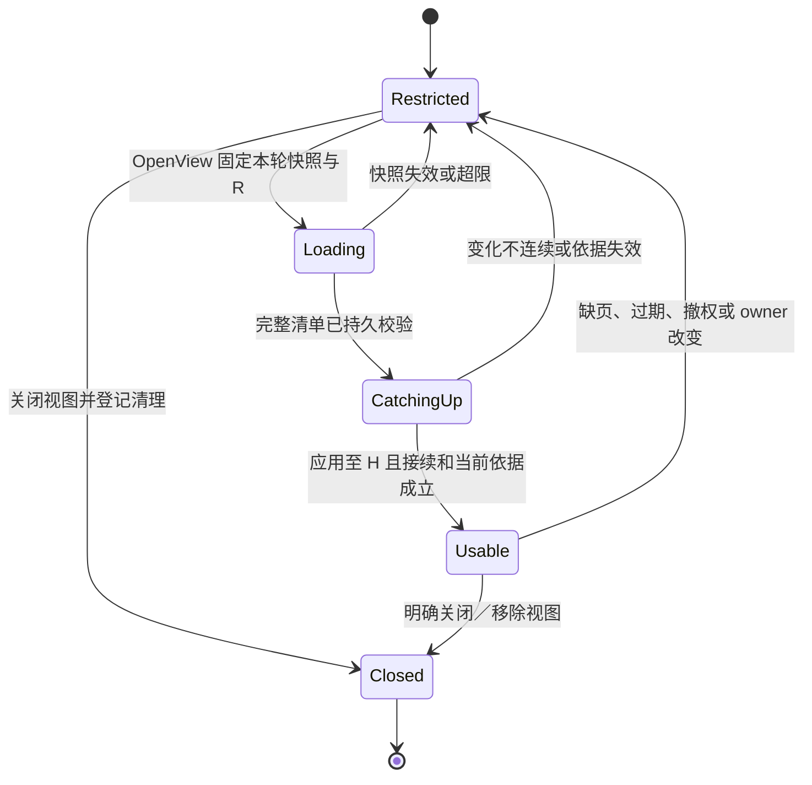

# 端云视图与恢复

[总览](README.md) · [处理机制](mechanisms.md) · [记录与接口](contracts.md) · [验证与待决](validation.md)

本页定义记忆同步的领域算法及内部交接。MS-P1 已采用，下文算法由[WSS 领域 profile 1](#wire)承载，复用[领域恢复框架](../endpoint-communication/recovery-and-control.md#recovery-reference)、身份及完整来源证明。远程部署在这些提供方实现并验收前保持关闭。

## 1. 同步对象是获准视图

权威始终保存用户记忆修改事实，接收端保存只读视图。同步发起方不能请求整库复制后再自行过滤。每个视图固定用户、权威及账本代次、接收端与 owner、用途、选择范围、字段投影、资源策略／授权依据和保留上限；任一绑定变化须新建视图代次并重新判定。不同用途不能拼接成更大的权限。

原始数据、索引、派生记忆和返回结果分别裁决。默认不传索引，由接收端在获准字段上重建；接收端无索引处理许可就只保留允许的精确读取。来源闭包的最小受控引用必须随视图保留，原文不随引用隐含转移。连来源元数据也不能同步时，该记录不能用于远端可恢复任务。

副本读取仍经本地记忆服务，并取得权威当前来源／修订及用途依据；副本只是减少内容传输，在线使用不能只信上次同步时的 allow。权威不可达时，只有已单独验收的有限离线模式可继续。任一端发现删除、策略收紧或恢复缺口，先关闭受影响视图使用，再处理剩余数据。

## 2. 内部接口与恢复依据

| 接口 | 输入 → 输出 | 成功依据与责任 |
| --- | --- | --- |
| `OpenView` | 受信用户、接收端／owner、恢复轮次、固定范围／用途／投影、限额 → 视图代次、快照清单、切点 R、接续游标与期限 | 权威持久固定快照及从 R 接续的责任；只是开始恢复，不允许副本使用 |
| `ReadView` | 原视图代次、快照页或增量游标 → 固定内容页、完整性摘要、覆盖区间、后续游标／缺口 | 每次交接前检查当前披露权；内容和必要来源不获准时停止旧页并失效视图，不能重投已撤权正文 |
| `ApplyView` | 原恢复绑定、快照／连续增量页 → 持久应用回执 | 接收方由服务校验并共同保存内容、remove 与水位；消息已收到不能替代该回执 |
| `CloseView` | 原视图／代次、固定控制命令及当前管理权限 → 持久关闭与清理关联 | 先关闭使用并登记各载体清理，旧页不能重新打开；不要求旧正文仍可披露 |
| `ReadViewReceipt` | 原视图／代次、页或关闭命令、当前最小状态查询权 → 原应用／关闭回执及清理进度 | 可查已过期或关闭的旧代次；只返回获准控制元数据，区分应用完成与字节清理完成 |
| `CheckRecovery` | 当前恢复轮次／owner、完整快照、已应用位置、变化接续及授权依据 → 允许行为、仍受限项、有效期 | 只对已应用且依赖齐备的行为放行；供消息交付汇集，不代替任务／授权自身恢复 |

| 领域值 | 必需关系 |
| --- | --- |
| 视图身份 | `view_id`、`view_generation`、`recovery_id`、用户／权威／账本、接收端／owner、规范选择与投影摘要、策略和授权证明、固定期限 |
| 快照 | 固定切点 R、页数／终止标记、逐页摘要及完整清单摘要；页关联精确修订与来源，不只给“第几页” |
| 增量页 | 同视图代次、`covered_from`／`covered_to`、upsert／remove 项、页摘要、后续游标；覆盖区间首尾衔接，空页也能证明已检查该区间 |
| 应用回执 | 原恢复绑定、快照清单摘要、耐久应用位置、视图可见代次、控制禁用依据、后续入口及缺口；副本服务签发／受信传递，网络 ACK 无此含义 |

R、覆盖位置和游标对调用方为不可篡改的不透明值，内部绑定用户变化序列；不暴露无权条目数量或 ID。接收方根据权威页的连续前后关联验证覆盖，不能按可见条目计数推断无缺口。过期、换 owner、换范围、日志已截断或摘要不符都须重开。

## 3. 快照与增量的连续交接

算法复用记忆存储的连续变化序列，不另建多写者冲突协议。权威为有限生命周期的视图保存投影进度和已交付成员，日志保留同时覆盖有效视图、索引、重建与补漏查询，完整规则见[索引维护](mechanisms.md#retrieval)；容量不足时先拒绝新视图，过期视图固定失效并要求重建，不能跳过缺失变化。

1. 在本地一致读切点 R 固定符合范围的记录版本和快照清单，注册从 R 继续读取变化的责任。构建内容只在获准暂存区进行，不跨网络保持数据库事务；若无法同时固定切点和日志保留，就不返回可用 OpenView。
2. 逐页返回时复核当前记录、来源和披露权。快照形成后某条已纠正、删除或失去权限，且旧正文已不可披露时，直接让旧快照失效并清理暂存，重开恢复；不为复现 R 发送今天无权发送的字节。高频变化导致反复重开时按有限次数返回 unavailable。
3. 接收方先把完整快照放在不可见暂存代次，验证每页与总清单；随后取得本轮目标切点 H，并连续应用 `(R,H]`。权威转换变化为获准 upsert 或对已交付成员的 remove；过滤后无条目仍返回区间覆盖依据。H 后的读取责任同时保留，不能先报完成再临时订阅。
4. 接收方应用到 H、接续入口成立且本轮权限仍适用时，原子切换可见代次，完整替换旧成员集合；快照未列出的旧项也移除。持久保存恢复回执后，CheckRecovery 才允许相应视图读取。新变化或证明过期继续触发复核，不承诺刚完成恢复后状态永远不变。
5. 增量接收在同事务比较预期覆盖位置、核对页摘要、应用 upsert／remove 及推进水位。重复原页返回原回执，旧修订不能覆盖较新修订；未来页先暂存或请求补页，缺口期间相关使用关闭。来源／授权的独立修订不混入记忆序列，以本轮证明另行复核。

图建模一个接收端的单个视图代次。关闭／缺口状态下可以继续接收获准清理事实，不能用旧可见数据推进依赖该视图的任务。

remove 只携带已交付对象所需最小删除关联，不携带旧正文。接纳视图前必须允许接收方保留最小控制和清理依据；撤销正文披露后仍可走此受限清理路径。连这种最小关联也不能披露时，只能以事先绑定的视图关闭指令清除整个本地视图，不能无限保存旧数据等待许可。无法实现关闭／清理的接收端不开放同步。

旧代次的应用／关闭回执至少保留到全部已接纳清理责任和重投窗口结束，视图过期不顺带删除回执。remove 应用只是读取禁用，载体清理完成还须本地清理工作回执；ReadViewReceipt 分别返回两者。新快照完整替换时记录被取代的旧代次，待其所有暂存、索引及正文清理完成才可结清旧清理项。无需重新获准旧正文，也能核对“已应用但应答丢失”的事实。

同步接收方没有写权威。把本地编辑同步回去，必须作为新的 Mutate 意图路由到原权威，携带用户看到的 expected_revision 并查询业务回执；不能把接收方字段更新当增量上行直接覆盖。跨端业务接纳、权威修改完成、另一副本应用三者分别记录。

## 4. 纠正与离线旧数据的竞争

沿总览偏好 M 推演：云视图持有 M/1，手机权威将其改为 M/2，随后删除为 M/3 墓碑。云端断网后携带 revision=1 的编辑，以及旧快照／增量依次到达。

| 场景 | 可观察结果与继续者 |
| --- | --- |
| 权威修改成功但应答丢失 | 发起方查原命令，恢复 M/2 的历史回执；当前 Read 得到墓碑，不解释为 M/2 仍可用 |
| 旧编辑要求 expected_revision=1 | 权威拒绝冲突／墓碑复活；用户可用 InspectCurrent 查看获准当前修订／墓碑，明确新建另一记录，系统不自动改成 create |
| remove 已应用后旧 M/1 页到达 | 视图代次／连续位置或记录修订不符，拒绝覆盖，墓碑和应用水位保留 |
| 云端只收到了新快照前半部分 | 新代次不可见，旧代次保持受限；同步负责补页或重开，不把未出现的条目当已删除完成 |
| 被过滤的变化造成无内容页 | 有连续覆盖依据才推进；只返回空列表而无覆盖依据视为缺口，不能确认恢复完成 |
| 授权先收紧，记忆无新 change_seq | 当前权限证明使旧视图受限／失效；不能等记忆变化日志替授权做传播 |
| H 切点后又删除／连接再次断开 | 接续变化或下次当前复核阻止新使用；已有对外披露不追溯撤回，离线行为只按下节已声明窗口 |
| 删除清理回执丢失，随后视图失效 | ReadViewReceipt 查询旧代次的应用和清理事实；也可据覆盖旧代次的新替换清理回执结清。权威保留未确认项，不因为交付 ACK 就报磁盘清理完成 |
| 日志截断、恢复旧备份、账本更换 | 无连续依据时旧视图立即受限，重新完整替换；账本历史可能回滚时先修复权威，不从旧快照重新开门 |

## 5. 离线能力与驻留边界

离线继续需同时满足[身份离线要求](../identity-and-authorization/mechanisms.md#offline)、本地任务控制／预算、记忆内容和完整来源可在本地复核。权威位于本机只解决记忆当前修订，不能代替授权权威或外部来源的当前状态；缺其中一项就等待或去掉可选记忆。

离线副本若要读取，还须有来源权威明确签发的有限新鲜度依据，绑定来源修订、可接受陈旧期、视图／owner、用途和绝对截止，且用户接受离线期间纠正／删除的传播窗口。来源提供方不支持这种保证就不能缓存成离线可用资料。到期停止新使用，重连先恢复权限、删除和修订，再重新判断旧候选的保存／上传资格；已知撤销或删除立即生效，不等截止。

离线编辑可在获准本地存储中保存“待提交意图”，也可由用户在原本地权威完成修改。副本排队不算权威接纳；上传时复用固定命令、期望修订和原期限，过期先封闭旧命令再让用户决定新意图。相同用户拥有多设备不赋予各设备独立消费单次许可或创建新权威的资格。

离线资料允许在原有限使用截止前存在已声明撤回延迟；已知撤回立即阻止新使用，物理清理单独等待持有者回执。设备失联或备份尚未到期时持续列出残留，不承诺即时擦除或平台介质安全删除。若产品要求这种保证，应禁用该资料的离线复制。端侧限定数据缺少本地提取模型时可以保留原数据并报告能力缺席，不自动改用云模型。

## 6. WSS 记忆领域 profile 1

所有类型以 `harness.` 为前缀、版本 1，精确结构见 [memory Schema](../endpoint-communication/schemas/memory.schema.json)。协议复用身份 P1 的受信主体和当前使用证明、[完整来源合同](../content-and-provenance.md#remote)及相同消息交付。许可恢复成功不代表视图可用；只取得 content_ref 也不能证明来源、字节或当前用途成立。

| 线类型 | 对应接口与结果 | lane／scope |
| --- | --- | --- |
| memory.search／read | 有界候选检索或精确读取；返回完整获准记录（含类型数据、三类可信度及依据）、来源和缺口；Search 固定有限集合，返回 page／partial | recovery；collection／查询集合，或 memory／memory_id |
| memory.list_metadata／inspect_current | 当前本人管理元数据；list 按固定 ID 集合分页，inspect 无需已知修订；无正文、无隐含来源摘要读取权 | recovery；collection／collection_id，或 memory／memory_id |
| memory.mutate | command_id、memory_id、固定意图、create／replace／restrict／delete 和受信操作依据；返回原回执及权威修订 | work；memory／memory_id |
| memory.query_command／close_command | 查询原命令，或原子封闭尚未提交原意图；closed_without_commit 不回滚已提交修改 | recovery／control；operation／原 command_id |
| memory.open_view | 本轮恢复、view_id／代次、范围／用途／投影及期限；固定快照清单、切点与接续责任 | control；memory／view_id |
| memory.read_view | 原绑定／游标；固定快照或连续变化页、范围覆盖、remove 与完整性摘要 | recovery；memory／view_id |
| memory.apply_view | 接收端持久应用水位、清单摘要及受信应用证明；权威记录确认位置 | control；memory／view_id |
| memory.close_view／query_view_receipt | 原关闭、旧代次应用及载体清理结果可核对；view 过期仍保留未决清理事实 | control／recovery；memory／view_id |
| memory.set_extraction_policy | 本人确认的任务类型 opt-in、策略版本及独立预算；由应用策略权威保存 | control；memory／policy_id |

memory.list_metadata／inspect_current 的 purpose 固定为 memory_management；受信管理主体和对象级最小披露权限由服务验证，消息类型和载荷不能自授本人资格。source_refs 属于可选获准字段，不为取得当前修订而调用已失效来源的正文接口。memory.read 未带 revision 时，先在受信服务内固定当前版本及完整来源，再 BeginUse；带 revision 时不能默默改用新版本。查询分页沿[有限集合算法](mechanisms.md#pagination)，同步快照仍沿本页完整清单／连续接续算法，不能用查询的跳项规则掩盖同步缺口。

变更 envelope operation_id 等于 command_id；memory.mutate 顶层 memory_id 必须等于动作里的目标 ID。新建记录初始修订、替换预期修订与新修订关系由权威验证，客户端不得自行指定一条跳跃历史。restrict 只能收紧策略，delete／restrict 不要求重新获准旧正文。来源／actor／processor 与受信操作不符、闭包不完整或必要预算／控制依据缺失时拒绝。

memory.open_view 创建有限持久订阅，因此不伪装纯只读 recovery 请求。快照页数、页摘要及完整清单必须全部可核验；增量页的 covered_from／covered_to 连续，并固定同一视图代次。完整来源超出消息额度时拒绝该投影或缩小页，不能删除必需来源元数据。删除／撤权通过控制路径与当前来源复核先阻止新使用，再按[持有者合同](../content-and-provenance.md#holders)结清副本及缓存。

原关闭／清理 ID 从客户端原 command_id 派生为同一稳定标识，响应丢失仍可查旧代次及原命令。变更答复中 receipt 表示提交事实，视图应用 proof 表示该端已持久应用；物理清理由单独清理项确认。两端 source／target、owner、view_generation 或用途变化均需重新建立获准视图，不能给原消息换路由继续。
