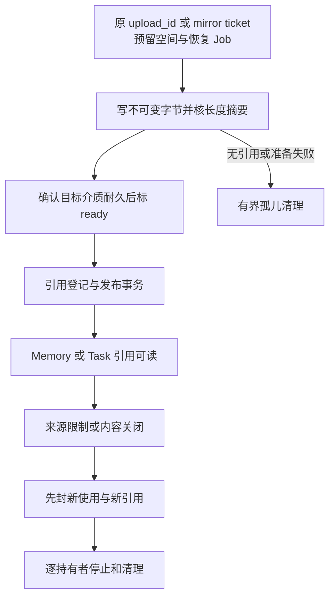

# 内容来源与长期记忆

Content 保存准确材料，Memory 保存跨任务可复用的事实、偏好、推断和经验。任务上下文不自动成为长期记忆。默认先保证来源、当前权限和纠正可解释，再优化召回质量。

内容关闭、事实纠正、授权撤回和物理删除解决不同问题。系统分别记录它们，才能在端云失联、派生缓存和备份恢复时说清哪些已经停止、哪些仍待清理。

字段、来源与存储关系统一见[本模块数据记录](../data/module-records.md#5-content-与-memory)和[存储附录](../data/storage.md)。本章集中说明业务裁决与恢复。

## 1 内容与记忆的持久边界

ContentRef 固定 tenant_id、owner_id、content_id、version、hash、media_type 和 byte_length。字节不可原地改写；修改产生新版本。owner 保存用途限制、retention_until、来源边、当前控制和持有者记录。

MemoryRecord 固定 memory_id/owner/revision、type=fact/preference/inference/experience、content_ref、sources、scope、observed_at、可选confidence、state=active/needs_review/disabled 和 policy_ref。delete 创建管理墓碑，删除项不继续出现在普通检索结果；管理查询仍能观察清理责任。

| 时间 | 含义 |
| --- | --- |
| valid_from/valid_to | 被描述事实的有效时间，不知道就保留未知 |
| observed_at | 原事实被观察的时间 |
| recorded_at/revision | 该记忆被提交或修订的时间 |
| retention_until | 内容允许保留的最晚时刻，读取不延长它 |

查询集合TTL、许可窗口和离线租约另有期限。不得用“缓存还活着”推导内容仍可用，也不得把提取时刻填成未知事实发生时刻。

## 2 发布准确内容

对象存储成功答复必须满足已声明跨可用区耐久与版本定位，不得把单机临时文件标为生产 ready。元数据至少绑定对象键和不可变版本。字节先写、引用后提交可能产生孤儿；清理与引用发布锁同一引用门禁，防止一方发布另一方删除。

跨 owner 发布先保存本方 reference_intent 与核对 Job，再向源 owner register_copy；本方在 held_copy_gate 下提交实际引用与后续责任。双方不共享事务，远端在最后一次检查后关闭时，本方可能短暂发布；新使用仍核验原 owner，后台核对收紧本方门禁。不能声称跨库瞬时原子关闭。

### 内容方法的输入与成功点

以下方法必须遵守[共同方法合同](../protocol/method-contract.md)。写入主体只能修改本owner负责的事实，不能把ContentRef当成持久下载许可。

| 方法 | payload与并发前提 | applied / 查询输出及失败处理 |
| --- | --- | --- |
| content.upload_reserve | transfer_id、content_ref、policy_ref、processed_sources、retention_until、transfer_deadline | 固定原ticket/上传位置和容量责任；只允许声明字节/摘要，不承诺已发布。范围或上限不符为invalid_request/transfer_scope_mismatch |
| content.put | content_ref、transfer_id、policy_ref、processed_sources/disclosed_sources、retention_until | 只有原字节ready、摘要一致、来源已发布且权限有效才A，返回published content_ref；否则等待原transfer或固定拒绝，不重写同版本字节 |
| content.register_copy | copy_id、content_ref、holder_ref、purpose、location、retain_until、reference_intent_ref | A保存持有登记和控制交回；retain_until不得超过源许可。source_closed拒绝新引用；同copy异输入冲突 |
| content.close；CAS | content_ref、reason | A封新使用/引用并保存holder影响Job；返回control_revision与cleanup摘要，不代表已擦除 |
| content.release_copy；源版本 | copy_id、content_ref、control_revision、use_stopped、cleanup_state、evidence_refs | 只接受原认证holder的准确报告；owner核验后更新该副本。未知状态不得当complete，不影响其他holder |
| content.get | content_ref、mode=bytes/control、copy_id? | bytes当前核用途/期限后返回有界字节或有限票据；control只返回该holder的停止/清理状态。来源失联为dependency_unavailable，不绕到旧镜像 |

上传票据过期只封新上传，不证明未知发布失败。发布、引用和孤儿清理必须在同一原引用门禁下裁决。release_copy不是删除原内容的方法；关闭原内容也不允许省略实际副本清理。

## 3 来源闭包决定使用范围

新 Content 只可引用已经发布的准确来源；同批产物先拓扑排序。来源边发布后不可原地改写，形成不可变 DAG。这个选择避免依靠跨库即时遍历检环，代价是纠正依赖要发布新版本。

派生物继承全部实际处理输入的限制交集，分别记录 processed_sources 和实际 disclosed_sources。证据引用只说明哪些材料支撑结论，不等于全部处理来源。没有引用某份本地限定资料，也不得把受其影响的答案自动发云。

正文、摘要、向量、切片、关系索引、Brain输入/输出、UI缓存和镜像都登记来源与 holder。新限制先在原 owner 控制事务生效，并保存分页影响 Job；持有者关闭对应入口、核清在途有限使用后报告 use_stopped。物理状态另为 pending/complete/residual/unknown，不能以停止读取冒充字节擦除。

`content.get(mode=control,content_ref,copy_id)` 只向认证 holder 返回本身的控制和清理状态。原正文权限撤回后仍可恢复收尾，但该接口不返回正文下载定位。`mode=bytes` 必须重新核验当前读取用途。

默认远端镜像每次读取在线核原 owner。需要离线则显式申请受限期限/用途/额度；在这个窗口内不能承诺撤权即时到达。原 owner 不可达时，普通镜像只保留字节，不开放新使用。

## 4 提取、纠正和删除

memory.extract 是有限任务：固定输入、模型/规则、来源、字节/token/费用/期限、候选数和连接器checkpoint。输入及后续责任耐久后才前移 checkpoint。候选与已保存 Memory 分开；默认本人逐项确认，有限预授权须覆盖来源、记忆类别、用途、范围与额度。

ExtractionCandidate保存准确candidate_id/revision、正文、type/sources/scope/policy/expiry和pending/saved/rejected。确认绑定准确候选；锁候选后将saved、唯一Memory、回执、change和Job共同提交，不同command不得将同候选发布两次。编辑产生新候选版本；取消提取封闭自动保存，已有saved保留。

create/replace/restrict/delete 都用原命令去重；变更比较 expected_revision。新 Memory 修订、来源边、原回执、变化记录及 Job 同事务提交。

- replace 表示事实或偏好纠正。旧版本退出当前检索，依赖旧断言的派生记忆标 needs_review；历史证据保留
- restrict 收紧用途/位置/接收方，先阻止新使用再传播，不靠后台删除时机实施权限
- delete 先保存墓碑与清理责任，返回的是逻辑删除决定；只有逐副本及介质确认后才报告相应物理清理完成
- 原文正常到期可以在独立许可下保留派生记忆，但须说明失去逐字核验依据；用户主动关闭来源则按其范围阻断相关派生使用

失败、取消或效果未知不能被提取成“成功经验”。经验保存目标、前提、实际结果、失败/未知、证据与适用边界，不保存未经检验的策略自信。

### 记忆写入与读取方法

可写的MemoryValues为type、content_ref、sources、scope_ref、policy_ref、observed_at，以及可选valid_from/valid_to/confidence。owner、revision、recorded_at和变更水位由Memory owner产生。调用方不得通过Values指定权威状态或扩大保存许可。

| 方法 | payload与并发前提 | applied / 查询输出及边界 |
| --- | --- | --- |
| memory.create | memory_id、values:MemoryValues、candidate_ref? | A返回memory_ref；有candidate时必须精确匹配其版本和值，并同事务标saved。同候选已绑定不同memory_id为idempotency_conflict |
| memory.replace；CAS | memory_id、values | A创建新修订并使旧断言退出当前检索；已disabled者不自动启用，deleted拒绝。派生影响Job共同保存 |
| memory.restrict；CAS | memory_id、restricted_policy_ref | 只允许收紧当前限制；扩权为forbidden/scope_expansion。A先封新使用，再分页传播 |
| memory.delete；CAS | memory_id、reason | A保存deleted墓碑和清理Job；再次同态返回原状态，不能恢复旧身份 |
| memory.extract | extraction_id、input_refs、extractor_ref、limits、deadline、saving_mode=review_only/preapproved、saving_grant_ref? | A保存有界提取责任；preapproved必须有覆盖准确来源/类别/用途/额度的许可。默认只产候选，不自动写长期记忆 |
| memory.read/list/inspect | 原memory/准确修订或统一分页 | read/list按当前权限返回可用记录；inspect仅向有管理权限主体提供墓碑/清理状态，不能借管理入口读取已撤回正文 |
| memory.query | query_ref:ContentRef、scope_ref、purposes、limits、limit/cursor? | 固定查询Spec与获准候选集合；返回准确Memory版本、得分解释、partial/gaps。分页不得换较新正文 |

query_ref必须符合固定MemoryQuerySpec：text_ref、可选type_filter、valid_at、scope_filter和准确ranking_profile_ref，不允许SQL、任意代码或远端Schema。当前主体来自认证上下文。once只支持准确对象读取，广义查询必须有continuous范围许可。源不可核验、索引未覆盖或累计预算耗尽时返回明确gap/partial，不能伪装为没有记忆。

记忆方法的稳定reason还包括source_forbidden、candidate_changed、candidate_already_saved、retention_expired、memory_deleted、query_scope_changed。业务输入不合法则固定拒绝；索引/清理的后台故障不回滚已提交的限制或删除决定。

## 5 检索先限定集合，再比较相关性

默认新设计选定可解释的词法策略：中文字符2-gram、ASCII词元和准确字段匹配，保留最简单的字面匹配作为对照。两者都是可替换检索策略，不改变 Memory authority。向量索引仅在冻结评测证明净收益后启用。

查询流水线为：

1. 认证当前主体，取得允许处理的有限集合，过滤租户、用途、来源、时间和位置
2. 在该集合上计算词法候选与排序；不让无权正文或其向量参与计算后再过滤
3. 可选语义候选与词法候选取并集，用固定 RRF/排序器重排，不能只做词法候选上的向量重排而声称提高召回
4. 对返回的准确 Memory/Content 修订逐项再核披露许可与当前状态，附来源、时间、置信和缺口

候选扫描、向量计算、正文读取、许可RPC和总时间均有累计上限。首轮每查询最多200个冻结候选、每页20项、集合TTL5分钟；达到上限返回 partial，不把“搜完这一页”当“没有其他记忆”。广义search使用 continuous 许可，once仅用于准确对象读取，避免一次授权被无限查询消费。

允许集合过大或索引不可用时做有限权威补扫，保留未覆盖范围，不退化为无限扫描或全租户向量计算。质量报告包含无答案、冲突和负例，不能只测能命中的记忆。

## 6 索引水位必须按提交顺序

每 owner 的 Memory change_head 在行锁下与变更同事务递增，形成已提交变化序列。不能用 PostgreSQL sequence、MAX(id) 或创建时间代替提交切点：先拿序号的事务可能后提交或回滚。

查询在短一致快照中取得当前变化水位R、连续索引水位I及候选，必要时补扫 `(I,R]`。索引只推进已完整覆盖的连续I；跨库索引用不可变段和已确认水位。投影损坏或差额超预算返回 partial，不得把缺行解释成记忆不存在。

Projection key 固定原Memory/Content版本、切分策略、embedding版本/维度、索引代次与用途范围。每条派生路线有自己的 checkpoint。限制、纠正和删除通过反向来源索引分页触发失效 Job，旧 work_revision/lease_epoch 不能覆盖新限制。

Memory owner登记所有可能影响查询可见性的授权authority，并维护registry_version。新增Grant authority必须先登记，再允许它影响内容披露。

visibility_token记录该集合版本，以及各authority的权限修订和核验时点。任何一项无法核验，都返回权限gap。集合或权限修订变化后，原query/view失效。外部扩权不一定产生Memory change，因此不能只监听记忆变化。

这个token不代表跨owner的同刻快照。实际披露时，仍须取得各授权域当前有效的有限使用依据，并遵守安全合同规定的窗口。

memory.query 固定 query_id、主体、查询条件与准确候选 `(memory_id,revision)`，后续页不偷换较新正文。每页当前核查；权限变化使旧集合失效，扩权后也须新查询。空页可有 next_cursor，exhausted 只表示冻结候选遍历完，不清 partial/gaps。错误与缺口不披露无权对象ID。

## 7 受控视图和端云同步

memory.view.open 在同一快照固定对象集合和变化水位S。pull先返回快照，再连续应用S之后的变化；接收方在自己的事务中保存对象/清理责任和游标后才ack。重复页幂等，旧修订不能覆盖新状态；日志缺口使原视图失效并重建。

视图只是受控副本，不成为新的记忆权威。用户在端侧的纠正仍向原 owner 提交命令。外部Grant扩权可能不产生Memory变更，因此每页核对披露范围代次，变化后重开视图，不能只等对象通知。

无入站设备使用已建立WSS上的有限 mirror ticket，固定源/目标holder、准确引用、用途、字节上限、期限及清理责任；端侧按票传字节，元数据与摘要核验后才ready。Reply/网络写入不能替代内容发布。

## 8 保留和运行验证

备份属于副本治理范围。正常恢复先加载关闭、删除和撤权事实，再开放读取；旧备份不能复活旧许可。平台保留锁导致无法立即清除时报告residual及最晚到期，不宣称物理擦除。删除函数成功也不能证明SDK历史表、索引或日志无副本。

必须验证：读取不延长retention_until、纠正使旧断言退出、来源关闭覆盖未被引用的实际输入、索引迟交/回滚不越水位、跨库登记与关闭竞争、清理重启、view ack丢失、扩权后新可见历史对象不漏，以及合法授权的正例。

前沿记忆方案只作为候选。先分别测提取保真、时间适用、错误纠正、授权过滤、召回与下游任务收益，再讨论大模型记忆、图谱或端到端写入策略。引用与限制见[研究依据](../decisions-and-evidence.md)。
