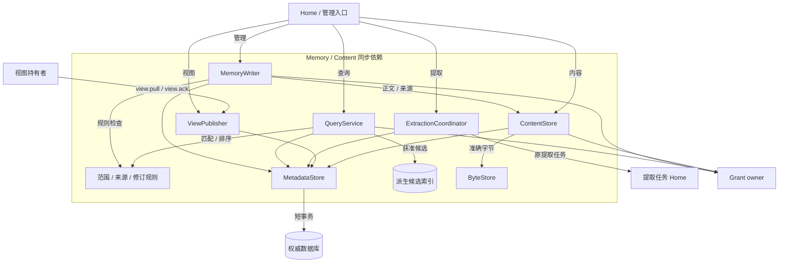
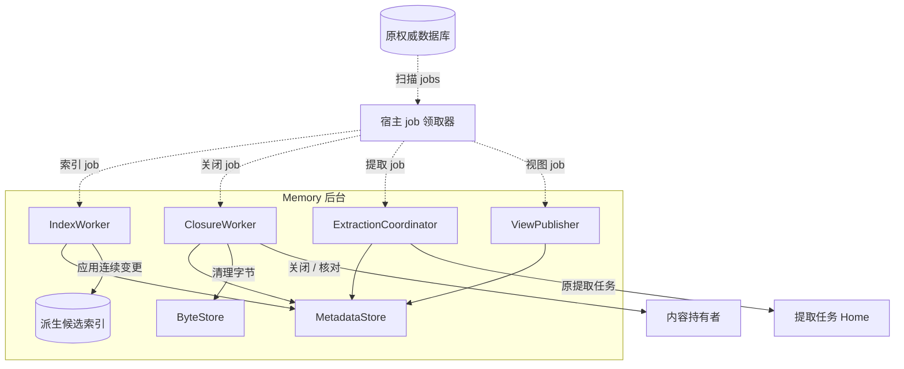
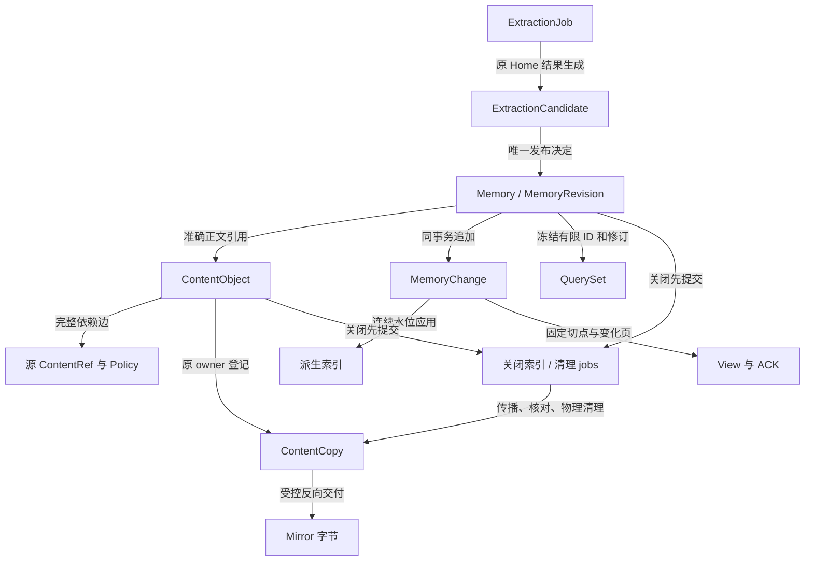
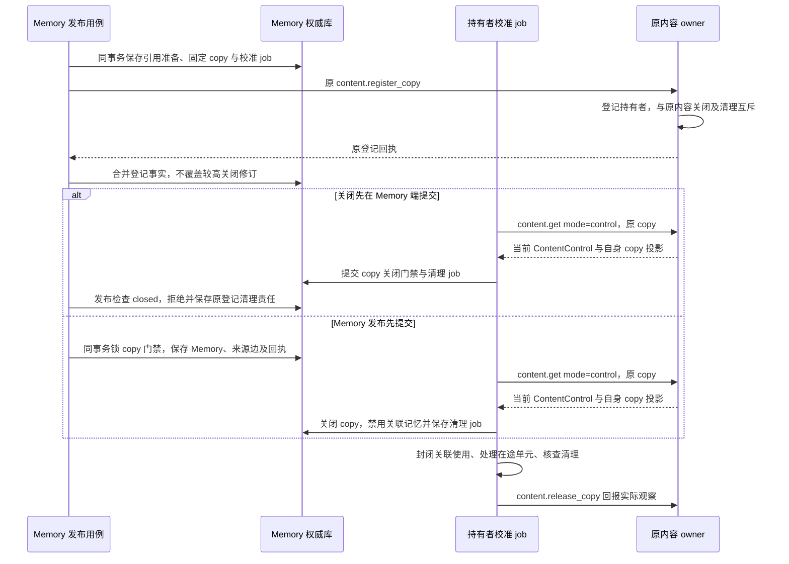
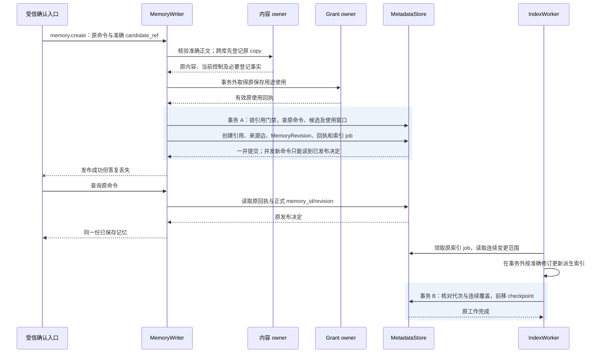
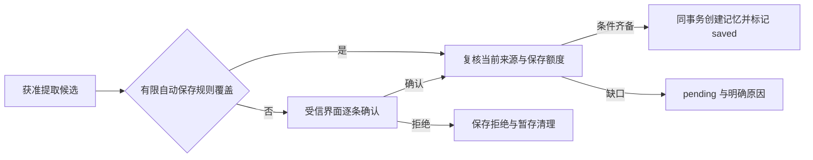
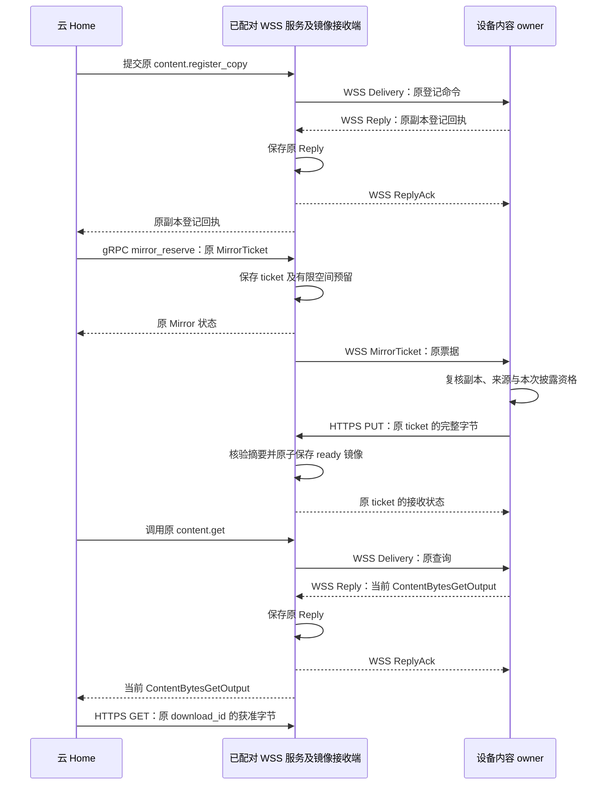

# 记忆实现：查询、提取、内容交付与关闭

[模块主线](README.md) · [安全](../security/README.md) · [Brain 输入](../brain/implementation.md) · [交互实现](../interaction/implementation.md)

本文规定 Memory owner 和内容 owner 的生产实现；云端每个 owner 由一个 PostgreSQL 写权威裁决，应用与工作进程可多副本运行。
云端默认同租户的 Memory 与 Content 元数据共提交域，正文与云端镜像放跨可用区共享对象存储；开发单体及适用端侧组件可使用本地数据库与目录。物理布局和维护约束归[生产存储](../storage-and-middleware.md)。
核心使用 Go，同进程通过 Go 接口组合；领域服务跨进程用 gRPC，浏览器、CLI 和设备端云通过 `/v1/connect` 的 WSS 双向长连接调用。
HTTPS 只保留发现、认证和大文件原始字节读写；上传预留、状态查询及镜像控制经 WSS request／gRPC Call 处理，具体类型由[公共传输契约](../contracts/transport.md)定义。
正文、来源控制、授权使用、索引和持有者清理分别保存，不能用一个“删除成功”字段替代。
以下表结构和算法为设计规格；没有实际隐私隔离或存储恢复实验结果。

## 1. 软件形状、内部职责与最小装配

用户保存一条限定技术评审的偏好，Memory owner 保存权威修订并产生索引工作。
新任务先在获准范围检索，再到内容 owner 取得正文，Brain 输出继承实际处理来源。
用户纠正或删除后，权威记录先停止参与新使用，索引、副本和派生物沿原关闭记录收尾。

Memory 的 facade 由 MemoryWriter、QueryService、ExtractionCoordinator 和 ViewPublisher 组成，
ContentStore 则提供内容 owner 的 facade。它们是可同进程装配的逻辑接口，不要求分成多个微服务。
application 层组合范围与来源规则、元数据事务和外部 port；MetadataStore 封装下表中的权威记录，
ByteStore 适配本地目录或对象存储。索引、字节及传输适配器都不能越过 MetadataStore 决定新的可用资格。
范围匹配、排序、策略收紧比较和候选状态判定实现为同包纯规则函数，消费 application 层已取得的事实；
规则函数不访问远端或数据库，也不将格式校验当成当前来源资格证明。

下面单独展示持久工作领取与继续处理。与上图同名的组件、store 和权威库均为同一对象，不表示另建服务或数据库。

两图实线均为同步依赖，虚线表示从原数据库领取持久 job。指向 MetadataStore 的边表示各组件读写其负责的原记录；组件与表的对应关系见下表。
指向 Grant owner 的边分别核验管理、查询或内容用途；规则函数本身不签发使用依据。外部调用均位于本地事务之外，记录、回执和 jobs 在所属 owner 的短事务中一起保存。
Memory owner 和内容 owner 可分别部署；跨库除准确引用校验外，还须先登记持久 copy，再将本地 copy 门禁与发布共事务，见[引用门禁](#reference-gate)。
索引不是权限边界之外的捷径，所有候选生成都先限制到允许处理的集合。

| 内部组件 | 责任 | 失败时的继续者 |
| --- | --- | --- |
| MemoryWriter | 修订比较、记录写入、候选发布与关闭 | 原 Memory job |
| QueryService | 获准候选、排序、冻结集合和分页 | 调用方保存查询身份及游标 |
| IndexWorker | 按修订切点构建可重放索引 | 原索引工作，不修改记忆事实 |
| ExtractionCoordinator | 绑定有限输入、Home 任务和候选 | 原提取任务及候选映射 |
| ViewPublisher | 快照、变化序列、ACK 与日志保留 | 原视图发送责任 |
| ContentStore | 不可变字节、策略、来源及交付 | 原上传／内容命令 |
| ClosureWorker | 禁用传播、持有者核对、物理清理 | 原关闭修订及清理工作 |
| MetadataStore | 封装各 owner 的修订比较、唯一键、回执与 jobs 事务 | 原数据库中的业务决定 |
| ByteStore | 暂存、准确版本读取、整份上传与删除观察 | 原 upload 或 copy；不自行授予可读资格 |

默认词法索引和权威增量补扫复用现有数据分区；语义索引须单独获得处理、保存和清理许可，并证明检索收益与运行成本。
引入语义候选不能移除逐页当前状态复核，也不能把未经许可的资料先做全库排名。

## 2. 持久对象与数据库约束

每个表的唯一键都包含 tenant_id；owner 从受信路由与认证确定。
业务记录使用单调修订，内容字节使用不可变版本，两者不互相代替。

| 记录 | 约束与索引 | 保留责任 |
| --- | --- | --- |
| memories | owner、memory_id 主键；current_revision 单调；state 独立于清理 | 当前可管理元数据 |
| memory_revisions | memory_id、revision 唯一；正文、来源、范围不可就地改变 | 按历史证据许可清理正文 |
| source_edges | derived_ref、source_ref 唯一；提交前验证无环 | 仍有受管派生物时保留必要关系 |
| policies | policy_id、revision 唯一；完整不可变策略 | 使用和关闭核验依据 |
| index_checkpoint | owner、索引版本唯一；covered_revision 单调 | 不超过已成功应用的变更 |
| memory_changes | owner、change_sequence 唯一；修改与变化项同事务 | 视图及索引最慢必要水位 |
| query_sets | query_id 唯一；绑定主体、接收方、摘要、期限与有限有序集合 | 初值 5 分钟，到期不可续旧游标 |
| extraction_jobs | extraction_id 唯一；输入摘要及 Home 任务不可改绑 | 原任务及输入检查点 |
| extraction_candidates | candidate_id 唯一；原提取任务、版本及发布决定固定 | 确认、拒绝或清理责任 |
| views | view_id 唯一；范围、接收方、快照切点及 ACK 水位 | 未确认页和关闭范围 |
| content_objects | owner、content_id、version 唯一；hash 与长度固定 | 按策略管理字节 |
| content_controls | 精确内容版本主键；control_revision 单调 | 关闭依据先于恢复开放 |
| content_copies | copy_id 唯一；内容、持有者、用途、保留期限固定 | 到逐副本停止及物理清理确认 |
| content_mirrors | 原 ContentRef、copy_id 唯一；接收方只保存字节与原 owner 控制修订 | 只读副本；不创建新所有权或延长来源资格 |
| content_closures | 对象身份、关闭修订、必要关联及决定摘要 | 长期最小关闭索引 |
| reference_intents | 原 Memory 命令、准确来源集合、固定 copy／登记命令身份及阶段 | 跨库登记与本地发布的恢复责任；取消或失败也须清理原登记 |
| held_copy_gates | 原 owner、copy_id 唯一；准确引用、最高 control_revision、最高 copy.revision、use_stopped 及本地 open／closed 门禁 | 两种修订独立单调；原内容 closed 或 copy 已停止均闭门，发布与关闭共用行锁，迟到答复不能重新开放 |
| copy_control_jobs | 原 owner、copy_id 的唯一活动责任槽、due_at 及领取代次 | 登记前与 reference_intent 共同保存；持有期查询当前控制，直至停止且 physical_state=complete 的报告获原 owner 接纳；残留保留有界核对责任 |

长期关闭索引不包含正文、完整参数、凭据或可重构敏感资料的解释文本。
它用于拒绝迟到原身份、阻止旧备份复活、区分已关闭与从未存在。
完整回执到期后，查询可以返回 gone 和获准最小关闭状态，不能返回 not_found 诱发重新写入。
未知清理或未结效果所需的最小恢复记录继续保存，并计入宿主存储水位。

### 2.1 核心对象关系与生命周期

MemoryRevision 引用一份准确 ContentRef；正文可位于另一个内容 owner。
候选发布生成正式记忆关系，查询集合只冻结引用，镜像只增加原内容的受控持有位置。
这三个动作都不会更换原 ContentRef 的所有权或放宽来源政策。

图中的连线是可追溯关联；Index、View、QuerySet 和 Mirror 各有独立清理水位，不能用其中一个 ACK 代替全部收尾。

| 对象链 | 创建与持久化 | 传递与消费 | 归并与清理 |
| --- | --- | --- | --- |
| ExtractionJob → Candidate → MemoryRevision | Coordinator 固定输入和 Home；候选有期限暂存；Writer 在发布事务唯一决定保存 | UI 或有限预授权消费候选；查询只接纳已发布、当前有效记忆 | 拒绝／过期清候选字节；已保存记忆独立保留，不因原任务取消被删除 |
| ContentObject → 来源边／Policy | 完整字节校验后 content.put 提交元数据和准确来源 | 各消费者取得原 copy 和当前用途使用；来源限制交集随派生关系传递 | 先关闭新使用，再传播和清理；残留保留原责任，最小关闭依据长期保存 |
| MemoryChange → Index／View | 记忆事务追加变化；后台分别前移连续检查点 | 索引仅产候选，视图接收端应用后 ACK；不能共享成功含义 | 日志依必要水位回收；落后视图重建快照，关闭责任不随日志删除 |
| QuerySet → 页投影 | QueryService 固定有界 ID、修订与排序 | 每页按当前权威状态和资格筛选，原游标只移动位置 | 到期清集合；不续旧游标或把正文复制入永久查询缓存 |
| ContentCopy → Mirror | 原 owner 先登记 copy，接收端预留票据，准确字节校验后 ready | 每次镜像读取在线取得原 owner 的 ContentBytesGetOutput | 接收原控制后先停读、再清字节；无原 owner 可达性即不能开始新读 |

### 2.2 写入与正文提交

正文先写入有限上传暂存，校验完整 hash、media_type 和 byte_length，再提交引用。云端生产暂存、正式正文和镜像均使用共享对象存储；原 upload／ticket 的状态及准确对象版本在 PostgreSQL 保存，换接收实例不依赖原实例磁盘。
`content.put` 不携带大正文，只携带 upload_id、预期 ContentRef、完整来源与 ContentPolicy。
已提交 ContentRef 的字节不可覆盖；同一身份不同摘要返回冲突。
元数据事务失败时，暂存或孤立字节由有限清理工作回收。

采用一个内容元数据门禁协调引用登记与垃圾清理。同库发布把业务引用、来源边、回执和后续工作放进同一事务。
清理事务先标记对象不可新增引用，再检查无业务引用和持有者；登记引用必须检查该标记。
已经被持久业务记录采用的对象不能按创建时间删除。
跨存储字节删除失败保存 residual，不撤销已经提交的逻辑关闭。

### 跨库引用：先登记持有者，再发布

图建模本地发布事务与已认证关闭事实的先后，不声称两个数据库原子提交。正文及实际参与处理的远端来源均先取得原 owner 的持久持有者登记；各 copy 绑定 Memory holder、用途、准确内容和保留期。来源与 Memory 的本地关联以 reference_intent 固定，不能在重试时换 copy 或遗漏输入来源。

默认共库可让来源关闭与发布真正共事务互斥。跨库只与已经同步的本地门禁互斥：源端在最近一次查询之后关闭、本地尚未查到时，发布记录仍可能提交；不能宣称跨库关闭瞬时阻止发布。该记录不取得永久可用性，后续每次使用在线复核来源，校准查回关闭后禁用关联使用并清理。

准备记录与恢复 job 先共同提交，才向远端登记；它们不表示 Memory 已发布或 memory.create 已 applied。本地发布失败后即使当前进程退出，原恢复 job 仍会查询登记结果，并按原命令决定继续发布或停止及清理持有关系。

普通 copy 的恢复入口是 `content.get(mode=control)`，由当前认证 holder 查询原准确引用与 copy_id。校准 job 在登记／发布准备和重启时优先运行，持有期按 due_at 有界轮询，最长间隔纳入关闭传播预算；可丢通知只提前原槽的 due_at。它不依赖未定义的远端关闭 RPC。owner 保存未确认停止及清理的持有者责任，直到 `content.release_copy` 报告实际事实；成功查询本身不确认停止。

本节生产跨库发布和普通在线 copy 采用在线核验，不改变已有显式离线资格的范围与期限；离线装配须独立验收。control 查询不签发或续期该资格，持有者获知关闭立即停止，尚未获知时最迟到原资格到期停止。下述查询失败阻塞规则适用于依赖当前在线核验的路径。

关闭处理与发布都按固定 copy 键顺序锁 held_copy_gates。控制查询先于登记答复取得关闭时，先留最小 closed 门禁；登记答复迟到只补登记事实。control_revision 与 copy.revision 独立按更高修订合并，同修订不同事实拒绝；原内容 closed 或 copy.use_stopped=true 均永久封闭该 copy。源内容仍 active 也不能复用已停止的 copy，晚到的旧控制或旧 copy 投影不重开门禁。查询失败仅阻塞依赖使用，不推断来源已关闭。发布事务必须核验所有必要登记已取得、本地门禁开放、用途与来源当前检查满足要求，再写 MemoryRevision、全部来源边和后续工作。关闭后提交的发布拒绝；发布先提交则关闭事务禁用关联的记忆／派生使用并建清理责任。原 owner 的关闭尚未查回时，本地记录不能声称已收到撤回；后续读取继续在线复核原来源，不凭登记或控制回执取得永久使用资格。

| 中断位置 | 沿原身份恢复 |
| --- | --- |
| 登记提交、答复丢失 | 查询原登记命令；状态未知时不发布、不释放可能仍需清理的登记 |
| 已登记、本地发布失败或取消 | 保存并执行原 copy 的停止／清理工作，以 content.release_copy 回报；不把事务回滚当作远端登记不存在 |
| 控制查回关闭、关联记忆尚未创建 | 先保存 copy 关闭门禁，迟到登记或发布不能重开；剩余临时字节继续清理 |
| 发布成功、答复丢失或新实例接替 | 查原 Memory 命令与 reference_intent，恢复同一记忆和持有关系；不重复登记或另建记忆 |
| 控制查询失败或旧回答迟到 | 原校准槽继续，依赖使用保持 blocked；不能把失败当关闭，也不能用旧修订重开门禁 |

持有者在原 owner 的认证查询答复上核对准确引用与 copy_id，再将门禁和清理责任共同保存。普通 copy 使用上述查询；已有镜像还可接收绑定 ticket 的 MirrorControl，两条路径共用本地最高控制修订。控制查询的最小投影不含正文、下载定位或新的授权依据，不能据此发布或保存记忆。跨库装配须提供原登记回执查询和持久校准槽；缺席时拒绝跨库发布，使用默认共提交域。

### 2.3 记忆写事务

1. 查询原命令与关闭索引，已决定的原命令返回固定回执。
2. 取得管理或保存用途依据，核对正文准确版本与当前来源限制；跨库先完成上述持久 copy 登记。
3. create 检查原命令唯一约束；replace/restrict/delete 比较 expected_revision。
4. 在同一事务核验本地内容／copy 门禁，登记业务引用和来源边，更新当前修订、保存完整新记录或最小墓碑、原回执、变化项及 jobs。
5. 提交后响应；索引、派生审查及副本关闭不作为事务内外部调用。

replace 的旧修订退出查询，依赖旧结论的派生记忆进入 needs_review。
restrict 只能收紧接收方、位置、用途、保留期和范围；策略子集由 owner 校验，不靠 Schema 格式推断。
冲突不自动修改 expected_revision；调用方读取当前状态后重新决定。

### 2.4 候选唯一发布、索引推进与丢答复恢复

下图选择逐条确认后的发布路径，展开 Memory 内部事务。
自动保存只改变入口的许可依据，采用同一候选竞争和保存事务；与第 5 节的跨端字节交付分开验证。

默认同库事务 A 同时完成引用登记与候选发布；分库时先完成[持有者登记](#reference-gate)，事务外资格检查不能变成永久授权快照。
任一当前来源或保存用途缺口都不进入图中的保存分支；事务 A 还须复核本地 copy 门禁、原使用窗口和候选竞争结果，并将 candidate.saved 与正式版本共同提交。
Memory 保存准确来源关系，后续查询及使用仍按当前来源核验；关闭并发到达时先阻止新使用并传播清理。
索引写完后进程崩溃，重领者按同一变更范围幂等重建，不把未提交 checkpoint 当已覆盖。
发布成功不等待索引完成；查询通过有界补扫看见新修订，补扫不足时准确返回 partial。

## 3. 查询、索引补扫与稳定分页

### 3.1 范围规范化

Scope 固定 task_types、resource_ids、purpose_tags 三组集合。
组内为空表示该维不增加筛选；非空表示记录与请求在该维有交集。
记录中不同维度共同成立；不能把 task_types 命中当作绕过 resource_ids 的条件。
请求必须至少含查询词、类型或非空范围之一，防止空条件默认扫描全部库。

ASCII 字母大小写折叠，其他字符按 Unicode 码点字面匹配；不隐含中文分词。
text_terms 按调用方提供的词项去空、去重，单词项最长 256 个码点。
多词项取并集，排序先匹配词数，再按非空范围维度数降序、非空集合元素总数升序，最后按 observed_at 降序。
最后以 memory_id 升序打破同分；规则版本写入查询集合，不在中途换算法。
该排序表达参考实现的可复现偏好，不声称语义相关度或穷尽全部有用记忆。

### 3.2 先处理许可，后生成候选

QueryService 先规范化认证用户、owner、purpose、recipient、类型和范围。
读取可处理记录与字段的受信范围，再为有限查询身份取得 continuous 处理使用依据。
同一查询在单个 owner 内执行；owner_ids 可以列出聚合目标，但当前响应只属于请求 target。
跨库聚合由 Home 分别保存各库游标与缺口，不承诺跨 owner 的原子快照。

索引和权威补扫均受相同允许集合过滤；不得先读取无资格正文后丢弃候选。
取得候选后，按准确来源申请结果披露使用依据；拒绝项不出现在结果中。
once 只用于来源和输出范围可预先固定的精确 read，不用于未知集合搜索。

### 3.3 索引追赶

索引工作在事务外构建候选索引段，再在短事务确认对应变更范围全部应用。
checkpoint 只前移到已连续覆盖的最后修订；中间失败不能跳过。
查询读取当前权威切点 R 和索引覆盖切点 I，在索引候选之外补扫 (I,R] 的获准变化。
修改和删除使用最新权威状态去重；旧索引命中不能恢复旧正文。

补扫命中上限时返回 partial 和缺口，不能假装新写记录已完整可检索。
索引损坏时关闭该索引并执行有界权威扫描；仍不足则 partial，不取消扫描上限。
索引重建只改变候选加速，不改变记录修订、删除状态或查询用途。

### 3.4 冻结集合与页游标

初次查询用调用方固定 query_id 和查询摘要，冻结最多 200 个 (memory_id,revision) 及排序依据。
query_id 只标识有限只读查询，不能创建记忆或消费未知范围的单次许可。
游标为不透明值，服务器绑定主体、接收方、owner、原查询摘要、集合和位置。
同 ID 不同查询条件拒绝；需要改条件时使用新 query_id，累计任务预算保持不变。

每页扫描至少一个未遍历位置或返回 exhausted=true。
每次返回前重新检查当前状态、修订、来源、保留期及披露资格。
已修订、删除或撤权项跳过，返回 skipped_count 和 changed，不披露被跳过对象身份。
新记录不会插入旧集合；空页仍可能带 next_cursor。

返回 position 表示本页开始位置，scanned_count 表示消费的集合位置数，items 是其中仍获准的部分。
next_cursor 缺席当且仅当 exhausted=true；集合到期返回 cursor_expired，不能续期原集合。
同页重读可以因当前资格变化减少可披露项，但不得新增旧集合外的对象。
permission 变化不会改写原集合或游标的遍历位置，只改变本次可见投影。

管理 list 固定的是 memory_id 集合，逐页取得当前 MemoryControl，不需要旧正文可读。
inspect 可直接查看拥有管理权的对象；没有正文读取权不妨碍删除。

## 4. 端侧提取与候选发布

`memory.extract` 在 Memory owner 保存 extraction_id、有限输入摘要、规则与唯一 Home 任务映射。
接纳成功表示推进责任已保存，输出 state=queued，不表示已经产生候选或长期记忆。
Home 负责模型、工具、预算和取消；Memory owner 负责候选事实与发布决定。
连接器检查点只有在本批输入与下一步责任都持久后才前移。

### 4.1 输入与候选

输入必须列出准确 ContentRef；另有字节、候选数、期限和费用上限。
提取规则固定 ComponentRef，逐条规定来源类型、记录类别、范围和保存政策。
没有可运行且获准的本地模型时，local_only 提取等待或不支持，不能自动切换云模型。

每次实际模型调用保存完整输入清单，所有候选继承实际处理输入的来源约束。
候选正文先进入有期限的获准暂存；候选记录保存类型、准确内容、来源、范围和 proposed_policy。
候选的 decision 为 pending、saved 或 rejected，终态不可改写。
提取任务结束后，候选清单通过其准确结果内容引用呈现；列表不是自动保存许可。

### 4.2 逐条确认与预授权分支

默认进入逐条确认。自动保存必须命中用户预授权的来源、类别、用途、范围、期限和额度。
预授权不允许扩大输入扫描范围，也不允许来源已关闭后继续保存。
任务结束自动提取只对用户选定类别启用，按 task_id、terminal_revision、policy_version 去重。
失败、取消或效果未知的任务不能自动转成成功经验。

确认复用 `memory.create` 的可选 extraction_candidate_ref；引用绑定候选 owner、ID 和 revision。
MemoryWriter 复核候选仍 pending，提交正文、类型、来源和范围必须与获准候选一致。
编辑候选内容需要形成新候选版本或普通明确的用户写入，不能替换原确认对象。
create 事务同时写正式记忆、candidate.saved、实际 memory_id/revision、回执及索引工作。
两端同时确认由候选唯一发布约束裁决；同原命令返回同记录，新命令不能生成第二条记忆。

拒绝由预装的 `memory-candidates` 受信应用处理器消费 candidate.reject 事件。
处理器只允许持有候选管理权的用户，按 candidate_ref 比较修订；不是任意 application_event 自动获得领域权限。
交互服务为该处理器固定 target_command_id，原命令查询指向 Memory owner 的 logical_service_id。
处理器同事务写 rejected、原回执和暂存清理责任，重复投递返回原决定。

取消提取关闭新处理，不删除已确认保存的记忆；pending 候选停止自动发布并显示取消原因。
用户仍可在来源和保存资格有效时明确确认一份已产生候选；这是一项新的管理决定。
候选过期或来源关闭时拒绝保存并清理暂存，不能用旧按钮恢复资格。

## 5. 内容交付、副本与单向视图

### 5.1 小元数据与大字节分开

上传与镜像的管理请求使用下表五种传输管理 kind：端侧通过 WSS request，独立服务之间通过 gRPC Call。
它们属于传输配置，不增加 101 个领域方法，也不替代 `content.put`、`content.close` 等领域决定；精确字段、认证和恢复规则见[公共传输契约](../contracts/transport.md)。

| 传输管理 kind | 输入 → 输出 | 职责 |
| --- | --- | --- |
| upload_reserve | UploadIntent → Upload | 绑定原 upload_id 和不可变字节元数据，预留有限暂存空间 |
| upload_lookup | `{upload_id}` → Upload | 核对原上传状态；答复丢失不另开上传身份 |
| mirror_reserve | MirrorTicket → Mirror | 核对原副本登记，保存原票据与有限空间预留 |
| mirror_lookup | `{ticket_id}` → Mirror | 核对原镜像字节及控制状态，不授予读取资格 |
| mirror_control | MirrorControl → Mirror | 绑定原 ticket_id，按原控制身份及单调修订关闭镜像读取并保存清理责任 |

一般上传先取得 `upload_reserve` 的原 Upload，再向 HTTPS `PUT /v1/content/uploads/{upload_id}` 发送原字节；失联后用 `upload_lookup` 核对原状态。
字节 ready 以后，以下领域方法仍在原 owner 的业务事务内决定正式内容与副本责任。

| 方法 | 精确载荷 | 成功边界 |
| --- | --- | --- |
| content.put | upload_id、content_ref、sources、policy | 不可变内容元数据与来源可查；未提交暂存不算内容 |
| content.register_copy | copy_id、content_ref、holder_id、purpose、recipient_id、retention_until | 副本登记可查；尚未证明字节已经交付 |
| content.get，默认或 mode=bytes | content_ref、copy_id、purpose、recipient_id、usage_authorization_refs | ContentBytesGetOutput：有限下载定位及当前 control_revision |
| content.get，mode=control | 仅 mode、content_ref、copy_id | ContentControlGetOutput：原 ContentControl 与自身 copy 的最小控制投影；不返回下载定位 |
| content.release_copy | copy_id、content_ref、use_stopped、physical_state、evidence_refs | 保存原副本的停止／清理观察，不删除未知责任 |
| content.close | content_ref、收紧或关闭意图、原因；信封带 expected_revision | 封闭新交付并保存传播及清理责任 |

bytes 模式返回 download_id、expires_at、range_supported 和原 ContentRef，不返回任意 URL 或 JSON 大正文。
原 owner 下载面可达时，字节端点由[共同传输协议](../contracts/transport.md)定义为 `/v1/content/downloads/{download_id}`。
设备没有入站地址时，下载定位不能使设备突然可达，改用下一节的受控反向交付。
下载定位绑定原认证主体、接收方、copy_id 和准确内容；它不替代当前使用资格检查。
重复 get 可返回新定位，不能续期原授权或原副本的保留上限。

bytes 模式只为已登记副本返回定位，不创建新的持有者或授权责任。
下载前再次复核当前关闭和来源状态；长下载按有限块复核，期限或关闭后停止后续交付。
已交付字节无法通过中断连接收回，原 copy 继续报告停止和物理清理。
临时下载票据丢失可重查；正文未取得时上层显示缺口，不使用 hash 代替正文。

control 模式不要求已撤销的正文读取 Grant：原 owner 用当前认证身份核对既有 holder_id，只披露该持有者自身 copy 的控制状态。服务调用取受信 AuthContext.sender_service_id，直接持有者取 AuthContext.actor_id；两者均由认证绑定产生，不接受正文指定 holder。返回 `{mode:control, control:ContentControl, copy:ContentCopyControl}`，copy 仅含 copy_id、content_ref、holder_id、revision、use_stopped、physical_state，不含其他副本、用途清单、清理证据或凭据。身份失效仍拒绝；正文 closed、copy 已停止或保留期结束不取消其必要收尾查询资格，最低控制依据保留到责任结清。请求 mode 与输出分支必须关联，control 不创建 download_id，也不授予 read／store 或新的使用窗口。

### 5.2 无入站设备的受控反向交付

云 Home 可能得到设备 Memory 或 Executor 产生的准确 ContentRef，却无法连接设备下载面。
基础反向交付配置限定接收端就是设备已配对长连接服务对应的镜像接收端；它预留有限上传入口，经已有 WSS 连接主动发送 MirrorTicket，设备据此交付同一内容的受管副本。
接收端只保存原 owner 的镜像，不成为新的内容 owner，也不重新调用 content.put 创建另一份来源身份。
所有资料仍须满足对接收方的披露、同步或保存许可；local_only 不能因为走反向上传而外发。

图中设备先主动建立 WSS 连接，R 沿该连接发送 Delivery 和 MirrorTicket，不要求设备监听公网端口。
Home 与独立服务之间的领域调用和传输管理调用使用 gRPC；设备通过 WSS request 发起上传／镜像状态与控制请求，HTTPS 只传输原始字节。MirrorTicket 是传输对象，精确帧由[公共传输契约](../contracts/transport.md)定义；这五种管理类型不新增或改变 Delivery 的三种业务请求 kind。
设备在发送 Reply 前保存固定回复，接收方持久接收后才返回 ReplyAck。断线或 ReplyAck 丢失时沿原 delivery／reply 身份恢复；ReplyAck 只结束该回复的传输责任，不能替代原业务回执、上传 ready 或内容可读资格。
票据重复或重连重发仍使用原 ticket/upload_id；新连接不让新实例取得旧票据的上传资格。
上传就绪与获准读取是两个检查点；缺少当前读取依据时，ready 镜像仍不可用于任务。

| 对象 | 最小绑定 | 含义 |
| --- | --- | --- |
| MirrorTicket | ticket_id、upload_id、receiver_service_id、sender_endpoint_id、sender_instance_id、content_ref、copy_id、source_control_revision、expires_at | 接收端预留空间并允许固定发送实例交付这一版本；不授予读取或新所有权 |
| 原副本登记 | 原 content_ref、copy_id、holder_id、recipient_id、purpose、retention_until | 由原内容 owner 持久保存；holder 指向实际接收端镜像持有者 |
| Mirror | 原 ticket 绑定、state、control_revision、retention_until、cleanup_state | 接收端保存；state 为 reserved、ready、closed 或 expired，字节就绪不替代来源控制 |
| 本次镜像读取依据 | 原 owner 返回的 ContentBytesGetOutput：content_ref、copy_id、control_revision、download_id、expires_at、range_supported | 每次在线核验所得，绑定本次接收端镜像；票据或历史回复不能代替当前披露资格 |

字段的精确编码及传输入口归[共同传输协议](../contracts/transport.md)。
receiver_service_id 必须解析为该设备已经配对的长连接服务及其受信 HTTPS 字节入口，基础配置不开放任意第三方接收端。
模型、内容正文、普通命令参数或 ticket 中的自由 URL 不能改变实际上传目的地。
sender_endpoint_id 和 sender_instance_id 必须与接收连接的当前认证身份一致，ticket 本身不是可转交的匿名上传权限；设备重启后的新实例不能沿用旧实例 ticket。
原 ContentRef 的 hash、byte_length、media_type 同时约束上传，不接受另一份内容占用同一 ticket。

原 owner 先提交 content.register_copy。调用方以 `mirror_reserve` 提交原 MirrorTicket；接收端核对原登记后，保存 ticket 及按字节长度预留的有限空间，返回 Mirror。
单份大小、每用户并发和总暂存字节均受有限配额限制；ticket 创建前没有原副本登记时拒绝接纳。
设备取得 ticket 后再次核对原 copy、接收方、用途、保留期限和固定地址，再读取或发送正文。
设备发送前检查原来源及本地关闭状态；发送中按有界块检查关闭，发现失效即停止后续字节。
设备向 PUT /v1/content/mirrors/{ticket_id} 发送原字节；upload_id 仅作为原暂存存储键，不另开一条上传路径。
接收端校验整份摘要及长度，通过后同事务绑定原引用、copy_id 和 ready 状态，保留原 owner 的控制归属。
不完整或摘要不符的暂存不可读取，失败仍保留原 ticket 的清理责任。

基础配置不要求 Range。连接中断后在原 ticket 期限内向同一 ticket_id 整份重试，复用原 upload_id，不追加字节或改用新内容身份。
接收端已经 ready 时，对匹配原元数据的重试返回原结果；不同字节拒绝，不能覆盖镜像。
上传答复丢失由设备经 WSS request 的 `mirror_lookup` 查询原 ticket_id 对应的 Mirror，Home 通过原交付记录继续核对，不重新登记第二个副本。
ticket 到期后拒绝新上传；若字节仍需重传，新 ticket 必须重核当前原 owner 资格，不能凭旧关闭修订自动续期。

基础反向交付配置在每次镜像读取前都向原 owner 调用 content.get，取得当前 ContentBytesGetOutput。
接收端核对结果来自原 owner 的受信响应，并将 download_id、原 content_ref、copy_id、control_revision 和 expires_at 绑定到本镜像；不能接受调用方自行声明的许可对象。
读取时继续核对本端已知关闭、当前认证接收方、用途和期限；旧 ticket、旧 Query 回复或接收端重启均不延长资格。
原 owner 不可达时停止新的镜像读取，已经得到的有限在线使用仅限原使用单元及原期限，不能换成独立离线读。
本基础配置不定义新的 copy 读取租约，也不以镜像存在推导离线资格。
已有明确离线授权的副本机制仍按模块主线单独验收；若未来接入镜像，必须由原 owner 确认有限期限，到期或获知关闭停读，不能由接收端续期。

关闭传播把镜像作为原 copy 的一个持有者处理。原 owner 在关闭／限制事务中保存逐镜像发送责任，再经 WSS request／gRPC Call 的 `mirror_control` 向接收端提交绑定原 ticket_id 的 MirrorControl；原 owner 的 content.close 入口仍只裁决原内容。接收方校验认证 owner、票据和原引用／副本，按控制身份去重、单调推进修订，同事务关闭读取并保存清理 job，返回 Mirror，再删除暂存、正式镜像及派生缓存。
基础配置对 restricted 更新也保守关闭整个镜像；如新策略仍允许复制，重新登记副本并取得新票据，接受重新传输的代价。控制更新可由原 owner 的当前认证实例恢复，上传仍只允许票据原实例，不能因设备重启使旧镜像失去关闭通道。
原 owner 对关闭请求返回 applied，只表示本端关闭和传播责任已保存；接收端停止及清理分别确认。
接收端断线或清理失败时保留 pending、unknown 或 residual，不把原 owner 删除等同于全部镜像已擦除。
恢复接收端时先加载最小关闭索引及最新可证明的控制依据，再开放镜像；缺乏依据时保持禁用。

### 5.3 视图快照及增量

view.open 保存过滤、投影、接收方、用途、有效期及初始快照切点。
filter 仅由 types 和 Scope 组成；projection 为 metadata 或 content_refs，不接受代码。
快照页先枚举有限对象集合，完成后沿 change_sequence 拉取连续变化。
修改导致对象退出过滤时发送 tombstone；新对象进入过滤时发送当前获准 upsert。
view.pull 每次返回固定 page_id、起止游标、有限变更和阶段。
view.pull 是领域分页读取，继续经共同 WSS／gRPC 调用；它与设备传输层的投递机制无关，不要求为了等待请求而反复取件。

接收端同事务应用修订／墓碑、清理任务和本地游标，然后以原 page_id 发送 view.ack。
view.ack 只确认已应用的连续位置，不能提前确认未取得页或跳过页；它独立于 WSS 传输 ACK、ReplyAck 和仅供唤醒的 Change。
owner 保留未确认页；重复 pull/ack 不产生重复应用。
变化日志缺口返回 resnapshot_required，旧视图禁用，重新快照时保留旧副本清理责任。
离线实际使用仍需有限租约；同步成功不等于永久使用资格。

## 6. 关闭、清理与恢复

原文按保留策略到期与用户关闭来源是两种不同动作。
前者可在独立许可下保留最小来源证明和已获准派生物；后者封闭来源依赖并触发受管派生物治理。
历史原文不可取时，报告明确不能逐字核验，不假装引用仍有完整证据。

关闭事务锁定内容控制记录，比较 expected_revision，写新控制修订、最小关闭索引及逐持有者工作。
来源关闭顺着 source_edges 传播，接收方先停新使用，再清理索引、缓存、暂存和派生字节。
远端无法核对时 physical_state=unknown 或 pending；不能因为发送了通知就汇总 complete。
任一持有者 residual/unknown 或尚未确认停止，汇总不能是 complete。

`use_stopped=true` 之前，持有者必须封闭该 copy 全部关联的新使用入口，并核对或终止已经进入的有限使用单元；仅更新一行门禁不能证明在途处理已停止。清理工作继续处理正文、派生物、索引、缓存和暂存，physical_state=complete 需要其声明范围的实际证据。`content.release_copy` 的 applied 只证明原 owner 保存了这份报告，不会把报告中的 pending／residual／unknown 自动提升为 complete；未结责任继续保留。

恢复必须先加载最小关闭索引、当前来源限制和未结清理，再开放正文读取。
旧备份缺少当前关闭依据时保持相关内容禁用，向原 owner 补齐；不可达返回 source_unavailable。
本地独立库仍可处理自己的新对象，不能改写失联远端库的修订。
删除后重新保存相似资料需要新明确命令与新对象身份，不移除旧关闭记录。

## 7. 生产部署、可用性与性能

主写域和故障域保证遵循[公共可用性策略](../deployment-production.md#availability)，
分区、保护水位与故障剩余容量遵循[公共容量策略](../deployment-production.md#capacity)。
云端按 tenant 和稳定 Memory／内容 owner 路由至权威数据库分区；各 facade 和后台 worker 可横向增加。
同一 owner 的写入仍由原数据库裁决。个人设备 owner 保留本地事实，云端镜像不会成为它的故障接管主库。
默认 Memory／Content 元数据共提交域，上传和镜像字节跨实例共享；业务与清理 jobs、对象存储、索引和数据库维护按[存储与中间件基线](../storage-and-middleware.md)实施。NOTIFY 丢失只增加扫描等待，不丢失关闭责任。

| 可并行单位 | 必须串行或条件更新的键 | 扩展边界 |
| --- | --- | --- |
| 不同记忆、不同提取任务 | memory_id 修订；candidate_id 唯一发布；原 command_id | 同候选两个确认不能各建一条记忆；单租户洪峰不能占满其他租户写入份额 |
| 查询集合与读取工作 | query_id 绑定、有限集合和游标校验 | 页结果可并发计算，但每次按当前资格复核；游标位置不以缓存是否命中决定 |
| 索引段构建 | owner 的连续变更切点与 index_checkpoint | 段可并行构建，只有连续已应用范围可前移覆盖水位；不得越过失败变更 |
| 视图发送与持有者清理 | view_id 的连续 ACK；原 copy_id、关闭修订 | 不同持有者可并行；单个 ACK 不能越页，同 copy 的旧观察不能覆盖更高关闭修订 |
| 正文上传及镜像字节 | content_id/version 不可变；ticket_id 状态和空间预留 | 字节流可拆为独立工作进程；同 ticket 只有一份有效提交，配额先预留再接收 |

权威元数据库不可用时停止新写、查询资格裁决与内容交付；索引命中和缓存副本不能替代当前权威。
只有索引不可用时可退回有界权威扫描，超限返回 partial。ByteStore 不可用时仍可管理可披露元数据和提交关闭，
正文读取返回缺口，清理保留 pending；关闭成功不伪装成字节已删。
Grant 或来源 owner 不可达时，依赖它的新处理和披露等待或失败，其他独立 owner 的有效工作不受牵连。
基础镜像即便 ready，原 owner 不可达也不能开始新读取；这是设备失联时主动承担的可用性代价。

默认词法索引和可选向量索引都只是候选加速器；权限范围先进入检索条件，再逐项复核原记录。
缓存仅保存获准内容、索引段或不可变修订数据，键包含 owner、准确版本及构建配置。
当前控制、用途资格和最小关闭依据由权威库核验，不能把 Redis、向量库或一次历史查询结果当成放行依据。
当下游没有可证明的当前资格时减少或停止结果披露，不能先返回再异步补审。

查询成本主要取决于获准集合内的候选数、索引滞后造成的权威补扫和逐项来源检查；
字节吞吐则由保存量、镜像重传和保留周期决定。两个成本分别度量，不能以检索 QPS 代表内容交付容量。
记录 query p95/p99、每页扫描／返回比、skipped_count、partial 比例、索引滞后修订数与时间、
视图最慢有效 ACK、暂存预留字节、实际上传字节、整份重传放大、关闭到停止读取延迟及最老清理责任。
长期关闭索引和 source_edges 的增长必须进入备份恢复和磁盘预算，不按普通缓存 TTL 删除。

过载时先限制新提取、新上传和新视图，再收紧新查询并发，保持关闭、管理删除、原上传查询及清理的保留容量。
已接纳保存和关闭责任不因队列满丢弃；对慢持有者使用有限并发和原身份退避，避免一个设备阻塞全部清理。
query_sets 到期、无引用暂存与已满足责任的变化日志可以回收；未结持有者和最小关闭依据不能作为腾空间项。
第 8 节数值仍是待测初值；生产以带来源过滤、索引落后、设备失联和单可用区退出的组合实验确定配额。

## 8. 上限与故障实验

查询初值为每页 20 项、最多 200 个候选、单用户 4 个查询、集合 5 分钟。
单用户 1 个提取任务、每次最多 100 个输入引用和 100 个候选；实际字节与 token 另受任务限制。
视图每页最多 100 个变更，单用户最多 8 个活动视图；增量日志保留受最慢有效 ACK 与磁盘水位约束。
关闭索引、撤权传播和清理拥有保留份额；空间不足时拒绝新保存，不丢弃已接纳清理责任。
这些是实验初值，不是服务吞吐结论。

| 实验 | 输入及注入 | 可观察结果 |
| --- | --- | --- |
| MI-01 写事务断连 | create 提交后丢答复，重投原命令 | 单条记忆、同修订、同发布决定 |
| MI-02 索引落后 | 权威更新快于索引，补扫超过上限 | partial 可见；不泄露未经许可记录 |
| MI-03 热写分页 | 页间修改／删除／撤权，加入新记录 | 旧集合有限结束，跳过失效项，新对象不混入 |
| MI-04 双端确认 | 同候选两个 create 命令并发 | 一份正式记忆，另一明确候选已决定 |
| MI-05 取消候选 | 提取取消与自动保存竞争 | 取消先提交不自动发布；已保存事实不被删除 |
| MI-06 上传孤儿 | 字节落盘后业务事务失败，同时新增引用 | 门禁避免删掉已被采用内容；孤儿有界回收 |
| MI-07 交付与关闭 | register_copy 后断连，再关闭来源 | 持有者仍被追踪；后续下载拒绝或停止 |
| MI-08 ACK 丢失 | 副本已应用页后丢 ACK，重复拉页 | 不重复应用，原游标及清理工作仍一致 |
| MI-09 旧备份恢复 | 恢复含已删正文的备份 | 关闭索引先恢复，旧正文不复活 |
| MI-10 期限冲突 | 有确定清理期限的资料交给不能兑现的持有者 | 交付前拒绝；不能事后用 residual 掩盖错误接纳 |
| MI-11 私密推断 | 模型未引用私密输入但生成公共措辞 | 来源依赖完整，未授权外发被拒 |
| MI-12 非保存输入 | 提取进程重启后临时原文丢失 | 等待重新提供或明确失败，检查点不越过未保存责任 |
| MI-13 无入站大内容 | 设备通过主动建立的 WSS 接收 MirrorTicket，生成大于 JSON 限额的截图；上传完成后丢答复 | 同一 ticket/upload_id 整份恢复，接收端保持原 ContentRef/owner，不创建新内容身份 |
| MI-14 镜像失联读取 | 镜像 ready 后隔断原 owner；重放旧 ticket 或过期 ContentBytesGetOutput | 新读取因无法在线核验而拒绝；历史回复不续期，不宣称基础镜像支持独立离线读 |
| MI-15 上传目标篡改 | 将 receiver_service_id 换为未登记服务，或试图附任意 URL | 发送前拒绝，资料不进入未授权接收端 |
| MI-16 镜像关闭恢复 | 来源关闭后接收端掉线，恢复含旧镜像字节的备份 | 先恢复关闭依据再服务；原 owner 的完成视图保留逐 copy 未确认清理 |
| MI-17 票据与回复重放 | Reply 已持久接收但 ReplyAck 丢失，重连后重复下发原 MirrorTicket | 原 delivery／reply 只形成一份接收事实，原 ticket／upload_id 恢复，视图 ACK 和内容资格不被传输确认推进 |
| MI-18 跨库发布与关闭 | 登记 copy 后暂停发布；先查回关闭，再交回旧登记／控制答复并恢复发布 | 本地 closed 门禁不倒退，无新可用记忆；原 copy 的清理责任可查 |
| MI-19 登记后进程退出 | content.register_copy 提交后结束发布进程，分别注入成功发布和取消恢复 | 原意图恢复同一 copy；发布只生成一条记忆，取消沿原登记报告停止及清理 |
| MI-20 字节接收实例退出 | 共享对象完整写入后、ready 元数据答复前结束实例 | 新实例核对原 upload／ticket 和准确对象版本后继续；不依赖旧临时盘，不发布另一版本 |
| MI-21 普通 copy 控制恢复 | 关闭正文读取授权后重启 holder，通知全丢；查询自身与其他 holder 的 copy | 自身原控制可查且无下载定位；他人 copy 拒绝；查询失败保持 blocked，不能推断 closed |
| MI-22 停止与物理清理分离 | 已关新入口但旧有限处理未结，随后 release 报 residual | 不提前报告 use_stopped；原 owner 保存 residual 并保留责任，不因 release.applied 宣称擦除完成 |

协议序列验证只检查给定字段与关联；运行实验必须记录真实数据库竞争、字节持有及隔离出口。
长期关闭索引的增长、清理积压与备份恢复时间纳入容量实验，不能靠删除索引提升表面吞吐。
