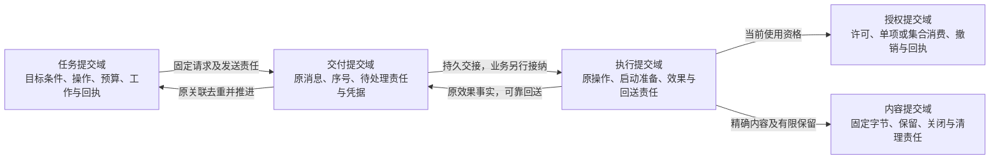

# 全景图读法与建模视图

[整体设计](README.md) · [组件全景源图](diagrams/system-panorama.drawio) · [导出图](diagrams/system-panorama.drawio.svg) · [本轮边界修订](maintenance/boundary-review-2026-09-25.md)

全景图用于定位逻辑职责和阅读入口。它是当前设计的投影，模块分组、组件数量及连线可以随职责审查修订；用户目标、已确认权限与成功语义由所属契约约束。一个方框不自动对应 Actor、独立进程、数据库或消息队列。

## 1. 三种视图分别回答什么

| 视图 | 回答的问题 | 不能据此推导 |
| --- | --- | --- |
| [组件全景](diagrams/system-panorama.drawio.svg) | 哪项职责由谁承担，主链怎样协作，详细规则在哪里？ | 完整调用清单、部署数量或原子性 |
| 本页的权威与提交视图 | 谁保存并裁决事实，哪些变化必须一起提交？ | 不同权威同时更新或即时全局撤销 |
| 各模块时序与状态图 | 哪个对象怎样变化，确认丢失后谁继续？ | 某一条正常路径覆盖全部故障交错 |

全景实线表示组件间关键调用及返回，虚线表示支撑或管理交接；均不表示网络边界。记忆／目录的证据读取由上下文组装器发起；核心仍在准入及派发准备时复核准确绑定，不能把组装时的候选当成当前启动许可。全景中的派发箭头省略工作者进入核心的短事务，完整顺序以[一轮推进](task-kernel/decision-and-work.md#round)为准。

圆柱只突出主链中直接阅读的存储职责。授权、通信、大脑调用、协作、管理及评测也有持久账本，不能从未画圆柱推断它们无状态。授权和通信是跨领域依赖，图只选一条交互示例，其他处理端仍各自落实当前门禁。

## 2. 关键角色的归属

| 角色 | 所属实现与裁决责任 | 契约 |
| --- | --- | --- |
| 受信任务策略／验证器 | 由宿主安装和绑定；策略构造目标条件，验证器判断声明范围内的证据，任务核心裁决准入及完成 | [策略与验收接口](task-kernel/storage-and-interfaces.md#task-policy) |
| 内容提供方 | 耐久保存字节，裁决本提供端的保留、读取出口与关闭 | [内容交接](content-and-provenance.md) |
| 来源权威 | 记忆服务、观察驱动等既有事实提供方裁决精确版本、完整来源与当前限制；来源适配器只连接这些权威 | [来源分工](content-and-provenance.md#remote) |
| 受管持有者 | 任务、模型、记忆、UI、消息和评测等各自保存副本登记、禁止使用与分项清理责任 | [治理合同](content-and-provenance.md#holders) |
| 受信维护入口 | 批准精确候选和有限批次；改进管理器落实已批准范围，扩展管理器核对激活效果 | [评测与批准分工](observation-and-improvement/README.md) |
| 隔离评测环境 | 提供候选不能篡改的取证通道；评分不授予发布权限，也不改写生产任务终态 | [评测设计](observation-and-improvement/evaluation.md) |

这些角色不要求新增全局服务。是否合并部署，取决于实际故障隔离、信任、替换和容量需求；角色的成功含义仍须分别保存。

## 3. 权威与原子提交

下图只展开一次行动的主要提交域。每个框表示一个本地原子提交边界，框内列出其管理的事实种类；同次状态迁移涉及的事实与后续责任共同提交，整个生命周期包含多次提交。箭头表示提交后交接或复核；多个框可以使用同一数据库产品，图不规定进程位置。

| 权威 | 必须共同保存的关键事实 | 对外确认的边界 |
| --- | --- | --- |
| 任务 | 业务决定、用户内操作唯一性、预算及后续 Work | 接纳或完成按固定条件裁决，不代表消息已到达用户 |
| 执行 | 原操作、可能启动、效果／未知与后续核对 | 效果来自实际证据，不由任务终态反推 |
| 大脑调用适配器 | 原 work／attempt、使用集合、发送准备、输出／用量与回送 | 提案有效性、物理终结、账务结清分别判断 |
| 授权 | 许可消费、撤销、回执；同权威集合的全部成员 | 已消费与当前可启动分别判断，无法回滚外部效果 |
| 记忆 | 原命令、记录修订、变化序号、索引及清理工作 | 修改成功不表示所有派生索引／副本已完成更新 |
| UI | 原输入决定、父子关联、转交责任及呈现修订 | UI 接纳不等于核心已消费，用户显示另行判断 |
| 协作 | 远端配置接纳、原委派与子提交／外部任务映射 | 内部子结果由同一核心直接观察，外部事实由 Peer 提供 |
| 通信 | 消息及待处理责任、流位置、接管与目标回执 | 目标 ACK 不代表业务提交；查询成功不推进旧流 ACK |
| 管理及评测 | 原管理命令／计划、固定依据及后续责任 | 各自提交，不承诺整批发布或评分与激活全局原子 |

同权威内部首先检查是否可以共同提交；跨权威交接则明确交接前后谁继续。模块独立替换不要求每个内部函数都建立新的耐久队列。同库优化可以减少物理往返，但不得删除已对调用方确认的责任或混淆成功含义。

## 4. 修订边界的检查顺序

先从目标及最有挑战性的异常确定事实和裁决者，再确定原子提交及失联后的继续者；随后比较模块合并、内部接口和跨端交接的成本，最后更新全景图。每一处拆分都须回答：独立故障、信任或替换要求是什么，额外交接换来了什么，取消该拆分后复杂性会落到哪里。

固定写权威、来源完整性、未知效果核对和用户控制继续约束所有替代实现。TLC／Lean 的原冻结模型可以检查相应抽象规则，不能据旧结果宣称本轮新增接口、默认调度或实际部署已经验证；本轮检查范围见[修订记录](maintenance/boundary-review-2026-09-25.md#validation)。
