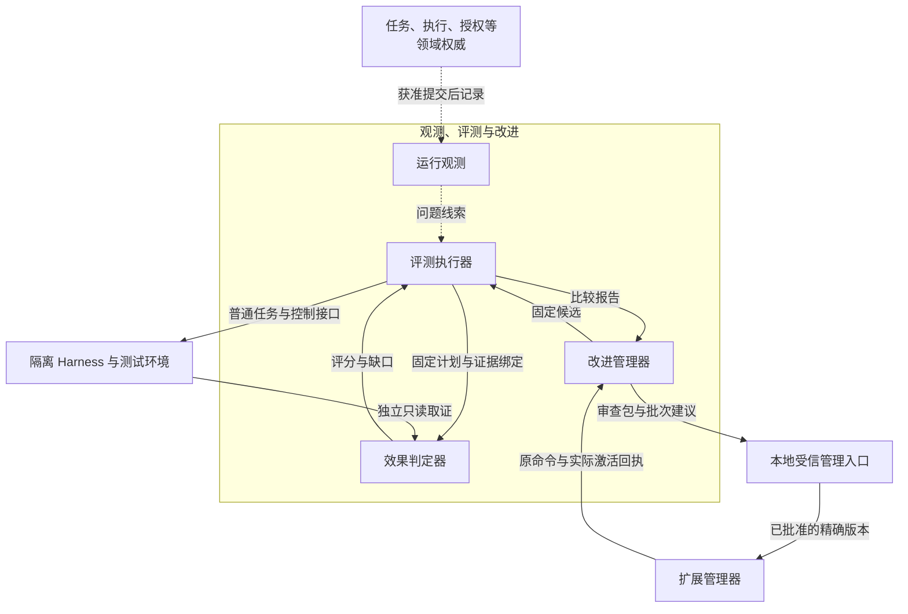
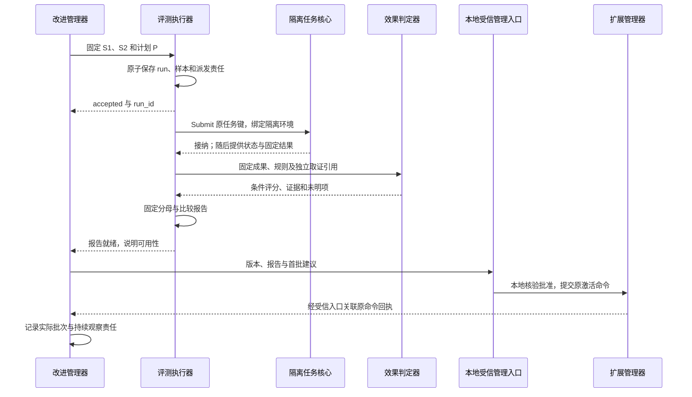

# 观测、评测与改进详细设计

本模块把运行线索转成可复现的测试，把测试结果转成有依据的改进候选，再跟踪获准版本的启用和退化。运行观测负责关联与定位，评测执行器负责冻结计划、隔离运行和比较，效果判定器负责独立取证与评分，改进管理器负责候选、发布依据和推广决策。任务完成仍由任务核心裁决，版本激活仍由扩展管理器落实。

方案依据[项目目标](../../harness-project-goals.md)、[系统全景图](../diagrams/system-panorama.drawio)及现行邻接契约。对应全景图 `improvement` 分组中的 `observation`、`evaluation`、`evaluator`、`evolution` 四个节点；图中的执行记录、运行线索、评分／结果、候选／比较结论、获准版本五条交互保持不变。以下细化逻辑职责，不要求四个独立服务。

## 1. 范围与阅读顺序

首期采用本地受信评测宿主、固定用户写权威和有限测试计划。**冻结计划**指执行前固定的样本、版本、环境、判据及预算；**独立取证**指由候选无法修改的取证通道取得目标状态，不能仅采用候选自述；**比较结论**只回答该计划下是否满足门槛及是否有改善依据，不授予行动或发布权限。

| 范围 | 本轮设计及入口行为 |
| --- | --- |
| 默认闭环 | 获准诊断线索或显式测试集 → 冻结基线／候选 → 隔离任务 → 独立评分 → 比较报告 → 本地受信批准与人工分批启用 → 监测、停推和回退跟踪 |
| 必需依赖 | 受信身份、用途检查、耐久评测记录、可隔离运行的内核及取证环境。任何一项缺席，相关计划不接纳；诊断导出故障只降低可见性，不阻断原业务 |
| 有条件开放 | 使用真实用户数据、外部模型判分或真实设备，分别要求当前处理／保存／披露权限及隔离、费用和效果核对能力；没有删除传播保证时不导入需持续撤回的外部数据 |
| 当前缺口 | 自动批准交接沿扩展模块 ER-P1 保持关闭；跨端领域载荷未补齐时只支持本地适配。没有完整生产采样依据时不能判断线上效果改善；详见[依赖与提案](validation.md#dependencies) |
| 实际交付 | 详细设计、逻辑契约、示例与验收用例；未交付可运行采集器、评测宿主、判定器或发布控制器，不宣称 L2–L4、90%／95% 或服务规模已达标 |

连续阅读本页 → [观测与数据使用](observation.md) → [隔离评测与效果判定](evaluation.md) → [改进与受控启用](improvement.md)。字段与交接统一查[契约与记录](contracts.md)，依赖、故障用例、待决提案和交付检查查[验证设计](validation.md)。本地接口尚非 SDK 类型或 WSS 标准消息。

本模块直接承担 C8、C9；通过评测分别验证 C1 的规划、C2 的个性化、C3 的证据、C4 的 API／GUI 效果、C5 的恢复、C6 的替换及 C7 的用户控制。A1 体现在事实归属，A2 体现在判定器和被测实现可替换，A3 体现在端侧数据可本地评测、只导出获准结果，A4 体现在固定契约与一致性用例。V1、V2 必须各自获得整体结果，不能用通用总分替代。

## 2. 分工与事实归属

下图从评测宿主看数据与控制交接；实线是受控输入或调用，虚线是提交后诊断线索。图中的人工管理入口对应现行本地发布路径，自动交接仍待决。

| 事实或裁决 | 权威 | 本模块保存的内容 |
| --- | --- | --- |
| 任务终态、执行效果、预算与授权使用 | 任务内核、执行系统、身份与授权 | 获准引用、来源修订和读取切点；不改写原状态 |
| 追踪片段、采样与缺失情况 | 运行观测 | 有限诊断副本及覆盖说明；不充当业务恢复账本 |
| 测试计划、环境绑定、样本派发及收尾责任 | 评测执行器 | 不可变计划与持久工作；不能靠日志恢复已提交测试任务 |
| 逐条件效果评分 | 效果判定器 | 固定规则、成果版本、独立证据、判定及限制；不直接写任务 completed |
| 比较报告、候选和推广决定 | 评测执行器／改进管理器 | 证据链、报告适用性、候选状态和每批跟踪责任 |
| 发布批准、安装／激活与回退效果 | 受信维护入口、扩展管理器及领域宿主 | 已验证批准关联与管理回执；本地“已提交”不能替代目标实际生效 |

## 3. 关键选择

| 推荐 | 原因与主要代价 | 替代方案及改变条件 |
| --- | --- | --- |
| 诊断允许采样，评测证据单独耐久保存 | 日志丢失不应破坏业务；完整验收不能依赖采样恰好留下的成功案例。增加一份有限证据清单 | 全量复制日志仍不能提供目标真值且增加隐私成本；只有获准专项诊断才临时提高采样 |
| 复用隔离 Harness 的普通任务链，评测宿主只编排测试 | 保留真实准入、权限、重试与恢复行为；测试环境搭建成本较高 | 单独调用模型／驱动可作组件测试，但不能据此宣称端到端 C1–C9 或 V1／V2 达标 |
| 固定规则优先，语义模型判分只覆盖可声明的质量维度 | 路径、权限、设备状态等可直接核对；语义评分仍有方法误差，需要标注集校准和复核 | 全人工可用于小型基线；扩大样本后可替换判定器，但须锁定版本并重跑双方 |
| 固定基线与候选成对运行，契约、效果、耗时和成本分别报告 | 减少环境差异并暴露退化；需要两份隔离环境和额外预算 | 生产对照要有稳定分组与完整分母，首期不据采样日志自动发布 |
| 改进只生成候选，发布依据及分批生效另行核验 | 评测通过不扩大权限，生成器不能改阈值。首期需要本地受信操作 | 自动交接须先采用[OI-P1](validation.md#proposals)，不以本模块新增字段单方面启用 |

## 4. 贯穿场景：改进手机保存笔记的 Skill

在多个有状态模拟设备上，旧 Skill S1 偶尔把“点击保存返回成功”当作完成线索。维护者提出 S2：保存后重新观察并确认笔记内容及目标位置。改进管理器固定两个版本和来源，评测执行器以同一测试集分别启动隔离任务；独立判定器读取模拟器的实际笔记状态，核对目标、内容和动作后的观察。受信维护者根据比较报告批准 S2 的首批范围，扩展管理器按原有管理流程激活；后续批次只有监测证据和当前批准均适用才继续。

若保存已经发生但任务响应丢失，评测执行器沿原任务查询，执行系统沿原操作核对。即使独立判定器发现笔记存在，也不能据此丢弃任务的未知责任或重试保存。样本在测量截止仍缺必要依据时计未成功，报告保留缺口；模拟设备在旧任务封闭前不分给下一样本。若激活响应丢失，管理入口查询原激活命令，改进管理器保持该批结果待核对，不开始下一批。恢复机制分别见[样本恢复](evaluation.md#recovery)和[启用恢复](improvement.md#rollout)。

## 5. 核心保证

| 编号 | 必须成立的保证 | 验证入口 |
| --- | --- | --- |
| O1 | 诊断缺失不丢业务责任；不从日志、ACK 或候选自述推断效果 | [OI-01～03](validation.md#tests) |
| O2 | 计划、分母、版本及判定方法先固定，运行后不能选择性删失败或放宽门槛 | [OI-04～08](validation.md#tests) |
| O3 | 被测候选不能改评分规则或读保留答案；未知效果不触发重复副作用 | [OI-09～12](validation.md#tests) |
| O4 | 数据每次再用途均获准，撤回后停止复用并可核对受管副本清理 | [OI-13～16](validation.md#tests) |
| O5 | 报告、批准、目标生效各有独立依据；回退保留当前账本和撤权 | [OI-17～21](validation.md#tests) |
| O6 | 消耗有界、恢复可继续，报告同时披露缺失证据与未知费用 | [OI-22～24](validation.md#tests) |
