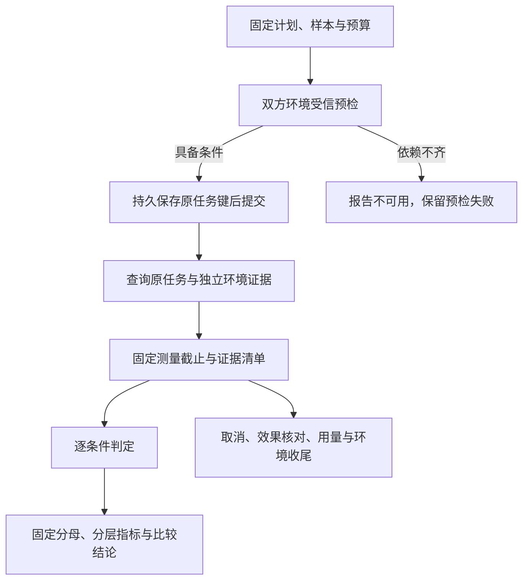
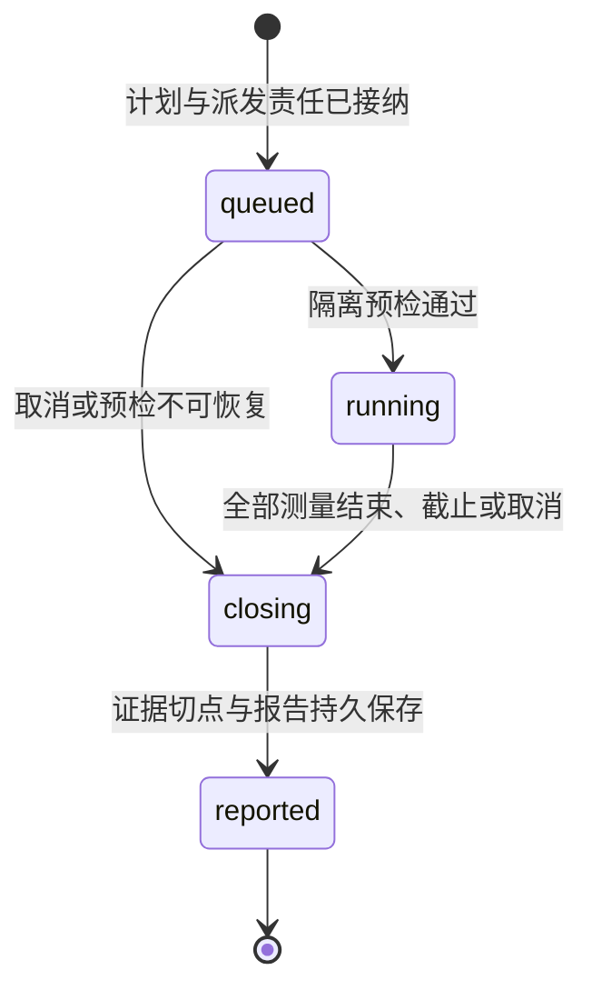

# 隔离评测与效果判定

[总览](README.md) · [观测](observation.md) · [改进](improvement.md) · [契约](contracts.md) · [验证](validation.md)

## 1. 冻结计划与隔离环境

评测执行器接收显式计划或改进管理器提交的候选。开发集用于调试，验证集用于选择候选，保留集用于固定候选后的确认；样本来源及分组随数据集版本固定。候选开发主体不得读取保留答案及逐例反馈，评测宿主保存所有候选尝试，不能只登记最好一次。首期每次发布申请只允许一个预先固定候选进入该轮保留集；看过反馈再修改候选须使用新的未暴露保留集，否则报告标记探索性，不能当作独立改善证明。

计划完整字段见[EvaluationPlan](contracts.md#plan)。执行前固定基线与候选的制品／配置、模型与参数、能力与驱动、隔离环境、数据集、判分规则、抽样和停止规则、重试与费用上限。维护者选择主要改善指标、最小实用改善量及允许退化界限；无有效门槛可运行诊断，但不能产生用于发布的通过结论。候选不能修改计划、评测代码或阈值。

本模块实现测试环境适配器，提供固定环境创建、只读取证、状态查询和封闭入口，逻辑契约见[Environment](contracts.md#environment)。它通过既有内核 Submit／ReadTask／ReadResult／ReadOperation／ApplyInput／Cancel 使用被测系统，实例准备与隔离遵守[扩展运行器要求](../extensions-and-runtime/installation-and-isolation.md)。适配器尚无实现时计划拒绝，不能把“启动了一个进程”作为隔离证明。

| 边界 | 必须固定或隔离的对象 |
| --- | --- |
| 基线与候选之间 | 同一初始数据、环境镜像、目标和预算；独立数据库、缓存、记忆、设备状态和凭据，禁止共享可写副本 |
| 样本之间 | 每例独立环境身份和资源命名空间；同一初始快照可复制，不能复用仍有在途动作的实例 |
| 候选与判定器之间 | 参考答案、真值读取、评分代码和报告写入口只属于受信判定侧；候选只能访问本例任务所需资源 |
| 测试与生产之间 | 独立身份／账本／队列／资源配额，不持有生产凭据；真实外部操作须使用明确授权的测试租户与资源，否则不启用该 profile |

每一配对在双方任何任务启动前完成受信环境预检。预检失败不产生有效比较报告，修复后按计划重新创建完整配对；启动后发生的依赖失败、撤权、超时和未知均保留原样本位置，不删分母。样本顺序和基线／候选先后由冻结种子安排，减少时间和热身差异；热身集、缓存条件单列，不挪用正式样本预热。

## 2. 执行与取证

评测执行器先耐久保存 run、全部样本位置、环境键、任务与提交操作键及派发工作，再向内核提交。核心接纳只说明开始承担任务责任；样本结果从 ReadTask、ReadResult 和独立环境取得。测试直接调用驱动的情况必须标为组件测试，不能与整条 Harness 任务结果混报。

澄清、取消及用户接管用例在计划中固定受信输入脚本的触发条件、允许值和期限。执行器只对匹配的有效 input_request_id 保存原输入操作键后调用 ApplyInput；无匹配脚本则等待至截止，不能临场向候选补答案。授权批准仍经独立受信测试入口，普通 task.input 不充当许可签发。

取证固定成果摘要、环境代次、对象、动作及观察关联和观察时间；评分只接受计划指定的证据生产者。V2 的模拟器真值通过判定侧只读接口提供，候选不能写真值存储。V1 的引用内容从实际取得的获准字节核对，模型声称“已访问”不是来源证据。取证本身有副作用或费用时，也必须沿普通受控操作执行。

效果判定器与[任务完成核验](../task-kernel/lifecycle.md#completion)可以复用已安装的规则实现，但保存不同结果：核心裁决该任务能否 completed，本模块裁决测试计划是否达标。评测报告可以指出任务误判完成，不能回写任务终态。若生产任务需要调用本判定能力，应经已安装能力和正常 Operation 集成；本方案不新增核心同步回调。

判分按以下顺序进行，各项结果分别保留：先检查来源、成果／环境绑定与规则适用性；不成立则 unknown。随后对契约要求和目标效果逐条件判断，明确反证记 fail、证据不足记 unknown、全部所需证据成立才记 pass。对于一组必需条件，任一 fail 则组结果 fail；无 fail 但存在 unknown 则 unknown；全部 pass 才为 pass。契约组和效果组独立输出，效果通过不能覆盖越权或重复副作用。

语义判定采用冻结评分量表及版本；模型判定器固定模型、输入模板、采样参数、调用上限与分歧处置规则，屏蔽候选身份和发布状态。其输入中的网页、答案和工具文本按待评内容处理，不能覆盖评分规则。参考标注集中若出现超过预设容限的分歧，或裁判版本无法锁定，关闭该维度的发布资格。需要人工复核时使用隐藏候选身份的审查界面，受信评审者提交带规则与证据的评分新修订；不能直接编辑总分或把 unknown 手工改为通过。

## 3. 指标、分母与比较

API 计数和调用样本口径继承[能力与执行](../capability-and-execution/validation.md)。以下补齐报告计算，不修改项目目标。

| 指标 | 计算与必报边界 |
| --- | --- |
| API 覆盖 | 固定清单中独立业务操作数；提供者与业务操作为去重身份，声明版本、驱动和环境另列。别名、包装和版本复制不累加。分别报告已登记数、各类用例通过数及全部适用用例通过的操作数；只有最后一项用于判断 1000 项以上目标 |
| 首次调用正确率 | 固定正常调用集内，首个业务尝试的能力、参数、目标对象、权限和实际结果均满足才计 1；成功数除以冻结样本数。坏参数／越权专集另报正确拒绝率，不加入正常调用分母 |
| 有限重试任务成功率 | 固定任务集内，全部必需目标条件和任务约束满足才计 1；除以冻结任务数。首次尝试加最多两次新业务尝试作为参考 profile，同时固定全任务期限及费用上限，不是已发布运行默认值 |
| unknown、超时、取消与预算耗尽 | 对已证明成功率计 0，同时保留真实类别及原因，不伪装成已证明目标失败。运行开始后不可删样本；缺失使报告不适用时仍展示冻结分母和已知计数 |
| 耗时 | 每例从计划规定的任务提交时点到目标确认／截止；报告完成率、成功样本延迟和全部样本的截止／未完成数。不能只报快成功的 p95；同一时钟域内测量 |
| 成本 | 模型、工具、判分、重试、原操作核对、计算和存储分别累计。已知用量、价格快照、估算费用和未知预留分别报告；未知费用不记零，必要成本上限无法证明满足时不通过 |
| 契约符合性 | 必需正例、负例及故障保证分别报 pass／fail／unknown；安全、隔离、权限和恢复约束要求计划内零违例且无必需 unknown。有限测试零违例不证明生产永久无风险 |

模型结构修复、传输重投和原键恢复分别计数；它们不增加“新业务尝试”额度，也不能隐藏实际已重复执行的动作。首次成功仍须说明期间发生的恢复与耗时。未知副作用先查原操作，禁止为了通过率新建替身调用。

尝试次数按计划预先列明的同一业务目标／操作重试组累计，正常多步骤任务中的不同操作不相互算重试；同时固定全任务工具调用和时间／费用上限，避免通过拆组获得无限尝试。已确认的前序效果保留，不为新尝试重做整个任务。95% 始终按完整任务计分。

默认对独立二元样本报告成功数、n、比例及双侧 95% Wilson 区间；区间用于呈现不确定性，不把 90%／95% 目标默改为置信下界门槛。固定穷举集的比例仅描述该集合；有明确抽样框架才讨论总体推断。同一任务的重试不是独立样本，重复种子或相关任务须按任务组报告，不能人为扩大 n。[NIST 比例区间](https://www.itl.nist.gov/div898/handbook/prc/section2/prc241.htm)

比较使用相同样本的配对结果，保留“双成功、仅候选成功、仅基线成功、双未成功”四格；净改善为 `(仅候选成功数 − 仅基线成功数) / n`。同时列出每一关键任务类别的退化、费用及耗时变化。首期发布依据要求受控保留集上的主要指标达到计划固定的最小改善、全部守护指标在界内、必需契约全通过；普通版本适配可以只声称契约符合，不能称为效果改善。计划可以附加统计门槛，但必须先固定方法和独立性条件；精确 McNemar 可用于独立二元配对的差异检验，不能替代实用改善量或纠正重复挑选候选。[NIST McNemar 方法](https://itl.nist.gov/div898/software/dataplot/refman1/auxillar/mcnemar.htm)

用于发布的比较门禁按顺序裁决：计划要求的评分覆盖、方法依据、来源许可或环境可比性缺失为 `inconclusive`；这些依据完整但任一必需契约或效果／退化门槛不满足为 `fail`；其余为 `pass`。按完整规则得到的单例 unknown 留分母计 0，不等于报告本身缺失；必需契约的 unknown 则不满足契约门槛。所有独立违规仍记录，不因首个缺口而隐藏已有反证，不能临时降低门槛。

## 4. 专项测试集

| 专项 | 固定输入与独立判据 | 必须分开报告的结果 |
| --- | --- | --- |
| C1／C3、V1 | 目标问题、查询日期、实际取得内容及时间、参考事实／争议、引用支撑量表；取证验证引用确实对应获取字节 | 正确性、引用支撑、时效、检索失败、证据不足和冲突处理分别计分。固定内容回放验证策略可重复性；实时联网验证当前获取与时效，二者不互相替代 |
| C2 个性化 | 同一任务分别具备／不具备获准偏好，来源与适用条件固定 | 是否实际影响合适行为、是否错误扩用、纠正／删除后是否停止影响；存储或召回通过不能代替效果 |
| C4 API | 每项有效调用、坏参数、权限不足及声明的查询／幂等／取消故障用例 | 正常调用效果、正确拒绝和恢复保证；覆盖数量与 90%／95% 各自报告 |
| C4、V2 | 多个有状态模拟设备的版本／初始快照、目标应用状态、完整动作轨迹和判定侧真值 | 观察→动作→再观察→核验，点击／滑动／输入／返回、中断及接管；过期观察、错误设备、重复写入和接管后自动动作单独门禁。模拟通过只证明该模拟范围 |
| C5–C7、A1–A4 | 采用各模块现行一致性与故障矩阵；固定实现、部署及替换组合 | 正常、异常、离线和互操作分开，不把连接重建等同于任务恢复；缺前置领域契约的组合标未支持 |
| C9 | 同一保留集的基线／候选、发布批准及实际启用范围、回退声明及验证依据、回退目标与新版写入后的当前账本 | 效果改善、分批启用、退化发现、停用与旧版本恢复分别验收；只完成停用不计旧版恢复通过，只完成离线评测不宣称 C9 的 L4 |

V1 实时测试固定查询窗口与可接受的新鲜度；外部内容在两次运行之间变化时保留双方内容和偏差，标明比较限制。V2 每例结束后由环境适配器核对原任务封闭、在途动作与持有资格，不能简单重置屏幕继续用同一设备。

## 5. 状态、取消与恢复

图只建模一次评测 run 的进度；样本结果、报告可用性和收尾责任各自保存，不合并成“成功”。

`reported` 表示报告可查询，报告可能不可用，也可能保留 `settlement_pending`。报告使用固定测量截止时可获准取得的证据；之后迟到事实继续结算原责任。截止后取得、但有可信时间与版本能证明截止内效果的证据，可以生成明确关联的新报告修订；截止后才产生的效果不能追溯算截止内成功。旧报告及基于它的批准记录保持不变，新修订须重新通过发布门禁。

| 故障或竞争 | 保存的依据与继续者 |
| --- | --- |
| Submit 返回丢失或接纳与崩溃并发 | 执行器查原任务／提交操作；查询不存在不证明迟到提交不会到达。在原截止内可按内核幂等语义重投同键，不能换 task_id；到期封闭派发，继续核对 |
| 测量截止或用户取消 | 执行器原子关闭新样本派发并保存各原任务的 Cancel 工作。未提交任务标未运行并保留分母；已提交任务等原取消／效果核对。取消接纳不等于设备停止 |
| 保存动作成功，响应丢失 | 原执行系统负责查询与用量；独立判定记录真值，但不释放其未知责任。任务未封闭的环境进入 quarantine，不能给下一例 |
| 判定器超时或重复返回 | 同评分键读取已存结果或核对原成本调用；只有固定输入的无副作用本地函数可重算。原模型调用未知不再发送；新增判分尝试须有计划允许的独立身份、许可和预算。相同评分键不同结果不覆盖原记录，隔离冲突并使该报告不可用 |
| 报告提交后响应丢失 | 按 run／报告键读取已提交报告；固定样本、评分和摘要唯一约束防重复计数 |
| worker 崩溃／旧 worker 返回 | 恢复扫描原持久工作，领取代次限制提交资格。外部动作仍由原任务键去重；租约到期本身不证明原设备或进程已停 |
| 授权、证据或环境失效 | 关闭受影响使用，保存 blocker；到有限截止出具不可用报告。缺失样本不从分母删除，也不借旧许可继续评分 |

主动查询达到计划限额后停止占用工作槽，保留原身份、未知费用和隔离环境的关闭责任，交受信处置入口。允许动作是查询原键、补交可验证证据、在新获准预算下继续原核对、关闭且证明隔离后销毁环境；不允许编辑任务效果或释放未确认资源。具体管理契约见[处置接口](contracts.md#interfaces)。
