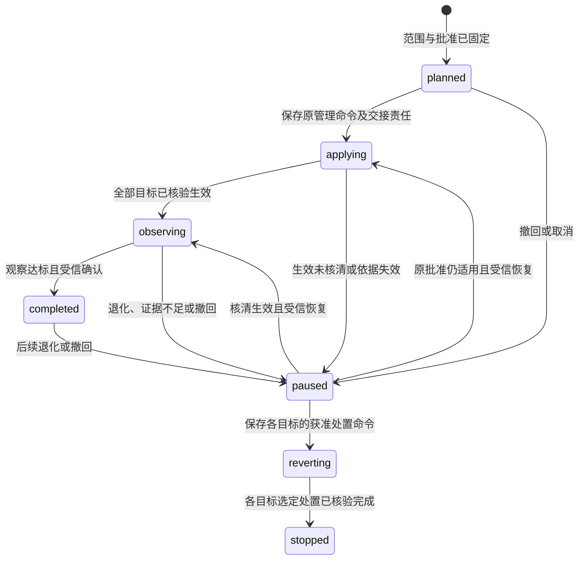

# 改进与受控启用

[总览](README.md) · [观测](observation.md) · [评测](evaluation.md) · [契约](contracts.md) · [验证](validation.md)

## 1. 候选来源与不可变产物

改进管理器接收显式问题、获准运行线索或评测报告，保存来源、适用范围和待改进假设。生成候选可以调用大脑，但必须是有固定目标、用途、预算和截止的普通任务；默认不在日志消费者内自动启动模型循环。任务结束自动提取沿 [MS-P3](../memory-system/validation.md#proposals) 待决，当前使用显式提交。

候选保存精确产物摘要、父版本、完整来源和预期收益，不直接覆盖活动版本。改变任何产物字节、依赖锁、模型配置或影响行为的权限范围都产生新候选；不能用相同名称替换已评测内容。评测者和批准者从受信配置确定，候选不得写计划、阈值、参考答案或批准记录。

| 改进对象 | 首期路径与效果声明 |
| --- | --- |
| 记忆 | 授权范围内的常规更新沿记忆服务既有修改契约生效，不为每条更新增加发布流程；声称收益时另行评测。回退是新的获准修订，不复活已删除或撤权内容 |
| Skill、执行策略、Agent 配置 | 形成固定候选，经隔离评测和受信批准后按批次启用；沿扩展的准确导出与配置绑定，不在大脑当前轮次中自行替换 |
| 插件与内核代码 | 生成可审查补丁、构建来源和精确制品；维护者审查确认后发布。评测 pass 不可代替维护者批准，运行器仍验证隔离与兼容 |

## 2. 审查与批准

审查包关联候选、固定计划／报告、契约测试、主要改善、关键退化、费用和已知缺口，并给出首批及回退建议。报告可以在同一受信宿主内查询；保存、展示、交给维护者和导出仍复核当前来源与用途，不能以“审查”默认披露用户数据。

声称支持回退的发布须在启用前固定旧版本及依赖锁、适用数据格式和窗口，并关联覆盖这些条件的验证依据。验证方法是在隔离环境中让新版写入代表性数据，再用指定旧版读取当前账本并运行支持的任务，同时核对未决记录、授权和预算仍按当前事实解释；具体要求由[扩展启用依据](../extensions-and-runtime/contracts.md#approval)统一落实。只有停用路径，或旧版无法处理新版数据的发布，应在批准中明确不保证旧版恢复及受阻后的处置方式，不得以此取得 C9 回滚验收通过。涉及不可逆迁移时还须引用所属领域的迁移及失败恢复方案，不能仅填写一个旧版本号作为回退依据。

改进管理器保存发布决策，受信管理入口负责认证批准主体并核对批准权限；模型、插件和普通评测 worker 无该写权限。本地批准记录绑定[ReleaseDecision](contracts.md#release)的全部范围，之后只追加撤回／取代修订，不能原地扩大。首期拒绝自动产生发布批准，用户安装权限和实际行动许可仍由身份模块独立裁决。

评测策略也作为受维护的版本配置管理。允许维护者在下一计划中调整判据并说明理由，必须重跑相应基线和候选；不得修改正在运行的计划或追溯放宽门槛。改进候选涉及评测执行器或判定器本身时，由已受信旧版宿主及独立标注集先验证，不能只用候选自测给自己发通过结论。

## 3. 分批启用与原命令恢复

首期通过现有[本地管理入口](../extensions-and-runtime/contracts.md#approval)录入与核验批准，调用 Extensions.Prepare／Activate／QueryCommand。改进侧只提供审查包和跟踪记录，不发送未定义的自动批准载荷。受信入口在调用前持久关联 rollout、目标、批次、原管理 command_id 和完整意图；返回通过同一受信关联录入，人工复制的任意“已成功”文字不构成回执。

调用资格按[推广原子边界](contracts.md#storage)与本地撤回串行。原管理键与资格一旦保存，即按“可能已提交”管理，崩溃于实际调用前后都查询原键；不能仅因缺发送日志把它归为尚未交接。资格未保存的步骤才可由本地撤回直接封闭。

每个批次包含精确用户／端点或部署目标、批准依据、当前替换绑定、监测计划和回退目标。首期维护者先选一个已授权的有限试用批次，观察窗口及样本要求满足后再明确选择下一批；不凭线上平均分自动扩大范围。新任务绑定新配置，已有任务／轮次继续使用其固定版本；采用扩展模块的排空与格式兼容限制。

图只表示一个批次的管理进度；各目标的实际绑定、批准有效性和监测结果分别保存。

| 交接阶段 | 可以对外确认的事实 | 未完成时谁继续 |
| --- | --- | --- |
| 消息或本地调用已送到 | 仅表示传输完成，不能展示“已启用” | 管理入口查原 command_id |
| 扩展管理命令 accepted | 管理意图及后续责任已保存 | 扩展管理器推进原步骤；入口和改进侧保留待核对 |
| 目标激活 succeeded | 精确目标、绑定和管理回执满足既有激活保证 | 改进侧核对该目标回执后记入实际批次；仍须观察效果 |
| 批次观察完成 | 适用版本、完整观察样本和门槛满足，并有受信确认 | 才可建议下一批；扩大范围重新取得批准 |

激活可能已经完成但回复丢失时，同键 QueryCommand 核对；发现同命令不同意图立即停止交接。若查询超限或目标离线，批次 paused，保留实际已生效目标与未知项；不分配新命令把旧激活再做一次。撤回批准与激活竞争时先关闭后续交接，已交给扩展的命令必须查询并按其取消／停用语义处理；本地撤回不能证明在途命令未生效。

`stopped` 仅表示本批选定的处置已经完成，逐目标的停用和旧版恢复结果仍分别查询。选择恢复旧版而实际只完成停用时，恢复责任保持受阻，不能据此进入 stopped；维护者如决定以停用结束处置，须另存受信决定和相应命令关联，保留原恢复未完成的事实。

首期无法把批准撤回与邻接模块的激活门禁做跨模块原子裁决，因此只承诺停止本模块新交接，并由受信维护入口逐目标核对与处置。需要自动及时阻断／停用时必须先采用 [OI-P1](validation.md#proposals)；不能把待决机制写成已经具备的安全屏障。

恢复暂停批次时先读取暂停前阶段和每目标当前绑定；仍在接纳／生效核对的回到 applying，全部生效且观察依据仍有效的回到 observing。两条路径互斥；任何批准失效或原目标被替换都不能直接恢复，须重新审查为新计划，旧批次继续保留处置责任。

## 4. 持续监测、停推与回退

批次计划在启用前固定观察窗口、最少样本数、参与任务类型、主要收益、硬性停推条件、成本与性能退化阈值；无足够数据时延长到计划上限，达到上限仍不足则 paused，不默认通过。观测记录必须绑定实际活动版本及目标；遥测缺失、用户群变化或任务分布不可比时只形成线索，不自动宣称因果收益。需要严格线上对照时另建具有完整分母和稳定分组的获准计划，当前首期不依赖它发布。

completed 只结束该批次的初始推广观察，活动版本继续按批准中的监测策略分窗检查，保留当前绑定及回退责任；后来发现退化或撤回仍可进入 paused。每个窗口和单次核对有界，不能因初始观察通过而停止活动版本的治理。

硬性违例、报告失效、批准撤回或达到退化阈值，分别独立检查，任一成立即原子保存停推决定、证据及受信通知责任。改进管理器立即关闭自己尚未交接的下一批，维护者通过本地入口选择暂停、原命令核对、获准停用或回退；通知未确认持续显示待处理，并按有限重投策略继续。首期没有自动撤销已活动代码的保证，实际停用／回退须以扩展及领域门禁回执确认。

回退作为新管理命令绑定原候选、实际目标和旧版本，先核对旧版本仍获准、依赖与当前持久格式兼容，再沿排空切换。原操作、未知效果、预算、owner、当前许可与撤权不回退。若旧代码读不了当前格式或仍有未知动作，保持受限／停用并报告阻塞，不能恢复旧数据库快照制造“回退完成”。离线目标单列未确认；其回来后先核对控制与授权再开放。

各目标的处置按下表报告；停用与旧版恢复分别保存，恢复受阻时也可以已经完成安全停用。

| 结果 | 确认依据与边界 |
| --- | --- |
| 已停用 | 扩展及领域门禁已实际应用；只确认所请求的停用，不表示旧版已恢复或外部在途效果已消失 |
| 旧版已恢复 | 指定获准旧版的激活回执、实际绑定和运行就绪依据均成立；旧版恢复目标指标的结论仍由后续观察给出 |
| 恢复受阻／待核对 | 保存不兼容、原责任未核清、依据失效或目标失联等具体缺口；已取得的停用回执不能覆盖该缺口 |

回退成功对应“旧版已恢复”。补偿外部效果属于另一项获准任务；回退后仍按计划观察旧版是否恢复目标指标，未测不得宣称退化已消除。发现评测本身有误时，撤回相关报告的发布适用性，沿依赖链暂停候选及未开始批次，保留已经发生的批准和实际生效历史。

## 5. 有限执行与处置

候选数量、每候选试验次数、模型生成预算、评测并发和每轮推广批次均受固定上限。达到上限保留结果并结束该轮，不无限“生成—评分”直到碰巧通过；新一轮须有新的显式目标与预算，并继续引用已暴露测试集历史。

受信处置入口允许查询原命令、补交可验证来源、以新报告／批准修订重新审查、请求停用或获准回退。它不允许删除失败候选、覆盖原评分、扩大用户许可或手工标记远端已停止。处置动作、主体、理由及原事实关联保存到本模块账本，敏感正文按[数据规则](observation.md#data)控制。
