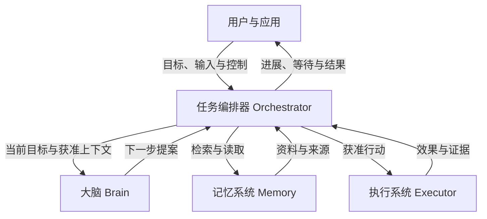
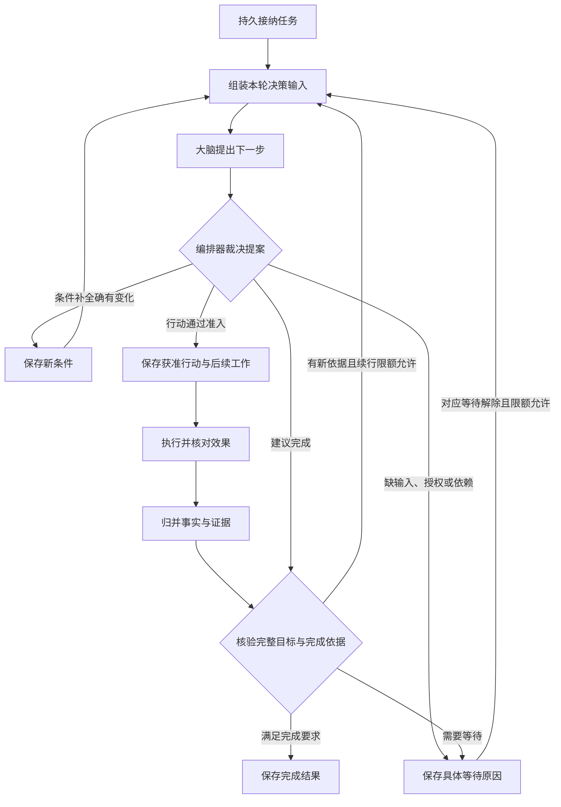
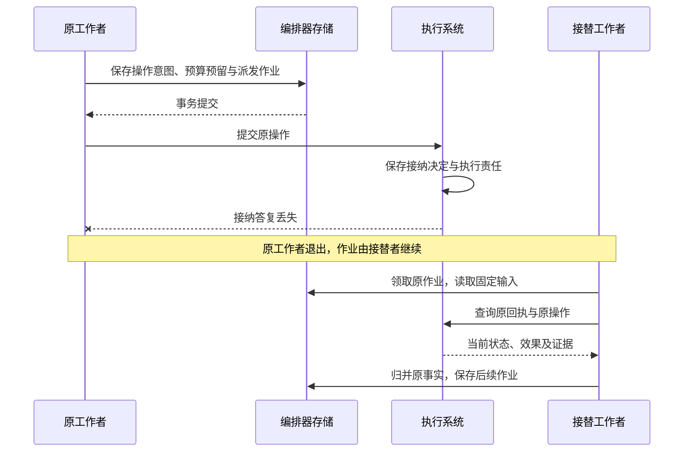
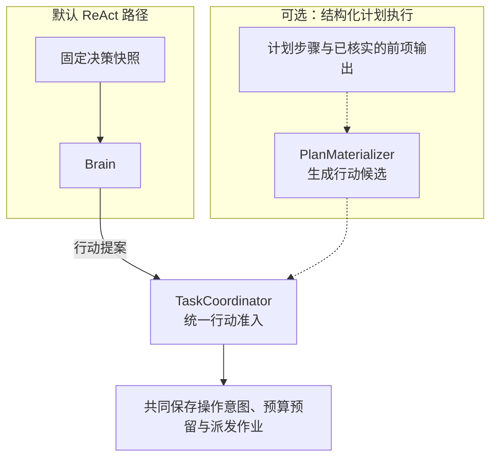

# 任务编排器（Orchestrator）技术架构设计

任务编排器（Orchestrator）负责将用户目标组织成可持续推进的任务。它保存目标与约束，依据当前事实请求大脑提出下一步，检查行动的授权、预算和执行前提，再将获准行动交给执行系统。每次取得新事实后，编排器决定继续行动、等待条件补齐，或依据证据提交完成结果。

每个任务由唯一且固定的编排器负责。同一编排器可以由多个共享持久任务记录的服务实例承载；工作进程重启或替换后，接替者读取原记录继续处理，任务归属保持不变。同一用户的不同任务可以归属不同编排器，各项任务的状态变更和完成裁决由各自的编排器负责。

## 协作边界

大脑提出行动建议，记忆系统提供决策材料，执行系统核对实际效果；编排器结合这些信息更新任务进展，并判断是否满足完成要求。图中节点表示逻辑职责，组件可以同进程装配，也可以分别部署。

## 从目标到任务条件

用户目标说明要完成什么，**任务条件（Requirement）**将它展开为可以逐项检查的要求。编排器保留原始目标与显式约束，并记录条件与原要求的对应关系。其中，**效果条件**检查目标系统中实际发生的变化，**质量条件**检查成果的准确性、覆盖范围等内容要求。

以“比较两个软件版本的差异，附上来源，并将报告保存到指定目录”为例：

| 任务条件 | 类型 | 完成所需的依据 |
| --- | --- | --- |
| 比较准确且覆盖指定范围 | 质量 | 实际取得的资料，以及针对准确报告版本的质量评估 |
| 来源能够支撑报告结论 | 质量 | 报告中的结论与来源正文的对应关系 |
| 报告已保存到指定目录 | 效果 | 准确路径、写入结果，以及与报告版本一致的读回证据 |

大脑可以建议补充任务条件，编排器负责核对这些建议与原始要求的对应关系，并保留用户的显式约束。每项必要条件分别核验，尚缺的依据成为后续行动或等待的具体原因。

## 任务推进闭环

编排器将当前目标、任务条件、已有事实和获准资料组成一轮决策的输入。大脑返回提案后，编排器检查任务状态、能力、授权、预算及执行前提，将符合要求的行动建议确定为可派发的工作，这个过程称为**行动准入**。

同一提案同时包含有效的条件变更和行动建议时，编排器先保存新条件，再基于新目标重新决策；条件未变则继续处理本轮建议。每次启动新决策或行动前，都重新检查当前控制、期限、授权与预算。

长任务的[固定决策输入](task-lifecycle.md#fixed-decision-input)从当前权威目标、控制和原效果机械重建；摘要不能取代这些事实。最终供应商请求还要核验实际字段、来源、接收方与大小，复用原 Snapshot／Decision／ModelCall 保存依据。

任务的[进展与停止依据](task-lifecycle.md#bounded-progress)按原可信反馈持久保存；重复通知、重启或会话切换不清累计次数。缺少新的有效输入时保存具体等待，达到固定限额后按策略停止自主续行，原效果和费用仍继续核对。

## 任务决定与后续工作共同保存

一项经准入的有界行动称为**操作（Operation）**，具有固定标识与输入。编排器保存操作意图，执行系统保存接纳、执行及效果事实。**持久作业（Job）**记录后台仍需处理的工作，例如派发操作、查询效果或结算费用，供工作者领取并推进。

预算预留是为本次行动先占用的额度。

| 提交时点 | 同一事务中保存的记录 | 提交后的工作 |
| --- | --- | --- |
| 接纳任务 | 任务目标与预算、接纳回执、首项作业 | 组装决策输入，调用大脑 |
| 准入行动 | 固定操作意图、预算预留、派发作业 | 向执行系统提交原操作 |
| 归并执行事实 | 来源事实、任务进展、费用变化、后续作业 | 继续推进或核验完成依据 |

这些记录在编排器的本地事务中共同提交，模型调用和外部执行在事务之外进行。工作者重启后沿已保存的作业继续处理，查询和恢复始终关联原操作。

## 答复丢失后的恢复

假设执行系统已接纳报告写入操作，但接纳答复丢失，随后工作者退出。接替者领取原作业，读取固定输入，并查询原回执与操作事实，继续处理这项已保存的责任。

查询得到的事实决定后续处理：效果已核实时更新任务进展；仍未知时保留核对责任，并阻止与原效果冲突的新行动。自动核对有次数与期限上限，耗尽后保留原记录和待处理原因；未结费用继续占用相应预留。

## 用户控制与任务终结

任务状态表示任务是否已经结束：`active` 表示尚未终结，`succeeded`、`failed` 和 `cancelled` 分别记录成功、失败和取消。暂停控制是否允许启动新的决策、评估与行动，等待原因记录尚缺的条件，两者独立于任务状态保存。

| 用户控制 | 新工作如何处理 | 原操作如何收尾 |
| --- | --- | --- |
| 暂停 | 停止启动新的决策、评估与行动 | 继续核对效果和费用；既有证据充分时仍可提交成功 |
| 恢复 | 解除本任务的暂停，重新检查推进前提 | 保留尚未解决的等待与核对责任 |
| 取消 | 保存 `cancelled`，关闭新的目标工作 | 继续核对已派发操作；迟到成功不改变取消状态 |
| 修订目标 | 保存新目标，使尚未派发的旧目标工作失效，并关闭旧委派的目标推进 | 已派发操作继续核对；与新目标冲突的效果先核清，再安排后续行动 |

控制决定先由编排器持久保存，再传播到相关执行端。界面分别展示本地决定和各执行端的确认情况；已经发出的动作仍可能完成。已提交的任务终态保持不变，迟到事实补充原操作及费用记录。

## 完成结果与依据

编排器提交成功前，先核对条件是否覆盖当前完整目标，再逐项确认必要条件对准确成果版本的判断已经通过。任务及其委派不能留有未知或仍可能迟到的效果；内部子任务必须终结，外部委派必须关闭后续目标行动。

| 完成依据 | 必须具备的判断 |
| --- | --- |
| 客观验证（`verified`） | 每项必要条件均由适用的确定性检查验证通过 |
| 质量评估（`assessed`） | 必要效果已经核实，开放质量按固定规则与评估实现判断通过，并说明评估方法及局限 |
| 用户验收（`user_accepted`） | 必要效果已经核实，用户通过受信入口接受准确版本的成果及可见限制，满足允许由其验收的质量条件 |

混合条件按必要条件中最弱的依据标记：存在依赖用户验收的条件时采用 `user_accepted`，否则包含质量评估时采用 `assessed`，其余才采用 `verified`。报告示例的内容质量依赖评估，因此整体完成依据为 `assessed`。

**完成结果（Result）**固定记录本次目标版本、成果引用、条件证据和已知限制。尚未结清的费用继续保留相应预留，并独立结算。

## 内部组件与职责

参考实现拟按下表划分内部职责。同步命令入口承接任务接纳与控制请求，后台工作者推进已保存的作业；两条路径都通过任务协调器执行任务规则。默认 ReAct 路径直接使用 Brain 的行动提案。

| 内部组件 | 职责 |
| --- | --- |
| `CommandHandler`：命令入口 | 处理认证后的调用与原命令回执，将请求交给相应业务用例 |
| `TaskCoordinator`：任务协调器 | 执行任务接纳、目标修订、控制、行动准入与完成裁决 |
| `SnapshotAssembler`：快照组装器 | 固定本轮决策使用的目标、资料、能力与证据版本 |
| `PlanMaterializer`：计划实例化器（可选） | 启用结构化计划执行时，依据步骤依赖和已核实的前项输出生成行动候选 |
| `FactReducer`：事实归并器 | 核对来源和修订，去重归并操作、决策与委派事实 |
| `BudgetLedger`：预算账本 | 管理额度、预留、实际支出与委派额度结算 |
| `JobRunner`：作业执行器 | 领取持久作业，调用内部组件及大脑、执行系统等外部接口，组织一轮工作 |

这些组件是编排器内部的代码职责，共享本地事务能力。生产装配将命令入口与作业执行器分别放入应用进程和工作进程，两者使用同一份权威任务存储，保存任务决定与后续工作。

默认 ReAct 提案与可选计划步骤生成的候选，都由任务协调器依据当前目标、控制、授权、预算和执行前提裁决。虚线表示启用结构化计划执行后才接入的路径。

## 阅读路径与设计边界

| 专题 | 展开内容 |
| --- | --- |
| [任务推进与控制](task-lifecycle.md) | 任务对象与修订、默认 ReAct、可选结构化计划、用户输入、控制传播及旧委派处理 |
| [持久工作与恢复](durable-work.md) | 命令接纳、短事务、作业领取与接替、事实归并、失败恢复 |
| 完成核验 | 目标覆盖、条件检查、证据适用性、用户验收与结果提交 |
| 预算结算 | 调用预留、子任务额度、跨编排器交接、费用未知与账单更正 |
| 存储与运行 | 持久对象、查询路径、锁顺序、工作池与容量、故障验收 |

本文描述设计约束与参考实现方案。提交原子性、并发控制、故障恢复、授权隔离及容量，需要通过实际实现与运行验收取得证据。

TODO：其余专题完成后补充阅读链接；待大脑、记忆、执行、权限及公共持久作业框架的正式章节完成后，补充对应引用。
