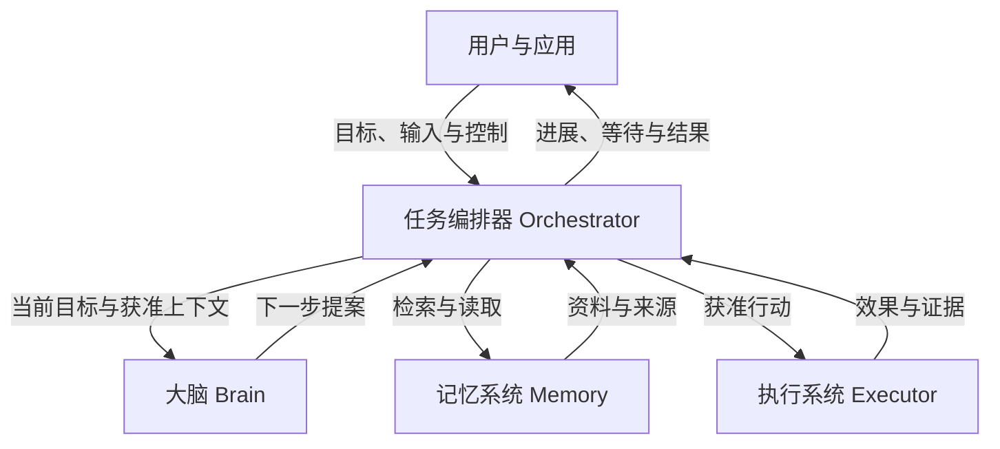
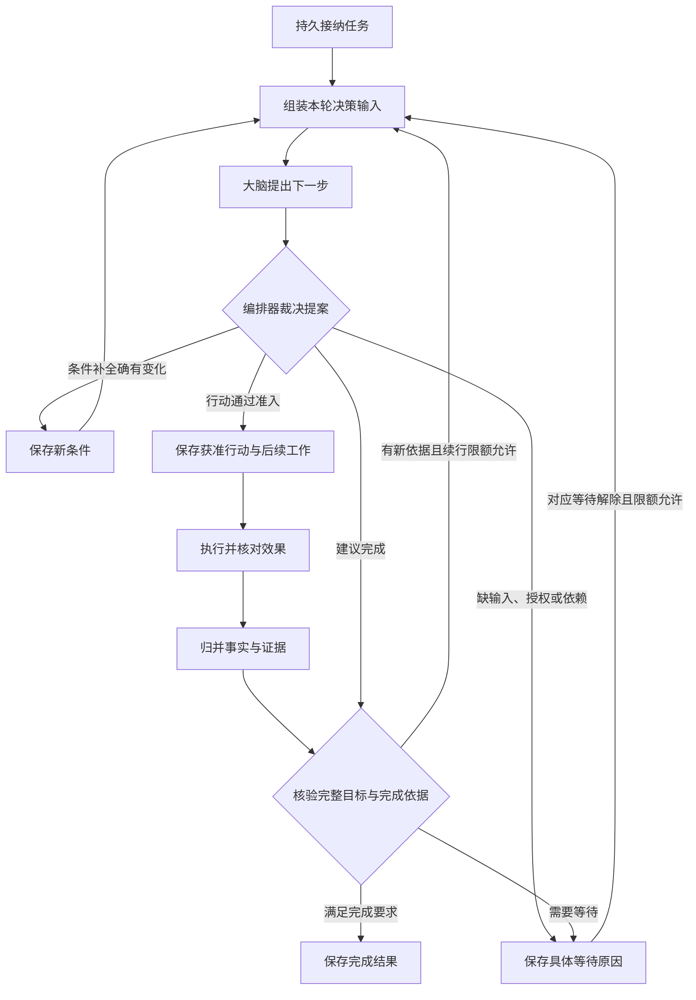
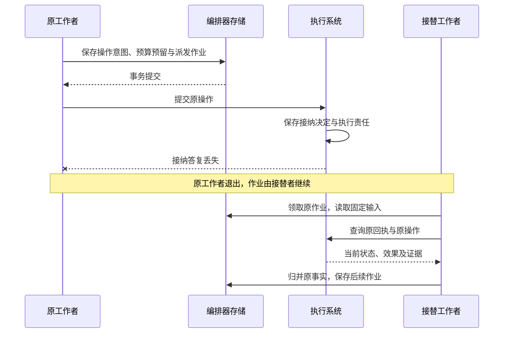
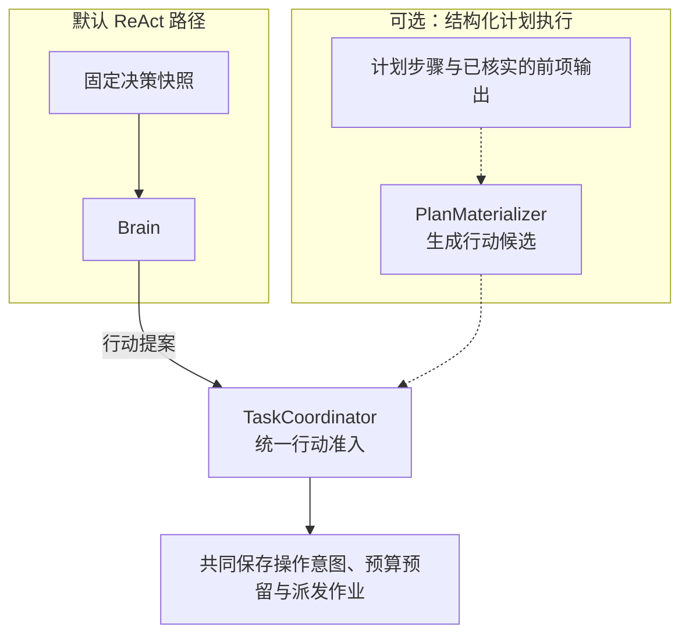

# 任务编排器（Orchestrator）技术架构设计

任务编排器（Orchestrator）负责将用户目标组织成可持续推进的任务。它保存目标与约束，依据当前事实请求大脑提出下一步，检查行动的授权、预算和执行前提，再将获准行动交给执行系统。每次取得新事实后，编排器决定继续行动、等待条件补齐，或依据证据提交完成结果。

每个任务由唯一且固定的编排器负责。同一编排器可以由多个共享持久任务记录的服务实例承载；工作进程重启或替换后，接替者读取原记录继续处理，任务归属保持不变。同一用户的不同任务可以归属不同编排器，各项任务的状态变更和完成裁决由各自的编排器负责。

应用通过 `task.submit` 提交目标，使用 `task.read`、`task.result` 观察任务和取得成果，再按需要回答原输入请求或提交控制命令。Session 组织对话关联，Task 保存目标责任，Decision 与 Operation 由 Brain 和 Executor 推进，Content 与 Grant 分别提供材料和许可；编排器组合这些事实，内部作业无需应用逐项操作。对象关系与各入口的成功含义见[架构总览](../README.md#application-workflow)。

## 协作边界

大脑提出行动建议，记忆系统提供决策材料，执行系统核对实际效果；编排器结合这些信息更新任务进展，并判断是否满足完成要求。图中节点表示逻辑职责，组件可以同进程装配，也可以分别部署。

## 任务记录及其关联

以下记录由原 Orchestrator 管理。它们可以是 Task 的类型化字段或关联记录，不要求应用逐项 CRUD，也不意味着每项一张表。

| 记录 | 固定关联与写入规则 | 恢复和保留用途 |
| --- | --- | --- |
| Task 与目标修订 | 固定租户、逻辑编排器、task_id、原提交；目标、条件、控制与整体修订分别记录 | 进程接替不改负责方；保留解释旧行动和最终结果所需的目标历史 |
| 目标覆盖记录 | 绑定完整目标、goal_revision、全部条件摘要、准确规则／实现、报告与 coverage_revision | 完成时要求当前适用且 pass；缺报告、漏项或条件变化均不能靠已有条件通过抵消 |
| Requirement 与 ConditionResult | 条件对应原目标要求；判断绑定 goal_revision、准确成果、规则、实现与证据范围 | 历史通过不能自动覆盖当前失败或版本变化；原证据和当前适用性分别可查 |
| Snapshot 与 Decision 关联 | 保存准确依赖、输入引用、decision_id、配置及预留；固定后不原地换版本 | 重派读取原输入，新输入产生新 Decision；不能从当前会话重新猜测历史输入 |
| 决策消费与步骤准入 | 每个原 decision_id 或计划步骤保留唯一处理结论 | 同一提案或步骤重报不重复产生操作、目标修订或额度占用 |
| OperationIntent 与收到的事实 | 意图固定 operation_id、原命令、参数和能力绑定；事实按受信 owner／对象／修订去重 | 意图不代表 Executor 已接纳；未结集合必须覆盖全部已准入操作，不能以截断列表推导无未知效果 |
| 输入请求与控制传播 | 请求固定允许回答范围及版本；逐执行端记录待落实控制修订与回执 | 一次消费回答，分别保留本地控制决定、完整落实范围和迟到回执 |
| 预算、预留与分配 | 按声明单位保存 limit、reserved、spent，以及原计费身份和累计修订 | Task 终态不释放未知预留；跨端额度要取得原接收方关闭消费的证据 |
| Result 与收尾责任 | 成功提交时固定目标版本、成果引用、条件依据和限制；保存剩余账务等后续工作 | 终态及原 Result 不改写；可信迟到费用、证据缺陷另附记录继续处理 |

Brain、Executor、Content 和 Grant 仍分别裁决自己的原事实。编排器保存可信来源关联及所需投影，不通过修改本地缓存代替原负责方的效果、权限或账务决定。

## 从目标到任务条件

用户目标说明要完成什么，**任务条件（Requirement）**将它展开为可以逐项检查的要求。编排器保留原始目标与显式约束，并记录条件与原要求的对应关系。其中，**效果条件**检查目标系统中实际发生的变化，**质量条件**检查成果的准确性、覆盖范围等内容要求。

以“比较两个软件版本的差异，附上来源，并将报告保存到指定目录”为例：

| 任务条件 | 类型 | 完成所需的依据 |
| --- | --- | --- |
| 比较准确且覆盖指定范围 | 质量 | 实际取得的资料，以及针对准确报告版本的质量评估 |
| 来源能够支撑报告结论 | 质量 | 报告中的结论与来源正文的对应关系 |
| 报告已保存到指定目录 | 效果 | 准确路径、写入结果，以及与报告版本一致的读回证据 |

大脑可以建议补充任务条件，编排器负责核对这些建议与原始要求的对应关系，并保留用户的显式约束。每项必要条件分别核验，尚缺的依据成为后续行动或等待的具体原因。

固定条件时同时保存目标覆盖检查责任。条件提议与覆盖核验分别作出：前者提出如何拆解目标，后者检查拆解是否遗漏原要求。覆盖核验可以复用当前适用的报告；需要新的语义判断时经过普通行动准入。具体记录及完成要求见[目标覆盖核验](#goal-coverage)。

## 任务推进闭环

编排器将当前目标、任务条件、已有事实和获准资料组成一轮决策的输入。大脑返回提案后，编排器检查任务状态、能力、授权、预算及执行前提，将符合要求的行动建议确定为可派发的工作，这个过程称为**行动准入**。

同一提案同时包含有效的条件变更和行动建议时，编排器先保存新条件，再基于新目标重新决策；条件未变则继续处理本轮建议。每次启动新决策或行动前，都重新检查当前控制、期限、授权与预算。

长任务的[固定决策输入](task-lifecycle.md#fixed-decision-input)从当前权威目标、控制和原效果机械重建；摘要不能取代这些事实。最终供应商请求还要核验实际字段、来源、接收方与大小，复用原 Snapshot／Decision／ModelCall 保存依据。

任务的[进展与停止依据](task-lifecycle.md#bounded-progress)按原可信反馈持久保存；重复通知、重启或会话切换不清累计次数。缺少新的有效输入时保存具体等待，达到固定限额后按策略停止自主续行，原效果和费用仍继续核对。

## 任务决定与后续工作共同保存

一项经准入的有界行动称为**操作（Operation）**，具有固定标识与输入。编排器保存操作意图，执行系统保存接纳、执行及效果事实。**持久作业（Job）**记录后台仍需处理的工作，例如派发操作、查询效果或结算费用，供工作者领取并推进。

预算预留是为本次行动先占用的额度。

| 提交时点 | 同一事务中保存的记录 | 提交后的工作 |
| --- | --- | --- |
| 接纳任务 | 任务目标与预算、接纳回执、首项作业 | 组装决策输入，调用大脑 |
| 准入行动 | 固定操作意图、预算预留、派发作业 | 向执行系统提交原操作 |
| 归并执行事实 | 来源事实、任务进展、费用变化、后续作业 | 继续推进或核验完成依据 |

这些记录在编排器的本地事务中共同提交，模型调用和外部执行在事务之外进行。工作者重启后沿已保存的作业继续处理，查询和恢复始终关联原操作。

## 答复丢失后的恢复

假设执行系统已接纳报告写入操作，但接纳答复丢失，随后工作者退出。接替者领取原作业，读取固定输入，并查询原回执与操作事实，继续处理这项已保存的责任。

查询得到的事实决定后续处理：效果已核实时更新任务进展；仍未知时保留核对责任，并阻止与原效果冲突的新行动。自动核对有次数与期限上限，耗尽后保留原记录和待处理原因；未结费用继续占用相应预留。

## 用户控制与任务终结

任务状态表示任务是否已经结束：`active` 表示尚未终结，`succeeded`、`failed` 和 `cancelled` 分别记录成功、失败和取消。暂停控制是否允许启动新的决策、评估与行动，等待原因记录尚缺的条件，两者独立于任务状态保存。

| 用户控制 | 新工作如何处理 | 原操作如何收尾 |
| --- | --- | --- |
| 暂停 | 停止启动新的决策、评估与行动 | 继续核对效果和费用；既有证据充分时仍可提交成功 |
| 恢复 | 解除本任务的暂停，重新检查推进前提 | 保留尚未解决的等待与核对责任 |
| 取消 | 保存 `cancelled`，关闭新的目标工作 | 继续核对已派发操作；迟到成功不改变取消状态 |
| 修订目标 | 保存新目标，使尚未派发的旧目标工作失效，并关闭旧委派的目标推进 | 已派发操作继续核对；与新目标冲突的效果先核清，再安排后续行动 |

控制决定先由编排器持久保存，再传播到相关执行端。界面分别展示本地决定和各执行端的确认情况；已经发出的动作仍可能完成。已提交的任务终态保持不变，迟到事实补充原操作及费用记录。

## 完成结果与依据

编排器提交成功前，先核对条件是否覆盖当前完整目标，再逐项确认必要条件对准确成果版本的判断已经通过。任务及其委派不能留有未知或仍可能迟到的效果；内部子任务必须终结，外部委派必须关闭后续目标行动。

### 目标覆盖核验

全部已登记条件通过，仍可能漏掉用户的一项要求。编排器因此保留独立于 ConditionResult 的内部覆盖记录，复用 Task 的 verify 作业、评估 Operation 和受控 Content，无需增加公共对象或服务。

| 内容 | 保存与采用规则 |
| --- | --- |
| 核验输入 | 原 Task、goal_revision、完整目标 ContentRef、全部 Requirement 及 source_ref、完整条件集合摘要；不能只读取条件提议者摘出的条款 |
| 覆盖映射 | 每项已识别要求的原文位置或准确来源、对应 requirement_id、覆盖说明与缺口；详细映射保存为受控 Content |
| 核验方法 | 固定规则、实现、配置和报告。已登记的受限模板可做确定性映射；任意自然语言按固定规则做语义评估，Brain 自报覆盖或字段齐全均不足以判为通过 |
| 当前结论 | 保存 verdict=pass／fail／unknown、coverage_revision、准确输入及报告。当前适用且 pass、没有未解决覆盖缺口，才支持完成 |
| 展示与失效 | 呈现原要求、条件关联、方法和限制；目标或条件变化后旧记录不得直接采用。公共 Result 保持既有字段，语义核验限制写入 limitations |

新的模型覆盖判断由 TaskPolicy 选择获准评估能力，作为普通 Operation 保存检查身份、准确输入、预留及派发责任，计入轮数、期限和费用。编排器取得报告后再归并结论，不在完成事务里调用模型。缺实现、完整输入、合法处理位置或额度时保存具体等待；暂停时只能采用既有充分证据。

发现漏项后，Brain 可以通过 requirements_proposal 补全；实际改变条件仍先提交新 goal_revision，使同提案的其余建议失效，再重新决策。含义不明且影响目标时请求澄清，不要求用户逐项批准自动形成的条件。旧覆盖记录保留原依据，新检查重新绑定完整输入。

例如，用户要求“比较、给出处、保存并读回”，条件只登记前三项，即使各项均 pass，覆盖缺口仍阻止成功；登记了读回条件但写入效果未知时，覆盖可以通过，任务仍需核清效果。`verified` 仅描述已固定客观条件的依据，界面同时说明目标覆盖的方法与局限。

### 完成依据与共同提交

| 完成依据 | 必须具备的判断 |
| --- | --- |
| 客观验证（`verified`） | 每项必要条件均由适用的确定性检查验证通过 |
| 质量评估（`assessed`） | 必要效果已经核实，开放质量按固定规则与评估实现判断通过，并说明评估方法及局限 |
| 用户验收（`user_accepted`） | 必要效果已经核实，用户通过受信入口接受准确版本的成果及可见限制，满足允许由其验收的质量条件 |

混合条件按必要条件中最弱的依据标记：存在依赖用户验收的条件时采用 `user_accepted`，否则包含质量评估时采用 `assessed`，其余才采用 `verified`。报告示例的内容质量依赖评估，因此整体完成依据为 `assessed`。

**完成结果（Result）**固定记录本次目标版本、成果引用、条件证据和已知限制。尚未结清的费用继续保留相应预留，并独立结算。

完成核验按以下顺序进行：

1. 检查覆盖记录绑定当前完整目标和全部条件，当前适用、verdict 为 pass 且无未解决缺口。缺报告或条件不全时先补证、补全或澄清，不能靠取消必要性取得成功。
2. 对每项条件选择适用于准确目标、成果版本、资源、观察时点和覆盖范围的判断。引用能解析只证明找到记录，不证明证据可信或当前适用。
3. 检查规则、验证器或评估器的准确版本及资格。确定性验证和开放质量评估分别标明依据；无法判断时保留缺口，需要新取证或模型评估时经过普通行动准入。
4. 复查未决操作、子任务和委派，确认无未知或仍可能迟到的效果。账务尚未最终结清可以独立继续，但保留原预留与结算责任。
5. 在 Task 条件事务中重新比较目标、覆盖、条件及所依赖实现的门禁修订，直接核查当前缺陷事实，保存条件选择、Result、终态、控制传播与必要收尾作业。竞争失败后读取当前事实，不沿过期检查直接提交。

普通停用验证器或评估器只阻止新的调用，不自动推翻旧证据。经可信登记的判断缺陷则按实现版本、规则和适用范围匹配既有证据：活动任务撤去受影响的通过依据并重新核验；已经成功的任务保持原 Result，追加缺陷、受影响范围和补救说明。用户验收绑定准确成果和可见限制，只能满足允许由其验收的质量条件，不能消除未知外部效果。

### 判断缺陷与完成竞争

默认由编排器在同一受信本地事务范围保存缺陷原事实及每个准确实现的固定门禁。缺陷登记锁定对应门禁，共同保存缺陷、递增门禁修订和分页影响责任；成功表示完成路径已经能查到该缺陷，不表示全部任务投影已经更新。

完成事务按固定锁序锁定 Task、所依赖实现的门禁及当前条件记录，直接检查原缺陷，覆盖检查所依赖的实现也在检查范围内。缺陷先提交时，命中依据不能促成成功；完成先提交时，保留 Result，随后追加缺陷说明。组合判断须保留组成检查和实现依赖，任一依据失效不能藏在汇总 pass 中。无法准确区分受影响记录时，保守覆盖已确认存在问题的版本范围。

影响作业有界分页并保存游标，活动任务转为待核验并唤醒 verify，终态任务追加独立说明；重核遵守暂停及原限额。默认宿主通过获准诊断视图展示说明，`task.result` 仍返回固定 Result，不能据此宣称第三方协议已支持附加展示。

安装批准检查只确认是否允许启动，不能代替证据当前缺陷核验。外部缺陷须经受信入口导入本域，默认保证限于本域已登记事实；需要跨域当前缺陷保证的用途，须先具备可核验的交接、范围及时效合同，否则不启用。

### 不同质量保证的准入

| 用途 | 允许采用的前提与声明 |
| --- | --- |
| 普通开放质量 | 规则、实现、配置、范围、绑定契约及典型正反例经过审查，当前发布与用途资格有效；可采用 assessed，未做专项校准须明示，不宣称定量准确率 |
| 确定性条件 | 另有谓词实现、证据映射、边界和否定反例，以及目标或模拟目标验证；verified 只覆盖实际被验证的客观条件 |
| 高影响或额外质量保证 | TaskPolicy 预先固定独立样本、参考依据、分歧处理、指标阈值及当前缺陷核验范围；证据不足时禁止该用途，不能自动降级为普通 assessed |
| 用户验收 | 受信入口一次消费针对准确成果、当前目标与可见限制的本人决定，必要客观效果已证实；不将用户接受当作验证器准确率证明 |

契约兼容、单项成果质量判断和验证器准确率分别取证。评测区分误判、漏判和 unknown／拒判，不能用任务自报成功率或 JSON 合法性替代独立参考判断。

## 预算预留、交接与结算

金额和用量使用精确十进制字符串，按声明单位独立比较。新计费工作在准入事务内锁定对应余额，按可信最大费用预留；正常严格模式检查 `spent + reserved ≤ limit`。未知费用继续占用原预留，重复账单按原计费身份和累计修订去重，只应用新累计值的差额。

明确获准的估算模式限于没有通过 allocation 分配、且费用 Grant owner 与原 Task 处于同一受信本地事务范围内的直接调用。Task 在提交时固定允许范围，未知账单继续占用估算预留。真实账单高于估算时如实入账并关闭新的计费准入；提供方突破可信费用上界时也须全额记录、停止受影响的新调用并报告违约。数据库不能用无条件余额 CHECK 拒收真实超额账单。自动核对耗尽不提供释放预留的依据。

| 变化 | 共同保存的决定 | 尚不能据此认定的结果 |
| --- | --- | --- |
| 调整任务上限 | `task.adjust_budget` 比较当前修订，修改完整单位上限集合及必要等待 | 不修改已发生费用、预留、目标、暂停状态或期限；终态拒绝调额，估算模式不得超出原策略接受范围 |
| 分配子额度 | `budget.allocate` 固定 allocation_id、接收方、单位上限与期限；父侧预留和交接责任共同保存 | 父侧 `applied` 不表示远端接收方已接纳。分配始终要求严格上界，未确认交接时不能把同一额度另作分配 |
| 关闭并结算分配 | 接收方关闭新增消费，提供原分配、全部单位、最终累计修订及可核验关闭依据；父方核验后结算原预留 | 等待超时、Task 终态或接收方失联均不证明可回收额度 |
| 已结后的可信上调 | 接收方保存更高累计修订与可靠对账责任；父方只追加原分配的可信差额 | 不重开消费，不恢复已释放的预留，不改原 Task 终态；如造成超额则记录债务并阻止新计费 |

同编排器父子任务可以在共同事务内完成分配；跨编排器双方各自持久保存原交接。费用和关闭证据须来自固定负责方，不能仅凭一个内容引用或远端自报金额结算。可信费用已确认时先如实记账，提供方单次上界违约与接收方总额度违规分别调查，不能从超额总数直接推断责任。

结算答复丢失时查询或重投原命令。命令已过期但原累计账单尚未落实时，先查询原 allocation、当前修订及旧命令决定，再持久保存绑定同一账单修订和摘要的继任尝试；保留全部旧身份。竞争中发现该累计账单已经结算，即结束对账，不重复扣差额。可信退款或贷记走独立对账，不在上调分支减记支出。

## 内部组件与职责

参考实现拟按下表划分内部职责。同步命令入口承接任务接纳与控制请求，后台工作者推进已保存的作业；两条路径都通过任务协调器执行任务规则。默认 ReAct 路径直接使用 Brain 的行动提案。

| 内部组件 | 职责 |
| --- | --- |
| `CommandHandler`：命令入口 | 处理认证后的调用与原命令回执，将请求交给相应业务用例 |
| `TaskCoordinator`：任务协调器 | 执行任务接纳、目标修订、控制、行动准入与完成裁决 |
| `SnapshotAssembler`：快照组装器 | 固定本轮决策使用的目标、资料、能力与证据版本 |
| `PlanMaterializer`：计划实例化器（可选） | 启用结构化计划执行时，依据步骤依赖和已核实的前项输出生成行动候选 |
| `FactReducer`：事实归并器 | 核对来源和修订，去重归并操作、决策与委派事实 |
| `BudgetLedger`：预算账本 | 管理额度、预留、实际支出与委派额度结算 |
| `JobRunner`：作业执行器 | 领取持久作业，调用内部组件及大脑、执行系统等外部接口，组织一轮工作 |

这些组件是编排器内部的代码职责，共享本地事务能力。生产装配将命令入口与作业执行器分别放入应用进程和工作进程，两者使用同一份权威任务存储，保存任务决定与后续工作。

默认 ReAct 提案与可选计划步骤生成的候选，都由任务协调器依据当前目标、控制、授权、预算和执行前提裁决。虚线表示启用结构化计划执行后才接入的路径。

## 存储访问与并发边界

生产由 PostgreSQL 保存 Task 及本域事实、命令回执和 Job，对象存储保存版本化正文；本地单体同时提供独立 SQLite 适配及本地内容库。两种数据库分别实现迁移、并发和领取策略，共享领域规则与可观察行为。所有访问先验证租户、固定逻辑编排器和当前披露权限；内容引用不承担认证。查询按固定对象键或有界索引读取，恢复不扫描全部聊天历史。

| 路径 | 主要读取与索引 | 写入约束 |
| --- | --- | --- |
| 提交与重投 | 租户／逻辑服务／command_id 唯一回执，原输入摘要 | 首次裁决、Task 与首 Job 同事务；同键异输入冲突 |
| 决策与行动准入 | 原 Task、祖先控制、当前条件、未结意图、能力与余额 | 比较准确修订；原决策消费或步骤准入唯一；意图、预留、责任共同提交 |
| 事实归并与完成 | owner／对象／修订唯一来源，全部未结关联、当前覆盖及条件证据、实现门禁与缺陷原事实 | 远端读取在事务外；本地去重、进展、账务、完成选择与后续工作共同提交，投影滞后不得跳过缺陷检查 |
| 查询任务及结果 | task_id、当前修订、准确 Result 与有界子记录集合 | 投影标明水位和缺口；正文另按当前权限读取，不逐 token 更新权威任务 |
| 恢复与结算 | 未结操作、待传播控制、未结费用，以及可领取 Job 的状态／到期索引 | 有限批次领取，固定原对象身份；不能只扫描 active Task 而遗漏终态后的责任 |

领域记录先锁，Job 记录最后锁并核验当前领取。父子控制按根到叶顺序锁任务，同类记录使用固定键顺序；单次子树和批次大小有上限。完成与缺陷影响处理按 Task → 实现门禁 → 当前核验记录的共同顺序裁决，登记缺陷只锁相关门禁并保存影响责任。余额检查、原消费去重和本次准入在一个条件事务内完成，防止并发工作各自使用最后一份额度或续行名额。事务外取得的远端依据在提交及实际发送入口按适用门禁复查；行锁不跨模型、工具、网络或人工等待。

物理拆表和索引可随容量调整，不能把多个本地提交写成跨库原子事务。命令与作业的精确恢复规则见[持久工作与恢复](durable-work.md)。

## 正式设计文档与验收范围

| 专题 | 展开内容 |
| --- | --- |
| [任务推进与控制](task-lifecycle.md) | 修订、输入重建、默认 ReAct、有界进展、可选计划、用户输入及父子控制 |
| [持久工作与恢复](durable-work.md) | 恢复就绪、原命令裁决、发送门禁、作业领取与新增责任竞争 |
| [架构总览](../README.md) | 核心对象、应用接口、四类请求读写、模块协作、部署及行为验收 |

本文直接规定编排器的事实归属、完成核验、预算和存储边界。实际实现须验证原子提交、并发目标修订、控制传播、重复反馈、领取接替、未知效果与迟到账务；质量、时延、费用和容量需要运行证据，不能由模块划分或阶段数推导。
