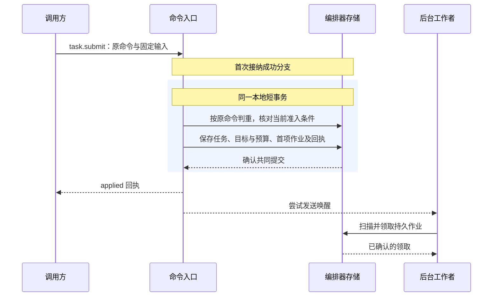
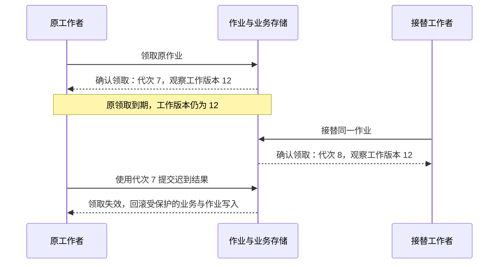
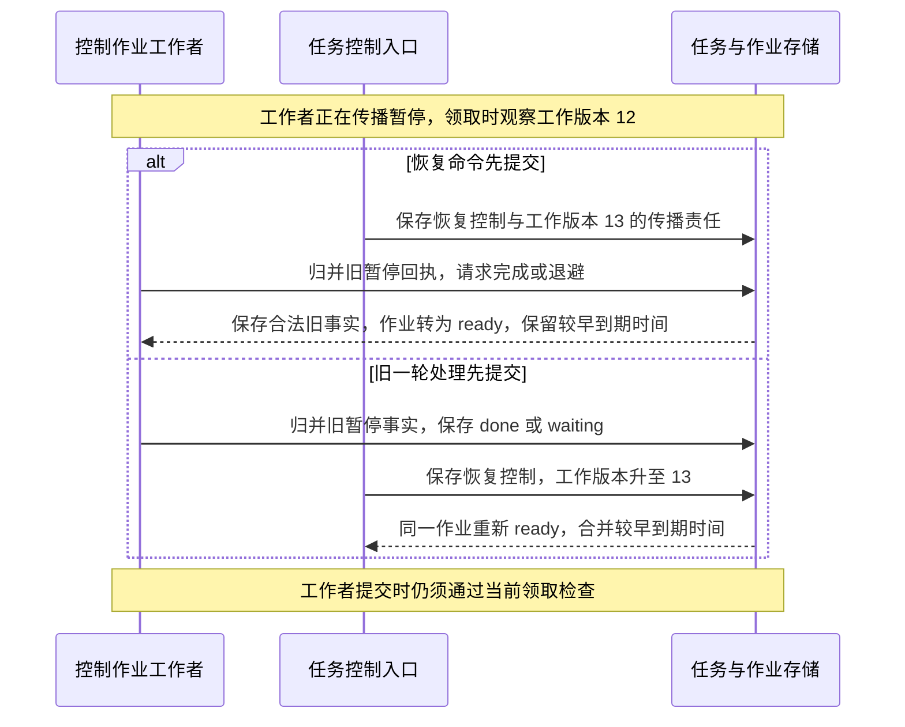

# 持久工作与恢复

宿主重启后先恢复原账本、控制与未决工作，再开放相应的新执行。原操作仍未知不妨碍获准查询，但会继续约束其关联资源与后续行动；详细开放条件见[宿主恢复](../.draft/deployment.md#recovery-readiness)。

编排器将业务决定、原命令回执与必要的后续作业共同保存。进程退出、答复丢失或工作者接替后，恢复者从原记录继续处理；是否可以启动新工作，仍由当前目标、控制和原效果事实决定。

命令（Command）要求固定的负责方裁决一次业务变化。调用方在首次发送前固定命令标识、目标逻辑服务与完整输入；答复丢失后的重投仍对应同一次裁决。

| 对象 | 记录什么 | 恢复时如何继续 |
| --- | --- | --- |
| 命令（Command） | 一次业务请求及其裁决回执 | 查询原命令；需要重投时，保留原标识、目标与完整输入 |
| 操作（Operation） | 一次获准的有界行动及其效果事实 | 沿原操作核对结果；结果未知不能成为换一个操作重新执行的理由 |
| 作业（Job） | 某个领域对象尚需处理的一类后台责任 | 按稳定作业键领取和接替，保留与原命令、原操作的关联 |

例如，任务协调器准入一次报告写入时，固定操作、原执行命令与派发作业。派发答复丢失后，接替者读取作业中的原关联，查询同一命令和操作。作业本轮处理结束不表示任务完成；尚未核清的效果与费用仍由相应作业继续处理。

## 命令接纳与提交结果

编排器按认证得到的租户、固定逻辑服务与 `command_id` 定位原命令，并保存完整请求的规范化摘要。同键同输入读取原决定；同键异输入返回 `idempotency_conflict`，不覆盖原记录。回执披露仍检查当前权限，恢复也不能把原命令改投另一编排器。

首次接纳 `task.submit` 时，命令入口先在事务外取得所需的策略与内容依据，再进入短事务。事务内核对当前准入条件，并共同保存 Task、目标与预算、首项作业以及 `applied` 回执。这里的 `applied` 表示任务已经建立，后续推进由持久作业承担。

事务不跨模型调用或外部执行。提交后的通知用于缩短等待，后台仍按到期时间独立扫描作业；通知丢失或入口进程退出，不消除已保存的责任。存储无法共同提交这些记录时，不接纳新的任务责任。

| 提交结论 | 可以确认什么 | 后续处理 |
| --- | --- | --- |
| 已确认提交（`Committed`） | 业务决定、原回执与必要作业已经保存 | 返回原决定；固定拒绝也属于已提交决定，不因条件恢复而改写 |
| 明确回滚（`RolledBack`） | 本次事务没有生效 | 明确的数据库竞争可有界重跑纯本地逻辑，重新检查当前条件；其他错误按原错误契约恢复 |
| 提交结果未知（`CommitUnknown`） | 是否提交尚无定论 | 查询原命令与对应业务记录；查清前不报告业务失败、不释放未知预留、不重做外部步骤 |

数据库重试保留原输入、首次接纳期限与 `expected_revision`。真实业务修订冲突应保存固定拒绝，不能通过替换预期修订让原命令继续执行。提交结果未知时，只有权威查询确认原提交不存在，且仍满足首次接纳条件，才可用原命令重新进入接纳事务。

## 作业身份与领取接替

外部执行还受[持久提交与实际出站检查](../.draft/reliable-work.md#durable-before-send)约束。内存排队、存储接口接收写入和进程启动成功均不能代替确认提交；提交结果未知时先查原命令或阶段，不能换身份补发。框架负责保存和领取继续责任，是否允许首次发送或安全重试仍由原业务模块裁决。

在原编排器的权威存储中，作业按 `(tenant, task_id, kind, object_id)` 唯一定位。`kind` 表示派发、核对、结算等工作种类，`object_id` 指向所处理的领域对象。同一对象的同类责任可以合并到原作业，但不能覆盖尚未处理的来源记录。

| 字段 | 含义 | 变化规则 |
| --- | --- | --- |
| `job_id` | 一条作业记录的身份 | 创建后固定，不能用旧标识代表新记录 |
| `lease_epoch` | 该作业当前的领取代次 | 每次新领取或接替时递增；续约不改变代次 |
| `work_revision` | 该作业已保存的工作版本 | 新责任与来源事实共同提交时递增；重复事实、通知、领取和续约不递增 |

JobRunner 先预留实际处理容量，再通过短事务领取有限批次的作业。一次领取返回领取记录（Claim），固定 `job_id`、工作者启动标识 `holder_id`、`lease_epoch`，以及领取时看到的工作版本 `observed_work_revision`。工作进程每次启动使用新的 `holder_id`。

领取在有限时间窗口内有效，这个窗口称为**领取租约**。作业记录保存当前截止时间 `lease_until`，由数据库当前时间判断是否到期。只有确认领取提交成功后，工作者才开始处理；外部调用期间不持有数据库事务或行锁。

领取提交未知时，先按本次候选记录核验持有者、代次和期限；无法确认或候选记录已丢失时，不开始处理。核验必须保留原 `observed_work_revision`，不能用最新工作版本替换它。续约只能在原领取仍有效时确认；续约结果未知时，仍以前一次已确认的截止时间为停止依据。

每次提交受领取保护的业务变化，都先取得所需领域记录的锁，再锁定作业记录，核验作业身份、持有者、领取代次及当前租约。领取失效时，受保护的业务写入与作业更新一起回滚。领取有效也不替代任务、目标、控制及其他业务前提的检查。

领取到期不能证明外部动作已经停止或从未发生。迟到结果通过独立的事实归并入口核验来源、原对象及修订后接收，不能借此恢复旧工作者的提交资格。接替者沿原命令和原操作继续处理，不重置累计尝试、任务期限与预算。

## 作业完成与新增工作

作业状态描述后台责任的处理进度：`ready` 表示等待领取，`leased` 表示已被领取，`waiting` 表示等待已记录的依赖或下次核对，`done` 表示当前责任已经履行或完成持久交接。`due_at` 保存最早应处理时刻。

新增责任与来源事实在同一事务保存，同时递增 `work_revision`，将 `due_at` 合并为原要求与新要求中较早的时间。已经 `done` 或 `waiting` 的作业重新进入 `ready`；已经 `ready` 的作业保持该状态。作业仍被领取时，保留当前持有者与领取代次，只更新工作版本和应处理时间，不抢占领取或延长租约。

工作者结束本轮时，在同一短事务内保存合法原事实、后续责任与作业状态。最终设置状态前，再按数据库当前时间核验领取，并比较当前 `work_revision` 与 Claim 中固定的 `observed_work_revision`。

| 最终检查 | 提交规则 |
| --- | --- |
| 本次领取已经失效，包括作业不存在、已结束、过期或被接替 | 整笔受保护事务回滚，不提交本轮业务与作业更新 |
| 领取有效，当前工作版本高于领取观察值 | 可以归并仍合法的原事实；释放领取并转为 `ready`，保留较早的 `due_at`，不能用旧的完成或退避结果覆盖新工作 |
| 领取有效，版本相同，当前责任已履行或已持久交接 | 将原事实、交接记录与 `done` 共同提交 |
| 领取有效，版本相同，仍需等待 | 保存具体依赖、有限退避与 `due_at`，提交 `waiting` |

当前工作版本小于领取观察值属于存储异常，应拒绝写入并保留诊断依据，不能通过重置版本消除差异。

持久交接需要可核验的依据：本地后继作业在同一事务保存；交给另一负责方时，取得其持久接纳事实并保存原关联。一次查询返回或处理函数结束，本身不足以将作业标为 `done`。

同一事务归并事实后又产生新责任时，也先递增工作版本，再执行最终比较。工作者不能刷新 Claim 的观察版本，声称自己已经覆盖尚未处理的新工作。

以下以同一执行端的控制作业为例。工作者正在传播暂停，随后用户恢复任务；图中的 12、13 均表示作业的 `work_revision`。

两类事务锁定同一作业记录，并在锁内读取当前版本，因此无论谁先提交，新责任都会保留。作业重新进入 `ready` 只恢复对应的后台责任，不重新开启终态任务的目标推进，也不改写原操作输入或重置期限与累计限额。
