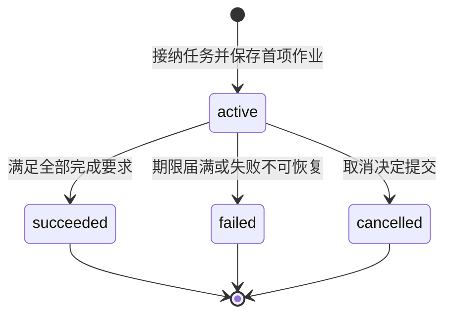
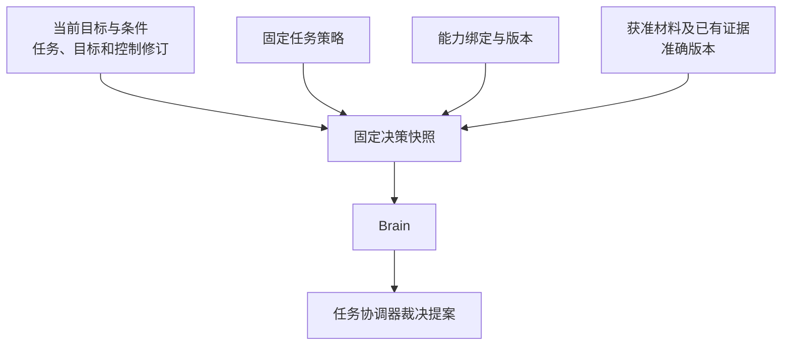
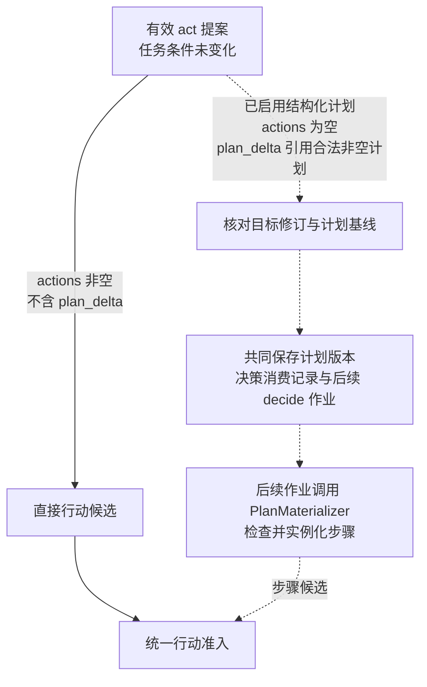
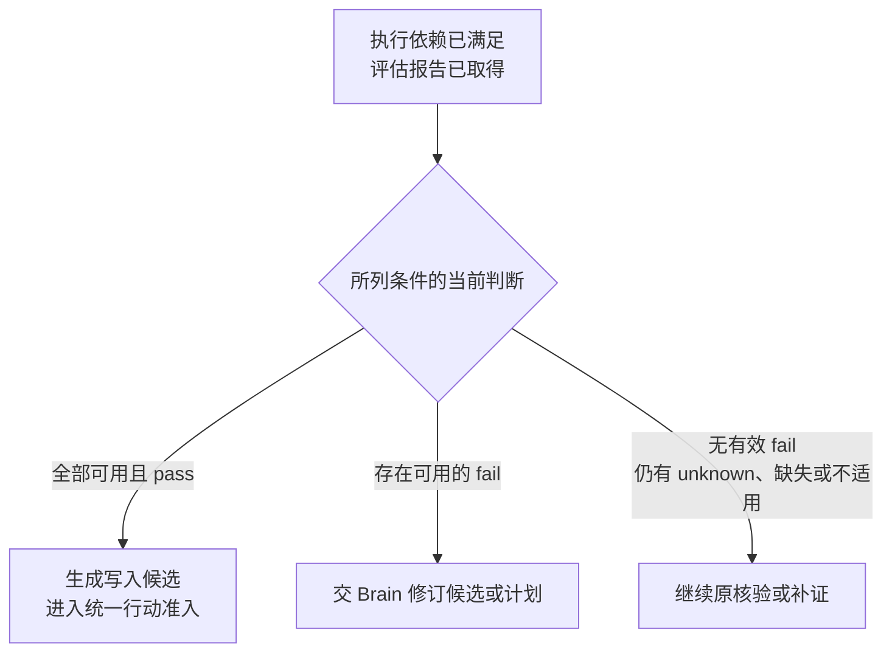
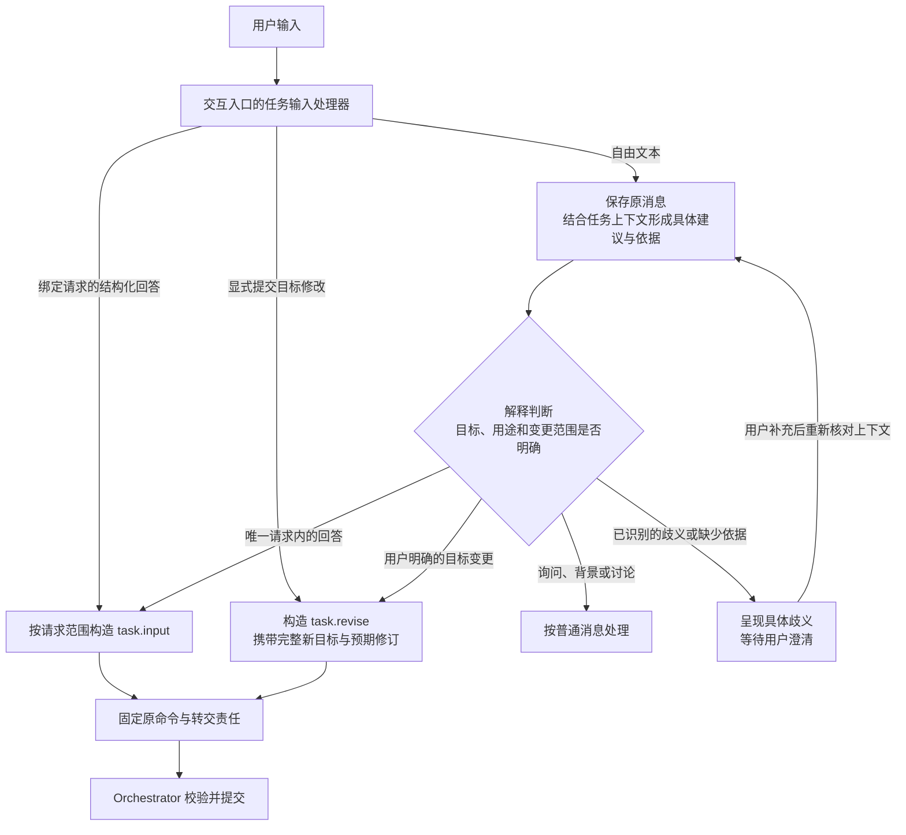
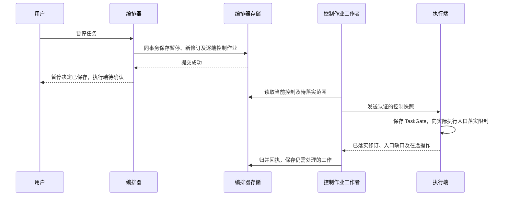

# 任务推进与控制

任务推进以当前 Task 记录为依据。编排器分别记录任务是否终结、是否暂停、当前工作缺少哪些条件，以及仍需核对的效果与费用。新工作按这些事实检查准入，原操作的核对与结算保留各自的责任。

| 维度 | 含义 |
| --- | --- |
| `status` | `active`、`succeeded`、`failed` 或 `cancelled`；任务进入终态后不再恢复为活动状态 |
| `control` | `running` 或 `paused`，记录本任务的运行或暂停选择 |
| `wait_reasons` | 输入、授权、依赖、预算、效果或容量缺口；各项分别记录所等对象与解除条件，可以同时存在 |
| `open_effects` | 效果未知或仍可能迟到的原操作，需要继续核对，并阻止与其冲突的新行动 |
| `accounting_open` | 尚未完成结算的调用或额度分配，需要保留相应预留并沿原计费项核对 |

例如，取消任务后，`status` 已为 `cancelled`，仍可能存在 `open_effects` 和 `accounting_open`：目标推进已经结束，原操作的效果与费用继续核对。

## 状态变化与终结

编排器负责提交 Task 的状态变化。图中的终点表示任务状态已经确定，原操作的效果核对与费用结算仍按各自记录继续。

暂停或新增等待原因本身不改变 `status`。暂停阻止启动新的决策、评估与行动；解除一个等待原因只更新对应项，其余等待继续保留。既有证据已满足全部完成要求时，暂停中的任务仍可提交 `succeeded`。期限届满则提交 `failed`，并记录原因 `deadline_exceeded`。

取消与成功提交发生竞争时，以先提交的终态为准。迟到的执行成功补充原操作事实和费用，不改变已经提交的任务终态。

## 修订与决策有效性

编排器为已提交的任务变化保存递增的修订号。每轮决策记录自己依据的修订，提案返回时据此检查是否仍可采用。

| 修订号 | 表示什么 | 使用规则 |
| --- | --- | --- |
| `revision` | 当前 Task 记录的整体版本 | 提交任务变更时比较，防止旧工作覆盖已经提交的新事实 |
| `goal_revision` | 当前目标及任务条件的版本 | 用户修订目标或获准的条件补全实际改变条件时递增；提案与条件证据绑定对应版本 |
| `control_revision` | 控制决定的版本 | 本任务暂停、恢复、取消、目标修订及终态提交时递增；活动子任务受祖先控制变化影响时也递增，供执行端判别控制新旧 |

提案返回后，编排器在提交事务中重新比较所依赖的修订。修订不匹配时，保留原调用记录和费用，不依据旧提案产生新行动。后续是否重新决策，由当前任务状态与控制决定。

例如，Brain 调用期间任务先暂停又恢复，`control` 虽然重新为 `running`，`control_revision` 已经变化。旧提案仍按过期提案处理，不能因为当前显示“运行中”而继续派发。

## 固定决策输入

任务接纳时绑定一份准确的任务策略（TaskPolicy），保存其标识、版本和摘要。策略规定工具范围、确认等级、回路限额、允许的评估方式及费用模式。

决策快照（Snapshot）固定本轮使用的目标、条件与相关修订，以及策略、能力绑定、获准材料和证据的准确版本。组装时若权限变化或必需材料不可读，编排器保存具体等待原因，待条件补齐后继续。

原目标、显式约束、当前控制与未结操作从权威记录机械重建；多次压缩后的摘要只提供派生材料。组装依据附在原快照，记录准确来源、选材理由和水位，避免投影缺行被误读成没有未知效果。Brain 再核验最终模型请求的全部字段与接收方，含附加日志、metadata、媒体及插件包装；门禁后不得追加数据。记录与失败分支分别见[组装实现](../.draft/brain/implementation.md#snapshot-reconstruction)和[最终编码实现](../.draft/brain/implementation.md#final-request-provenance)，不增加公共协议字段。

默认 ReAct 路径直接使用 Brain 的提案。工作者先持久保存快照与固定 `decision_id` 的调用输入，再在事务外调用 Brain。恢复原调用时沿用原快照和标识；需要新一轮决策时，保存新的快照与 `decision_id`。

快照记录本轮判断的依据，行动准入仍须重新检查当前控制、授权与预算。

## 条件补全优先裁决

编排器按 `decision_id` 保存唯一的处理结论，称为决策消费记录。已有记录时返回原结论；尚未处理时，先核对当前任务修订与控制，再裁决提案携带的条件补全。

条件补全通过 `requirements_proposal` 携带，必须与当前目标修订匹配。编排器按稳定的条件标识比较完整内容，并核对原文依据与显式约束；仅调整条件排列顺序不构成变化。

| 条件补全情况 | 保存的变化与后续工作 | 同一提案的其余内容 |
| --- | --- | --- |
| 未携带补全，或内容与当前条件相同 | 不因补全增加目标与控制修订 | 继续裁决原提案 |
| 合法补全实际改变条件 | 保存新条件，递增目标、控制及任务修订，同时保存下一轮决策与控制传播作业 | 行动、完成建议及可选计划变更全部失效 |
| 缺少必要条件、未保留显式约束、降低必要性，或目标含义不明确 | 保存缺口与澄清、重新决策或用户修订所需的工作 | 不部分采纳，也不继续处理其余内容 |

改变目标含义或降低必要性，需要用户通过 `task.revise` 明确修订。决策消费记录与本次任务变更、后续作业共同提交，重复交回同一决策不会再次增加修订或创建工作。

例如，一份提案同时补全任务条件并建议写入报告。只要补全确实改变条件，本轮就不准入写入；下一轮读取新条件后再决定如何行动，并重新检查当前控制与执行前提。

## 条件未变时的提案处理

条件未变化且提案仍有效时，编排器按 `kind` 继续裁决。默认 ReAct 路径采用以下处理规则。

| 提案类型 | 编排器的处理 |
| --- | --- |
| `act`：行动建议 | 进入统一行动准入；通过后共同保存固定操作意图、预算预留与派发作业 |
| `need_context`：补充上下文 | 有界读取获准的记忆、能力声明、已有操作事实或已知内容，保存结果与缺口，供新快照使用 |
| `request_input`：请求用户输入 | 编排器创建并保存输入请求，限定可补充的参数范围，记录关联条件与等待原因；交互系统呈现请求并持久转交回答，编排器消费后重新检查推进前提 |
| `complete`：完成建议 | 核验完整目标覆盖、准确成果版本、必要条件及效果收尾；满足全部完成要求才提交 `succeeded` |
| `fail`：失败建议 | 核对失败原因、未满足条件与恢复建议，结合当前事实决定继续等待、安排后续工作或提交 `failed` |

新的网页搜索、页面抓取或设备观察通过 `act` 提出，并经过普通行动准入。`need_context` 只用于补充已有且获准读取的材料。

相同快照下重复的上下文请求复用已保存的结果或缺口。外部依赖暂不可用时，保存具体等待对象与恢复条件，不靠连续调用 Brain 探测恢复，也不直接认定任务不可恢复。

## 进展、无进展与停止依据

编排器把进展分类与原 Task、可信事实及反馈消费共同保存。新的可用结果、原未知效果核清或有效人工输入可以改变本轮依据；计划措辞、模型自述、通知次数和会话更换不构成这种变化。每个反馈按原 owner／对象／修订或原 Decision／输入命令消费一次，重启和重复领取读取同一决定。

新决策及已准入计划步骤分别占用固定的累计续行次数，格式修复和拒判升级另受修复限额约束。有效新目标／输入可以清零连续无进展数，却不清累计次数、已发生费用或任务期限。正常 poll 重复读到 unknown 不是空转判罚；它只继续原效果查询，不生成探活模型请求。

达到上限时，有可恢复条件就保留具体等待项及检查时点；没有合法继续条件或固定累计额度耗尽时，结合在途工作与已有证据按策略结束目标推进。用户能看到等待对象、停止原因和补齐条件；无进展限制不提供成功依据。Task 已失败／取消时，原 unknown、失联子任务和未结账务仍按原责任核对，迟到结果不重开目标。

这些是任务协调器的内部记录，公开 Task／WaitReason 字段不增加计数或 `no_progress` 枚举。精确分类、事务及 RT-20～24 验收见[持久有界推进](../.draft/orchestrator/implementation.md#bounded-progress)与[反馈归并](../.draft/orchestrator/implementation.md#progress-feedback)。

## 统一行动准入

Brain 的行动提案、启用结构化计划后的步骤候选，以及固定策略与检查规则要求的核验行动，都由任务协调器执行同一套准入检查。每个候选保留自己的来源，用于识别重复处理。

远端依赖与授权依据先在事务外取得。以下检查与写入在同一短事务中完成：

1. **核对本轮有效性。** 确认工作者本次领取仍有效，候选依据的任务与目标修订仍匹配。
2. **检查运行条件。** 本任务必须为 `active`、`running`，且期限未到。对于同一编排器管理的内部子任务，全部祖先任务也必须处于活动、运行状态。
3. **核对来源与行动内容。** 按候选来源查询准入记录，重复处理沿已保存的操作恢复；新候选检查完整能力声明、准确绑定、参数结构与执行依赖。
4. **检查当前约束。** 核对授权与预算，确认没有阻塞本次行动的资源冲突或未决效果；存在缺口时保存具体等待或拒绝原因。
5. **共同保存获准工作。** 保存操作标识与不可变输入、原执行命令、预算预留、来源处理记录、任务新修订及派发作业。

派发前再次核对当前任务、目标、控制与期限；执行端实际启动时核验当前授权。

多个行动只有相互独立且资源不冲突时，才能以有界批次准入，每项保留独立操作身份与预留。依赖前项结果的行动，取得真实结果后再准入；GUI 操作依据新的界面观察逐次决定一个动作。

## 可选的结构化计划

结构化计划按需启用。Brain 可以提交步骤数量有限、依赖无环的版本化计划，由 `PlanMaterializer` 根据计划与已核实事实生成行动候选。默认 ReAct 继续直接使用 Brain 的行动提案。

计划变更通过 `plan_delta` 提出。安装时，编排器比较 `base_plan_ref` 与当前计划引用，并核对目标修订。首次安装要求基线为 `null`、计划版本为 1；修订现有计划时保留 `plan_id`，版本递增一版。

虚线表示启用结构化计划后才使用的路径。一次 `act` 提案只能选择直接行动或安装计划；计划中的首个行动也由后续作业生成候选，再单独准入。

每个步骤具有独立的 `step_id`。步骤准入按任务、`plan_id`、计划版本与 `step_id` 去重，重复处理恢复原操作。安装计划的 Decision 只消费一次，后续步骤各自保存准入记录。

### 步骤依赖与通过条件

以下规则仅适用于结构化计划步骤；默认 ReAct 通过逐轮事实反馈推进。

`depends_on` 列出本步骤依赖的前项步骤。只有全部前项已结束、不会再产生迟到效果，且输出已核实，才满足执行依赖。前项操作失败、效果未知或仍可能迟到时，依赖不成立。

`pass_conditions` 声明本步骤要求通过的任务条件，每项绑定条件标识、规则与准确成果引用。编排器读取当前目标下对应的所选判断，并检查证据的当前适用性；所列条件必须全部当前可用且为 `pass`（通过）。

以写入步骤要求“报告质量评估通过”为例：

评估操作成功说明评估报告已经生成；报告中的质量判断仍可能为 `fail`（不通过）。此时写入步骤不能启动，也不能从历史检查中挑选另一份 `pass` 覆盖当前有效的失败判断。

步骤准入事务再次核对依赖、所选条件判断与证据适用性，确保生成候选后发生的变化仍能阻止执行。

### 参数绑定与计划修订

行动模板（`action_template`）固定工具调用或任务委派的结构。参数绑定（`argument_bindings`）描述从输出取值、写入业务参数的映射，使用 JSON Pointer 定位 JSON 正文中的相应值。

| 取值方式 | 来源与解析规则 |
| --- | --- |
| 模板字面值 | 直接复制当前计划版本中已经固定的值 |
| `operation_output` | 引用编制计划时已存在的原操作及准确输出，沿声明的引用取值 |
| `step_output` | 仅引用本计划的直接或间接前项；实例化时沿该计划版本的唯一准入记录，找到实际操作或委派及其已核实输出 |

实例化过程只复制字面值或按路径取值，不执行脚本、表达式或额外网络请求。绑定只写入工具调用的业务参数，或委派的目标、输入引用，不能覆盖能力、主体、授权、预算或控制。

绑定位置不得重叠，父路径与数组位置必须已经存在；绑定后校验完整参数结构。来源字段缺失、引用版本不符或类型不匹配时，保存缺口并交 Brain 重新决策。没有行动模板的步骤也由 Brain 展开。

准入时共同保存实际来源、固定输入与参数摘要。重复处理沿原操作恢复，不重新绑定较新的输出。计划修订使尚未准入的旧步骤失效，但保留已有操作、预算预留与未决效果；新计划需要复用旧输出时，必须显式使用 `operation_output`，并重新核对当前适用性。

## 用户输入、目标修订与等待解除

输入请求（InputRequest）由编排器创建并持有，固定请求标识、修订、回答结构、期限及必需预览，并在内部绑定适用的目标修订与可补充参数范围。交互系统负责呈现请求、接收回答和持久转交；请求是否已被消费，以编排器保存的决定为准。

### 两类命令的业务边界

`task.input` 和 `task.revise` 分别提交请求回答与目标修订。它们规定不同业务变化的校验和提交规则，不要求聊天入口先将所有用户消息分类为二者之一。用户消息也可能是询问进度、补充背景或讨论方案，不一定产生任务变更。

| 比较项 | `task.input` | `task.revise` |
| --- | --- | --- |
| 处理对象 | 一个尚未消费的澄清请求 | 一个仍为 `active` 的任务目标 |
| 版本依据 | `request_id`、`request_revision`，以及请求内部绑定的目标修订 | 任务的 `expected_revision`、完整新目标与约束 |
| 允许变化 | 只补充请求明确开放的参数 | 根据用户明确表达的变更，调整目标含义、既定约束或必要条件 |
| 提交责任 | 一次消费请求，保存回答、参数变化、回执与后续工作 | 保存新目标，递增目标、控制及任务修订，使尚未派发的旧目标工作失效并保存控制传播与后续工作 |

例如，请求正在询问保存目录时，“保存到 `/reports`”可以作为 `task.input` 的回答；若原目标已经固定保存到 `/archive`，用户要求改为 `/reports`，则属于 `task.revise`。“不用保存文件了”改变了必要条件，也属于目标修订。判断依据是当前目标和请求开放的范围，不能只靠句中的关键词。

### 用户消息解释与命令形成

交互入口中受信登记的任务输入处理器负责保存用户消息、组织解释、构造业务命令并固定转交目标。这是交互入口的逻辑职责，不要求新增服务。编排器负责校验并提交业务变化；Brain 的任务提案不能自行代替用户修改目标。

已绑定请求的结构化回答，由登记的处理器构造 `task.input`；显式提交的目标修改构造 `task.revise`。绑定只确定提交路径，回答仍须满足请求范围和结构。

自由文本先保存原消息标识、准确原文及已认证用户、任务上下文，进入待解释状态，再结合当前目标、待回答请求和相关对话形成处理建议。语义解析可以使用规则或受限模型。使用模型时，模型应给出具体内容：回答哪个请求、补充哪些参数，或要求怎样修改当前目标，并关联用户原文依据。仅返回 `input` 或 `revise` 标签不足以形成业务命令。

处理器依据具体建议构造命令。消息已保存、解释建议已生成和业务变更已提交是不同阶段，只有命令成功提交才产生相应任务变化。

自由文本只有能对应唯一、有效的请求，且全部内容都在该请求允许的回答范围内时，才形成 `task.input`。形成 `task.revise` 时，须明确目标任务、用户要求的具体变化及其依据；新目标保留用户未要求改变的约束。处理器识别到任务指向不明、多个请求均可能匹配、回答同时夹带目标修改，或候选解释需要猜测用户意图时，列出具体歧义并等待澄清，不截取其中一部分先提交。识别不可用时仍提供明确的回答与修改入口。

自然语言解释依赖模型能力，原文引用和结构化建议使解释可追溯，但不能证明解释正确。Orchestrator 校验身份、权限、版本、请求绑定和允许变更范围，不保证识别全部语义误解。目标修订应保留修改前后的内容及原消息关联，供用户查看和纠正；纠正通过新的命令提交，已经发生的操作和效果仍按原记录核对。

需要提交业务变化时，处理器共同保存唯一的目标 Orchestrator、方法、完整命令、原消息关联和转交责任；随后沿原命令发送、查询和恢复。重复收到原消息复用这份记录。已经固定的 `task.input` 不能因拒绝或超时改投 `task.revise`；用户随后明确修改目标时，建立独立的新命令。

### 消费、竞争与等待解除

编排器先检查原命令是否已有决定。对新的 `task.input`，在提交事务中锁定任务与请求，确认任务仍为 `active`，核对当前身份和权限、请求状态与修订、适用目标、期限、回答范围和结构，以及必需预览的准确引用、当前来源状态与使用许可。校验通过后，共同保存回答、请求消费记录、任务变化、原回执及后续工作。

同一命令与相同内容重复提交时返回原决定；两个不同回答竞争同一请求时，先成功提交者获胜，另一方收到请求已消费及可披露的原回执。过期、被替代或不符合范围的回答不消费请求，也不自动解释成目标修订。原命令身份相同而内容不同，按幂等冲突处理。

`task.revise` 在任务事务中比较预期修订，保存新目标，并将仍未消费、绑定旧目标的请求标为已被替代；新目标仍缺参数时建立新的请求。这样，旧回答与目标修订无论谁先提交，后提交的一方都必须重新核对版本。已有操作的原始记录、在途效果核对责任，以及已经发生的费用和许可消费继续保留。

有效回答只解除对应的输入等待，其他等待原因与暂停状态继续保留。主观成果验收通过绑定准确候选的 `task.accept_result` 处理；授权决定通过独立受信入口处理，均不能借普通回答改变其消费规则。

## 控制决定如何到达执行端

每次暂停、恢复、取消、目标修订或终态提交，编排器在同一事务保存任务变化、新的 `control_revision`，以及面向各已绑定执行端的控制作业。新执行端的绑定与操作派发责任也共同保存，确保后续控制能找到所有已经接入的执行端。

执行端为每个任务持久保存执行控制记录（TaskGate），记录已知的任务状态、运行或暂停控制、目标修订和控制修订。编排器签发的控制快照绑定具体任务与接收执行端，并通过 `start_before` 限定允许启动动作的时间窗口。

执行端按控制修订处理乱序消息：较新修订更新记录，相同修订与相同内容去重，相同修订却内容不同则报告冲突，较旧修订只返回当前事实。已经终结的任务不能由迟到的恢复消息重新启动。

控制确认必须对应当前控制修订及完整执行范围。只有所有相关执行端的实际入口都已落实启动限制，才可显示当前控制已确认。旧修订回执和部分入口的确认分别保留，不能清除新控制的待确认记录。控制落实后，已经发出的动作仍需继续核对。

执行端尚未收到暂停时，仍可能在旧快照的有限窗口内启动动作。窗口到期阻止继续启动，但不能证明在途动作已经停止。恢复后，原操作须取得当前有效的启动依据，并继续遵守原期限与授权；已明确终止的操作不能被恢复消息重新启动。

## 内部子任务的有效控制

内部子任务与父任务由同一编排器管理，共享本地事务。父子关系在创建时固定并禁止成环；子任务调用远端 Brain 或执行端，不改变其任务归属。

子任务的 `Task.control` 保存自身的运行或暂停选择。对外发布的 `TaskGate.control` 则是有效控制：只有自身及全部祖先都处于 `active`、`running`，才允许启动新的目标工作。

下表假定子任务仍为 `active`：

| 祖先状态 | 子任务自身 `control` | 有效控制 |
| --- | --- | --- |
| 全部为 `active`、`running` | `running` | `running` |
| 全部为 `active`、`running` | `paused` | `paused` |
| 任一祖先暂停或终结 | 任意 | `paused` |

父任务恢复时重新计算有效控制，不能清除子任务自身的暂停。暂停期间，各任务期限继续计时，原效果与费用仍按已有责任核对。

祖先控制变化时，编排器按从根到叶的顺序锁定相关任务，在同一事务递增受影响子任务的控制修订、计算有效控制，并保存逐执行端传播作业。父控制的确认范围包含这些子任务的实际执行入口。任务深度与子树规模在创建时受限，保证控制事务处理的范围有界。

子任务创建和行动准入同样锁定并检查祖先状态。父取消先提交时，新的子任务创建被拒绝；子创建先提交时，父取消事务将其纳入子树取消责任。父取消提交后，祖先状态立即阻止子任务的新工作，后续作业继续落实子任务取消与远端控制。已经终结的子任务保留原终态，迟到结果不重新打开父任务。

另一编排器管理的 Agent 按外部委派处理，不能依赖上述本地事务保证。外部控制沿原命令传播并核对；不支持暂停或尚未确认时，明确展示外部任务仍可能运行。

## 目标修订后的委派与证据

每个委派在创建时固定其对应的父任务 `goal_revision`。父目标修订后，旧委派不能自动继承新目标；合法条件补全实际改变目标版本时，也遵循这一规则。

参考实现采用保守处理：在父目标修订事务中，将旧目标下仍活动的内部子任务及其活动后代置为 `cancelled`，记录取消原因、递增控制修订并保存传播作业。已经终结的子任务保留原终态，原操作的效果核对和费用结算继续进行。这样，即使父任务仍为 `active`、`running`，旧子任务也不能继续准入行动。

外部委派按其实际交接状态处理。尚未派发的创建停止派发；已经发送或发送情况不明时，保留原创建标识，核对原任务并继续取消、关闭新增消费。远端是否落实控制仍以原负责方的事实为准，父目标修订不提供远端已经停止的证明。

新目标通过新一轮决策决定是否建立新委派，不能改写旧委派的目标或重用其身份。原预留、在途效果和资源冲突继续参与准入检查；与旧效果冲突的新行动进入效果等待。新委派也不重置父任务的累计限额、期限或预算。

这一选择的代价是部分仍有用的子工作也会终止。已经取得的材料与成果可以继续保留，并在满足当前要求后复用。旧证据需要逐项核对：

- 条件含义与判断规则仍适用。
- 成果准确版本、资源对象及证据覆盖范围一致。
- 观察时点满足当前要求，来源与用途仍获准，且未命中当前已登记的判断缺陷。

复用成立时，保存绑定新 `goal_revision` 的核验记录及复用依据，原记录保持不变。任一条件无法确认时，保留缺口；需要新的模型判断或外部取证时，重新经过普通行动准入。

任务已经终结后再改变目标，应创建显式关联原任务的新任务，原终态与未结责任继续保留。
