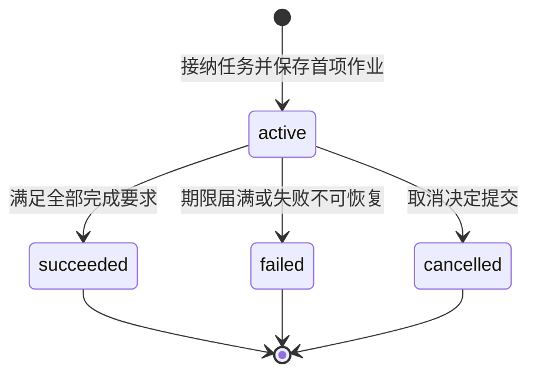
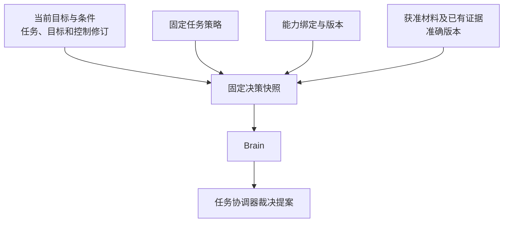
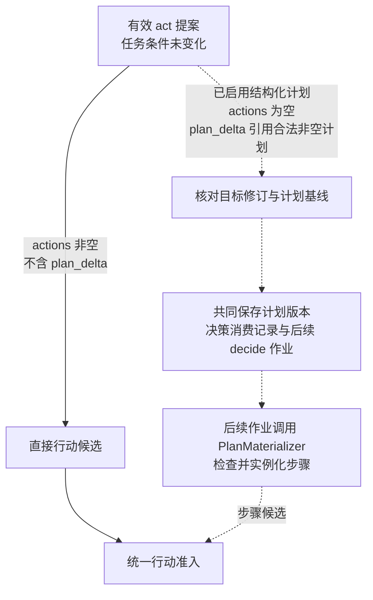
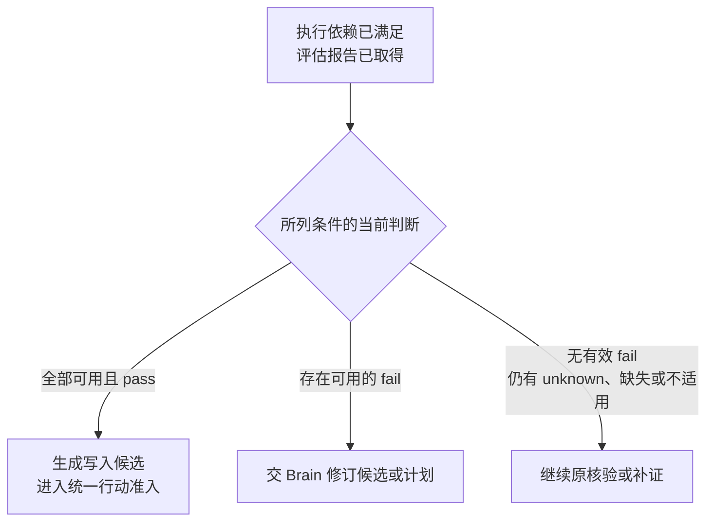

# 任务推进与控制

任务推进以当前 Task 记录为依据。编排器分别记录任务是否终结、是否暂停、当前工作缺少哪些条件，以及仍需核对的效果与费用。新工作按这些事实检查准入，原操作的核对与结算保留各自的责任。

| 维度 | 含义 |
| --- | --- |
| `status` | `active`、`succeeded`、`failed` 或 `cancelled`；任务进入终态后不再恢复为活动状态 |
| `control` | `running` 或 `paused`，记录本任务的运行或暂停选择 |
| `wait_reasons` | 输入、授权、依赖、预算、效果或容量缺口；各项分别记录所等对象与解除条件，可以同时存在 |
| `open_effects` | 效果未知或仍可能迟到的原操作，需要继续核对，并阻止与其冲突的新行动 |
| `accounting_open` | 尚未完成结算的调用或额度分配，需要保留相应预留并沿原计费项核对 |

例如，取消任务后，`status` 已为 `cancelled`，仍可能存在 `open_effects` 和 `accounting_open`：目标推进已经结束，原操作的效果与费用继续核对。

## 状态变化与终结

编排器负责提交 Task 的状态变化。图中的终点表示任务状态已经确定，原操作的效果核对与费用结算仍按各自记录继续。

暂停或新增等待原因本身不改变 `status`。暂停阻止启动新的决策、评估与行动；解除一个等待原因只更新对应项，其余等待继续保留。既有证据已满足全部完成要求时，暂停中的任务仍可提交 `succeeded`。期限届满则提交 `failed`，并记录原因 `deadline_exceeded`。

取消与成功提交发生竞争时，以先提交的终态为准。迟到的执行成功补充原操作事实和费用，不改变已经提交的任务终态。

## 修订与决策有效性

编排器为已提交的任务变化保存递增的修订号。每轮决策记录自己依据的修订，提案返回时据此检查是否仍可采用。

| 修订号 | 表示什么 | 使用规则 |
| --- | --- | --- |
| `revision` | 当前 Task 记录的整体版本 | 提交任务变更时比较，防止旧工作覆盖已经提交的新事实 |
| `goal_revision` | 当前目标及任务条件的版本 | 用户修订目标或获准的条件补全实际改变条件时递增；提案与条件证据绑定对应版本 |
| `control_revision` | 控制决定的版本 | 暂停、恢复、取消、目标修订及终态提交时递增，供执行端判别控制新旧 |

提案返回后，编排器在提交事务中重新比较所依赖的修订。修订不匹配时，保留原调用记录和费用，不依据旧提案产生新行动。后续是否重新决策，由当前任务状态与控制决定。

例如，Brain 调用期间任务先暂停又恢复，`control` 虽然重新为 `running`，`control_revision` 已经变化。旧提案仍按过期提案处理，不能因为当前显示“运行中”而继续派发。

## 固定决策输入

任务接纳时绑定一份准确的任务策略（TaskPolicy），保存其标识、版本和摘要。策略规定工具范围、确认等级、回路限额、允许的评估方式及费用模式。

决策快照（Snapshot）固定本轮使用的目标、条件与相关修订，以及策略、能力绑定、获准材料和证据的准确版本。组装时若权限变化或必需材料不可读，编排器保存具体等待原因，待条件补齐后继续。

默认 ReAct 路径直接使用 Brain 的提案。工作者先持久保存快照与固定 `decision_id` 的调用输入，再在事务外调用 Brain。恢复原调用时沿用原快照和标识；需要新一轮决策时，保存新的快照与 `decision_id`。

快照记录本轮判断的依据，行动准入仍须重新检查当前控制、授权与预算。

## 条件补全优先裁决

编排器按 `decision_id` 保存唯一的处理结论，称为决策消费记录。已有记录时返回原结论；尚未处理时，先核对当前任务修订与控制，再裁决提案携带的条件补全。

条件补全通过 `requirements_proposal` 携带，必须与当前目标修订匹配。编排器按稳定的条件标识比较完整内容，并核对原文依据与显式约束；仅调整条件排列顺序不构成变化。

| 条件补全情况 | 保存的变化与后续工作 | 同一提案的其余内容 |
| --- | --- | --- |
| 未携带补全，或内容与当前条件相同 | 不因补全增加目标与控制修订 | 继续裁决原提案 |
| 合法补全实际改变条件 | 保存新条件，递增目标、控制及任务修订，同时保存下一轮决策与控制传播作业 | 行动、完成建议及可选计划变更全部失效 |
| 缺少必要条件、未保留显式约束、降低必要性，或目标含义不明确 | 保存缺口与澄清、重新决策或用户修订所需的工作 | 不部分采纳，也不继续处理其余内容 |

改变目标含义或降低必要性，需要用户通过 `task.revise` 明确修订。决策消费记录与本次任务变更、后续作业共同提交，重复交回同一决策不会再次增加修订或创建工作。

例如，一份提案同时补全任务条件并建议写入报告。只要补全确实改变条件，本轮就不准入写入；下一轮读取新条件后再决定如何行动，并重新检查当前控制与执行前提。

## 条件未变时的提案处理

条件未变化且提案仍有效时，编排器按 `kind` 继续裁决。默认 ReAct 路径采用以下处理规则。

| 提案类型 | 编排器的处理 |
| --- | --- |
| `act`：行动建议 | 进入统一行动准入；通过后共同保存固定操作意图、预算预留与派发作业 |
| `need_context`：补充上下文 | 有界读取获准的记忆、能力声明、已有操作事实或已知内容，保存结果与缺口，供新快照使用 |
| `request_input`：请求用户输入 | 通过交互系统建立持久输入请求，记录关联条件与等待原因；回复归并后重新检查推进前提 |
| `complete`：完成建议 | 核验完整目标覆盖、准确成果版本、必要条件及效果收尾；满足全部完成要求才提交 `succeeded` |
| `fail`：失败建议 | 核对失败原因、未满足条件与恢复建议，结合当前事实决定继续等待、安排后续工作或提交 `failed` |

新的网页搜索、页面抓取或设备观察通过 `act` 提出，并经过普通行动准入。`need_context` 只用于补充已有且获准读取的材料。

相同快照下重复的上下文请求复用已保存的结果或缺口。外部依赖暂不可用时，保存具体等待对象与恢复条件，不靠连续调用 Brain 探测恢复，也不直接认定任务不可恢复。

## 统一行动准入

Brain 的行动提案、启用结构化计划后的步骤候选，以及固定策略与检查规则要求的核验行动，都由任务协调器执行同一套准入检查。每个候选保留自己的来源，用于识别重复处理。

远端依赖与授权依据先在事务外取得。以下检查与写入在同一短事务中完成：

1. **核对本轮有效性。** 确认工作者本次领取仍有效，候选依据的任务与目标修订仍匹配。
2. **检查运行条件。** 本任务必须为 `active`、`running`，且期限未到。对于同一编排器管理的内部子任务，全部祖先任务也必须处于活动、运行状态。
3. **核对来源与行动内容。** 按候选来源查询准入记录，重复处理沿已保存的操作恢复；新候选检查完整能力声明、准确绑定、参数结构与执行依赖。
4. **检查当前约束。** 核对授权与预算，确认没有阻塞本次行动的资源冲突或未决效果；存在缺口时保存具体等待或拒绝原因。
5. **共同保存获准工作。** 保存操作标识与不可变输入、原执行命令、预算预留、来源处理记录、任务新修订及派发作业。

派发前再次核对当前任务、目标、控制与期限；执行端实际启动时核验当前授权。

多个行动只有相互独立且资源不冲突时，才能以有界批次准入，每项保留独立操作身份与预留。依赖前项结果的行动，取得真实结果后再准入；GUI 操作依据新的界面观察逐次决定一个动作。

## 可选的结构化计划

结构化计划按需启用。Brain 可以提交步骤数量有限、依赖无环的版本化计划，由 `PlanMaterializer` 根据计划与已核实事实生成行动候选。默认 ReAct 继续直接使用 Brain 的行动提案。

计划变更通过 `plan_delta` 提出。安装时，编排器比较 `base_plan_ref` 与当前计划引用，并核对目标修订。首次安装要求基线为 `null`、计划版本为 1；修订现有计划时保留 `plan_id`，版本递增一版。

虚线表示启用结构化计划后才使用的路径。一次 `act` 提案只能选择直接行动或安装计划；计划中的首个行动也由后续作业生成候选，再单独准入。

每个步骤具有独立的 `step_id`。步骤准入按任务、`plan_id`、计划版本与 `step_id` 去重，重复处理恢复原操作。安装计划的 Decision 只消费一次，后续步骤各自保存准入记录。

### 步骤依赖与通过条件

`depends_on` 列出本步骤依赖的前项步骤。只有全部前项已结束、不会再产生迟到效果，且输出已核实，才满足执行依赖。前项操作失败、效果未知或仍可能迟到时，依赖不成立。

`pass_conditions` 声明本步骤要求通过的任务条件，每项绑定条件标识、规则与准确成果引用。编排器读取当前目标下对应的所选判断，并检查证据的当前适用性；所列条件必须全部当前可用且为 `pass`（通过）。

以写入步骤要求“报告质量评估通过”为例：

评估操作成功说明评估报告已经生成；报告中的质量判断仍可能为 `fail`（不通过）。此时写入步骤不能启动，也不能从历史检查中挑选另一份 `pass` 覆盖当前有效的失败判断。

步骤准入事务再次核对依赖、所选条件判断与证据适用性，确保生成候选后发生的变化仍能阻止执行。
