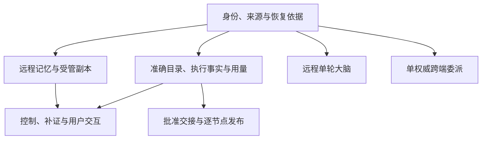

# 决策落实与剩余依赖

[整体设计](README.md) · [系统验证](validation.md) · [贯穿实例](design-walkthrough.md)

2026-09-24 的整体设计访谈已确认：本轮补齐 C1–C9、A1–A4 所需设计闭环，并同步领域契约、协议资产与验证方法。本文保留原提案编号和链接，区分已采用设计、明确后置范围与实现取证责任。采用设计不代表参考实现或运行验收已经完成。

| 状态 | 维护方式 | 完成依据 |
| --- | --- | --- |
| 已采用设计 | 第 2～5 节记录决定、范围及权威文档；详细字段、异常与恢复规则在所属模块维护 | 正文、契约、图示、Schema／示例及验证设计一致；后续设计修订仍需保持这些关系 |
| 本轮不启用 | 第 5～6 节保留需求触发条件及当前受限行为 | 出现具体目标后重新决策，不作为所有部署的统一前置条件 |
| 已有合同，待实现／配置／验证 | 第 7 节按提供方维护适配、配置与运行证据 | 所选部署取得适用证据后才能启用；文档及 Schema 通过不能替代运行证明 |

## 1. 已确定的整体分工

每个用户保持一个固定 Harness 任务写权威。支持建立在本地或云端的两种部署；选择位置不提供运行中迁移。父子内部任务共用该权威，远程大脑只承担单轮调用，远程协作端点保存交接责任，外部 Agent 保留独立运行时及原任务身份。

| 验证配置 | 要证明的能力 | 缺依赖时的行为 |
| --- | --- | --- |
| 本地参考闭环 | 本地核心、三系统、授权、内容、UI 及持久交付；内部委派与独立替换 | 缺策略／验证器不准入相关目标；本地身份和依赖齐备才可独立继续 |
| 云任务权威＋端侧领域 | 远程大脑、记忆与执行、私密数据端侧处理、跨设备交互及委派 | 云权威失联时端侧只继续已接纳且获准的有限工作，不接纳新的同用户 Harness 任务 |
| 端侧任务权威＋云侧领域 | 反向部署使用相同领域合同；云模型调用与远程 Brain 分别验证 | 本地可按当前许可接纳任务；依赖失联云端的步骤等待 |

内部远程 Agent 与外部独立运行时适配分别叠加验证，不以单一组合成功替代各能力验收。正常升级采用版本固定、排空及兼容回退；安全停用先关闭新使用，原效果仍须核对。

图表示已采用合同的主要依赖，箭头表示后者消费前者提供的依据，不代表进程位置或已启用状态。

默认领域通道已选经网关 WSS，HTTPS 承担认证、连接票据、受限恢复资格引导及大内容。完整规则见[跨端领域合同](endpoint-cloud-protocol/domain-profiles.md)。依赖远端缓存依据继续工作的离线模式默认关闭；许可、来源、控制、版本批准等适用依据均在有限窗口内成立，且平台通过验收后才可开放。全部权威及依赖在本地并可实时核验的独立部署，可以在公网断开时处理本地任务；它不借此替代原云端身份权威。

## 2. 已采用的共同依据与领域合同

| 原事项 | 本轮决定及当前设计 | 权威位置 |
| --- | --- | --- |
| 身份 P1 | 补齐主体／owner／来源绑定、许可使用与受信确认、快照连续恢复及应用回执、离线证明；首次恢复使用独立受限资格，不依赖尚未恢复的业务许可 | [身份合同](identity-and-authorization/contracts.md)、[身份验证](identity-and-authorization/validation.md#proposals) |
| CE-P1 | 固定准确声明、版本／摘要、当前发布与实例依据、来源、控制及预算；网关类型声明不替代可执行能力声明 | [目录与合同](capability-and-execution/catalog-and-contracts.md)、[执行验证](capability-and-execution/validation.md#proposals) |
| CE-P2 | 执行权威按原操作提供完整事实投影、业务修订及可信累计用量；较旧修订不覆盖新事实，冲突不被新修订掩盖。硬费用保证仍依赖提供方落实 | [执行恢复](capability-and-execution/execution-and-recovery.md)、[执行验证](capability-and-execution/validation.md#proposals) |
| 完整取消答复 | 任务与执行分别查询原取消的固定答复，区分未固定、已清理、无权和恢复缺口；不以当前效果重建过去答复 | [内核接口](task-kernel/storage-and-interfaces.md)、[协议取消](endpoint-cloud-protocol/recovery-and-control.md#cancel) |
| MS-P1 | 版本化记忆访问、修改核对与只读获准视图，固定切点和连续变化，权限／删除缺口关闭相关使用 | [记忆合同](memory-system/contracts.md)、[视图恢复](memory-system/synchronization.md) |
| CO-P1 | 远程协作端点保存原委派与交接记录；内部子接纳回到原固定任务权威，受限配置和父预算份额进入创建事务。外部沿原生任务恢复 | [协作接口](coordination-and-cloud/peer-contracts.md)、[委派恢复](coordination-and-cloud/delegation.md) |
| BS-P1 | 独立远程 Brain 接纳固定 work／attempt、输入和调用资格，提供原调用查询、取消、停止事实及用量；无独立任务生命周期或工具循环 | [大脑合同](brain-system/contracts-and-runtime.md)、[大脑验证](brain-system/validation.md#proposals) |
| 来源与内容管理 | 精确来源当前证明、引用有限保留、原控制查询及关闭回执纳入跨端合同；HTTP 上传与远端可读取性分别判定 | [共同来源](content-and-provenance.md)、[跨端合同](endpoint-cloud-protocol/domain-profiles.md) |

上述合同均须同步机器资产及异常用例。恢复资格、proof 引用和消息 ACK 分别只证明其声明的事实，不能直接开放行动、正文读取或用户批准。

## 3. 已采用的任务控制与交互

| 事项 | 本轮决定、主要代价与边界 | 权威位置 |
| --- | --- | --- |
| 暂停／恢复 | 在动作边界阻止本任务及受控子树后续目标行动；已开始有界动作可结束，可能已派发的动作继续原身份核对。外部不支持或失联项单列，不能报告全树已停；恢复仅解除对应暂停原因 | [任务生命周期](task-kernel/lifecycle.md)、[协作控制](coordination-and-cloud/delegation.md) |
| 暂停期间完成与输入 | 保存事实、有效输入及补证，正常完成等待显式恢复；完成先提交则保留终态。暂停不冻结期限，不阻止取消、到期和必要收尾 | [任务生命周期](task-kernel/lifecycle.md) |
| 预算调整 | 用户可调整本方目标／收尾限额及内部份额；已消费、未知预留与未封账委派份额不得抹去。追加不解除暂停、不延长截止，终态仅可补原收尾额度；外部委派上限不原地扩大 | [决策与预算](task-kernel/decision-and-work.md)、[内核接口](task-kernel/storage-and-interfaces.md) |
| 整体目标编辑 | 沿现行选择创建关联新任务；可复用仍获准材料，原任务取消或收尾另行处理 | [任务生命周期](task-kernel/lifecycle.md) |
| 人工核验材料 | 接纳绑定原任务／条件的候选材料，交实际事实权威核验；材料接纳、验证通过和任务完成分别记录，人工断言不强制改变效果 | [内核接口](task-kernel/storage-and-interfaces.md)、[执行处置](capability-and-execution/validation.md#management) |
| 外部 Agent 普通交互 | 固定原委派、外部请求及修订，分别查询本方接纳与外部应用；追加权限走受信授权流程，扩大原目标／许可上限须新委派 | [外部交互](coordination-and-cloud/delegation.md#external) |
| UI-P1 | 新设备可读取获准任务／surface 分页目录并显式订阅；代价为目录披露、固定切点及订阅保留责任 | [交互合同](application-and-interaction/contracts-and-storage.md) |
| UI-P2 | 远程管理复用所属领域的控制、授权、补证与记忆合同；UI 不产生独立权限或效果裁决 | [交互恢复](application-and-interaction/interaction-and-recovery.md#management) |
| UI-P3 | 核心提供固定中间投影及完整来源，输入明确依赖必需预览；内容不可取或已失效时不允许按旧材料提交 | [交互恢复](application-and-interaction/interaction-and-recovery.md#projection)、[交互验证](application-and-interaction/validation.md#proposals) |

## 4. 已采用的数据治理与自动化

### 4.1 受管副本清理：MS-P2／OI-P2

清理范围覆盖框架控制的端侧、云侧记忆、索引、任务材料、模型处理副本、UI 缓存及评测派生物。各持有者在使用／派生前登记完整来源和有限责任，来源权威传播关闭，各端分别返回停止使用、载体清理及残留。外部供应方和用户导出仅按实际支持能力报告；要求确定清理期限的资料不进入无法兑现的路径。

接受离线设备及备份使物理清理长期未完成，状态不得被到期或消息 ACK 自动结清。离线窗口受资料、许可、来源和部署上限约束；已知关闭阻止新使用，未知远端变更只在明确批准的有限窗口内继续。详细规则归[记忆治理](memory-system/mechanisms.md)、[共同来源](content-and-provenance.md#closure)与[评测数据](observation-and-improvement/observation.md#data)。

### 4.2 批准后的自动交接与撤回：OI-P1／ER-P1／ER-P2

采用自动交接已批准的精确版本和有限批次、激活前复核、原命令查询、逐节点回执及撤回停用。旧版满足预批准的精确产物、依赖、当前格式和信任条件时自动回退；受阻时保留实际停用事实与恢复缺口。扩批仍由明确批准决定，模型及评测通过不产生发布批准。

活动版本的批准新鲜度与业务行动许可独立检查。失去远程批准依据时仅可在预先批准的有限窗口内继续，离线期间不激活新版本或扩批；到期禁止新使用，不保证旧外部调用已经结束。详细规则归[改进与启用](observation-and-improvement/improvement.md)、[扩展合同](extensions-and-runtime/contracts.md)。

### 4.3 终态提取：MS-P3 采用，OI-P3 自动候选后置

用户按任务类别主动开启自动记忆提取，仅在原任务成功终态持久提交后触发。应用策略按原终态修订和策略版本去重，创建具有独立来源、用途许可、期限及用户额度的提取任务；失败、取消与效果未知任务保留显式提取入口。提取失败不改变原结果，也不产生发布批准。

改进候选继续显式触发，未采用自动候选生成。正常记忆更新按原授权生效；若声称收益，仍须另给评测证据。详细规则归[记忆集成](memory-system/contracts.md#integration)及[改进入口](observation-and-improvement/improvement.md)。

## 5. 持续运行与明确后置的能力

| 事项 | 本轮决定 | 重新进入设计的条件／依据 |
| --- | --- | --- |
| ER-P2 跨节点制品与管理回执 | 已采用逐节点准备、激活、停用与回退；允许部分成功和未知，保留原管理责任 | [扩展合同](extensions-and-runtime/contracts.md)、[扩展验证](extensions-and-runtime/validation.md#proposals)；全节点原子发布仍不承诺 |
| CO-P2 运行中任务权威迁移 | 后置；建立用户权威时选本地或云，失联不接管 | 明确要求运行中换权威时，再落实全用户操作索引、唯一裁决、原消息身份及旧入口隔离；[CO-P2](coordination-and-cloud/validation.md#proposals) |
| 跨执行端自动接替 | 后置；原端原操作核对，未知副作用不换端重做 | 有原账本迁移、旧实例隔离和物理设备唯一入口的可验需求；[执行部署](capability-and-execution/execution-and-recovery.md#deployment) |
| 端端直连 | 后置；跨端使用已定义网关路径 | 无网关跨设备协作成为明确需求，且接入、身份及路由来源可验证；[协议范围](endpoint-cloud-protocol/README.md#scope) |
| ER-P3 在线替换与格式迁移 | 后置；正常升级排空，未知效果可阻塞升级，安全停用先封闭新使用 | 明确组件及不能等待排空的需求，才设计多版本并存、格式迁移和失败恢复；[扩展替换](extensions-and-runtime/installation-and-isolation.md) |
| 已确认账本不可恢复的数据损失 | 保留安全关闭与可解释缺口；新身份不能重做原未知操作 | 实际事故若要求放宽保证，按受影响责任另决；正常备份实施归第 7 节，[灾后恢复](extensions-and-runtime/lifecycle-and-recovery.md) |

## 6. 后续范围：本轮不启用

下列增强未纳入本轮采用范围，继续保留现行受限行为。它们不阻塞已选项目目标的设计闭环；出现表中需求时再提出具体方案。为现有合同填入型号、配额或适配器的工作归第 7 节。

| 后续事项／归属 | 采用前需回答的问题与现行选择 | 来源 |
| --- | --- | --- |
| 账号合并与身份权威迁移；身份 | 本地与外部账号、签发方及已有许可如何关联、迁移和防重放；不能由 CO-P2 的任务账本迁移代替。当前拒绝账号合并／本地身份权威迁移，本地身份不能冒充原云端签发方 | [身份模型](identity-and-authorization/contracts.md#identity) |
| 通用设备配对与远程自助登记；身份／接入 | 如何取得并验证设备凭据、绑定端点及活动实例、处理重复登记和撤销。当前由受信适配器安全登记；没有适配器就关闭远程自助登记，与身份 P1 的授权同步分别处理 | [登记边界](identity-and-authorization/contracts.md#identity) |
| 账户恢复与运营人员代操作；身份 | 恢复根依据、代理范围、敏感变更及审计／撤回语义。当前管理入口限本人受信认证，Agent 和后台服务没有隐含资格 | [管理接口](identity-and-authorization/contracts.md#interfaces) |
| 多写者记忆、界面及其权威迁移；记忆／UI | 明确是否需要共同离线编辑，再分别定义冲突合并、修改／输入消费去重及旧权威隔离；任务 CO-P2 不覆盖这些独立账本。当前各对象保持固定单一权威 | [记忆范围](memory-system/README.md#scope)、[UI 范围](application-and-interaction/README.md#scope) |
| 任意聊天历史同步与跨端已读；UI | 历史对象、来源和保留、获准订阅、展示／已读证明分别如何定义。当前任务／surface 目录不代表完整聊天历史，实际展示仅是本端遥测 | [UI 范围](application-and-interaction/README.md#scope)、[呈现与遥测](application-and-interaction/contracts-and-storage.md) |
| 语义向量检索；记忆 | 嵌入处理位置、向量存储／删除、模型／维度／版本及召回收益；当前采用本地字面候选，向量检索关闭 | [检索选择](memory-system/mechanisms.md#retrieval) |
| 未知模型调用的风险配额；大脑／内核 | 优先补供应方查询／终止保证；若仍要提高无可信终结后端的可用性，另决风险上限及并发／预算保证。当前未知占位和预留保留，到限停主动查询，不提供忽略未知开关 | [调用恢复](brain-system/contracts-and-runtime.md#recovery) |
| 多模型投票／竞速、在线提示词／策略改变；大脑／改进／扩展 | 额外调用的质量收益能否覆盖成本，逐调用账务与来源如何保持；自动启用还需 OI-P1／ER-P1。当前单模型固定配置，策略修改产物只进入候选及受控发布流程 | [大脑范围与取舍](brain-system/README.md#scope) |
| 多使用单元及长流调用；执行／身份／内核 | 逐单元许可、预算、进度、取消和恢复边界；当前一次 Invoke 只有一个有界单元，长流程由内核逐操作准入，不由驱动自动续跑 | [能力声明](capability-and-execution/catalog-and-contracts.md#declaration) |
| 连续音视频与内容分片续传；协议／内容提供方 | 媒体会话或分片、完整性、逐段授权和恢复如何契合现有责任。当前 WSS JSON 加 HTTPS 完整内容；v1 不要求分片续传，音视频须另扩媒体通道 | [传输选择](endpoint-cloud-protocol/transport.md)、[内容通道](endpoint-cloud-protocol/transport.md#content) |
| 真实手机与通用不可信插件支持范围；执行／宿主 | 选择真实平台、权限／驱动和隔离保证；已有受信驱动及隔离接缝的实现归第 7 节，通用支持不能由模拟或单一平台外推。当前模拟 GUI 及受信组件按已具备条件开放 | [执行范围](capability-and-execution/README.md#scope)、[运行依赖](extensions-and-runtime/validation.md) |
| 标准 trace 传播、跨节点评测调度、生产随机对照；观测评测 | 分别定义跨端追踪载荷及数据用途、远程评测任务／结果责任、稳定分组和完整分母；三者可独立选择。当前依关联标识诊断和隔离成对评测，不因采用追踪工具修改 WSS 信封 | [后续范围](observation-and-improvement/validation.md#proposals)、[监测边界](observation-and-improvement/improvement.md#monitoring) |

跨用户共享、企业角色管理、不可信中继、通用策略引擎等范围排除不自动转为建设待办；确有新目标时重新评估。自动全量扫描个人数据也不因采用终态提取而获准。

## 7. 已有契约的提供方、配置与验证依赖

本节用于检查当前选定闭环能否装配。这里已有职责或合同，欠缺的是具体提供方、配置或运行证据；不能以这些工作未完成，重新声称授权、来源、交付或验收规则尚未设计。

| 待交付内容／负责方 | 应固定的配置或证据 | 缺席行为与依据 |
| --- | --- | --- |
| 任务策略、验证器与能力包；应用策略／内核／执行 | 支持目标类型、条件绑定、验证器与版本、文件／联网／模拟 GUI 的准确声明及独立判定证据 | draft 不派发目标行动；必要验证器／证据缺失不报告完成，未知效果不重做。[内核依赖](task-kernel/recovery-and-validation.md#gaps)、[贯穿实例](design-walkthrough.md) |
| 模型及提取／评估配置；大脑与相应能力提供方 | 具体模型、权重／服务版本、硬件、处理位置、用量及停止／查询能力、费用和质量验证；所用模型动作规范化器与受控出口 | 不支持的能力明确声明；无当前使用资格不发送，未知账务和占位不释放。[模型 profile](brain-system/contracts-and-runtime.md#model-profile)、[大脑依赖](brain-system/validation.md#dependencies) |
| 内容、来源与记忆索引；内容／来源权威／记忆 | 耐久字节、精确来源与当前证明、保留／清理、真实连接器、索引水位及删除；公开内容的时效策略 | 来源解析器缺失不提取／保存相关外部资料；索引可降为有界扫描或 partial；必要内容不可取不完成。[共同交接](content-and-provenance.md#validation)、[记忆依赖](memory-system/validation.md#dependencies) |
| 领域与消息账本、UI 本端耐久意图；所属领域／交付／UI | 原身份与原子交接、恢复扫描、固定回执、控制／收尾空间；纯浏览器也需可恢复本端意图，业务输入适配器须独立耐久消费 | 持久交接不足不确认接纳；仅获消息 ACK 不确认业务完成；不能只凭浏览器内存承诺重启后关闭意图。[交付存储](coordination-and-cloud/delivery-and-recovery.md)、[UI 依赖](application-and-interaction/validation.md#gaps) |
| 本地委派与 Agent 适配器；协作／内核／Agent 提供方 | 固定受信声明、目标／结果及配置版本；受限子配置和父已预留预算份额进入 Submit 事务，原委派接纳查询、取消、结果与累计用量可核对 | 无受限配置适配就不提供可派发候选，不降级为不受限普通 Submit；外部配置缺必要保证时禁用。[协作依赖](coordination-and-cloud/validation.md#dependencies)、[子任务装配](coordination-and-cloud/peer-contracts.md#interfaces) |
| 受信宿主、身份、隔离、时间与备份；运行宿主／身份／平台适配器 | 真实用户确认、资源规范化、受控出口、旧实例隔离、可信时间、防回滚及独立于旧快照的完整命令／删除尾部 | 无隔离不接替或装载相应第三方代码；离线条件不齐则关闭；旧备份只作诊断，不凭快照重新开放行动。[身份依赖](identity-and-authorization/validation.md#dependencies)、[运行依赖](extensions-and-runtime/validation.md)、[记忆恢复](memory-system/validation.md#dependencies) |
| 扩展制品、安装与生命周期适配器；扩展／所属领域 | 将已有包编码、摘要、安装锁及管理合同落实为机器可读资产、SDK 和制品；提供原命令查询、目录发布、排空／引用证明及当前格式的回退验证；维护入口核验精确批准 | 缺批准不激活，缺生命周期适配器不开放对应恢复／升级／卸载；安装或停用回执不代表旧版已恢复。[本地契约](extensions-and-runtime/contracts.md)、[依赖与交付](extensions-and-runtime/validation.md) |
| 评测环境、独立取证与采集；观测评测／环境提供方 | 隔离创建和原实例查询、只读真值、输入脚本、受信轨迹、固定评分、封闭及清理；生产测量另须实际版本绑定和完整样本框架 | 缺必需环境适配器不接纳相应计划；取证缺失保留覆盖缺口，不从日志猜效果。未封闭旧写入及在途责任前，不销毁或以新环境掩盖原动作。[评测依赖](observation-and-improvement/validation.md#dependencies)、[环境合同](observation-and-improvement/contracts.md#environment) |
| 系统验收与容量配置；各领域共同提供证据，评测汇总 | 冻结部署／实现／能力范围、Dataset／EvaluationPlan、样本与判定器、预算和故障切点；按到达率、活跃任务、模型并发、内容量与恢复积压确定限额及阈值 | C1–C9、A1–A4、V1／V2 和成熟度分别取证；千项 API、90%／95% 与服务规模仍是目标，单次演示、Schema 或在线连接数不证明达标。[系统验证](validation.md)、[评测计划](observation-and-improvement/contracts.md#plan) |

离线是一组共同成立的条件：有效许可、当前 owner、唯一防回滚账本、可信时间、来源新鲜度、本地依赖、剩余预算及控制资格。缺少平台实现时关闭相应离线行为；身份 P1 已定义跨端证明及恢复合同；签名验证、可信时间、防回滚与平台适配仍须按部署取得运行证据。

## 8. 后续维护与交付检查

采用范围发生变化时，先修改负责模块的规则、调用方缺席行为及验证，再同步协议资产与本页状态。已完成设计的事项转为提供方／配置／运行取证责任，不再以“协议尚未定义”阻断它们；具体实现缺少必需保证时仍关闭对应行为。

本轮覆盖十个模块及共同来源、整体贯穿链和系统验收。语义审查应同时推演正常交接和接纳答复丢失、暂停与完成竞争、撤回与激活竞争、来源删除及离线恢复。Schema／关联检查、链接、图示渲染与运行验证分别记录，不从静态通过推出 L2–L4。

本次落实及验证结果见[交付检查记录](maintenance/design-closure-2026-09-24.md)。历史审查依据见[审查与修订记录](maintenance/review-2026-09-24.md)。UI-P0／CO-P0 导航维护、内容提供端基础交接、停用与旧版恢复区分已有设计，继续维护其一致性。
