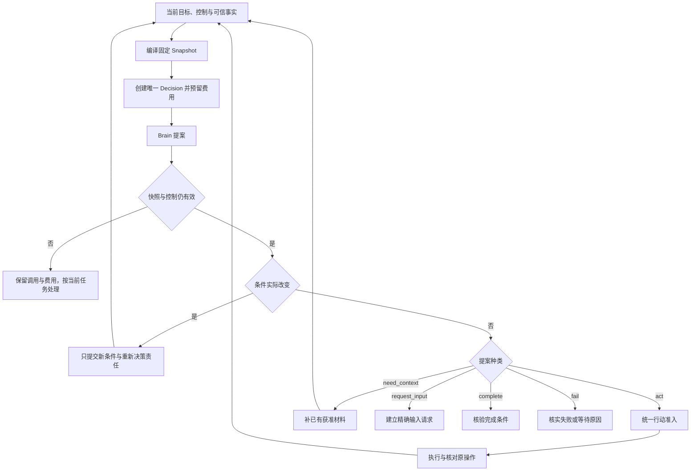

# 任务编排与完成裁决

Orchestrator 持有目标推进责任。它把用户要求转成可检查的条件，固定每轮决策输入，准入有界行动，并根据实际证据裁决完成。Brain 的提案和 Executor 的回执都是输入，均不能直接改写 Task 终态。

默认采用单 Task 串行裁决、跨 Task 并行。它牺牲单一热点任务的无限写吞吐，换取控制、预算和完成的一致判断；通过任务分片和有界委派扩展总体容量。

## 1 持久模型

Task 至少保存：固定 task_id/orchestrator_id/submit_command_id，原 goal_ref，goal_revision、control_revision、revision，准确 TaskPolicy，deadline，状态、控制、等待、当前条件和预算关联。

- status 为 active、succeeded、failed、cancelled。后三者不可回到 active
- control 为 running 或 paused。暂停不是终态；等待是独立的、可以并存的依赖集合
- goal_revision 随目标或条件的实质变化递增。control_revision 随暂停、恢复、任何目标终态、目标修订及有效祖先控制变化递增；终态与向全部已绑定Executor传播TaskGate的Job共同提交
- revision 表示 Task 的可见业务修订。事实归并必须比较自己依赖的修订，不能把旧提案重新标成当前

OperationIntent、DecisionConsumption、PlanStepAdmission、ConditionCheck、GoalCoverage、BudgetReservation 和 Job 各保存准确关联。它们是 Task 内部职责记录，不新增公共执行权威。

当前未结效果、子委派及控制目标使用完整内部关联索引。公开响应返回 `CollectionSummary{collection_revision,total_count,unresolved_count,items_cursor}`，每页最多100项；计数、集合变更和 Task 修订共同提交。超出一帧不会截断事实。完成仍在原库核验完整索引和完整性标记，不信客户端页、缓存计数或异步汇总。这是本系列新增的集合合同。

## 2 把目标变成条件

每项 Requirement 保存稳定 requirement_id、kind=effect/quality、原要求 source_ref、固定 rule_ref 和 required。规则规定对象、时点、覆盖范围、允许的判断方式及通过标准。

对于报告任务，至少有：比较覆盖、引用支撑、指定目录写入、准确版本读回。文件写入成功不能替代内容质量；质量总分也不能抵消必要读回失败。

条件生成后还须做目标覆盖核验。GoalCoverage 固定完整原目标、全部条件摘要、规则/实现、映射报告及 pass/fail/unknown。核验输入不能只含条件提议者自行摘出的条款。受限模板可确定性映射；自然语言目标用受控语义评估并明示局限。

Brain 可以补条件，不能删除显式要求、降低必要性或改变用户目标含义。同一提案含有效条件变化和行动/完成建议时，只提交条件与新 goal_revision，消费该 Decision，其余建议全部失效；重新决策后才可能行动。条件内容相同不制造修订。这保留 [ADR 0006](../../adr/0006-adopt-requirements-before-actions.md) 的一次清晰交接。

## 3 一轮推进怎样提交

Snapshot、固定decision_id的DecisionDispatchIntent、原 Brain 命令、计数、预留和派发责任共同提交。Brain在自己的接纳事务创建Decision；只有明确共用同一Tx的装配可以合并这次交接。Brain 返回后，以 `(task_id,decision_id)` 唯一消费。暂停再恢复即使 control 又为 running，control_revision 已变，旧提案仍不可采用。

`need_context` 只能读取已有且获准的记忆、能力声明、内容或原事实。新搜索、网页抓取、手机观察都是行动，走 act。缺依赖时等待具体对象，不反复调模型探测恢复。

事实归并按 `(owner_id,object_id,revision)`：同修订同摘要幂等，同修订异摘要报冲突，旧修订不能覆盖新投影。新事实、当前效果集合、预算累计差额、Task 修订及后续 Job 同事务保存。终态仍接收真实效果、费用和证据缺陷，不能因此重开目标工作。

## 4 统一行动准入

四类来源使用同一准入规则：Brain Decision、固定 Plan 步骤、受信条件/覆盖检查、已获准程序Operation的hostcall。hostcall唯一键为(parent_operation_id,call_position)，固定input_digest、原Task/目标和environment_generation；只有认证Executor可提交，并核验原父Operation、环境及全部普通门禁。每类都有唯一来源键；核验器不能伪造 Brain 提案，插件也不能自报受信检查来源。

先在事务外完成所有会改变业务含义的模板、hook、资源规范化和参数绑定。固定最终金额、收件人、路径、正文、筛选、用途、Capability/Binding/InstallLock 版本。prepare 阶段不执行目标动作，也不消费该目标动作的一次性许可；准备所需资料的读取和处理仍须独立授权、计量。

随后进入一个短事务：

1. 锁定 Task 及有界祖先链，验证有效领取、当前 goal/control/策略与期限
2. 检查来源尚未消费，完整参数满足准确 Schema；确认不存在会阻塞本行动的未决效果或资源冲突
3. 检查当前授权依据、预算、累计续行上限和本地容量
4. 同时保存不可变 OperationIntent、原执行命令、reservation、来源处理决定、未结集合关联与 dispatch Job

并行准入只适用于独立且不冲突的行动。依赖前项输出时等真实结果；GUI 每次变更之后重新观察，不能批量预批一串点击。派发和实际启动分别再查当前门禁，事务外远端资格按其有限窗口使用，不伪装成跨库原子读。

## 5 计划是候选生成器

默认 ReAct 足够。可选 Plan 是有界 DAG，固定 plan_id/revision/goal_revision、步骤、depends_on、pass_conditions 和参数模板。它不拥有第二个执行状态机。

计划安装比较 base_plan_ref；同提案的直接 actions 与 plan_delta 互斥。步骤准入键为 `(task_id,plan_id,plan_revision,step_id)`。Materializer 只复制字面量或从已核实原输出用固定 JSON Pointer 取值，不能执行表达式、网络或隐藏模型调用。未来step_output沿本计划版本的唯一PlanStepAdmission解析前项Operation/Delegation，固定已核实输出引用；目标指针只可写arguments或委派goal/input，禁止修改能力、主体、Grant、预算和控制。

默认前置 Operation 已关闭、effect=applied、无迟到效果且准确输出可用，才算执行依赖完成。评估 Operation 成功不意味着评估 verdict=pass；pass_conditions 必须引用当前所选且适用的条件判断。缺字段、版本变化或有效 fail 交给 Brain 修订，不从历史挑一个 pass。

修改计划使未准入旧步骤失效，已准入 Operation 保留。新计划复用旧成果需明确绑定准确旧输出并重查适用性。计划复用收益必须计入模板制作、失配、回退和维护成本，不能只报减少模型调用。

## 6 用户控制与内部子树

| 决定 | 新目标工作 | 已发生或可能发生的工作 |
| --- | --- | --- |
| pause | 停止新 Decision、评估和行动 | 原效果、费用、控制和清理继续核对；既有充分证据可完成 |
| resume | 仅解除本任务自身暂停，重查其余门禁 | 不清等待、不重置期限与累计费用 |
| cancel | 持久提交 cancelled，保存逐端控制责任 | 不宣称外部已停；迟到 applied 只补原事实 |
| revise | 新目标修订使旧提案和未派发候选失效 | 旧在途操作仍核对；冲突新动作等待旧效果核清 |

同 Orchestrator 的子任务在创建和准入时锁真实祖先链，父暂停限制子有效控制；父恢复不解除子自身暂停。默认最大深度4、每父活跃子数8，并另设整个活动子树总数上限64，确保控制事务锁集合有界。超限拒绝新子创建，不分页漏掉原子控制范围。

父取消先提交则新子创建失败；子创建先提交则被父控制覆盖。目标修订在同域事务取消旧目标活动子树，保留其效果及账务责任。跨 owner 的委派通过原命令关闭，只有对方确认才能声称停止；参见[协作](../collaboration/README.md)。

取消和成功竞争以先提交的终态为准。Task 截止到达时，若尚未成功，则 failed/deadline_exceeded；已发生效果不因此变成未发生。终态后改变目标，创建关联原任务的新 Task。

## 7 有限自主推进

固定 TaskPolicy 给出 continuation、repair、连续无进展、模型费用、单步尝试、上下文补充和总期限。初始试验值为100次累计续行、每轮最多3次补上下文、同一步最多2次额外安全尝试；产品档位可收紧，不能动态放宽以追求成功率。

新 Decision 或新的计划步骤准入各消费一次续行额度，重派同身份不重复计数。有效新输入、目标变化、可用结果或 unknown 核清可清零连续无进展；累计额度不清零。通知、账单变化、领取和轮询时间不算目标进展。每个原 Decision 的无效输出最多记一次。

达到上限后，有明确可恢复对象则保存等待和 resume_condition；期限或累计额度耗尽则按策略结束目标推进。原效果和费用仍核对。新调用更便宜、换 Brain 或重启都不能重置计数。

## 8 完成事务

完成前，先在事务外取得必要正文和检查报告。需要新模型评估时用普通 Operation、授权及预算；verify Job 不得绕过暂停。

最终事务锁定 Task，确认仍active、截止未到且目标/条件/成果修订匹配，再按稳定键锁证据 gates 和当前检查：

1. 目标覆盖记录对应当前完整目标及条件集合，适用且 pass，无遗漏
2. 每项必要条件都有当前适用的 pass；绑定准确成果、规则、目标修订、资源、观察时点与覆盖范围
3. 完成所依赖的全部实现未命中当前已登记缺陷；跨域资格凭据满足策略窗口
4. 当前未结关联索引完整；全部已准入目标Operation已closed，未发送者也已永久封闭；没有 unknown 或仍可能迟到效果；内部子任务终结，外部目标行动已封闭
5. 共同保存固定 Result、选择的检查、门禁修订、succeeded、控制和必要收尾 Job

新 Operation/Delegation、条件变更与同一 Task 锁串行，因此不能在读到空集合后悄悄新增。费用尚未最终核清可以独立继续，但预留及结算责任保留。

Result.completion_basis 取必要条件中最弱依据：有用户验收则 user_accepted；否则有开放质量评估则 assessed；其余 verified。用户验收只替代允许验收的质量条件，不能消除必要效果、遗漏或未知。验证器正常退役不推翻旧证据；确认缺陷才按范围失效，已成功 Result 不改写，另附明确说明。

## 9 接口与访问边界

外部命令为 task.submit/pause/resume/cancel/revise/input/accept_result/adjust_budget/attach_evidence/billing_reconcile；查询为 task.read/result/list。所有改变均采用原命令去重。状态控制使用 expected_revision；异步账单唤醒按原来源修订合并，不要求发送者猜 Task 当前 revision。

task.input 绑定准确 InputRequest/request_revision/goal_revision 和回答 ContentRef，在一个事务中消费请求、保存回答、业务变化与后续责任。重复输入返回原决定；新目标不能消费旧请求。task.accept_result 还绑定准确成果和可见限制。

热点访问只取当前目标、当前检查、完整未结索引与有限祖先，不每轮扫描全部历史。历史审计与重建分页执行。公开集合分页不能作为完成证据。具体并发、漏项、陈旧证据与收尾测试见[验收设计](../validation/README.md)。
