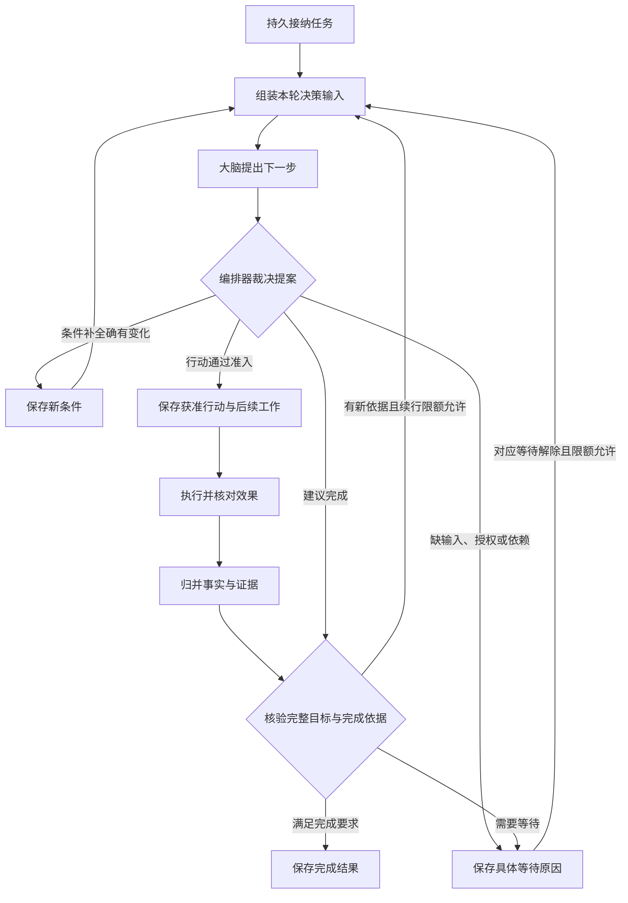
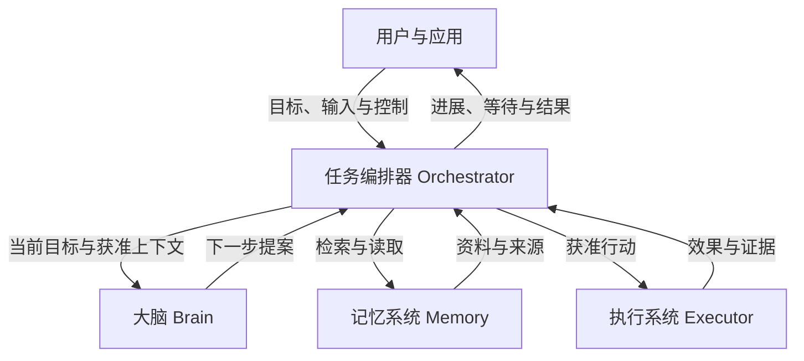
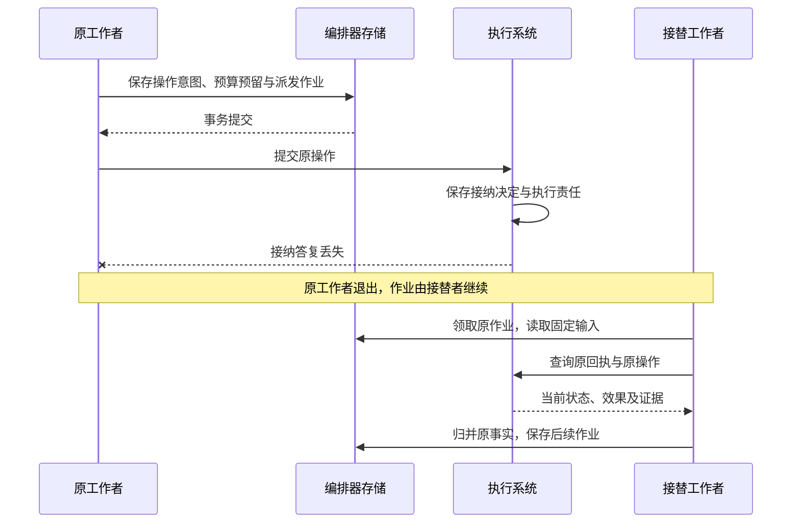
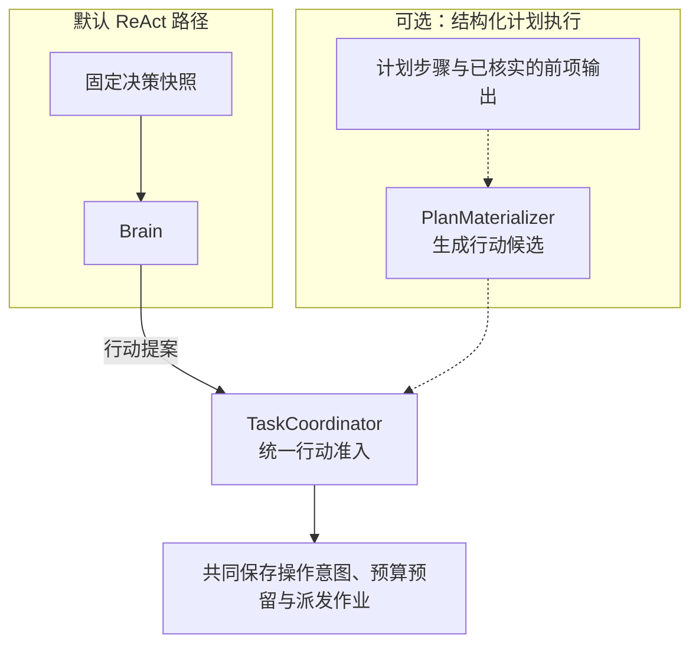

# 任务编排器：从报告目标到完成结果

用户要求比较两个软件版本、附上来源，再把报告保存到指定目录。取得资料、生成报告、保存和独立读回相互依赖，任务编排器（Orchestrator）在每一步取得事实后决定下一步。它将这个持续的目标保存为 **Task**，记录当前要求、已有依据、尚缺条件和剩余额度，直到可以提交完成结果，或需要等待、失败、取消。

应用通过 `task.submit` 提交目标，用 `task.read`、`task.result` 查看任务及成果。每个 Task 固定一个逻辑编排器；它可以由多个共享权威存储的实例承载。工作进程接替时继续读取原记录，不改变任务归属；对话会话的关闭或归档也不结束这个目标。

大脑（Brain）负责根据已有材料提出下一步，执行系统（Executor）负责实际读取、写入并核对效果。编排器决定哪些建议可以启动，以及取得的事实是否足以完成。

本页沿报告任务介绍正常推进、交接和控制。实现者随后阅读[任务推进与控制](task-lifecycle.md)、[记录与字段](records.md)、[内部实现](implementation.md)；完成核验、预算和恢复分别在[验证](verification.md)、[预算](budget.md)、[持久工作与恢复](durable-work.md)中展开。[核心模型](../core-data-model.md)解释跨模块对象，[共同契约](../contracts/README.md)定义调用与回执。

## 从目标到任务条件

用户目标说明要完成什么，**任务条件（Requirement）**将它展开为可以逐项检查的要求。编排器保留原始目标与显式约束，并记录条件与原要求的对应关系。其中，**效果条件**检查目标系统中实际发生的变化，**质量条件**检查成果的准确性、覆盖范围等内容要求。

以“比较两个软件版本的差异，附上来源，并将报告保存到指定目录”为例：

| 任务条件 | 类型 | 完成所需的依据 |
| --- | --- | --- |
| 比较准确且覆盖指定范围 | 质量 | 实际取得的资料，以及针对准确报告版本的质量评估 |
| 来源能够支撑报告结论 | 质量 | 报告中的结论与来源正文的对应关系 |
| 报告已保存到指定目录 | 效果 | 准确路径、写入结果，以及与报告版本一致的读回证据 |

大脑可以建议补充任务条件，编排器负责核对这些建议与原始要求的对应关系，并保留用户的显式约束。每项必要条件分别核验，尚缺的依据成为后续行动或等待的具体原因。

固定条件时同时保存目标覆盖检查责任。条件提议与覆盖核验分别作出：前者提出如何拆解目标，后者检查拆解是否遗漏原要求。覆盖核验可以复用当前适用的报告；需要新的语义判断时经过普通行动准入。具体记录及完成要求见[目标覆盖核验](#goal-coverage)。

创建 Task 时固定准确 TaskPolicy，规定允许的能力、确认等级、回路限额、评估方式及费用模式。开放式问答可以使用通用质量评估；涉及具体对象、金额或发布范围等会改变行动含义的歧义时，先取得用户输入。计划和模型解释不能覆盖原显式约束。

## 任务推进闭环

编排器将当前目标、任务条件、已有事实和获准资料组成一轮决策的输入。大脑返回提案后，编排器检查任务状态、能力、授权、预算及执行前提，将符合要求的行动建议确定为可派发的工作，这个过程称为**行动准入**。

同一提案同时包含有效的条件变更和行动建议时，编排器先保存新条件，再基于新目标重新决策；条件未变则继续处理本轮建议。每次启动新决策或行动前，都重新检查当前控制、期限、授权与预算。

长任务的[固定决策输入](task-lifecycle.md#fixed-decision-input)从当前权威目标、控制和原效果机械重建；摘要不能取代这些事实。大脑发送给模型的最终请求还要核验实际字段、来源、接收方与大小，并保留本轮输入与调用依据。

任务的[进展与停止依据](task-lifecycle.md#bounded-progress)按原可信反馈持久保存；重复通知、重启或会话切换不清累计次数。缺少新的有效输入时保存具体等待，达到固定限额后按策略停止自主续行，原效果和费用仍继续核对。

## 协作边界

大脑提出行动建议，记忆系统提供决策材料，执行系统核对实际效果；编排器结合这些信息更新任务进展，并判断是否满足完成要求。图中节点表示逻辑职责，组件可以同进程装配，也可以分别部署。

一次固定输入的判断称为 **Decision**，由 Brain 保存；其中的下一步建议称为 Proposal。编排器消费建议后形成的固定行动意图交给 Executor，后者保存 **Operation** 的接纳、实际尝试和效果。Content 提供准确版本的材料，Grant 提供本次使用所需的许可。各组件保存自己的事实，编排器按原身份引用它们。

| 交接 | 接收方已经承担的责任 | 答复丢失后的继续方式 |
| --- | --- | --- |
| 应用提交目标 | Task、原提交回执与首项工作共同保存 | 应用查原 command；编排器恢复原工作，不要求重新提交目标 |
| 编排器提交固定 Decision | Brain 保存原输入及推进责任；形成提案后仍待任务准入 | 查原 Decision；Brain 按原模型调用核对结果与用量 |
| 编排器派发固定 Operation | Executor 保存接纳决定及执行、核对责任 | 查原 command/operation，不换操作、工具或执行端绕开未知效果 |
| 应用转交原 InputRequest 的回答 | 原 Orchestrator 一次消费回答，并保存任务变化与后续责任 | 查原消费命令；交互排队成功与业务消费分别展示 |
| 应用读取成功成果 | Result 已固定且可查询，正文按当前权限另取 | 读取原 Result 和准确 ContentRef，不重新运行任务 |

跨模块不必跨进程，声明共享同一受信本地事务句柄的参与者可以共同提交；仅在同宿主或同数据库中运行不足以产生这项保证。各方法的 accepted/applied 仍按[方法合同](../contracts/methods.md)解释。

## 任务决定与后续工作共同保存

一项经准入的有界行动称为**操作（Operation）**，具有固定标识与输入。编排器保存操作意图，执行系统保存接纳、执行及效果事实。**持久作业（Job）**记录后台仍需处理的工作，例如派发操作、查询效果或结算费用，供工作者领取并推进。

预算预留是为本次行动先占用的额度。

| 提交时点 | 同一事务中保存的记录 | 提交后的工作 |
| --- | --- | --- |
| 接纳任务 | 任务目标与预算、接纳回执、首项作业 | 组装决策输入，调用大脑 |
| 准入行动 | 固定操作意图、预算预留、派发作业 | 向执行系统提交原操作 |
| 归并执行事实 | 来源事实、任务进展、费用变化、后续作业 | 继续推进或核验完成依据 |

这些记录在编排器的本地事务中共同提交，模型调用和外部执行在事务之外进行。工作者重启后沿已保存的作业继续处理，查询和恢复始终关联原操作。

## 答复丢失后的恢复

假设执行系统已接纳报告写入操作，但接纳答复丢失，随后工作者退出。接替者领取原作业，读取固定输入，并查询原回执与操作事实，继续处理这项已保存的责任。

查询得到的事实决定后续处理：效果已核实时更新任务进展；仍未知时保留核对责任，并阻止与原效果冲突的新行动。自动核对有次数与期限上限，耗尽后保留原记录和待处理原因；未结费用继续占用相应预留。

## 用户控制与任务终结

任务状态表示任务是否已经结束：`active` 表示尚未终结，`succeeded`、`failed` 和 `cancelled` 分别记录成功、失败和取消。暂停控制是否允许启动新的决策、评估与行动，等待原因记录尚缺的条件，两者独立于任务状态保存。

| 用户控制 | 新工作如何处理 | 原操作如何收尾 |
| --- | --- | --- |
| 暂停 | 停止启动新的决策、评估与行动 | 继续核对效果和费用；既有证据充分时仍可提交成功 |
| 恢复 | 解除本任务的暂停，重新检查推进前提 | 保留尚未解决的等待与核对责任 |
| 取消 | 保存 `cancelled`，关闭新的目标工作 | 继续核对已派发操作；迟到成功不改变取消状态 |
| 修订目标 | 保存新目标，使尚未派发的旧目标工作失效，并关闭旧委派的目标推进 | 已派发操作继续核对；与新目标冲突的效果先核清，再安排后续行动 |

控制决定先由编排器持久保存，再传播到相关执行端。界面分别展示本地决定和各执行端的确认情况；已经发出的动作仍可能完成。已提交的任务终态保持不变，迟到事实补充原操作及费用记录。

## 完成结果说明哪些依据

报告写成后，编排器先核对当前条件是否覆盖完整用户目标，再确认每项必要条件对准确成果版本有可用的通过依据。文件实际保存由目标证据证明，报告质量由固定规则和实现判断；两者都满足后才产生固定成功 **Result**。失败和取消保留独立的结束说明。

完成依据按必要条件中最弱者标为 `verified`、`assessed` 或 `user_accepted`。报告质量依赖评估时，整体为 assessed；用户接受质量也不能消除未知写入效果。Task 与委派的目标效果须核清，内部子目标终结、外部后续目标行动封闭；单独未结的可信费用核对可以保留预留继续，不阻止已有确定成果。完整次序与共同提交见[最终完成核验](verification.md#completion-verification)。

目标覆盖独立检查“条件有没有漏项”。例如用户要求保存并读回，只有保存条件通过仍不足以完成。覆盖报告绑定完整目标、全部条件及准确规则/实现；方法、缺口和限制随结果可解释。具体输入、映射和失效规则见[目标覆盖](verification.md#goal-coverage)。

后来发现验证器的判断缺陷时，登记与完成通过同一本地门禁决定先后：已登记缺陷阻止受影响依据促成成功；已经成功的 Task 保持原 Result，并追加说明。正常停用只关闭新调用。范围、分页影响处理和跨域保证限制见[判断缺陷](verification.md#defects)，高保证用途的证据要求见[准确性准入](verification.md#accuracy)。

## 费用与目标分别收尾

每次新计费行动先在准入事务中占用有限额度，再沿原计费项把可信累计账单的差额转为支出。费用 unknown 时保留原预留；重复账单不重复扣费，Task 终态不删除费用责任。默认 strict 依赖可信单次上界；获准 estimate 的范围及超额处理、父子 allocation 与封账后更正集中在[预算合同](budget.md)。

## 内部组件与职责

参考实现拟按下表划分内部职责。同步命令入口承接任务接纳与控制请求，后台工作者推进已保存的作业；两条路径都通过任务协调器执行任务规则。默认 ReAct 路径直接使用 Brain 的行动提案。

| 内部组件 | 职责 |
| --- | --- |
| `CommandHandler`：命令入口 | 处理认证后的调用与原命令回执，将请求交给相应业务用例 |
| `TaskCoordinator`：任务协调器 | 执行任务接纳、目标修订、控制、行动准入与完成裁决 |
| `SnapshotAssembler`：快照组装器 | 固定本轮决策使用的目标、资料、能力与证据版本 |
| `PlanMaterializer`：计划实例化器（可选） | 启用结构化计划执行时，依据步骤依赖和已核实的前项输出生成行动候选 |
| `FactReducer`：事实归并器 | 核对来源和修订，去重归并操作、决策与委派事实 |
| `BudgetLedger`：预算账本 | 管理额度、预留、实际支出与委派额度结算 |
| `JobRunner`：作业执行器 | 领取持久作业，调用内部组件及大脑、执行系统等外部接口，组织一轮工作 |

这些组件是编排器内部的代码职责，共享本地事务能力。生产装配将命令入口与作业执行器分别放入应用进程和工作进程，两者使用同一份权威任务存储，保存任务决定与后续工作。

默认 ReAct 提案与可选计划步骤生成的候选，都由任务协调器依据当前目标、控制、授权、预算和执行前提裁决。虚线表示启用结构化计划执行后才接入的路径。

## 从接口定位记录

Task 接口组织目标修订、要求、快照、计划、原 Decision 消费、OperationIntent、预算和 Result，应用不逐项操作内部 Job。每项原意图只对应一种准入来源，每项事实保留原 owner/object/revision；准确正文和许可使用仍由原负责方裁决。[记录与字段](records.md)给出完整关联、字段、方法及列表规则，[实现篇](implementation.md#data-flow)给出逻辑存储、唯一约束与共同提交。

## 实现与验收入口

生产由 PostgreSQL 保存本域记录、回执和持久工作，对象存储保存准确正文；开发单体提供 SQLite 与本地内容适配。两种数据库分别实现 SQL 和领取策略，共享领域行为。查询按固定对象键或有界索引读取，恢复同时覆盖 active Task 和终态后的效果、控制、账务责任。[访问路径](access-paths.md)定义扫描及批量边界，实际索引和查询计划由实现取证。

| 实现时的问题 | 主定义 |
| --- | --- |
| 新事实、提案、输入或目标修订怎样推进任务 | [任务推进与控制](task-lifecycle.md) |
| 哪些记录共同提交，父子/预算/核验怎样加锁 | [记录与事务](implementation.md#data-flow)、[锁序](implementation.md#21-锁定顺序) |
| 哪些条件、成果和证据可以支持完成 | [验证生命周期](verification.md) |
| 费用何时预留、释放或追加更正 | [预算合同](budget.md)、[账本实现](implementation.md#budget-handoff) |
| 原回执不明、工作者退出后继续查询什么 | [持久工作与恢复](durable-work.md)、[领域工作映射](implementation.md#job-completion) |
| 如何证明实现保留上述边界 | [RT-01–27 故障实验](implementation.md#domain-validation)、[系统验收](../validation/README.md) |

正文描述设计及实现要求。静态契约不能证明事务耐久、外部效果、模型质量或生产容量；这些保证须由对应运行实验取得证据。
