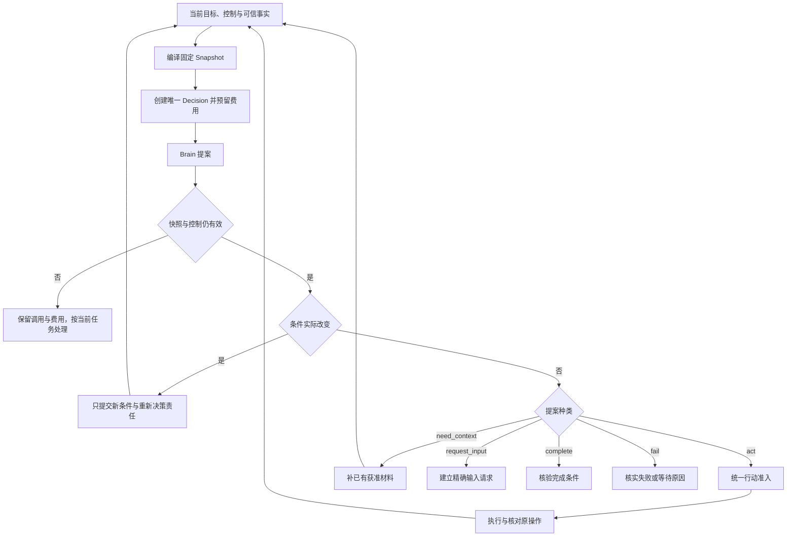

# 任务编排与完成裁决

Orchestrator 持有目标推进责任。它把用户要求转成可检查的条件，固定每轮决策输入，准入有界行动，并根据实际证据裁决完成。Brain 的提案和 Executor 的回执都是输入，均不能直接改写 Task 终态。

默认采用单 Task 串行裁决、跨 Task 并行。它牺牲单一热点任务的无限写吞吐，换取控制、预算和完成的一致判断；通过任务分片和有界委派扩展总体容量。

## 1 持久模型

默认 Orchestrator 运行在云端，Task、Requirement、目标版本、任务预算和 Result 的权威记录保存到其所属 PG 分片。本章的 Task 事务都指该数据库事务。端侧 SQLite 中的执行账本、TaskGate 或 Task 缓存不得代替完成裁决。只有显式启用[端侧独立 Orchestrator](../production/README.md#optional-edge-orchestrator)时，其自有 Task 才使用设备 SQLite。

Task 至少保存：固定 task_id/orchestrator_id/submit_command_id，原 goal_ref，goal_revision、control_revision、revision，准确 TaskPolicy，deadline，状态、控制、等待、当前条件和预算关联；另存 requirements_state、requirements_digest 及 ready 时的 current_coverage_ref。完整字段见[字典](../data/field-reference.md)。

- status 为 active、succeeded、failed、cancelled。后三者不可回到 active
- control 为 running 或 paused。暂停不是终态；等待是独立的、可以并存的依赖集合
- goal_revision 随目标或条件的实质变化递增。control_revision 随暂停、恢复、任何目标终态、目标修订及有效祖先控制变化递增；终态与向全部已绑定Executor传播TaskGate的Job共同提交
- revision 表示 Task 的可见业务修订。事实归并必须比较自己依赖的修订，不得把旧提案重新标成当前

OperationIntent、DecisionConsumption、PlanStepAdmission、ConditionCheck、GoalCoverage、BudgetReservation 和 Job 各保存准确关联。它们是 Task 内部职责记录，不新增公共执行权威。

当前未结效果、子委派及控制目标使用完整内部关联索引。公开响应返回 `CollectionSummary{collection_revision,total_count,unresolved_count,items_cursor}`，每页最多100项；计数、集合变更和 Task 修订共同提交。超出一帧不会截断事实。完成仍在原库核验完整索引和完整性标记，不信客户端页、缓存计数或异步汇总。这是本系列新增的集合合同。

## 2 把目标变成条件

Requirement 由本 Orchestrator 接纳。应用保存用户原文；Brain 或准确模板生成候选，均不能直接写权威条件或授予权限。完整来源、字段、采纳事务与例子见[原输入到条件](../data/requirement-lifecycle.md)，全局关联见[整体数据设计](../data/README.md)。

1. task.submit 固定完整 goal_ref，可无候选；首事务建立 Task、GoalRevision 1、预算、原回执及提炼 Job，requirements_state=collecting
2. 已登记模板作确定性映射，或正常 Decision 根据完整原文和准确附件提出 RequirementDelta；每个候选有局部键、描述、来源位置、规则、必要性和未解问题
3. Orchestrator 核验来源、语义、规则和权限边界。有歧义时创建绑定目标版本的 InputRequest；受信本人回答一次消费，普通第三方文字不能回答
4. 原 Task 事务保存 RequirementAdoption、不可变条件版本、GoalRevision 和后续责任。实质变化递增 goal/control revision；同一 Decision 的行动和完成建议失效，另行决策
5. GoalCoverage 对完整原目标及全部准确条件版本作映射。pass、当前适用且摘要匹配才 requirements_state=ready；失败/未知保留缺口，不以空条件成功

每项已接纳 Requirement 固定 requirement_id/revision、statement_ref、source_refs、origin、rule_ref、可选准确规则参数、required 和原 adoption_id。GoalRevision 选择有效条件集合；不原地删除历史条件。Brain 可以提出补充，不能自行删显式要求、降低必要性或改变目标含义。本人沿 steer/revise 改目标才允许此类修订。

未 ready 时仅允许获准提炼、澄清和受信条件/覆盖取证及必要收尾；普通目标行动和完成均被阻断。受信取证 Operation 明确 admission_purpose=requirement_check，仍经过所有授权、控制、预算和真实入口检查，不得借名执行有歧义的目标写入。admission_purpose 由 Orchestrator 根据固定提炼 Snapshot 或受信 check 来源裁决，Brain/调用方不能自报 requirement_check 绕过 ready。这样避免提炼与覆盖门禁互相等待。

相同语义不制造目标版本。先比较描述的语义、来源约束、规则参数和必要性；无变化复用原 Requirement/revision/adoption_id，仅保存本次 unchanged 消费记录。不得把新审计 ID 写入旧定义后制造摘要变化。实质条件变化的“一次交接后重新决策”遵循 [ADR 0006](../../adr/0006-adopt-requirements-before-actions.md)。

### 候选的增量与判等

RequirementDelta 首版是增量 upsert。未提到的条件保留；无 replaces_requirement_id 时先在当前活跃条件中按规范语义键匹配：唯一相同者复用原定义，确实不存在才新增；有该字段时必须同时给 replaces_revision，绑定当前准确旧定义。同批规范键重复、多项匹配或两项替换同一条件均以ambiguous_requirement_delta拒绝，也不支持隐式删除、拆分或合并。需要重划条件时由本人 task.revise 提交完整新目标，进入新的提炼周期；Brain 不得借“全集替换”删掉硬要求。

unchanged 按已登记规则的规范语义键判断：kind、required、rule_ref、按该规则规范化的准确参数，以及原要求来源绑定。仅换局部候选键或描述措辞不产生新定义；保留原 requirement_id/revision/adoption_id。质量标准若只存在自由文本中，其准确 criteria ContentRef 就是规则参数，不能用未记录的模型直觉断言两个文本等价。无法证明等价时请求澄清或明确修订，不静默降低条件。

## 3 一轮推进怎样提交

Snapshot、固定decision_id的DecisionDispatchIntent、原 Brain 命令、计数、预留和派发责任共同提交。Brain在自己的接纳事务创建Decision；只有明确共用同一Tx的装配可以合并这次交接。Brain 返回后，以 `(task_id,decision_id)` 唯一消费。暂停再恢复即使 control 又为 running，control_revision 已变，旧提案仍不可采用。

`need_context` 只能读取已有且获准的记忆、能力声明、内容或原事实。新搜索、网页抓取、手机观察都是行动，走 act。缺依赖时等待具体对象，不反复调模型探测恢复。

事实归并按 `(owner_id,object_id,revision)`：同修订同摘要幂等，同修订异摘要报冲突，旧修订不能覆盖新投影。新事实、当前效果集合、预算累计差额、Task 修订及后续 Job 同事务保存。终态仍接收真实效果、费用和证据缺陷，不能因此重开目标工作。

## 4 统一行动准入

四类来源使用同一准入规则：Brain Decision、固定 Plan 步骤、受信条件/覆盖检查、已获准程序Operation的hostcall。hostcall唯一键为(parent_operation_id,call_position)，固定input_digest、原Task/目标和environment_generation；只有认证Executor可提交，并核验原父Operation、环境及全部普通门禁。每类都有唯一来源键；核验器不得伪造 Brain 提案，插件也不能自报受信检查来源。

先在事务外完成所有会改变业务含义的模板、hook、资源规范化和参数绑定。固定最终金额、收件人、路径、正文、筛选、用途、Capability/Binding/InstallLock 版本。prepare 阶段不执行目标动作，也不消费该目标动作的一次性许可；准备所需资料的读取和处理仍须独立授权、计量。

随后进入一个短事务：

1. 锁定 Task 及有界祖先链，验证有效领取、当前 goal/control/策略与期限
2. 检查来源尚未消费、admission_purpose 与当前条件门禁一致，完整参数满足准确 Schema；确认不存在会阻塞本行动的未决效果或资源冲突
3. 检查当前授权依据、预算、累计续行上限和本服务容量
4. 同时保存不可变 OperationIntent、原执行命令、reservation、来源处理决定、未结集合关联与 dispatch Job

并行准入只适用于独立且不冲突的行动。依赖前项输出时等真实结果；GUI 每次变更之后重新观察，不能批量预批一串点击。派发和实际启动分别再查当前门禁，事务外远端资格按其有限窗口使用，不伪装成跨库原子读。

### 一份提案的批量准入

一个 Decision 的 actions 首版最多4项，只接受互相独立的行动。本方全收或全拒：在事务外准备全部准确输入；事务内一次核全部门禁、合计各单位预留，再共同保存全部 Intent、逐项原命令及 DecisionConsumption。任一成员不满足则不产生这批 Intent；保存固定拒绝/等待原因与原消费决定。条件实质变化仍优先只提交条件。远端 Grant 部分消费或各 Executor 结果可能不同，不得据 Orchestrator 数据库内的原子准入宣称外部效果全成或全败。依赖前项结果的动作改为后续 Decision 或明确启用的 Plan。

## 5 计划是候选生成器

默认 ReAct 足够。可选 Plan 是有界 DAG，固定 plan_id/revision/goal_revision、步骤、depends_on、pass_conditions 和参数模板。它不拥有第二个执行状态机。

计划安装比较 base_plan_ref；同提案的直接 actions 与 plan_delta 互斥。步骤准入键为 `(task_id,plan_id,plan_revision,step_id)`。Materializer 只复制字面量或从已核实原输出用固定 JSON Pointer 取值，不能执行表达式、网络或隐藏模型调用。未来step_output沿本计划版本的唯一PlanStepAdmission解析前项Operation/Delegation，固定已核实输出引用；目标指针只可写arguments或委派goal/input，禁止修改能力、主体、Grant、预算和控制。

默认前置 Operation 已关闭、effect=applied、无迟到效果且准确输出可用，才算执行依赖完成。评估 Operation 成功不意味着评估 verdict=pass；pass_conditions 必须引用当前所选且适用的条件判断。缺字段、版本变化或有效 fail 交给 Brain 修订，不从历史挑一个 pass。

修改计划使未准入旧步骤失效，已准入 Operation 保留。新计划复用旧成果需明确绑定准确旧输出并重查适用性。计划复用收益必须计入模板制作、失配、回退和维护成本，不能只报减少模型调用。

## 6 用户控制与内部子树

| 决定 | 新目标工作 | 已发生或可能发生的工作 |
| --- | --- | --- |
| pause | 停止新 Decision、评估和行动 | 原效果、费用、控制和清理继续核对；既有充分证据可完成 |
| resume | 仅解除本任务自身暂停，重查其余门禁 | 不清等待、不重置期限与累计费用 |
| cancel | 持久提交 cancelled，保存逐端控制责任 | 不宣称外部已停；迟到 applied 只补原事实 |
| revise | 新目标修订使旧提案和未派发候选失效 | 旧在途操作仍核对；冲突新动作等待旧效果核清 |

同 Orchestrator 的子任务在创建和准入时锁真实祖先链，父暂停限制子有效控制；父恢复不解除子自身暂停。默认最大深度4、每父活跃子数8，并另设整个活动子树总数上限64，确保控制事务锁集合有界。超限拒绝新子创建，不分页漏掉原子控制范围。

父取消先提交则新子创建失败；子创建先提交则被父控制覆盖。目标修订在同域事务取消旧目标活动子树，保留其效果及账务责任。跨 owner 的委派通过原命令关闭，只有对方确认才能声称停止；参见[协作](../collaboration/README.md)。

取消和成功竞争以先提交的终态为准。Task 截止到达时，若尚未成功，则 failed/deadline_exceeded；已发生效果不因此变成未发生。终态后改变目标，创建关联原任务的新 Task。

## 7 有限自主推进

固定 TaskPolicy 给出 continuation、repair、连续无进展、模型费用、单步尝试、上下文补充和总期限。初始试验值为100次累计续行、每轮最多3次补上下文、同一步最多2次额外安全尝试；产品档位可收紧，不能动态放宽以追求成功率。

新 Decision 或新的计划步骤准入各消费一次续行额度，重派同身份不重复计数。有效新输入、目标变化、可用结果或 unknown 核清可清零连续无进展；累计额度不清零。通知、账单变化、领取和轮询时间不算目标进展。每个原 Decision 的无效输出最多记一次。

达到上限后，有明确可恢复对象则保存等待和 resume_condition；期限或累计额度耗尽则按策略结束目标推进。原效果和费用仍核对。新调用更便宜、换 Brain 或重启都不能重置计数。

## 8 完成事务

完成前，先在事务外取得必要正文和检查报告。需要新模型评估时用普通 Operation、授权及预算；verify Job 不得绕过暂停。

最终事务锁定 Task，确认仍active、截止未到且目标/条件/成果修订匹配，再按稳定键锁证据 gates 和当前检查：

1. 目标覆盖记录对应当前完整目标、条件准确版本及 requirements_digest，当前适用且 pass，条件门禁 ready，无遗漏
2. 每项必要条件都有当前适用的 pass；绑定准确成果、规则、目标修订、资源、观察时点与覆盖范围
3. 完成所依赖的全部实现未命中当前已登记缺陷；跨域资格凭据满足策略窗口
4. 当前未结关联索引完整；全部已准入目标Operation已closed，未发送者也已永久封闭；没有 unknown 或仍可能迟到效果；内部子任务终结，外部目标行动已封闭
5. 共同保存固定 Result、选择的检查、门禁修订、succeeded、控制和必要收尾 Job

新 Operation/Delegation、条件变更与同一 Task 锁串行，因此不能在读到空集合后悄悄新增。费用尚未最终核清可以独立继续，但预留及结算责任保留。

Result.completion_basis 取必要条件中最弱依据：有用户验收则 user_accepted；否则有开放质量评估则 assessed；其余 verified。用户验收只替代允许验收的质量条件，不能消除必要效果、遗漏或未知。验证器正常退役不推翻旧证据；确认缺陷才按范围失效，已成功 Result 不改写，另附明确说明。

### Result 先成为业务事实

完成事务在 Orchestrator 原库写入不可变 Result（result_id/revision、全部选择依据、completed_at），Task.result_ref 是指向该记录的 ObjectRef。结果正文不要求在该事务内写远端对象存储。事务同时保存原结果导出/呈现 Job；Result.publisher 后续才将准确序列化副本发布为 Content。

`task.result` 可直接返回当前获准的权威记录，并另报 publication=pending/published/unavailable 与已发布时的 content_ref。副本失败不重新裁决完成，也不重跑模型；恢复使用原 result_id/publication/upload 身份。已接纳的成果 Content 在完成前已存在；新增 Result JSON 导出只是业务记录的可恢复副本。UI 分开显示“目标已完成”“结果副本待发布/交付”。完成 Tx 被取消或证据 gate 拒绝时，不产生权威 Result 或成功导出责任。

## 9 接口与访问边界

所有表项继承[共同方法合同](../protocol/method-contract.md)。A 表示 Orchestrator 的业务决定已在服务所属库提交；没有第二次任务成功状态机。

| 方法与并发前提 | 准确 payload | A 输出与业务决定 | 特有拒绝 reason / 恢复 |
| --- | --- | --- | --- |
| task.submit；创建 | core Schema 原字段，可选候选/原输入 | task_ref、requirements_state；目标/预算/首Job共同存在 | invalid_source、unsupported_policy、budget_unavailable；原command查接纳 |
| task.pause / resume；CAS | task_id、reason:string | task_ref、control_revision、control_targets:CollectionSummary；同态不增修订 | target_terminal→invalid_state；暂停不清未知效果 |
| task.cancel；CAS | task_id、reason:string | task_ref、status、control_revision、control_targets；原取消与传播责任已存 | 已cancelled同态A；其他终态target_terminal；CAS先于前态检查 |
| task.revise；CAS | task_id、base_goal_revision:Revision、goal_ref:ContentRef、source_ref:ObjectRef | task_ref、goal_revision、requirements_state=collecting；新完整目标、空待重建集合及旧活动子树取消责任 | target_terminal、untrusted_revision、revision_conflict；paused仍paused，不得自动resume |
| task.steer；目标版本；P→A/R | task_id、base_goal_revision、amendment_ref:ContentRef、source_submission_ref:ObjectRef、prepare_deadline:Time | 原命令下保存补充准备、推进控制修订并封旧目标准入；owner确定性发布完整目标包后A，返回task_ref/goal_revision | goal_update_pending、goal_changed；发布依赖不可用保持原accepted，不能恢复旧目标行动 |
| task.input；请求版本 | task_id、request_ref:ObjectRef、goal_revision、answer_ref:ContentRef | task_ref、consumed_request_ref；原请求、回答、目标变化或业务补充共同保存 | wrong_request_version、wrong_goal、already_consumed、invalid_answer；重复同命令回原决定 |
| task.accept_result；请求版本 | task_id、request_ref、goal_revision、candidate_ref:ContentRef、limitations_ref:ContentRef | task_ref、check_ref；只形成规则允许的质量验收，不直接succeeded | acceptance_not_allowed、candidate_changed、preview_mismatch |
| task.adjust_budget；CAS | task_id、limits:Amount[]、reason_ref:ContentRef | task_ref、budget；全单位目标上限一次变更，不能小于已承诺量来伪造回收 | commitment_exceeds_limit、policy_scope_exceeded；真实超支继续记账 |
| task.attach_evidence；命令与核验业务键 | task_id、goal_revision、requirement_ref、artifact_ref、evidence_refs:ContentRef[] | task_ref、check_request_ref；只保存核验责任，不把附件直接置pass | wrong_goal、unknown_requirement、source_forbidden |
| task.billing_reconcile；源版本 | core Schema 原计费源修订 | source_ref、work_revision；原结算责任已Raise | unknown_billing_binding、digest_conflict；主动查原账单 |
| task.read / result / list；查询 | 原对象；list按用户/状态及统一游标；result可指定result_ref | Task视图 / 权威Result及独立publication状态 / 分页集合 | 终态未成功时result返回invalid_state；导出副本未就绪不伪报Task失败 |

新 goal_ref 必须完整表达当前目标，并引用真实本人补充；应用的 session.steer 固定上述 task.steer 原命令；它不预先制造完整goal_ref或猜Task可见revision。原owner在同一持久准备中固定完整目标包，再按base_goal_revision裁决；task.revise是已有完整新目标的直接入口。补充语义有歧义时，在新目标的条件提炼阶段建立InputRequest，不用模型摘要覆盖原文。修订事务递增 goal/control/task revision；条件重建另按本章采纳。旧条件历史仍保留，语义相同可复用准确定义。

暂停与目标/控制修订使旧未采纳 Decision 失效。尚未开始且依赖旧控制的发送资格不得自动沿用；先按原 Intent 核清并封闭其旧发送入口，再基于当前快照决定后续。已可能发送的操作始终沿原身份核对。关闭旧入口不恢复已消费 once，也不重置同一步尝试与累计续行限额。

提交证据的检查业务键固定为(task_id,goal_revision,requirement_id/版本,artifact_ref,按准确引用排序的evidence_refs摘要)。不同command命中同键只关联原检查责任，不再次评估收费；新增证据或成果才产生新键。输入来源仍须受信当前权限核验。

### 原始补充怎样固定为完整目标

steer的准备不调用模型改写用户意思。GoalDocument使用固定结构保存initial_goal_ref及有序amendment_refs，ContextCompiler按顺序读取全部准确原文；语义冲突在新目标的条件提炼阶段澄清。首次accepted即在Task锁内固定pending_goal_command、requirements_state=collecting及控制传播责任。一个Task同一时刻只准备一个目标更新；后续新steer等待应用保序或得到goal_update_pending。完整目标包发布后，原事务核Task仍active、原base_goal_revision和pending命令一致，再更新goal_revision并清pending；用户pause保持paused。发布失败继续原责任，Task取消/截止则封闭该准备，绝不自动回到旧目标行动。
