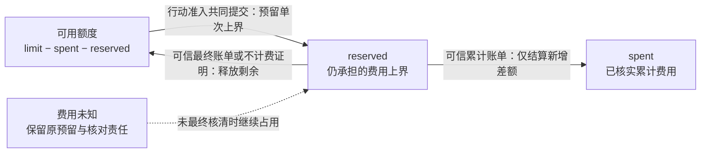
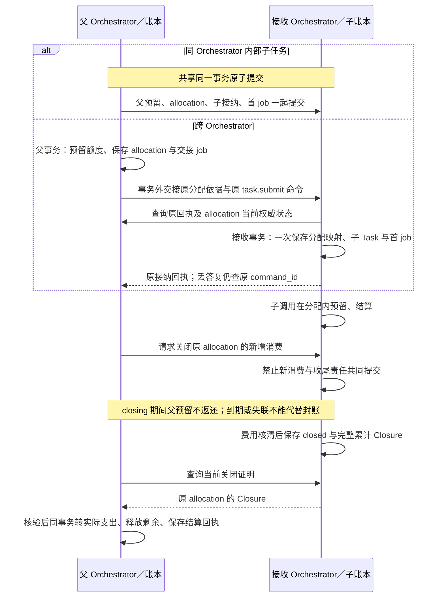

# 任务预算、分配与最终结算

报告任务在调用模型、读取收费资料或委派核实时，都要先知道本次最多占用多少额度。实际账单可能在行动结束后才到，编排器因此分别保存已核实支出、尚承担责任的预留和可用余额。本文定义这些数值和交接成功的含义；数据关联与并发算法见[账务记录](implementation.md#accounting-relations)及[结算实现](implementation.md#budget-handoff)。

## 从行动预留到原账单结清

默认严格额度只接纳具有可信单次上界的计费项：准入时预留上界，维持 `spent + reserved ≤ limit`；最终费用低于上界才释放差额。费用以精确十进制数、明确单位和计价版本记录，协议编码格式使用十进制字符串，禁止混用不同货币或把估计值当最终账单。调用次数、运行时间、模型 token 和费用各有独立限额，任一耗尽都阻止对应新工作。

下图描述单任务、单计价单位的正常严格预算。可用额度由余额推导，实线表示金额转移，虚线说明预留保留条件；调用答复本身不证明最终费用。

| 预算模式 | 允许使用的条件 | 保证边界 |
| --- | --- | --- |
| `strict` | 每项计费有可信单次上界；固定 allocation 始终使用此模式 | 提供方履约时维持 `spent + reserved ≤ limit`；违约账单仍须照实入账 |
| `estimate` | 本人接受准确策略和范围、当前资格有效；只限同一受信本地事务范围内未经过 allocation 的直接调用 | 以有限估算额决定启动，最终账单可超总限额；超额即停止新计费，不能称硬上限 |

模型费用不明时严格模式按上界保留，估算模式按已获准的有限估算额保留；自动查询次数耗尽只转为受信核对，不能按时释放。只有可信最终账单或可验证的不计费证明到达，才按原计费项结清或释放；迟到账单只应用累计差额，不能再次累计全部金额。本地并发槽与未知费用不是同一资源；具体边界见[大脑调用恢复](../brain/README.md#model-recovery)。

## 何时允许估算预算

无法提供可信最大费用的适配器仅可在用户明确接受的估算预算配置中，对未通过 allocation 分配的任务直接调用使用有限估算额预留；最终账单可能使 `spent + reserved > limit`。账本必须记录真实超额和原调用，立即停止新的计费工作，保留其余未知费用及结算，界面不能称这类限额为硬上限。固定额度的子任务或外部委派不得使用估算计费，除非另有经确认的超额交接合同；当前方案没有该合同。

估算模式由固定 TaskPolicy 声明允许的能力、费用单位、单次估算预留与总预算；策略本身不能代替用户同意。原 Orchestrator 的受信 TaskPolicyRegistry 在任务提交前按租户、认证用户和准确 `policy_ref` 保存本人估算接受事实，注明非硬上限、适用范围、预算上限和期限。`task.submit` 根据认证主体及租户核验该记录，在接纳事务中保存 Task 与接受记录的关联；缺失、过期或预算超范围即拒绝。模型或客户端布尔字段不能启用估算。

当前仅当原 Orchestrator 与全部涉及费用的 Grant owner 处于同一受信本地事务范围内、能直接核验该 Task 的内部接受关联时开放估算；跨域或无法核验时只允许 strict，不能从公开 Task.policy_ref 推定用户已接受。每次行动仍须重新核验该接受事实尚有效，并同时通过固定策略、适配器声明及在线 Grant owner 的当前资格；撤回只封闭新估算使用，不抹去原账单。任一 Grant 对费用单位要求硬上限时拒绝估算。

`task.adjust_budget` 只可在原接受范围内加额；超范围拒绝，另建采用已接受新策略的任务，不静默换掉现有 Task 的策略。受信策略管理入口是默认宿主必须实现的先决能力，目前未作为冻结的第三方协议方法；没有它的装配只能使用严格模式。跨域估算若要开放，须另冻结可认证的原 Task 资格查询或证明合同。

## 分配子额度并取得关闭证明

内部子任务的可支配额度从父任务 reserved 中划拨；父聚合报表展示子费用，但不再扣一遍。不同 Orchestrator 使用唯一 allocation_id 交接固定额度，父侧未证明子侧封闭后不返还。网络分区时额度宁可闲置，不同时在两端消费。

下图从父账本到接收账本展示同一固定 allocation；内部任务树可以共同提交，跨 Orchestrator 的两端分别持久接纳，箭头不表示跨库事务。

父方首次封账只将原 allocation 预留转支出一次，后续更正仅追累计差额；报表中的子费用不另加扣。关闭先于子接纳时，接收方保留拒绝迟到创建的预算关闭记录；预算关闭仅封闭新增消费，目标取消仍有独立控制责任。账务对象及两端身份见[账务关系](implementation.md#accounting-relations)，关闭竞争和封账后的费用更正见[预算实现](implementation.md#budget-handoff)。

## 真实超额与封账后更正

跨 Orchestrator 实际费用超过固定 allocation 时，可能是提供方突破可信单次上界，也可能是接收方把多笔各自合规调用放过总分配上限。接收方仍保存原调用与可信实际账单并封闭新增消费；父方核验账单后一次性把原 allocation 预留转为真实支出，超出部分如实记为债务。事故分别判断 provider_bound_breach 与 receiver_allocation_breach，两者可同时成立；未查明的原因保留待查标记，停止受影响的新计费／委派；不能截断账单、因超额拒收真实 Closure，或反复结算同一 allocation。证据不足时保留原预留与核对责任。严格额度的硬上限以提供方履行可信上界合同为前提，违约路径需要单独告警与验收。

已 settled 后仍可能收到原计费方的可信上调账单。接收方保持消费关闭，以更高费用修订和持久交回责任提交完整累计证明；父方恢复原结算意图，只追加累计差额，不倒流已释放额度或重开任务。更正导致超预算时记债并停新计费。事故归因、同修订冲突、原命令过期和退款边界集中见[最终结算](implementation.md#budget-handoff)。

## 预算方法与有界执行

| 方法 | 输入与持久结果 | 失败后的动作 |
| --- | --- | --- |
| `budget.allocate` | 父任务、allocation_id、接收方、单位、上限、期限；共同保存父预留与交接 job | 原 allocation 查询；不明时不另分同笔额度 |
| `budget.settle` | allocation_id、expected_revision、原接收方 RuntimeBudgetClosure | 同命令返回同结果；首次正常结算转预留为实际，违约全额记账；已 settled 的可信更正只按更高用量修订追累计差额，证据不足待核，旧 allocation 修订冲突 |
| `budget.read` | allocation_id、role=owner／receiver → 当前分配或接收门禁投影 | 仅对应权威服务返回当前事实；历史原回执不代替本查询 |
| `budget.close` | 原接收方、allocation_ref、原分配命令及父委派关联 → closing／closed | 与子接纳竞争同一接收门禁；未知分配也先关闭，最终证明另查 |
| `task.adjust_budget` | expected_revision、每项新上限 | 低于已消费及仍承担义务则冲突；加额不恢复暂停也不延长期限 |

每轮补上下文、累计续行、连续无进展、修复及单步尝试均有固定策略上限，用户等待期限和收尾查询采用有限配置。有效目标修订可在剩余额度内继续，不能重置累计次数；无进展上限只关闭或等待新目标推进，不证明成功。未知责任超出自动查询次数后转受信处置，仍可查询；不通过删除记录清空预算或设备互斥。

## 调整上限与恢复原结算

| 变化 | 共同保存的决定 | 尚不能据此认定的结果 |
| --- | --- | --- |
| 调整任务上限 | `task.adjust_budget` 比较当前修订，修改完整单位上限集合及必要等待 | 不修改已发生费用、预留、目标、暂停状态或期限；终态拒绝调额，估算模式不得超出原策略接受范围 |
| 分配子额度 | `budget.allocate` 固定 allocation_id、接收方、单位上限与期限；父侧预留和交接责任共同保存 | 父侧 `applied` 不表示远端接收方已接纳。分配始终要求严格上界，未确认交接时不能把同一额度另作分配 |
| 关闭并结算分配 | 接收方关闭新增消费，提供原分配、全部单位、最终累计修订及可核验关闭依据；父方核验后结算原预留 | 等待超时、Task 终态或接收方失联均不证明可回收额度 |
| 已结后的可信上调 | 接收方保存更高累计修订与可靠对账责任；父方只追加原分配的可信差额 | 不重开消费，不恢复已释放的预留，不改原 Task 终态；如造成超额则记录债务并阻止新计费 |

同编排器父子任务可以在共同事务内完成分配；跨编排器双方各自持久保存原交接。费用和关闭证据须来自固定负责方，不能仅凭一个内容引用或远端自报金额结算。可信费用已确认时先如实记账，提供方单次上界违约与接收方总额度违规分别调查，不能从超额总数直接推断责任。

结算答复丢失时查询或重投原命令。命令已过期但原累计账单尚未落实时，先查询原 allocation、当前修订及旧命令决定，再持久保存绑定同一账单修订和摘要的继任尝试；保留全部旧身份。竞争中发现该累计账单已经结算，即结束对账，不重复扣差额。可信退款或贷记走独立对账，不在上调分支减记支出。
